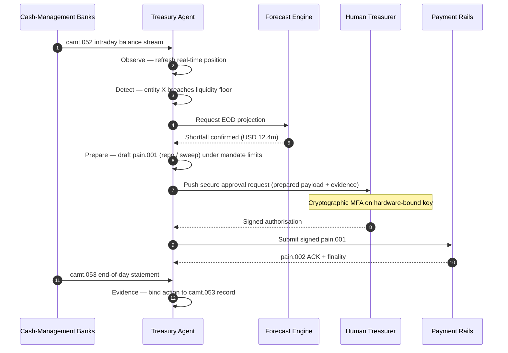

## २०२६ मधील स्वायत्त ट्रेझरी निर्देशांक: एजेंटिक ट्रेझरी, प्रोग्रामेबल लिक्विडिटी, टोकनाइज्ड ठेवी आणि रिअल-टाइम रोख नियंत्रण

स्वायत्त ट्रेझरी हा एजेंटिक AI, होलसेल पेमेंट्स, टोकनाइज्ड ठेवी आणि रिअल-टाइम लिक्विडिटी यांचा नैसर्गिक संगमबिंदू आहे. २०२६ मध्ये, सर्वोत्तम ट्रेझरी वास्तुरचना केवळ रोखीचा अंदाज बांधणार नाहीत; त्या खाती, चलने, रेल्स आणि सेटलमेंट मालमत्तांमध्ये मर्यादित लिक्विडिटी कृतींची शिफारस करतील, त्यांचे स्पष्टीकरण देतील आणि अखेरीस त्या अमलात आणतील.

---

> **कार्यकारी सारांश / मुख्य मुद्दे**
>
> - **ट्रेझरी अहवालाकडून नियंत्रणाकडे सरकत आहे.** रिअल-टाइम शिल्लक, अंदाज, पेमेंट स्थिती आणि लिक्विडिटी हालचाल हे एका वर्कफ्लोचा भाग होत आहेत.
> - **एजेंटिक AI एक नवा ट्रेझरी इंटरफेस निर्माण करते.** एजंट पोझिशन्सवर लक्ष ठेवू शकतात, विसंगती समोर आणू शकतात, निधी कृतींची तयारी करू शकतात आणि निश्चित अधिकारपत्रांच्या मर्यादेत निर्णय वरच्या स्तरावर पाठवू शकतात.
> - **प्रोग्रामेबल मनी रोख टप्पा बदलते.** टोकनाइज्ड ठेवी आणि होलसेल CBDC प्रयोग हे अणुरूप सेटलमेंट, सशर्त पेमेंट्स आणि सदैव-चालू लिक्विडिटीसाठी नव्या शक्यता निर्माण करतात.
> - **निर्देशांकाने अधिकार मोजला पाहिजे.** प्रश्न हा नाही की एजंट एखादी कृती सुचवू शकतो का; प्रश्न हा आहे की अधिकार, मर्यादा, मंजुरी आणि पुरावा स्पष्ट आहेत का.
> - **ट्रेझरी मूल्य मोजता येण्याजोगे आहे.** वाचवलेली लिक्विडिटी, कमी झालेल्या मॅन्युअल तपासण्या, टाळलेल्या सेटलमेंट अपयशे आणि मुक्त झालेले खेळते भांडवल यांनी यश परिभाषित केले पाहिजे.
>
---

## हा निर्देशांक २०२६ मध्येच का महत्त्वाचा आहे

स्टॅनफोर्ड AI निर्देशांक उपयुक्त आहे कारण तो वेगाने बदलणाऱ्या तंत्रज्ञान क्षेत्राला अशी गोष्ट मानतो जी मोजता येते: संशोधन उत्पादन, तांत्रिक कामगिरी, जबाबदार अंमलबजावणी, अर्थशास्त्र, क्षेत्रीय स्वीकार, धोरण आणि सार्वजनिक भावना हे सर्व एका चौकटीत आणले जातात ([Stanford HAI ⧉](https://hai.stanford.edu/ai-index/2026-ai-index-report "The 2026 AI Index Report")). आता बँका आणि वित्तीय संस्थांना पायाभूत सुविधांसाठी हीच शिस्त हवी आहे. एजेंटिक AI, क्वांटम-सुरक्षित सुरक्षा, क्लाउड नेटिव्ह लवचिकता आणि होलसेल पेमेंट्स हे यापुढे वेगळे नावीन्यपूर्ण मार्ग राहिलेले नाहीत; ते एका ऑपरेटिंग मॉडेलमध्ये एकत्र येत आहेत.

बँकेसाठी व्यावहारिक प्रश्न हा नाही की प्रत्येक क्षेत्र महत्त्वाचे आहे का. प्रश्न हा आहे की ती संस्था या सर्वांवरील सज्जता एकाच वेळी मोजू शकते का. एखादी बँक एजेंटिक AI अमलात आणू शकते आणि तरीही तिची क्रिप्टोग्राफी स्थलांतरासाठी सज्ज नसेल तर ती नाजूक राहते. ती क्लाउड प्लॅटफॉर्म आधुनिक करू शकते आणि तरीही पेमेंट डेटा असंरचित राहिला तर ती अपयशी ठरते. ती टोकनायझेशन पायलट चालवू शकते आणि तरीही सेटलमेंट, लिक्विडिटी, ओळख आणि ऑडिट स्तर एकत्र रचले गेले नाहीत तर प्रणालीगत जोखीम निर्माण करू शकते.

## २०२६ निर्देशांक वास्तुरचना

| निर्देशांक स्तर | २०२६ दिशा | सज्जता मापदंड | चुकीच्या हाताळणीची जोखीम |
|---|---|---|---|
| **दृश्यमानता** | खाते, पेमेंट, लिक्विडिटी आणि एक्सपोजर डेटा एकत्रित करा | रिअल-टाइम रोख पोझिशन्सचे कव्हरेज | विखंडित रोख दृश्यमानता |
| **अंदाज** | शिल्लक, प्रवाह आणि निधी गरजांचा अंदाज बांधण्यासाठी AI वापरा | अंदाज अचूकता आणि अपवाद दर | कमकुवत डेटावर खोटा आत्मविश्वास |
| **स्वायत्तता** | शिफारसी आणि कृतींसाठी एजंटांना मर्यादित अधिकार द्या | अधिकारपत्र कव्हरेज आणि मंजुरी गुणवत्ता | अनधिकृत किंवा अस्पष्ट कृती |
| **प्रोग्रामेबिलिटी** | जिथे मूल्य वाढते तिथे टोकनाइज्ड ठेवी आणि स्मार्ट अटी वापरा | सशर्त पेमेंट आणि अणुरूप सेटलमेंट वापर-प्रकरणे | तंत्रज्ञान-प्रेरित ट्रेझरी पायलट |
| **नियंत्रणे** | मर्यादा, निर्बंध, FX, लिक्विडिटी आणि ऑडिट नियंत्रणे अंतर्भूत करा | प्रति ट्रेझरी कृती नियंत्रण पुरावा | अंमलबजावणीनंतर मॅन्युअल प्रशासन |

## ट्रॅक करण्यासारखे सध्याचे संकेत

| संकेत | बँकांसाठी त्याचा अर्थ काय | स्रोत |
|---|---|---|
| **वित्तीय सेवांमध्ये ५२% एजेंटिक AI स्वीकार** | ट्रेझरी आता प्रशासित प्लॅटफॉर्मद्वारे एजेंटिक वर्कफ्लो सामावून घेऊ शकते | [Cambridge CCAF ⧉](https://www.jbs.cam.ac.uk/faculty-research/centres/alternative-finance/publications/2026-global-ai-in-financial-services-report/ "2026 Global AI in Financial Services Report") |
| **Project Agorá सशर्त पेमेंट्स** | टोकनायझेशन सशर्त आणि सदैव-चालू पेमेंट क्षमता सक्षम करू शकते | [BIS ⧉](https://www.bis.org/about/bisih/topics/fmis/agora.htm "Project Agorá") |
| **Bank of England डिजिटल सिक्युरिटीज सँडबॉक्स** | DLT-जारी केलेले रोखे आणि समभाग Delivery-versus-Payment (DvP) आधारावर सेटल होतात — मालमत्ता टप्पा आणि रोख टप्पा (होलसेल CBDC किंवा टोकनाइज्ड व्यावसायिक-बँक ठेवी) एकाच अणुरूप व्यवहारात सेटल होतात, ज्यामुळे मुद्दल प्रतिपक्ष जोखीम दूर होते | [Bank of England ⧉](https://www.bankofengland.co.uk/financial-stability/digital-securities-sandbox "Digital Securities Sandbox") |
| **SWIFT संरचित पत्ता अंतिम मुदत** | ट्रेझरी डेटा स्रोतावरच योग्यरीत्या घेतला गेला पाहिजे | [SWIFT ⧉](https://www.swift.com/news-events/news/iso-20022-milestone-november-2026-unstructured-addresses-be-removed "ISO 20022 November 2026 structured address milestone") |
| **मोठ्या FIs ना AI मूल्य मोजणे कठीण जाते** | ट्रेझरी ऑटोमेशनला ठोस आर्थिक मापदंड हवेत | [Cambridge CCAF ⧉](https://www.jbs.cam.ac.uk/faculty-research/centres/alternative-finance/publications/2026-global-ai-in-financial-services-report/ "2026 Global AI in Financial Services Report") |

## ट्रेझरी एजंटचा अधिकारपत्र

ट्रेझरी एजंटची रचना सर्वसाधारण-हेतू सहाय्यक म्हणून करू नये. त्याला एक अधिकारपत्र हवे: खाती निरीक्षणे, अपवाद ओळखणे, निधी तुटीचा अंदाज बांधणे, कृती तयार करणे, मंजुरीची विनंती करणे, मर्यादेत अंमलबजावणी करणे आणि पुरावा तयार करणे. प्रत्येक टप्प्याला वेगळे अधिकार मॉडेल असले पाहिजे.

नियंत्रण चक्र चालते Observe → Detect → Forecast → Prepare → Request Approval — आणि थांबते. एजंट स्वतःहून कधीही क्रिप्टोग्राफिक अधिकृतीकरण सीमा ओलांडत नाही. खालील आकृती एक पूर्ण चक्र रेखाटते: `camt.052` टेलिमेट्रीमध्ये बहु-दशलक्ष-डॉलरची इंट्राडे लिक्विडिटी तूट समोर येते, एजंट दिवसाअखेरची पोझिशन अंदाजते, पूर्ण-तयार `pain.001` म्हणून repo किंवा आंतरकंपनी स्वीप तयार करते, आणि हार्डवेअर-बद्ध कीवर बहु-घटक क्रिप्टोग्राफिक स्वाक्षरीसाठी ते मानवी ट्रेझररकडे सोपवते. त्यानंतर एजंट स्वाक्षरी केलेला पेलोड सादर करते; अंतिमता `pain.002` ACK आणि पुढील नोंदीच्या `camt.053` रूपात येते.

सीमा हाच मुख्य मुद्दा आहे — खरा पैसा हलवणारी प्रत्येक कृती अशा क्रिप्टोग्राफिक गेटमागे असते जे एजंट स्वतःहून पूर्ण करू शकत नाही.

## प्रोग्रामेबल लिक्विडिटी

प्रोग्रामेबल लिक्विडिटी म्हणजे अटींखाली मूल्य हलवण्याची क्षमता: एखादी मर्यादा ओलांडली गेली तर, तारण पात्र असेल तर, प्रतिपक्ष तपासणी उत्तीर्ण करत असेल तर, सेटलमेंट अंतिमता उपलब्ध असेल तर, किंवा इंट्राडे लिक्विडिटी बफर खूप कमी असेल तर. टोकनाइज्ड ठेवी आणि होलसेल सेटलमेंट प्लॅटफॉर्म हे नमुने अधिक व्यावहारिक बनवतात.

प्रोग्रामेबल म्हणजे मानकाबाहेर असे नव्हे. अंमलबजावणी मार्ग म्हणजे `pain.001` — [ISO 20022](/2023-09-29-automating-iso-20022-compliant-payment-file-creation-with-pain001/index.html) Customer Credit Transfer Initiation. एजंटची तयार केलेली कृती ही पूर्ण-तयार `pain.001` पेलोड असते, जो एखादा कॉर्पोरेट ERP वापरेल त्याच वाहिनीतून बँकेकडे राउट केला जातो, त्याच स्कीमाविरुद्ध पडताळला जातो, त्याच फसवणूक आणि निर्बंध इंजिनांकडून स्कोअर केला जातो, आणि त्याच `pain.002` स्थिती अहवालांवर पोच दिली जाते. सशर्ततेचा स्तर (मर्यादा, तारण पात्रता, अंतिमता उपलब्धता, बफर मजला) संदेशाच्या वर राहतो — तो *`pain.001` पाठवला जावा की नाही* हे नियंत्रित करतो, तो *कोणत्या आकाराचा असावा* हे नाही. अटी व्यक्त करण्यासाठी खास बनवलेले पेलोड शोधून काढणारे ट्रेझरी प्लॅटफॉर्म बँक-सुसंगत मार्गातून बाहेर पडतील आणि पुन्हा द्विपक्षीय एकत्रीकरणाकडे जातील.

## ट्रेझरी नियंत्रण कक्ष

ऑपरेटिंग मॉडेल एका नियंत्रण कक्षासारखे दिसले पाहिजे: पोझिशन्स, अंदाज, पेमेंट स्थिती, मर्यादा वापर, अपवाद, मंजुरी आणि पुरावा एकाच इंटरफेसमध्ये. निर्देशांकाने अशा ट्रेझरी स्टॅक्सना दंड द्यावा ज्यांना टीमना ईमेल, स्प्रेडशीट, बँक पोर्टल आणि विसंगत डॅशबोर्ड एकत्र जोडावे लागतात.

त्या इंटरफेसमागील डेटा प्लेन म्हणजे ISO 20022 रोख व्यवस्थापन. इंट्राडे पोझिशन म्हणजे `camt.052` — Bank-to-Customer Account Report — जो प्रत्येक रोख-व्यवस्थापन बँकेकडून बँक प्रकाशित करते त्या वारंवारतेने एजंटच्या निरीक्षण स्तरात प्रवाहित केला जातो (tier-1 GTB पुरवठादारांसाठी मिनिटांत, लांब शेपटीसाठी चक्राच्या अखेरीस). दिवसाअखेरचे मेळ म्हणजे `camt.053` — Bank-to-Customer Statement — तो ऑडिट-योग्य नोंद जिच्याविरुद्ध एजंटचा अंदाज दुसऱ्या दिवशी सकाळी तपासला जातो. PDF स्टेटमेंट वाचणारे किंवा बँक पोर्टल स्क्रीन-स्क्रेप करणारे ट्रेझरी प्लॅटफॉर्म निर्देशांकाचा स्तर ४ पूर्ण करू शकत नाहीत; अंदाज चक्र वेळेत बंद होऊन कृती करता यावी यासाठी इंट्राडे टेलिमेट्री संरचित `camt.052` म्हणून येणे आवश्यक आहे.

## बँकेच्या प्रकारानुसार याचा अर्थ काय

### जागतिक प्रणालीगतदृष्ट्या महत्त्वाच्या बँका

जागतिक बँकांनी हा निर्देशांक एंटरप्राइझ आर्किटेक्चर स्कोअरकार्ड म्हणून हाताळावा. प्राधान्य आणखी एका संकल्पना-सिद्धीला नाही; ते या पुराव्याला आहे की स्वायत्त वर्कफ्लो, क्रिप्टोग्राफिक स्थलांतर, क्लाउड अवलंबित्व आणि पेमेंट आधुनिकीकरण हे एकाच जोखीम आणि मूल्य प्रणाली म्हणून प्रशासित करता येतात.

### व्यवहार बँका आणि कॉर्पोरेट बँका

व्यवहार बँकांनी होलसेल पेमेंट्स, संरचित डेटा, लिक्विडिटी, टोकनाइज्ड ठेवी आणि एजेंटिक ट्रेझरी सेवांवर लक्ष केंद्रित करावे. सर्वाधिक मूल्यवान ग्राहक प्रस्ताव केवळ वेगवान पैसा हालचाल नाही; तो कमी तपासण्यांसह आणि उत्तम खेळते-भांडवल दृश्यमानतेसह स्पष्टीकरणयोग्य, ऑडिट-योग्य, प्रोग्रामेबल पैसा हालचाल आहे.

### प्रादेशिक बँका

प्रादेशिक बँकांनी कार्यक्रम पसरण्यापासून वाचण्यासाठी हा निर्देशांक वापरावा. त्यांना प्रत्येक आघाडीवर नेतृत्व करण्याची गरज नाही, पण AI प्रशासन, पोस्ट-क्वांटम सूची, क्लाउड निर्गमन पुरावा आणि पेमेंट डेटा सज्जता यांवर विश्वासार्ह भूमिका मात्र त्यांना हव्यात.

### फिनटेक, PSPs आणि पायाभूत सुविधा पुरवठादार

फिनटेक आणि पायाभूत सुविधा पुरवठादारांनी त्यांचे उत्पादन आराखडे मोजता येण्याजोग्या बँक सज्जतेशी जुळवावेत. सर्वोत्तम प्रस्ताव एकत्रीकरण जोखीम कमी करतील, पुरावा मजबूत करतील आणि गुंतागुंतीच्या पायाभूत सुविधा बँकांना प्रशासित करणे सोपे करतील.

## निष्कर्ष

निर्देशांक-शैलीच्या अहवालाचे मूल्य हे आहे की तो एका विखंडित तंत्रज्ञान कार्यसूचीला मोजता येण्याजोग्या ऑपरेटिंग मॉडेलमध्ये रूपांतरित करतो. २०२६ मध्ये, वित्तीय पायाभूत सुविधांमधील विजेते सर्वाधिक पायलट असणाऱ्या संस्था नसतील. ते अशा संस्था असतील ज्या स्वायत्तता, सुरक्षा, लवचिकता, सेटलमेंट, अर्थशास्त्र आणि प्रशासन यांवर सज्जता एकाच वेळी सिद्ध करू शकतात.

## वारंवार विचारले जाणारे प्रश्न

**स्वायत्त ट्रेझरी म्हणजे काय?**

स्वायत्त ट्रेझरी म्हणजे निश्चित नियंत्रणांच्या मर्यादेत ट्रेझरी कृतींवर लक्ष ठेवण्यासाठी, त्यांची शिफारस करण्यासाठी आणि संभाव्यतः त्या अमलात आणण्यासाठी AI एजंट, रिअल-टाइम डेटा आणि प्रोग्रामेबल पेमेंट्सचा वापर.

**ट्रेझरी एजंटांना पेमेंट्स अमलात आणण्याची परवानगी असावी का?**

केवळ अरुंद अधिकारपत्रे, कडक मर्यादा, स्पष्ट मंजुरी आणि पूर्ण ऑडिट-योग्यतेच्या मर्यादेतच. अंमलबजावणीचा अधिकार परिपक्वतेतून मिळवला गेला पाहिजे.

**टोकनाइज्ड ठेवी ट्रेझरीला कशी मदत करतात?**

त्या व्यावसायिक-बँक पैशाचे संबंध जपत, प्रोग्रामेबल सेटलमेंट, अणुरूप अंमलबजावणी आणि संभाव्यतः उत्तम इंट्राडे लिक्विडिटी नियंत्रणाला आधार देऊ शकतात.

**अंमलबजावणीचा पहिला टप्पा कोणता?**

स्वायत्तता देण्यापूर्वी रिअल-टाइम दृश्यमानता आणि डेटा गुणवत्ता उभी करा. जी रोख एजंट अचूकपणे पाहू शकत नाहीत, ती ते सुरक्षितपणे अनुकूलित करू शकत नाहीत.

## संदर्भ

- Cambridge Centre for Alternative Finance, (2026). [2026 Global AI in Financial Services Report ⧉](https://www.jbs.cam.ac.uk/faculty-research/centres/alternative-finance/publications/2026-global-ai-in-financial-services-report/ "2026 Global AI in Financial Services Report").
- SWIFT, (2026). [ISO 20022 November 2026 structured address milestone ⧉](https://www.swift.com/news-events/news/iso-20022-milestone-november-2026-unstructured-addresses-be-removed "ISO 20022 November 2026 structured address milestone").
- BIS Innovation Hub, (2026). [Project Agorá ⧉](https://www.bis.org/about/bisih/topics/fmis/agora.htm "Project Agorá").
- Bank of England, (2026). [Shaping the UK's digital financial future ⧉](https://www.bankofengland.co.uk/speech/2025/january/sasha-mills-speech-at-the-tokenisation-summit "Shaping the UK's digital financial future").
