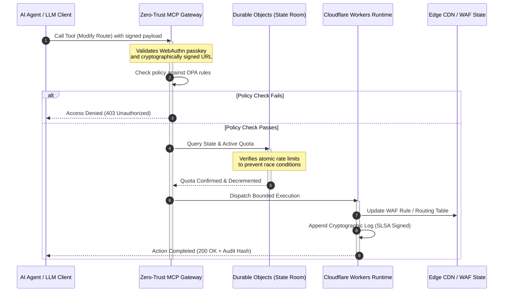

## CloudCDN: 2026 मधील AI-नेटिव्ह एजसाठी एक ओपन-सोर्स ब्लूप्रिंट

CDN वरील वादविवाद संपला आहे. एज आता कॅश राहिलेले नाही; ते AI-नेटिव्ह सॉफ्टवेअरसाठीचे कंट्रोल प्लेन आहे. जसे एजंट्स टूल्स कॉल करतात, डेटा हलवतात, कॅश शुद्ध करतात, स्वाक्षरीकृत URL ची विनंती करतात, आणि वर्कफ्लो समन्वयित करतात, तसे अपारदर्शक डॅशबोर्ड आणि मालकीहक्क कंट्रोल प्लेनचे जुने प्रारूप केवळ गैरसोय राहात नाही तर नियामक दायित्व बनते. CloudCDN एका वेगळ्या प्रारूपाची बाजू मांडते: एक खुले, तपासण्यायोग्य, एजंट-नियंत्रित एज प्लॅटफॉर्म जे सुरक्षा, सुगम्यता, कार्यक्षमता, आणि ऑडिटयोग्यता यांना विक्रेत्याच्या आश्वासनांऐवजी अंमलात आणण्यायोग्य डीफॉल्ट्स मानते.

या लेखासाठीचा ओपन-सोर्स संदर्भ बिंदू [cloudcdn.pro ⧉](https://github.com/sebastienrousseau/cloudcdn.pro "cloudcdn.pro") आहे. हे रिपॉझिटरी एक मल्टी-टेनंट, AI-नेटिव्ह CDN आहे जे संपूर्णपणे वाचता येते आणि स्वतंत्रपणे तैनात करता येते: Cloudflare PoPs वर उप-100ms TTFB, MCP नियंत्रण, Durable Objects रेट लिमिटिंग, WCAG-AA सुगम्यता, स्वाक्षरीकृत URL, पासकी, SLSA Level 3, आणि 100% कव्हरेजवर 3,185 चाचण्या.

---

> **कार्यकारी सारांश / मुख्य मुद्दे**
>
> - **एज कार्यसंचालन सीमा बनते.** CloudCDN मानक CDN नोड्सना उप-मिलिसेकंद सुरक्षा, राउटिंग, आणि प्रवेश नियंत्रण अंमलात आणणाऱ्या सक्रिय पॉलिसी गेट्समध्ये रूपांतरित करते.
> - **Durable Objects रेट लिमिटिंगला अणुस्तरीय बनवतात.** रिअल-टाइम, जागतिकदृष्ट्या सुसंगत कोटा अंमलबजावणी ती रेस-कंडिशन खिडकी बंद करते जी अखेरीस-सुसंगत लिमिटर्स हल्लेखोर आणि खराब कार्य करणाऱ्या एजंट्ससाठी खुली ठेवतात.
> - **एजंट्स 42 मर्यादित MCP टूल्सद्वारे पायाभूत सुविधा चालवतात.** काहीही अंमलात येण्यापूर्वी प्रत्येक आमंत्रण WebAuthn पासकी, स्वाक्षरीकृत पेलोड, आणि OPA पॉलिसीच्या विरोधात प्रमाणित केले जाते.
> - **सप्लाय चेन हा उत्पादनाचा भाग आहे.** Sigstore/Cosign द्वारे SLSA Level 3 प्रोव्हिनन्स प्रत्येक रिलीजला त्याच्या ऑडिट केलेल्या स्रोताशी क्रिप्टोग्राफिकदृष्ट्या जोडते.
> - **टेलिमेट्री हा अनुपालन पुरावा आहे.** एज कार्यसंचालन थेट DORA Article 5, BCBS 239, आणि Basel III कार्यसंचालन-जोखीम भांडवलाशी मॅप होते — नंतरच्या अहवालाद्वारे नव्हे.
>
---

## हा ओपन-सोर्स प्रकल्प 2026 मध्ये का महत्त्वाचा आहे

2026 मधील एंटरप्राइझ IT स्थिर पायाभूत सुविधा तरतुदीपासून रिअल-टाइम, इव्हेंट-चालित डेटा ऑर्केस्ट्रेशनकडे सरकले आहे. दोन बाजार शक्ती हा बदल घडवून आणतात.

पहिली म्हणजे एजेंटिक AI चा प्रसार. स्वायत्त मॉडेल्स आणि सॉफ्टवेअर एजंट्स आता जटिल कार्यसंचालन कार्ये पार पाडतात — स्वयंचलित धोका शमन, राउटिंग निर्णय, रिअल-टाइम लेजर संतुलन. ते डॅशबोर्ड वापरत नाहीत. ते टूल्स कॉल करतात.

दुसरी म्हणजे [Digital Operational Resilience Act (DORA) ⧉](https://eur-lex.europa.eu/legal-content/EN/TXT/?uri=CELEX%3A32022R2554 "Regulation (EU) 2022/2554 on digital operational resilience for the financial sector") ची सक्रिय अंमलबजावणी. बँकिंग संस्था यापुढे अपारदर्शक, मालकीहक्क तृतीय-पक्ष CDN वर विसंबून राहू शकत नाहीत. नियामक सॉफ्टवेअर सप्लाय चेनमध्ये संपूर्ण दृश्यमानता, पडताळण्यायोग्य निर्गमन क्षमता, आणि न बदलता येणाऱ्या क्रिप्टोग्राफिक ऑडिट ट्रेल्सची मागणी करतात.

केंद्रीकृत सर्व्हर आर्किटेक्चर विलंब दंड लादतात जे रिअल-टाइम ऑर्केस्ट्रेशन सामावून घेऊ शकत नाही. मालकीहक्क CDN ब्लॅक बॉक्ससारखे कार्य करतात जे संस्थांना अशा सप्लाय-चेन तडजोडीला उघड करतात जी त्या पाहू शकत नाहीत, पुरावा देणे तर दूरच. CloudCDN एका पारदर्शक, झिरो-ट्रस्ट, ओपन-सोर्स ब्लूप्रिंटसह ती दरी भरून काढते जे एजला सक्रिय कंट्रोल प्लेनमध्ये रूपांतरित करते. तंत्रज्ञान कार्यकारी अधिकाऱ्यांसाठी, ते संभाषणाला अनुपालनाच्या खर्चापासून लवचिकतेवरील परताव्याकडे वळवते: स्वयंचलित, ऑडिट-सज्ज कार्यसंचालन पाइपलाइनद्वारे जतन केलेले भांडवल.

## आर्किटेक्चर दृष्टिकोन

CloudCDN आर्किटेक्चर पाच स्तरांमध्ये संरचित आहे, केंद्रीकृत मिडलवेअरच्या जागी स्थानिकीकृत, स्टेटफुल एज प्रिमिटिव्ह्ज आणत आहे:

| स्तर | रचना निर्णय | ते का महत्त्वाचे आहे | चुकीच्या हाताळणीत जोखीम |
|---|---|---|---|
| **एज रनटाइम** | Cloudflare Workers आणि Pages | केंद्रीकृत VM विलंब दूर करते; जागतिक स्तरावर उप-मिलिसेकंद धोरणे अंमलात आणते | धोरण शिस्तीशिवाय कार्यक्षमता लाभ अनागोंदी एज ड्रिफ्ट निर्माण करतात |
| **स्थिती समन्वय** | Durable Objects | प्रदेशांमध्ये रेट लिमिट्स आणि सामायिक स्थितीसाठी अणुस्तरीय, रिअल-टाइम सुसंगततेची हमी देते | वितरित रेस कंडिशन, API संसाधन गैरवापर, परिघ कोटा वगळणे |
| **एजंट इंटरफेस** | झिरो-ट्रस्ट MCP गेटवे | 42 विशेष MCP टूल्स उपलब्ध करून देते जेणेकरून AI एजंट्स नियंत्रित मर्यादांखाली पायाभूत सुविधा चालवतात | अमर्याद टूल आमंत्रण आणि अनधिकृत कॉन्फिगरेशन बदल |
| **प्रवेश नियंत्रण** | WebAuthn पासकी आणि स्वाक्षरीकृत URL | ऑडिटयोग्य कार्यसंचालनासाठी स्थिर पासवर्डच्या जागी क्रिप्टोग्राफिक स्वाक्षऱ्या आणते | दुर्बलपणे श्रेय दिलेले बदल; परिघ भंगाकडे नेणारी क्रेडेन्शियल चोरी |
| **गुणवत्ता गेट्स** | SLSA Level 3 आणि 100% चाचणी कव्हरेज | बिल्ड स्रोताची गणितीयदृष्ट्या पडताळणी करते; दुर्भावनापूर्ण अवलंबित्व इंजेक्शन अवरोधित करते | सॉफ्टवेअर सप्लाय चेनद्वारे घातलेला दुर्भावनापूर्ण कोड |

## मागोवा घ्यायचे कार्यसंचालन संकेत

एज सज्जता मोजण्यायोग्य आहे. हे असे परिमाणात्मक निर्देशक आहेत जे हेतूऐवजी अंमलबजावणी क्षमता दर्शवतात:

| संकेत | मेट्रिक / बेंचमार्क | नियामक संदर्भ | प्लॅटफॉर्म अंमलबजावणी |
|---|---|---|---|
| **42 MCP टूल्स** | स्वयंचलित व्यवस्थापनासाठी मर्यादित टूल-रजिस्ट्री संख्या | COBIT 2019 (BAI06) | OPA धोरणांच्या विरोधात एजंट स्वाक्षऱ्या प्रमाणित करणारा MCP गेटवे |
| **Durable Objects** | झिरो-लीक, उप-मिलिसेकंद अणुस्तरीय कोटा अंमलबजावणी | DORA Article 6 | जागतिक API कोटा स्थितीचा मागोवा घेणारे Durable Objects |
| **पासकी आणि स्वाक्षरीकृत URL** | 100% अ‍ॅडमिन सत्रे FIDO2 WebAuthn द्वारे पडताळलेली | DORA Article 30 | एज राउटरमध्ये अंतर्भूत क्रिप्टोग्राफिक स्वाक्षरी तपासण्या |
| **SLSA Level 3** | क्रिप्टोग्राफिकदृष्ट्या स्वाक्षरीकृत बिल्ड मॅनिफेस्ट (Sigstore) | DORA Article 30 | स्वाक्षरीकृत बिल्ड मेटाडेटा निर्माण करणाऱ्या GitHub Actions पाइपलाइन |
| **3,185 युनिट चाचण्या** | 100% कव्हरेज; प्रत्येक रिलीजवर रिग्रेशन गेट्स | NIST CSF 2.0 (PR.DS-01) | कोणत्याही चाचणी अपयशावर तैनाती थांबवणाऱ्या CI पाइपलाइन |

## CDN एक सक्रिय कंट्रोल प्लेन बनते

पारंपरिक CDN निष्क्रिय, स्थिर आशय गतिवर्धनाभोवती रचले गेले होते. CloudCDN हे प्रारूप पुन्हा परिभाषित करते. Cloudflare Workers आणि Durable Objects एकत्रित केल्याने, एज एक सक्रिय, स्टेटफुल पॉलिसी गेट म्हणून कार्य करते.

जेव्हा एखादा AI एजंट किंवा स्वयंचलित प्रक्रिया पायाभूत सुविधा कॉन्फिगरेशन बदल किंवा राउटिंग समायोजनाची विनंती करते, तेव्हा ते असुरक्षित, केंद्रीकृत डेटाबेसशी बोलत नाही. विनंती जवळच्या एज नोडवर अडवली जाते आणि काहीही अंमलात येण्यापूर्वी ओळख, धोरण, आणि कोटा तपासण्यांमधून नेली जाते:

त्या क्रमातील प्रत्येक पायरी एक श्रेय देण्यायोग्य, स्वाक्षरीकृत नोंद निर्माण करते. आशय गतिवर्धित करणारे CDN आणि नियंत्रित करता येणारे कंट्रोल प्लेन यांच्यातील हाच फरक आहे.

## ओपन सोर्स ट्रस्ट प्रारूप का बदलते

मुख्य माहिती सुरक्षा अधिकाऱ्यांसाठी, अपारदर्शक मालकीहक्क CDN एक वाढती जोखीम सादर करतात. क्लोज्ड-सोर्स एज नेटवर्क ब्लॅक बॉक्स आहेत: जर विक्रेत्याला अंतर्गत तडजोड झाली, तर भंग सार्वजनिकरित्या उघड होईपर्यंत बँकेकडे शून्य दृश्यमानता असते.

CloudCDN ती असमानता तीन यंत्रणांवर आधारित पूर्णपणे ऑडिटयोग्य, ओपन-सोर्स ट्रस्ट प्रारूपाने बदलते:

1. **गणितीय बिल्ड प्रोव्हिनन्स.** SLSA Level 3 अंतर्गत, प्रत्येक रिलीज त्याच्या ओपन-सोर्स GitHub रिपॉझिटरीशी क्रिप्टोग्राफिकदृष्ट्या जोडलेले असते. एक CISO पडताळू शकतो — गणितीयदृष्ट्या, करारात्मकदृष्ट्या नव्हे — की Cloudflare च्या जागतिक एज नोड्सवर चालणाऱ्या बायनरीमध्ये नेमका ऑडिट केलेला स्रोत कोड आहे.
2. **सतत, सार्वजनिक सुरक्षा ऑडिट.** कोडबेस स्वयंचलित स्कॅन, सार्वजनिक असुरक्षितता प्रकटीकरण, आणि समकक्ष-पुनरावलोकित कोड ऑडिटच्या अधीन असतो. अस्पष्टता हे नियंत्रण नाही; पुनरावलोकन आहे.
3. **कोणतेही विक्रेता लॉक-इन नाही (DORA Article 28).** DORA बँकांना गंभीर तृतीय-पक्ष प्रदात्यांपासून स्पष्ट, चाचणी केलेली निर्गमन रणनीती सिद्ध करण्याची आवश्यकता आहे. CloudCDN ओपन सोर्स आहे आणि मानक सर्व्हरलेस प्रिमिटिव्ह्जवर बनवलेले असल्यामुळे, संस्था एज कॉन्फिगरेशन Cloudflare वरून इतर सर्व्हरलेस रनटाइम्स किंवा खाजगी Kubernetes क्लस्टर्समध्ये स्थलांतरित करू शकतात — आणि ती क्षमता नियामकाला पुराव्यासह दाखवू शकतात.

## बँक-दर्जाचा एज पॅटर्न

CloudCDN जागतिक वित्तीय क्षेत्राच्या अनुपालन मानकांची पूर्तता करण्यासाठी अभियांत्रिकीकृत आहे, तांत्रिक एज कार्यसंचालन थेट पर्यवेक्षक प्रत्यक्षात तपासत असलेल्या चौकटींशी मॅप करत आहे:

- **मॉडेल जोखीम व्यवस्थापन ([US Fed SR 11-7 ⧉](https://www.federalreserve.gov/supervisionreg/srletters/sr1107.htm "Supervisory Guidance on Model Risk Management") / UK PRA SS1/23).** कार्यसंचालन कार्ये अंमलात आणणारी स्वायत्त मॉडेल्स मॉडेल-जोखीम प्रशासनाच्या अंतर्गत येतात. CloudCDN चा MCP गेटवे एजेंटिक टूल्सना परिमाणात्मक मॉडेल्स मानतो: कठोर धोरण मर्यादा, रिअल-टाइम लॉगिंग, आणि उच्च-प्रभाव कृतींसाठी अनिवार्य ह्युमन-इन-द-लूप ओव्हरराइड्स.
- **BCBS 239 (जोखीम डेटा एकत्रीकरण).** एजवर व्यवहार डेटा कॅप्चर, टॅग, आणि संरचित करून, कार्यसंचालन मेट्रिक्स रिअल-टाइममध्ये निर्माण होतात — डेटा अखंडता, वेळेवरता, आणि नियामक मागोवायोग्यतेसाठी BCBS 239 आवश्यकतांशी जुळणारे.
- **DORA Article 5 (बोर्ड जबाबदारी).** कार्यसंचालन लवचिकतेसाठी बोर्ड अंतिम वैयक्तिक दायित्व वाहतो. CloudCDN एज टेलिमेट्रीला परिमाणित, पडताळण्यायोग्य पुराव्यात रूपांतरित करते जे गैर-तांत्रिक संचालक वैयक्तिक-दायित्व ऑडिटमध्ये घेऊन जाऊ शकतात.
- **Basel III कार्यसंचालन-जोखीम भांडवल.** बँका कार्यसंचालन जोखमीविरुद्ध नियामक भांडवल राखतात. स्वयंचलित DR फेलओव्हर आणि SLSA Level 3 प्रोव्हिनन्स संस्थेचे कार्यसंचालन जोखीम प्रोफाइल कमी करतात — केवळ ऑडिट समाधानी करणे नव्हे, तर ताळेबंदावर भांडवल जतन करणे.

## हे बँक प्रकारानुसार काय अर्थ ठेवते

### जागतिक पद्धतशीरदृष्ट्या महत्त्वाच्या बँका (G-SIBs)

G-SIBs अनेक अधिकारक्षेत्रांमध्ये प्रचंड व्यवहार खंड चालवतात. प्राधान्य म्हणजे विखंडित लेगसी परिघ नियंत्रणांच्या जागी एकच, एकीकृत एज प्लेन आणणे. CloudCDN पॅटर्न तैनात केल्याने एका G-SIB ला जागतिक स्तरावर सुरक्षा धोरणे, API गेटवे, आणि एजेंटिक प्रशासन प्रमाणित करता येते — आणि तिमाही धावपळीऐवजी कार्यसंचालनाचे उपउत्पादन म्हणून DORA-अनुरूप पुरावा पाइपलाइन निर्माण करता येते.

### व्यवहार आणि कॉर्पोरेट बँका

व्यवहार बँकांसाठी, ग्राहकाभिमुख उत्पादन म्हणजे अंमलबजावणी वेग, सुरक्षा, आणि डेटा पारदर्शकतेचे एक संकुल. CloudCDN पॅटर्न या बँकांना कॉर्पोरेट खजानदारांना सुरक्षित API डॅशबोर्ड आणि रिअल-टाइम रोख-मागोवा सेवा उपलब्ध करून देऊ देतो — एक लवचिक एज स्थिती जी एंटरप्राइझ ठेवींचे रक्षण करते.

### प्रादेशिक आणि लहान बँका

प्रादेशिक बँका अभियांत्रिकी अर्थसंकल्पाशिवाय G-SIBs सारख्याच धोका कर्त्यांना सामोऱ्या जातात. एक ओपन-सोर्स, बँक-दर्जाचा एज ब्लूप्रिंट नियंत्रणे तयार स्वरूपात पुरवतो: मालकीहक्क परवाना खर्चाशिवाय तात्काळ नियामक संरेखन, आणि ते सिद्ध करण्यासाठी स्रोत कोड.

## बोर्डरूम प्लेबुक

कार्यसंचालन लवचिकता ही यापुढे अदृश्य बॅक-ऑफिस IT मेट्रिक नाही; ती वैयक्तिक दायित्व जोडलेली बोर्डरूम प्राधान्य आहे. 2026 मध्ये नियामक, ग्राहक, आणि भागधारकांचा विश्वास टिकवणाऱ्या संस्था तंत्रज्ञानाला एक पडताळण्यायोग्य, निरीक्षणयोग्य मालमत्ता मानतात.

वरिष्ठ तंत्रज्ञान नेत्यांसाठीचा आराखडा लहान आहे:

1. **पुराव्याला उत्पादन म्हणून अनिवार्य करा.** एजवर स्वयंचलित, स्वयं-दस्तऐवजीकरण करणाऱ्या पाइपलाइनसाठी अर्थसंकल्प करा — ऑडिटरसाठी एकत्र केलेला नव्हे, तर कार्यसंचालनाद्वारे निर्माण झालेला पुरावा.
2. **स्टेटफुल एज नियंत्रणाकडे जा.** रेट लिमिटिंग, WAF, आणि ओळख पडताळणी केंद्रीकृत सर्व्हरवरून काढून अणुस्तरीय एज प्रिमिटिव्ह्जवर आणा.
3. **क्रिप्टोग्राफिक एजेंटिक मर्यादा प्रस्थापित करा.** प्रत्येक स्वयंचलित टूल आमंत्रणासाठी पासकी आणि OPA पडताळणीसह झिरो-ट्रस्ट MCP गेटवे लागू करा.
4. **ओपन-सोर्स बिल्ड ऑडिट आवश्यक करा.** SLSA Level 3 बिल्ड प्रोव्हिनन्सला आकांक्षा नव्हे, तर तैनातीची अट बनवा.

## वारंवार विचारले जाणारे प्रश्न

**CloudCDN DORA ऑडिटसाठी सज्ज आहे का?**

होय. CloudCDN स्वयंचलित अनुपालन पुरावा निर्माण करण्यासाठी अभियांत्रिकीकृत आहे जो थेट माहिती नोंदणी (Register of Information) वरील ITS टेम्पलेट्स (RT.01 ते RT.15) आणि DORA Article 30 करारात्मक कलमांशी मॅप होतो.

**रेट लिमिटिंगसाठी Durable Objects वापरण्याचा फायदा काय आहे?**

पारंपरिक वितरित रेट लिमिटर्स अखेरीस-सुसंगततेवर विसंबतात, जे एक विलंब खिडकी सोडते जिचा हल्लेखोर किंवा खराब कार्य करणारे एजंट गैरफायदा घेऊ शकतात. Durable Objects जागतिक स्तरावर तात्काळ, अणुस्तरीय सुसंगततेची हमी देतात, रेस-कंडिशन खिडकी पूर्णपणे बंद करतात.

**CloudCDN ला AI-नेटिव्ह काय बनवते?**

त्याचे MCP-नियंत्रित कार्यसंचालन आणि एजंट-जागरूक नियंत्रण प्रारूप. पायाभूत सुविधा क्रिप्टोग्राफिक ओळख आणि धोरण मर्यादांसह 42 नियंत्रित टूल्सद्वारे चालवली जाते — केवळ मानवी डॅशबोर्डसाठी नव्हे, तर स्वायत्त वर्कफ्लोसाठी रचलेली.

**ओपन-सोर्स कोड झिरो-डे शोषणांची जोखीम वाढवतो का?**

नाही. मालकीहक्क, क्लोज्ड-सोर्स CDN अस्पष्टतेद्वारे सुरक्षेवर विसंबतात. CloudCDN चा कोडबेस सतत स्वयंचलित चाचणी, सार्वजनिक समकक्ष पुनरावलोकन, आणि SLSA Level 3 पडताळणीच्या अधीन असतो — एक पडताळण्यायोग्यरित्या उच्च विश्वास उंबरठा.

## संदर्भ

- युरोपियन संसद आणि युरोपियन युनियनची परिषद, (2022). [वित्तीय क्षेत्रासाठी डिजिटल कार्यसंचालन लवचिकतेवरील नियमन (EU) 2022/2554 (DORA) ⧉](https://eur-lex.europa.eu/legal-content/EN/TXT/?uri=CELEX%3A32022R2554 "Regulation (EU) 2022/2554 on digital operational resilience for the financial sector (DORA)"). ब्रुसेल्स: युरोपियन युनियनचे अधिकृत जर्नल.
- बँकिंग पर्यवेक्षणावरील बेसल समिती (BCBS), (2013). [प्रभावी जोखीम डेटा एकत्रीकरण आणि जोखीम अहवालासाठी तत्त्वे (BCBS 239) ⧉](https://www.bis.org/publ/bcbs239.htm "Principles for effective risk data aggregation and risk reporting (BCBS 239)"). बेसल: बँक फॉर इंटरनॅशनल सेटलमेंट्स.
- फेडरल रिझर्व्ह सिस्टीमचे गव्हर्नर मंडळ, (2011). [मॉडेल जोखीम व्यवस्थापनावरील पर्यवेक्षी मार्गदर्शन (SR Letter 11-7) ⧉](https://www.federalreserve.gov/supervisionreg/srletters/sr1107.htm "Supervisory Guidance on Model Risk Management (SR Letter 11-7)"). वॉशिंग्टन डी.सी.: फेडरल रिझर्व्ह.
- Cloudflare, (2026). [Durable Objects दस्तऐवजीकरण: स्टेटफुल एज समन्वय ⧉](https://developers.cloudflare.com/durable-objects/ "Durable Objects documentation"). सॅन फ्रान्सिस्को: Cloudflare.
- Cloudflare, (2026). [MCP, प्रमाणीकरण आणि Durable Objects सह AI एजंट्स तयार करणे ⧉](https://blog.cloudflare.com/building-ai-agents-with-mcp-authn-authz-and-durable-objects/ "Building AI agents with MCP, authentication and Durable Objects").
- GitHub, (2026). [cloudcdn.pro रिपॉझिटरी ⧉](https://github.com/sebastienrousseau/cloudcdn.pro "cloudcdn.pro repository").
