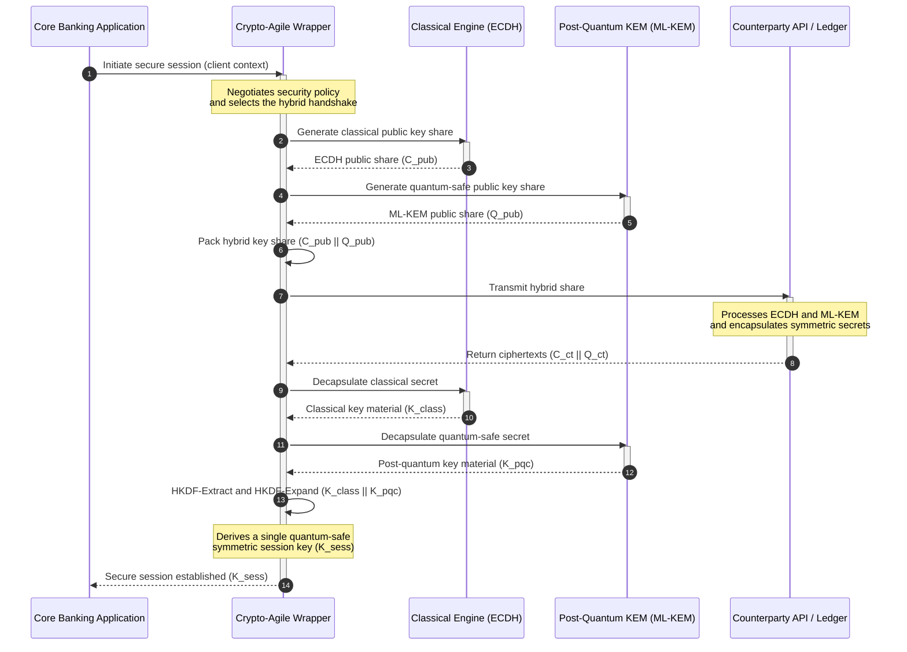

## KyberLib आणि 2026 मधील पोस्ट-क्वांटम बँकिंग स्थलांतर: मानकांपासून कोडपर्यंत

पोस्ट-क्वांटम स्थलांतर आता केवळ नियोजनाचा व्यायाम राहिलेला नाही. 2026 मध्ये ती एक सक्रिय परिचालन गरज आहे, आणि नियामक हेतू व अभियांत्रिकी अंमलबजावणी यांच्यातील अंतर हेच आता जोखीम बसलेले ठिकाण आहे. [KyberLib ⧉](https://github.com/sebastienrousseau/kyberlib "kyberlib") त्या अंतराचा काही भाग बंद करते: एक उत्पादन-केंद्रित, मेमरी-सेफ Rust लायब्ररी जी ML-KEM ला अंतिम केलेल्या FIPS 203 पॅरामीटर्सनुसार राबवते आणि बँकेच्या व्यवहार-आधारित प्रणालीला प्रत्यक्षात आवश्यक असलेल्या क्रिप्टो-अ‍ॅजाइल सीमांमध्ये त्याला गुंडाळते.

---

> **कार्यकारी सारांश / मुख्य मुद्दे**
>
> - **धोका आधीच परिचालनात आहे.** प्रतिस्पर्धी आजच "Store Now, Decrypt Later" कापणी चालवत आहेत; क्रिप्टोग्राफिकदृष्ट्या-सुसंगत क्वांटम संगणक येण्याच्या दिवशी डेटा गोपनीयता पूर्वलक्ष्यी परिणामाने भंग पावते.
> - **मानके अंतिम झाली आहेत.** NIST FIPS 203 (ML-KEM) आणि FIPS 204 (ML-DSA) ऑडिट समित्यांना एक स्पष्ट, चाचणी-करण्यायोग्य निकष देतात — आता "मानकांची वाट पाहत आहोत" हा बचाव उरलेला नाही.
> - **KyberLib हा अभियांत्रिकी आराखडा आहे.** मेमरी-सेफ Rust, HSM आणि स्मार्ट कार्डांसाठी `no_std` कंपायलेशन, आणि क्लासिकल इंटरऑपरेबिलिटी टिकवणारे हायब्रिड हँडशेक नमुने.
> - **क्रिप्टो-अ‍ॅजिलिटी हे टिकाऊ उद्दिष्ट आहे.** स्थिर अ‍ॅब्स्ट्रॅक्शन सीमांमुळे अनुप्रयोग पुनर्लेखनाशिवाय प्रिमिटिव्ह्ज बदलता येतात — हा धडा कोणत्याही एका अल्गोरिदमपेक्षा जास्त काळ टिकतो.
> - **दायित्व संचालक मंडळांवर आहे.** DORA अनुच्छेद 5 संचालकांवर वैयक्तिक जबाबदारी टाकतो; तपासण्यायोग्य, निरीक्षणयोग्य स्थलांतर कोड हाच त्याचे समाधान करणारा पुरावा आहे.
>
---

## हा ओपन-सोर्स प्रकल्प 2026 मध्ये का महत्त्वाचा आहे

जसजशी असममित क्रिप्टोग्राफी अप्रचलिततेकडे जाते, तसतसा धोका क्रिप्टोग्राफिकदृष्ट्या-सुसंगत क्वांटम संगणक बांधला जाण्याची वाट पाहत नाही. प्रतिस्पर्धी आत्ता **"Store Now, Decrypt Later" (SNDL)** हल्ले राबवत आहेत — कॉर्पोरेट बँक व्यवहार, व्यापार गुपिते आणि संस्थात्मक संवादांचे एन्क्रिप्ट केलेले ट्रान्झिट प्रवाह कापणी करत आहेत, आणि क्वांटम क्षमता परिपक्व झाल्यावर ते डिक्रिप्ट करण्याच्या उद्देशाने. बँकेसाठी, आज तारेवरील प्रत्येक क्लासिकल हँडशेक हा एक विलंबित स्फोट-तारखेसह असलेला गोपनीयता भंग आहे.

नियामकांनी ठोस बंधनांसह प्रतिसाद दिला आहे:

1. **DORA अनुच्छेद 6 (ICT जोखीम व्यवस्थापन)** संस्थांना त्यांच्या संपूर्ण क्रिप्टोग्राफिक प्रणालीमधील असुरक्षिततांचा नकाशा तयार करणे, त्यांची ओळख पटवणे आणि त्या कमी करणे आवश्यक आहे — यात कोणीही सूचीबद्ध न केलेल्या मिडलवेअरमध्ये दडलेल्या असममित की एक्सचेंजचाही समावेश आहे.
2. **NIST FIPS 203 आणि 204** की एन्कॅप्सुलेशन (ML-KEM) आणि डिजिटल स्वाक्षरी (ML-DSA) साठी अधिकृत पोस्ट-क्वांटम मानके प्रस्थापित करतात, ज्यामुळे ऑडिट समित्यांना एक मानकीकृत निकष मिळतो ज्याच्या तुलनेत स्थलांतराची प्रगती मोजली जाते.

हे स्थलांतर थेट परिचालनात व्यत्यय न आणता पार पाडण्यासाठी धोरण-दस्तऐवजांच्या पलीकडे जाऊन **तपासण्यायोग्य, ओपन-सोर्स क्रिप्टोग्राफिक पायाभूत सुविधेकडे** वळणे आवश्यक आहे. [KyberLib ⧉](https://github.com/sebastienrousseau/kyberlib "kyberlib") नेमके तेच देते: FIPS 203 शी अनुरूप असलेली एक मेमरी-सेफ Rust लायब्ररी जी पोस्ट-क्वांटम संक्रमणाला एका मोजण्यायोग्य, सत्यापित करण्यायोग्य अभियांत्रिकी पाइपलाइनमध्ये बदलते — आणि तंत्रज्ञान गुंतवणुकीचा संवाद एका मूर्त Return on Resilience कडे वळवते.

## आर्किटेक्चर दृष्टिकोन

KyberLib स्थिर API सीमांमागे बसते, ज्यामुळे बँकेच्या मूळ व्यवहार-आधारित अनुप्रयोगांना निम्न-स्तरीय क्रिप्टोग्राफिक प्रिमिटिव्ह्जमधील बदलांपासून वेगळे ठेवते.

| स्तर | रचना निर्णय | तो का महत्त्वाचा आहे | गैरहाताळणीची जोखीम |
|---|---|---|---|
| **प्रिमिटिव्ह** | FIPS 203 ML-KEM की एन्कॅप्सुलेशन | क्लासिकल Diffie-Hellman आणि RSA की एक्सचेंजची जागा लॅटिस-आधारित रचनांनी घेते | अंतिम केलेल्या FIPS 203 पॅरामीटर्सशी अननुरूपता, ज्यामुळे अनुपालन ऑडिट अयशस्वी होते |
| **भाषा** | मेमरी-सेफ Rust अंमलबजावणी | C/C++ मध्ये सर्रास आढळणाऱ्या मेमरी-दूषण असुरक्षितता (बफर ओव्हरफ्लो, use-after-free) दूर करते | बिल्ड-चेन अखंडतेशी तडजोड करणारा अवलंबित्व-विस्तार |
| **अ‍ॅब्स्ट्रॅक्शन** | स्थिर क्रिप्टो-अ‍ॅजाइल सीमा | मानके विकसित होताना अनुप्रयोग एकसंध इंटरफेसमागे अल्गोरिदम बदलतात | हार्ड-कोडेड प्रिमिटिव्ह्ज प्रत्येक भविष्यातील स्थलांतरात मॅन्युअल पुनर्लेखन भाग पाडतात |
| **तैनाती** | हायब्रिड एन्क्रिप्शन हँडशेक | पोस्ट-क्वांटम KEMs ना क्लासिकल अल्गोरिदमशी दुहेरी-गुंडाळलेल्या लिफाफ्यात एकत्र करते | लेगसी इंटरऑपरेबिलिटीचे नुकसान किंवा मूक कॉन्फिगरेशन ड्रिफ्ट |
| **आश्वासन** | SLSA Level 3 उगमस्थान आणि तपासण्यायोग्य चाचण्या | कोडचे स्रोत आणि उगमस्थान हमी देते; उदाहरणे ओळ-दर-ओळ ऑडिट करता येतात | सुरक्षा-नाटक — ब्लॅक-बॉक्स लायब्ररी ज्यांच्या अंमलबजावणी चुका उत्पादनात उघड होतात |

## निरीक्षणासाठी परिचालन संकेत

पर्यवेक्षी मंडळे आणि नियामकांना पोस्ट-क्वांटम अनुपालन दाखवणे म्हणजे विशिष्ट, प्रमाणित करण्यायोग्य मेट्रिक्सचा मागोवा घेणे:

| संकेत | मेट्रिक | नियामक संदर्भ | प्लॅटफॉर्म अंमलबजावणी |
|---|---|---|---|
| **FIPS 203 ML-KEM अनुरूपता** | अंतिम केलेल्या पॅरामीटर्ससह 100% अनुपालन (ML-KEM-512/768/1024) | NIST FIPS 203 | KyberLib मॉड्यूल्समध्ये कंपाइल केलेली पॅरामीटर-सत्यापित लॅटिस क्रिप्टोग्राफी |
| **क्रिप्टोग्राफिक सूची** | सर्व प्रणालींमधील असममित की-एक्सचेंज वापराची संपूर्ण सूची | NIST SP 1800-38 | सक्रिय सायफर सूट्स केंद्रीय रजिस्ट्रीमध्ये नोंदवणारे स्वयंचलित स्कॅनिंग एजंट |
| **हायब्रिड की एक्सचेंज** | हायब्रिड लिफाफ्यात अंमलात येणाऱ्या ट्रान्सपोर्ट-लेयर हँडशेकची टक्केवारी | DORA अनुच्छेद 6 | क्लासिकल TLS 1.3 हँडशेक PQC एन्कॅप्सुलेशनमध्ये गुंडाळणारे नेटवर्क प्रॉक्सी |
| **`no_std` कंपायलेशन** | मर्यादित लक्ष्यांसाठी Rust च्या मानक लायब्ररीशिवाय कंपाइल करण्याची क्षमता | DORA अनुच्छेद 30 | हार्डवेअर सुरक्षा मॉड्यूल्ससाठी KyberLib मध्ये सशर्त `no_std` कंपायलेशन |
| **क्रिप्टो-अ‍ॅजिलिटी निर्देशांक** | API गेटवेवर क्रिप्टोग्राफिक प्रिमिटिव्ह बदलण्यासाठी लागणारा वेळ मिनिटांत | UK PRA SS1/23 | रनटाइम व्हेरिएबल्सद्वारे अल्गोरिदम वाटप व्यवस्थापित करणाऱ्या अ‍ॅब्स्ट्रॅक्ट राउटिंग रजिस्ट्री |

## पोस्ट-क्वांटम क्रिप्टोग्राफीसाठी Rust का महत्त्वाचे आहे

ML-KEM सारखे पोस्ट-क्वांटम अल्गोरिदम राबवण्यासाठी बहुपदी वलयांवर (polynomial rings) जटिल, निम्न-स्तरीय गणितीय क्रिया आवश्यक असतात. ऐतिहासिकदृष्ट्या, त्या क्रिया उत्पादन-वेगाने चालवणे म्हणजे हाताने लिहिलेले C/C++ किंवा असेंब्ली — बँकेला ज्या कोडमध्ये चूक होणे सर्वात कमी परवडते, नेमक्या त्याच कोडमध्ये मेमरी-दूषणासाठी मोठा हल्ला-पृष्ठभाग.

Rust क्रिप्टोग्राफिक अभियांत्रिकीची सुरक्षा-स्थिती तीन ठोस मार्गांनी बदलते:

1. **कंपाइल-टाइम मेमरी सुरक्षा.** Rust चे ओनरशिप मॉडेल हमी देते की बफर ओव्हरफ्लो, डबल फ्री, आणि use-after-free चुका कंपाइल टाइमलाच रोखल्या जातात. पोस्ट-क्वांटम लायब्ररींसाठी हे तीव्रतेने महत्त्वाचे आहे, जिथे की आकार आणि सायफरटेक्स्ट त्यांच्या क्लासिकल समकक्षांपेक्षा लक्षणीयरीत्या मोठे असतात.
2. **निर्धारक, शून्य-खर्च अ‍ॅब्स्ट्रॅक्शन.** Rust गार्बेज कलेक्टरशिवाय नेटिव्ह मशीन कोडमध्ये कंपाइल होते, त्यामुळे अंमलबजावणी वेग आणि मेमरी वापर C-आधारित लायब्ररींशी जुळतो किंवा त्यांना मागे टाकतो, आणि सुरक्षाही टिकवतो.
3. **`no_std` सुसंगतता.** KyberLib Rust च्या मानक लायब्ररीशिवाय कंपाइल होते, त्यामुळे ती मर्यादित, बेअर-मेटल वातावरणात — हार्डवेअर सुरक्षा मॉड्यूल्स आणि स्मार्ट कार्डांसह — चालते, ज्यामुळे बँक-दर्जाची क्रिप्टोग्राफी भौतिक सुरक्षा सीमांच्या आत राहते.

## क्रिप्टो-अ‍ॅजाइल आर्किटेक्चरची रचना करणे

क्रिप्टोग्राफिक स्थलांतरांमधील उत्कृष्ट अपयश-प्रकार म्हणजे हार्ड-कोडिंग: अल्गोरिदम-विशिष्ट गृहीतके थेट अनुप्रयोग तर्कशास्त्रात रुजवलेली असतात, आणि प्रत्येक संक्रमणात वेदनादायकपणे पुन्हा शोधली जातात. 2026 चे टिकाऊ उद्दिष्ट म्हणजे **क्रिप्टो-अ‍ॅजिलिटी** — एक अ‍ॅब्स्ट्रॅक्शन थर जो अल्गोरिदमांना स्थिर इंटरफेसमागे बदलण्यायोग्य मॉड्यूल्स म्हणून हाताळतो, जेणेकरून पुढील स्थलांतर हे संपूर्ण-प्रणाली पुनर्लेखनाऐवजी केवळ कॉन्फिगरेशन बदल ठरते.

खालील अनुक्रम दाखवतो की KyberLib चा क्रिप्टो-अ‍ॅजाइल रॅपर हायब्रिड (क्लासिकल अधिक पोस्ट-क्वांटम) की-एक्सचेंज हँडशेक कसा समन्वयित करतो:

हायब्रिड लिफाफा हाच परिचालनदृष्ट्या महत्त्वाचा तपशील आहे. जोपर्यंत पोस्ट-क्वांटम प्रिमिटिव्ह्ज अनेक वर्षांची उत्पादन-छाननी जमा करत नाहीत, तोपर्यंत सत्र की क्लासिकल आणि पोस्ट-क्वांटम या दोन्ही गुपितांपासून तयार होते: चॅनेल परत मिळवण्यासाठी हल्लेखोराला ECDH **आणि** ML-KEM दोन्ही भंग करावे लागतात. जे प्रतिपक्ष अजून स्थलांतरित झालेले नाहीत ते कार्यरत राहतात; जे स्थलांतरित झाले आहेत त्यांना लगेच लॅटिस-आधारित संरक्षण मिळते.

## संचालक-मंडळ आराखडा

पोस्ट-क्वांटम सुरक्षा ही केवळ बॅक-ऑफिस एन्क्रिप्शन चिंता नाही; ती वैयक्तिक हितसंबंधांसह असलेली संचालक-मंडळ गव्हर्नन्स समस्या आहे. वरिष्ठ व्यवस्थापकांनी हे स्थलांतर विश्वस्त जबाबदारीच्या दृष्टिकोनातून मांडावे:

- **DORA अनुच्छेद 5 (गव्हर्नन्स आणि संघटना)** ICT सुरक्षेची वैयक्तिक जबाबदारी संचालक मंडळावर टाकतो. ओपन-सोर्स, निरीक्षणयोग्य चाचण्या हाच वैयक्तिक-दायित्व ऑडिट मागणारा थेट पुरावा आहे — "आम्ही एक तपासण्यायोग्य FIPS 203 अंमलबजावणी निवडली आणि येथे तिचे अनुरूपता रन आहेत" हे बचावयोग्य उत्तर आहे; "आमच्या विक्रेत्याने आम्हाला आश्वासन दिले" हे नाही.
- **मॉडेल जोखीम व्यवस्थापन (US Fed SR 11-7 / UK PRA SS1/23)** किंमत-मॉडेल्सप्रमाणेच क्रिप्टोग्राफिक रॅपर आर्किटेक्चरनाही लागू होते. अ‍ॅब्स्ट्रॅक्शन थरांनी MRM सत्यापनातून जावे, यात अत्यंत व्यत्यय परिस्थितीत कार्यक्षमतेचा समावेश आहे.
- **Basel III परिचालन-जोखीम भांडवल** दाखवलेल्या नियंत्रण-परिपक्वतेला पुरस्कृत करते. चाचणी केलेले हायब्रिड हँडशेक संस्थेच्या दीर्घकालीन परिचालन-जोखीम प्रोफाइलला खाली आणतात, भांडवल अधिमूल्य कमी करतात आणि सक्रिय ट्रेझरी तैनातीसाठी ताळेबंद क्षमता मुक्त करतात.

## बँक प्रकारानुसार याचा काय अर्थ आहे

### जागतिक प्रणालीगत महत्त्वाच्या बँका (G-SIBs)

G-SIBs लेगसी-भारी व्यवहार-आधारित प्रणाली चालवतात, त्यामुळे त्यांची बंधनकारक मर्यादा शोधकार्य आहे: असममित की एक्सचेंज प्रत्यक्षात कुठे घडते हे जाणून घेणे. NIST SP 1800-38 मार्गदर्शनाखालील सतत क्रिप्टोग्राफिक सूची प्रथम येतात; त्यानंतर KyberLib सूचीने उघड केलेल्या प्रत्येक आधुनिक नोडवर पोस्ट-क्वांटम की एन्कॅप्सुलेशन अंमलात आणण्यासाठी मानकीकृत, मेमरी-सेफ लायब्ररी पुरवते.

### व्यवहार आणि कॉर्पोरेट बँका

पेमेंट रेल्सवरील गोपनीयता हीच फ्रँचायझी आहे. KyberLib बेअर-मेटल `no_std` लक्ष्यांवर कंपाइल होत असल्यामुळे, व्यवहार बँका पोस्ट-क्वांटम हँडशेक थेट एज पेमेंट-राउटिंग आणि लिक्विडिटी-व्यवस्थापन हार्डवेअरच्या आत तैनात करू शकतात — केवळ अनुप्रयोग स्तरावर नव्हे.

### प्रादेशिक आणि लहान बँका

प्रादेशिक संस्थांना G-SIB संशोधन अंदाजपत्रकांशिवाय त्याच राज्य-प्रायोजित कापणीचा सामना करावा लागतो. एक तपासण्यायोग्य, ओपन-सोर्स Rust अंमलबजावणी त्यांना ब्लॅक-बॉक्स विक्रेता आराखड्यांशी वाटाघाटी न करता तत्काळ NIST FIPS 203 अनुरूपतेचा एक तयार-वापर मार्ग देते.

## आराखड्यांपासून कंपाइल होणाऱ्या कोडपर्यंत

पोस्ट-क्वांटम संक्रमण हे एक सक्रिय अभियांत्रिकी कार्य आहे, आणि 2026 पर्यंत पर्यवेक्षक, प्रतिपक्ष आणि कॉर्पोरेट ट्रेझरर्सचा विश्वास टिकवणाऱ्या संस्था त्या आहेत ज्या अमूर्त आराखड्यांपासून निरीक्षणयोग्य, कंपाइल होणाऱ्या कोडकडे वळतात. कार्यकारी आदेश थेट यातूनच येतो: लेगसी की-एक्सचेंज बिंदूंचे ऑडिट करा, सर्वाधिक-मूल्याच्या चॅनेलवर हायब्रिड हँडशेक तैनात करा, आणि प्रत्येक भविष्यातील प्रिमिटिव्ह बदल नित्याचा बनवणाऱ्या स्थिर अ‍ॅब्स्ट्रॅक्शन सीमा बांधा. KyberLib यातील प्रत्येक पाऊल स्लाइडवेअर वचनबद्धतेऐवजी एक मोजण्यायोग्य परिचालन क्षमता बनवते.

## वारंवार विचारले जाणारे प्रश्न

**KyberLib अंतिम केलेल्या NIST मानकांशी अनुरूप आहे का?**

होय. KyberLib FIPS 203 मध्ये अंतिम केलेल्या ML-KEM च्या पॅरामीटर्सभोवती रचली गेली आहे, ज्यामुळे कंपाइल केलेली लायब्ररी फेडरल आणि जागतिक नियामक अपेक्षांशी सुसंगत राहते.

**पोस्ट-क्वांटम लायब्ररीला विशेष हार्डवेअर आवश्यक आहे का?**

नाही. KyberLib ची Rust अंमलबजावणी मानक सिस्टम आर्किटेक्चरवर कंपाइल होते. तिची `no_std` क्षमता अतिरिक्तपणे तिला विशेष हार्डवेअर सुरक्षा मॉड्यूल्स आणि स्मार्ट कार्डांवर चालू देते, जिथे भौतिक की-अभिरक्षा आवश्यक असते.

**"Store Now, Decrypt Later" सध्याच्या अनुपालनावर कसा परिणाम करते?**

जर ट्रान्सपोर्ट लेयर क्लासिकल RSA किंवा ECC वर अवलंबून असेल, तर प्रतिस्पर्धी आज ट्रॅफिक कापणी करू शकतात आणि क्वांटम क्षमता परिपक्व झाल्यावर ती डिक्रिप्ट करू शकतात. आत्ता तैनात केलेला हायब्रिड की एक्सचेंज कापणी केलेल्या डेटाला लॅटिस-आधारित संरक्षणामागे ठेवतो.

**थेट पोस्ट-क्वांटम प्रिमिटिव्ह्जकडे जाण्याऐवजी हायब्रिड हँडशेक का?**

हायब्रिड लिफाफे सत्र की एका क्लासिकल आणि एका पोस्ट-क्वांटम गुपितापासून तयार करतात, त्यामुळे दोन्ही भंग होईपर्यंत सुरक्षा टिकते. यामुळे नवीन प्रिमिटिव्ह्ज उत्पादन-छाननी जमा करत असताना स्थलांतरित न झालेल्या प्रतिपक्षांशी इंटरऑपरेबिलिटी टिकून राहते.

## संदर्भ

- National Institute of Standards and Technology, (2024). [FIPS 203: Module-Lattice-Based Key-Encapsulation Mechanism Standard ⧉](https://www.nist.gov/news-events/news/2024/08/nist-releases-first-3-finalized-post-quantum-encryption-standards "NIST FIPS 203 announcement").
- Board of Governors of the Federal Reserve System, (2011). [Supervisory Guidance on Model Risk Management (SR Letter 11-7) ⧉](https://web.archive.org/web/20260414150921/https://www.federalreserve.gov/supervisionreg/srletters/sr1107.htm "Federal Reserve SR 11-7").
- European Parliament and Council of the European Union, (2022). [Regulation (EU) 2022/2554 on digital operational resilience for the financial sector (DORA) ⧉](https://eur-lex.europa.eu/legal-content/EN/TXT/?uri=CELEX%3A32022R2554 "DORA Regulation").
- NIST National Cybersecurity Center of Excellence, (2025). [Migration to Post-Quantum Cryptography (NIST SP 1800-38) ⧉](https://www.nccoe.nist.gov/projects/migration-post-quantum-cryptography "NIST SP 1800-38").
- GitHub, (2026). [kyberlib open-source repository ⧉](https://github.com/sebastienrousseau/kyberlib "kyberlib repository").
