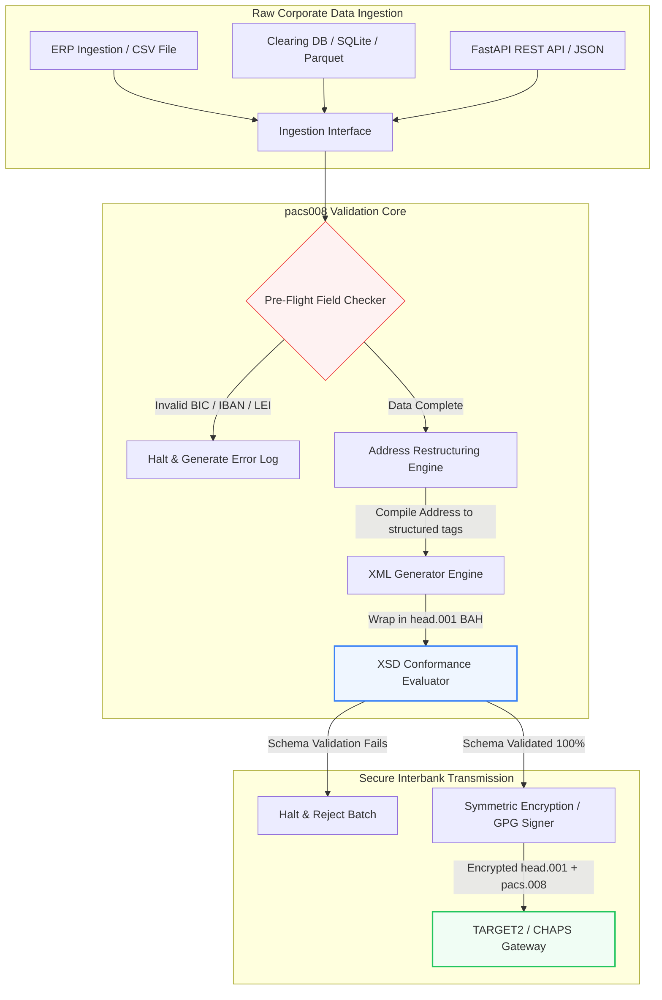

## 2026 मध्ये ओपन-सोर्स Python वापरून ISO 20022 pacs.008 आंतरबँक पेमेंट्स स्वयंचलित करणे

एका ऑडिट करण्यायोग्य, स्कीमा-प्रमाणित Python पाइपलाइनद्वारे लीगसी आर्थिक डेटा आणि संरचित आंतरबँक संदेशनामधील दरी भरून काढणे.

या लेखासाठी ओपन-सोर्स संदर्भ बिंदू म्हणजे [pacs008 ⧉](https://github.com/sebastienrousseau/pacs008 "pacs008 — open-source Python library"). हे रेपॉझिटरी [ISO 20022](/2023-09-29-automating-iso-20022-compliant-payment-file-creation-with-pain001/index.html) pacs.008 FI-ते-FI ग्राहक क्रेडिट ट्रान्सफर XML संदेश स्वयंचलित करण्यासाठी एक Python लायब्ररी म्हणून स्थान घेते.

## हा ओपन-सोर्स प्रकल्प 2026 मध्ये का महत्त्वाचा आहे

जागतिक आंतरबँक पेमेंट क्लिअरिंग पायाभूत सुविधा जवळपास अर्ध्या शतकातील तिचे सर्वात मूलभूत आधुनिकीकरण अनुभवत आहे.

जून 2026 मध्ये, आर्थिक सेवा क्षेत्र **14 नोव्हेंबर 2026 च्या SWIFT संरचित पत्ता क्लिफ**च्या दिशेने वेगाने वाटचाल करत आहे. या तारखेपासून पुढे, SWIFT CBPR+ मार्गदर्शक तत्त्वे, तसेच TARGET2, CHAPS, Fedwire आणि Canadian Lynx अधिकृतपणे असंरचित पोस्टल पत्ता ओळींना (केवळ `<PstlAdr>` ब्लॉक्समध्ये `<AdrLine>` वापरणाऱ्या) निकालात काढतील. सर्व सहभागी वित्तीय संस्थांनी पत्ते एकतर संकरित स्वरूपात (संरचित `<TwnNm>` आणि `<Ctry>`, उर्वरित तपशिलांसाठी जास्तीत जास्त दोन `<AdrLine>` घटकांसह) किंवा पूर्णतः संरचित स्वरूपात (रस्त्याचे नाव, इमारत क्रमांक आणि पिन कोडसाठी स्वतंत्र घटक) प्रसारित केले पाहिजेत. या निकषात अयशस्वी ठरणारा कोणताही संदेश नेटवर्क सीमेवरच नाकारला जाईल.

वित्तीय संस्थांसाठी, हे संक्रमण मोठ्या परिचालन मर्यादा निर्माण करते:

1. **सीमा-नकाराची शिक्षा.** संरचित-पत्ता निकष पूर्ण न करणाऱ्या पेमेंट्सना तात्काळ नेटवर्क नकारांना सामोरे जावे लागेल, ज्यामुळे व्यवहारात्मक विलंब, तरलता अडथळे आणि परिचालन अनुशेष निर्माण होतील.
2. **SEPA पेमेंट प्राप्तकर्त्याचे सत्यापन (VoP).** SEPA क्षेत्रातील सर्व पेमेंट सेवा पुरवठादारांनी (PSPs) क्रेडिट ट्रान्सफर अंमलात आणण्यापूर्वी लाभार्थीच्या नाव आणि IBAN यांच्यातील जुळणी पडताळणे अनिवार्य करते, ज्यामुळे संदेश आरंभात आणखी एक प्रमाणीकरण द्वार जोडले जाते.

[Pacs008](https://github.com/sebastienrousseau/pacs008) ही समस्या सोडवते. ही एक ओपन-सोर्स, हलकी Python लायब्ररी आहे जी कच्च्या आर्थिक डेटाचे पूर्णपणे प्रमाणित, स्कीमा-अनुरूप ISO 20022 pacs.008 आंतरबँक ग्राहक क्रेडिट ट्रान्सफर संदेशांमध्ये रूपांतर स्वयंचलित करते. लीगसी-ते-संरचित डेटा दरी भरून काढून, pacs008 उच्च लवचिकता परतावा (Return on Resilience, RoR) प्रदान करते, कार्यशील भांडवल जपते आणि जागतिक रेल्सवर रिअल-टाइम अंमलबजावणी सुरक्षित करते.

## मी pacs008 असा का बांधला

`pacs008` आणि त्याची वरच्या टप्प्यातील भगिनी `pain001` मीच लिहिली आहे, आणि माझे
कामाचे आयुष्य घाऊक देयके व API उत्पादन व्यवस्थापनात जाते. हेच संयोजन या ग्रंथालयाच्या
रूपाचे कारण आहे, म्हणून हे निर्णय संहितेत गर्भित ठेवण्याऐवजी स्पष्टपणे मांडणे योग्य
ठरते.

**पडताळणी निर्मितीनंतर नव्हे, आधी चालते.** बहुतेक देयक मालमत्तांमधील सहज प्रवृत्ती
अशी असते की आधी संदेश तयार करावा आणि मग तपासावा, कारण पुनरावलोकनाची प्रक्रिया तशीच
घडवलेली आहे: एक फाइल तयार होते, कोणीतरी ती पाहतो, अपवाद रांगेत जातात. हा क्रम याची
हमी देतो की दोष सर्वात कमी लाभाच्या ठिकाणी सापडतील — संदेश जुळवण्याचे काम आधीच झाल्यावर,
आणि बहुधा तो संस्थेबाहेर गेल्यावर. आधी पडताळणी म्हणजे विसंगत पत्ता किंवा सदोष IBAN
नेटवर्क नकाराऐवजी बिल्ड अपयश ठरतो.

**परवाना MIT आहे कारण बँकांना पडताळणीचे तर्कशास्त्र वाचावे लागते, त्यावर विश्वास
ठेवावा लागत नाही.** बंद पडताळणीकार संस्थेला सांगतो की वापर मार्गदर्शक तत्त्वांचे दुसऱ्या
कोणाचे वाचन विश्वासावर स्वीकारा. ज्या संघावर नियामक जबाबदारी आहे, त्याच्याकडून ही मागणी
वाजवी नाही. या ग्रंथालयातील प्रत्येक नियम तपासता, नाकारता आणि फोर्क करता येतो.

**पडताळणी अधिकृत XSD योजनांविरुद्ध होते, पुनर्अंमलबजावणीविरुद्ध नाही.** ISO 20022
नियमांचे हाताने लिहिलेले अनुमान कोणतीही एक बाजू बदलताच नेटवर्कच्या प्रत्यक्ष करारापासून
दूर जाते. योजनाच करार आहे; बाकी सर्व सत्याचा दुसरा स्रोत आहे जो विरोध करण्याची वाट पाहत
असतो.

**हे पुनरावलोकनाच्या टप्प्याला नव्हे, CI ला लक्ष्य करते.** जो पडताळणीकार चालवण्याचे
माणसाला लक्षात ठेवावे लागते, तो मुदतीच्या दबावाखाली चालवला जाणे थांबतो — नेमके तेव्हाच
जेव्हा तो सर्वाधिक महत्त्वाचा असतो.

ग्रंथालय जे जाणीवपूर्वक करत नाही, तेही तितकेच जाणीवपूर्वक आहे. हे संदेश-स्तरावरील साधन
आहे. ते देयक इंजिन, निर्बंध तपासणी प्रणाली, किंवा संस्थेला स्रोतावर करावी लागणारी ग्राहक
मुख्य-माहिती दुरुस्ती यांपैकी कशाचीही जागा घेत नाही. ते ती दुरुस्ती अंमलबजावणीयोग्य करते;
तुमच्यासाठी ती करत नाही.

## pacs008 2026 आर्किटेक्चर दृष्टिकोन

pacs008 लायब्ररी एक विलग केलेले प्रमाणीकरण आणि निर्मिती इंजिन म्हणून रचली गेली आहे, जी हे सुनिश्चित करते की कच्चे इनपुट पद्धतशीरपणे पार्स केले जातात, समृद्ध केले जातात आणि प्रमाणित लिफाफ्यांमध्ये गुंडाळले जातात:

| स्तर | रचना निर्णय | तो का महत्त्वाचा आहे | गैरहाताळणी झाल्यास जोखीम |
|---|---|---|---|
| **इनपुट स्तर** | CSV, JSON, SQLite आणि Parquet चे ग्रहण | बँकिंग एकत्रीकरण संघांना त्यांचा डेटा जिथे आधीच राहतो तिथेच भेटते, प्लॅटफॉर्म स्थलांतर टाळते. | कच्चे, अप्रमाणित किंवा दूषित डेटा पेलोड्सचे ग्रहण. |
| **प्रमाणीकरण स्तर** | अधिकृत XSD स्कीमा आणि सानुकूल व्यवसाय नियमांविरुद्ध पूर्व-उड्डाण प्रमाणीकरण | पेमेंट फाइल क्लिअरिंग नेटवर्कवर प्रसारित होण्यापूर्वी अंमलबजावणी थांबवते आणि त्रुटी दर्शवते. | अवैध XML फाइल्स तात्काळ नेटवर्क नकार आणि क्लिअरिंग विलंब निर्माण करतात. |
| **BAH लिफाफा स्तर** | स्वयंचलित Business Application Header (head.001) रॅपिंग | `<MsgDefIdr>` टॅगवर आधारित संदेश पाठवणी आणि राउटिंग प्रमाणित करते. | आवश्यक बाह्य लिफाफ्याशिवाय कच्चे pacs.008 पेलोड्स प्रसारित करणे, ज्यामुळे यंत्रणा नकार. |
| **सिरियलायझेशन स्तर** | प्रमाणित XML आणि ISO-अनुरूप JSON (TS 23029) समर्थन | XML आणि JSON पेलोड्समध्ये थेट भाषांतर सक्षम करते, आधुनिक REST API आणि Kafka स्ट्रीमिंगला समर्थन देते. | अधिकृत ISO मार्गदर्शक तत्त्वांचे उल्लंघन करणारे खंडित डेटा प्रतिनिधित्व. |
| **निरीक्षणक्षमता स्तर** | UETR वर आधारित OpenTelemetry ट्रेसिंग | तपशीलवार अंमलबजावणी मार्ग आणि लॉग टिपते, रिअल-टाइम ऑडिट करण्यायोग्यता प्रदान करते. | ट्रेसिंगमधील अंतर परिचालन दृश्यमानता आणि ऑडिटिंगला अडथळा आणतात. |

## महत्त्वाचे आंतरबँक संकेत आणि नियामक टप्पे

व्यवहारात्मक परिचालन लवचिकता दाखवण्यासाठी, वरिष्ठ तंत्रज्ञान आणि जोखीम व्यवस्थापकांनी विशिष्ट, मोजता येण्याजोगे अनुपालन निर्देशक मागोवा घेतले पाहिजेत:

| संकेत | मापदंड / परिचालन निकष | G20 / SWIFT / DORA संदर्भ | तांत्रिक प्लॅटफॉर्म अंमलबजावणी |
|---|---|---|---|
| **संरचित पत्ता अनुपालन** | नियुक्त `<TwnNm>` आणि `<Ctry>` सह पूर्णतः संरचित `<PstlAdr>` फील्ड्स वापरणाऱ्या pacs.008 संदेशांची टक्केवारी. | SWIFT SR 2026 अंतिम मुदत | pacs008 मधील पूर्व-उड्डाण स्कीमा तपासण्या असंरचित पत्ता ओळी नाकारतात. |
| **SEPA पेमेंट प्राप्तकर्त्याचे सत्यापन** | संदेश अंमलबजावणीपूर्वी लाभार्थीच्या नाव आणि IBAN यांच्यातील जुळणी प्रमाणीकरण. | SEPA VoP नियमन | IBAN/BIC वर पूर्व-प्रमाणीकरण क्वेरी चालवणारे अंतर्निहित VoP सहायक वर्ग. |
| **BAH head.001 एकत्रीकरण** | Business Application Headers मध्ये यशस्वीरित्या गुंडाळलेल्या बाहेर जाणाऱ्या पेमेंट पेलोड्सची टक्केवारी. | TARGET2 / CBPR+ मार्गदर्शक तत्त्वे | बाह्य XML लिफाफा स्वयंचलितपणे संकलित करणारे BAH रॅपिंग उपप्रणाली. |
| **LEI मॉड्युलो चेकसम** | डेबिटर आणि क्रेडिटर `<LEI>` ब्लॉक्सवर ISO 7064 Modulo 97-10 चेक-डिजिट प्रमाणीकरण. | Bank of England आदेश | 20-वर्णीय ओळखकर्त्याची अखंडता पडताळणारा अल्गोरिदमिक तपासक. |
| **UETR मागोवा अचूकता** | निर्मित पेमेंट्सपैकी 100% मध्ये वैध Unique End-to-End Transaction Reference अंतःक्षेपित. | SWIFT UETR तपशील | 36-वर्णीय UUIDv4 संदर्भ कोडची स्वयंचलित निर्मिती आणि ट्रेसिंग. |

## आंतरबँक ऑटोमेशनसाठी Python हा आदर्श प्रवेशमार्ग का आहे

2026 मधील आधुनिक पेमेंट हब आणि ट्रेझरी परिचालन संघ डेटा रूपांतरण, आर्थिक मॉडेलिंग आणि ERP डेटाबेस एकत्रीकरणासाठी Python वर मोठ्या प्रमाणात अवलंबून आहेत.

ओपन-सोर्स Python लायब्ररीचा लाभ घेऊन, संस्था लक्षणीय फायदे मिळवतात:

1. **कमी संज्ञानात्मक भार आणि उच्च आंतरकार्यक्षमता.** Python एक सुसंगत पूल म्हणून काम करते. ती विकसकांना सोप्या स्क्रिप्ट्स लिहू देते ज्या लीगसी डेटाबेसमधून कच्च्या पेमेंट सूचना खेचतात, त्यांना जटिल आंतरराष्ट्रीय बँकिंग नियमांविरुद्ध प्रमाणित करतात आणि एकाच, एकत्रित कार्यप्रवाहात अनुरूप XML निर्माण करतात.
2. **"ब्लॅक-बॉक्स" अपारदर्शक भाषांतरकांचे निर्मूलन.** मालकीचे बँकिंग पोर्टल्स सानुकूल पेमेंट फाइल भाषांतरकांसाठी अनेकदा उच्च परवाना शुल्क आकारतात. हे भाषांतरक मालकीचे ब्लॅक बॉक्स असतात, ज्यामुळे डेटा कसा प्रक्रिया केला जातो किंवा कळा कुठे साठवल्या जातात हे सुरक्षा संघांना ऑडिट करणे अशक्य होते. pacs008 सारखी ओपन-सोर्स, तपासण्यायोग्य लायब्ररी संपूर्ण कोड पारदर्शकता सुनिश्चित करते.
3. **निर्बाध CI/CD एकत्रीकरण.** Pacs008 थेट सतत एकत्रीकरण आणि तैनाती पाइपलाइनमध्ये एकत्रित होते, ज्यामुळे विकसक त्यांच्या मानक सॉफ्टवेअर वितरण जीवनचक्राचा भाग म्हणून पेमेंट फाइल चाचणी स्वयंचलित करू शकतात.

## एक बंदिस्त आंतरबँक पाइपलाइन रचणे

आंतरबँक क्लिअरिंगमधील एक प्रमुख असुरक्षितता म्हणजे "अनियंत्रित बॅच निर्मिती" — स्पष्ट, बंदिस्त पडताळणी चक्राशिवाय फाइल्स निर्माण करणे. Pacs008 एका कठोरपणे नियंत्रित, बहु-टप्पा व्यवहार पाइपलाइनमधील मुख्य प्रमाणीकरण इंजिन म्हणून कार्य करण्यासाठी रचली गेली आहे.

खालील परिचालन प्रवाह हे दाखवतो की BAH लिफाफ्यात गुंडाळलेली, क्रिप्टोग्राफिकदृष्ट्या सुरक्षित, स्कीमा-अनुरूप pacs.008 फाइल निर्माण करण्यासाठी कच्चा व्यवहार डेटा pacs008 पाइपलाइनमधून कसा जातो:

## बोर्डरूम प्लेबुक आणि विश्वस्त उत्तरदायित्व

आंतरबँक पेमेंट ऑटोमेशन हा बोर्ड-स्तरीय जोखीम-व्यवस्थापन आणि कॉर्पोरेट प्रशासनाचा विषय आहे. वरिष्ठ व्यवस्थापकांनी व्यवहार डेटा गुणवत्तेला विश्वस्त जबाबदारी आणि परिचालन जोखीम कमी करण्याच्या दृष्टिकोनातून हाताळले पाहिजे:

- **DORA अनुच्छेद 5 (बोर्ड उत्तरदायित्व).** संस्थेच्या ICT परिचालनांच्या लवचिकता आणि सुरक्षिततेसाठी बोर्ड सदस्यांवर थेट, वैयक्तिक उत्तरदायित्व टाकते. आंतरबँक क्लिअरिंग हे एक महत्त्वपूर्ण कॉर्पोरेट कार्य असल्याने, परिचालन व्यत्यय किंवा विलंबित पेमेंट्स टाळण्यासाठी बोर्डांनी मजबूत, प्रमाणित आणि स्वयंचलित व्यवहारात्मक नियंत्रणे अंमलात आणल्याचे दाखवले पाहिजे.
- **BCBS 239 (जोखीम डेटा एकत्रीकरण आणि अहवाल).** आर्थिक व्यवहार अहवाल अचूक, संपूर्ण आणि रिअल-टाइममध्ये निर्मित असावा अशी मागणी करते. Pacs008 स्रोतावरच पेमेंट डेटा स्वच्छपणे संरचित आणि प्रमाणित असल्याचे सुनिश्चित करून संस्थांना BCBS 239 अनुपालन साध्य करण्यात मदत करते, जे लीगसी स्प्रेडशीट्सना त्रस्त करणाऱ्या डेटा अंतर आणि हस्तचलित समेट त्रुटी दूर करते.
- **परिचालन जोखीम भांडवल शुल्क कमी करणे (Basel III).** Basel III मार्गदर्शक तत्त्वांनुसार, उच्च पेमेंट त्रुटी दर आणि हस्तचलित हस्तक्षेपाचा भार बँकेच्या परिचालन जोखीम भांडवल आवश्यकता वाढवतो, जे अन्यथा कर्ज किंवा गुंतवणुकीसाठी वापरता येईल असे भांडवल बांधून ठेवतो. पेमेंट पाइपलाइन स्वयंचलित केल्याने हे भांडवली अधिमूल्य थेट कमी होते, ताळेबंद मूल्य जपले जाते.

## बँकेच्या प्रकारानुसार याचा अर्थ काय

### जागतिक पद्धतशीरदृष्ट्या महत्त्वाच्या बँका (G-SIBs)

G-SIBs मोठ्या, सीमापार कॉर्पोरेट व्यवहार खंडांचे व्यवस्थापन करतात. त्यांचे प्राथमिक आव्हान म्हणजे असंरचित लीगसी डेटा क्लिअरिंग नेटवर्कवर पोहोचण्यापूर्वी त्याचे उपचार करणे. pacs008 त्यांच्या कॉर्पोरेट बँकिंग गेटवेजमध्ये एकत्रित करून, G-SIBs त्यांच्या कॉर्पोरेट ग्राहकांना स्वयंचलित प्रमाणीकरण उपयुक्तता पुरवू शकतात, हस्तचलित पेमेंट दुरुस्तीचा भार कमी करू शकतात आणि SWIFT नेटवर्कवर रिअल-टाइम अंमलबजावणी सुरक्षित करू शकतात.

### व्यवहार आणि कॉर्पोरेट बँका

व्यवहार बँकांसाठी, पेमेंट डेटा गुणवत्ता ही एक स्पर्धात्मक वेगळेपणा आहे. कॉर्पोरेट ट्रेझरी ग्राहकांना pacs008 सारखे ओपन-सोर्स, तपासण्यायोग्य प्रमाणीकरण साधन देऊन, या बँका ऑनबोर्डिंग गतिमान करू शकतात, पेमेंट फाइल नकार कमी करू शकतात आणि श्रेष्ठ स्ट्रेट-थ्रू प्रोसेसिंग दरांद्वारे ग्राहक विश्वास निर्माण करू शकतात.

### प्रादेशिक आणि लहान बँका

प्रादेशिक बँकांना G-SIBs च्या प्रचंड तंत्रज्ञान अंदाजपत्रकांशिवाय आंतरराष्ट्रीय पेमेंट मानकांचे अनुपालन राखावे लागते. Pacs008 एक हलके, किफायतशीर आणि पूर्णपणे अनुरूप Python-आधारित समाधान पुरवते, ज्यामुळे लहान संस्था महागड्या मालकीच्या मिडलवेअर परवान्यांशिवाय आधुनिक, संरचित पेमेंट आरंभ क्षमता देऊ शकतात.

## निष्कर्ष: आंतरबँक क्लिअरिंग रोडमॅप

आगामी SWIFT नोव्हेंबर 2026 संरचित-पत्ता अंतिम मुदत कॉर्पोरेट ट्रेझरी परिचालनांसाठी एक कठोर सीमा दर्शवते. लीगसी स्प्रेडशीट्स, हस्तचलित डेटा प्रविष्टी आणि असंरचित पेमेंट फाइल्सवर अवलंबून राहणे हा एक सक्रिय व्यवसाय जोखीम आहे.

व्यवहार सातत्य सुरक्षित करण्यासाठी आणि परिचालन भार कमी करण्यासाठी, वरिष्ठ तंत्रज्ञान आणि वित्त व्यवस्थापकांनी आजच एक स्पष्ट क्लिअरिंग रोडमॅप अंमलात आणावा:

1. **स्रोतावरच प्रमाणीकरण लागू करा.** सर्व पेमेंट सूचना कॉर्पोरेट ERP सीमा सोडण्यापूर्वी अधिकृत ISO 20022 XSD स्कीमानुसार प्रमाणित आणि स्वरूपित करणे अनिवार्य करा.
2. **डेटा पाइपलाइनचे ऑडिट करा.** हस्तचलित स्प्रेडशीट प्रक्रियेपासून दूर जा आणि pacs008 वापरून स्वयंचलित, तपासण्यायोग्य Python-आधारित कार्यप्रवाह अंमलात आणा.
3. **संकरित सुरक्षा अंमलात आणा.** निर्मित पेमेंट फाइल्स प्रसारणापूर्वी क्रिप्टोग्राफिकदृष्ट्या स्वाक्षरित आणि कूटबद्ध केल्या असल्याचे सुनिश्चित करा, जे झिरो-ट्रस्ट नेटवर्क अपेक्षा पूर्ण करते.
4. **विश्वस्त प्राधान्यांशी संरेखन करा.** पेमेंट ऑटोमेशन आणि डेटा गुणवत्ता मापदंड औपचारिकपणे बोर्डाला अहवाल द्या, गुंतवणुकीला DORA अंतर्गत एक महत्त्वपूर्ण परिचालन जोखीम कमी करण्याचा कार्यक्रम म्हणून मांडा.

## वारंवार विचारले जाणारे प्रश्न

**pacs008 आगामी SWIFT SR 2026 पत्ता नियमांशी अनुरूप आहे का?**

होय. Pacs008 कठोर SWIFT नोव्हेंबर 2026 संरचित पत्ता टप्प्याला समर्थन देण्यासाठी रचली गेली आहे, जी पोस्टल पत्ता घटकांचे (गाव, देश, पिन कोड) नियुक्त ISO 20022 XML फील्ड्समध्ये अनिवार्य विभाजन लागू करते.

**pacs008 पेमेंट पेलोड्स Business Application Headers मध्ये गुंडाळू शकते का?**

होय. pacs008 मूलतः Business Application Header (BAH head.001) रॅपिंगला समर्थन देत असल्याने, ती TARGET2, CHAPS आणि CBPR+ नेटवर्क्ससाठी आवश्यक बाह्य लिफाफा स्वयंचलितपणे संकलित करते.

**मालकीच्या फाइल भाषांतरकांपेक्षा ओपन-सोर्स लायब्ररीला प्राधान्य का दिले जाते?**

मालकीचे भाषांतरक अपारदर्शक ब्लॅक बॉक्स असतात, ज्यामुळे सुरक्षा ऑडिट अशक्य होतात. pacs008 सारखी ओपन-सोर्स, समवयस्क-पुनरावलोकित लायब्ररी संपूर्ण कोड पारदर्शकता देते, ज्यामुळे सुरक्षा संघ प्रक्रियेदरम्यान कोणताही संवेदनशील पेमेंट डेटा उघड होत नाही याची पडताळणी करू शकतात.

**pacs008 कोणते ओळखकर्ते प्रमाणित करते?**

Pacs008 मध्ये ISO 7064 Modulo 97-10 चेकसम गणनांचा वापर करून Bank Identifier Codes (BICs) आणि Legal Entity Identifiers (LEIs) साठी अंतर्निहित प्रमाणक, तसेच IBAN चेक-डिजिट प्रमाणीकरण आणि UETR अद्वितीयता तपासण्या समाविष्ट आहेत.

## संदर्भ

- SWIFT, (2024). *ISO 20022 November 2026 Structured Address Milestone*. La Hulpe: SWIFT. येथे उपलब्ध: [SWIFT ISO 20022 Milestone ⧉](https://www.swift.com/standards/iso-20022/iso-20022-bytes/call-action-november-2026 "SWIFT ISO 20022 milestone").
- Basel Committee on Banking Supervision (BCBS), (2013). *Principles for effective risk data aggregation and risk reporting (BCBS 239)*. Basel: Bank for International Settlements. येथे उपलब्ध: [BCBS 239 Principles ⧉](https://www.bis.org/publ/bcbs239.htm "BCBS 239 principles").
- European Parliament and Council of the European Union, (2022). *Regulation (EU) 2022/2554 on digital operational resilience for the financial sector (DORA)*. Brussels: Official Journal of the European Union. येथे उपलब्ध: [DORA Regulation ⧉](https://eur-lex.europa.eu/legal-content/EN/TXT/?uri=CELEX%3A32022R2554 "DORA regulation").
- GitHub, (2026). *pacs008 open-source repository*. येथे उपलब्ध: [pacs008 Repository ⧉](https://github.com/sebastienrousseau/pacs008 "pacs008 repository").
