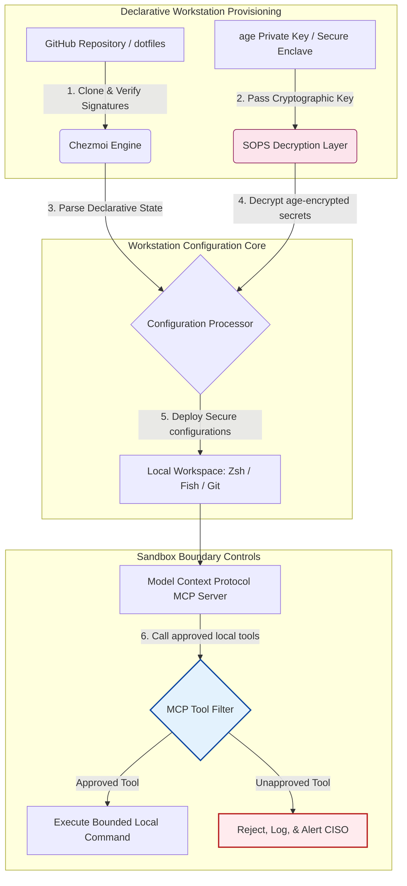

## २०२६ मध्ये AI-सजग Dotfiles: MCP, SLSA आणि मल्टी-शेल पॅरिटीसाठी सुरक्षित, पुनरुत्पादनक्षम डेव्हलपर वर्कस्टेशन तयार करणे

स्थानिक AI मॉडेल्स आणि एजेंटिक डेव्हलपर टूल्सच्या युगात घोषणात्मक वर्कस्टेशन कॉन्फिगरेशन आणि सुरक्षित सॉफ्टवेअर पुरवठा साखळ्यांमधील दरी भरून काढणे.

या लेखासाठी ओपन-सोर्स संदर्भ बिंदू म्हणजे [dotfiles ⧉](https://github.com/sebastienrousseau/dotfiles "dotfiles — declarative workstation configuration"). हे रिपॉझिटरी असे स्थान दिले आहे: macOS, Linux आणि WSL साठी घोषणात्मक dotfiles, जे मल्टी-शेल पॅरिटी, उप-सेकंद स्टार्टअप, SLSA-स्वाक्षरीकृत रिलीज आणि AI/MCP-सजग कॉन्फिगरेशन देतात.

## हा ओपन-सोर्स प्रकल्प २०२६ मध्ये का महत्त्वाचा आहे

जून २०२६ मध्ये, डेव्हलपर वर्कस्टेशन ही सॉफ्टवेअर पुरवठा साखळीतील सर्वात कमकुवत कडी आहे आणि अत्याधुनिक राज्य-पुरस्कृत व गुन्हेगारी सायबर टोळ्यांसाठी एक उच्च-मूल्याचे लक्ष्य आहे.

टर्मिनल-आधारित AI कोडिंग सहाय्यक (जसे की Claude Code) यांच्या उदयासह आणि Model Context Protocol (MCP) च्या अवलंबनासह, डेव्हलपमेंट पर्यावरणाचे सुरक्षा परिदृश्य आमूलाग्र बदलले आहे. स्थानिक डेव्हलपर टर्मिनल्स आता सक्रिय, स्वायत्त AI एजंट्सचे यजमान आहेत जे यासाठी सक्षम आहेत:

- स्थानिक स्रोत फायली वाचणे आणि संपादित करणे.
- स्थानिक CLI टूल्स कॉल करणे (`git`, `npm`, `aws`, `kubectl`).
- शेल पर्यावरण व्हेरिएबल्स, स्थानिक डेटाबेस आणि कॉन्फिगरेशन सेटिंग्जची तपासणी करणे.

जर डेव्हलपरच्या स्थानिक पर्यावरणात कठोर सीमांचा अभाव असेल, तर ही स्वायत्त AI टूल्स अनवधानाने संवेदनशील वैयक्तिक डेटा वाचू शकतात, सार्वजनिक LLM API ना क्लाउड क्रेडेन्शियल्स लीक करू शकतात, किंवा स्वयंचलित बिल्ड्स दरम्यान दुर्भावनापूर्ण पॅकेजेस कार्यान्वित करू शकतात.

Digital Operational Resilience Act (DORA) आणि NIST Cybersecurity Framework (CSF) 2.0 अंतर्गत, सॉफ्टवेअर पुरवठा साखळीत प्रवेश करणाऱ्या प्रत्येक उपकरणाच्या प्रोव्हनन्स आणि सुरक्षा अखंडतेची पडताळणी करणे वित्तीय संस्थांसाठी कायदेशीरदृष्ट्या बंधनकारक आहे. "स्नोफ्लेक लॅपटॉप" — हस्तचलितपणे कॉन्फिगर केलेले, ऑडिट न झालेले, विचलित होणारे कॉन्फिगरेशन — आता जागतिक बँकिंग मानकांशी सुसंगत राहिलेले नाहीत.

[Sebastien Rousseau's Dotfiles](https://github.com/sebastienrousseau/dotfiles) ही समस्या सोडवतात. हे एक ओपन-सोर्स, घोषणात्मक वर्कस्टेशन व्यवस्थापन फ्रेमवर्क आहे जे सुरक्षित, पुनरुत्पादनक्षम डेव्हलपर वर्कस्टेशन्स प्रस्थापित करते. एक मानकीकृत, ऑडिट करण्यायोग्य कॉन्फिगरेशन बेसलाइन लागू करून, हा प्रकल्प उच्च Return on Resilience (RoR) प्रदान करतो, डेव्हलपर ऑनबोर्डिंग वेळ आठवड्यांवरून तासांपर्यंत कमी करतो आणि संवेदनशील वित्तीय पुरवठा साखळ्यांना एंडपॉइंट असुरक्षिततेपासून संरक्षित करतो.

## AI-सजग वर्कस्टेशन २०२६ आर्किटेक्चर लेन्स

dotfiles फ्रेमवर्क एक सुरक्षित, घोषणात्मक पर्यावरण व्यवस्थापक म्हणून कार्य करते — सर्व स्थानिक शेल्स, टूल्स आणि सिक्रेट्स पद्धतशीरपणे व्यवस्थापित, ऑडिट आणि पृथक्:

| स्तर | डिझाइन निर्णय | तो का महत्त्वाचा आहे | गैरव्यवस्थापन झाल्यास धोका |
|---|---|---|---|
| **प्रोव्हिजनिंग स्तर** | Chezmoi द्वारे घोषणात्मक कॉन्फिगरेशन व्यवस्थापन | macOS, Linux आणि WSL वर पूर्णतः पुनरुत्पादनक्षम वर्कस्टेशन्स तयार करतो, विचलन नाहीसे करतो. | ऑडिट न झालेल्या, असुरक्षित स्थानिक स्थितींसह स्नोफ्लेक कॉन्फिगरेशन. |
| **शेल स्तर** | मल्टी-शेल पॅरिटी (Zsh, Fish, Nushell) | वेगवेगळ्या पर्यावरणांमध्ये एकसमान, उप-सेकंद स्टार्टअप आणि सुसंगत अलियास वर्तन सुनिश्चित करतो. | शेल कमांड विसंगती ज्यामुळे अनपेक्षित स्क्रिप्ट परिणाम होतात. |
| **सिक्रेट्स स्तर** | SOPS आणि age वापरून फाइल एन्क्रिप्शन | हार्डकोड केलेली क्रेडेन्शियल्स आणि कच्च्या की Git मध्ये कमिट होण्यापासून किंवा स्थानिक LLM ना उघड होण्यापासून रोखतो. | क्रेडेन्शियल्स सार्वजनिक रिपॉझिटरी इतिहासात लीक होणे किंवा स्थानिक एजंट्सद्वारे तडजोड होणे. |
| **AI/MCP स्तर** | Model Context Protocol सीमा नियंत्रणे | स्थानिक AI एजंट्सना मंजूर टूल्सच्या विशिष्ट यादीपुरते मर्यादित करते, सर्व स्थानिक कार्यान्वयनांचे लॉगिंग करते. | अमर्यादित AI एजंट्स स्थानिकरित्या बेलगाम किंवा विध्वंसक कमांड्स कार्यान्वित करणे. |
| **पुरवठा साखळी स्तर** | SLSA-स्वाक्षरीकृत रिलीज आणि Sigstore पडताळणी | बूटस्ट्रॅप स्क्रिप्ट्स आणि कॉन्फिगरेशन फायलींची प्रामाणिकता क्रिप्टोग्राफिकदृष्ट्या सिद्ध करते. | तडजोड झालेले सेटअप स्क्रिप्ट्स डेव्हलपर पर्यावरणात दुर्भावनापूर्ण बॅकडोअर घुसवणे. |

## मुख्य वर्कस्टेशन सुरक्षा आणि ऑटोमेशन संकेत

संपूर्ण डेव्हलपमेंट क्षेत्रात परिपूर्ण सुरक्षा राखण्यासाठी, मुख्य माहिती सुरक्षा अधिकाऱ्यांनी (CISOs) आणि तंत्रज्ञान व्यवस्थापकांनी विशिष्ट, मोजता येण्याजोगे परिचालन निर्देशक ट्रॅक केले पाहिजेत:

| संकेत | मेट्रिक / परिचालन बेंचमार्क | NIST CSF / DORA संदर्भ | तांत्रिक प्लॅटफॉर्म अंमलबजावणी |
|---|---|---|---|
| **वर्कस्टेशन पुनरुत्पादनक्षमता** | कॉन्फिगरेशन विचलनाशिवाय घोषणात्मक dotfile रिपॉझिटरींद्वारे पूर्णतः व्यवस्थापित डेव्हलपर लॅपटॉपची %. | NIST CSF 2.0 (PR.DS-01) | टर्मिनल स्टार्टअपवर स्वयंचलितपणे कार्यान्वित होणारे Chezmoi विचलन शोध ऑडिट. |
| **क्रेडेन्शियल स्वच्छता** | स्थानिक कॉन्फिगरेशन फायलींमध्ये साध्या मजकुरात संग्रहित शून्य अनएन्क्रिप्टेड सिक्रेट्स किंवा की. | DORA Article 6 (ICT सुरक्षा) | Git प्री-कमिट हुक्स आणि स्थानिक स्कॅन जे अनएन्क्रिप्टेड फायली नाकारतात. |
| **बिल्ड प्रोव्हनन्स** | क्रिप्टोग्राफिकदृष्ट्या स्वाक्षरीकृत मॅनिफेस्ट वापरून पडताळलेली १००% वर्कस्टेशन बूटस्ट्रॅप उपयुक्तता. | DORA Article 30 (पुरवठा साखळी) | सेटअप पाइपलाइनमध्ये अंतर्भूत Sigstore आणि SLSA लेव्हल 3 पडताळणी. |
| **डेव्हलपर ऑनबोर्डिंग वेळ** | कच्च्या हार्डवेअर तरतुदीपासून पूर्णतः कॉन्फिगर केलेल्या, सुसंगत डेव्हलपमेंट वर्कस्पेसपर्यंतचा निघून गेलेला वेळ. | Return on Resilience (RoR) | स्वयंचलित, घोषणात्मक सेटअप स्क्रिप्ट्स १५ मिनिटांहून कमी वेळात पर्यावरण संकलित करतात. |
| **AI एजंट मर्यादित प्रवेश** | स्थानिक AI टूल्स केवळ-वाचन डीफॉल्ट्ससह परिभाषित डिरेक्टरी मर्यादांमध्ये कार्य करतात याची पडताळणी. | Model Risk Management | MCP कॉन्फिगरेशन प्रोफाइल जे एजंट टूल कॅटलॉग मंजूर ऑपरेशन्सपुरते मर्यादित करतात. |

## घोषणात्मक कॉन्फिगरेशन ही वर्कस्टेशन सुरक्षेची गाभा का आहे

डेव्हलपर वर्कस्टेशन सेटअपचे पारंपरिक दृष्टिकोन अत्यंत हस्तचलित असतात, ज्यामुळे "स्नोफ्लेक लॅपटॉप" तयार होतात — असे पर्यावरण जिथे डेव्हलपर्स कस्टम टूल्स स्थापित करत असताना, व्हेरिएबल्स समायोजित करत असताना आणि स्थानिक स्क्रिप्ट्स सुधारत असताना कॉन्फिगरेशन कालांतराने विचलित होते. हे विचलन अनेक गंभीर असुरक्षितता निर्माण करते:

1. **ट्रॅक न झालेली शॅडो कॉन्फिगरेशन.** विचलित होणारे लॅपटॉप अनेकदा कालबाह्य, असुरक्षित सॉफ्टवेअर पॅकेजेस किंवा स्थानिक स्क्रिप्ट्स चालवतात जे कॉर्पोरेट सुरक्षा टूल्सना बायपास करतात.
2. **सिक्रेट्स लीक होणे.** डेव्हलपर्स वारंवार API की, GitHub टोकन्स किंवा AWS क्रेडेन्शियल्स थेट साध्या-मजकूर स्क्रिप्ट्स किंवा शेल प्रोफाइलमध्ये हार्डकोड करतात, ज्यामुळे ते चोरीसाठी अत्यंत असुरक्षित बनतात.
3. **अकार्यक्षम ऑनबोर्डिंग.** नवीन डेव्हलपर वर्कस्टेशन हस्तचलितपणे सेट अप करण्यास दोन आठवड्यांपर्यंत अभियांत्रिकी वेळ लागू शकतो, ज्यामुळे टीम वेगावर परिणाम होतो.

Chezmoi वापरून घोषणात्मक, मॉडेल-चालित कॉन्फिगरेशनकडे संक्रमण करून, संपूर्ण डेव्हलपर वर्कस्पेस एक आवृत्ती-नियंत्रित, पुनरुत्पादनक्षम रेकॉर्ड प्रणाली बनते. प्रत्येक बदल, अलियास, पॅकेज अवलंबित्व आणि सुरक्षा डीफॉल्ट Git मध्ये दस्तऐवजीकृत केला जातो, संस्थात्मक अनुपालन धोरणांविरुद्ध प्रमाणित केला जातो आणि भौतिक लॅपटॉपवर लागू होण्यापूर्वी क्रिप्टोग्राफिकदृष्ट्या पडताळला जातो.

## मर्यादित AI डेव्हलपर पर्यावरण डिझाइन करणे

स्थानिक AI एजंट्स आणि MCP टूल्सना स्थानिक मालमत्तेवर अमर्यादित प्रवेश मिळण्यापासून रोखण्यासाठी, वर्कस्टेशन एक मर्यादित कार्यान्वयन विमान म्हणून कार्य करणे आवश्यक आहे.

खालील परिचालन प्रवाह दर्शवतो की dotfiles फ्रेमवर्क Chezmoi, SOPS आणि age यांचे समन्वय कसे करते जेणेकरून सुरक्षित dotfiles डिक्रिप्ट आणि तैनात करता येतील, आणि त्याच वेळी MCP टूल्स कॉल करणाऱ्या स्थानिक AI एजंट्ससाठी एक पृथक्, सँडबॉक्स केलेली कार्यान्वयन सीमा राखली जाईल:

## बोर्डरूम प्लेबुक आणि विश्वस्त दायित्व

डेव्हलपर वर्कस्टेशन सुरक्षा आणि पुरवठा-साखळी अखंडता या महत्त्वाच्या बोर्डरूम प्राधान्यक्रम आहेत. वरिष्ठ व्यवस्थापकांनी विश्वस्त जबाबदारी, नियामक अनुपालन आणि व्यवसाय-मूल्य संरक्षणाच्या दृष्टीने डेव्हलपर पर्यावरण जोखीम हाताळली पाहिजे:

- **DORA Article 5 (बोर्ड जबाबदारी).** संस्थेच्या ICT जोखीम व्यवस्थापनासाठी व्यवस्थापन मंडळ (बोर्ड) अंतिम जबाबदारी उचलते असे अनिवार्य करते. कारण डेव्हलपर वर्कस्टेशन्स ही सॉफ्टवेअर पुरवठा साखळीचे प्रवेशद्वार आहेत, बोर्ड संचालकांनी नियामक ऑडिट पूर्ण करण्यासाठी एंडपॉइंट सुरक्षित, पूर्णतः ऑडिट करण्यायोग्य आणि कठोर, पुनरुत्पादनक्षम कॉन्फिगरेशन फ्रेमवर्क अंतर्गत व्यवस्थापित आहेत याची पडताळणी केली पाहिजे.
- **NIST CSF 2.0 अनुपालन (एंडपॉइंट सुरक्षा).** मानकीकृत, सुरक्षित कॉन्फिगरेशन चालवणारी केवळ अधिकृत आणि प्रमाणित उपकरणेच कॉर्पोरेट नेटवर्क आणि रिपॉझिटरींमध्ये प्रवेश करू शकतात असे मागणी करते. घोषणात्मक dotfiles सुरक्षा टीमना गणितीयदृष्ट्या सिद्ध करण्याची परवानगी देतात की सर्व डेव्हलपर पर्यावरण संस्थेच्या सुरक्षा बेसलाइनशी सुसंगत आहेत, ऑडिट न झालेल्या "स्नोफ्लेक" सेटअपचा धोका नाहीसा करतात.
- **ताळेबंद मूल्याचे संरक्षण.** एकच तडजोड झालेले डेव्हलपर क्रेडेन्शियल किंवा पुरवठा-साखळी उल्लंघन एखाद्या संस्थेला उपाययोजना, नियामक दंड आणि प्रतिष्ठेच्या हानीमध्ये लाखो डॉलर्स खर्च करू शकते. सुरक्षित, घोषणात्मक डेव्हलपर पर्यावरणाकडे संक्रमण थेट हा धोका कमी करते, ताळेबंद मूल्याचे जतन करते आणि ग्राहकांचा विश्वास संरक्षित करते.

## बँकेच्या प्रकारानुसार याचा अर्थ काय

### जागतिक पद्धतशीरदृष्ट्या महत्त्वाच्या बँका (G-SIBs)

G-SIBs अनेक खंड आणि नियामक अधिकारक्षेत्रांमध्ये हजारो डेव्हलपर वर्कस्टेशन्स व्यवस्थापित करतात. त्यांचे प्राथमिक आव्हान म्हणजे प्रचंड अभियांत्रिकी टीममध्ये कॉन्फिगरेशन सुसंगतता राखणे आणि क्रेडेन्शियल लीक होणे रोखणे. Chezmoi वापरून घोषणात्मक, ओपन-सोर्स dotfiles मॉडेल स्वीकारून, G-SIBs एंडपॉइंट सुरक्षा मानकीकृत करू शकतात, अनुपालन ऑडिटिंग स्वयंचलित करू शकतात आणि संपूर्ण जागतिक संस्थेत डेव्हलपर ऑनबोर्डिंग वेळ आठवड्यांवरून मिनिटांपर्यंत कमी करू शकतात.

### व्यवहार आणि कॉर्पोरेट बँका

व्यवहार बँका संवेदनशील पेमेंट गेटवे आणि होलसेल क्लिअरिंग पायाभूत सुविधा चालवतात. या उत्पादन पर्यावरणांमध्ये तैनात केलेल्या कोडची परिपूर्ण अखंडता सिद्ध करणे ही एक विना-समझोता नियामक मागणी आहे. सुरक्षित, SLSA-सुसंगत dotfiles फ्रेमवर्क अंतर्गत डेव्हलपर वर्कस्टेशन्स मानकीकृत केल्याने सॉफ्टवेअर पुरवठा साखळी पूर्णतः ऑडिट झालेली आणि स्थानिक डेव्हलपर एंडपॉइंट असुरक्षिततेपासून संरक्षित असल्याची हमी मिळते.

### प्रादेशिक आणि लहान बँका

प्रादेशिक बँकांना G-SIBs च्या प्रचंड सुरक्षा अर्थसंकल्पांशिवाय उच्च सायबरसुरक्षा मानके राखली पाहिजेत. हे ओपन-सोर्स dotfiles फ्रेमवर्क एक हलके, किफायतशीर आणि अत्यंत सुरक्षित Python व Rust-अनुकूल समाधान प्रदान करते, ज्यामुळे लहान संस्था महागड्या मालकीच्या सॉफ्टवेअर परवान्यांशिवाय एंटरप्राइझ-दर्जाची एंडपॉइंट सुरक्षा आणि पुरवठा-साखळी संरक्षण अंमलात आणू शकतात.

## निष्कर्ष: डेव्हलपर वर्कस्टेशन रोडमॅप

डेव्हलपर वर्कस्टेशन आता एक परिघीय उपकरण राहिलेले नाही; ते सॉफ्टवेअर पुरवठा साखळीतील एक महत्त्वाचे नियंत्रण विमान आहे. हस्तचलितपणे कॉन्फिगर केलेल्या, ऑडिट न झालेल्या "स्नोफ्लेक लॅपटॉप" ना कॉर्पोरेट मालमत्तेत प्रवेश देणे हा एक गंभीर परिचालन आणि नियामक धोका आहे.

सॉफ्टवेअर पुरवठा साखळी सुरक्षित करण्यासाठी आणि एंडपॉइंट्सना स्थानिक AI-एजंट असुरक्षिततेपासून संरक्षित करण्यासाठी, वरिष्ठ तंत्रज्ञान आणि सुरक्षा व्यवस्थापकांनी आजच एक स्पष्ट डेव्हलपमेंट रोडमॅप कार्यान्वित केला पाहिजे:

1. **घोषणात्मक तरतूद अनिवार्य करा.** हस्तचलित, दस्तऐवज-चालित सेटअप प्रक्रिया टप्प्याटप्प्याने बंद करा आणि सर्व डेव्हलपर पर्यावरणे Chezmoi वापरून घोषणात्मकपणे पुरवली जातील हे अनिवार्य करा.
2. **सिक्रेट्स स्वच्छता लागू करा.** स्थानिक वर्कस्टेशन कॉन्फिगरेशनमध्ये साध्या मजकुरात शून्य कच्ची क्रेडेन्शियल्स, की किंवा API टोकन्स संग्रहित आहेत याची खात्री करण्यासाठी कठोर प्री-कमिट हुक्स आणि स्कॅनिंग उपयुक्तता लागू करा.
3. **AI सँडबॉक्स सीमा प्रस्थापित करा.** स्थानिक AI कोडिंग सहाय्यक आणि एजंट्सना मंजूर, केवळ-वाचन टूल्स आणि डिरेक्टरींपुरते मर्यादित करण्यासाठी सुरक्षित, मर्यादित MCP कॉन्फिगरेशन प्रोफाइल अंमलात आणा.
4. **पुरवठा साखळी सुरक्षित करा.** तैनातीपूर्वी सर्व बूटस्ट्रॅप स्क्रिप्ट्स आणि पर्यावरण कॉन्फिगरेशन SLSA लेव्हल 3 प्रोव्हनन्स वापरून क्रिप्टोग्राफिकदृष्ट्या पडताळले जातील याची खात्री करा.

## वारंवार विचारले जाणारे प्रश्न

**Chezmoi म्हणजे काय आणि ते dotfiles साठी का वापरले जाते?**

Chezmoi हा एक ओपन-सोर्स, सुरक्षित, घोषणात्मक dotfile व्यवस्थापक आहे. तो डेव्हलपर्सना त्यांचे स्थानिक कॉन्फिगरेशन आवृत्ती-नियंत्रित रिपॉझिटरी म्हणून व्यवस्थापित करण्याची परवानगी देतो, ज्यामुळे वेगवेगळ्या ऑपरेटिंग सिस्टीममध्ये (macOS, Linux, WSL) परिपूर्ण सुसंगतता आणि पुनरुत्पादनक्षमता सुनिश्चित होते.

**फ्रेमवर्क सिक्रेट्सचे संरक्षण कसे करते?**

फ्रेमवर्क संवेदनशील क्रेडेन्शियल्स (जसे की GitHub टोकन्स किंवा क्लाउड ऍक्सेस की) थेट dotfile रिपॉझिटरीमध्ये एन्क्रिप्ट करण्यासाठी SOPS (Secrets Operations) आणि age फाइल एन्क्रिप्शन वापरतो. यामुळे की साध्या मजकुरात कमिट होण्यापासून किंवा अनधिकृत स्थानिक AI एजंट्सद्वारे वाचल्या जाण्यापासून रोखल्या जातात.

**Model Context Protocol (MCP) म्हणजे काय आणि त्याचा सुरक्षेवर कसा परिणाम होतो?**

MCP हे एक खुले मानक आहे जे AI मॉडेल्सना स्थानिक टूल्स सुरक्षितपणे कार्यान्वित करण्याची आणि फायलींमध्ये प्रवेश करण्याची परवानगी देते. dotfiles फ्रेमवर्क स्थानिक AI टूल्स आणि एजंट्सना मंजूर डिरेक्टरी आणि कमांड्सपुरते मर्यादित करण्यासाठी कठोर MCP कॉन्फिगरेशन फायली अंमलात आणते.

**फ्रेमवर्क कोणत्या शेल्सना समर्थन देते?**

Bash, Zsh, Fish, Nushell आणि PowerShell — macOS, Linux आणि WSL वर पॅरिटीसह, जेणेकरून डेव्हलपर कोणतेही टर्मिनल उघडले तरी कमांड वर्तन एकसमान राहते.

## संदर्भ

- Open Source Security Foundation (OpenSSF), (2024). *Supply-chain Levels for Software Artifacts (SLSA)*. येथे उपलब्ध: [SLSA Framework ⧉](https://slsa.dev/ "SLSA framework").
- NIST, (2024). *NIST Cybersecurity Framework 2.0*. Gaithersburg: National Institute of Standards and Technology. येथे उपलब्ध: [NIST CSF 2.0 ⧉](https://www.nist.gov/cyberframework "NIST Cybersecurity Framework 2.0").
- European Parliament and Council of the European Union, (2022). *Regulation (EU) 2022/2554 on digital operational resilience for the financial sector (DORA)*. Brussels: Official Journal of the European Union. येथे उपलब्ध: [DORA Regulation ⧉](https://eur-lex.europa.eu/legal-content/EN/TXT/?uri=CELEX%3A32022R2554 "DORA regulation").
- GitHub, (2026). *dotfiles open-source repository*. येथे उपलब्ध: [dotfiles Repository ⧉](https://github.com/sebastienrousseau/dotfiles "dotfiles repository").
