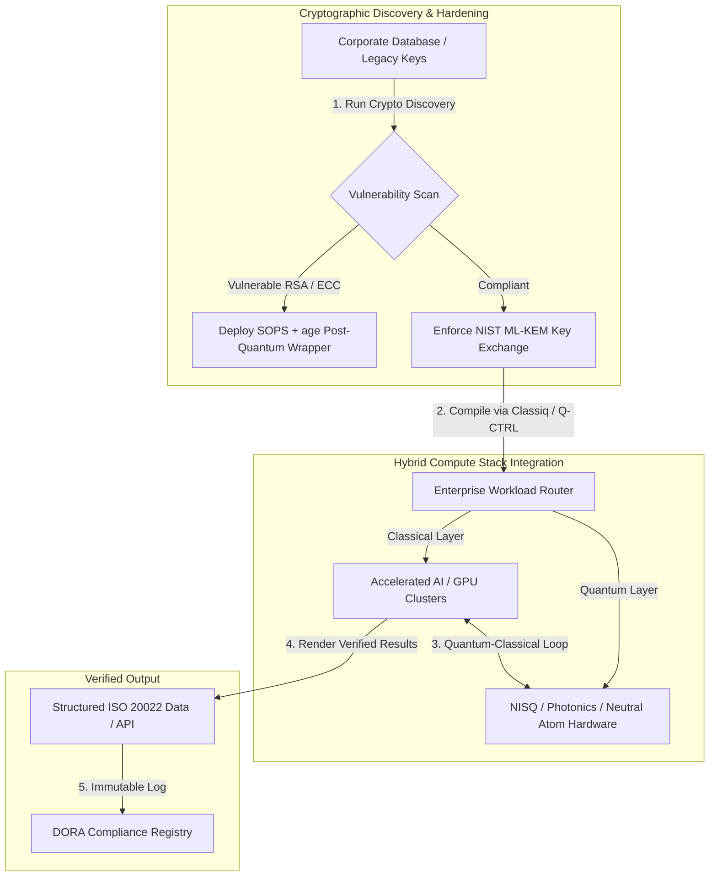

## क्यूबिट्सपासून नफ्यापर्यंत: Economist च्या 5व्या वार्षिक Commercialising Quantum Global 2026 शिखर परिषदेतील धोरणात्मक निष्कर्ष

एंटरप्राइझ सज्जता, पोस्ट-क्वांटम क्रिप्टोग्राफी स्थलांतरे, संकरित संगणन स्टॅक आणि क्वांटम सेन्सिंग व नेटवर्किंगचे उदयोन्मुख व्यावसायिक क्षेत्र.

**थोडक्यात.** Economist Impact ने 16–17 जून 2026 रोजी लंडनमधील Business Design Centre येथे आयोजित केलेल्या 5व्या वार्षिक Commercialising Quantum Global 2026 परिषदेत एंटरप्राइझ, वित्त, धोरण आणि संशोधन क्षेत्रांतील 1,100 हून अधिक जागतिक नेते एकत्र आले. मध्यवर्ती थीमने एक स्पष्ट संरचनात्मक वळण अधोरेखित केले: क्वांटम तंत्रज्ञान सट्टेबाज प्रयोगशाळा विज्ञानाकडून व्यावहारिक, संकरित एंटरप्राइझ वर्कफ्लोकडे संक्रमित झाले आहे. केवळ 2026 च्या पहिल्या पाच महिन्यांत उभ्या राहिलेल्या $1.3 अब्ज व्हेंचर कॅपिटलच्या पाठिंब्याने, बोर्डरूममधील चर्चा आता भौतिक क्यूबिट्स मोजण्यावर केंद्रित नाही, तर "नो-रिग्रेट्स" संकरित संगणन स्टॅक प्रस्थापित करणे, "harvest-now, decrypt-later" (SNDL) क्रिप्टोग्राफिक धोक्यापासून डिजिटल मालमत्ता सुरक्षित करणे आणि GPS-स्वतंत्र नेव्हिगेशनसाठी अल्पकालीन क्वांटम सेन्सिंग प्रणाली तैनात करणे यावर केंद्रित आहे.

## महत्त्वाचे मुद्दे

- **व्यावहारिक वर्कफ्लोकडे एंटरप्राइझचे स्थलांतर.** उद्योग नेत्यांनी (HorizonX चे [Steve Suarez](https://www.linkedin.com/in/stevesuarez), HSBC चे [Phil Intallura](https://www.linkedin.com/in/intallura)) यावर भर दिला की क्वांटम एकत्रीकरण ही आता भौतिकशास्त्राची नाही तर कार्यात्मक समस्या आहे. बँका आणि एंटरप्राइझेस प्रतिभा तयार करण्यासाठी आणि सक्रिय वर्कलोड इष्टतम करण्यासाठी संकरित क्वांटम-शास्त्रीय पायलट तैनात करत आहेत.
- **पोस्ट-क्वांटम क्रिप्टोग्राफी (PQC) ही बोर्ड प्राधान्यता आहे.** सुरक्षा आणि कायदेशीर तज्ज्ञांनी (CMS UK, Microsoft च्या [Joanne Miller](https://www.linkedin.com/in/joanne-miller-nso), EY च्या [Craig Farrell](https://www.linkedin.com/in/craig-farrell)) इशारा दिला की संस्था PQC तैनात करण्यासाठी फॉल्ट-टॉलरंट हार्डवेअरची वाट पाहू शकत नाहीत. "Harvest-now, decrypt-later" harvesting आज घडत आहे, ज्यामुळे NIST ML-KEM मानकांकडे स्थलांतर करणे ही तात्काळ विश्वस्त चिंता बनते.
- **क्वांटम सेन्सिंग अल्पकालीन नफेखोरीत आघाडीवर.** फॉल्ट-टॉलरंट संगणन अजून काही वर्षे दूर असले तरी, क्वांटम सेन्सिंग (Infleqtion चे [Matthew Kinsella](https://www.linkedin.com/in/matthewkinsella)) झपाट्याने वाढत आहे. क्वांटम घड्याळे आणि इनर्शियल सेन्सर्स GPS-स्वतंत्र नेव्हिगेशन, राष्ट्रीय सुरक्षा आणि अति-स्थिर ऊर्जा ग्रिडमध्ये तैनात केले जात आहेत.
- **सार्वभौमत्व, क्लस्टर्स आणि धोरणात्मक निकड.** यूके विज्ञान मंत्री [Lord Vallance](https://www.linkedin.com/in/patrick-vallance) आणि [Lord William Hague](https://www.linkedin.com/in/williamhague) यांनी संशोधनाचे औद्योगिक-प्रमाणातील "सुपरक्लस्टर्स" मध्ये रूपांतर करण्याच्या, National Quantum Computing Centre (NQCC) शी समन्वय साधणाऱ्या राष्ट्रीय मोहिमांची रूपरेषा मांडली. येऊ घातलेला EU Quantum Act सार्वभौम संगणन क्षमतेसाठीच्या भौगोलिक-राजकीय स्पर्धेला आणखी अधोरेखित करतो.
- **Quantcore ने qBIG पारितोषिक जिंकले.** University of Glasgow ची स्पिन-आउट Quantcore ने पारंपरिक साहित्यांपेक्षा उच्च तापमानावर कार्य करणाऱ्या तिच्या नायोबियम-आधारित सुपरकंडक्टिंग घटकांसाठी IOP qBIG पारितोषिक मिळवले, जे क्रायोजेनिक पायाभूत सुविधांचा भार लक्षणीयरीत्या कमी करतात.

**संबंधित वाचन:** [KyberLib आणि 2026 मधील पोस्ट-क्वांटम बँकिंग स्थलांतर: मानकांपासून कोडपर्यंत](https://sebastienrousseau.com/2026-06-12-kyberlib-post-quantum-banking-migration-standards-code-2026/), [2026 मधील बँकिंग रेझिलियन्स इंडेक्स: AI, क्लाउड, क्वांटम, पेमेंट्स आणि तृतीय-पक्ष एकाग्रता जोखीम](https://sebastienrousseau.com/2026-06-08-banking-resilience-index-ai-cloud-quantum-payments-third-party-risk-2026/), [2026 मधील क्लाउड नेटिव्ह बँकिंग इंडेक्स: DORA, प्लॅटफॉर्म इंजिनीअरिंग, सार्वभौम क्लाउड आणि ऑपरेशनल रेझिलियन्स](https://sebastienrousseau.com/2026-06-05-cloud-native-banking-index-dora-resilience-platform-engineering-2026/).

## 01. 2026 ची शिखर परिषद बोर्डरूमसाठी का महत्त्वाची आहे

Economist च्या Commercialising Quantum Global शिखर परिषदेच्या 2026 आवृत्तीने कॉर्पोरेट जग डीप टेकचे मूल्यमापन कसे करते यात कायमस्वरूपी बदल घडवला.

ऐतिहासिकदृष्ट्या, क्वांटम संगणनाला अनेक दशकांचा वैज्ञानिक प्रयत्न म्हणून R&D विभागांपुरते मर्यादित ठेवले जात असे. जून 2026 मध्ये, हा दृष्टिकोन कालबाह्य झाला आहे. संस्थांनी "भौतिकशास्त्र-केंद्रित" कुतूहलाकडून "व्यवसाय-केंद्रित" अंमलबजावणीकडे स्थलांतर करायला हवे. याचे कारण दुहेरी आहे:

1. **क्वांटम-AI संगम.** उच्च-कार्यक्षमता संगणन (HPC) स्टॅक शास्त्रीय, प्रवेगित AI आणि NISQ (Noisy Intermediate-Scale Quantum) नोड्स यांना एकाच, एकत्रित संगणन स्तरात विलीन करत आहेत. क्वांटम-सज्ज ॲप्लिकेशन तयार करण्यास विलंब करणाऱ्या संस्थांना कळेल की धोरणात्मक फायदा हस्तगत करण्याची संधीची खिडकी अपेक्षेपेक्षा वेगाने बंद होत आहे.
2. **भौगोलिक-राजकीय आणि विश्वस्त निकड.** यूकेच्या मोहीम-नेतृत्वाखालील क्वांटम कार्यक्रमासह आणि येऊ घातलेल्या EU Quantum Act सह, क्वांटम क्षमता ही राष्ट्रीय सार्वभौमत्व आणि कॉर्पोरेट निरंतरतेची बाब बनली आहे.

शिवाय, पोस्ट-क्वांटम सायबरसुरक्षा ही आता भविष्यातील अनुपालन आवश्यकता राहिलेली नाही. प्रतिकूल "store now, decrypt later" (SNDL) हल्ल्यांचा धोका म्हणजे आज अडवलेला कॉर्पोरेट डेटा व्यावसायिक क्वांटम प्रणाली विस्तारल्यावर डिक्रिप्ट केला जाईल, ज्यामुळे Digital Operational Resilience Act (DORA) सारख्या जागतिक ऑपरेशनल रेझिलियन्स आदेशांखाली तात्काळ दायित्व निर्माण होते.

## 02. Commercialising Quantum 2026 धोरणात्मक दृष्टिकोन

एंटरप्राइझ तंत्रज्ञान नेत्यांनी क्वांटम परिपक्वता पाच वेगळ्या कार्यात्मक स्तरांवर आरेखित करून कालावधीचे क्षितिज आणि ताळेबंदातील जोखमींचे मूल्यमापन करायला हवे.

### तक्ता 1: Commercialising Quantum 2026 धोरणात्मक दृष्टिकोन

| स्तर | कॉर्पोरेट फोकस | कालावधी / क्षितिज | मुख्य कॉर्पोरेट जोखीम |
| ---- | ---- | ---- | ---- |
| **हार्डवेअर आणि कंपायलर** | स्पर्धात्मक दृष्टिकोनांमधून निवड (सुपरकंडक्टिंग, ट्रॅप्ड आयन्स, न्यूट्रल अणू, फोटॉनिक्स) | 3 – 5 वर्षे (फॉल्ट-टॉलरन्स) | मृत-अंत आर्किटेक्चरमध्ये अडकणे किंवा एकाच प्लॅटफॉर्मला खूप लवकर पाठिंबा देणे. |
| **क्रिप्टोग्राफिक हार्डनिंग** | क्रिप्टोग्राफिक अवलंबित्वांचा शोध आणि यादी; NIST ML-KEM कडे स्थलांतर | तात्काळ (सक्रिय स्थलांतर) | DORA आणि NIST CSF 2.0 अंतर्गत प्रणालीगत डेटा उल्लंघन आणि अनुपालन अपयश. |
| **क्वांटम सेन्सिंग** | GPS-स्वतंत्र नेव्हिगेशन, अति-स्थिर घड्याळे आणि ग्रॅव्हिमीटर्सची तैनाती | 1 – 2 वर्षे (तात्काळ व्यावसायिक) | GPS jamming मुळे लॉजिस्टिक्स, शिपिंग आणि ऊर्जा ग्रिडमधील कार्यात्मक व्यत्यय. |
| **सिस्टम एकत्रीकरण** | क्वांटम हार्डवेअरला विद्यमान शास्त्रीय HPC आणि सुपरकंप्युटिंग डेटा सेंटरशी जोडणे | 1 – 3 वर्षे (संकरित टप्पा) | उच्च लेटन्सी, डेटा-हस्तांतरण अडथळे आणि विखंडित संगणन सायलो. |
| **एंटरप्राइझ सॉफ्टवेअर** | उच्च-स्तरीय ॲब्स्ट्रॅक्शन स्तर आणि APIs द्वारे क्वांटम अल्गोरिदम उघड करणे (Classiq, Q-CTRL) | तात्काळ (कौशल्य उभारणी) | प्रत्यक्ष अभियांत्रिकी अंमलबजावणीपासून प्रतिभा आणि वर्कफ्लोचे विलगीकरण. |

## 03. महत्त्वाचे क्वांटम संकेत आणि बोर्डरूम ट्रिगर्स

तंत्रज्ञान नेत्यांनी त्यांच्या क्वांटम गुंतवणुकीचे मार्गदर्शन करण्यासाठी विशिष्ट, मोजता येणाऱ्या बाजार आणि नियामक मापदंडांवर लक्ष ठेवायला हवे.

### तक्ता 2: महत्त्वाचे क्वांटम संकेत आणि बोर्डरूम ट्रिगर्स

| संकेत | मात्रात्मक मापदंड | नियामक / धोरण संदर्भ | कृतीयोग्य प्लॅटफॉर्म प्राधान्यता |
| ---- | ---- | ---- | ---- |
| **क्वांटम निधीची लाट** | 2026 च्या पहिल्या पाच महिन्यांत जागतिक स्तरावर $1.3 अब्ज उभे | Return on Resilience (RoR) | बजेट सट्टेबाज पायलटकडून "नो-रिग्रेट्स" संकरित क्वांटम-शास्त्रीय वर्कलोडकडे वळवा. |
| **डेटा डिक्रिप्शन एक्सपोजर** | सार्वजनिक वाहिन्यांवर प्रसारित 100% एन्क्रिप्टेड डेटा SNDL harvesting ला उघड | DORA Article 6 (ICT सुरक्षा) | संपूर्ण मालमत्तेतील असुरक्षित RSA/ECC की ओळखण्यासाठी क्रिप्टोग्राफिक डिस्कव्हरी साधने अंमलात आणा. |
| **सार्वभौम पायाभूत सुविधा** | £2.5 अब्ज UK National Quantum Strategy वाटप | UK Quantum Missions / Lord Vallance | NQCC सारख्या राष्ट्रीय सुपरक्लस्टर्सशी स्थानिक भागीदारी प्रस्थापित करा. |
| **अनुपालन अंतिम मुदती** | 14 नोव्हेंबर 2026 SWIFT स्ट्रक्चर्ड-ॲड्रेस कटओव्हर | SWIFT SR 2026 निर्देश | स्ट्रक्चर्ड XML तपशील पूर्ण करण्यासाठी आंतरबँक डेटाबेस स्वच्छ करा आणि स्वरूपित करा. |

## 04. मुख्य शिखर परिषद थीम्समध्ये सखोल दृष्टीक्षेप

### क्वांटम गुंतवणुकीच्या टिपिंग पॉइंटला पोहोचले

व्हेंचर कॅपिटल निधीत लक्षणीय गती आली आहे, केवळ 2026 च्या पहिल्या पाच महिन्यांत **$1.3 अब्ज** उभे राहिले. मागील वर्षांच्या सट्टेबाज हाइप सायकलच्या विपरीत, सध्याच्या भांडवली लाटेला वास्तविक-जगातील, अल्पकालीन वर्कलोडचा पाठिंबा आहे. Classiq आणि IBM Quantum Platform च्या वक्त्यांनी दाखवून दिले की सॉफ्टवेअर ॲब्स्ट्रॅक्शन स्तर आणि स्वयंचलित कंपायलर बिगर-तज्ज्ञ डेव्हलपर संघांना आजच्या शास्त्रीय पायाभूत सुविधांवर संकरित क्वांटम-शास्त्रीय अल्गोरिदम कसे चालवण्यास परवानगी देतात. ही "नो-रिग्रेट्स" रणनीती संस्थांना क्वांटम-सज्ज प्रतिभा आणि वर्कफ्लो तात्काळ तयार करण्यास सक्षम करते.

### "harvest now, decrypt later" वरील कायदेशीर आणि नियामक इशारे

कायदेशीर भागीदार आणि सायबरसुरक्षा अधिकाऱ्यांनी डेटा जोखमीच्या तात्कालिकतेभोवती मोठे लक्ष वेधले. प्रायोजक कायदा फर्म CMS UK चे प्रतिनिधी आणि Microsoft CSO [Joanne Miller](https://www.linkedin.com/in/joanne-miller-nso) यांनी वरिष्ठ व्यवस्थापनाला स्पष्ट इशारा दिला: *पोस्ट-क्वांटम क्रिप्टोग्राफी तैनात करण्यापूर्वी फॉल्ट-टॉलरंट हार्डवेअर येण्याची वाट पाहणे हे एक गंभीर विश्वस्त अपयश आहे.*

"store now, decrypt later" (SNDL) प्रतिमानाखाली, शत्रुत्ववादी घटक क्रिप्टोग्राफिकदृष्ट्या समर्पक क्वांटम संगणक उदयास येताच डिक्रिप्ट करण्याच्या हेतूने आज सक्रियपणे एन्क्रिप्टेड कॉर्पोरेट डेटा harvest करत आहेत. दीर्घायुषी संवेदनशील डेटासेट, बौद्धिक संपदा आणि ऐतिहासिक ग्राहक नोंदींचे संरक्षण करण्यासाठी संस्थांनी पोस्ट-क्वांटम संरक्षण (जसे की NIST ML-KEM) तात्काळ तैनात करायला हवे.

### "क्वांटम सेन्सिंग" हाइपची पुनर्रचना

फॉल्ट-टॉलरंट क्वांटम संगणन अजून काही वर्षे दूर असले तरी, शिखर परिषदेने क्वांटम सेन्सिंगला वास्तविक-जगातील तैनातीची पहिली खऱ्या अर्थाने नफेखोर लाट म्हणून अधोरेखित केले. Infleqtion चे मुख्य कार्यकारी [Matthew Kinsella](https://www.linkedin.com/in/matthewkinsella) यांनी सविस्तर सांगितले की क्वांटम घड्याळे, इनर्शियल सेन्सर्स आणि रेडिओ-फ्रिक्वेन्सी प्रणाली अनेक उद्योगांमध्ये कशा झपाट्याने वाढत आहेत.

ही तंत्रज्ञाने भौतिक स्थिरांक उप-अणु अचूकतेने मोजत असल्यामुळे, ती **GPS-स्वतंत्र नेव्हिगेशन**, अति-स्थिर ऊर्जा ग्रिड आणि खोल-अंतराळ दूरसंचार सक्षम करतात. वाढत्या GPS-jamming धोक्यांना तोंड देणाऱ्या विमानचालन, सागरी वाहतूक आणि राष्ट्रीय-संरक्षण प्रणालींसाठी हे ॲप्लिकेशन अत्यंत समर्पक आहेत.

### इकोसिस्टम आणि क्लस्टर सहकार्य

यूके क्वांटम इकोसिस्टमने लंडन शिखर परिषदेचा वापर देशांतर्गत नवोन्मेष सुपरक्लस्टर्स प्रदर्शित करण्यासाठी केला. National Quantum Computing Centre (NQCC) आणि Digital Catapult कडून थेट अद्यतनांनी सविस्तर सांगितले की सुरुवातीच्या-टप्प्यातील डीप-टेक स्पिन-आउट्स क्वांटम हार्डवेअर थेट शास्त्रीय सुपरकंप्युटिंग डेटा सेंटरमध्ये एकत्रित करून "तंत्रज्ञान दरी" कशी भरून काढू शकतात.

स्कॉटिश क्वांटम स्टार्टअप Quantcore चे सह-संस्थापक [Wridhdhisom Karar](https://www.linkedin.com/in/wridhdhisomkarar) यांनी कंपनीच्या नायोबियम-आधारित सुपरकंडक्टिंग घटकांसाठी प्रतिष्ठित Institute of Physics (IOP) Quantum Business Innovation and Growth (qBIG) पारितोषिक स्वीकारले. हे घटक पारंपरिक साहित्यांपेक्षा उच्च तापमानावर कार्य करतात, ज्यामुळे क्वांटम प्रोसेसर विस्तारण्यासाठी आवश्यक क्रायोजेनिक पायाभूत सुविधांचा भार लक्षणीयरीत्या कमी होतो.

### HSBC केस स्टडी: क्वांटमची वाट पाहणे ही "टाळता येणारी चूक" का आहे

Economist च्या 5व्या वार्षिक Commercialising Quantum कार्यक्रमात (2026) [**Philip Intallura, Ph.D.**](https://www.linkedin.com/in/intallura) (HSBC चे Global Head of Quantum Technologies, यूके सरकारचे सल्लागार आणि बोर्ड सल्लागार) यांच्या अंतर्दृष्टींनी एक प्रभावी बोर्डरूम निर्देश दिला: *"तुम्ही सुरुवात करण्यापूर्वी फॉल्ट-टॉलरंट क्वांटमची वाट पाहणे ही एक टाळता येणारी चूक आहे."*

डॉ. Intallura यांनी युक्तिवाद केला की वित्तीय संस्थांमधील सामान्य "थांबा-आणि-पाहा" दृष्टिकोन तीन चुकीच्या गृहीतकांवर आधारलेला स्वयं-गोल आहे:

- **अल्पकालीन ROI वास्तविक आहे.** प्रायोगिक चाचणीत, HSBC ने सध्या उत्पादनात चालणाऱ्या मॉडेल्सपेक्षा उत्तम कामगिरी केली आहे, क्वांटम कार्य व्यवसायाच्या इतर भागांशी जोडले आहे, त्यांच्या काही सर्वात मोठ्या ग्राहकांशी संबंध अधिक घट्ट करण्यासाठी क्वांटमचा वापर केला आहे आणि **HSBC Innovation Banking** मध्ये लक्षणीय नवीन व्यवसाय आकर्षित केला आहे.
- **क्वांटम हा तीव्र अवलंबन वक्र आहे.** एका अत्यंत नियंत्रित संस्थेच्या आत क्षमता उभारणे, रणनीती ठरवणे, निधी सुरक्षित करणे आणि प्रयोग चक्र चालवणे हे काही अल्पकालीन काम नाही. तंत्रज्ञानासाठी प्रक्रियांची पद्धतशीरपणे चाचणी करून त्यांचे रूपांतर करावे लागते.
- **क्वांटम ही एक इकोसिस्टम आहे.** एकही एकल खेळाडू तिथवर एकट्याने पोहोचत नाही. HSBC ने अंमलात आणलेला प्रत्येक संशोधन शोधनिबंध, POC आणि पायलट एका क्वांटम प्रदात्याच्या जवळच्या सहकार्याने झाला आहे — आणि काही प्रकरणांत, हे सहकार्य शैक्षणिक संस्था, नियामक आणि सरकारपर्यंत विस्तारते.

**समारोपीय बोर्डरूम निर्देश:** *"फॉल्ट टॉलरन्सच्या पहिल्या दिवशी तुम्हाला जी क्षमता लागेल, ती क्षमता तुम्ही आत्ता उभारता आहात."*

## 05. कॉर्पोरेट क्वांटम एकत्रीकरण आणि क्रिप्टोग्राफी पाइपलाइन

क्वांटम सज्जता उभारताना डिजिटल मालमत्ता सुरक्षित करण्यासाठी, एंटरप्राइझने एक स्पष्ट एकत्रीकरण पाइपलाइन प्रस्थापित करायला हवी.

## 06. बोर्डरूम प्लेबुक: कृतीयोग्य अनिवार्यता

Commercialising Quantum Global 2026 शिखर परिषदेतील अंतर्दृष्टींचे तात्काळ व्यावसायिक मूल्यात रूपांतर करण्यासाठी, वरिष्ठ व्यवस्थापनाने खालील चार-टप्प्यांची बोर्डरूम प्लेबुक अंमलात आणावी:

1. **क्रिप्टोग्राफिक डिस्कव्हरी अनिवार्य करा.** पोस्ट-क्वांटम स्थलांतराची तयारी करण्यासाठी संपूर्ण एंटरप्राइझमधील प्रत्येक लेगसी RSA आणि ECC की आरेखित करत, सर्व क्रिप्टोग्राफिक मालमत्तेची यादी करण्यासाठी Chief Information Security Officer (CISO) ला निर्देश द्या.
2. **"नो-रिग्रेट्स" संकरित रणनीती तैनात करा.** परिपूर्ण हार्डवेअरची वाट पाहणे टाळा. आजच अंतर्गत प्रतिभा विकसित करण्यासाठी आणि जटिल लॉजिस्टिक्स किंवा जोखीम पोर्टफोलिओ इष्टतम करण्यासाठी क्वांटम-प्रेरित सॉफ्टवेअर आणि संकरित शास्त्रीय-क्वांटम पायलटमध्ये गुंतवणूक करा.
3. **लॉजिस्टिक्ससाठी क्वांटम सेन्सिंगचे मूल्यमापन करा.** जर तुमची संस्था जागतिक पुरवठा साखळ्या, शिपिंग किंवा गंभीर पायाभूत सुविधांवर अवलंबून असेल, तर भौगोलिक-राजकीय व्यत्यय जोखीम कमी करण्यासाठी क्वांटम सेन्सिंग प्रणालींचे (जसे की GPS-स्वतंत्र नेव्हिगेशन) सक्रियपणे मूल्यमापन करा.
4. **30 जूनच्या Insight Hour साठी नोंदणी करा.** एंटरप्राइझ जोखीम व्यवस्थापन आणि प्रतिभा वाटप रणनीतींचा मागोवा घेणे सुरू ठेवण्यासाठी तुमच्या तंत्रज्ञान नेत्यांनी 30 जून 2026 रोजी दुपारी 3:00 वाजता BST (IonQ द्वारे समर्थित) आभासी **Commercialising Quantum Global Insight Hour** साठी नोंदणी केल्याची खात्री करा.

## 07. वारंवार विचारले जाणारे प्रश्न

**"harvest now, decrypt later" (SNDL) म्हणजे काय आणि ते आज का महत्त्वाचे आहे?**
SNDL ही आज एन्क्रिप्टेड डेटा अडवून साठवण्याची प्रथा आहे, ज्याचा हेतू क्रिप्टोग्राफिकदृष्ट्या समर्पक क्वांटम संगणक उपलब्ध होताच तो नंतर डिक्रिप्ट करण्याचा असतो. दीर्घायुषी संवेदनशील डेटासेट — बौद्धिक संपदा, ग्राहक नोंदी, सरकारी संदेशवहन — यांना आधीच लक्ष्य केले जात आहे. NIST ML-KEM कडे स्थलांतर करणे हा एक विश्वस्त निर्णय आहे जो बोर्ड पुढे ढकलू शकत नाही.

**संगणनाऐवजी क्वांटम सेन्सिंग ही पहिली व्यावसायिक लाट का आहे?**
क्वांटम सेन्सर्स भौतिक स्थिरांक उप-अणु अचूकतेने मोजतात आणि त्यांना क्वांटम संगणनासारख्या फॉल्ट-टॉलरंट हार्डवेअरची आवश्यकता नसते. क्वांटम घड्याळे, ग्रॅव्हिमीटर्स आणि इनर्शियल सेन्सर्स GPS-स्वतंत्र नेव्हिगेशन, अति-स्थिर ऊर्जा ग्रिड आणि खोल-अंतराळ संदेशवहनासाठी आधीच पायलट तैनातीत आहेत.

**HSBC चे क्वांटम कार्य केवळ R&D आहे की त्याने मोजता येणारा परतावा दिला आहे?**
शिखर परिषदेत Philip Intallura यांच्या मते, HSBC ने सध्या उत्पादनात चालणाऱ्या मॉडेल्सपेक्षा उत्तम कामगिरी केली आहे, त्यांच्या सर्वात मोठ्या ग्राहकांशी संबंध अधिक घट्ट करण्यासाठी क्वांटमचा वापर केला आहे आणि HSBC Innovation Banking मध्ये लक्षणीय नवीन व्यवसाय आकर्षित केला आहे. हे कार्य संशोधनाकडून कार्यात्मक एकत्रीकरणाकडे पुढे सरकले आहे.

## 08. संदर्भ

- **Economist Impact, (2026).** *5th Annual Commercialising Quantum Global 2026.* थेट परिषद कामकाज, 16–17 जून 2026. लंडन: Business Design Centre. येथे उपलब्ध: [Economist Impact](https://events.economist.com/commercialising-quantum/).
- **National Institute of Standards and Technology (NIST), (2024).** *First Three Finalized Post-Quantum Encryption Standards (FIPS 203, 204, and 205).* Gaithersburg: U.S. Department of Commerce. येथे उपलब्ध: [NIST मानके](https://www.nist.gov/news-events/news/2024/08/nist-releases-first-3-finalized-post-quantum-encryption-standards).
- **European Parliament and Council of the European Union, (2022).** *Regulation (EU) 2022/2554 on digital operational resilience for the financial sector (DORA).* Brussels: Official Journal of the European Union. येथे उपलब्ध: [DORA नियमन](https://eur-lex.europa.eu/legal-content/EN/TXT/?uri=CELEX%3A32022R2554).
- **SWIFT, (2024).** *[ISO 20022](/2023-09-29-automating-iso-20022-compliant-payment-file-creation-with-pain001/index.html) नोव्हेंबर 2026 स्ट्रक्चर्ड ॲड्रेस टप्पा.* La Hulpe: SWIFT. येथे उपलब्ध: [SWIFT ISO 20022 टप्पा](https://www.swift.com/standards/iso-20022/iso-20022-bytes/call-action-november-2026).
