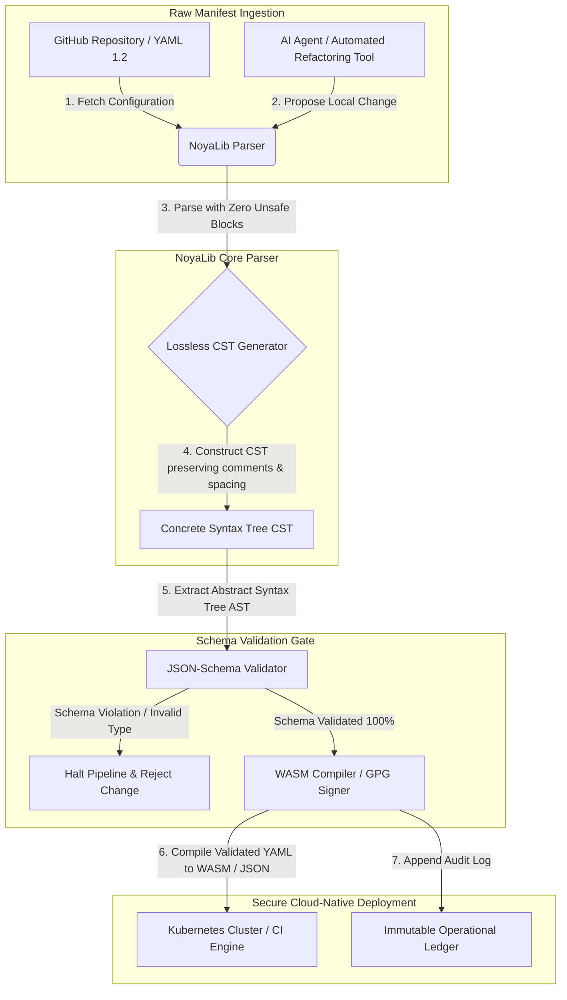

## AI, MCP आणि वित्तीय पायाभूत सुविधांसाठी 2026 मध्ये YAML ला अधिक सुरक्षित Rust स्टॅकची गरज का आहे

अधिक सुरक्षित Rust YAML स्टॅक महत्त्वाचा आहे कारण YAML आता CI/CD पाइपलाइन, Kubernetes मॅनिफेस्ट, [Open Policy Agent](https://www.openpolicyagent.org/) नियम आणि Model Context Protocol (MCP) टूल रजिस्ट्री वाहून नेतो — आणि एकच संदिग्ध पार्स एखादी क्लिअरिंग प्रणाली मोडू शकतो, एखादा सिक्युरिटी ग्रुप चुकीचा कॉन्फिगर करू शकतो किंवा स्थानिक AI एजंटला चुकीच्या परवानग्या देऊ शकतो. [NoyaLib](https://github.com/sebastienrousseau/noyalib) ही एक शुद्ध-Rust, झिरो-अनसेफ [YAML 1.2](https://yaml.org/spec/1.2.2/) पार्सिंग आणि पडताळणी परिसंस्था आहे, जी ती पायाभूत सुविधा डीफॉल्टनुसार सुरक्षित बनवण्यासाठी अभियांत्रिकीने तयार केली आहे.

## झटपट उत्तर

**एका वाक्यात NoyaLib म्हणजे काय?** NoyaLib हा एक ओपन-सोर्स, शुद्ध-Rust YAML 1.2 पार्सर आणि पडताळणी परिसंस्था आहे, ज्यामध्ये झिरो `unsafe` कोड, अधिकृत 406-चाचणी YAML सुइटमध्ये 100 % स्पेसिफिकेशन अनुपालन, एक लॉसलेस Concrete Syntax Tree आणि रिअल-टाइम [JSON Schema](https://json-schema.org/) पडताळणी आहे — जो AI-एजंट, MCP, Kubernetes आणि वित्तीय-पायाभूत सुविधा कॉन्फिगरेशन डीफॉल्टनुसार सुरक्षित बनवण्यासाठी अभियांत्रिकीने तयार केला आहे.

## कार्यकारी सारांश

एखादे संदिग्ध पार्स किंवा स्कीमा उल्लंघन अब्जावधी डॉलरची उत्पादन क्लिअरिंग प्रणाली मोडेपर्यंत YAML साधे वाटते. 2026 मध्ये, YAML हे [CI/CD](https://docs.github.com/en/actions/learn-github-actions/workflow-syntax-for-github-actions) पाइपलाइन, [Kubernetes](https://kubernetes.io/docs/concepts/configuration/overview/) मॅनिफेस्ट, [Open Policy Agent](https://www.openpolicyagent.org/) नियम आणि Model Context Protocol (MCP) टूल रजिस्ट्रीसाठी वास्तविक मानक आहे. मेमरी असुरक्षितता आणि विध्वंसक पार्सिंग असलेले अपारदर्शक जुने पार्सर एक अस्वीकार्य सुरक्षा जोखीम आहेत. NoyaLib ही एक शुद्ध-Rust, झिरो-अनसेफ YAML 1.2 परिसंस्था आहे: सर्व 406 अधिकृत सुइट चाचण्यांमध्ये 100 % स्पेसिफिकेशन अनुपालन, टिप्पण्या आणि रिकाम्या जागा जपणारे एक लॉसलेस Concrete Syntax Tree (CST) आणि अंगभूत JSON-Schema पडताळणी. याचा परिणाम म्हणजे YAML ला ऑडिट करण्यायोग्य, सुरक्षित आणि एजंट-प्रवेशयोग्य कॉन्फिगरेशन नियंत्रण स्तर म्हणून पुनर्रचित करणे.

## महत्त्वाचे मुद्दे

- **कॉन्फिगरेशन हा उत्पादन कोड आहे.** एकच सदोष YAML फाइल क्लाउड-नेटिव्ह सिक्युरिटी ग्रुप किंवा AI-एजंट परवानग्या चुकीच्या कॉन्फिगर करू शकते. NoyaLib YAML ला महत्त्वाची पायाभूत सुविधा म्हणून वागवते.
- **झिरो-अनसेफ रचना.** झिरो `unsafe` ब्लॉकसह पूर्णपणे सुरक्षित Rust मध्ये तयार केलेली NoyaLib कोर पार्सिंग स्तरांमधील मेमरी-सुरक्षा असुरक्षितता — बफर ओव्हरफ्लो, रिमोट कोड एक्झिक्युशन — नाहीशी करते.
- **संपूर्ण 406/406 स्पेसिफिकेशन अनुपालन.** कॉन्फिगरेशन संरचनांची गणितीयदृष्ट्या पडताळणी करते, स्टेजिंग आणि उत्पादन वातावरणांमधील पार्सिंग विसंगती आणि संरचनात्मक विचलन नाहीसे करते.
- **लॉसलेस Concrete Syntax Tree.** टिप्पण्या आणि स्वरूपण टाकून देणाऱ्या जुन्या पार्सरांच्या विपरीत, NoyaLib रिकाम्या जागा आणि टिपणी जपते, ज्यामुळे AI एजंटांद्वारे सुरक्षित, राउंड-ट्रिप स्वयंचलित रिफॅक्टरिंग शक्य होते.
- **मंडळ-स्तरीय विश्वस्त मूल्य.** कॉन्फिगरेशन अखंडता [DORA अनुच्छेद 5](https://eur-lex.europa.eu/legal-content/EN/TXT/?uri=CELEX%3A32022R2554) आणि [Basel III](https://www.bis.org/bcbs/publ/d424.htm) परिचालनात्मक-जोखीम भांडवली मेट्रिक्सशी जोडते, ज्यामुळे वरिष्ठ व्यवस्थापनाला वैयक्तिक दायित्वापासून थेट संरक्षण मिळते.

**संबंधित वाचन:** [KyberLib आणि 2026 मधील पोस्ट-क्वांटम बँकिंग स्थलांतर: मानकांपासून कोडपर्यंत](https://sebastienrousseau.com/2026-06-12-kyberlib-post-quantum-banking-migration-standards-code-2026/), [2026 मधील क्लाउड नेटिव्ह बँकिंग निर्देशांक: DORA, प्लॅटफॉर्म अभियांत्रिकी, सार्वभौम क्लाउड आणि परिचालनात्मक लवचिकता](https://sebastienrousseau.com/2026-06-05-cloud-native-banking-index-dora-resilience-platform-engineering-2026/), [2026 मधील AI-जागरूक डॉटफाइल्स: MCP, SLSA आणि मल्टी-शेल समानतेसाठी एक सुरक्षित, पुनरुत्पादनीय डेव्हलपर वर्कस्टेशन तयार करणे](https://sebastienrousseau.com/2026-06-16-ai-aware-dotfiles-secure-reproducible-workstation-2026/).

## 01. 2026 मध्ये अधिक सुरक्षित Rust YAML स्टॅक का महत्त्वाचा आहे

जून 2026 मध्ये, एंटरप्राइझ IT पायाभूत सुविधा अत्यंत वितरित आणि वाढत्या प्रमाणात स्वयंचलित आहेत.

YAML शांतपणे संपूर्ण सॉफ्टवेअर-अभियांत्रिकी स्टॅकसाठी भार पेलणारी कॉन्फिगरेशन भाषा बनली आहे. ते उत्पादन आर्टिफॅक्ट कंपाइल करणारे सतत-एकत्रीकरण (CI) वर्कफ्लो, जागतिक क्लाउड-नेटिव्ह क्लस्टरचे ऑर्केस्ट्रेशन करणारे [Kubernetes](https://kubernetes.io/docs/concepts/overview/) मॅनिफेस्ट आणि स्थानिक AI एजंटांना स्थानिक कार्ये अंमलात आणण्याची परवानगी देणारे [Model Context Protocol](https://modelcontextprotocol.io/) (MCP) सर्व्हर स्कीमा वाहून नेते.

जुने YAML पार्सर — [PyYAML](https://pyyaml.org/), [yaml-cpp](https://github.com/jbeder/yaml-cpp), [libyaml](https://github.com/yaml/libyaml) — दोन संरचनात्मक जोखीम बाळगतात:

1. **टाइप-कोअर्शन असुरक्षितता ("नॉर्वे समस्या").** जुने पार्सर वारंवार अवतरणचिन्हविरहित स्ट्रिंग्जना बळजबरीने रूपांतरित करतात (देश कोड `NO` ला बूलियन `false` मध्ये, तसेच `yes`/`no` मध्ये) — पहा [YAML 1.1 विरुद्ध 1.2 बूलियन टॅग](https://yaml.org/type/bool.html) — ज्यामुळे गंभीर प्रणाली अपयश किंवा नि:शब्द सुरक्षा चुकीचे कॉन्फिगरेशन घडते.
2. **मेमरी-सुरक्षा शोषण.** C/C++ मध्ये लिहिलेले अपारदर्शक पार्सर मेमरी-लीक आणि बफर-ओव्हरफ्लो शोषणांनी ग्रस्त असतात, जे कोर बिल्ड सर्व्हरवर रिमोट कोड एक्झिक्युशन (RCE) कडे नेऊ शकतात.

[NoyaLib](https://github.com/sebastienrousseau/noyalib) ही आव्हाने सोडवते. ती एक शुद्ध-Rust, झिरो-अनसेफ YAML 1.2 पार्सिंग आणि पडताळणी परिसंस्था आहे. संपूर्ण 406/406 स्पेसिफिकेशन अनुपालन साध्य करून आणि पार्स दरम्यान थेट कठोर JSON-Schema पडताळणी लागू करून, NoyaLib उच्च **Return on Resilience (RoR)** — लवचिकतेवरील परतावा — प्रदान करते, ज्यामुळे कॉन्फिगरेशन-प्रेरित डाउनटाइम रोखला जातो आणि वित्तीय-दर्जाच्या सॉफ्टवेअर पुरवठा साखळ्या सुरक्षित होतात.

## 02. NoyaLib 2026 स्थापत्य दृष्टिकोन

NoyaLib परिसंस्था एक सुरक्षित, लॉसलेस कॉन्फिगरेशन पार्सर म्हणून कार्य करते. प्रत्येक स्थानिक आणि क्लाउड मॅनिफेस्ट सर्वात खालच्या अंमलबजावणी स्तरावर संरचनात्मकदृष्ट्या पडताळला आणि संरक्षित केला जातो.

### तक्ता 1: NoyaLib स्थापत्य स्तर आणि जोखीम शमन

| स्तर | रचना निर्णय | तो का महत्त्वाचा आहे | चुकीचे हाताळल्यास जोखीम |
| ---- | ---- | ---- | ---- |
| **पार्सर स्तर** | झिरो `unsafe` ब्लॉकसह YAML 1.2 अनुपालित, शुद्ध-Rust पार्सर | सर्वात खालच्या अंमलबजावणी स्तरावर मेमरी-सुरक्षा असुरक्षितता आणि बफर ओव्हरफ्लो नाहीसे करतो. | कोर बिल्ड सर्व्हरवर रिमोट कोड एक्झिक्युशन (RCE). |
| **अनुरूपता स्तर** | 406/406 अधिकृत YAML 1.2 सुइट चाचण्यांमध्ये 100 % अनुपालन | स्टेजिंग आणि उत्पादनादरम्यान पार्सिंग विसंगती आणि टाइप-कोअर्शन विचलन नाहीसे करतो. | सिक्युरिटी ग्रुप निष्क्रिय करणाऱ्या "नॉर्वे समस्या" टाइप-कोअर्शन त्रुटी. |
| **सिंटॅक्स-ट्री स्तर** | लॉसलेस Concrete Syntax Tree (CST) | राउंड-ट्रिप पार्सिंग आणि प्रोग्रामेटिक रिफॅक्टरिंग दरम्यान टिप्पण्या, रिकाम्या जागा आणि क्रम जपतो. | स्वयंचलित AI रिफॅक्टरिंग डेव्हलपर टिपणी नष्ट करते. |
| **पडताळणी स्तर** | पार्सिंग दरम्यान [JSON Schema (Draft 2020-12)](https://json-schema.org/draft/2020-12/release-notes) पडताळणी | कॉन्फिगरेशन फाइल्स उत्पादन क्लस्टरपर्यंत पोहोचण्यापूर्वी त्यांवर कठोर डेटा मॉडेल लागू करतो. | सदोष कॉन्फिगरेशन फाइल्स क्लाउड-नेटिव्ह क्लस्टर क्रॅश घडवतात. |
| **इंटरफेस स्तर** | WebAssembly (WASM) आणि MCP बाइंडिंग | कॉन्फिगरेशन पडताळणी थेट ब्राउझर, एज नोड आणि स्थानिक एजंट टूलकिटमध्ये चालण्यास अनुमती देतो. | टूलिंग सायलो जिथे एज उपकरणांवर पडताळणी अंमलात आणता येत नाही. |

## 03. मुख्य वर्कस्टेशन आणि कॉन्फिगरेशन सुरक्षा संकेत

विकास आणि परिचालन इस्टेटमध्ये संपूर्ण सुरक्षा राखण्यासाठी, मुख्य माहिती सुरक्षा अधिकारी (CISOs) यांनी विशिष्ट, मोजता येण्याजोगे मेट्रिक्स निरीक्षण केले पाहिजेत.

### तक्ता 2: वर्कस्टेशन आणि कॉन्फिगरेशन सुरक्षा संकेत

| संकेत | मेट्रिक / परिचालनात्मक बेंचमार्क | NIST CSF / DORA संदर्भ | तांत्रिक प्लॅटफॉर्म अंमलबजावणी |
| ---- | ---- | ---- | ---- |
| **पार्सर अनुरूपता** | अधिकृत YAML 1.2 चाचणी सुइटमध्ये 100 % उत्तीर्ण दर (406/406 चाचण्या). | [DORA अनुच्छेद 6](https://eur-lex.europa.eu/legal-content/EN/TXT/?uri=CELEX%3A32022R2554) (ICT सुरक्षा) | CI अंमलबजावणीपूर्वी सर्व मॅनिफेस्ट पडताळणारा NoyaLib पार्सर कोर. |
| **मेमरी सुरक्षा प्रोफाइल** | पार्सर आणि सिरियलायझर अवलंबित्वांमध्ये झिरो `unsafe` Rust ब्लॉक. | DORA अनुच्छेद 30 (पुरवठा साखळी) | cargo बिल्डमध्ये स्वयंचलित कंपायलर तपासण्या ([`forbid(unsafe_code)`](https://doc.rust-lang.org/reference/attributes/diagnostics.html#the-forbid-attribute)). |
| **स्कीमा पडताळणी** | वैध [JSON Schema](https://json-schema.org/) मॉडेलच्या तुलनेत 100 % पार्स केलेल्या कॉन्फिगरेशन फाइल्स सत्यापित. | [NIST CSF 2.0](https://www.nist.gov/cyberframework) (PR.DS-01) | स्कीमा उल्लंघनांवर बिल्ड पाइपलाइन थांबवणारा रिअल-टाइम पडताळणी गेट. |
| **कॉन्फिगरेशन विचलन** | स्थानिक कॉन्फिगरेशन फाइल्सचे git-आवृत्तीकृत स्थितीत रिअल-टाइम शोध आणि पुनर्प्राप्ती. | Return on Resilience (RoR) | सर्व स्थानिक फाइल बदलांची नोंद करणारी सतत टेलिमेट्री. |
| **एजंट प्रवेश नियंत्रण** | MCP कॉन्फिगरेशनद्वारे कार्यरत स्थानिक AI टूलसाठी मर्यादित, केवळ-वाचनीय परवानग्या. | मॉडेल जोखीम व्यवस्थापन ([SR 11-7](https://web.archive.org/web/20260414150921/https://www.federalreserve.gov/supervisionreg/srletters/sr1107.htm)) | एजंट कार्ये मंजूर निर्देशिकांपुरती मर्यादित करणाऱ्या MCP सर्व्हर सीमा. |

## 04. अपारदर्शक कॉन्फिगरेशन पार्सिंगचा भ्रम

क्लाउड-नेटिव्ह परिचालनांमधील एक मोठी असुरक्षितता म्हणजे *अपारदर्शक पार्सिंग* — असे पार्सर वापरणे जे संरचनात्मक मेटाडेटा (टिप्पण्या, रिकाम्या जागा, दस्तऐवज क्रम) टाकून देतात किंवा कंपायलेशन दरम्यान नि:शब्दपणे टाइप बळजबरीने रूपांतरित करतात. या वर्तनामुळे दोन गंभीर सुरक्षा जोखीम निर्माण होतात:

1. **विध्वंसक रिफॅक्टरिंग.** जेव्हा एखादा AI कोडिंग सहाय्यक किंवा स्वयंचलित रिफॅक्टरिंग टूल तैनाती मॅनिफेस्ट अद्यतनित करते, तेव्हा पारंपरिक पार्सर डेव्हलपर टिप्पण्या आणि स्वरूपण टाकून देतात, ज्यामुळे मानवी पुनरावलोकने आणि घटनोत्तर फॉरेन्सिकसाठी आवश्यक संदर्भ नष्ट होतो.
2. **पार्सिंग विसंगती.** जर स्टेजिंग वातावरण Python-आधारित पार्सर वापरत असेल आणि उत्पादन C-आधारित पार्सर चालवत असेल, तर YAML 1.2 स्पेसिफिकेशन अनुपालनातील किरकोळ फरक एका वैध स्टेजिंग मॅनिफेस्टला उत्पादनात अपयशी किंवा वेगळ्या पद्धतीने वागण्यास कारणीभूत ठरू शकतात, ज्यामुळे लपलेल्या सुरक्षा असुरक्षितता निर्माण होतात.

NoyaLib चे **लॉसलेस Concrete Syntax Tree (CST)** हे सोडवते. ते पार्स-आणि-सिरियलाइज लूप दरम्यान प्रत्येक जागा, टिप्पणी आणि दस्तऐवज ओळ जपते. स्वयंचलित AI सहाय्यक 100 % मानव-लिखित टिपणी जपत कॉन्फिगरेशन फाइल्स संपादित, रिफॅक्टर आणि कमिट करू शकतात — एक संपूर्ण ऑडिट ट्रेल.

## 05. मर्यादित AI कॉन्फिगरेशन पाइपलाइनची रचना

दुर्भावनापूर्ण कॉन्फिगरेशन बदल उत्पादन वातावरणांपर्यंत पोहोचण्यापासून रोखण्यासाठी, संस्थेने काटेकोरपणे मर्यादित, स्कीमा-पडताळलेली कॉन्फिगरेशन पाइपलाइन अंमलात आणली पाहिजे.

खालील परिचालनात्मक प्रवाह दाखवतो की NoyaLib कच्चा YAML कसा पार्स करते, लॉसलेस CST कशी तयार करते, JSON-Schema मॉडेलच्या तुलनेत AST कसा पडताळते आणि ब्राउझर किंवा एज वातावरणांसाठी WebAssembly बाइंडिंग कसे कंपाइल करते.

## 06. संचालक मंडळाची कार्यनीती आणि विश्वस्त दायित्व

कॉन्फिगरेशन सुरक्षा आणि सॉफ्टवेअर-पुरवठा-साखळी अखंडता या महत्त्वाच्या संचालक मंडळ प्राधान्यक्रमांच्या बाबी आहेत. वरिष्ठ व्यवस्थापकांनी कॉन्फिगरेशन व्यवस्थापनाकडे विश्वस्त कर्तव्य आणि परिचालनात्मक लवचिकतेच्या दृष्टिकोनातून पाहिले पाहिजे.

- **DORA अनुच्छेद 5 (मंडळ उत्तरदायित्व).** असे ठरवतो की संस्थेच्या ICT जोखीम व्यवस्थापनासाठी संचालक मंडळाकडे अंतिम, अ-सोपवण्यायोग्य जबाबदारी असते. कॉन्फिगरेशन फाइल्स महत्त्वाच्या क्लाउड-नेटिव्ह सिक्युरिटी ग्रुप आणि पेमेंट-राउटिंग मार्ग नियंत्रित करत असल्याने, नियामक ऑडिट पूर्ण करण्यासाठी मंडळांनी हे सत्यापित केले पाहिजे की हे मॅनिफेस्ट पार्स करणाऱ्या प्रणाली मेमरी-सुरक्षित आणि पूर्णपणे स्पेसिफिकेशन-अनुपालित आहेत. ([Regulation (EU) 2022/2554](https://eur-lex.europa.eu/legal-content/EN/TXT/?uri=CELEX%3A32022R2554))
- **BCBS 239 (जोखीम डेटा एकत्रीकरण आणि अहवाल).** यासाठी आवश्यक आहे की जोखीम अहवाल आणि पायाभूत सुविधा मेट्रिक्स अचूक, संपूर्ण आणि कठोर डेटा-गुणवत्ता नियंत्रणांखाली तयार केले जावेत. NoyaLib स्रोतावरच कठोर स्कीमांच्या तुलनेत कॉन्फिगरेशन फाइल्स पार्स आणि पडताळून BCBS 239 ला समर्थन देते, ज्यामुळे नि:शब्द डेटा गळती किंवा चुकीच्या-कॉन्फिगरेशन-प्रेरित खंडित सेवा रोखल्या जातात. ([BCBS 239 मानक](https://www.bis.org/publ/bcbs239.htm))
- **परिचालनात्मक-जोखीम भांडवली शुल्क कमी करणे (Basel III).** कॉन्फिगरेशन-प्रेरित खंडित सेवा Basel III अंतर्गत परिचालनात्मक-जोखीम भांडवली शुल्क थेट वाढवतात, ज्यामुळे ताळेबंद भांडवल अडकते. NoyaLib सारख्या सुरक्षित, शुद्ध-Rust पार्सरवर एंटरप्राइझ कॉन्फिगरेशन स्टॅक प्रमाणित केल्याने ही जोखीम कमी होते, भांडवल जपले जाते आणि ग्राहक विश्वास संरक्षित होतो. ([Basel III मानके](https://www.bis.org/bcbs/publ/d424.htm))

## 07. बँकेच्या प्रकारानुसार याचा अर्थ काय

### जागतिक प्रणालीगत महत्त्वाच्या बँका (G-SIBs)

G-SIBs अनेक अधिकारक्षेत्रांमध्ये हजारो मायक्रोसर्व्हिस आणि तैनाती पाइपलाइन व्यवस्थापित करतात. त्यांचे प्राथमिक आव्हान म्हणजे प्रचंड क्लाउड-नेटिव्ह इस्टेटमध्ये कॉन्फिगरेशन सुसंगतता राखणे आणि सुरक्षा विचलन रोखणे. NoyaLib सारख्या अधिक सुरक्षित Rust YAML स्टॅकवर प्रमाणीकरण केल्याने हमी मिळते की सर्व Kubernetes मॅनिफेस्ट, CI/CD पाइपलाइन आणि सुरक्षा धोरणे एका एकसमान, मेमरी-सुरक्षित चौकटीखाली पार्स आणि पडताळली जातात — ज्यामुळे अ-ऑडिट "स्नोफ्लेक" कॉन्फिगरेशनची जोखीम नाहीशी होते.

### व्यवहार आणि कॉर्पोरेट बँका

व्यवहार बँका संवेदनशील पेमेंट गेटवे आणि घाऊक क्लिअरिंग पायाभूत सुविधा चालवतात. या उत्पादन वातावरणांमध्ये तैनात केलेल्या कोड आणि कॉन्फिगरेशनची संपूर्ण सुरक्षा सिद्ध करणे ही एक अ-वाटाघाटीयोग्य नियामक मागणी आहे. NoyaLib समाकलित केल्याने हमी मिळते की सॉफ्टवेअर पुरवठा साखळी पूर्णपणे ऑडिट केलेली, लॉसलेस आणि पार्सिंग असुरक्षिततांपासून संरक्षित आहे — एक नियंत्रण जे DORA अनुच्छेद 6 आणि [PCI DSS v4.0](https://www.pcisecuritystandards.org/document_library/) कलम 6 शी स्वच्छपणे जुळते.

### प्रादेशिक आणि लहान बँका

प्रादेशिक बँकांनी G-SIB-स्केल तंत्रज्ञान अंदाजपत्रकांशिवाय उच्च सायबरसुरक्षा मानके राखली पाहिजेत. ओपन-सोर्स NoyaLib चौकट एक हलके, किफायतशीर आणि अत्यंत सुरक्षित Rust-अनुकूल समाधान प्रदान करते, ज्यामुळे लहान संस्था मालकीहक्क परवाना शुल्काशिवाय एंटरप्राइझ-दर्जाची कॉन्फिगरेशन सुरक्षा आणि पुरवठा-साखळी संरक्षण अंमलात आणू शकतात.

## 08. निष्कर्ष: कॉन्फिगरेशन सुरक्षा रोडमॅप

डेव्हलपर वर्कस्टेशन आणि क्लाउड-नेटिव्ह पायाभूत सुविधा कॉन्फिगरेशन ही सॉफ्टवेअर पुरवठा साखळीतील महत्त्वाची नियंत्रण स्तरे आहेत. अ-ऑडिट, संदिग्ध किंवा असुरक्षित कॉन्फिगरेशन फाइल्सना कॉर्पोरेट मालमत्तेपर्यंत पोहोचू देणे ही एक अस्वीकार्य परिचालनात्मक आणि नियामक जोखीम आहे.

सॉफ्टवेअर पुरवठा साखळी सुरक्षित करण्यासाठी आणि एंडपॉइंटना कॉन्फिगरेशन असुरक्षिततांपासून संरक्षित करण्यासाठी, वरिष्ठ तंत्रज्ञान आणि सुरक्षा व्यवस्थापकांनी आजच एक स्पष्ट विकास रोडमॅप अंमलात आणला पाहिजे:

1. **घोषणात्मक कॉन्फिगरेशन अनिवार्य करा.** हस्तचलित, अ-ऑडिट कॉन्फिगरेशन समायोजने टप्प्याटप्प्याने बंद करा आणि सर्व मॅनिफेस्ट आवृत्ती-नियंत्रित, घोषणात्मक रेकॉर्ड प्रणाली म्हणून व्यवस्थापित करणे अनिवार्य करा.
2. **स्कीमा पडताळणी लागू करा.** तैनातीपूर्वी सर्व कॉन्फिगरेशन फाइल्स वैध JSON-Schema मॉडेलच्या तुलनेत पडताळल्या जातील याची खात्री करण्यासाठी कठोर प्री-कमिट हुक आणि स्कॅनिंग युटिलिटी लागू करा.
3. **लॉसलेस राउंड-ट्रिपिंग अंमलात आणा.** सर्व स्वयंचलित AI कोडिंग सहाय्यक आणि रिफॅक्टरिंग टूल टिप्पण्या, रिकाम्या जागा आणि डेव्हलपर संदर्भ जपण्यासाठी लॉसलेस पार्सिंग वापरतील याची खात्री करा.
4. **पुरवठा साखळी सुरक्षित करा.** अंमलबजावणीपूर्वी सर्व कॉन्फिगरेशन सेटअप आणि पार्सिंग युटिलिटी NoyaLib सारख्या शुद्ध-Rust, झिरो-अनसेफ लायब्ररी वापरून क्रिप्टोग्राफिकदृष्ट्या सत्यापित केल्या जातील याची खात्री करा. ([SLSA चौकट](https://slsa.dev/))

## 09. वारंवार विचारले जाणारे प्रश्न

**NoyaLib म्हणजे काय आणि ते YAML पार्सिंगसाठी का वापरले जाते?**
NoyaLib हा एक ओपन-सोर्स, शुद्ध-Rust, झिरो-अनसेफ YAML 1.2 पार्सर आहे. तो अधिकृत 406-चाचणी सुइटमध्ये 100 % स्पेसिफिकेशन अनुपालन साध्य करतो, पार्सिंग दरम्यान कठोर [JSON Schema](https://json-schema.org/) पडताळणी लागू करतो आणि WASM व [MCP](https://modelcontextprotocol.io/) बाइंडिंग उघड करतो — ज्यामुळे तो AI एजंट, Kubernetes आणि वित्तीय पायाभूत सुविधांसाठी एक अधिक सुरक्षित Rust YAML स्टॅक बनतो.

**कॉन्फिगरेशन पार्सिंगसाठी झिरो-अनसेफ रचना का महत्त्वाची आहे?**
C/C++ मध्ये लिहिलेल्या जुन्या पार्सरांमधील मेमरी-सुरक्षा असुरक्षितता — बफर ओव्हरफ्लो, यूझ-आफ्टर-फ्री — कोर बिल्ड सर्व्हरवर रिमोट कोड एक्झिक्युशनकडे नेऊ शकतात. NoyaLib ची [`#![forbid(unsafe_code)]`](https://doc.rust-lang.org/reference/attributes/diagnostics.html#the-forbid-attribute) सह शुद्ध-Rust रचना कंपाइल टप्प्यावर या असुरक्षितता गणितीयदृष्ट्या नाहीशा करते.

**लॉसलेस Concrete Syntax Tree (CST) म्हणजे काय आणि तो का महत्त्वाचा आहे?**
पारंपरिक पार्सर टिप्पण्या आणि स्वरूपण टाकून देतात, ज्यामुळे AI एजंटांद्वारे केलेले स्वयंचलित संपादन विध्वंसक ठरते. NoyaLib चा लॉसलेस Concrete Syntax Tree प्रत्येक टिप्पणी, जागा आणि दस्तऐवज ओळ जपतो — त्यामुळे AI सहाय्यक डेव्हलपर संदर्भ, घटनोत्तर फॉरेन्सिक आणि ऑडिट ट्रेल अबाधित ठेवत कॉन्फिगरेशन फाइल्स सुरक्षितपणे संपादित आणि रिफॅक्टर करू शकतात.

**NoyaLib हे DORA, BCBS 239 आणि Basel III शी कसे जुळते?**
DORA अनुच्छेद 5 ICT-जोखीम उत्तरदायित्व संचालक मंडळावर ठेवतो; BCBS 239 जोखीम अहवालावर डेटा-गुणवत्ता नियंत्रणांची मागणी करतो; Basel III परिचालनात्मक-जोखीम भांडवलावर कर लावतो. NoyaLib कोड-म्हणून-कॉन्फिगरेशनसाठी ती नियमने आवश्यक असलेला स्कीमा-पडताळलेला, मेमरी-सुरक्षित पार्स स्तर पुरवते — ज्यामुळे नियामक जुळणी सरळ होते आणि परिचालनात्मक-जोखीम भांडवली शुल्क कमी होते.

## 10. संदर्भ

- **YAML, (2026).** *YAML 1.2 specification*. येथे उपलब्ध: [YAML 1.2 spec](https://yaml.org/spec/1.2.2/).
- **JSON Schema, (2026).** *JSON Schema Draft 2020-12 release notes*. येथे उपलब्ध: [JSON Schema Draft 2020-12](https://json-schema.org/draft/2020-12/release-notes).
- **European Parliament and Council of the European Union, (2022).** *Regulation (EU) 2022/2554 on digital operational resilience for the financial sector (DORA)*. Brussels: Official Journal of the European Union. येथे उपलब्ध: [DORA regulation](https://eur-lex.europa.eu/legal-content/EN/TXT/?uri=CELEX%3A32022R2554).
- **Basel Committee on Banking Supervision, (2013).** *Principles for effective risk data aggregation and risk reporting (BCBS 239)*. Basel: Bank for International Settlements. येथे उपलब्ध: [BCBS 239 standard](https://www.bis.org/publ/bcbs239.htm).
- **Basel Committee on Banking Supervision, (2017).** *Basel III: finalising post-crisis reforms*. Basel: Bank for International Settlements. येथे उपलब्ध: [Basel III standards](https://www.bis.org/bcbs/publ/d424.htm).
- **Anthropic, (2025).** *Model Context Protocol (MCP) specification*. येथे उपलब्ध: [Model Context Protocol](https://modelcontextprotocol.io/).
- **GitHub, (2026).** *noyalib open-source repository*. येथे उपलब्ध: [NoyaLib repository](https://github.com/sebastienrousseau/noyalib).
