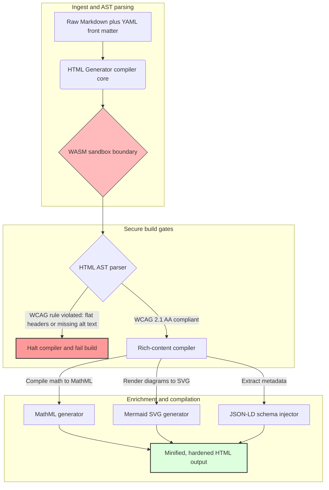

## 2026 मध्ये Rust सह Markdown चे प्रवेशयोग्य, SEO-सज्ज, संरचित HTML मध्ये रूपांतर

2026 मध्ये, वेब मजकूर मानवी वाचकांइतकाच AI सर्च crawlers, LLM-आधारित सर्च इंजिने आणि Retrieval-Augmented Generation (RAG) pipelines यांच्याकडूनही वापरला जातो. सपाट किंवा दोषपूर्ण HTML यंत्र-शोधक्षमतेशी तडजोड करते, तर [European Accessibility Act (EAA)](https://www.accessibility-act.eu/) आणि [US ADA Title III](https://www.ada.gov/topics/title-iii/) यांसारख्या कठोर जागतिक नियमांचे पालन न करणे आता स्पष्ट नागरी दायित्व ठरते. [HTML Generator](https://github.com/sebastienrousseau/html-generator) हे उच्च-कार्यक्षमतेचे Rust लायब्ररी आहे जे या त्रुटी बंद करण्यासाठी तयार केलेले आहे — deployment नंतरच्या patches मध्ये नव्हे, तर compiler मध्येच.

## झटपट उत्तर

**एका वाक्यात HTML Generator म्हणजे काय?** HTML Generator हे एक open-source, शुद्ध-Rust Markdown-ते-HTML compiler आहे जे build वेळी [WCAG 2.1 AA](https://www.w3.org/TR/WCAG21/) लागू करते, semantic landmarks आणि ARIA गुणधर्म आपोआप तयार करते, YAML front matter मधून schema-अनुरूप [JSON-LD](https://json-ld.org/) metadata इंजेक्ट करते, Mermaid आकृत्या आणि गणित प्रवेशयोग्य SVG व MathML मध्ये रेंडर करते, आणि [WebAssembly](https://webassembly.org/) sandbox च्या आत चालते — कॉर्पोरेट प्रकाशनाला compile-gated, fiduciary-दर्जाच्या नियंत्रण स्तरात रूपांतरित करते.

## कार्यकारी सारांश

Markdown रेंडरिंग साधे वाटते. प्रकाशन-दर्जाचे HTML ही एक अनुपालन समस्या आहे. जून 2026 मध्ये, प्रत्येक कॉर्पोरेट संपर्कबिंदू — investor relations पोर्टल्स, नियामक filings, ग्राहक दस्तऐवज, API संदर्भ, marketing मालमत्ता — मानव आणि यंत्रे दोन्हींकडून पार्स केला जातो. प्रत्येक पानावर दोन दबाव एकत्र येतात: [EAA](https://www.accessibility-act.eu/) आणि [ADA Title III](https://www.ada.gov/topics/title-iii/) accessibility ला मंडळ-स्तरीय कायदेशीर जोखीम बनवतात, तर AI ingestion आणि RAG pipelines संरचित, यंत्र-वाचनीय आउटपुटला बक्षीस देतात. मानक Markdown लायब्ररी सपाट HTML तयार करतात जे दोन्ही गेट्समध्ये अपयशी ठरते. HTML Generator दस्तऐवज निर्मितीला compile-gated pipeline म्हणून हाताळते: WCAG पडताळणी ही build त्रुटी असते, JSON-LD YAML front matter मधून मॅन्युअल stamping शिवाय येते, MathML आणि Mermaid प्रवेशयोग्यपणे रेंडर होतात, आणि संपूर्ण engine WebAssembly target म्हणून पाठवले जाते ज्यामुळे अविश्वासार्ह दस्तऐवजांचे पार्सिंग host पासून sandboxed राहते.

## मुख्य मुद्दे

- **Accessibility-as-code हा नवा आधार आहे.** EAA ग्राहक डिजिटल सेवांसाठी accessibility अनिवार्य करते. HTML Generator compile वेळी document tree चे मूल्यांकन करते, semantic landmarks आणि ARIA गुणधर्म आपोआप तयार करते — deployment नंतर कमी दुरुस्त्या, कमी remediation बजेट, आणि production मध्ये कोणतेही गहाळ alt-text जात नाही.
- **AI शोधासाठी संरचित डेटा.** आधुनिक सर्च आणि RAG यंत्र-वाचनीय metadata वर अवलंबून असतात. Compiler YAML front matter पार्स करते आणि [Schema.org-अनुरूप JSON-LD](https://schema.org/) थेट document head मध्ये इंजेक्ट करते, ज्यामुळे मजकूर [Google Rich Results](https://developers.google.com/search/docs/appearance/structured-data/intro-structured-data), [Bing Webmaster](https://www.bing.com/webmasters) आणि LLM-आधारित crawlers यांच्यासाठी पूर्णपणे व्याख्यायोग्य होतो.
- **तांत्रिक मजकूर उत्कृष्टता.** तांत्रिक प्रकाशन हे सपाट मजकूर नाही. HTML Generator कच्च्या Markdown गणित विस्तारांना प्रवेशयोग्य [MathML](https://www.w3.org/Math/) मध्ये compile करते, आणि [Mermaid.js](https://mermaid.js.org/) आकृत्या प्रतिसादात्मक SVG मध्ये रेंडर करते — दोन्ही अपारदर्शक प्रतिमांवर न घसरता WCAG-अनुरूप रचना जपतात.
- **WebAssembly sandboxing.** अविश्वासार्ह Markdown पार्स करणे ही सुरक्षा जोखीम आहे. [WASM](https://webassembly.org/) ला target करून, HTML Generator एका विलगित sandbox च्या आत चालते जे अनियंत्रित कोड अंमलबजावणी रोखते आणि host प्रणालीचे संरक्षण करते — थेट [DORA Article 6](https://eur-lex.europa.eu/legal-content/EN/TXT/?uri=CELEX%3A32022R2554) ICT-सुरक्षा बंधने पूर्ण करते.
- **मंडळांसाठी fiduciary संरक्षण.** तांत्रिक अनुपालन-अभाव आता boardroom मध्ये पोहोचला आहे. Compiler-gated HTML engine वर मानकीकरण केल्याने संचालक आणि वरिष्ठ व्यवस्थापन यांना DORA, EAA आणि ADA Title III अंतर्गत वैयक्तिक नागरी आणि नियामक जोखमीपासून संरक्षण मिळते.

**संबंधित वाचन:** [Why YAML Needs a Safer Rust Stack for AI, MCP, and Financial Infrastructure in 2026](https://sebastienrousseau.com/2026-06-18-noyalib-safe-yaml-rust-ai-mcp-financial-infrastructure-2026/), [A Secure-by-Default Static Site Generator for AI-Era Publishing in 2026](https://sebastienrousseau.com/2026-06-17-static-site-generator-secure-default-ai-era-publishing-2026/), [CloudCDN: An Open-Source Blueprint for the AI-Native Edge in 2026](https://sebastienrousseau.com/2026-06-11-cloudcdn-open-source-blueprint-ai-native-edge-2026/).

## 01. 2026 मध्ये Accessibility-First HTML Compiler का महत्त्वाचा आहे

कॉर्पोरेट वेब मालमत्ता, दस्तऐवज लायब्ररी आणि उत्पादन मदत केंद्रे ही महत्त्वाची डिजिटल संपर्कबिंदू आहेत. आता ती दोन तीव्र, परस्परछेदी दबावांच्या अधीन आहेत.

पहिला दबाव आहे **AI ingestion आणि शोधक्षमता**. मजकूर वाढत्या प्रमाणात मोठ्या भाषा मॉडेल्स आणि Retrieval-Augmented Generation pipelines द्वारे प्रक्रिया केला जातो. सपाट किंवा दोषपूर्ण HTML crawler पार्सिंगला गोंधळात टाकते, ज्यामुळे कॉर्पोरेट संशोधन आणि दस्तऐवज आधुनिक सर्च प्रतिमानांना अदृश्य राहतात — यात [Google Search Generative Experience](https://blog.google/products/search/generative-ai-search/), [ChatGPT](https://chat.openai.com/) browsing, आणि एंटरप्राइझ RAG agents यांचा समावेश आहे.

दुसरा दबाव आहे **कठोर जागतिक accessibility कायदा**. [European Accessibility Act](https://www.accessibility-act.eu/) (जून 2025 पासून पूर्णपणे लागू) आणि [US ADA Title III](https://www.ada.gov/topics/title-iii/) अंतर्गत, कॉर्पोरेट प्रकाशन प्लॅटफॉर्म्सनी संपूर्ण डिजिटल accessibility ची हमी दिली पाहिजे. [WCAG 2.1 AA](https://www.w3.org/TR/WCAG21/) पूर्ण न करणे ही आता अभियांत्रिकीतील दुर्लक्ष नाही; ते एक नागरी आणि नियामक दायित्व आहे ज्यामुळे कोट्यवधी डॉलर्सचे settlements झाले आहेत.

[HTML Generator](https://github.com/sebastienrousseau/html-generator) या दोन्ही दबावांना थेट हाताळते. हे एक thread-safe Rust लायब्ररी आहे जे Markdown चे प्रवेशयोग्य, SEO-सज्ज, संरचित HTML मध्ये रूपांतर करण्यासाठी तयार केलेले आहे. दस्तऐवज निर्मितीला compiler-gated pipeline म्हणून हाताळून, हे engine उच्च **Return on Resilience (RoR)** प्रदान करते — accessibility खटल्यांपासून balance sheets चे संरक्षण करते तर AI शोधासाठी यंत्र-वाचनीयता वाढवते.

## 02. HTML Generator 2026 आर्किटेक्चर दृष्टिकोन

हे फ्रेमवर्क एक सुरक्षित, बहु-टप्प्याचे compilation pipeline म्हणून तयार केलेले आहे जे कच्च्या Markdown मजकुराचे cryptographically पडताळणी केलेल्या, अत्यंत प्रवेशयोग्य static मालमत्तांमध्ये रूपांतर करते.

### तक्ता 1: HTML Generator आर्किटेक्चर स्तर आणि जोखीम शमन

| स्तर | रचना निर्णय | ते का महत्त्वाचे | चुकीच्या हाताळणीचा धोका |
| ---- | ---- | ---- | ---- |
| **Input स्तर** | Markdown अधिक YAML front matter parser | लेखकांना ते जिथे आहेत तिथे भेटते; रचनात्मक metadata पासून गद्य वेगळे करते. | विसंगत metadata, तुटलेले sitemaps, indexing तफावती. |
| **रचना स्तर** | ARIA tags सह स्वयंचलित Table of Contents आणि semantic landmarks | रचनेनुसार navigable, प्रवेशयोग्य document trees तयार करते. | सपाट HTML जे screen readers तोडते आणि WCAG चे उल्लंघन करते. |
| **समृद्ध-मजकूर स्तर** | नेटिव्ह MathML आणि Mermaid.js SVG रेंडरिंग | सूत्रे आणि आकृत्या प्रवेशयोग्य SVG आणि MathML मध्ये compile करते. | Client-side JS रेंडरिंग विलंब आणि तुटलेले सहाय्यक-तंत्रज्ञान आउटपुट. |
| **SEO आणि डेटा स्तर** | एकात्मिक JSON-LD आणि संरचित-metadata निर्मिती | [Schema.org](https://schema.org/) अनुरूप JSON-LD थेट head मध्ये इंजेक्ट करते. | सर्च इंजिने आणि AI crawlers लेखक, संदर्भ, licensing चुकीचे वाचतात. |
| **Runtime स्तर** | WebAssembly target सह नेटिव्ह Rust compiler | servers, edge nodes आणि browsers वर सुरक्षित, sandboxed अंमलबजावणी सक्षम करते. | अविश्वासार्ह Markdown पार्सिंग दरम्यान अनियंत्रित कोड अंमलबजावणी. |

## 03. मुख्य वेब सुरक्षा आणि accessibility संकेत

सार्वजनिक-सन्मुख प्रकाशन मालमत्ता आधुनिक नियामक आणि सुरक्षा audits पूर्ण करतात याची पडताळणी करण्यासाठी, वरिष्ठ तंत्रज्ञान अधिकाऱ्यांनी विशिष्ट, मोजता येण्याजोगे मापदंड निरीक्षण करणे आवश्यक आहे.

### तक्ता 2: वेब सुरक्षा आणि accessibility संकेत

| संकेत | मापदंड / परिचालन बेंचमार्क | EAA / DORA / W3C संदर्भ | तांत्रिक अंमलबजावणी |
| ---- | ---- | ---- | ---- |
| **Accessibility अनुरूपता** | 100 % compiled पानांची WCAG 2.1 AA नियमांविरुद्ध पडताळणी. | [EAA](https://www.accessibility-act.eu/) आणि [ADA Title III](https://www.ada.gov/topics/title-iii/) | प्रतिमा alt tags आणि semantic landmarks यांचे मूल्यांकन करणारा build-time HTML parser. |
| **WASM अंमलबजावणी sandbox** | 100 % अविश्वासार्ह Markdown inputs विलगित WebAssembly runtime मध्ये compiled. | [DORA Article 6](https://eur-lex.europa.eu/legal-content/EN/TXT/?uri=CELEX%3A32022R2554) (ICT सुरक्षा) | पार्सिंग वातावरणाचे host server पासून विलगीकरण. |
| **संरचित-metadata व्याप्ती** | 100 % प्रकाशित लेखांमध्ये वैध, schema-अनुरूप JSON-LD headers इंजेक्ट. | [Schema.org](https://schema.org/) तपशील | स्वयंचलित front-matter पार्सिंग आणि JSON-LD objects मध्ये रूपांतर. |
| **Compilation throughput** | commodity hardware वर प्रति-सेकंद 10,000 पेक्षा जास्त पानांचे लक्ष्य. | Return on Resilience (RoR) | अत्यंत समांतरित Rust AST compiler. |
| **Rich-snippet पडताळणी** | [Google Rich Results](https://search.google.com/test/rich-results) आणि [Schema validator](https://validator.schema.org/) runs वर शून्य पार्सिंग त्रुटी. | Google Search मार्गदर्शक तत्त्वे | build pipeline दरम्यान निर्मित JSON-LD चे रचनात्मक पडताळणी. |

## 04. साध्या Markdown रेंडरिंगची दंतकथा

तंत्रज्ञान व्यवस्थापकांमध्ये एक सामान्य गैरसमज असा आहे की Markdown ला HTML मध्ये रूपांतरित करणे हा एक साधा मजकूर-बदल व्यायाम आहे. अनेक मानक लायब्ररी Markdown formatting चे सपाट, असंरचित HTML मध्ये भाषांतर करतात. आउटपुट browser मध्ये दृष्टीक्षम वाचकाला रेंडर होते, परंतु ते एक अनुपालन सापळा दर्शवते.

सपाट HTML मध्ये सहसा तीन गोष्टींचा अभाव असतो.

1. **योग्य heading पदानुक्रम.** मानक Markdown heading क्रम लागू करत नाही. `<h1>` वरून `<h4>` वर उडी घेणे WCAG 2.1 AA चे उल्लंघन करते आणि screen readers साठी दस्तऐवज navigation तोडते.
2. **स्पष्ट table semantics.** मानक Markdown tables क्वचितच प्रवेशयोग्य पार्सिंगसाठी आवश्यक असलेल्या योग्य `<th>` scope आणि `<tbody>` गुणधर्मांसह रेंडर होतात.
3. **यंत्र-वाचनीय metadata.** मानक HTML मध्ये आधुनिक AI सर्च प्लॅटफॉर्म्स आणि RAG ingest प्रणालींवर अवलंबून असलेल्या JSON-LD hooks चा अभाव असतो.

HTML Generator हे Markdown ला **Abstract Syntax Tree (AST)** मध्ये पार्स करून यावर तोडगा काढते. HTML उत्सर्जित करण्यापूर्वी engine दस्तऐवज रचनेचे मूल्यांकन करते, heading nesting पडताळते, योग्य ARIA गुणधर्म इंजेक्ट करते, आणि प्रत्येक media मालमत्ता पर्यायी मजकूर बाळगते याची खात्री करते — accessibility ला मॅन्युअल audit वरून हमी दिलेल्या compile-time invariant मध्ये रूपांतरित करते.

## 05. Accessibility-as-Code Build Pipeline ची रचना

अप्रवेशयोग्य किंवा अनुक्रमित न केलेल्या मालमत्ता कधीही सार्वजनिक deployment पर्यंत पोहोचू नयेत म्हणून, accessibility हा कठोर compiler गेट असला पाहिजे. पुढील pipeline दाखवते की HTML Generator Markdown चे मूल्यांकन कसे करते, WebAssembly-विलगित पडताळणी कशी चालवते, आणि कठोर, संरचित HTML कसे उत्सर्जित करते.

## 06. Boardroom Playbook आणि Fiduciary दायित्व

आधुनिक accessibility आणि वेब-सुरक्षा अनुपालन हे अटळ boardroom मुद्दे आहेत. वरिष्ठ व्यवस्थापनाने प्रकाशन पायाभूत सुविधेकडे कायदेशीर जोखीम, आर्थिक संरक्षण आणि नियामक जोखीम या दृष्टिकोनातून पाहिले पाहिजे.

- **European Accessibility Act (EAA).** सार्वजनिक आणि खाजगी डिजिटल पोर्टल्सवर थेट, कायदेशीरदृष्ट्या बंधनकारक अनुपालन आदेश लादते. अनुपालन-अभावामुळे गंभीर आर्थिक दंड, नागरी खटले आणि EU बाजारातून मालमत्तेची तात्काळ माघारी होऊ शकते. accessibility-as-code एकात्मिक करून, मंडळे प्रमाणित करू शकतात की अनुपालन न करणारा कोड पाठवला जाऊ शकत नाही — प्रतिक्रियात्मक remediation चे रचनात्मक कायदेशीर ढाल मध्ये रूपांतर करते.
- **DORA Article 6 (सुरक्षित ICT वातावरण).** ICT-वातावरण सुरक्षेसाठी कठोर नियम स्थापित करते. Markdown compilation WebAssembly sandbox च्या आत विलगित करून, संस्था खात्री करतात की ग्राहक-अपलोड केलेले दस्तऐवज किंवा भागीदार feeds पार्स केल्याने host servers अनियंत्रित कोड अंमलबजावणीला उघड होत नाहीत, ज्यामुळे महत्त्वाच्या banking पोर्टल्सचे संरक्षण होते.
- **अनुपालन audits मध्ये खर्च कपात.** पारंपरिक accessibility अनुपालन महाग, पूर्वलक्षी deployment-नंतरच्या audits वर अवलंबून असते — प्रति साइट दरवर्षी हजारो डॉलर्स. WCAG पडताळणी compile-time block म्हणून अंमलात आणल्याने ते पूर्वलक्षी खर्च नाहीसे होतात, अनुपालन बजेट संरक्षणाकडून नवोन्मेषाकडे वळवतात.

## 07. बँक / एंटरप्राइझ प्रकारानुसार याचा अर्थ काय

### Global Systemically Important Banks (G-SIBs)

G-SIBs प्रचंड, बहुभाषिक सार्वजनिक मालमत्ता चालवतात जे अनेक अधिकारक्षेत्रांमध्ये हजारो संशोधन पत्रे, नियामक प्रकटीकरणे आणि investor-relations दस्तऐवज प्रकाशित करतात. त्यांचे आव्हान म्हणजे प्रमाण आणि बहु-भाषा समता. HTML Generator चे WebAssembly target आणि उच्च-throughput Rust engine मोठ्या प्रमाणावरील, स्थानिकीकृत संशोधन लायब्ररी सेकंदांत जागतिक स्तरावर अद्ययावत, compiled आणि deploy होऊ देतात — रेंडरिंग विलंब किंवा accessibility घसरण न होता.

### Transaction आणि Corporate बँका

transaction बँकांसाठी, ग्राहक पोर्टल्स, दस्तऐवज केंद्रे आणि developer API मार्गदर्शक हे महत्त्वाचे डिजिटल संपर्कबिंदू आहेत. त्या मालमत्ता HTML Generator मार्फत compile केल्याने ग्राहक-सन्मुख channels कोणतीही XSS जोखीम, कोणतेही dependency-hijack vectors, आणि कोणतीही accessibility त्रुटी बाळगत नाहीत — संस्थात्मक विश्वास जपते आणि खटला पृष्ठभाग कमी करते.

### प्रादेशिक बँका आणि Fintechs

प्रादेशिक बँका आणि चपळ fintechs G-SIB अभियांत्रिकी बजेटशिवाय डिजिटल अनुभवावर स्पर्धा करतात. HTML Generator त्या संघांना out of the box एंटरप्राइझ-दर्जाचे प्रकाशन pipeline देते, ज्यामुळे लहान मालमत्ता प्रवेशयोग्य, SEO-सज्ज, sandboxed मालमत्ता पाठवू शकतात ज्या नियामक आणि संभाव्य कॉर्पोरेट ग्राहक दोघांच्या तपासणीला तोंड देतात.

## 08. प्रकाशन पायाभूत सुविधा रोडमॅप

कॉर्पोरेट सार्वजनिक-सन्मुख वेब मालमत्ता ही परिचालन लवचिकतेचा मुख्य घटक आहे. संथ, गतिशीलदृष्ट्या असुरक्षित, database-आधारित वेब engines — किंवा unsigned static मालमत्ता — यावर अवलंबून राहणे हा अस्वीकार्य व्यावसायिक धोका आहे.

सार्वजनिक डिजिटल संपर्कबिंदू सुरक्षित करण्यासाठी आणि accessibility खटल्यांपासून balance sheets चे संरक्षण करण्यासाठी, वरिष्ठ तंत्रज्ञान आणि सुरक्षा व्यवस्थापकांनी एक स्पष्ट रोडमॅप अंमलात आणला पाहिजे.

1. **static architectures कडे संक्रमण.** संशोधन, marketing आणि दस्तऐवज मालमत्तांसाठी legacy dynamic CMS प्लॅटफॉर्म्स टप्प्याटप्प्याने बंद करा. मजकूर HTML Generator सारख्या compiler-gated pipelines मध्ये हलवा.
2. **build वेळी accessibility लागू करा.** accessibility-as-code अंमलात आणा. कोणत्याही WCAG 2.1 AA उल्लंघनावर compilation pipelines आपोआप अपयशी करा.
3. **WebAssembly मध्ये पार्सिंग विलगित करा.** सर्व दस्तऐवज आणि मजकूर पार्सिंग WASM runtime च्या आत sandbox करा जेणेकरून अविश्वासार्ह input कधीही host प्रणालींना स्पर्श करत नाही.
4. **समृद्ध JSON-LD metadata इंजेक्ट करा.** AI शोधक्षमता वाढवण्यासाठी प्रत्येक प्रकाशित मालमत्ता schema-अनुरूप JSON-LD headers बाळगते याची खात्री करा.

## 09. वारंवार विचारले जाणारे प्रश्न

**HTML Generator accessibility कशी लागू करते?**

ते build वेळी निर्मित HTML Abstract Syntax Tree पार्स करते, दस्तऐवजाचे [WCAG 2.1 AA](https://www.w3.org/TR/WCAG21/) नियमांविरुद्ध मूल्यांकन करते. जर एखादा नियम उल्लंघन झाला — गहाळ alt गुणधर्म, heading skip, अ-लेबल केलेले form नियंत्रण — तर compiler build थांबवते, accessibility ला deployment-नंतरचे audit कार्य न मानता compile-time invariant मानते.

**WebAssembly विलगीकरण का महत्त्वाचे आहे?**

[WebAssembly](https://webassembly.org/) Markdown पार्सिंग engine ला host server पासून वेगळ्या केलेल्या विलगित sandbox च्या आत चालण्याची परवानगी देते. जरी एखादा प्रतिकूल कर्ता parser त्रुटींचा गैरफायदा घेण्यासाठी तयार केलेला Markdown दस्तऐवज अपलोड करत असला, तरी अंमलबजावणी अडकते — host प्रणालींचे संरक्षण करते आणि DORA Article 6 ICT-सुरक्षा बंधने पूर्ण करते.

**2026 मध्ये JSON-LD सर्च शोधक्षमतेला कसा फायदा देते?**

[JSON-LD](https://json-ld.org/) दस्तऐवज head मध्ये संरचित, यंत्र-वाचनीय metadata प्रदान करते. [Google Rich Results](https://developers.google.com/search/docs/appearance/structured-data/intro-structured-data), Bing crawlers, आणि LLM-आधारित सर्च agents लेखक, licence, प्रकाशन तारीख आणि semantic संदर्भ लगेच ओळखतात — मानक HTML ची संदिग्धता टाळून AI-चालित शोधात पृष्ठभाग वाढवतात.

**HTML Generator चे प्रेक्षक कोण आहेत?**

Static-site builders, दस्तऐवज संघ, तांत्रिक लेखक, Rust developers, आणि accessibility-critical किंवा नियामक-सन्मुख मालमत्ता पाठवणारे platform engineers. हे [Static Site Generator (SSG)](https://github.com/sebastienrousseau/static-site-generator) सारख्या मोठ्या secure-publishing pipelines मधील एक व्यवहार्य मजकूर-प्रक्रिया स्तर देखील आहे.

## 10. संदर्भ

- World Wide Web Consortium (W3C), 2024. [Web Content Accessibility Guidelines (WCAG) 2.1 ⧉](https://www.w3.org/TR/WCAG21/ "Web Content Accessibility Guidelines 2.1").
- Schema.org, 2026. [Schema.org structured-data specifications ⧉](https://schema.org/ "Schema.org structured-data specifications").
- European Parliament and Council of the European Union, 2022. [Regulation (EU) 2022/2554 on digital operational resilience for the financial sector (DORA) ⧉](https://eur-lex.europa.eu/legal-content/EN/TXT/?uri=CELEX%3A32022R2554 "DORA Regulation").
- European Commission, 2025. [European Accessibility Act ⧉](https://www.accessibility-act.eu/ "European Accessibility Act").
- US Department of Justice, 2024. [ADA Title III ⧉](https://www.ada.gov/topics/title-iii/ "ADA Title III").
- WebAssembly Community Group, 2026. [WebAssembly specification ⧉](https://webassembly.org/ "WebAssembly").
- GitHub, 2026. [HTML Generator repository ⧉](https://github.com/sebastienrousseau/html-generator "HTML Generator open-source repository").
