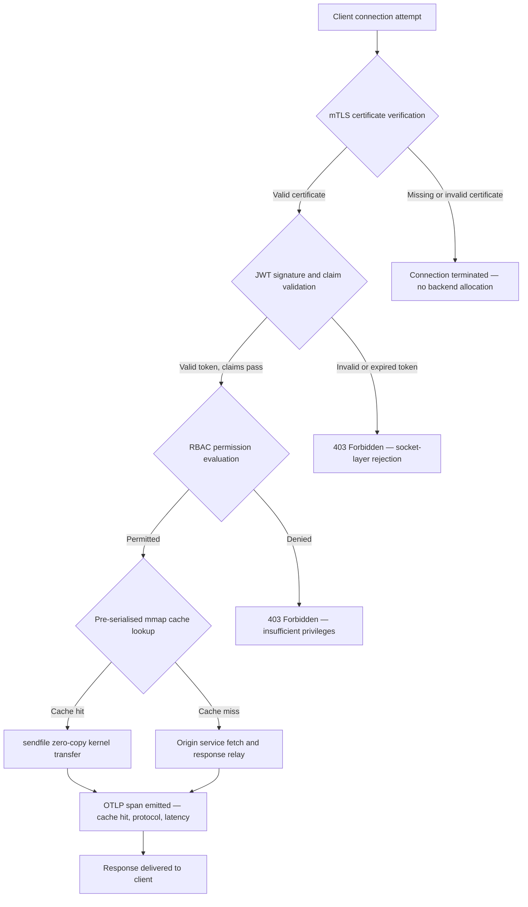

## http-handle: २०२६ मध्ये बँकिंगसाठी उच्च-कार्यक्षम, शून्य-अवलंबित्व एज इनग्रेस

बँकिंग एजला अवलंबित्वाची समस्या आहे. क्लायंट आणि कोअर बँकिंग सेवेदरम्यान रहदारी वळवणारी प्रत्येक Nginx किंवा Envoy इन्स्टन्स एक अवलंबित्व वृक्ष सोबत आणते: OpenSSL बिल्ड, Lua मॉड्यूल्स, gRPC लायब्ररी आणि कंटेनर स्तर — प्रत्येक एक संभाव्य CVE, प्रत्येकाला स्वतंत्र पॅचिंग चक्र आवश्यक, प्रत्येक असा लेटन्सी फरक जोडते जो SLA मोजमाप गुंतागुंतीचे करतो. [डिजिटल ऑपरेशनल रेझिलियन्स अ‍ॅक्ट (DORA)](https://eur-lex.europa.eu/eli/reg/2022/2554/oj) अंतर्गत, ती गुंतागुंत आता परिचालनात्मक इतकीच नियामक देखील एक जबाबदारी बनली आहे.

[http-handle](https://github.com/sebastienrousseau/http-handle) वेगळा दृष्टिकोन घेते. ती एकच, स्थिरपणे लिंक केलेली Rust बायनरी आहे जिला `libc` पलीकडे कोणतेही रनटाइम अवलंबित्व नाही. ती ARM64 नोड्सवर प्रति सेकंद १,८०,००० विनंत्या पुरवते, नेटवर्क सॉकेट स्तरावर परस्पर TLS आणि JWT प्रमाणीकरण लागू करते, आणि HTTP/2 व HTTP/3 आपोआप वाटाघाटी करते — हे सर्व २० MB पेक्षा कमी RAM च्या परिनियोजन पदचिन्हात.

## झटपट उत्तर

**एका वाक्यात http-handle म्हणजे काय?** http-handle ही एक ओपन-सोर्स, स्थिरपणे लिंक केलेली Rust बायनरी आहे जी बँकिंग एजवर जड प्रॉक्सी कंटेनरना पर्याय देते, Linux `sendfile(2)` झिरो-कॉपी कर्नल हस्तांतरणाद्वारे ARM64 वर प्रति सेकंद १,८०,००० विनंत्या पुरवते, कोणतेही बॅकएंड संसाधन स्पर्श होण्यापूर्वीच सॉकेट स्तरावर mTLS, JWT आणि RBAC लागू करते, आणि मूळ [OpenTelemetry](https://opentelemetry.io/) मेट्रिक्स उत्सर्जित करते — `libc` पलीकडे शून्य रनटाइम लायब्ररी अवलंबित्वांसह.

## कार्यकारी सारांश

बँकांनी एक दशक आपल्या एजवर Nginx आणि Envoy चालवले आहेत. दोन्ही सक्षम आहेत; दोन्हींपैकी एकही २०२६ च्या नियामक वातावरणासाठी रचलेला नव्हता. अवलंबित्वयुक्त कंटेनर प्रतिमा अशा CVE रांगा तयार करतात ज्या अनुपालन संघ पुरेशा वेगाने रिकाम्या करू शकत नाहीत, आणि प्रत्येक लायब्ररी आवृत्ती वाढीत प्रतिगमन जोखीम असते. DORA कलम ५ व ६ मागणी करतात की ICT जोखीम रचनेनुसार व्यवस्थापित केली जावी, शोध लागल्यानंतर पॅच केली जाऊ नये. Basel III परिचालन जोखीम आराखडे अशा वास्तुरचनांना दंडित करतात जिथे प्रणालीच्या गुंतागुंतीसह अपयश बिंदू वाढतात.

http-handle अवलंबित्वाची समस्या मुळापासून नष्ट करते. बायनरी एकदाच, स्थिरपणे, रनटाइममध्ये कोणत्याही बाह्य लायब्ररी आवश्यकतेशिवाय संकलित केली जाते. हल्ला पृष्ठभाग Rust मानक लायब्ररी अधिक `libc` इतका आकुंचित होतो. सुरक्षा अंमलबजावणी — mTLS प्रमाणपत्र पडताळणी, JWT दावा पडताळणी, आणि भूमिका-आधारित प्रवेश नियंत्रण — कोणत्याही बॅकएंड वाटपापूर्वी नेटवर्क सॉकेटवर कार्यान्वित होते, ज्यामुळे Zero Trust परिघ त्याच्या सर्वात लहान संभाव्य स्वरूपात कोसळतो. कार्यक्षमता वास्तुरचनेतून येते: पूर्व-मालिकाबद्ध मेमरी-मॅप केलेले कॅशे ब्लॉक्स `sendfile(2)` कर्नल हस्तांतरणासोबत एकत्रित होऊन डेटा CPU-ते-मेमरी कॉपी मार्गातून पूर्णपणे काढून टाकतात, ARM64 हार्डवेअरवर प्रति सेकंद १,८०,००० विनंत्या टिकवतात. परिणाम असा एक इनग्रेस स्तर आहे जो DORA लवचिकता आवश्यकता पूर्ण करतो, Basel III परिचालन जोखीम घटवण्याच्या युक्तिवादांना पाठिंबा देतो, आणि SM&CR अंतर्गत वरिष्ठ IT नेत्यांना एज पायाभूत सुविधेसाठी पडताळणीयोग्य, एकल-घटक जबाबदारी साखळी देतो.

## मुख्य मुद्दे

- **लहान बायनरी, लहान CVE रांगा.** स्थिरपणे लिंक केलेल्या एकल बायनरीला पॅच करण्यासाठी एक पॅकेज, प्रमाणित करण्यासाठी एक रिलीज, आणि लेखापरीक्षण करण्यासाठी एक कलाकृती असते. मानक मॉड्यूल संचासह Nginx ३० हून अधिक सामायिक लायब्ररी अवलंबित्वांसह येते; प्रत्येकाचे स्वतःचे भेद्यता जीवनचक्र असते.
- **झिरो-कॉपी हे अनुकूलन नाही — ते एक रचना बंधन आहे.** प्रति सेकंद १,८०,००० विनंत्यांवर, कोणतीही यूजर-स्पेस डेटा कॉपी मोजण्याजोगा लेटन्सी फरक आणते. `sendfile(2)` फाइल डिस्क्रिप्टर सामग्री पूर्णपणे कर्नल स्पेसमध्ये नेटवर्क सॉकेटवर हस्तांतरित करते. mmap-पिन केलेल्या प्रतिसाद कॅशे ब्लॉक्ससह एकत्रित होऊन, कॅश केलेल्या प्रतिसादांसाठी CPU कधीही डेटा मार्गाला स्पर्श करत नाही.
- **सुरक्षा परिघ सॉकेटवर असावा.** अनुप्रयोग मिडलवेअरमध्ये JWT आणि mTLS प्रमाणपत्रे पडताळणे म्हणजे विनंती नाकारण्यापूर्वी बॅकएंडने आधीच थ्रेड आणि मेमरी वाटप केलेली असते. सॉकेट-स्तरीय पडताळणी हे सुनिश्चित करते की अप्रमाणित विनंत्या अजिबात कोणतेही बॅकएंड संसाधन वापरत नाहीत.
- **OTLP निरीक्षणक्षमतेची त्रुटी दूर करते.** मूळ OpenTelemetry एकात्मीकरण म्हणजे प्रत्येक विनंती, प्रत्येक प्रमाणीकरण निर्णय, आणि प्रत्येक प्रोटोकॉल वाटाघाट साइडकार एजंटशिवाय संरचित टेलिमेट्री तयार करते. सध्याचे बँक डॅशबोर्ड OTLP ट्रेस थेट अंतर्ग्रहण करतात.

**संबंधित वाचन:** [Why YAML Needs a Safer Rust Stack for AI, MCP, and Financial Infrastructure in 2026](https://sebastienrousseau.com/2026-06-18-noyalib-safe-yaml-rust-ai-mcp-financial-infrastructure-2026/), [CloudCDN: An Open-Source Blueprint for the AI-Native Edge in 2026](https://sebastienrousseau.com/2026-06-11-cloudcdn-open-source-blueprint-ai-native-edge-2026/), [Best Cloud Infrastructure Architecture for Banks and Financial Institutions in 2026](https://sebastienrousseau.com/2026-05-16-best-cloud-infrastructure-architecture-2026/).

## 01. बँकिंगमधील जड प्रॉक्सीची समस्या

Nginx आणि Envoy ने आधुनिक इंटरनेटचा एज बांधला. ते संरचनीय, युद्ध-चाचणीत सिद्ध, आणि मोठ्या समुदायांद्वारे समर्थित आहेत. ते DORA अस्तित्वात येण्यापूर्वी, Basel III परिचालन जोखीम आराखड्यांनी परिमाणयोग्य गुंतागुंत घट मागण्यापूर्वी, आणि ARM64 क्लाउड नोड्सने उच्च-थ्रुपुट कंप्यूटची अर्थशास्त्रे बदलण्यापूर्वी घेतलेली वास्तुशिल्पीय निवडदेखील आहेत.

व्यावहारिक परिणाम म्हणजे बँकांना काय आवश्यक आहे आणि जड प्रॉक्सी कंटेनर काय पुरवतात यांच्यातील तफावत.

**अवलंबित्व पृष्ठभाग.** एक मानक Envoy परिनियोजन OpenSSL, Abseil, Protobuf, gRPC, Lua, आणि डझनभर दुय्यम लायब्ररी आत ओढते. प्रत्येकाचे स्वतंत्र CVE जीवनचक्र असते. जेव्हा नॅशनल व्हल्नरॅबिलिटी डेटाबेस एक गंभीर OpenSSL सल्ला प्रकाशित करते, तेव्हा इस्टेटमधील प्रत्येक Envoy इन्स्टन्स एक अनुपालन घड्याळ बनते: मूल्यांकन करा, पॅच करा, चाचणी करा, पुनर्परिनियोजन करा, आणि पुनर्प्रमाणित करा — बायनरी चालणाऱ्या प्रत्येक वातावरणात. DORA कलम ६ अंतर्गत, बँकांनी हे दाखवावे लागते की ICT जोखीम व्यवस्थापन प्रक्रिया प्रमाणबद्ध, दस्तऐवजीकृत आणि पडताळणीयोग्य आहेत. बहु-लायब्ररी अवलंबित्व वृक्ष ते प्रदर्शन राखणे महाग करतो.

**मेमरी ओव्हरहेड.** किमान संरचित Nginx वर्कर प्रक्रिया मध्यम लोडखाली ४०–८० MB निवासी मेमरी वापरते. मोठ्या प्रमाणावर — ट्रेडिंग प्रणाली, पेमेंट API आणि ग्राहक-सन्मुख पोर्टल्समध्ये शेकडो इनग्रेस नोड्स — तो ओव्हरहेड एका सुयोग्य-अभियांत्रिकीकृत एकल-बायनरी पर्यायावर कोणत्याही अनुरूप कार्यक्षमता लाभाशिवाय मोजण्याजोग्या पायाभूत सुविधा खर्चात संकलित होतो.

**पॅचिंग वेग.** कंटेनर-प्रतिमा पुरवठा साखळ्या CVE प्रकाशन आणि उत्पादनात पोहोचणारा पडताळलेला पॅच यांच्यात अनेक-दिवसीय विलंब आणतात. आधार प्रतिमा पुनर्निर्मित करावी लागते, अनुप्रयोग स्तर पुनर्स्तरित करावा लागतो, पूर्ण चाचणी मॅट्रिक्स पुनर्चालवावा लागतो, आणि परिनियोजन पाइपलाइन पुनर्कार्यान्वित करावी लागते. DORA घटना अहवाल खिडक्यांखाली चालणाऱ्या गंभीर बँकिंग प्रणालींसाठी, हे चक्र एक संरचनात्मक जोखीम आहे.

http-handle तिन्हींना संबोधित करते. एक बायनरी. एक CVE पृष्ठभाग. पॅच करण्यासाठी एक कलाकृती. उत्पादन इनग्रेस नोडसाठी २० MB पेक्षा कमी RAM.

## 02. http-handle २०२६ वास्तुरचना दृष्टिकोन

बायनरी पाच परस्परावलंबी स्तरांमध्ये संरचित आहे, प्रत्येक स्तर पारंपरिक प्रॉक्सी वास्तुरचना जमा करत असलेल्या जोखमीच्या एका विशिष्ट श्रेणीला नष्ट करण्यासाठी रचलेला आहे.

### तक्ता १: http-handle वास्तुरचना स्तर आणि जोखीम निवारण

| स्तर | रचना निर्णय | तो का महत्त्वाचा आहे | गैरहाताळणी झाल्यास जोखीम |
| ---- | ---- | ---- | ---- |
| **सर्व्हर कोअर** | एकल Rust बायनरी, स्थिरपणे लिंक केलेली, `libc` पलीकडे शून्य अवलंबित्वे | पॅच करण्यासाठी एक कलाकृती; इस्टेटभर लायब्ररी CVE प्रसार नष्ट करते | अवलंबित्व गोंधळ हल्ले; लायब्ररी भेद्यता संचय |
| **प्रवेगक इंजिन** | पूर्व-मालिकाबद्ध mmap कॅशे ब्लॉक्स आणि `sendfile(2)` झिरो-कॉपी कर्नल हस्तांतरण | ARM64 वर उप-मिलिसेकंद प्रॉक्सी ओव्हरहेडसह प्रति सेकंद १,८०,००० विनंत्या; कॅश केलेल्या प्रतिसादांसाठी कोणताही डेटा यूजर स्पेसमध्ये प्रवेश करत नाही | मेमरी-मॅपिंग गळती; कॅशे अवैधीकरणाखाली कर्नल-स्पेस अडथळे |
| **क्रिप्टोग्राफिक सुरक्षा** | हॉट-रीलोड प्रमाणपत्र समर्थन आणि ALPN वाटाघाटीसह मूळ mTLS | डेटा अखंडता आणि प्रोटोकॉल सुसंगततेची हमी; कनेक्शन ड्रॉपशिवाय प्रमाणपत्र रोटेशन | प्रमाणपत्र कालबाह्यतेमुळे सेवा खंडित; दुर्बल सायफर सूट डिफॉल्ट्स |
| **प्रवेश धोरण समतल** | सॉकेट-स्तरीय JWT पडताळणी आणि RBAC दावा मूल्यमापन | अप्रमाणित विनंत्या कोणतेही बॅकएंड संसाधन वापरत नाहीत; कर्नल सीमेवर Zero Trust लागू | JWT अल्गोरिदम गोंधळ हल्ले; अतिरिक्त-विशेषाधिकार प्रवेश देणारी RBAC गैरसंरचना |
| **निरीक्षणक्षमता** | मूळ [OpenTelemetry (OTLP)](https://opentelemetry.io/docs/specs/otlp/) एकात्मीकरण | साइडकार एजंटशिवाय संरचित टेलिमेट्री; सध्याच्या बँक निरीक्षण इस्टेटमध्ये थेट अंतर्ग्रहण | खंडनादरम्यान अंध बिंदू; DORA घटना अहवालासाठी अपूर्ण लेखापरीक्षण मार्ग |

## 03. मुख्य कार्यक्षमता आणि सुरक्षा संकेत

एजवर http-handle चालवणाऱ्या बँकांनी DORA परिचालन अहवाल आवश्यकता आणि अंतर्गत SLA प्रशासन पूर्ण करण्यासाठी पाच परिमाणयोग्य संकेत उपकरणीकृत करावेत.

### तक्ता २: परिचालन मानदंड आणि नियामक संदर्भ

| संकेत | मानदंड | नियामक संदर्भ | तांत्रिक अंमलबजावणी |
| ---- | ---- | ---- | ---- |
| **थ्रुपुट** | ARM64 नोड्सवर P99 ≤ १ ms प्रॉक्सी ओव्हरहेडवर ≥ १,८०,००० विनंत्या/सेकंद | Basel III परिचालन जोखीम — प्रणाली गुंतागुंत घट | `sendfile(2)` + mmap पूर्व-मालिकाबद्ध कॅशे ब्लॉक्स; कॅशे हिटसाठी कोणतीही यूजर-स्पेस डेटा कॉपी नाही |
| **हल्ला पृष्ठभाग** | शून्य रनटाइम लायब्ररी अवलंबित्वे; प्रति रिलीज एक बायनरी कलाकृती | [DORA कलम ६](https://eur-lex.europa.eu/eli/reg/2022/2554/oj) — रचनेनुसार ICT जोखीम व्यवस्थापन | `cargo build --release --target aarch64-unknown-linux-musl` सह स्थिर संकलन |
| **प्रमाणीकरण लेटन्सी** | बॅकएंड प्रतिसादाच्या पहिल्या बाइटपूर्वी mTLS हँडशेक + JWT पडताळणी पूर्ण | [DORA कलम ५](https://eur-lex.europa.eu/eli/reg/2022/2554/oj) — ICT सुरक्षा संरक्षण | सॉकेट-स्तरीय अवरोधन; बॅकएंड रूटिंगपूर्वी कर्नल-लगत Rust मध्ये JWT दावा मूल्यमापन |
| **प्रमाणपत्र उपलब्धता** | रोटेशनदरम्यान शून्य ड्रॉप कनेक्शनसह mTLS प्रमाणपत्रांचे हॉट-रीलोड | एज उपलब्धतेसाठी SM&CR वरिष्ठ व्यवस्थापन जबाबदारी | inotify-चालित प्रमाणपत्र निरीक्षक; रीलोडदरम्यान अणु फाइल-डिस्क्रिप्टर स्वॅप |
| **निरीक्षणक्षमता व्याप्ती** | प्रमाणीकरण निकाल, प्रोटोकॉल आवृत्ती आणि कॅशे स्थितीसह OTLP स्पॅन तयार करणाऱ्या १०० % विनंत्या | DORA कलम १७ — घटना शोध आणि अहवाल | मूळ OTLP निर्यातक; साइडकार आवश्यक नाही; gRPC किंवा HTTP/Protobuf वाहतूक संरचनीय |

## 04. झिरो-कॉपी इंजिन: mmap आणि sendfile(2)

उच्च-वारंवारता बँकिंगमधील नेटवर्क कार्यक्षमता — रिअल-टाइम पेमेंट, मार्केट-डेटा API, प्रमाणीकरण टोकन सेवा — इतर कोणत्याही बंधनापेक्षा एका बंधनाने अधिक मर्यादित असते: संचयनातून नेटवर्क सॉकेटवर बाइट हलवण्याचा खर्च.

पारंपरिक HTTP सर्व्हर फाइल सामग्री यूजर-स्पेस बफरमध्ये वाचतात, नंतर तो बफर सॉकेटवर लिहितात. त्या अनुक्रमाला प्रत्येक प्रतिसादासाठी दोन मेमरी कॉपी आणि यूजर स्पेस व कर्नल स्पेसमधील दोन संदर्भ स्विच आवश्यक असतात. प्रति सेकंद १,८०,००० विनंत्यांवर, संचित ओव्हरहेड लक्षणीय आहे.

http-handle दोन्ही कॉपी नष्ट करते.

**मेमरी-मॅप केलेले कॅशे ब्लॉक्स.** जेव्हा सेवा सुरू होते, तेव्हा ती `mmap(2)` वापरून स्थिर प्रतिसाद सामग्री मेमरी-मॅप केलेल्या प्रदेशांमध्ये मालिकाबद्ध करते. हे प्रदेश कर्नलच्या पेज कॅशेमध्ये पिन केलेले असतात. जेव्हा कॅश केलेल्या संसाधनासाठी विनंती येते, तेव्हा प्रतिसाद आधीच कर्नल मेमरीमध्ये मॅप केलेला असतो — कोणतेही डिस्क वाचन नाही, कोणतेही बफर वाटप नाही.

**`sendfile(2)` कर्नल हस्तांतरण.** Linux `sendfile(2)` सिस्टम कॉल डेटा थेट फाइल डिस्क्रिप्टरमधून — किंवा मेमरी-मॅप केलेल्या प्रदेशातून — नेटवर्क सॉकेट फाइल डिस्क्रिप्टरवर, पूर्णपणे कर्नलमध्ये हस्तांतरित करते. कोणताही बाइट यूजर स्पेसमध्ये प्रवेश करत नाही. CPU ची भूमिका सिस्टम कॉल जारी करणे आणि पूर्णता घटना हाताळणे इतकी कमी होते. या वास्तुरचनेसह ARM64 नोड्सवर, http-handle टिकून लोडखाली उप-मिलिसेकंद प्रॉक्सी ओव्हरहेडवर प्रति सेकंद १,८०,००० विनंत्या टिकवते.

महिना-अखेर बॅच समेट, दिवसांतर्गत तरलता अहवाल, किंवा रिअल-टाइम फसवणूक-स्कोअरिंग API रहदारी चालवणाऱ्या बँकांसाठी, अभियांत्रिकी परिणाम थेट आहे: प्रति रहदारी स्तर कमी ARM64 नोड्स, कमी पायाभूत सुविधा खर्च, आणि क्षमता कमतरतेमुळे लहान DORA लवचिकता जोखीम.

## 05. mTLS आणि JWT प्रवेश धोरण समतल

बँकिंगमध्ये, एजवरील प्रमाणीकरण हे वैशिष्ट्य नाही — ते एक नियामक आवश्यकता आहे. DORA आदेश देते की ICT सुरक्षा नियंत्रणे प्रमाणबद्ध, दस्तऐवजीकृत आणि पडताळणीयोग्य असावीत. SM&CR पायाभूत सुविधा सुरक्षा निर्णयांसाठी वैयक्तिक जबाबदारी नामनिर्दिष्ट वरिष्ठ व्यवस्थापकांवर ठेवते. प्रश्न एजवर प्रमाणीकरण करायचे की नाही हा नसून, कोणत्या स्तरावर करायचे हा आहे.

http-handle कोणतेही बॅकएंड संसाधन वाटप होण्यापूर्वी तीन-टप्प्यांचे Zero Trust धोरण लागू करते.

**टप्पा १: mTLS क्लायंट प्रमाणपत्र पडताळणी.** TLS हँडशेकदरम्यान, http-handle संरचनीय ट्रस्ट स्टोअरच्या विरुद्ध क्लायंट प्रमाणपत्राची विनंती करते आणि पडताळते. वैध प्रमाणपत्राशिवाय कनेक्शन हँडशेकवरच संपुष्टात येतात. कोणताही अनुप्रयोग थ्रेड निर्माण होत नाही, कोणताही मेमरी पूल वाटप होत नाही. बॅकएंड कधीही विनंती पाहत नाही.

**टप्पा २: JWT दावा पडताळणी.** mTLS पास करणाऱ्या कनेक्शनसाठी, http-handle सॉकेट स्तरावर `Authorization` शीर्षकातून JSON वेब टोकन काढते आणि पडताळते. स्वाक्षरी पडताळणी, कालबाह्यता तपासणी, आणि जारीकर्ता पडताळणी विनंती रूटिंग स्तरावर पोहोचण्यापूर्वी घडतात. अल्गोरिदम गोंधळ हल्ले — जिथे असममित की अपेक्षित असताना सर्व्हर सममित अल्गोरिदम स्वीकारतो — संरचनेत स्पष्ट अल्गोरिदम अनुमती-सूचीकरणाद्वारे रोखले जातात.

**टप्पा ३: RBAC दावा मूल्यमापन.** पडताळलेले JWT दावे इन-मेमरी भूमिका तक्त्याशी नकाशित होतात. अपुरे परवानग्या वाहून नेणाऱ्या विनंत्यांना प्रवेश धोरण समतलावर ४०३ प्रतिसाद मिळतो. अनधिकृत रहदारीसाठी बॅकएंड सेवा कधीही कार्यान्वित होत नाही.

हा क्रम परिचालनदृष्ट्या महत्त्वाचा आहे. पारंपरिक मॉडेलखाली — जिथे प्रमाणीकरण अनुप्रयोग मिडलवेअरमध्ये चालते — एक हल्लेखोर एकही नकार जारी होण्यापूर्वी अप्रमाणित विनंत्यांसह बॅकएंड थ्रेड पूल संपवू शकतो. सॉकेट-स्तरीय प्रमाणीकरण तो हल्ला मार्ग पूर्णपणे कोसळवते.

## 06. ALPN रूटिंग आणि HTTP/3 फॉलबॅक साखळी

बँकिंग रहदारी विविध नेटवर्क परिस्थितींवर येते: ट्रेडिंग डेस्कसाठी कॉर्पोरेट फायबर, मोबाइल बँकिंग क्लायंटसाठी 5G, दूरस्थ परिचालनांसाठी उपग्रह कनेक्टिव्हिटी, आणि नियमित वातावरणात TLS तपासणी प्रॉक्सी. एकल-प्रोटोकॉल इनग्रेस एक किमान-सामाईक-भाजक बंधन तयार करते.

http-handle प्रत्येक कनेक्शनसाठी इष्टतम प्रोटोकॉल आपोआप निवडण्यासाठी [अनुप्रयोग-स्तर प्रोटोकॉल वाटाघाट (ALPN)](https://www.rfc-editor.org/rfc/rfc7301) वापरते.

**HTTP/2** हे TCP वर ब्राउझर आणि API रहदारीसाठी डिफॉल्ट आहे. एकाच कनेक्शनवर बहुगुणित प्रवाह HTTP/1.1 समवर्ती विनंती नमुन्यांखाली आणत असलेला हेड-ऑफ-लाइन अडथळा नष्ट करतात.

**HTTP/3 (QUIC)** जेव्हा नेटवर्क UDP ला समर्थन देते आणि क्लायंट त्याच्या ALPN विस्तारात `h3` जाहिरात करते तेव्हा सक्रिय होते. QUIC चे स्वतंत्र प्रवाह बहुगुणन आणि कनेक्शन स्थलांतर हे गर्दीच्या सेल्युलर नेटवर्कवरील मोबाइल बँकिंग क्लायंटसाठी लक्षणीयरीत्या चांगले बनवते, जिथे TCP कनेक्शन वारंवार ड्रॉप होतात आणि पुनर्कनेक्ट होतात.

**सौम्य फॉलबॅक.** जर ALPN वाटाघाट अयशस्वी झाली — कारण एखादी मध्यवर्ती प्रॉक्सी विस्तार काढून टाकते किंवा एखादा वारसा क्लायंट तो वगळतो — तर http-handle सर्व सुरक्षा शीर्षके, mTLS अंमलबजावणी आणि JWT पडताळणी राखत HTTP/1.1 वर परत येते. प्रोटोकॉल फॉलबॅकदरम्यान कोणतीही सुरक्षा गुणधर्म खालावत नाही.

## 07. झिरो-कॉपी विनंती जीवनचक्र

खालील आकृती क्लायंट कनेक्शनपासून प्रतिसाद वितरणापर्यंतचा संपूर्ण विनंती मार्ग दाखवते, ज्यात प्रमाणीकरण गेट आणि निरीक्षणक्षमता उत्सर्जन बिंदूंचा समावेश आहे.

कॅशे-हिट प्रतिसादांसाठी गंभीर मार्ग तीन सुरक्षा गेट आणि एका सिस्टम कॉलमधून जातो. प्रतिसाद मुख्यभागासाठी कोणताही यूजर-स्पेस बफर वाटप होत नाही. OTLP स्पॅन प्रमाणीकरण निकाल, ALPN-वाटाघाटीयुक्त प्रोटोकॉल आवृत्ती, कॅशे स्थिती, आणि आद्यंत लेटन्सी एका संरचित नोंदीत नोंदवते.

## 08. नियामक सुसंगती: DORA, Basel III, आणि SM&CR

### DORA कलम ५ आणि ६ — ICT जोखीम व्यवस्थापन आणि संरक्षण

[DORA कलम ५](https://eur-lex.europa.eu/eli/reg/2022/2554/oj) आवश्यक करते की वित्तीय संस्थांनी ICT जोखीम व्यवस्थापन आराखडे राखावेत. कलम ६ आवश्यक करते की त्यांनी त्यांच्या ICT प्रणालींच्या जोखीम प्रोफाइलला प्रमाणबद्ध असे संरक्षण आणि प्रतिबंध उपाय अंमलात आणावेत.

स्थिरपणे लिंक केलेली एकल बायनरी बहु-लायब्ररी कंटेनर स्टॅकपेक्षा दोन्ही आवश्यकता अधिक कार्यक्षमतेने पूर्ण करते. हल्ला पृष्ठभाग परिमाणयोग्य आहे — एक कलाकृती, एक अवलंबित्व (`libc`), एक CVE पृष्ठभाग — आणि संरक्षण उपाय प्रक्रियात्मक नसून संरचनात्मक आहेत: mTLS आणि JWT अंमलबजावणी गैरसंरचनेद्वारे बायपास केली जाऊ शकत नाही कारण कोणतीही संरचनीय अनुप्रयोग तर्कशास्त्र चालण्यापूर्वी ती सॉकेट स्तरावर कार्यान्वित होते.

### Basel III — परिचालन जोखीम भांडवल आवश्यकता

[Basel III चा परिचालन जोखीम आराखडा](https://www.bis.org/bcbs/basel3.htm) नियामक भांडवल आवश्यकता प्रदर्शनयोग्य जोखीम घटशी जोडतो. ज्या बँका प्रणाली गुंतागुंत आणि ICT अपयश-बिंदू संख्येमध्ये मोजण्याजोगी घट दस्तऐवजीकृत करू शकतात त्यांच्याकडे कमी परिचालन जोखीम भांडवल वाटपासाठी परिमाणयोग्य युक्तिवाद असतो. बहु-कंटेनर प्रॉक्सी इस्टेटला एकल-बायनरी इनग्रेस नोड्सने बदलणे हे नेमके या प्रकारची गुंतागुंत घट आहे जी या युक्तिवादाला पाठिंबा देते — जर अभियांत्रिकी संघ प्रमाणीकरण दस्तऐवजीकरण तयार करू शकत असेल तर.

http-handle च्या लेखापरीक्षणयोग्य रिलीज कलाकृती — पुनरुत्पादनयोग्य बिल्ड, SBOM-सुसंगत अवलंबित्व मॅनिफेस्ट, आणि OTLP-आधारित परिचालन लॉग — Basel III भांडवल चर्चांना आवश्यक दस्तऐवजीकरण साखळीला पाठिंबा देतात.

### SM&CR — वरिष्ठ व्यवस्थापक जबाबदारी

[वरिष्ठ व्यवस्थापक आणि प्रमाणन नियमन (SM&CR)](https://www.fca.org.uk/firms/senior-managers-certification-regime) त्यांच्या जबाबदारीखालील प्रणालींच्या ICT सुरक्षा स्थितीसाठी नामनिर्दिष्ट वरिष्ठ व्यवस्थापकांवर वैयक्तिक दायित्व ठेवते. सेवेत खंड न आणता प्रमाणपत्रांचे हॉट-रीलोड करणारी, OTLP द्वारे संरचित लेखापरीक्षण लॉग तयार करणारी, आणि प्रति परिनियोजन एक आवृत्ती-पिन केलेली कलाकृती असणारी एकल-बायनरी इनग्रेस नामनिर्दिष्ट वरिष्ठ व्यवस्थापकाला पडताळणीयोग्य, दस्तऐवजीकरणयोग्य सुरक्षा साखळी देते. बहु-लायब्ररी कंटेनर स्टॅक तसे करत नाही.

## 09. भूमिकेनुसार याचा काय अर्थ आहे

### संचालक मंडळ आणि मुख्य कार्यकारी अधिकारी

Basel III परिचालन जोखीम आराखड्यांखाली नियामक भांडवल अनुकूलन प्रदर्शनयोग्य गुंतागुंत घटीवर अवलंबून असते. Nginx किंवा Envoy ला एकल स्थिरपणे लिंक केलेल्या बायनरीने बदलणे ICT अपयश-बिंदू संख्या अशा प्रकारे घटवते जी लेखापरीक्षणयोग्य आणि प्रुडेन्शियल नियामकांना सादर करण्यायोग्य आहे. घटलेला CVE पृष्ठभाग सायबर-विमा प्रीमियम पुनर्वाटाघाटीलादेखील पाठिंबा देतो — विमादाते प्रदर्शनयोग्य हल्ला-पृष्ठभाग मेट्रिक्सवर किंमत ठरवतात, आणि एकल-अवलंबित्व इनग्रेस बायनरी हा एक ठोस डेटा बिंदू आहे.

### मुख्य माहिती सुरक्षा अधिकारी आणि मुख्य जोखीम अधिकारी

DORA अनुपालनासाठी ICT संरक्षण उपाय प्रमाणबद्ध आणि पडताळणीयोग्य असणे आवश्यक आहे. सॉकेट-स्तरीय mTLS आणि JWT अंमलबजावणी एजवर एक पडताळणीयोग्य, बायपास न करता येणारा प्रमाणीकरण गेट पुरवते. हॉट-रीलोड प्रमाणपत्र रोटेशन पारंपरिक प्रमाणपत्र अद्यतने वाहून नेणारी सेवा-खिडकी जोखीम नष्ट करते. शून्य-अवलंबित्व संकलन मॉडेल म्हणजे जेव्हा एक गंभीर `libc` सल्ला प्रकाशित होतो, तेव्हा संपूर्ण इस्टेट एकाच Rust स्रोत कलाकृतीतून दिवसांऐवजी तासांत पुनर्निर्मित, चाचणीत आणि पुनर्परिनियोजित केली जाऊ शकते.

### अभियांत्रिकी आणि IT व्यवस्थापन

मानक ARM64 नोडवर प्रति सेकंद १,८०,००० विनंत्या पेमेंट API आणि प्रमाणीकरण सेवांसाठी पायाभूत-सुविधा-आकारमान चर्चा बदलतात. मूळ OTLP एकात्मीकरण Prometheus निर्यातक, साइडकार एजंट, किंवा सानुकूल लॉग शिपरची गरज दूर करते. Kubernetes परिनियोजन मॉडेल हे एक मानक पॉड आहे — २० MB पेक्षा कमी RAM, कोणत्याही विशेषाधिकार कंटेनर परवानग्या नाहीत, कोणताही होस्ट-नेटवर्क प्रवेश नाही. प्रमाणपत्र हॉट-रीलोड Kubernetes रोलिंग-रीस्टार्ट ओव्हरहेडशिवाय चालते.

## वारंवार विचारले जाणारे प्रश्न

**लोडखाली http-handle प्रमाणपत्र रोटेशन कसे हाताळते?**
बायनरी inotify निरीक्षक वापरून प्रमाणपत्र फाइल मार्गांचे निरीक्षण करते. जेव्हा नवीन प्रमाणपत्र आणि की फाइल आढळतात, तेव्हा ती सक्रिय TLS संदर्भाचा अणु स्वॅप करते — विद्यमान कनेक्शन मागील प्रमाणपत्र वापरून पूर्ण होतात तर नवीन कनेक्शन तात्काळ रोटेट केलेले वापरतात. कोणतेही कनेक्शन ड्रॉप होत नाही. कोणतीही सेवा-खिडकी आवश्यक नाही.

**http-handle इनग्रेस कंट्रोलर म्हणून Kubernetes क्लस्टरमध्ये चालू शकते का?**
होय. बायनरी मानक इनग्रेस सेवा टिप्पणीसह स्वतंत्र पॉड म्हणून चालते. संसाधन आवश्यकता पूर्ण थ्रुपुटवर २० MB पेक्षा कमी RAM आहेत, कोणत्याही विशेषाधिकार कंटेनर परवानग्या नाहीत आणि कोणतीही होस्ट-नेटवर्क प्रवेश आवश्यकता नाही. जिथे केंद्रीकृत गेटवे प्रमाणीकरणापेक्षा साइडकार स्तरावर mTLS अंमलबजावणी पसंत केली जाते अशा सर्व्हिस मेशमध्ये ती साइडकार म्हणूनदेखील चालू शकते.

**प्रॉक्सीचे स्वतःचे मोजण्याजोगे लेटन्सी योगदान किती आहे?**
कॅशे-हिट प्रतिसादांसाठी, प्रॉक्सी ओव्हरहेड — सॉकेट स्वीकारापासून `sendfile(2)` पूर्णतेपर्यंत — ARM64 हार्डवेअरवर उप-मिलिसेकंद आहे. अपस्ट्रीम फेच आवश्यक असणाऱ्या कॅशे-मिस प्रतिसादांसाठी, ओव्हरहेड तोच उप-मिलिसेकंद आकडा अधिक ओरिजिन प्रतिसाद वेळ आहे. प्रॉक्सी स्वतः रांग लेटन्सी जोडत नाही कारण प्रमाणीकरण सॉकेट स्तरावर समकालिकपणे घडते, आणि क्रेडेन्शियल पडताळणी पूर्ण होण्यापूर्वी कोणतेही थ्रेड-पूल वाटप होत नाही.

**सध्याच्या API गेटवेसोबत Zero Trust वास्तुरचनेत http-handle कसे बसते?**
http-handle OSI स्तर 4/7 सीमेवर चालते: ती अपस्ट्रीम सेवांकडे रूट करण्यापूर्वी वाहतूक-स्तरीय mTLS लागू करते आणि अनुप्रयोग-स्तरीय JWT पडताळते. ती पूर्ण API गेटवेसमोर बसू शकते — गेटवेच्या अधिक महाग प्रक्रिया स्तरावर पोहोचण्यापूर्वी अप्रमाणित रहदारी शोषून घेत — किंवा ज्या सेवांचे प्रवेश धोरण पूर्णपणे JWT दाव्यांमध्ये व्यक्त करता येते त्यांच्यासाठी गेटवेला पूर्णपणे बदलू शकते.

**पुरवठा-साखळी लेखापरीक्षण हेतूंसाठी बायनरी आउटपुट पुनरुत्पादनयोग्य आहे का?**
होय. बिल्ड पिन केलेल्या Rust टूलचेन आवृत्ती आणि लॉक केलेल्या `Cargo.lock` सह पुनरुत्पादनयोग्य आहे. `cargo cyclonedx` द्वारे SBOM निर्मिती प्रत्येक रिलीजसाठी CycloneDX-सुसंगत बिल ऑफ मटेरियल्स तयार करते. दोन्ही कलाकृती बँकेच्या अंतर्गत सॉफ्टवेअर रचना विश्लेषण टूलचेनमध्ये प्रकाशित करण्यायोग्य आहेत आणि DORA पुरवठा-साखळी जोखीम दस्तऐवजीकरण आवश्यकता पूर्ण करतात.

## निष्कर्ष

बँकिंग एजला अधिक वैशिष्ट्यांची गरज नाही — त्याला कमी घटकांची गरज आहे, प्रत्येक कमी काम करणारा आणि ते पडताळणीयोग्यपणे करणारा. http-handle इनग्रेस स्तराला त्याच्या अखंडनीय किमानापर्यंत घटवते: एकच Rust बायनरी जी सॉकेटवर प्रमाणीकरण लागू करते, डेटा कॉपी न करता हस्तांतरित करते, आणि ती जे काही करते ते संरचित टेलिमेट्रीत नोंदवते. DORA अनुपालन कालमर्यादा, Basel III भांडवल अनुकूलन पुनरावलोकने, आणि SM&CR जबाबदारी आवश्यकतांतून मार्ग काढणाऱ्या बँकांसाठी, ती साधेपणा ही अभियांत्रिकी पसंती नाही — ती एक नियामक युक्तिवाद आहे.

[http-handle स्रोत कोड](https://github.com/sebastienrousseau/http-handle) MIT आणि Apache 2.0 दुहेरी परवान्याखाली उपलब्ध आहे.

---

*संदर्भ*

Basel Committee on Banking Supervision (2011). *Basel III: A global regulatory framework for more resilient banks and banking systems*. Bank for International Settlements. येथे उपलब्ध: [https://www.bis.org/publ/bcbs189.htm](https://www.bis.org/publ/bcbs189.htm)

European Parliament and Council (2022). Regulation (EU) 2022/2554 on digital operational resilience for the financial sector (DORA). येथे उपलब्ध: [https://eur-lex.europa.eu/legal-content/EN/TXT/?uri=CELEX:32022R2554](https://eur-lex.europa.eu/legal-content/EN/TXT/?uri=CELEX:32022R2554)

Financial Conduct Authority (2015). *Senior Managers and Certification Regime (SM&CR)*. येथे उपलब्ध: [https://www.fca.org.uk/firms/senior-managers-certification-regime](https://www.fca.org.uk/firms/senior-managers-certification-regime)

Internet Engineering Task Force (2014). *RFC 7301: Transport Layer Security (TLS) Application-Layer Protocol Negotiation Extension*. येथे उपलब्ध: [https://www.rfc-editor.org/rfc/rfc7301](https://www.rfc-editor.org/rfc/rfc7301)

OpenTelemetry Authors (2024). *OpenTelemetry Protocol Specification (OTLP)*. येथे उपलब्ध: [https://opentelemetry.io/docs/specs/otlp/](https://opentelemetry.io/docs/specs/otlp/)
