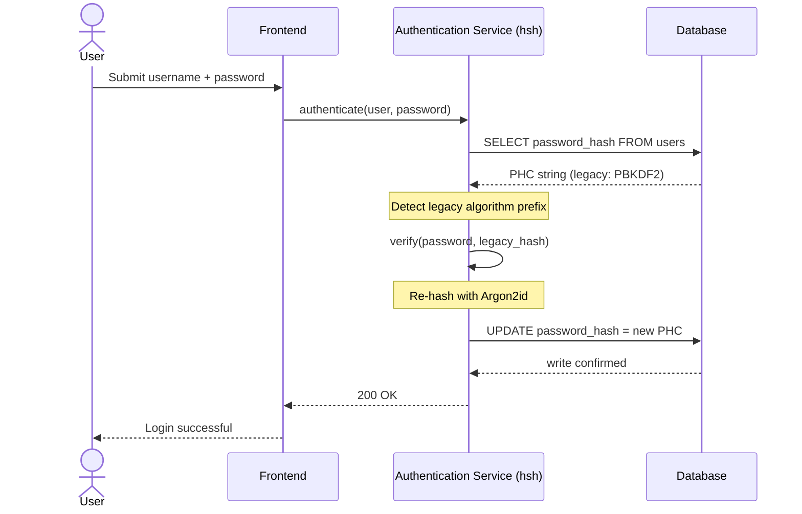
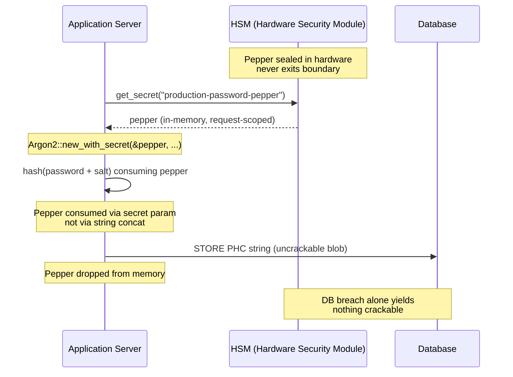

## एंटरप्राइझ बँकिंगमध्ये पासवर्ड व्यवस्थापन सुरक्षित करणे: hsh सह बहु-अल्गोरिदम हॅशिंग आणि अपग्रेड

> **कार्यकारी सारांश.** 2018 च्या धोका-प्रतिमानाविरुद्ध बांधलेले बँकिंग प्रमाणीकरण 2026 च्या नियामक व्यवस्थेखाली आता उपयुक्त राहिलेले नाही. GPU-गतिमान क्रॅकिंग, ASIC घनता आणि जवळ येत असलेले पोस्ट-क्वांटम क्षितिज यांनी PBKDF2 आणि प्रारंभिक-पॅरामीटर scrypt यांचे सुरक्षा अंतर कोसळवले आहे; DORA कलम 5 ने या क्षयाला संचालक-मंडळाला जबाबदार असलेल्या दायित्वात बदलले आहे. hsh, एक ओपन-सोर्स शुद्ध-Rust फ्रेमवर्क, ही समस्या समांतरपणे तीन स्तरांवर सोडवते: एक `verify_and_upgrade` डिस्पॅचर जो प्रत्येक यशस्वी लॉगिनवर देखभाल-कालावधीशिवाय संचयित क्रेडेन्शियल सध्याच्या Argon2id पॅरामीटर्सवर पुन्हा हॅश करतो; एक HSM- किंवा KMS-इंटरलॉक केलेला पेपरिंग स्तर जो केवळ डेटाबेस भंग झाल्यास काहीही क्रॅक करण्याजोगे मिळू देत नाही; आणि एक मेमरी-सुरक्षित पुरवठा साखळी जी C-समर्थित क्रिप्टोग्राफिक लायब्ररीजमध्ये अंतर्भूत असलेला फॉरेन-फंक्शन-इंटरफेस हल्ला पृष्ठभाग नष्ट करते. याचा परिणाम म्हणजे एक आधारशिला जी DORA, Basel III ऑपरेशनल-जोखीम शिस्त, SM&CR वरिष्ठ-व्यवस्थापक जबाबदारी आणि NIST IR 8547 पोस्ट-क्वांटम स्थलांतर क्षितिज यांची पूर्तता करते — तेही प्रमाणीकरण इस्टेट अपग्रेड करण्यासाठी ऐतिहासिकदृष्ट्या आवश्यक असलेल्या मोठ्या प्रमाणातील रीसेट कार्यक्रमाशिवाय.

बहुतांश एंटरप्राइझ बँकिंग प्रमाणीकरण अजूनही 2018 च्या धोका-प्रतिमानानुसार बळकट केलेल्या पासवर्ड स्तरावर विसावलेले आहे. ते तोडणारे हार्डवेअर मात्र पुढे गेले आहे. जसजसे GPU फार्म वाढतात आणि क्रिप्टोग्राफिकदृष्ट्या संबंधित क्वांटम संगणक (CRQCs) जवळ येतात, तसतसे लेगसी हॅशिंग — PBKDF2, प्रारंभिक scrypt — हल्लेखोर ऑफलाइन क्रॅक रांगेवर खर्च करत असलेल्या प्रत्येक तासाच्या संगणनासोबत क्षय पावते. हा क्षय शांत आहे: कालपर्यंत बळकट असलेला हॅश आता तसा राहिलेला नाही, हे उत्पादन डेटाबेसमधील काहीही तुम्हाला सांगत नाही.

[Digital Operational Resilience Act (DORA)](https://eur-lex.europa.eu/eli/reg/2022/2554/oj "Regulation (EU) 2022/2554 — Digital Operational Resilience Act") अंतर्गत, न-फिरवलेली, लेगसी क्रिप्टोग्राफिक मालमत्ता उत्पादनात ठेवणे हे आता तांत्रिक कर्ज राहिलेले नाही. ते नामनिर्दिष्ट नियामक दायित्व आहे.

[hsh](https://github.com/sebastienrousseau/hsh "hsh — शुद्ध-Rust पासवर्ड हॅशिंग फ्रेमवर्क") हे अंतर बंद करते. एक शुद्ध-Rust फ्रेमवर्क, ते अनेक हॅश स्वरूपे समांतरपणे व्यवस्थापित करते आणि सक्रिय लॉगिन सत्रांदरम्यान कमजोर क्रेडेन्शियल्स प्रवाहातच अपग्रेड करते. प्रमाणीकरण पायाभूत सुविधा देखभाल-कालावधीशिवाय, सक्तीच्या रीसेटशिवाय, एका सेकंदाच्या डाउनटाइमशिवाय 2026 च्या रेझिलियन्स आदेशांशी संरेखित होते.

## 01. बँकिंगमधील क्रिप्टोग्राफिक क्षयाची समस्या

hsh सारख्या फ्रेमवर्कची गरज समजून घेण्यासाठी, पासवर्ड हॅशच्या जीवनचक्राचे आकलन असणे आवश्यक आहे. अल्गोरिदम सुंदररीत्या वयस्कर होत नाहीत; ते त्यांना तोडण्यासाठी उपलब्ध हार्डवेअरच्या तुलनेत क्षय पावतात.

**ASIC/GPU गतिमानतेचे अंतर.** PBKDF2 सारखे अल्गोरिदम CPU साठी संगणकीयदृष्ट्या महाग असण्यासाठी रचले गेले होते. आज, हल्लेखोर ऑफलाइन शब्दकोश हल्ले चालवण्यासाठी अत्यंत समांतरीकृत GPU वापरतात. 2018 मध्ये तयार झालेला लेगसी हॅश 2026 च्या प्रतिस्पर्ध्याविरुद्ध कमालीचा कमजोर असतो.

**बिग-बँग स्थलांतराचा धोका.** जेव्हा एखादा CISO PBKDF2 वरून Argon2id सारख्या मेमरी-हार्ड अल्गोरिदमवर अपग्रेड करण्याचा निर्णय घेतो, तेव्हा तो हॅश उलट करून त्यांना पुन्हा एन्क्रिप्ट करू शकत नाही. पारंपरिक उपाय — कोट्यवधी वापरकर्त्यांना पासवर्ड रीसेट करण्यास भाग पाडणे — प्रचंड ग्राहक घर्षण आणि ऑपरेशनल धोका निर्माण करतात.

**C-लायब्ररी पुरवठा साखळी.** ऐतिहासिकदृष्ट्या, बँकिंग मिडलवेअर हॅशिंगसाठी `argonautica` सारख्या लायब्ररीजवर किंवा कच्च्या C बाइंडिंगवर अवलंबून राहिले आहे. या लायब्ररीज एक लपलेला पुरवठा-साखळी धोका बाळगतात: प्रमाणीकरण मॉड्यूलमधील एकच मेमरी-बफर ओव्हरफ्लो बँकिंग स्टॅकच्या सर्वाधिक विशेषाधिकारप्राप्त स्तरावर रिमोट कोड एक्झिक्युशन (RCE) कडे नेऊ शकतो.

### अल्गोरिदम तुलना — हार्डवेअर प्रतिकार आणि ट्यूनिंग पृष्ठभाग

स्थलांतर संग्रहात एखाद्या बँकेला वास्तविकपणे भेटणारे तीन अल्गोरिदम क्रिप्टोग्राफिक आदिम निवडीत कमी आणि हार्डवेअरच्या दबावाखाली ते कसे वयस्कर होतात यात अधिक भिन्न असतात. खालील तक्ता व्यावहारिक स्थिती सारांशित करतो.

| अल्गोरिदम | मेमरी-हार्ड | GPU / ASIC प्रतिकार | ट्यूनिंग पृष्ठभाग | 2026 स्थिती |
| ---- | ---- | ---- | ---- | ---- |
| **PBKDF2** | नाही | कमी — GPU वर व्हेक्टराइझ होते; सामान्य हार्डवेअरवर प्रति अंदाज उप-मिलिसेकंद. | केवळ पुनरावृत्ती संख्या. | लेगसी. स्थलांतरादरम्यान केवळ verify-बाजूचा फॉलबॅक म्हणून स्वीकार्य. |
| **scrypt** | होय (मध्यम) | मध्यम — मेमरी खर्च साध्या GPU फार्मना पराभूत करतो; मोठ्या प्रमाणावर ASIC-वर परतफेड करण्याजोगा. | `N` (CPU/मेमरी), `r` (ब्लॉक आकार), `p` (समांतरता). | ग्रीनफील्डसाठी अप्रचलित. स्थलांतर संग्रहांमध्ये सक्रिय. |
| **Argon2id** | होय (उच्च) | उच्च — मेमरी- आणि वेळ-हार्ड; साइड-चॅनेल आणि TMTO हल्ल्यांना प्रतिकार करते. | मेमरी खर्च (`m`), वेळ खर्च (`t`), समांतरता (`p`), गुप्त (pepper). | शिफारसीय पूर्वनिर्धारित. OWASP, NIST SP 800-63B-4 मसुदा, FedRAMP. |

स्थलांतर योजनेसाठीचा निष्कर्ष संकुचित आहे: PBKDF2 ही एक *verify-बाजूची* स्थिती आहे, *write-बाजूचे* गंतव्य नाही. PBKDF2 नोंदीवरील प्रत्येक यशस्वी लॉगिनने बाहेर पडतानाच एक Argon2id नोंद निर्माण केली पाहिजे.

## 02. hsh 2026 आर्किटेक्चर लेन्स

हे फ्रेमवर्क पाच मूळ स्तरांमध्ये संरचित आहे, प्रत्येक स्तर ऑपरेशनल जोखमीच्या विशिष्ट श्रेणीचे शमन करण्यासाठी अभियांत्रिकीकृत आहे.

### तक्ता 1: hsh आर्किटेक्चर स्तर आणि जोखीम शमन

| स्तर | रचना निर्णय | ते का महत्त्वाचे आहे | गैरहाताळणी झाल्यास जोखीम |
| ---- | ---- | ---- | ---- |
| **क्रिप्टोग्राफिक आदिम** | Argon2id, scrypt आणि PBKDF2 ला समर्थन देणारे एकत्रित PHC स्ट्रिंग स्वरूप | बॅकवर्ड सुसंगतता राखत GPU हल्ल्यांना सर्वोत्तम-श्रेणीचा प्रतिकार प्रदान करते. | डेटा सायलो; कमजोर अल्गोरिदम ज्यामुळे ऑफलाइन 100B+ अंदाज/सेकंद शक्य होतात. |
| **धोरण इंजिन** | `verify_and_upgrade` डिस्पॅच | लॉगिनवर गतिशीलपणे लेगसी वरून आधुनिक धोरणांकडे संक्रमण स्वयंचलित करते. | सुरक्षा क्षय; सक्रिय वापरकर्ते सहज क्रॅक होणाऱ्या लेगसी हॅश प्रकारांवर राहणे. |
| **हार्डवेअर इंटरलॉक** | HSM आणि क्लाउड KMS "पेपरिंग" क्षमता | केवळ डेटाबेस भंगामुळे संभाव्य पासवर्ड उघड होत नाहीत याची खात्री करते. | SQL इंजेक्शन भंगानंतर ऑफलाइन ब्रूट-फोर्स हल्ले यशस्वी होणे. |
| **सुरक्षा स्वच्छता** | `deny.toml` अंमलबजावणी आणि शुद्ध Rust | असुरक्षित FFI आणि अविश्वसनीय बाह्य C-अवलंबित्व संपूर्णपणे अडवते. | विनाशकारी पुरवठा साखळी हल्ले आणि मेमरी-भ्रष्टता CVEs. |

## 03. शून्य-डाउनटाइम रीहॅश मार्ग

`verify_and_upgrade` पॅटर्न एका बुद्धिमान, स्थिती-जागरूक डिस्पॅचिंग प्रणालीद्वारे डेटा स्थलांतर सोडवतो जिला शून्य डेटाबेस डाउनटाइम आवश्यक असतो.

जेव्हा वापरकर्ता आपली क्रेडेन्शियल्स सादर करतो, तेव्हा hsh संचयित Password Hashing Competition (PHC) स्ट्रिंग वाचतो. जर त्यात लेगसी हॅश असेल (उदा., एक जुनी PBKDF2 संरचना), तर प्रणाली खालील प्रवाह अंमलात आणते:

1. **ओळख:** लेगसी अल्गोरिदम आणि त्याचे विशिष्ट पॅरामीटर्स पार्स करते.
2. **पडताळणी:** लेगसी हॅशविरुद्ध संभाव्य पासवर्ड वैध ठरवते.
3. **रिअल-टाइम अपग्रेड:** यशस्वी जुळणी झाल्यावर, ते मेमरीतील प्लेनटेक्स्ट संभाव्य पासवर्ड घेते आणि अत्यंत सुरक्षित Argon2id धोरण वापरून तात्काळ नवीन हॅश गणते.
4. **कायमस्वरूपीकरण:** ते नवीन PHC स्ट्रिंग बँकिंग अनुप्रयोगाकडे परत करते, जो डेटाबेसमधील लेगसी नोंद अधिलिखित करतो.

ही प्रक्रिया अंतिम-वापरकर्त्यासाठी संपूर्णपणे पारदर्शक असते. ती सर्वात सक्रिय खाती पहिल्याच दिवशी सर्वोच्च सुरक्षा स्तरावर प्रभावीपणे स्थलांतरित करते, ज्यामुळे कालांतराने बँकेचा हल्ला पृष्ठभाग नैसर्गिकरीत्या नाट्यमयरीत्या कमी होतो.

खालील अनुक्रम, संचयित नोंद जेव्हा लेगसी अल्गोरिदमवर असते तेव्हा एका लॉगिन घटनेदरम्यान काय घडते ते दर्शवतो. वापरकर्त्याला काहीही बदल दिसत नाही; बँकेची प्रमाणीकरण इस्टेट एका नोंदीने बळकट होते.



### अंमलबजावणी पॅटर्न — `verify_and_upgrade` डिस्पॅच

प्रमाणीकरण सेवेच्या आत समाकलन पृष्ठभाग लहान असतो. लेगसी कोड मार्ग फॉलबॅक म्हणून राहतो; नवीन कोड मार्ग हा डिस्पॅचर असतो.

```rust
use hsh::{Hasher, UpgradeResult};

struct UserRecord {
    username: String,
    password_hash: String, // PHC string
}

async fn authenticate(user: UserRecord, password_attempt: &str) -> Result<bool, AuthError> {
    let hasher = Hasher::new();
    match hasher.verify_and_upgrade(password_attempt, &user.password_hash) {
        Ok(UpgradeResult::Verified(is_valid)) => Ok(is_valid),
        Ok(UpgradeResult::Upgraded(new_hash)) => {
            db::update_user_hash(&user.username, new_hash).await?;
            Ok(true)
        }
        Err(_) => Err(AuthError::InvalidCredentials),
    }
}
```

तीन गुणधर्म महत्त्वाचे आहेत:

- **स्थिती-जागरूकता.** `verify_and_upgrade` PHC स्ट्रिंग उपसर्ग तपासतो. जर अल्गोरिदम चिन्हक लेगसी असेल, तर फ्रेमवर्क संरचित Argon2id धोरणाविरुद्ध रीहॅश आपोआप ट्रिगर करते. कॉलिंग कोडमध्ये कोणतीही शाखाबद्धता नाही.
- **अणुत्व.** रीहॅशिंग केवळ लेगसी पडताळणी यशस्वी झाल्यानंतर, त्याच प्रमाणीकरण घटनेच्या आत घडते. वेगळे बॅच जॉब नाही, नियोजित स्थलांतर कालावधी नाही, आणि परत गुंडाळण्याजोगे विनाशकारी मोठ्या प्रमाणातील स्थलांतर नाही.
- **कायमस्वरूपीकरण.** `UpgradeResult::Upgraded` प्रकार नवीन PHC स्ट्रिंग वाहून नेतो. अनुप्रयोग तो लेगसी नोंदीसाठी आधीच अस्तित्वात असलेल्या त्याच डेटा मार्गाद्वारे कायमस्वरूपी करतो — कोणताही समांतर लेखन पृष्ठभाग नाही, कोणताही दोन-टप्प्यांचा लेखन प्रोटोकॉल नाही.

**अपयश-प्रकार.** जर अपग्रेड लेखनादरम्यान डेटाबेस लेखन अयशस्वी झाले किंवा KMS थोड्या वेळासाठी अगम्य असेल, तरीही सत्र लेगसी हॅशविरुद्ध यशस्वी होते आणि नोंद जुन्या अल्गोरिदमवरच राहते. पुढील यशस्वी लॉगिन अपग्रेड पुन्हा प्रयत्न करतो. अर्ध-स्थलांतरित स्थिती नाही आणि वापरकर्त्याला दिसणारे अपयश नाही — स्थलांतर लॉगिन घटनांमध्ये एकदिशीय असते, आणि अयशस्वी अपग्रेडचा प्रति-नोंद खर्च म्हणजे पुढील लॉगिनवर अगदी एक अतिरिक्त पुनर्प्रयत्न.

## 04. HSM / KMS इंटरलॉकद्वारे पेपर केलेले हॅश

मानक पासवर्ड हॅशिंग थेट डेटाबेस गळतीपासून संरक्षण देते, परंतु जर हल्लेखोराला डेटाबेस (हॅश आणि सॉल्ट) दोन्ही मिळाले, तर तो ऑफलाइन क्रॅकिंग अंमलात आणू शकतो.

hsh एक मजबूत "पेपर केलेला" सुरक्षा स्तर सादर करते. Hardware Security Modules (HSMs) किंवा क्लाउड-नेटिव्ह Key Management Services (KMS) यांच्याशी समाकलन करून, अंतिम Argon2id आउटपुट क्रिप्टोग्राफिकदृष्ट्या एका उच्च-एन्ट्रॉपी कीने गुंडाळला जातो जी कधीही सुरक्षित हार्डवेअर सीमा सोडत नाही. जर वापरकर्ता डेटाबेस बाहेर काढला गेला, तर हल्लेखोराकडे केवळ एन्क्रिप्ट केलेले ब्लॉब्स असतात. बँकेच्या भौतिकदृष्ट्या विलग HSM पायाभूत सुविधेत भंग केल्याशिवाय ते पासवर्ड क्रॅक करण्यास सुरुवात करू शकत नाहीत.

खालील आर्किटेक्चर आकृती गुप्त मार्ग शोधून काढते. pepper कधीही डेटाबेसमध्ये उतरत नाही; डेटाबेस स्वतःहून पत्ता लावता येण्याजोगे काहीही धारण करत नाही. दोन्ही संचय स्वतंत्रपणे अपयशी होऊ शकतात — दोन्ही एकत्र अपयशी झाल्यासच प्रणाली गोपनीयता गमावते.



### अंमलबजावणी पॅटर्न — HSM-समर्थित पेपर केलेले Argon2id

pepper विनंतीच्या वेळी HSM कडून मिळवला जातो, संरचना फाइलमधून नाही. `Argon2::new_with_secret` तो अल्गोरिदमच्या गुप्त पॅरामीटरद्वारे वापरतो, स्ट्रिंग जोडणीद्वारे नाही.

```rust
use argon2::{
    Argon2, Algorithm, Version, Params,
    PasswordHasher, PasswordVerifier,
    password_hash::{PasswordHash, SaltString, rand_core::OsRng},
};

async fn authenticate_with_hsm(
    user: UserRecord,
    password_attempt: &str,
) -> Result<bool, AuthError> {
    let pepper = hsm::client::get_secret("production-password-pepper").await?;
    let hasher = Argon2::new_with_secret(
        &pepper,
        Algorithm::Argon2id,
        Version::V0x13,
        Params::default(),
    )
    .map_err(|_| AuthError::Internal)?;

    let parsed = PasswordHash::new(&user.password_hash)
        .map_err(|_| AuthError::InvalidCredentials)?;
    if hasher.verify_password(password_attempt.as_bytes(), &parsed).is_ok() {
        if is_legacy_hash(&user.password_hash) {
            let new_hash = hasher
                .hash_password(
                    password_attempt.as_bytes(),
                    &SaltString::generate(&mut OsRng),
                )
                .map_err(|_| AuthError::Internal)?
                .to_string();
            db::update_user_hash(&user.username, new_hash).await?;
        }
        return Ok(true);
    }
    Err(AuthError::InvalidCredentials)
}
```

या रचनेतून तीन DORA-संरेखित परिणाम निघतात:

- **की-व्यवस्थापन समस्या म्हणून की रोटेशन.** pepper HSM/KMS सीमेच्या मागे राहतो, डेटाबेसमध्ये नाही. रोटेशन ही की-व्यवस्थापन बदल बनते, वापरकर्ता इस्टेटवर रीहॅशिंग मोहीम नाही. नवीन हॅश सध्याच्या pepper आवृत्तीशी बांधले जातात; जुने हॅश नैसर्गिकरीत्या अपग्रेड होईपर्यंत त्यांच्या बांधलेल्या आवृत्तीखाली पडताळले जातात.
- **कर्तव्यांचे विभाजन.** pepper वाचणारी सेवा ओळख ऑडिट करण्याजोगी आणि किमान-विशेषाधिकारप्राप्त असली पाहिजे. संबंधित HSM अनुदानाशिवाय संपूर्ण डेटाबेस बाहेर काढल्यास काहीही क्रॅक करण्याजोगे मिळत नाही. डेटाबेसशिवाय HSM-अनुदान तडजोड झाल्यास पत्ता लावता येण्याजोगे काहीही मिळत नाही. दोन्हींपैकी कोणत्याही एका अपयशाचे स्फोट-त्रिज्या मर्यादित असते.
- **लांबी-विस्तार आणि जोडणी दोष टाळणे.** स्ट्रिंग जोडणीऐवजी Argon2 चा गुप्त पॅरामीटर वापरल्याने क्रिप्टोग्राफिक अडचणींचा संपूर्ण वर्ग — लांबी-विस्तार, चुकीच्या प्रकारे टाइप केलेली UTF-8 जोडणी, salt/pepper-क्रम दोष — अंमलबजावणी पृष्ठभागावरून काढून टाकला जातो.

## 05. नियामक संरेखन: DORA, Basel III आणि SM&CR

- **DORA कलम 5 आणि 6:** वित्तीय संस्थांना ICT जोखीम व्यवस्थापन फ्रेमवर्क राखणे आवश्यक करते. न-फिरवलेल्या, दशकभर जुन्या पासवर्ड हॅशवर अवलंबून असलेली धोरणनीती या तत्त्वांचे उल्लंघन करते. hsh क्रिप्टोग्राफिक संरक्षणे सतत उंचावण्यासाठी एक दस्तऐवजीकृत, स्वयंचलित यंत्रणा प्रदान करते.
- **Basel III:** नियामक भांडवलाला हानी घटनांच्या संभाव्यता आणि तीव्रतेशी जोडते. HSM इंटरलॉकसह Argon2id अंमलात आणून, डेटाबेस भंगाची तीव्रता नाट्यमयरीत्या कमी होते, ज्यामुळे कमी ऑपरेशनल जोखीम भांडवल वाटपासाठी परिमाणात्मक युक्तिवादांना आधार मिळतो.
- **SM&CR जबाबदारी:** क्रिप्टोग्राफिक क्षय सक्रियपणे दुरुस्त करणाऱ्या आर्किटेक्चरला मान्यता देणे नामनिर्दिष्ट वरिष्ठ व्यवस्थापकांना जोखीम-कपातीची पडताळण्याजोगी, दस्तऐवजीकरण करण्याजोगी साखळी प्रदान करते.

## FAQ

**hsh टियर-१ बँकिंग प्रमाणीकरण मार्गासाठी उत्पादन-सज्ज आहे का?**
ही लायब्ररी ओपन-सोर्स, दस्तऐवजीकृत आहे आणि RustCrypto पासवर्ड-हॅशिंग परिसंस्थेला आधार देणाऱ्या त्याच `argon2` क्रेटद्वारे Argon2id वापरते. टियर-१ अवलंब बँकेच्या स्वतःच्या यथायोग्य तपासणीनंतर होतो: स्वतंत्र कोड पुनरावलोकन, पुनरुत्पादनयोग्य-बिल्ड प्रमाणन, अवलंबित्व-वृक्ष पिनिंग, HSM-विक्रेता समाकलन चाचणी आणि ऑपरेशनल जोखीम मंजुरी. hsh आधारशिला प्रदान करते; बँक तैनाती प्रमाणित करते.

**`verify_and_upgrade` मोठ्या प्रमाणातील स्थलांतराचा धोका कसा टाळते?**
पडताळणीकर्ता पार्स-वेळी PHC स्ट्रिंग तपासतो, पासवर्ड वैध ठरवण्यासाठी लेगसी अल्गोरिदम चालवतो, आणि — जर संचयित अल्गोरिदम किंवा पॅरामीटर संच सध्याच्या मजल्याखाली असेल — तर बांधलेल्या HSM pepper सह Argon2id अंतर्गत प्लेनटेक्स्ट पुन्हा हॅश करतो आणि नवीन PHC स्ट्रिंग अणुरीत्या परत लिहितो. वापरकर्ता सामान्य लॉगिन अनुभवतो. प्रत्येक यशस्वी प्रमाणीकरणासह इस्टेट एका नोंदीने बळकट होते. रीसेट मोहीम नाही, देखभाल कालावधी नाही, ऑपरेशनल जोखीम घटना नाही.

**कधीही लॉगिन न करणाऱ्या निष्क्रिय खात्यांचे काय होते?**
कधीही प्रमाणीकरण न करणाऱ्या नोंदी कधीही पुन्हा हॅश होत नाहीत. बँका याला दोन पूरक धोरणांनी हाताळतात: एक दस्तऐवजीकृत निष्क्रियता उंबरठा (अनेकदा 18–24 महिने) ज्यानंतर खाते नियंत्रित रीसेट मोहिमेखाली प्रशासकीयरीत्या फिरवले जाते, आणि परिभाषित समूहांमधील (उच्च-मूल्य, उच्च-विशेषाधिकार, नियमन केलेल्या) खात्यांसाठी नियोजित देखभालीदरम्यान चालवलेला कृत्रिम रीहॅश. दोन्ही धोरणे आहेत, लायब्ररी वर्तन नाहीत; hsh ऑडिट टेलिमेट्रीमध्ये डिस्पॅच निर्णय नोंदवते जेणेकरून ऑपरेशनल मालक कव्हरेज सिद्ध करू शकेल.

**HSM pepper प्रमाणीकरण मार्गावर एकल-बिंदू-अपयश आणतो का?**
जी HSM पेमेंट संदेशांवर स्वाक्षरी करते आणि KMS-समर्थित की फिरवते, तीच मार्गावर असते. जोखीम बँकेच्या विद्यमान स्थितीशी सारखीच आहे; hsh ती आणत नाही तर वारशाने घेते. शमने मानक आहेत: HA HSM जोड्या, हॉट-स्पेअर KMS प्रदेश, केवळ-वाचनीय मोडवर सर्किट-ब्रेकर फॉलबॅकसह विनंती-स्कोप केलेली pepper पुनर्प्राप्ती, आणि HSM अनुपलब्धतेसाठी स्पष्ट ऑपरेशनल रनबुक. pepper हा `argon2` चा गुप्त पॅरामीटर आहे, प्रक्रियेत वापरला जातो आणि वापरानंतर मेमरीतून टाकून दिला जातो.

**पोस्ट-क्वांटम स्थलांतराच्या तुलनेत hsh कोठे बसते?**
hsh हे पासवर्ड-आणि-गुप्त-हॅशिंग फ्रेमवर्क आहे, की-एन्कॅप्सुलेशन किंवा स्वाक्षरी आदिम नाही. [NIST IR 8547](https://csrc.nist.gov/pubs/ir/8547/ipd "Transition to Post-Quantum Cryptography Standards") मध्ये दस्तऐवजीकृत PQC संक्रमण की स्थापना (ML-KEM, FIPS 203) आणि स्वाक्षरी (ML-DSA, FIPS 204; SLH-DSA, FIPS 205) यांना लक्ष्य करते. hsh ज्या हॅशिंग स्तराला कव्हर करते तो त्या स्थलांतराशी मोठ्या प्रमाणात लंबरूप आहे. दोन्ही आधारशिला स्तरावर एकत्र येतात — दोघांनाही मेमरी-सुरक्षित, ऑडिट करण्याजोगी, पुनरुत्पादनयोग्य-बिल्ड क्रिप्टोग्राफिक पुरवठा साखळी हवी असते — जी नेमकी तीच स्थिती hsh आज सक्षम करते.

## निष्कर्ष

तैनात-करा-आणि-विसरा पासवर्ड हॅशिंग संपले आहे. DORA ने क्रिप्टोग्राफिक निष्क्रियता तांत्रिक कर्जातून नामनिर्दिष्ट नियामक दायित्वात हलवली आहे, आणि हार्डवेअर वक्र दरवर्षी अधिक तीव्र होत जातो. hsh चे योगदान म्हणजे अधिक बळकट अल्गोरिदम नाही — Argon2id अनेक वर्षांपासून उपलब्ध आहे. योगदान म्हणजे डाउनटाइम नियोजित न करता, वापरकर्ता रीसेटची सक्ती न करता आणि बँकेच्या प्रमाणीकरण मार्गावर C-आधारित FFI शिम्सवर विश्वास न ठेवता त्याकडे स्थलांतरित होण्याची ऑपरेशनल यंत्रणा.

[hsh स्रोत कोड](https://github.com/sebastienrousseau/hsh "hsh — शुद्ध-Rust पासवर्ड हॅशिंग फ्रेमवर्क, MIT आणि Apache 2.0 दुहेरी परवाना") MIT आणि Apache 2.0 दुहेरी परवान्याखाली उपलब्ध आहे.

## संदर्भ

Basel Committee on Banking Supervision (2011). *Basel III: A global regulatory framework for more resilient banks and banking systems*. Bank for International Settlements. येथे उपलब्ध: [https://www.bis.org/publ/bcbs189.pdf](https://www.bis.org/publ/bcbs189.pdf "Basel III: A global regulatory framework for more resilient banks and banking systems")

Biryukov, A., Dinu, D., Khovratovich, D., and Josefsson, S. (2021). *RFC 9106: Argon2 Memory-Hard Function for Password Hashing and Proof-of-Work Applications*. Internet Engineering Task Force. येथे उपलब्ध: [https://datatracker.ietf.org/doc/html/rfc9106](https://datatracker.ietf.org/doc/html/rfc9106 "RFC 9106 — Argon2 Memory-Hard Function for Password Hashing")

European Parliament and Council (2022). *Regulation (EU) 2022/2554 on digital operational resilience for the financial sector (DORA)*. येथे उपलब्ध: [https://eur-lex.europa.eu/eli/reg/2022/2554/oj](https://eur-lex.europa.eu/eli/reg/2022/2554/oj "Regulation (EU) 2022/2554 — DORA")

Financial Conduct Authority (2015). *Senior Managers and Certification Regime (SM&CR)*. येथे उपलब्ध: [https://www.fca.org.uk/firms/senior-managers-certification-regime](https://www.fca.org.uk/firms/senior-managers-certification-regime "Senior Managers and Certification Regime")

National Institute of Standards and Technology (2024). *Initial Public Draft — Transition to Post-Quantum Cryptography Standards (NIST IR 8547)*. येथे उपलब्ध: [https://csrc.nist.gov/pubs/ir/8547/ipd](https://csrc.nist.gov/pubs/ir/8547/ipd "NIST IR 8547 — Transition to Post-Quantum Cryptography Standards")

OWASP Foundation (2024). *Password Storage Cheat Sheet*. येथे उपलब्ध: [https://cheatsheetseries.owasp.org/cheatsheets/Password_Storage_Cheat_Sheet.html](https://cheatsheetseries.owasp.org/cheatsheets/Password_Storage_Cheat_Sheet.html "OWASP Password Storage Cheat Sheet")
