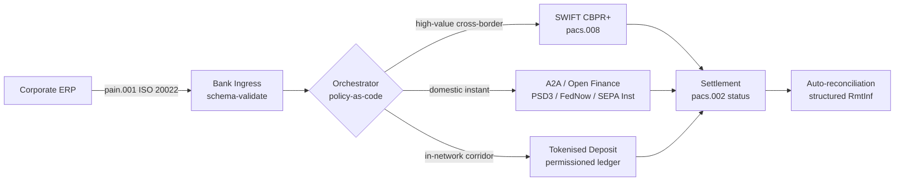

## क्रॉस-बॉर्डर 2026: कॉर्पोरेट ट्रेझरीमध्ये ISO 20022, ओपन फायनान्स आणि टोकनाइज्ड डिपॉझिट्स

> **कार्यकारी सारांश.** 2026 मधील क्रॉस-बॉर्डर कॉर्पोरेट ट्रेझरी ही नातेसंबंध-व्यवस्थापनाची समस्या असण्याआधी एक मल्टी-रेल अभियांत्रिकी समस्या आहे. PSD3 आणि Financial Data Access (FiDA) नियमन ओपन-बँकिंगची परिमिती कॉर्पोरेट ट्रेझरी डेटापर्यंत रुंदावतात; नोव्हेंबर 2026 चे SWIFT MT/MX कट-ओव्हर CBPR+-अनुरूप pacs.008 ला एकमेव व्यवहार्य क्रॉस-बॉर्डर आंतरबँक स्वरूप बनवते; टोकनाइज्ड डिपॉझिट्स आणि नियमित स्टेबलकॉइन रेल परवानगीप्राप्त नेटवर्कच्या आत जवळपास T+0 वेगात होलसेल सेटलमेंटचे अंग सांभाळतात. या चक्रात जिंकणारी CIB ती नाही जी एकच रेल निवडते; ती आहे जी त्यांना बांधणारा ऑर्केस्ट्रेशन थर अभियांत्रिकीने घडवते. हा लेख चार-रेल आर्किटेक्चरमधून फिरतो (PSD3 अंतर्गत A2A, SWIFT CBPR+, बँक-जारी टोकनाइज्ड डिपॉझिट्स, नियमित स्टेबलकॉइन्स) — प्रत्येक रेल काय चांगले करते, क्रेडिट-एक्सपोजरच्या सीमा कुठे पडतात, आणि त्यांच्या वरचा policy-as-code ऑर्केस्ट्रेशन थर काय अंमलात आणला पाहिजे जेणेकरून कॉर्पोरेटला एकच पेमेंट दिसते आणि पर्यवेक्षकाला एकच लेखापरीक्षणयोग्य मार्ग दिसतो.

एक युरोपीय औद्योगिक कॉर्पोरेट बुधवारी सकाळी एका ब्राझिलियन पुरवठादाराला EUR 4.2 दशलक्ष देते. ट्रेझरी वर्कस्टेशन बँक निवडत नाही. ते एक रेल निवडते — रेल्सचा एक क्रम. ग्राहकाभिमुख सूचना PSD3 अंतर्गत एका ओपन फायनान्स पुरवठादारामार्फत राउट केलेल्या A2A pain.001 संदेशावर उतरते. बँक ती एका CIB खासगी नेटवर्कच्या आत टोकनाइज्ड डिपॉझिट्सवर दोन करस्पॉन्डंट अधिकारक्षेत्रांमधून पार करते. लांब शेपटी — टोकनाइज्ड-डिपॉझिट नाते नसलेल्या उप-पुरवठादाराला USD 80,000 चे बीजक निपटवणे — अजूनही SWIFT CBPR+ वर pacs.008 म्हणून प्रवास करते. ग्राहकाला एकच पेमेंट दिसते. आर्किटेक्चरला चार रेल दिसतात. हे सगळे एकत्र टिकून राहण्याचे एकमेव कारण [ISO 20022](/2023-09-29-automating-iso-20022-compliant-payment-file-creation-with-pain001/index.html) आहे.

हेच ते ऑपरेटिंग मॉडेल आहे ज्याचे Mastercard वर्णन करते जेव्हा ती [ओपन बँकिंगकडून ओपन फायनान्सकडील उत्क्रांतीबद्दल](https://www.mastercard.com/us/en/news-and-trends/Insights/2026/open-banking-to-open-finance-the-evolution-of-financial-data.html "Mastercard: open banking to open finance, the evolution of financial data") बोलते — डेटा आणि पेमेंट्स एकाच ऑर्केस्ट्रेशन थरात एकत्रित, जिथे रेल ग्राहकाने नव्हे तर प्रणालीने निवडलेली असते. वरिष्ठ बँकिंग तंत्रज्ञांसाठी रंजक प्रश्न कोणती रेल जिंकते हा नाही. तो आहे ऑर्केस्ट्रेशन थर कसा अभियांत्रिकीने घडवला, नियंत्रित केला आणि पुनर्मिळणी केला जातो हा.

## 01. कार्ड्सकडून A2A कडे — ओपन फायनान्समधील स्थित्यंतर

कार्ड रेल नाहीशी होत नाहीत. त्यांची पुनर्रचना केली जात आहे.

2025 दरम्यान आणि 2026 पर्यंत, [PSD3 आणि Financial Data Access (FiDA) नियमनाने](https://www.consultancy.uk/news/42202/orchestrating-open-banking-for-platform-growth-2026-outlook "Consultancy.uk: orchestrating open banking for platform growth, 2026 outlook") ओपन-बँकिंग बंधन पेमेंट खात्यांपलीकडे पेन्शन, गहाणकर्जे, बचत, विमा आणि कॉर्पोरेट ट्रेझरी डेटापर्यंत वाढवले. कॉर्पोरेट ट्रेझरीवरील परिणाम थेट आहे: CIB संबंध व्यवस्थापक आता कॉर्पोरेटच्या सूचनेवरून एका API कराराद्वारे अनेक बँकांवरचे कॉर्पोरेटचे संपूर्ण लिक्विडिटी चित्र वापरू शकतो.

दोन ऑपरेटर स्पष्टपणे कॉर्पोरेट्स वापरणार असलेला ऑर्केस्ट्रेशन थर उभारत आहेत. Nexi ने आपले अधिग्रहण-क्षेत्र SEPA Instant आणि पॅन-युरोपीय RTGS कॉरिडॉर्सवर A2A सुरुवातीपर्यंत विस्तारले आहे, संपूर्णपणे ISO 20022 नेटिव्ह. Mastercard चा ओपन फायनान्स प्लॅटफॉर्म — Aiia आणि Finicity च्या अधिग्रहणावर आधारलेला — त्याखाली डेटा-एकत्रीकरण आणि संमती थर पुरवतो, ज्यात पेमेंट सुरुवात त्याच API इस्टेटमधून समोर येते जी पूर्वी कार्ड ऑथोरायझेशन सांभाळत असे.

हे स्थित्यंतर तीन कारणांसाठी महत्त्वाचे आहे:

1. **युनिट अर्थशास्त्र.** PSD3 अंतर्गत सुरू केलेले A2A पेमेंटमधून इंटरचेंज काढून टाकते. मोठ्या-रकमेच्या B2B प्रवाहांसाठी बचत लक्षणीय आहे; छोट्या-रकमेच्या ग्राहक प्रवाहांसाठी व्यापाऱ्याचा खर्च-रचना कोसळते.
2. **डेटा गुणवत्ता.** ISO 20022 अंतर्गत A2A संरचित रेमिटन्स डेटा वाहून नेते जे कार्ड्स कधीच करू शकले नाहीत. 95% पेक्षा जास्त स्वयं-पुनर्मिळणी दर आता किमान अपेक्षा आहेत.
3. **जोखीम मॉडेल.** A2A हे क्रेडिट ट्रान्सफर आहे, कार्ड ऑथोरायझेशन नाही. फसवणुकीचे पृष्ठभाग, चार्जबॅक मॉडेल आणि वाद मॉडेल हे सर्व वेगळे आहेत. कॉर्पोरेट ट्रेझरी संघांनी हे समजून घेणे आवश्यक आहे की ग्राहक-संरक्षण थर वारशाने मिळालेला नाही, तर तो नव्याने बांधला जात आहे.

2026 मध्ये मल्टी-रेल प्रस्ताव विकणारी CIB ऑर्केस्ट्रेशन विकते — प्रवेश नव्हे. प्रवेश आता नियमित आहे.

## 02. रेल्सवर समान भाषा म्हणून ISO 20022

मल्टी-रेल मुळात व्यवहार्य होण्याचे कारण म्हणजे संदेश स्वरूप आता सर्व रेल्सवर सुसंगत आहे.

BIS Committee on Payments and Market Infrastructures (CPMI) ने आपल्या [क्रॉस-बॉर्डर पेमेंट्स सुधारण्यासाठी ISO 20022 सुसंगतीकरण आवश्यकतांमध्ये](https://www.bis.org/cpmi/publ/d230.pdf "BIS CPMI: ISO 20022 harmonisation requirements for enhancing cross-border payments") आर्किटेक्चरल युक्तिवाद स्पष्ट केला. नोव्हेंबर 2025 चे CBPR+ कडे कट-ओव्हर क्रॉस-बॉर्डर आंतरबँक संदेशनासाठी MT103 / MT202 युग बंद केले. त्या क्षणापासून, प्रत्येक प्रमुख रेल — SWIFT, FedNow, SEPA Instant, RTP आणि आशिया व लॅटिन अमेरिकेतील प्रमुख इन्स्टंट पेमेंट प्रणाली — तेच pacs.008 / pacs.009 / pain.001 व्याकरण बोलते.

कॉर्पोरेट ट्रेझरीसाठी व्यावहारिक परिणाम:

- **राउटिंग डेटा-चालित होते.** ट्रेझरी वर्कस्टेशन एक pain.001 एकदा वाचू शकते आणि संदेश पुन्हा-मॅप न करता कॉरिडॉर, रकमेचा आकार, कट-ऑफ आणि प्रतिपक्ष नात्यावर आधारित प्रति-पेमेंट रेल ठरवू शकते.
- **रेमिटन्स डेटा हॉपमधून टिकून राहतो.** संरचित रेमिटन्स फील्ड्स (`<RmtInf><Strd>`) करस्पॉन्डंट टप्प्यांमधून छाटणीशिवाय पार जातात. डेटा आता रेल सीमेवर हरवत नसल्याने स्वयं-पुनर्मिळणी दर वाढतात.
- **निर्बंध तपासणी लेखापरीक्षणयोग्य होते.** LEI संदर्भांसह संरचित `<Dbtr>` / `<Cdtr>` / `<DbtrAgt>` / `<CdtrAgt>` फील्ड्स मुक्त-मजकूर नाव तपासणीची जागा घेतात. हिट दर घटतात. चौकशीच्या रांगा आकुंचतात.

खालील आकृती एका pain.001 चा माग बँकेच्या प्रवेशद्वारातून, policy-as-code ऑर्केस्ट्रेटरमध्ये, आणि कॉरिडॉर व रकमेचा आकार जी मागतील त्या रेलकडे बाहेर काढते — एक संदेश, अनेक रेल, पुन्हा-मॅपिंगशिवाय.

या सुसंगततेची किंमत म्हणजे अभियांत्रिकी शिस्त. ISO 20022 उदार आहे. दोन बँका पूर्णपणे CBPR+ अनुरूप असू शकतात आणि तरीही फील्ड वापर, अक्षरसंच आणि रेमिटन्स-डेटा रचनेत भिन्न असणारे pacs.008 संदेश तयार करू शकतात. 2026 मध्ये क्रॉस-बॉर्डरवर जिंकणारी CIB मानकाने आवश्यक असलेल्यापेक्षा कठोर संदेश प्रोफाइल अंमलात आणते — आणि सेटलमेंटवर नव्हे, तर पार्सिंगवर नकार देते.

## 03. टोकनाइज्ड डिपॉझिट्स आणि स्थिर रेल्स

होलसेल सेटलमेंटच्या अंगातच रेलची कहाणी रंजक होते.

2026 चे चित्र, जे [ऑटोमेशन, कंटिंजन्सी रेल्स, ISO 20022 आणि स्टेबलकॉइन्सच्या Trade Treasury Payments विश्लेषणात](https://tradetreasurypayments.com/articles/automation-contingency-rails-iso-20022-and-stablecoins-the-2026-trends-reshaping-corporate-finance-and-b2b-payments "Trade Treasury Payments: automation, contingency rails, ISO 20022 and stablecoins, the 2026 trends reshaping corporate finance and B2B payments") चांगल्या प्रकारे टिपले आहे, ते होलसेल सेटलमेंट थराला दोन संरचनात्मकदृष्ट्या भिन्न मॉडेल्समध्ये विभागते.

**बँक-जारी टोकनाइज्ड डिपॉझिट्स.** एक व्यावसायिक बँक परवानगीप्राप्त लेजरवर टोकनाइज्ड दायित्व जारी करते — JPM Coin, HSBC चे Orion-लिंक्ड डिपॉझिट टोकन, प्रमुख युरोपीय CIB समतुल्य. हे टोकन जारी करणाऱ्या बँकेवरील थेट दावा आहे. सेटलमेंट नेटवर्कच्या आत जवळपास T+0 आहे. अनुपालन जारी करणाऱ्या बँकेची जबाबदारी आहे. रेल पूर्णपणे नियमित, पूर्णपणे मागोवायोग्य, आणि जारीकर्त्याने ऑन-बोर्ड केलेल्या सहभागींपुरती मर्यादित आहे.

**एकात्मिक स्टेबलकॉइन रेल्स.** एक नियमित स्टेबलकॉइन — पूर्णपणे राखीव, लेखापरीक्षित, आणि MiCA किंवा समतुल्य प्रादेशिक व्यवस्थेखाली चालणारा — असा कॉरिडॉर सेटल करतो जिथे बँक-जारी टोकनाइज्ड डिपॉझिट्स अजून पोहोचत नाहीत. हे टोकन राखीव निधीवरील दावा आहे, बँक ताळेबंदावरील नाही. अनुपालन जारीकर्ता, ऑन-रँप आणि ऑफ-रँप यांच्यात सामायिक आहे.

ही दोन मॉडेल्स स्पर्धेत नाहीत. ती एकमेकांवर रचलेली आहेत. 2026 मधील CIB क्रॉस-बॉर्डर उत्पादन सहसा इन-नेटवर्क टप्प्यासाठी बँक-जारी टोकनाइज्ड डिपॉझिट्स आणि इन-नेटवर्क रेल जिथे संपते त्या कॉरिडॉरसाठी नियमित स्टेबलकॉइन वापरते. कॉर्पोरेटला एकच ISO 20022 पेमेंट दिसते. त्याखालील सेटलमेंटची कहाणी मल्टी-टोकन आहे.

मंडळ-स्तरीय प्रश्न तोच आहे जो पहिल्या प्रोग्रामेबल-लिक्विडिटी पायलटपासून परिचालन-जोखीम समित्या विचारत आहेत: टोकनवर क्रेडिट एक्सपोजर कोण वाहतो, आणि किती काळ? टोकनाइज्ड डिपॉझिट्स स्वच्छ उत्तर देतात — जारी करणारी बँक, बर्नपर्यंत. एकात्मिक स्टेबलकॉइन रेल्स अधिक सूक्ष्म उत्तर देतात — राखीव निधी, लेखापरीक्षण चक्र आणि विमोचन हमीच्या अधीन. जी ट्रेझरी टीम प्रति रेल प्रति कॉरिडॉर उत्तराचे दस्तऐवजीकरण करत नाही ती आपल्या ताळेबंदावर न मोजलेली क्रेडिट जोखीम वाहत आहे.

## 04. स्वायत्त ट्रेझरी स्टॅक

रेल थराच्या वर ऑर्केस्ट्रेशन थर बसतो. ऑर्केस्ट्रेशन थराच्या वर एजंट थर बसतो.

मी [The Autonomous Treasury Index 2026: Programmable Liquidity and Tokenised Deposits](https://sebastienrousseau.com/2026-06-07-autonomous-treasury-index-programmable-liquidity-tokenised-deposits-2026 "Sebastien Rousseau: The Autonomous Treasury Index 2026") मध्ये आर्किटेक्चर तपशीलवार मांडले आहे. थोडक्यात: 2026 मधील एजेंटिक ट्रेझरी म्हणजे ऑर्केस्ट्रेशन थर, policy-as-code म्हणून व्यक्त, ज्याच्या आत मर्यादित एजंट कार्यान्वित होतात.

स्टॅक असा आहे:

1. **रेल थर.** SWIFT CBPR+, इन्स्टंट A2A, टोकनाइज्ड डिपॉझिट्स, नियमित स्टेबलकॉइन्स. प्रत्येक रेलचे प्रकाशित प्रोफाइल, कट-ऑफ तक्ता, खर्च वक्र आणि सेटलमेंट-अंतिमता मॉडेल असते.
2. **ऑर्केस्ट्रेशन थर.** ISO 20022 आत, ISO 20022 बाहेर. कॉरिडॉर, रक्कम, कट-ऑफ, प्रतिपक्ष नाते आणि धोरणावर आधारित प्रति-पेमेंट रेल निर्णय. धोरण आवृत्तीबद्ध, स्वाक्षरीकृत आणि लेखापरीक्षणयोग्य आहे.
3. **एजंट थर.** मर्यादित ट्रेझरी एजंट टूल-कॉल सीमा, लेखापरीक्षण लॉग आणि किल स्विचसह ऑर्केस्ट्रेशन धोरण कार्यान्वित करतात. एजंट रेल निवडत नाही. धोरण रेल निवडते. एजंट धोरण चालवतो.
4. **पुनर्मिळणी थर.** ISO 20022 pacs.008 / pacs.002 / camt.054 संदेश मूळ pain.001 सूचनेशी पुनर्मिळणी करतात, आणि संरचित रेमिटन्स डेटा मॅन्युअल हस्तक्षेपाशिवाय फेरा पूर्ण करतो.

2026 मध्ये हा स्टॅक विकणारी CIB एकाच वेळी चार गोष्टी विकते — आणि त्यांची किंमत वेगवेगळी ठरवते. तो विकत घेणारा कॉर्पोरेट एका संदेश मानकासह, एका धोरण थरासह, एका पुनर्मिळणी फीडसह रेल्सवरील पर्यायक्षमता विकत घेतो. हेच ते आर्किटेक्चरल स्थित्यंतर आहे. बाकी सर्व अंमलबजावणीचा तपशील आहे.

## FAQ

**"ओपन फायनान्स" म्हणजे फक्त नव्याने ब्रँडेड ओपन बँकिंग आहे का?**
नाही. PSD2 अंतर्गत ओपन बँकिंग पेमेंट खात्यांना व्यापत असे. PSD3 आणि Financial Data Access (FiDA) नियमन डेटा-सामायिकरण बंधन पेन्शन, गहाणकर्जे, बचत, विमा आणि कॉर्पोरेट ट्रेझरी डेटापर्यंत वाढवतात. कॉर्पोरेट-ट्रेझरीवरील परिणाम थेट आहे: CIB संबंध व्यवस्थापक आता कॉर्पोरेटच्या सूचनेवरून एका API कराराद्वारे अनेक बँकांवरचे कॉर्पोरेटचे संपूर्ण लिक्विडिटी चित्र वापरू शकतो, फक्त त्याचा पेमेंट-खाते इतिहास नव्हे.

**ऑर्केस्ट्रेशन थर हा आर्किटेक्चरल केंद्रबिंदू का आहे, रेल का नाही?**
कारण रेल्स आता कमोडिटी बनत आहेत. SWIFT CBPR+ pacs.008, PSD3 अंतर्गत A2A, टोकनाइज्ड डिपॉझिट्स आणि नियमित स्टेबलकॉइन्स हे सर्व संदेश स्तरावर तेच ISO 20022 व्याकरण वाहून नेतात. 2026 मधील CIB ला वेगळे ठरवणारे म्हणजे policy-as-code इंजिन जे कॉरिडॉर, रकमेचा आकार, सेटलमेंट-अंतिमता आवश्यकता आणि प्रतिपक्ष नात्यावर आधारित प्रति-पेमेंट रेल निवडते — आणि जे पर्यवेक्षक विचारेल अशा लेखापरीक्षण टेलिमेट्रीमध्ये निवडीची नोंद करते. त्या इंजिनशिवाय, मल्टी-रेल म्हणजे शासनाशिवाय केवळ पर्यायक्षमता आहे.

**टोकनाइज्ड-डिपॉझिट टप्प्यावर क्रेडिट-एक्सपोजरची सीमा कुठे पडते?**
परवानगीप्राप्त लेजरवरील बँक-जारी टोकनाइज्ड डिपॉझिट्स हा जारी करणाऱ्या बँकेवरील थेट दावा आहे — क्रेडिट एक्सपोजर बर्नला संपते. नियमित स्टेबलकॉइन रेल्स (EU मध्ये MiCA-पर्यवेक्षित, UK मध्ये Bank of England च्या चर्चा-पत्र व्यवस्थेखाली, इतरत्र समांतर) हा राखीव निधीवरील दावा आहे, ज्यात एक्सपोजर खिडकी लेखापरीक्षण चक्र आणि विमोचन-हमी अटींच्या अधीन आहे. जी ट्रेझरी टीम प्रति रेल प्रति कॉरिडॉर उत्तराचे दस्तऐवजीकरण करत नाही ती आपल्या ताळेबंदावर न मोजलेली क्रेडिट जोखीम वाहत आहे.

**या आर्किटेक्चरमध्ये SWIFT चे काय होते?**
SWIFT नाहीसे होत नाही — ते लांब शेपटीला आधार देते. जिथे बँक-जारी टोकनाइज्ड डिपॉझिट्स अजून पोहोचत नाहीत असे कॉरिडॉर (बहुतांश उदयोन्मुख-बाजार उप-पुरवठादार नातेसंबंध, बहुतांश कमी-वारंवारता / कमी-रकमेचा क्रॉस-बॉर्डर प्रवाह), आणि जिथे कॉर्पोरेट किंवा बँकेला CBPR+ करस्पॉन्डंट-बँकिंग लेखापरीक्षण मार्ग हवा असतो असे कॉरिडॉर, SWIFT pacs.008 वर चालू राहतात. 2026 चे आर्किटेक्चर "SWIFT + नव्या रेल्स" आहे, "SWIFT ऐवजी नव्या रेल्स" नाही.

**हा स्टॅक विकत घेताना कॉर्पोरेट काय विकत घेतो?**
रेल्सवरील पर्यायक्षमता, एका संदेश मानकासह (ISO 20022), एका धोरण थरासह (ऑर्केस्ट्रेशन इंजिन), आणि एका पुनर्मिळणी फीडसह (pacs.002 स्थिती + camt.054 पुष्टीकरण + संरचित camt.053 विवरणे). कॉर्पोरेट चार वेगवेगळ्या रेल जोडण्यांसाठी पैसे देत नाही. तो अशा ऑर्केस्ट्रेशन थरासाठी पैसे देतो जो चार रेल्सना परिचालनदृष्ट्या एकसारखे वागवतो — आणि अशा लेखापरीक्षण मार्गासाठी जो त्याला "ते EUR 4.2 दशलक्ष पेमेंट कोणत्या रेलवर गेले, आणि का?" पुढील पर्यवेक्षी विनंतीच्या दुसऱ्या सकाळी उत्तर देऊ देतो.

## निष्कर्ष

2026 मधील क्रॉस-बॉर्डर कॉर्पोरेट ट्रेझरी ही एक मल्टी-रेल अभियांत्रिकी समस्या आहे. ISO 20022 हे व्याकरण आहे जे मल्टी-रेलला हाताळण्याजोगे बनवते. PSD3 आणि FiDA डेटा परिमिती रुंदावतात आणि ओपन फायनान्सला कॉर्पोरेट ट्रेझरी वर्कफ्लोमध्ये आणण्यास भाग पाडतात. टोकनाइज्ड डिपॉझिट्स आणि नियमित स्टेबलकॉइन्स होलसेल सेटलमेंटचे अंग सांभाळतात. SWIFT अजूनही लांब शेपटीला आधार देते.

जिंकणारी CIB ती आहे जी ऑर्केस्ट्रेशन थर उभारते — ती नाही जी एकच रेल निवडून त्यावर संपूर्ण व्यवसाय पणाला लावते. जिंकणारी कॉर्पोरेट ट्रेझरी टीम ती आहे जी प्रति रेल प्रति कॉरिडॉर क्रेडिट एक्सपोजरचे दस्तऐवजीकरण करते, नियामक आवश्यक असलेल्यापेक्षा कठोर ISO 20022 प्रोफाइल अंमलात आणते, आणि रेल निर्णयाला प्रति-पेमेंट निर्णय म्हणून नव्हे तर धोरण म्हणून वागवते.

खरे रंजक काम ऑर्केस्ट्रेशन थरात आहे. ते काळजीपूर्वक बांधा.

## संदर्भ

Bank for International Settlements, Committee on Payments and Market Infrastructures (2023). *Harmonised ISO 20022 data requirements for enhancing cross-border payments* (CPMI Papers No. 230). येथे उपलब्ध: [https://www.bis.org/cpmi/publ/d230.htm](https://www.bis.org/cpmi/publ/d230.htm "BIS CPMI 230 — Harmonised ISO 20022 data requirements")

Bank for International Settlements (2024). *Project Agorá: cross-border payments with tokenised commercial bank deposits and central bank money*. BIS Innovation Hub. येथे उपलब्ध: [https://www.bis.org/about/bisih/topics/fmis/agora.htm](https://www.bis.org/about/bisih/topics/fmis/agora.htm "BIS Project Agorá")

Bank of England (2023). *Regulatory regime for systemic payment systems using stablecoins and related service providers — Discussion Paper*. येथे उपलब्ध: [https://www.bankofengland.co.uk/paper/2023/dp/regulatory-regime-for-systemic-payment-systems-using-stablecoins-and-related-service-providers](https://www.bankofengland.co.uk/paper/2023/dp/regulatory-regime-for-systemic-payment-systems-using-stablecoins-and-related-service-providers "Bank of England — Regulatory regime for stablecoins discussion paper")

European Commission (2023). *Proposal for a Directive on payment services and electronic money services (PSD3)*. येथे उपलब्ध: [https://finance.ec.europa.eu/regulation-and-supervision/financial-services-legislation/implementing-and-delegated-acts/payment-services-directive_en](https://finance.ec.europa.eu/regulation-and-supervision/financial-services-legislation/implementing-and-delegated-acts/payment-services-directive_en "European Commission — Payment Services Directive proposal")

European Parliament and Council (2023). *Regulation (EU) 2023/1114 on markets in crypto-assets (MiCA)*. येथे उपलब्ध: [https://eur-lex.europa.eu/eli/reg/2023/1114/oj](https://eur-lex.europa.eu/eli/reg/2023/1114/oj "Regulation (EU) 2023/1114 — Markets in Crypto-Assets (MiCA)")

Financial Action Task Force (2023). *International standards on combating money laundering and the financing of terrorism — Recommendation 16 on wire transfers*. येथे उपलब्ध: [https://www.fatf-gafi.org/en/publications/Fatfrecommendations/Fatf-recommendations.html](https://www.fatf-gafi.org/en/publications/Fatfrecommendations/Fatf-recommendations.html "FATF Recommendations")

International Organization for Standardization (2020). *ISO 17442 Financial services — Legal entity identifier (LEI)*. येथे उपलब्ध: [https://www.gleif.org/en/about-lei/iso-17442-the-lei-code-structure](https://www.gleif.org/en/about-lei/iso-17442-the-lei-code-structure "ISO 17442 — Legal Entity Identifier")

SWIFT (2024). *Cross-Border Payments and Reporting Plus (CBPR+) usage guidelines*. येथे उपलब्ध: [https://www.swift.com/standards/iso-20022/iso-20022-programme](https://www.swift.com/standards/iso-20022/iso-20022-programme "SWIFT CBPR+ usage guidelines")
