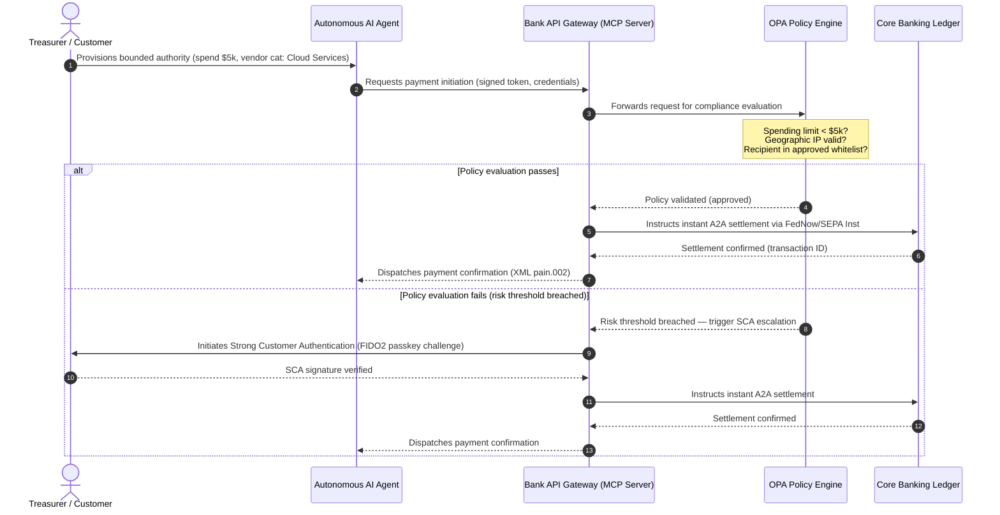

## 2026 चा जागतिक पेमेंट्स दृष्टिकोन: एजंटिक, अदृश्य, रिअल-टाइम जगातील ऑपरेटिंग मॉडेल, जोखीम आणि महसूल

जागतिक व्यवहार बँकांसाठी, 2026-2028 चे चक्र एक संरचनात्मक संधी आहे. आधुनिक पेमेंट पायाभूत सुविधा आता एक प्रशासकीय उपयुक्तता राहिली नाही — ती बँक-दर्जाच्या तंत्रज्ञान धोरणाचा गाभा आहे. G-SIB आणि प्रमुख प्रादेशिक संस्थांमध्ये, तंत्रज्ञान, नियमन आणि ग्राहकांच्या अपेक्षा एका ऑपरेटिंग स्तरात एकवटल्या आहेत.

तीन शक्ती हे चक्र परिभाषित करतात, आणि प्रत्येक थेट एका कार्यकारी-स्तरीय चिंतेशी जोडली जाते.

- **एजंटिक कॉमर्स** — पर्यवेक्षकीय छाननीखालील वितरण वाहिन्या, उत्पादन रचना, दायित्व नेमणूक, आणि मॉडेल रिस्क मॅनेजमेंट.
- **अदृश्य पेमेंट्स** — ग्राहक अनुभव, जिथे बँका आपले लेजर कॉर्पोरेट आणि व्यापारी फ्रंट-एंडमध्ये एम्बेड करण्यात अपयशी ठरतात तिथे मध्यस्थी-निर्मूलनाची जोखीम असते.
- **रिअल-टाइम अंमलबजावणी** — भांडवली गती, ज्याचा तरलता व्यवस्थापन, पत जोखीम, कार्यात्मक लवचिकता आणि फसवणूक प्रतिबंधावर परिणाम होतो.

आर्थिक जोखीम लक्षणीय आहे. फसवणूक वेग आणि सूक्ष्मतेने वाढते; नियामक अंतिम मुदती कठोर आहेत; आणि ज्या बँका आपल्या मुख्य प्रणालींचे सक्रियपणे आधुनिकीकरण करतात त्या भरीव शुल्क-महसुलाच्या संधी उघडतात. निष्क्रियतेची किंमत उलट असते: तात्काळ व्यवहार नकार, कार्यात्मक अडथळे, नियामक दंड, आणि बाजार-हिश्श्याची जलद झीज.

## निश्चिततेची शिडी — काय तारीखबद्ध आहे, काय नियमित आहे, काय अंदाज आहे

या अहवालातील प्रत्येक बाब समान निश्चितता बाळगत नाही. मंडळ-स्तरीय प्रश्न असा आहे की कोणते बदल अंतिम मुदती आहेत, कोणत्या पर्यवेक्षकीय अपेक्षा आहेत, आणि कोणते अजूनही बाजार अंदाज आहेत — कारण उत्तर अर्थसंकल्पीय चर्चेला बदलते.

| श्रेणी | उदाहरणे |
| --- | --- |
| **कठोर अंतिम मुदती** | Swift CBPR+ स्ट्रक्चर्ड-ॲड्रेस बदल (14 नोव्हेंबर 2026); EPC SEPA स्कीम रूलबुक (15 नोव्हेंबर 2026) |
| **नियामक बंधने** | DORA ICT जोखीम + लवचिकता चाचणी + तृतीय-पक्ष देखरेख (EU); PSD3/PSR अंतर्गत SCA सोपवणी; SR 11-7 + PRA SS1/23 अंतर्गत MRM |
| **उच्च-संभाव्य बाजार बदल** | रिअल-टाइम ट्रेझरी API, AI-आधारित फसवणूक प्रतिबंध, API-आधारित तरलता, डीपफेक-चालित बायोमेट्रिक फसवणूक |
| **धोरणात्मक पर्याय** | टोकनाइज्ड ठेवी, Project Agorá अंतर्गत एकीकृत लेजर, एजंटिक-कॉमर्स कॉरिडॉर, सतत FX (Wire 365) |
| **अंदाज** | 2030 पर्यंत एजंटिक-कॉमर्सचे वार्षिक $3-$5 ट्रिलियन प्रवाह (McKinsey आधाररेखा) |

वरच्या दोन ओळींना अनुपालन तथ्ये म्हणून हाताळा जी बँकेने कोणताही फायदा मिळवला किंवा नाही तरी अर्थसंकल्पीय ओळ चालवतात. खालच्या दोन ओळींना धोरणात्मक पर्याय म्हणून हाताळा — दिशेने उच्च-विश्वास, पण जिथे अंमलबजावणीची वेळ नियामकाच्या दिनदर्शिकेतील नोंद नसून मंडळाची निवड आहे.

## जागतिक पेमेंट प्राधिकरणांचा संगम

हा अहवाल चार अधिकृत उद्योग आवाजांच्या 2026 पेमेंट्स आणि कॉमर्स दृष्टिकोनांचे संश्लेषण करतो — [J.P. Morgan Payments](https://www.jpmorgan.com/payments/newsroom/payments-outlook-2026-trends-report-released "J.P. Morgan Payments — दृष्टिकोन 2026"), [Global Payments](https://investors.globalpayments.com/news-events/press-releases/detail/497/global-payments-releases-its-2026-commerce-and-payment "Global Payments — 2026 कॉमर्स आणि पेमेंट ट्रेंड्स अहवाल"), HSBC, आणि The Payments Association — आणि त्यांना [G20 क्रॉस-बॉर्डर पेमेंट्स सुधारणा आराखड्या](https://www.fsb.org/2026/03/fsb-kicks-off-new-implementation-phase-to-enhance-cross-border-payments-through-public-private-partnership/ "FSB — क्रॉस-बॉर्डर पेमेंट्स अंमलबजावणी टप्पा, मार्च 2026")शी त्रिकोणित करतो.

प्रत्येक संस्था परिसंस्थेकडे वेगळ्या बाजार कोनातून पाहते, पण त्यांचे निष्कर्ष तीन अपरिवर्तनीय बाबींवर एकवटतात.

1. **तत्काळ, API-चालित रेल्स ही आधाररेखा आहेत.** क्रॉस-बॉर्डर आणि उच्च-मूल्य प्रवाहांसाठी जुनी बॅच-प्रोसेसिंग मॉडेल्स दुय्यम बनली आहेत; त्या विभागांतील व्यवहार गती नेहमी-चालू, रिअल-टाइम मेसेजिंगने ठरवली जाते.
2. **AI ही धोका आणि संरक्षण दोन्ही आहे.** जनरेटिव्ह साधने आणि डीपफेक व्यवहार फसवणूक वाढवतात, ज्यामुळे रिअल-टाइम, बहु-स्तरीय मशीन-लर्निंग प्रति-संरक्षण आवश्यक बनते.
3. **टोकनायझेशन ही उत्पादन-सज्ज पायाभूत सुविधा आहे.** टोकनाइज्ड वाणिज्यिक दायित्वे आणि घाऊक केंद्रीय बँक डिजिटल चलने ठेवण्यासाठी लेजर एकत्रित होत आहेत.

| अहवाल | प्राथमिक श्रोते | केंद्रबिंदू | मुख्य स्तंभ | बँकेवरील परिणाम |
| --- | --- | --- | --- | --- |
| **J.P. Morgan Payments** | कॉर्पोरेट ट्रेझरर, G-SIBs | रिअल-टाइम तरलता, फसवणूक | API, AI बायोमेट्रिक्स | सतत 365-दिवस निपटाऱ्यासाठी तरलता, FX आणि जोखीम प्रणाली पुनर्रचित करा. |
| **Global Payments** | व्यापारी, ई-कॉमर्स | POS उत्क्रांती, ऑम्निचॅनेल | एजंटिक कॉमर्स, घर्षणरहित चेकआउट | स्वायत्त AI एजंटांसाठी सुरक्षित, API-गेटेड व्यापारी पेमेंट कॉरिडॉर तयार करा. |
| **HSBC Insights** | बहुराष्ट्रीय कॉर्पोरेट्स | ERP एकीकरण (SAP/Oracle), रिअल-टाइम रोकड | Treasury-as-a-Service, रोकड दृश्यमानता | व्यवहारात्मक API संच कमाईत रूपांतरित करा आणि उगमस्थानी रिअल-टाइम रोकड लेजर अहवाल एम्बेड करा. |
| **The Payments Association** | फिनटेक, पेमेंट संस्था | स्टेबलकॉइन्स, टोकनायझेशन, जागतिक नियमन | नियमित डिजिटल मालमत्ता, धोरण अनुपालन | टोकनाइज्ड ठेवींसाठी ताळेबंद तयार करा आणि PSD3/PSR दायित्व संरचनांमधून मार्ग काढा. |

हे चार दृष्टिकोन प्रभावीपणे तो खाजगी-क्षेत्रीय ऑपरेटिंग स्टॅक परिभाषित करतात जो सार्वजनिक-क्षेत्रीय G20 धोरण पायाभूत सुविधांवर चालतो, धोरणात्मक हेतूचे बँकांमधील तरलता, टोकनायझेशन, डेटा आणि फसवणूक नियंत्रणावरील ठोस निर्णयांमध्ये भाषांतर करतो.

## स्तंभ 1 — एजंटिक कॉमर्स आणि अदृश्य पेमेंट्स

एजंटिक कॉमर्स म्हणजे मानव-चालित, क्लिक-टू-बाय चेकआउटपासून स्वायत्त, मॉडेल-चालित व्यवहार आरंभणाकडील संक्रमण. उद्योग अंदाज 2030 पर्यंत स्वायत्त एजंटांद्वारे मध्यस्थी केलेल्या वार्षिक $3-$5 ट्रिलियन कॉमर्सवर एकवटतात — जागतिक पेमेंट खंडाचा एक-अंकी टक्केवारीचा हिस्सा जो कोणीही 'खरेदी' क्लिक न करता अंमलात येतो.

किरकोळ आणि वाणिज्यिक परिसंस्थेत एक संबंधित तफावत आहे. आता ग्राहकांचा स्पष्ट बहुसंख्य वर्ग जवळपास घर्षणरहित पेमेंट्सची अपेक्षा करतो, तरीही निम्म्याहून कमी व्यापाऱ्यांनी वन-क्लिक चेकआउट किंवा API-सुलभ उत्पादन कॅटलॉगला प्राधान्य दिले आहे. AI एजंट मानवी नजरेसाठी रचलेल्या जुन्या बहु-पानी चेकआउट स्क्रीन्समध्ये मार्ग काढू शकत नाहीत; त्यांना संरचित, मशीन-टू-मशीन API हँडशेक हवे असतात.

### बँकेची प्राधान्ये आणि कार्यात्मक परिणाम

- **KYC आणि AML मालकी.** बँकांनी एजंटिक व्यवहार साखळीत अनुपालन बंधन कोण बाळगते हे परिभाषित केले पाहिजे. जर ग्राहकाचा वैयक्तिक AI एजंट व्यापाऱ्याच्या एजंटिक चेकआउटद्वारे व्यवहार आरंभतो, तर बँकेने हे पडताळले पाहिजे की आरंभित सोपवलेला अधिकार प्राथमिक खातेधारकाशी क्रिप्टोग्राफिकदृष्ट्या बांधलेला आहे.
- **दायित्व आणि चार्जबॅक पुनर्रचना.** कार्ड योजना आणि A2A रेल्स मानवी प्राधिकरणाभोवती रचली गेली होती. जेव्हा एखादा AI एजंट चुकीची खरेदी करतो — उदाहरणार्थ, डेटा-पार्सिंग त्रुटीमुळे चुकीचा औद्योगिक साठा खरेदी करतो — तेव्हा बँकांनी ग्राहक, एजंट पुरवठादार आणि व्यापारी यांच्यात दायित्व स्पष्टपणे वाटप केले पाहिजे.
- **एजंटिक प्रवाहांचे जोखीम-श्रेणीकरण.** पेमेंट राउटिंग इंजिनांनी एजंटिक पेमेंट्सचे गतिशीलपणे जोखीम-श्रेणीकरण केले पाहिजे, स्थिर निपटारा नोंद अस्तित्वात येईपर्यंत मानव-अनारंभित व्यवहारांवर उच्च राखीव आवश्यकता किंवा इंटरचेंज दर लागू करावेत.

### सीमित कृती आणि सीमित अधिकार

"असीमित कृती" कमी करण्यासाठी — सॉफ्टवेअर बिघाडामुळे अनंत पुनरावर्ती खरेदी लूप चालवणारा एंटरप्राइझ प्रोक्युरमेंट एजंट — बँकांनी **सीमित-अधिकार API गेट्स** तैनात केले पाहिजेत. हे गेट्स तीन आयामांमध्ये धोरण-स्तरीय मर्यादा लागू करतात.

1. **स्तरीय आर्थिक मर्यादा** — एजंट खर्च व्यवहार आकार, दैनिक संचयी मूल्य, आणि व्यापारी श्रेणीनुसार मर्यादित.
2. **संदर्भ-जागरूक सुरक्षारक्षक** — लेजर निधी मुक्त करण्यापूर्वी दुय्यम संकेतांचे (दिवसाची वेळ, IP भूस्थान, व्यवहार वारंवारता) मूल्यमापन.
3. **मानव-इन-द-लूप वाढ** — जेव्हा व्यवहार जोखीम मर्यादांपेक्षा अधिक होतो तेव्हा PSD3 / PSR अंतर्गत Strong Customer Authentication (SCA) द्वारे अनिवार्य मानवी प्राधिकरण चालना.

खालील Mermaid अनुक्रम अनेक बँका सीमित-अधिकार एजंटिक पेमेंट प्रवाह म्हणून ओळखतील ती लक्ष्य वास्तुकला दाखवतो.

### Model Context Protocol (MCP)

स्थानिकीकृत AI मॉडेल्सना बँक-प्रशासित अंमलबजावणी स्तरांशी जोडण्यासाठी, उद्योग [Model Context Protocol (MCP)](https://modelcontextprotocol.io "Model Context Protocol — LLM टूल एकीकरणासाठी खुला मानक") भोवती मानकीकरण करत आहे — एक खुला प्रोटोकॉल जो LLMs ना मुख्य प्रणालींमध्ये थेट प्रवेशाशिवाय स्पष्टपणे व्याप्त, लेखापरीक्षणयोग्य साधने आणि API कॉल करू देतो.

बँकिंग API (पेमेंट आरंभ, शिल्लक चौकशी, पक्ष पडताळणी) एका MCP सर्व्हरमध्ये गुंडाळल्याने LLMs डेटाबेस तक्ते आणि सिस्टम-रूट नियंत्रणांपासून दूर राहतात. मॉडेल केवळ संरचित, लेखापरीक्षित, दर-मर्यादित एंडपॉइंट्सद्वारेच लेजरशी संवाद साधते — सुरक्षा मॉडेलमध्ये दडलेली नसून एजंटिक टूल अंमलबजावणीच्या सीमेवर लागू केली जाते.

## स्तंभ 2 — ट्रेझरी परिवर्तन आणि तरलतेची पुनर्कल्पना

2026 मधील व्यवहार बँकिंगची गती दिवसअखेरच्या बॅच प्रोसेसिंगपासून नेहमी-चालू, रिअल-टाइम ट्रेझरी कार्यांकडील बदलाने ठरते. बहुराष्ट्रीय कॉर्पोरेट्स आता अडकलेली रोकड सहन करत नाहीत — निपटारा प्रणाली बंद असल्यामुळे शनिवार-रविवार किंवा सुट्ट्यांमध्ये स्थानिक खात्यांत निष्क्रिय पडून राहणारी तरलता.

### रिअल-टाइम तरलतेसाठी आर्थिक कारण

J.P. Morgan आणि HSBC दोन्ही अहवाल देतात की प्रगत रिअल-टाइम रोकड आणि डेटा क्षमता असलेले कॉर्पोरेट्स महसूल वाढ आणि भांडवली कार्यक्षमतेत समकक्षांना मागे टाकण्याची लक्षणीय अधिक शक्यता बाळगतात, मुख्यतः अडकलेली तरलता कमी करून आणि कार्यशील-भांडवल चक्रे अनुकूलित करून.

ते मूल्य मिळवण्यासाठी, बँका **Treasury-as-a-Service (TaaS) API उत्पादने** पुरवतात जी कॉर्पोरेट ERPs (SAP, Oracle) ना थेट बँकेच्या लेजरशी जोडतात.

- **रिअल-टाइम शिल्लक API** `camt.052` स्कीमा वापरून — फाइल-ट्रान्सफर प्रोटोकॉलच्या जागी तत्काळ, घटना-चालित रोकड-स्थिती अहवाल.
- **बल्क पेमेंट आरंभ API** `pain.001` वापरून — ERP लेजरमधून विक्रेता पेमेंट बॅचचे थेट, स्ट्रेट-थ्रू अंमलबजावणी.
- **सतत FX API** — ट्रेझरी इंजिने क्रॉस-बॉर्डर निपटाऱ्यासाठी रिअल-टाइम, अल्गोरिदमिक परकीय-विनिमय दर लॉक करतात, रात्रीच्या बाजार-अंतराची जोखीम दूर करतात.
- **व्हर्च्युअल खाते API** — कॉर्पोरेट्स स्वयंचलित प्राप्ती जुळवणी आणि लेजर विभाजनासाठी हजारो उप-खाती गतिशीलपणे तयार आणि बंद करतात.

### कार्यात्मक लवचिकता आणि DORA

नेहमी-चालू तरलता पुरवणे बँकेचे जोखीम प्रोफाइल बदलते. प्रणालीगतदृष्ट्या महत्त्वाच्या रिअल-टाइम ट्रेझरी API साठी, **फाइव्ह-नाईन्स (99.999 %) उपलब्धता** बँका पर्यवेक्षकांना DORA-दर्जाची लवचिकता दाखवण्यासाठी स्वतःसाठी ठेवत असलेले अंतर्गत अभियांत्रिकी लक्ष्य बनत आहे. DORA स्वतः एक सार्वत्रिक फाइव्ह-नाईन्स आकडा विहित करत नाही; तो ICT जोखीम व्यवस्थापन, घटना अहवाल, लवचिकता चाचणी, तृतीय-पक्ष जोखीम, आणि गंभीर ICT पुरवठादारांची देखरेख यांचा समावेश करतो — पण सततच्या भारामध्ये अधूनमधून खंडित होणारे ट्रेझरी-API प्लॅटफॉर्म आपल्या गंभीर-पण-संभाव्य परिस्थिती सूचीचे विश्वासार्हपणे रक्षण करू शकणार नाही.

[Digital Operational Resilience Act (DORA)](https://eur-lex.europa.eu/legal-content/EN/TXT/?uri=CELEX%3A32022R2554 "Regulation (EU) 2022/2554 — Digital Operational Resilience Act") अंतर्गत, ते एक IT KPI नाही — ती एक कठोर नियामक आवश्यकता आहे. नियामक बँकांकडून हे सिद्ध करण्याची अपेक्षा करतात की रिअल-टाइम ट्रेझरी API पृष्ठभाग आणि लेजर डेटाबेस गंभीर-पण-संभाव्य सायबरहल्ले, नेटवर्क खंडित होणे, आणि हायपरस्केलर व्यत्यय गंभीर पेमेंट्स खंडित न करता किंवा प्रणालीगत तरलता तडजोड न करता शोषून घेऊ शकतात. यासाठी भू-अतिरिक्त, ॲक्टिव्ह-ॲक्टिव्ह मल्टी-क्लाउड डेटाबेस वास्तुकला, रिअल-टाइम धोका-शोध स्तर, आणि स्वयंचलित फेलओव्हर आवश्यक आहे — जे केवळ लेखापरीक्षण दस्तऐवजातच नव्हे तर बदल-खर्चाच्या ओळीत दिसते.

### सतत FX आणि क्रॉस-बॉर्डर नवकल्पना

रिअल-टाइम ट्रेझरी एका-चलन सीमेत राहू शकत नाही. G-SIBs सतत FX पायाभूत सुविधा तैनात करत आहेत — J.P. Morgan चे [Wire 365](https://www.jpmorgan.com/insights/payments/fx-cross-border/wire-365-global-clearing "J.P. Morgan — Wire 365 जागतिक क्लिअरिंगची पुनर्रचना") प्लॅटफॉर्म पारंपरिक केंद्रीय-बँक RTGS वेळेच्या पलीकडे, वर्षातील कोणत्याही दिवशी क्रॉस-बॉर्डर पेमेंट्स आणि FX रूपांतरणे प्रक्रिया करते. तो स्तर स्तंभ 3 मध्ये चर्चा केलेल्या टोकनाइज्ड-ठेवी आणि एकीकृत-लेजर प्रणालींशी थेट जोडला जातो.

## स्तंभ 3 — टोकनाइज्ड ठेवी आणि एकीकृत लेजर

टोकनायझेशन विलग प्रूफ-ऑफ-कॉन्सेप्ट पायलटांपासून पुढे जाऊन प्रमाणित, बँक-दर्जाच्या चलन पायाभूत सुविधेत प्रगत झाले आहे. लक्ष खाजगी स्टेबलकॉइन्स आणि सट्टेबाज क्रिप्टोमालमत्तांपासून **टोकनाइज्ड वाणिज्यिक बँक ठेवी** आणि प्रोग्रामेबल एकीकृत लेजरवर चालणाऱ्या **घाऊक केंद्रीय बँक डिजिटल चलनांकडे (wCBDCs)** सरकले आहे.

संदर्भ चौकट [Project Agorá](https://www.bis.org/about/bisih/topics/fmis/agora.htm "BIS Project Agorá — घाऊक क्रॉस-बॉर्डर पेमेंट्सचे टोकनायझेशन") आहे — BIS आणि IIF यांनी आयोजित केलेले एक प्रमुख सार्वजनिक-खाजगी सहकार्य, ज्यात **आठ केंद्रीय बँका** आणि 40 हून अधिक खाजगी वित्तीय संस्था सहभागी आहेत (BIS Agorá पानानुसार, 27 मे 2026 रोजी अद्ययावत). हा प्रकल्प टोकनाइज्ड वाणिज्यिक बँक ठेवी एका सामायिक प्रोग्रामेबल लेजरवर टोकनाइज्ड घाऊक CBDCs शी कशा एकत्रित होतात याचा शोध घेतो, जेणेकरून क्रॉस-बॉर्डर निपटारा घर्षण दूर करता येईल, अनुपालन तपासण्या समन्वयित करता येतील, आणि 24/7 अणुबद्ध अंतिमता सक्षम करता येईल.

### पाच-टप्प्यांचा टोकनायझेशन प्रवास

G-SIBs आणि प्रमुख प्रादेशिक बँकांसाठी, टोकनायझेशन हा अंतर्गत अनुकूलनापासून खुल्या-बाजार परस्पर-कार्यक्षमतेकडील टप्प्याटप्प्याचा प्रवास आहे.

1. **अंतर्गत ट्रेझरी तरलता** — बँकेच्या स्वतःच्या शाखांमध्ये तत्काळ, 24/7 क्रॉस-बॉर्डर हस्तांतरण आणि नेटिंग सक्षम करण्यासाठी अंतर्गत कॉर्पोरेट रोकड शिल्लकांचे टोकनायझेशन (उदा. JPM Coin किंवा समकक्ष खाजगी बँक लेजर).
2. **सीमित बहु-बँक कॉरिडॉर** — भिन्न संस्थांमध्ये आंतरबँक निपटारा आणि सामायिक लेजर स्थिती तपासण्यासाठी बंद, नियमित संघ (Project Agorá सँडबॉक्स).
3. **सतत प्रोग्रामेबल FX** — एकीकृत लेजरवरील स्मार्ट कॉन्ट्रॅक्ट्स तत्काळ Payment-versus-Payment (PvP) FX अंमलात आणतात, वेळक्षेत्रांमधील निपटारा जोखीम दूर करतात.
4. **टोकनाइज्ड वास्तविक-जगातील मालमत्ता (RWAs)** — टोकनाइज्ड रोकड घटक तत्काळ Delivery-versus-Payment (DvP) अंतिमतेसाठी टोकनाइज्ड रोखे, कर्ज, किंवा व्यापार लेजरशी एकत्रित होतो, भांडवली लॉक-अप दिवसांवरून मिलिसेकंदांपर्यंत कमी करतो.
5. **नियमित सार्वजनिक/संकरित परस्पर-कार्यक्षमता** — सुरक्षित गेटवे रॅपर्स संस्थात्मक तरलतेला खुल्या सार्वजनिक नेटवर्कशी सुरक्षितपणे संवाद साधू देतात.

### प्रुडेन्शियल आणि ताळेबंद परिणाम

टोकनाइज्ड रोकड प्रुडेन्शियल चौकटींमधून काळजीपूर्वक मार्ग काढला पाहिजे. पर्यवेक्षक भर देतात की टोकनाइज्ड ठेव पारंपरिक वाणिज्यिक बँक ठेवीशी आर्थिकदृष्ट्या समकक्ष असली पाहिजे — म्हणजे बँकेच्या ताळेबंदावरील एक असुरक्षित दायित्व, त्याच ठेव-विमा संरक्षणासह.

कार्यात्मकदृष्ट्या, टोकनाइज्ड ठेवी अशा जोखमी आणतात ज्या शास्त्रीय तरलता ताण मॉडेल्स अनुकरण करण्यासाठी बांधली गेली नव्हती. स्मार्ट कॉन्ट्रॅक्ट्स अशा वेग आणि खंडांवर प्रोग्रामेबल पैसे काढणे अंमलात आणतात जे जुनी गृहितके पकडत नाहीत. Basel III अंतर्गत, बँकांनी हे सुनिश्चित केले पाहिजे की जोखीम इंजिन प्रोग्रामेबल रोकड रन-ऑफचे मॉडेल बनवू शकते आणि टोकनाइज्ड लेजर दैनिक तरलता चक्रातून जुन्या RTGS प्रणालींशी स्वच्छपणे परस्पर-कार्य करते.

### स्टेबलकॉइन्स विरुद्ध टोकनाइज्ड ठेवी — एक सूक्ष्म भूमिका

खाजगी पूर्ण-राखीव स्टेबलकॉइन्स (USDC, इ.) किरकोळ क्रॉस-बॉर्डर पैसे पाठवणे आणि विकेंद्रित कॉमर्समध्ये बाजार-हिस्सा मिळवत राहतात, पण त्यांच्याकडे वाणिज्यिक बँकिंग प्रणालीची पत-निर्मिती क्षमता आणि निपटारा अंतिमता नाही.

किरकोळ रेल्सवर स्पर्धा करण्याऐवजी, व्यवहार बँका कस्टडी स्थापन करत आहेत, आपले स्वतःचे नियमित टोकनाइज्ड दायित्व साधने जारी करत आहेत, आणि सुरक्षित ऑन-/ऑफ-रँप गेटवे तयार करत आहेत. कॉर्पोरेट ग्राहकांना नियमित परिघात भांडवल ठेवत असतानाच प्रोग्रामिंग लवचिकता मिळते.

### टोकनाइज्ड पैशाबद्दल मंडळाने विचारायचे प्रश्न

- **एकीकृत लेजर सहभाग.** Project Agorá सारख्या घाऊक सार्वजनिक-खाजगी एकीकृत-लेजर उपक्रमांत सहभागी होण्यासाठी आपला सक्रिय धोरणात्मक आराखडा काय आहे?
- **ताळेबंद आणि जोखीम मॉडेलिंग.** स्मार्ट-कॉन्ट्रॅक्ट-चालित टोकन रन-ऑफच्या वेगाचा हिशेब घेण्यासाठी आपल्या जोखीम इंजिने आणि भांडवल-पर्याप्तता चौकटींनी ताण-चाचणी अद्ययावत केली आहे का?
- **प्रथम-चालक ग्राहक विभाग.** आपल्या कोणत्या कॉर्पोरेट-ट्रेझरी आणि वाणिज्यिक-बँकिंग ग्राहक विभागांना प्रोग्रामेबल, टोकनाइज्ड DvP/PvP निपटाऱ्याचा तात्काळ फायदा होईल?

## स्तंभ 4 — संरचित डेटा आणि फसवणूक प्रतिबंध

2026 मधील पायाभूत सुविधा अनुपालनावर **14/15 नोव्हेंबर 2026 च्या स्ट्रक्चर्ड-ॲड्रेस बदलाचे** वर्चस्व आहे — दोन शेजारच्या अंतिम मुदती ज्या मिळून क्रॉस-बॉर्डर आणि EU-अंतर्गत रेल्सवरील असंरचित-पत्ता मार्ग बंद करतात. [SWIFT Standards Release (SR) 2026](https://www.swift.com/standards/iso-20022/removal-unstructured-address "SWIFT — असंरचित पत्ता काढून टाकणे, नोव्हेंबर 2026") अंतर्गत, CBPR+ **14 नोव्हेंबर 2026** पासून पूर्णपणे असंरचित `<AdrLine>` ब्लॉक स्वीकारणे थांबवते. 2025 च्या EPC SEPA स्कीम रूलबुक अंतर्गत, असंरचित पत्ता स्वरूप केवळ **15 नोव्हेंबर 2026** पर्यंत परवानगीयोग्य आहे. बदलानंतर, जिथे संरचित घटक अपेक्षित आहेत तिथे असंरचित पत्ता वाहून नेणारा कोणताही क्रॉस-बॉर्डर किंवा देशांतर्गत संदेश नेटवर्कद्वारे विलंबित किंवा नाकारला जाईल.

बहुतांश संस्थांना तारीख माहीत आहे. अनेक जण याला इंटरफेस स्तरावरील एक वरवरचा मॅपिंग सराव समजतात. वास्तव एक अधिक खोल डेटा-गुणवत्ता आणि डेटा-प्रशासन आव्हान आहे. विनाशकारी नकार दर टाळण्यासाठी, पेमेंट कार्यांना एक स्पष्ट क्रॉस-फंक्शनल प्रशासन चौकट आवश्यक आहे.

- **उत्पादन आणि कार्ये.** उगमस्थानी डेटा संकलन. ग्राहकाभिमुख डिजिटल पोर्टल, ऑनबोर्डिंग इंटरफेस, आणि कॉर्पोरेट ERP इनपुट फील्ड्सनी पेमेंट आरंभाच्या ठिकाणी संरचित पत्ता फील्ड्स (`<StrtNm>`, `<PstCd>`, `<TwnNm>`, `<Ctry>`) लागू केले पाहिजेत.
- **तंत्रज्ञान.** पार्सिंग, मॅपिंग, स्कीमा पडताळणी. पडताळणी इंजिने जुन्या फाइल्स SWIFT इंटरफेसवर पोहोचण्यापूर्वी अडवतात. स्थानिक-तैनात मशीन-लर्निंग मॉडेल्स जुने असंरचित पत्ता ब्लॉक `<PstlAdr>` अंतर्गत XML-अनुरूप टॅगमध्ये पार्स करतात.
- **अनुपालन आणि जोखीम.** निर्बंध तपासणी, व्यवहार देखरेख, आणि AML तर्क संरचित XML फील्ड्स आत्मसात करण्यासाठी अद्ययावत — खोट्या-सकारात्मक दर आणि मॅन्युअल तपासण्या कमी करते.

### संरचित डेटाचे व्यावसायिक कारण

अनुपालन खर्च म्हणून हाताळल्यास, संरचित-डेटा कार्यक्रम महाग आहे. महसूल सक्षमकर्ता म्हणून हाताळल्यास, तो स्वतःची किंमत वसूल करतो.

1. **प्रगत पत निर्णयन.** संरचित बीजक, पैसे-पाठवणी, आणि अंतिम-कर्जदार डेटा बँकांना कॉर्पोरेट ग्राहकांसाठी स्वयंचलित, अचूक कार्यशील-भांडवल वित्तपुरवठा आणि पुरवठा-साखळी बीजक-फॅक्टरिंग कार्यक्रम तयार करू देतो.
2. **स्वयंचलित प्राप्ती जुळवणी.** संरचित पक्ष आणि बीजक ओळखकर्ते उघड केल्याने प्रीमियम रोकड-समेट आणि व्हर्च्युअल-खाते पूलिंग उत्पादनांना समर्थन मिळते, नवीन व्यवहार-शुल्क महसूल निर्माण होतो.
3. **कमाईयोग्य व्यवहार विश्लेषण.** बँका सूक्ष्म रिअल-टाइम तरलता आणि खरेदी-नमुना विश्लेषण डॅशबोर्ड पॅकेज करून कॉर्पोरेट CFO आणि ट्रेझररना विकतात.

### स्तरीय AI फसवणूक प्रतिबंध

व्यवहार गती रिअल-टाइमकडे वेगावताना, फसवणूक तंत्रे वाढली आहेत. [Entrust च्या 2026 Identity Fraud Report](https://www.entrust.com/resources/reports/identity-fraud-report "Entrust 2026 Identity Fraud Report") नुसार डीपफेक **प्रत्येक पाच बायोमेट्रिक फसवणूक प्रयत्नांपैकी एका**त आहेत; आधीच्या Entrust विश्लेषणाने डीपफेक विशेषतः **व्हिडिओ बायोमेट्रिक फसवणूक प्रयत्नांच्या 40 %** मध्ये असल्याचे मांडले होते. कोणत्याही मांडणीत, संश्लेषित माध्यम आता ऑनबोर्डिंग आणि पेमेंट प्रवाहांमध्ये आवाज आणि चेहरा-ओळख नियंत्रणे पराभूत करण्यासाठी एक महत्त्वपूर्ण वाहिनी आहे.

संरक्षण हे एक **तीन-स्तरीय AI फसवणूक मॉडेल** आहे.

1. **ओळख स्तर.** पेमेंट प्रवेश सुरक्षित करण्यासाठी बायोमेट्रिकदृष्ट्या पडताळलेल्या [FIDO2](https://fidoalliance.org/fido2/ "FIDO Alliance — FIDO2 विनिर्देश") passkeys, क्रिप्टोग्राफिकदृष्ट्या स्वाक्षरित हार्डवेअर डिव्हाइस-बाइंडिंग, आणि विकेंद्रित डिजिटल ID वॉलेट.
2. **वर्तणूक स्तर.** स्वयंचलित बॉट अंमलबजावणी किंवा सत्र-अपहरण प्रयत्न शोधण्यासाठी सतत वर्तणूक बायोमेट्रिक्स — सत्र नेव्हिगेशन गती, टायपिंग लय, डिव्हाइस अभिमुखता.
3. **व्यवहार स्तर.** [ISO 20022](/2023-09-29-automating-iso-20022-compliant-payment-file-creation-with-pain001/index.html) च्या संरचित फील्ड्स रिअल-टाइम मशीन-लर्निंग जोखीम इंजिनांना पोसतात, व्यवहार मेटाडेटाचा सामायिक नेटवर्क-स्तरीय संघ बुद्धिमत्तेशी संदर्भ जुळवून आरंभाच्या मिलिसेकंदांत संशयास्पद व्यवहार ओळखतात.

पर्यवेक्षकांचे समाधान करण्यासाठी, व्यवहार-स्तरीय AI मॉडेल्स कठोर **स्पष्टीकरणक्षमता मापदंड** समाविष्ट करतात आणि एका समर्पित Model Risk Management (MRM) कार्यक्रमाखाली चालतात. नियामक बँकांकडून हे स्पष्ट करण्याची अपेक्षा करतात की कोणत्या विशिष्ट डेटा बिंदू आणि अल्गोरिदमिक तर्काने स्वयंचलित अडवणूक किंवा फसवणूक सतर्कता चालवली, [US Federal Reserve SR 11-7](https://www.federalreserve.gov/frrs/guidance/supervisory-guidance-on-model-risk-management.htm "US Federal Reserve — Model Risk Management वरील पर्यवेक्षकीय मार्गदर्शन, SR 11-7") आणि Bank of England च्या [PRA SS1/23](https://www.bankofengland.co.uk/prudential-regulation/publication/2023/may/model-risk-management-principles-for-banks-ss "Bank of England PRA SS1/23 — बँकांसाठी Model Risk Management तत्त्वे") शी सुसंगत.

## 2026-2028 मंडळ अजेंडा

चार स्तंभांवर अंमलबजावणी करण्यासाठी, G-SIB आणि प्रादेशिक बँक व्यवस्थापन मंडळांनी कार्यात्मक आणि तंत्रज्ञान गुंतवणूक एका स्पष्ट तीन-क्षितिज आराखड्यानुसार संघटित केली पाहिजे.

### क्षितिज 1 — तात्काळ अनुपालन आणि गाभा-दृढीकरण (0-12 महिने)

- **केंद्रबिंदू.** ISO 20022 डेटा गुणवत्ता मानकीकृत करा आणि मूलभूत रिअल-टाइम व्यवहार मार्ग सुरक्षित करा.
- **यश निर्देशक (KPI).** 14/15 नोव्हेंबर 2026 च्या बदलानंतर SWIFT आणि SEPA वर शून्य असंरचित-पत्ता नकार.
- **कार्यकारी मालक.** मुख्य कार्यकारी अधिकारी (COO) / पेमेंट कार्ये प्रमुख.
- **वितरण प्रकार.** पश्चात्ताप-रहित हालचाल. गाभा डेटाबेस स्कीमा अद्यतने आणि SWIFT SR 2026 पडताळणी इंजिन.

### क्षितिज 2 — स्वयंचलन आणि एजंटिक सुरक्षारक्षक (12-24 महिने)

- **केंद्रबिंदू.** सीमित एजंटिक API गेट्स आणि सतत फसवणूक-प्रतिबंध वास्तुकला.
- **यश निर्देशक (KPI).** 100 % मशीन-टू-मशीन आणि AI-आरंभित API व्यवहार FIDO2 हार्डवेअर बाइंडिंग आणि सीमित-अधिकार धोरण इंजिनांद्वारे पडताळलेले.
- **कार्यकारी मालक.** मुख्य माहिती अधिकारी (CIO) / मुख्य जोखीम अधिकारी (CRO).
- **वितरण प्रकार.** पश्चात्ताप-रहित हालचाल (फसवणूक प्रतिबंध) अधिक धोरणात्मक पर्याय (एजंटिक कॉमर्स). MCP अंमलबजावणी आणि तीन-स्तरीय फसवणूक AI.

### क्षितिज 3 — प्लॅटफॉर्म टोकनायझेशन आणि एकीकृत लेजर (24-36 महिने)

- **केंद्रबिंदू.** ट्रेझरी मालमत्ता टोकनाइज्ड ठेवींमध्ये संक्रमित करा आणि सामायिक क्रॉस-बॉर्डर लेजरांत सहभागी व्हा.
- **यश निर्देशक (KPI).** किमान 15 % उच्च-मूल्य कॉर्पोरेट ट्रेझरी निपटारा खंड मूलतः टोकनाइज्ड ठेव साधने किंवा एकीकृत-लेजर व्यवस्थेद्वारे प्रक्रिया केला (उदा. Project Agorá कॉरिडॉर).
- **कार्यकारी मालक.** समूह ट्रेझरर / व्यवहार बँकिंग प्रमुख.
- **वितरण प्रकार.** धोरणात्मक पर्याय. प्रोग्रामेबल लेजर पायाभूत सुविधा, स्मार्ट-कॉन्ट्रॅक्ट तरलता नियम, DvP/PvP निपटारा अडॅप्टर्स.

## सोमवारी सकाळी काय करावे — सहा-बाबींची बँक चेकलिस्ट

तीन-क्षितिज आराखडा ही चक्र योजना आहे. खालील चेकलिस्ट म्हणजे एक CIO, COO, किंवा व्यवहार बँकिंग प्रमुख कार्यक्रमाचा उर्वरित भाग कितीही परिपक्व असला तरी पुढील कामकाजाच्या आठवड्याच्या अखेरीस टेबलावर ठेवू शकतो.

1. **वाहिनी आणि संदेश प्रकारानुसार असंरचित पत्ता संपर्क सूचीबद्ध करा.** प्रत्येक जुना फाइल मार्ग, प्रत्येक जुना API एंडपॉइंट, प्रत्येक कॉर्पोरेट ERP जो अजूनही मुक्त-मजकूर `<AdrLine>` उत्सर्जित करतो. निष्पत्ती: प्रति उगमस्थान एक संख्या, एक मालक, आणि एक उपाय तारीख.
2. **एक एजंटिक-पेमेंट जोखीम वर्गीकरण स्थापित करा.** मानव-अनारंभित प्रवाह आरंभ पद्धती (ग्राहक एजंट, व्यापारी एजंट, कॉर्पोरेट प्रोक्युरमेंट एजंट), प्रतिपक्ष प्रकार, आणि रेलनुसार वर्गीकृत करा. निष्पत्ती: एक-पानी वर्गीकरण आणि एक राउटिंग-इंजिन तिकीट.
3. **AI-आरंभित पेमेंट्ससाठी सोपवलेल्या-अधिकार धोरण मर्यादा परिभाषित करा.** तिकीट आकार, व्यापारी श्रेणी, भूगोलनुसार स्तरीय मर्यादा. निष्पत्ती: OPA इंजिन लागू करू शकेल असा एक मसुदा धोरण-म्हणून-कोड विनिर्देश.
4. **DORA-गंभीर ट्रेझरी API आणि तृतीय-पक्ष अवलंबित्वे मॅप करा.** कोणते API गंभीर-पण-संभाव्य परिस्थिती सूचीत आहेत; ते कोणत्या तृतीय पक्षांवर अवलंबून आहेत; कोणते करार आधीच DORA कलम 28 पूर्ण करतात. निष्पत्ती: प्रति API एक गंभीर-ICT-तृतीय-पक्ष नोंदणी ओळ.
5. **मोजता येण्याजोग्या ट्रेझरी मूल्यासह दोन टोकनाइज्ड-ठेव वापर प्रकरणे ओळखा.** अंतर्गत क्रॉस-शाखा नेटिंग आणि एक Project-Agorá-लगतचा कॉरिडॉर हे वास्तववादी पहिले दोन आहेत. निष्पत्ती: प्रत्येकासाठी मालक आणि 90-दिवस निर्णय तारखेसह एक आकारित व्यावसायिक कारण.
6. **फसवणूक आणि एजंटिक निर्णयनासाठी एक मॉडेल-जोखीम नियंत्रण चौकट तयार करा.** फसवणूक आणि एजंटिक-पेमेंट मार्गातील प्रत्येक ML मॉडेल SR 11-7 / PRA SS1/23 अपेक्षांशी मॅप करा: दस्तऐवजीकृत उद्देश, डेटा वंशावळ, स्पष्टीकरणक्षमता, देखरेख, अधिक्रमण मार्ग. निष्पत्ती: प्रति मॉडेल एक-पानी MRM नियंत्रण मॅट्रिक्स.

या यादीचा मुद्दा हा नाही की यातील काही नवीन आहे. मुद्दा हा आहे की ती या आठवड्यात सुरू करण्याइतकी लहान आहे, पुढील कार्यकारी समितीत मागोवा घेण्याइतकी निरीक्षणक्षम आहे, आणि चार स्तंभांशी संरचनात्मकदृष्ट्या संरेखित आहे जेणेकरून सुरुवातीचे काम कार्यक्रमाशी स्पर्धा करण्याऐवजी त्याला पोसते.

## FAQ

**एजंटिक कॉमर्स खरोखर 2030 पर्यंत $3-$5 ट्रिलियनपर्यंत पोहोचेल का?**
McKinsey आधाररेखा 2030 पर्यंत एजंटिक कॉमर्स विक्रीत $5 ट्रिलियनकडे निर्देश करते, आणि स्वतंत्र अंदाजांची श्रेणी $3 ट्रिलियन ते $5 ट्रिलियन दरम्यान एकवटते. ही तफावत व्यापारी किती आक्रमकपणे मशीन-वाचनीय चेकआउट API पुरवतात आणि बँका एजंटांना SCA सोपवणीखाली किती लवकर व्यवहार करू देतात यावर अवलंबून आहे — अडथळा एजंट क्षमतेच्या बाजूने नसून बँक आणि व्यापाऱ्याच्या बाजूने आहे.

**14/15 नोव्हेंबर 2026 चे बदल देशांतर्गत SEPA प्रवाहांनाही लागू होतात का?**
होय. स्ट्रक्चर्ड-ॲड्रेस आवश्यकता CBPR+ क्रॉस-बॉर्डर आणि SEPA पेमेंट संदेशांना लागू होते. दोन्ही रेल्स चालवणाऱ्या बँकांना SWIFT इंटरफेसच्या उगमस्थानी एकच प्रमाणित पत्ता स्कीमा आवश्यक आहे, दोन समांतर मॅपिंग नव्हे.

**टोकनाइज्ड ठेव स्टेबलकॉइनसारखीच असते का?**
नाही. टोकनाइज्ड ठेव ही नियमित बँकेच्या ताळेबंदावरील असुरक्षित दायित्व असते, पारंपरिक ठेवीसारख्याच ठेव-विमा संरक्षणासह. स्टेबलकॉइन हे सामान्यतः पत-निर्मिती क्षमतेशिवाय एका गैर-बँकेने जारी केलेले पूर्ण-राखीव साधन असते. Project Agorá ची रचना असे गृहीत धरते की टोकनाइज्ड ठेवी एका सामायिक प्रोग्रामेबल लेजरवर घाऊक CBDCs सोबत असतात; स्टेबलकॉइन्स घाऊक निपटारा घटकात दिसत नाहीत.

**Project Agorá विद्यमान wCBDC पायलटांशी कसे संबंधित आहे?**
Agorá हे एकत्रित करणारे चौकट आहे. राष्ट्रीय wCBDC प्रयोग केंद्रीय-बँक-पैसा घटक व्यापतात; Agorá टोकनाइज्ड वाणिज्यिक ठेवी त्याच प्रोग्रामेबल लेजरवर आणते जेणेकरून क्रॉस-बॉर्डर निपटारा दोन्ही पैसा प्रकारांमध्ये अणुबद्ध असतो. सात सहभागी केंद्रीय बँका आणि 40+ खाजगी संस्था याला घाऊक टोकनाइज्ड पैसा वास्तुकलेसाठी सर्वात मोठे सार्वजनिक-खाजगी रचना मैदान बनवतात.

**TaaS API साठी किमान DORA अनुपालन स्थिती काय आहे?**
भू-अतिरिक्त ॲक्टिव्ह-ॲक्टिव्ह तैनाती, SM&CR (UK) अंतर्गत नामित मालकांसह दस्तऐवजीकृत गंभीर-पण-संभाव्य सायबर परिस्थिती, आणि गंभीर पेमेंट्स खंडित न करणारे चाचणी केलेले फेलओव्हर. त्याशिवाय, TaaS उत्पादन महसूल ओळ बनण्यापूर्वी एक नियामक दायित्व आहे.

## संदर्भ

- Bank for International Settlements (BIS) Innovation Hub. (2026). *Project Agorá: exploring tokenisation of wholesale cross-border payments*. [BIS Project Agorá](https://www.bis.org/about/bisih/topics/fmis/agora.htm).
- Deutsche Bank. (2026). *Digital Money: a perspective on stablecoins, tokenised deposits and CBDCs*. [Deutsche Bank Flow](https://flow.db.com/publications/flow-white-papers-and-guides/digital-money-a-perspective-on-stablecoins-tokenised-deposits-and-cbdcs).
- European Parliament and Council. (2022). *Regulation (EU) 2022/2554 on Digital Operational Resilience (DORA)*. [DORA Regulation](https://eur-lex.europa.eu/legal-content/EN/TXT/?uri=CELEX%3A32022R2554).
- Financial Stability Board. (2026). *FSB kicks off new implementation phase to enhance cross-border payments*. [FSB statement](https://www.fsb.org/2026/03/fsb-kicks-off-new-implementation-phase-to-enhance-cross-border-payments-through-public-private-partnership/).
- Global Payments. (2025). *2026 Commerce and Payment Trends Report — press release*. [Global Payments press release](https://investors.globalpayments.com/news-events/press-releases/detail/497/global-payments-releases-its-2026-commerce-and-payment).
- J.P. Morgan Payments. (2026). *Payments Outlook 2026 Trends Report Released*. [J.P. Morgan Newsroom](https://www.jpmorgan.com/payments/newsroom/payments-outlook-2026-trends-report-released).
- J.P. Morgan Insights. (2026). *5 Payment Trends to Watch for in 2026*. [J.P. Morgan Trends](https://www.jpmorgan.com/insights/payments/trends-innovation/five-payment-trends-in-2026).
- J.P. Morgan FX & Cross-Border. (2026). *Wire 365: Global Clearing Reinvented*. [J.P. Morgan FX Wire 365](https://www.jpmorgan.com/insights/payments/fx-cross-border/wire-365-global-clearing).
- SWIFT. (2026). *ISO 20022 milestone for November 2026: unstructured addresses to be removed*. [SWIFT ISO 20022 Milestone](https://www.swift.com/news-events/news/iso-20022-milestone-november-2026-unstructured-addresses-be-removed).
- SWIFT Standards. (2026). *Removal of unstructured address*. [SWIFT Standards](https://www.swift.com/standards/iso-20022/removal-unstructured-address).
- Bank of England. (2023). *Supervisory Statement (SS1/23) — Model Risk Management principles for banks*. [Bank of England PRA SS1/23](https://www.bankofengland.co.uk/prudential-regulation/publication/2023/may/model-risk-management-principles-for-banks-ss).
- US Federal Reserve. (2011). *Supervisory Guidance on Model Risk Management (SR 11-7)*. [SR 11-7](https://www.federalreserve.gov/frrs/guidance/supervisory-guidance-on-model-risk-management.htm).
- McKinsey & Company. (2025). *McKinsey forecast: $5 trillion in agentic commerce sales by 2030* (via Digital Commerce 360). [McKinsey agentic forecast](https://www.digitalcommerce360.com/2025/10/20/mckinsey-forecast-5-trillion-agentic-commerce-sales-2030/).
- HSBC Business. (2026). *HSBC Business Insights*. [HSBC Insights](https://www.business.hsbc.com/en-gb/insights).
- Bright Defense. (2026). *Deepfake Statistics: A Growing Security Concern*. [Deepfake fraud statistics](https://www.brightdefense.com/resources/deepfake-statistics/).
- European Banking Authority. (2019). *Guidelines on outsourcing arrangements (EBA/GL/2019/02)*. [EBA Outsourcing Guidelines](https://www.eba.europa.eu/regulation-and-policy/internal-governance/guidelines-on-outsourcing-arrangements).
