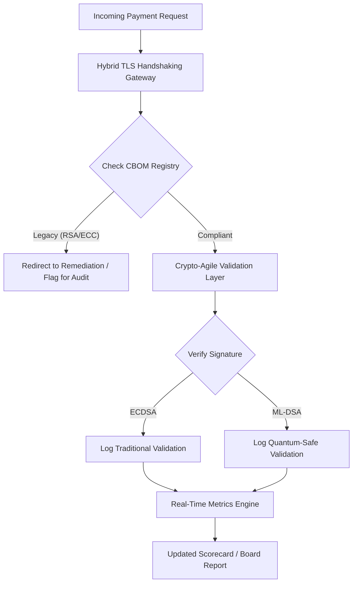

## 2026 पोस्ट-क्वांटम सुरक्षा स्कोअरकार्ड: विश्वस्त क्रिप्टोग्राफिक चपळतेसाठी एक बोर्ड-स्तरीय मापन आराखडा

पोस्ट-क्वांटम सुरक्षा हा आता संशोधन प्रकल्प राहिलेला नाही. "पर्यवेक्षकीय घड्याळ" 2020 च्या दशकाच्या उत्तरार्धातील अंमलबजावणी मुदतींकडे टिकटिक करत आहे. [NIST FIPS 203 (ML-KEM)](https://csrc.nist.gov/pubs/fips/203/final) आणि [NIST FIPS 204 (ML-DSA)](https://csrc.nist.gov/pubs/fips/204/final) यांच्या अंतिमीकरणाने की एन्कॅप्सुलेशन व डिजिटल स्वाक्षऱ्यांसाठीची मानके संहिताबद्ध केली आहेत.

नियामक संस्था आता टियर-1 बँकांकडून पायलट कार्यक्रमांच्या पलीकडे जाण्याची अपेक्षा करतात. 2026 मध्ये, लक्ष या मानकांच्या औद्योगिकीकरणाकडे वळले आहे. स्पष्ट स्थलांतर मार्ग दाखवण्यात अपयश आल्यास [Digital Operational Resilience Act (DORA)](https://eur-lex.europa.eu/eli/reg/2022/2554/oj) अंतर्गत लक्षणीय नियामक दंड लागू होतो, आणि क्वांटम-सक्षम डिक्रिप्शनचा पूर्वानुमेय धोका दुर्लक्षित करणाऱ्या संचालकांवर संभाव्य वैयक्तिक दायित्व येते.

## 01. बोर्ड-स्तरीय क्वांटम स्कोअरकार्ड

खालील मापदंड बोर्डांना व्यावसायिक व गुंतवणूक बँकिंग (CIB) आस्थापनांमधील क्वांटम सज्जता व क्रिप्टोग्राफिक आरोग्याचे मूल्यमापन करण्यासाठी एक प्रमाणित आराखडा पुरवतात.

### तक्ता 1: PQC स्कोअरकार्ड मापदंड आणि सहनशीलता

| मापदंड | गणितीय सूत्र | बोर्ड-मंजूर सहनशीलता | सहनशीलतेबाहेर गेल्यास जोखीम |
| ---- | ---- | ---- | ---- |
| **यादी पूर्णता टक्केवारी (ICP)** | (ओळखलेल्या क्रिप्टो मालमत्ता / एकूण अंदाजित मालमत्ता) × 100 | > 98% | छुपे एन्क्रिप्शन आणि उच्च-मूल्याच्या क्लिअरिंग डेटा मार्गांमधील अंधबिंदू. |
| **HNDL एक्सपोजर दर (HER)** | (जुन्या क्रिप्टोवरील दीर्घायुषी डेटा / एकूण दीर्घायुषी डेटा) × 100 | < 5% | व्यापार गुपिते, सार्वभौम कर्ज खातेवह्या आणि घाऊक देयक नोंदींची कायमस्वरूपी तडजोड. |
| **NIST स्थलांतर प्रगती दर (MPR)** | (FIPS 203/204 चालवणाऱ्या प्रणाली / एकूण गंभीर प्रणाली) × 100 | > 60% (2026 वर्षअखेरीपर्यंत) | नियामक असमानुपालन आणि G20-संरेखित प्रतिपक्षांपासून वगळणूक. |
| **क्रिप्टो-चपळता सज्जता निर्देशांक (CARI)** | (अमूर्त क्रिप्टो स्तर असलेली अॅप्स / एकूण मुख्य अॅप्स) × 100 | > 85% | तीव्र तांत्रिक ऋण आणि भविष्यातील अल्गोरिदम अवमूल्यनांना प्रतिसाद देण्यास असमर्थता. |

## 02. क्रिप्टोग्राफिक बिल ऑफ मटेरियल्स (CBOM)

ICP मापदंडाचा आधाररेखा एका सर्वसमावेशक **CBOM शोध टप्प्याद्वारे** निश्चित केला जातो. ही एक स्वयंचलित प्रक्रिया आहे जी उद्योगातील प्रत्येक क्रिप्टोग्राफिक एंडपॉइंट ओळखते.

- **एंडपॉइंट शोध:** जुन्या RSA किंवा ECC वापराची ओळख पटवण्यासाठी अंतर्गत व क्लाउड नेटवर्कमधील सक्रिय TLS सत्रांचे स्कॅनिंग.
- **की यादी:** सार्वजनिक/खाजगी की जोड्या त्यांच्या संबंधित मालकांशी मॅप करणे आणि नेमक्या समाप्ती तारखा मॅप करणे.
- **अवलंबित्व मॅपिंग:** अवमूल्यित अल्गोरिदमांवर अवलंबून असलेली तृतीय-पक्ष ग्रंथालये व API ओळखणे.

हा शोध टप्पा एकच सत्याचा स्रोत तयार करतो, ज्यामुळे CISO ला आर्थिक कामगिरीइतक्याच सूक्ष्मतेने क्रिप्टोग्राफिक आरोग्यावर अहवाल देणे शक्य होते.

## 03. घाऊक देयकांमधील HNDL एक्सपोजर नष्ट करणे

प्रतिस्पर्धी सक्रियपणे घाऊक देयके आणि दीर्घायुषी कॉर्पोरेट डेटाबेसना लक्ष्य करत आहेत. या "Harvest-Now-Decrypt-Later" (HNDL) हल्ल्यांमध्ये आजच्या एन्क्रिप्टेड रहदारीचा अवरोध व संग्रहण समाविष्ट असते.

आज क्रिप्टोग्राफिकदृष्ट्या सुसंगत क्वांटम संगणक (CRQC) अस्तित्वात नसला, तरीही आता अवरोधित केलेला डेटा भविष्यात असुरक्षित असेल. हे कमी करण्यासाठी दीर्घायुषी डेटाचे (उदा., ओळख नोंदी, 30-वर्षीय रोखे करार आणि कायदेशीर अभिलेख) उच्च-प्राधान्य स्थलांतर आवश्यक आहे, जे थेट HER मापदंड कमी करते. देयक वाहिन्या संकरित PQC-पारंपरिक एन्क्रिप्शनकडे (X25519 सोबत ML-KEM वापरून) श्रेणीसुधारित केल्याने संग्रहण धोक्यांविरुद्ध तात्काळ संरक्षण मिळते.

## 04. सुनियोजित इंटरफेसद्वारे क्रिप्टो-चपळता कार्यान्वित करणे

क्रिप्टो-चपळता अभियांत्रिकी अमूर्ततेद्वारे साकार होते. [KyberLib](https://sebastienrousseau.com/2026-06-12-kyberlib-post-quantum-banking-migration-standards-code-2026) सारखी आधुनिक ग्रंथालये हे दाखवतात की विकसक संपूर्ण अॅप्लिकेशन स्टॅक पुन्हा न लिहिता क्वांटम-सुरक्षित मॉड्यूल्स कसे अंमलात आणू शकतात.

- **अमूर्त रॅपर्स:** अॅप्लिकेशन्स अल्गोरिदम-विशिष्ट रुटीनऐवजी सामान्य `encrypt()` किंवा `sign()` फंक्शन कॉल करतात.
- **रनटाइम अदलाबदल:** अंतर्निहित मॉड्यूल जटिल कोड परिनियोजनांऐवजी कॉन्फिगरेशन बदलांद्वारे ECDSA वरून ML-DSA कडे अदलाबदल केले जाऊ शकते.

ही वास्तुरचना हे सुनिश्चित करते की भविष्यात एखादा विशिष्ट PQC अल्गोरिदम तडजोडीत आल्यास, संस्था वर्षांऐवजी तासांमध्ये दिशा बदलू शकते.

## 05. क्वांटम-सुरक्षित इनग्रेस पडताळणी कार्यप्रवाह

खालील आकृती क्वांटम-चपळ बँकिंग वातावरणात सुरक्षित परिघात प्रवेश करणाऱ्या डेटाचे जीवनचक्र स्पष्ट करते.

## निष्कर्ष

टियर-1 बँकेची क्रिप्टोग्राफिक आस्थापना आता केवळ CISO ची चिंता राहिलेली नाही. ती विश्वस्त पायाभूत सुविधा आहे. NIST FIPS 203 आणि 204 अल्गोरिदम निश्चित करतात; DORA कलम 5 जबाबदारीचे क्षेत्र निश्चित करते; SM&CR ते एका नामनिर्देशित वरिष्ठ व्यवस्थापकाशी जोडते. वरील स्कोअरकार्ड — यादी पूर्णता, HNDL एक्सपोजर, स्थलांतर प्रगती, क्रिप्टो-चपळता — बोर्डाला क्रिप्टोग्राफिक कोड न वाचता ती आस्थापना प्रशासित करण्यासाठी आवश्यक असलेले चार आकडे देते.

सर्वात महत्त्वाचा आकडा म्हणजे HNDL एक्सपोजर. आज घाऊक-देयक अभिलेखागारात पडलेली प्रत्येक जुनी-एन्क्रिप्टेड नोंद, ज्या दिवशी पहिला क्रिप्टोग्राफिकदृष्ट्या सुसंगत क्वांटम संगणक पाठवला जाईल त्या दिवशी वाचनीय होईल. ही उलटगणती मूक आणि असममित आहे: बचावकर्ते केवळ त्यांच्याकडे असलेल्या डेटावरच कृती करू शकतात, तर प्रतिस्पर्धी वर्षांपूर्वीच बाहेर काढलेल्या डेटावर कृती करू शकतात. 2024 मध्ये RSA-2048 ने एन्क्रिप्ट केलेला 30-वर्षीय कॉर्पोरेट रोखे करार, हा असा करार आहे जो CRQC कार्यान्वित होणाऱ्या दिवशी आपली गोपनीयतेची हमी गमावतो.

[KyberLib](https://sebastienrousseau.com/2026-06-12-kyberlib-post-quantum-banking-migration-standards-code-2026) आणि त्याचे समकक्ष हे बहु-वर्षीय प्लॅटफॉर्म पुनर्लेखनाचे एका कॉन्फिगरेशन बदलात रूपांतर करतात. बोर्डाचे काम कोड लिहिणे नाही. बोर्डाचे काम हे मागणी करणे आहे की क्रिप्टो-चपळता सज्जता निर्देशांक — अमूर्त क्रिप्टोग्राफिक इंटरफेसमागील मुख्य अॅप्लिकेशन्सचा वाटा — बारा महिन्यांत 85 % पार करेल, आणि तिमाही स्कोअरकार्ड वाचणे.
