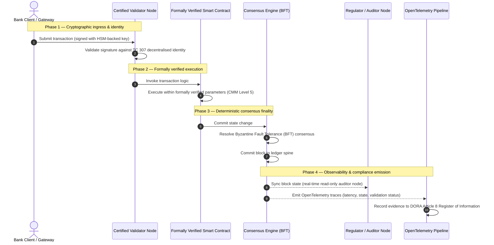

## पुराव्यापासून सत्याकडे: प्रमाणित ब्लॉकचेन बँकिंग विश्वासाच्या पुढील युगाची व्याख्या का करतील

## कार्यकारी सारांश आणि धोरणात्मक संदर्भ (TL;DR)

२०२६ मध्ये घाऊक बँकिंग आणि जागतिक व्यवहार एका ऐतिहासिक वळणबिंदूवर उभे आहेत. वित्तीय सेवा मूलतः डिजिटल, रिअल-टाइम क्लिअरिंग नेटवर्कमध्ये स्थलांतरित होत असताना, आणि कृत्रिम बुद्धिमत्ता संभाव्यतावादी अनिर्धारितता आणत असताना, पारंपरिक अ‍ॅनालॉग, पूर्वलक्ष्यी आश्वासन प्रतिमान (जसे की स्थिर घटक-आधारित ऑडिट) आधुनिक जोखीम व्यवस्थापन आणि विश्वस्त मागण्या पूर्ण करण्यात अपयशी ठरतात.

ISO/IEC Technical Committee 307 (TC 307) ने वितरित लेजर तंत्रज्ञानासाठी एक मानकीकृत आधाररेखा प्रस्थापित केली आहे. तथापि, खरा कॉर्पोरेट आणि संस्थात्मक स्वीकार वर्णनात्मक मार्गदर्शनापासून विहित, स्वतंत्रपणे प्रमाणित करण्यायोग्य ब्लॉकचेन आश्वासनाकडे स्थलांतर करण्याची मागणी करतो. लेजर प्रशासन, सहमती अखंडता, स्मार्ट कॉन्ट्रॅक्ट सुरक्षितता आणि क्रिप्टोग्राफिक चपळता यांचे कठोर ५-स्तरीय Capability Maturity Model (CMM) विरुद्ध मूल्यांकन करून, बँका ठिगळछाप, विक्रेता-विशिष्ट गृहीतकांपासून प्रमाणित करण्यायोग्य, संचालक-मंडळाद्वारे ऑडिट करण्यायोग्य आर्थिक सत्याकडे जाऊ शकतात.

## मुख्य मुद्दे

* **विश्वस्त घर्षणात्मक तफावत**: आपण सध्या बँक (Basel III), क्लाउड (ISO 27001), आणि AI प्रशासन प्रणाली (ISO 42001) प्रमाणित करू शकतो, परंतु जे सत्य आहे ते वाढत्या प्रमाणात ठरवणारे वितरित लेजर आपण अद्याप प्रमाणित करू शकत नाही. ही असमानता एक मोठी कार्यचालन असुरक्षितता आहे.
* **DORA थेट विश्वस्त जबाबदारी लागू करते**: DORA कलम ५ अंतर्गत, बँकेच्या संचालक मंडळांवर सर्व तृतीय-पक्ष आणि लेजर तैनातींच्या कार्यचालन लवचिकतेसाठी थेट, अ-हस्तांतरणीय वैयक्तिक दायित्व असते, आणि अपयशांसाठी कठोर SM&CR वैयक्तिक दंड असतात.
* **AI ऑडिट स्पाइन**: यंत्र-शिक्षण अ-पुनरुत्पादनीय, संभाव्यतावादी परिणाम आणत असले, तरी प्रमाणित ब्लॉकचेन निर्धारक स्थिती-टिपण प्रदान करते. मॉडेल आवृत्त्या, इनपुट्स आणि सत्यापन निर्णय ऑन-चेन नोंदवणे ISO 42001 आणि Model Risk Management मानके पूर्ण करते.
* **Certified Blockchain Index**: हा निर्देशांक प्रशासन, सहमती, स्मार्ट कॉन्ट्रॅक्ट्स आणि निरीक्षणक्षमता यांना ०-ते-५ CMM स्केलवर एका सत्यापनयोग्य, ऑडिट-सज्ज गुणपत्रकात औपचारिक करतो, आणि अभियांत्रिकी मापदंडांचे संचालक-मंडळ-मंजूर Risk Appetite Statements मध्ये रूपांतर करतो.

## 01. डिजिटल बँकिंगमधील विश्वस्त घर्षणात्मक तफावत

अभिजात बँकिंगमध्ये, विश्वास हा संबंधात्मक, संस्थात्मक आणि पूर्वलक्ष्यी असतो. तो स्थिर काळबिंदूंवर आर्थिक स्थितीचे पुनरावलोकन करणाऱ्या, द्विपक्षीय लेजर सायलोंमधील तफावतींचे मेळजोळ करणाऱ्या स्वतंत्र, तृतीय-पक्ष लेखापरीक्षकांवर अवलंबून असतो. २०२६ च्या रिअल-टाइम, API-चालित बाजारांमध्ये, हे प्रतिमान प्रतिबंधात्मक विलंब आणि संरचनात्मक जोखीम आणते.

जेव्हा व्यवहार तत्काळ सेटल होतात, दिवसांतर्गत तरलता संचय API गेटवेद्वारे गतिशीलपणे व्यवस्थापित होतात, आणि सामायिक लेजरवर मालमत्ता मालकी टोकनकृत होते, तेव्हा पूर्वलक्ष्यी ऑडिट हे प्रतिबंधात्मक नियंत्रणांऐवजी न्यायवैद्यक कवायती बनतात. विश्वस्त यापुढे केवळ कॉर्पोरेट घटक प्रमाणित करण्यावर विसंबून राहू शकत नाहीत. त्यांना डिजिटल आधारद्रव्यच प्रमाणित करावे लागेल.

सध्या, बँका एका स्पष्ट स्थापत्यीय असमानतेखाली कार्य करतात:

1. **प्रमाणित क्लाउड पायाभूत सुविधा**: हार्डवेअर नोड्स, व्हर्च्युअलाइज्ड कंटेनर आणि भौतिक डेटासेंटर हे ISO/IEC 27001 आणि SOC 2 Type II नियंत्रणांविरुद्ध सत्यापित केले जातात.
2. **प्रमाणित व्यवस्थापन प्रक्रिया**: कार्यचालन जोखीम धोरणे, व्यवसाय निरंतरता योजना आणि अल्गोरिदमिक तैनाती कठोर जोखीम चौकटींखाली शासित होतात.
3. **अप्रमाणित लेजर इंजिने**: मुख्य वितरित सहमती यंत्रणा, व्हॅलिडेटर नोड पुरवठा साखळ्या, स्मार्ट कॉन्ट्रॅक्ट सीमा आणि नेटवर्क प्रशासन प्रतिमाने ही अप्रमाणित, सानुकूल किंवा संघ-विशिष्ट गृहीतकांवर सोडली जातात.

ही असमानता एक मोठा अपयश बिंदू आहे. एखादी बँक सुरक्षित, ISO 27001-प्रमाणित क्लाउड कंटेनरमध्ये सत्यापित अनुप्रयोग चालवू शकते, परंतु जर तो कंटेनर केंद्रीकृत व्हॅलिडेटर नियंत्रण, असुरक्षित सहमती मापदंड किंवा अ-ऑडिट स्मार्ट कॉन्ट्रॅक्ट्स असलेल्या वितरित लेजरवर लिहीत असेल, तर व्यवहार अखंडता तडजोडीत येते. ही तफावत भरून काढण्यासाठी, लेजर इंजिनच स्वतः एक प्रमाणित करण्यायोग्य आश्वासन वस्तू बनले पाहिजे.

## 02. ISO/IEC TC 307 मानकीकरण आधाररेखा

वितरित लेजर मानकीकृत करण्यासाठी आवश्यक पायाभूत काम ISO/IEC Technical Committee 307 (TC 307) (Blockchain and distributed ledger technologies) द्वारे प्रस्थापित केले जात आहे. ब्लॉकचेनला एक विलग तांत्रिक प्रोटोकॉल म्हणून हाताळण्याऐवजी, TC 307 त्यास एक संस्थात्मक विश्वास पायाभूत सुविधा म्हणून संबोधित करते, आणि आपले कार्य पाच मुख्य स्तंभांमध्ये संघटित करते:

1. **वर्गीकरण आणि शब्दावली (ISO 22739)**: एक समान नामकरण प्रस्थापित करते, ज्यामुळे विविध कार्यक्षेत्रे, वित्तीय योजना आणि संस्थांमध्ये सुसंगत कायदेशीर आणि कार्यचालन व्याख्या सुनिश्चित होतात.
2. **संदर्भ स्थापत्य (ISO/TR 23245)**: एका अनुरूप वितरित लेजर प्रणालीच्या सीमा, स्तर, डेटा प्रवाह आणि कार्यात्मक घटकांची व्याख्या करते.
3. **सुरक्षा, गोपनीयता आणि स्मार्ट कॉन्ट्रॅक्ट्स (ISO/TR 23244 / ISO 23613)**: डिजिटल मालमत्ता प्रणालींसाठी आधारभूत सुरक्षा मार्गदर्शक तत्त्वे प्रस्थापित करते आणि स्मार्ट कॉन्ट्रॅक्ट असुरक्षितता कमी करणे व जीवनचक्र प्रशासनासाठी सर्वोत्तम पद्धतींचा तपशील देते.
4. **आंतरकार्यक्षमता चौकटी**: विषम लेजर नेटवर्कदरम्यान डेटा आणि मालमत्ता-देवाणघेवाण यंत्रणा संबोधित करते, ज्यामुळे विलग टोकनकृत सायलोंची निर्मिती रोखली जाते.
5. **विकेंद्रित ओळख आणि विश्वास अँकर्स**: लेजर-आधारित क्रिप्टोग्राफिक ओळखकर्त्यांना औपचारिक सार्वजनिक-कळ पायाभूत सुविधा (PKI) आणि राज्य-अधिकृत नोंदणींशी एकीकृत करते.

एकत्रितपणे, TC 307 हे DLT चे एका सानुकूल अभियांत्रिकी निवडीपासून एका मानकीकृत स्थापत्यीय शिस्तीत होणारे स्थित्यंतर दर्शवते. तथापि, TC 307 प्रामुख्याने वर्णनात्मक राहते. ते चांगले काय दिसते हे व्याख्यित करते (मार्गदर्शन), परंतु जोखीम अधिकाऱ्यांना आणि पर्यवेक्षकांना गंभीर किंवा महत्त्वाच्या कार्यांच्या (CIFs) उत्पादन तैनातींना अधिकृत करण्यासाठी आवश्यक असणारा विहित सत्यापन प्रोटोकॉल (आश्वासन) ते प्रदान करत नाही.

## 03. मार्गदर्शन वि. आश्वासन: विश्वस्त भेद

वित्तीय बाजार सहभागी तंत्रज्ञान त्याच्या नाविन्यपूर्णतेमुळे किंवा सुबकतेमुळे तैनात करत नाहीत; ते तेव्हाच तैनात करतात जेव्हा ते शासित, ऑडिट, बचावित आणि भांडवली राखीव आवश्यकतांशी मेळ घालता येते. यामुळेच बँकिंगमधील मानकीकरण नैसर्गिकरित्या दोन स्तरांमध्ये विभागले जाते:

* **मार्गदर्शन (चौकट)**: सर्वोत्तम पद्धती, संदर्भ लक्ष्ये आणि स्थापत्यीय मार्गदर्शक तत्त्वे रेखांकित करते (उदा., ISO/IEC TC 307, NIST चौकटी).
* **आश्वासन (पुरावा)**: चौकट रचनेप्रमाणे अंमलात आणली आणि कार्यरत आहे याचा स्वतंत्र, सतत आणि तृतीय-पक्ष-सत्यापनयोग्य पुरावा प्रदान करते (उदा., ISO 27001 प्रमाणन, SOC 2 ऑडिट, नियामक परीक्षा).

क्लाउड पायाभूत सुविधा प्रमाणित करत असताना अप्रमाणित लेजर सहमतीवर विसंबून राहणे ही एक गंभीर नियामक तफावत आहे. जो ब्लॉकचेन "अपरिवर्तनीय" आहे तो अपरिहार्यपणे "संस्थात्मकदृष्ट्या विश्वसनीय" नसतो. अपरिवर्तनीयता केवळ हेच हमी देते की प्रविष्ट केलेला डेटा अपरिवर्तित राहतो; ती हे सत्यापित करत नाही की व्हॅलिडेटर नोड्स सुरक्षित आहेत, सहमती प्रोटोकॉल संगनमताविरुद्ध लवचिक आहे, स्मार्ट कॉन्ट्रॅक्ट तर्क गणितीयदृष्ट्या सुदृढ आहे, किंवा क्रिप्टोग्राफिक कळ व्यवस्थापन पोस्ट-क्वांटम आदेशांचे पालन करते.

ही तफावत भरून काढण्यासाठी, २०२६ चा Certified Blockchain Index या आवश्यकतांना जागतिक बँकिंग नियमांशी जोडलेल्या परिमाणयोग्य Capability Maturity Model (CMM) मध्ये औपचारिक करतो.

## 04. २०२६ चा Certified Blockchain Index

वरिष्ठ व्यवस्थापनाला त्यांच्या लेजर प्लॅटफॉर्मचे मूल्यांकन आणि प्रमाणन करण्यास सक्षम करण्यासाठी, हा निर्देशांक वितरित लेजर पायाभूत सुविधेला पाच ऑडिट करण्यायोग्य कार्यचालन स्तरांमध्ये संरचित करतो, जे ०-ते-५ CMM स्केलवर मूल्यांकित केले जातात.

## तक्ता 1: Certified Blockchain Index स्थापत्य

| निर्देशांक स्तर | Capability Maturity Level (CMM) | तांत्रिक आणि कार्यचालन मापदंड | नियामक / विश्वस्त नियंत्रण संदर्भ |
| ---- | ---- | ---- | ---- |
| **लेजर प्रशासन** | **Level 0**: तदर्थ संघ**Level 3**: स्वयंचलित व्हॅलिडेटर तपासणी व फेरबदल**Level 5**: विकेंद्रित, बहु-पक्षीय क्रिप्टोग्राफिक ओळख अँकरिंग | तपासलेल्या वित्तीय घटकांद्वारे चालवल्या जाणाऱ्या व्हॅलिडेटर नोड्सचे %; व्हॅलिडेटर विवाद निकाली काढण्याचा सरासरी वेळ; नोड्सचे भौगोलिक वितरण | **DORA कलम 5** (प्रशासन आणि संघटन); **CPMI-IOSCO PFMI Principle 2** (प्रशासन) आणि **Principle 3** (जोखमींच्या सर्वसमावेशक व्यवस्थापनाची चौकट) |
| **सहमती अखंडता** | **Level 0**: एकल-नोड किंवा अपारदर्शक POW**Level 3**: निर्धारक अंतिमतेसह ऑडिट केलेले BFT**Level 5**: सतत विलंब निरीक्षणासह बहु-कार्यक्षेत्रीय, औपचारिकपणे सत्यापित सहमती | कमाल सहनशील सहमती विलंब; संगनमत-प्रतिरोध उंबरठा; सिम्युलेटेड नोड विभाजनाखाली अपटाइम SLA | **DORA कलम 6** (ICT जोखीम व्यवस्थापन चौकट); **CPMI-IOSCO PFMI Principle 8** (सेटलमेंट अंतिमता) |
| **ओळख आणि क्रिप्टोग्राफी** | **Level 0**: कमकुवत RSA / ECDSA कळा**Level 3**: HSM-समर्थित कळ व्यवस्थापनासह Multi-sig**Level 5**: क्वांटम-सुरक्षित हायब्रिड कळा (FIPS 203 ML-KEM) आणि शून्य-ज्ञान गोपनीयता गेट्स | HSM-समर्थित कळांनी स्वाक्षरी केलेल्या लेजर व्यवहारांचे %; PQC स्थलांतर सज्जता गुण; ZK-प्रूफ विलंब | **NIST FIPS 203 / 204**; **ISO/IEC 27001** (माहिती सुरक्षा व्यवस्थापन) |
| **स्मार्ट कॉन्ट्रॅक्ट आश्वासन** | **Level 0**: अ-ऑडिट solidity स्क्रिप्ट्स**Level 3**: स्वयंचलित कंपायलर सत्यापन व बाह्य ऑडिट**Level 5**: सर्किट-ब्रेकर अपग्रेडसह औपचारिकपणे सत्यापित, अपरिवर्तनीय स्मार्ट कॉन्ट्रॅक्ट्स | गणितीय औपचारिक सत्यापन असलेल्या स्मार्ट कॉन्ट्रॅक्ट्सचे %; कंपायलर इशाऱ्यांची संख्या; असुरक्षितता स्कॅन व्याप्ती | **EBA Guidelines on Outsourcing Arrangements** (परिच्छेद 81, 113-117); **DORA कलम 30** (किमान कंत्राटी कलमे) |
| **ऑडिट आणि निरीक्षणक्षमता** | **Level 0**: मॅन्युअल लॉग स्क्रॅपिंग**Level 3**: संरचित OTel ट्रेस व केवळ-वाचनीय ऑडिटर नोड्स**Level 5**: कलम 8 नोंदणीशी स्वयंचलित, सतत मेळजोळ | OpenTelemetry ट्रेसद्वारे व्याप्त व्यवहारांचे %; लेजर ब्लॉक-कमिटपासून ऑडिटर-नोड सिंकपर्यंतचा विलंब | **BCBS 239** (जोखीम डेटा एकत्रीकरण); **DORA कलम 8** (Register of Information / ITS Schemas) |

## तक्ता 2: जागतिक बँकिंग मानकांशी जोडलेले मुख्य विश्वास संकेत

| संकेत / बेंचमार्क | मापदंड | बँकिंग प्लॅटफॉर्मवरील परिणाम | नियामक स्रोत |
| ---- | ---- | ---- | ---- |
| **ISO/IEC TC 307 प्रगती** | ISO/TR तांत्रिक अहवालांपासून औपचारिक प्रमाणन योजनांकडे स्थित्यंतर | वितरित लेजर इंजिने प्रमाणित करण्यासाठी पहिली मानकीकृत चौकट प्रस्थापित करते | **ISO/IEC JTC 1 / SC 44** (Distributed Ledger Technologies) |
| **Project Agorá प्रोटोटाइप टप्पा** | ४०+ सहभागी वाणिज्य बँका; टोकनकृत ठेवींची एकीकृत लेजर चाचणी | सीमापार क्लिअरिंग संदेशवहनापासून (SWIFT) अणुक टोकनकृत सेटलमेंटकडे हलवते | **Bank for International Settlements (BIS) Innovation Hub** |
| **DORA कलम 30 तृतीय-पक्ष ऑडिट** | सुरक्षा निकषांविरुद्ध १००% नोड प्रदाते व पायाभूत सुविधा होस्ट ऑडिट केलेले | "छाया व्हॅलिडेटर नोड्स" नष्ट करते; संपूर्ण पुरवठा-साखळी पारदर्शकता अनिवार्य करते | **European Supervisory Authorities (ESA)** |
| **ISO/IEC 42001 (AI प्रशासन)** | क्रिप्टोग्राफिकदृष्ट्या अपरिवर्तनीय केलेले AI मॉडेल व प्रशिक्षण लॉग ऑन-चेन | यंत्र-शिक्षणासाठी अपरिवर्तनीय पुरावात्मक लेजर ("ऑडिट स्पाइन") म्हणून ब्लॉकचेन वापरते | **ISO/IEC 42001:2023** (माहिती तंत्रज्ञान — कृत्रिम बुद्धिमत्ता) |
| **Basel III भांडवली पर्याप्तता** | दस्तऐवजीकृत जटिलता कपातीवर आधारित कार्यचालन जोखीम भांडवली बफरमध्ये घट | मानकीकृत कार्यचालन जोखीम चौकटी थेट सत्यापित लेजर लवचिकतेला श्रेय देतात | **Basel Committee on Banking Supervision (BCBS)** |

## 05. AI "ऑडिट स्पाइन": निर्धारक पायाभूत सुविधेवर संभाव्यतावादी बुद्धिमत्ता

२०२६ मध्ये प्रमाणित ब्लॉकचेनसाठी सर्वात प्रभावशाली धोरणात्मक भूमिकांपैकी एक म्हणजे कृत्रिम बुद्धिमत्ता तैनातींसाठी **"ऑडिट स्पाइन"** म्हणून काम करणे. आधुनिक वित्तीय प्रणाली वाढत्या प्रमाणात संभाव्यतावादी आहेत. क्रेडिट स्कोअरिंग, रिअल-टाइम फसवणूक शोध, अल्गोरिदमिक ट्रेडिंग आणि स्वायत्त ग्राहक परस्परसंवाद हे यंत्र-शिक्षण मॉडेलद्वारे चालवले जातात, जे कालांतराने उत्क्रांत होतात, विचलित होतात आणि जुळवून घेतात. ही मॉडेल अनिर्धारक असतात: दोन वेगवेगळ्या वेळी समान इनपुट दिल्यास, गतिशील वजने आणि सतत प्रशिक्षणामुळे ती वेगळे आउटपुट देऊ शकतात.

ही अनिर्धारितता **ISO/IEC 42001 (AI प्रशासन)** आणि **Model Risk Management (MRM)** मानकांखाली (जसे की **US Federal Reserve SR 11-7** आणि **UK PRA SS1/23**) एक गहन प्रशासन आव्हान आणते: *जे निर्णय काटेकोरपणे पुनरुत्पादनीय नाहीत त्यांचे तुम्ही ऑडिट, स्पष्टीकरण आणि बचाव कसा कराल?*

एक प्रमाणित वितरित लेजर निर्धारक प्रतिभार प्रदान करते. AI मॉडेल संभाव्यतावादीपणे कार्य करत असताना, प्रमाणित ब्लॉकचेन त्यांचे मापदंड निर्धारकपणे नोंदवते, आणि एक अपरिवर्तनीय पुरावात्मक कणा प्रस्थापित करते:

* **मॉडेल आवृत्तीकरण आणि वजन अँकरिंग**: प्रत्येक तैनात मॉडेल आवृत्ती, तिची संबंधित वजने आणि तिच्या प्रशिक्षण डेटाचे चेकसम बिल्ड-टाइमला हॅश करून लेजरवर लिहिले जातात, जे **SLSA Level 3** पुरवठा-साखळी आवश्यकता पूर्ण करते.
* **संदर्भात्मक इनपुट नोंदणी**: जेव्हा एखादे AI मॉडेल एक गंभीर निर्णय अंमलात आणते (उदा., कर्ज मंजूर करणे किंवा व्यवहार ध्वजांकित करणे), तेव्हा नेमके संदर्भात्मक इनपुट्स आणि मॉडेल हॅश लेजरवर लिहिले जातात, ज्यामुळे छेडछाड-स्पष्ट इतिहास तयार होतो.
* **कोड प्रवेशाशिवाय ऑडिटयोग्यता**: जर एखाद्या नियामकाने विचारले, "तुमच्या मॉडेलने ३ जूनला हा क्रेडिट अर्ज का नाकारला?" तर बँकेला मालकीहक्क कोड उघड करण्याची किंवा नेमकी मॉडेल स्थिती पुनर्निर्मित करण्याचा प्रयत्न करण्याची गरज नसते. ती इनपुट्स, वजने आणि सत्यापन स्थितीची क्रिप्टोग्राफिकदृष्ट्या स्वाक्षरीत, ऑन-चेन लेजर नोंद सादर करते.

यंत्र-शिक्षण मॉडेलच्या संभाव्यतावादी निर्णयांना प्रमाणित ब्लॉकचेनच्या निर्धारक सहमतीशी अँकर करून, संस्था स्वयंचलित कृतींची एक बचावयोग्य, पुनर्रचनायोग्य आणि स्वतंत्रपणे सत्यापनयोग्य कालरेखा तयार करते.

## 06. प्रमाणित सहमती-ते-ऑडिट पाइपलाइन दृश्यमान करणे

खालील क्रम आकृती एका व्यवहाराचे प्रमाणित ब्लॉकचेन प्लॅटफॉर्ममधून जाणारे जीवनचक्र दर्शवते, आणि सत्यापन गेट्स, सहमती अखंडता, स्मार्ट कॉन्ट्रॅक्ट अंमलबजावणी आणि टेलिमेट्री उत्सर्जन कसे एकमेकांशी जोडून संचालक-मंडळ-सज्ज नियामक पुरावा निर्माण करतात हे दाखवते:

या व्यवहारी क्रमासाठी गंभीर मार्ग हे आवश्यक करतो की प्रत्येक सत्यापन, अंमलबजावणी आणि सहमती पायरी क्रिप्टोग्राफिकदृष्ट्या स्वाक्षरीत असावी, ज्यामुळे टोकापासून-टोकापर्यंत उगमस्थान सुनिश्चित होते. नियामकाचे ऑडिटर नोड ब्लॉक स्थिती रिअल-टाइममध्ये सिंक्रोनाइझ करते, ज्यामुळे पूर्वलक्ष्यी, मॅन्युअल आर्थिक मेळजोळाची गरज नाहीशी होते.

## 07. वरिष्ठ व्यवस्थापकांसाठी बोर्डरूम कार्यपुस्तिका

संघटनात्मक विश्वासापासून पायाभूत सुविधात्मक विश्वासाकडे होणारे स्थित्यंतर यशस्वीरित्या पार पाडण्यासाठी, बँक कार्यकारी आणि वरिष्ठ व्यवस्थापकांनी तात्काळ चार मुख्य निर्देश अंमलात आणले पाहिजेत:

1. **एंटरप्राइझ जोखीम व्यवस्थापनात (ERM) लेजर ऑडिट अनिवार्य करा**: असे धोरण लागू करा की कोणतेही वितरित लेजर प्लॅटफॉर्म—खासगी, सार्वजनिक किंवा संघ-आधारित असो—गंभीर किंवा महत्त्वाच्या कार्यांसाठी (CIFs) तेव्हाच तैनात केले जाईल जेव्हा त्याचे ५-स्तरीय **Certified Blockchain Index स्थापत्य** (किमान CMM Level 3) विरुद्ध ऑडिट झाले असेल.
2. **ब्लॉकचेनना ISO 42001 AI पुरावात्मक कणा म्हणून एकीकृत करा**: Chief Risk Officer आणि Lead AI Architect यांना सर्व उच्च-परिणाम यंत्र-शिक्षण मॉडेल एका प्रमाणित ब्लॉकचेनशी एकीकृत करण्याचे निर्देश द्या, ज्यामुळे मॉडेल आवृत्त्या, वजने, इनपुट्स आणि निर्णयांचे छेडछाड-स्पष्ट ऑडिट लेजर तयार होईल.
3. **व्हॅलिडेटर नोड पुरवठा साखळी ऑडिट करा (DORA कलम 30)**: खरेदी विभागाला DLT नेटवर्कसाठी व्हॅलिडेटर नोड्स होस्ट करणाऱ्या किंवा क्लाउड होस्टिंग व्यवस्थापित करणाऱ्या सर्व तृतीय-पक्ष घटकांचे ऑडिट करण्याची आवश्यकता ठेवा, आणि बँकेच्या अंतर्गत क्लाउड नोड्सना लागू असलेल्या त्याच सायबरसुरक्षा व कार्यचालन लवचिकता मानकांचे पालन अनिवार्य करा.
4. **लेजर स्थापत्यांना CPMI-IOSCO आणि BCBS 239 शी संरेखित करा**: प्लॅटफॉर्म अभियांत्रिकी संघाला लेजर आउटपुट टेलिमेट्री थेट **BCBS 239** डेटा अहवाल आवश्यकतांशी संरेखित करण्याचे निर्देश द्या, आणि सहमती व सेटलमेंट अंतिमता मापदंड **CPMI-IOSCO Principles 8 आणि 9** चे काटेकोर पालन करतात याची खात्री करा.

## 08. वारंवार विचारले जाणारे प्रश्न

**ISO/IEC TC 307 हे एक प्रमाणन मानक आहे का?**
नाही. ISO/IEC TC 307 ही एक तांत्रिक समिती आहे जी शब्दावली, संदर्भ स्थापत्ये आणि सुरक्षा मार्गदर्शक तत्त्वे प्रस्थापित करते. ते "चांगले काय दिसते" याची व्याख्या करते (मार्गदर्शन), तरी बँकिंग पर्यवेक्षकांना समाधानी करण्यासाठी उद्योगाला या दस्तऐवजांना औपचारिक, ऑडिट करण्यायोग्य प्रमाणन योजनांमध्ये (आश्वासन) कार्यान्वित करावे लागेल.

**प्रमाणित ब्लॉकचेन DORA अनुपालनास कसे समर्थन देते?**
DORA कलम ५ अंतर्गत, बँक संचालक मंडळांवर तंत्रज्ञान लवचिकतेसाठी थेट, वैयक्तिक दायित्व असते. एक प्रमाणित ब्लॉकचेन सहमती अखंडता, व्हॅलिडेटर पुरवठा-साखळी नियंत्रण आणि स्मार्ट कॉन्ट्रॅक्ट सुरक्षिततेचा सत्यापनयोग्य, क्रिप्टोग्राफिक पुरावा प्रदान करते, ज्यामुळे संचालक मंडळ सदस्यांना SM&CR वैयक्तिक दायित्व दाव्यांविरुद्ध बचाव करण्यासाठी आवश्यक असलेली दस्तऐवजीकरणयोग्य "वाजवी पावले" मिळतात.

पारंपरिक लेजर ऑडिट आणि प्रमाणित ब्लॉकचेन ऑडिटमध्ये काय फरक आहे?
पारंपरिक ऑडिट पूर्वलक्ष्यी असते, जे व्यवहार क्लिअर झाल्यानंतर मॅन्युअल नोंदी आणि स्थिर फाइल्स सत्यापित करते. प्रमाणित ब्लॉकचेन ऑडिट सतत आणि रिअल-टाइम असते; व्हॅलिडेटर नोड्स, BFT सहमती इंजिन आणि औपचारिकपणे सत्यापित स्मार्ट कॉन्ट्रॅक्ट्स व्यवहार निर्धारकपणे अंमलात आणण्यासाठी प्रमाणित असतात, आणि संरचित टेलिमेट्री (OpenTelemetry) उत्सर्जित करतात जी प्रणालीचे आरोग्य सतत सत्यापित करते.

बँकिंग वापरासाठी सार्वजनिक ब्लॉकचेन प्रमाणित करता येतात का?
बहुतांश कार्यक्षेत्रांमध्ये, शुद्ध परवानगी-मुक्त सार्वजनिक ब्लॉकचेन व्हॅलिडेटर ओळख सत्यापनाच्या अभावामुळे, अप्रत्याशित गॅस/व्यवहार खर्चामुळे आणि अनिर्धारक अंतिमतेमुळे (उदा., संभाव्यतावादी proof-of-work/stake फोर्क्स) बँकिंग नियमांचे समाधान करण्यात अपयशी ठरतात. बँकिंगमधील प्रमाणित ब्लॉकचेन सामान्यतः एंटरप्राइझ परवानगी-आधारित किंवा अत्यंत नियमित सार्वजनिक-हायब्रिड स्थापत्ये वापरतात, जिथे व्हॅलिडेटर नोड चालक हे ओळखलेले आणि ऑडिट केलेले वित्तीय घटक असतात.

## 09. संदर्भ

* Basel Committee on Banking Supervision (BCBS), 2013. *Principles for effective risk data aggregation and reporting (BCBS 239)*. Basel: Bank for International Settlements. येथे उपलब्ध: [https://www.bis.org/publ/bcbs239.pdf](https://www.bis.org/publ/bcbs239.pdf).
* Committee on Payments and Market Infrastructures and Technical Committee of the International Organization of Securities Commissions (CPMI-IOSCO), 2012. *Principles for financial market infrastructures*. Basel: Bank for International Settlements. येथे उपलब्ध: [https://www.bis.org/cpmi/publ/d101.htm](https://www.bis.org/cpmi/publ/d101.htm).
* European Banking Authority (EBA), 2019. *EBA/GL/2019/02 — Guidelines on outsourcing arrangements*. Paris: EBA. येथे उपलब्ध: [https://www.eba.europa.eu/regulation-and-policy/internal-governance/guidelines-on-outsourcing-arrangements](https://www.eba.europa.eu/regulation-and-policy/internal-governance/guidelines-on-outsourcing-arrangements).
* European Parliament and Council of the European Union, 2022. *Regulation (EU) 2022/2554 on digital operational resilience for the financial sector (DORA)*. Brussels: Official Journal of the European Union. येथे उपलब्ध: [https://eur-lex.europa.eu/legal-content/EN/TXT/?uri=CELEX%3A32022R2554](https://eur-lex.europa.eu/legal-content/EN/TXT/?uri=CELEX%3A32022R2554).
* ISO/IEC JTC 1/SC 42, 2023. *ISO/IEC 42001:2023 — Information technology — Artificial intelligence — Management system*. Geneva: International Organization for Standardization. येथे उपलब्ध: [https://www.iso.org/standard/81230.html](https://www.iso.org/standard/81230.html).
* ISO/IEC Technical Committee 307, 2020. *ISO/IEC 22739:2020 — Blockchain and distributed ledger technologies — Vocabulary*. Geneva: International Organization for Standardization. येथे उपलब्ध: [https://www.iso.org/standard/73771.html](https://www.iso.org/standard/73771.html).
* National Institute of Standards and Technology (NIST), 2026. *First Three Finalized Post-Quantum Encryption Standards (FIPS 203, 204, and 205)*. Gaithersburg: U.S. Department of Commerce. येथे उपलब्ध: [https://www.nist.gov/news-events/news/2024/08/nist-releases-first-3-finalized-post-quantum-encryption-standards](https://www.nist.gov/news-events/news/2024/08/nist-releases-first-3-finalized-post-quantum-encryption-standards).
