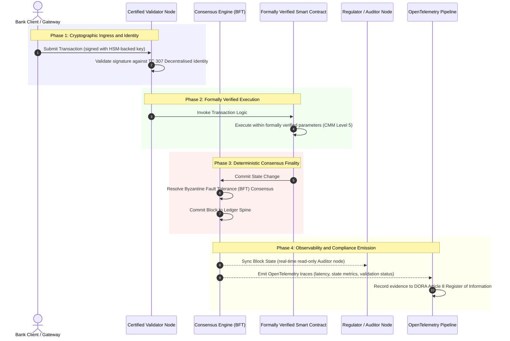

# पुराव्यापासून सत्यापर्यंत: प्रमाणित ब्लॉकचेन बँकिंग विश्वासाचे पुढील युग का घडवतील

**अपरिवर्तनीय म्हणजे विश्वासार्ह नव्हे.** घाऊक बँकिंग वास्तव-वेळ निपटाऱ्याकडे आणि संभाव्यतावादी एआयकडे वाटचाल करत असताना, काय सत्य आहे हे ठरवणारी खातेवही हा एकमेव स्तर बनला आहे जो बँका अजूनही प्रमाणित करू शकत नाहीत. त्या संस्थेला Basel III अंतर्गत, क्लाउडला ISO 27001 अंतर्गत आणि त्यांच्या एआयला ISO 42001 अंतर्गत प्रमाणित करतात, परंतु वितरित खातेवही, तिचे प्रशासन, सहमती, क्रिप्टोग्राफी आणि स्मार्ट करार हे विक्रेता-विशिष्ट गृहीतकांवर सोडले जातात. हा अहवाल असा युक्तिवाद करतो की ती विश्वस्त-दरी बंद करण्यासाठी ISO/IEC TC 307 मार्गदर्शनाकडून विहित हमीकडे जाणे आवश्यक आहे: खातेवहीला एका ५-स्तरीय प्रमाणित ब्लॉकचेन निर्देशांकावर गुणांकित करणे जे अभियांत्रिकी मापदंडांना बोर्ड-लेखापरीक्षणयोग्य, DORA-बचावयोग्य सत्यात रूपांतरित करते.

<!-- lead-start -->
<aside class="post-lead" aria-label="लेखाचा सारांश">

<strong>थोडक्यात.</strong> बँका संस्था, क्लाउड आणि त्यांच्या एआयला प्रमाणित करतात, पण काय सत्य आहे हे वाढत्या प्रमाणात ठरवणाऱ्या खातेवहीला नाही. ISO/IEC TC 307 मार्गदर्शन देते, हमी नाही. एक ५-स्तरीय प्रमाणित ब्लॉकचेन निर्देशांक खातेवही प्रशासन, सहमती अखंडता, ओळख व क्रिप्टोग्राफी, स्मार्ट-करार हमी आणि निरीक्षणक्षमतेला एका परिपक्वता मॉडेलवर गुणांकित करतो, ज्यामुळे विश्वस्त-दरी बंद होते आणि संभाव्यतावादी एआयला एक निर्धारक लेखापरीक्षण कणा मिळतो.

<strong>महत्त्वाचे मुद्दे</strong>

<ul class="post-lead-takeaways">
  <li><strong>विश्वस्त घर्षणात्मक दरी.</strong> बँक (Basel III), क्लाउड (ISO 27001) आणि एआय प्रशासन प्रणाली (ISO 42001) प्रमाणित करता येतात; काय सत्य आहे हे ठरवणारी वितरित खातेवही अद्याप करता येत नाही. ती विषमता ही एक जिवंत परिचालन असुरक्षा आहे.</li>
  <li><strong>DORA ते वैयक्तिक बनवते.</strong> DORA Article 5 अंतर्गत, बँक बोर्ड तृतीय-पक्ष आणि खातेवही तैनातींच्या लवचिकतेसाठी थेट, अ-सोपवण्याजोगे उत्तरदायित्व वाहतात, अपयशासाठी SM&amp;CR वैयक्तिक दंडांसह.</li>
  <li><strong>एआय लेखापरीक्षण कणा.</strong> यंत्र शिक्षण अपुनरुत्पादनीय आहे; एक प्रमाणित ब्लॉकचेन मॉडेल आवृत्त्या, इनपुट आणि पडताळणी निर्णय निर्धारकरीत्या ऑन-चेन पकडते, जे ISO 42001 आणि मॉडेल-जोखीम-व्यवस्थापन मानकांची पूर्तता करते.</li>
  <li><strong>प्रमाणित ब्लॉकचेन निर्देशांक.</strong> प्रशासन, सहमती, क्रिप्टोग्राफी, स्मार्ट करार आणि निरीक्षणक्षमता हे ० ते ५ या CMM गुणपत्रिकेत बनतात जे अभियांत्रिकी मापदंडांना बोर्ड-मंजूर जोखीम प्रवृत्ती विधानांमध्ये रूपांतरित करते.</li>
</ul>

<strong>संबंधित वाचन:</strong> <a href="https://sebastienrousseau.com/2026-07-02-certified-blockchains-banking-trust-tc307-assurance-2026">प्रमाणित ब्लॉकचेन आणि बँकिंग विश्वास: TC 307 हमी</a>, <a href="https://sebastienrousseau.com/2026-07-24-global-payments-outlook-operating-model-risk-revenue">२०२६ जागतिक देयक दृष्टिकोन</a>.

</aside>
<!-- lead-end -->

> **कार्यकारी सारांश**
>
> - **घाऊक बँकिंग एका वळणबिंदूवर आहे.** वास्तव-वेळ क्लिअरिंग आणि संभाव्यतावादी एआय हे अनुरूप, पूर्वलक्षी हमी मॉडेल मोडतात: स्थिर, संस्था-आधारित लेखापरीक्षणे यापुढे आधुनिक जोखीम-व्यवस्थापन किंवा विश्वस्त मागण्या पूर्ण करत नाहीत.
> - **TC 307 हा एक आधाररेखा आहे, प्रमाणपत्र नाही.** ISO/IEC TC 307 ने वितरित खातेवह्यांसाठी शब्दसंग्रह, संदर्भ स्थापत्य आणि सुरक्षा मार्गदर्शन प्रमाणित केले आहे, परंतु ते वर्णनात्मक आहे. ते चांगले काय दिसते हे परिभाषित करते; ते जोखीम अधिकारी आणि पर्यवेक्षकांना उत्पादन तैनातीला अधिकृत करण्यासाठी आवश्यक असलेली विहित पडताळणी पुरवत नाही.
> - **हमी म्हणजे खातेवहीला गुणांकित करणे.** प्रशासन, सहमती अखंडता, स्मार्ट-करार सुरक्षा आणि क्रिप्टोग्राफिक चपळता, एका कठोर ५-स्तरीय परिपक्वता मॉडेलवर गुणांकित केल्याने बँका ठिगळबंद, विक्रेता-विशिष्ट गृहीतकांपासून प्रमाणनयोग्य, बोर्ड-लेखापरीक्षणयोग्य आर्थिक सत्याकडे नेतात.
> - **खातेवही हा एआयसाठी लेखापरीक्षण कणा आहे.** मॉडेल आवृत्त्या, इनपुट आणि पडताळणी निर्णय निर्धारक सहमतीशी नांगरल्याने अपुनरुत्पादनीय यंत्र शिक्षणाला ISO 42001, SR 11-7 आणि PRA SS1/23 अंतर्गत एक बचावयोग्य, पुनर्रचनायोग्य पुराव्याची नोंद मिळते.

## डिजिटल बँकिंगमधील विश्वस्त घर्षणात्मक दरी

पारंपरिक बँकिंगमध्ये, विश्वास हा संबंधात्मक, संस्थात्मक आणि पूर्वलक्षी असतो. तो स्वतंत्र, तृतीय-पक्ष लेखापरीक्षकांवर अवलंबून असतो जे स्थिर कालबिंदूंवर आर्थिक स्थितीचे पुनरावलोकन करतात, द्विपक्षीय खातेवही कप्प्यांमधील विसंगती जुळवतात. २०२६ च्या वास्तव-वेळ, API-चालित बाजारांमध्ये, हे मॉडेल प्रतिबंधात्मक विलंब आणि संरचनात्मक जोखीम आणते.

जेव्हा व्यवहार तात्काळ निपटले जातात, दिवसांतर्गत तरलता संचय API गेटवेद्वारे गतिशीलपणे व्यवस्थापित केले जातात, आणि मालमत्तेचे मालकीहक्क सामायिक खातेवह्यांवर टोकनीकृत केले जातात, तेव्हा पूर्वलक्षी लेखापरीक्षणे प्रतिबंधात्मक नियंत्रणांऐवजी न्यायवैद्यक कवायती बनतात. विश्वस्त यापुढे केवळ कॉर्पोरेट संस्थेला प्रमाणित करण्यावर विसंबून राहू शकत नाहीत. त्यांनी डिजिटल आधारस्तर स्वतःच प्रमाणित केला पाहिजे.

सध्या, बँका एका ठळक स्थापत्य विषमतेखाली कार्य करतात:

1. **प्रमाणित क्लाउड पायाभूत सुविधा**: हार्डवेअर नोड, वर्च्युअलाइज्ड कंटेनर आणि भौतिक डेटासेंटर हे ISO/IEC 27001 आणि SOC 2 Type II नियंत्रणांविरुद्ध पडताळले जातात.  
2. **प्रमाणित व्यवस्थापन प्रक्रिया**: परिचालन जोखीम धोरणे, व्यवसाय सातत्य योजना आणि अल्गोरिदमिक तैनाती कठोर जोखीम आराखड्यांखाली शासित केल्या जातात.  
3. **अप्रमाणित खातेवही इंजिने**: गाभा वितरित सहमती यंत्रणा, प्रमाणक नोड पुरवठा साखळ्या, स्मार्ट करार सीमा आणि नेटवर्क प्रशासन मॉडेल हे अप्रमाणित, सानुकूल किंवा संघ-विशिष्ट गृहीतकांवर सोडले जातात.

ही विषमता हा एक मोठा अपयशबिंदू आहे. एक बँक सुरक्षित, ISO 27001-प्रमाणित क्लाउड कंटेनरमध्ये पडताळलेला अनुप्रयोग चालवू शकते, परंतु जर तो कंटेनर केंद्रीकृत प्रमाणक नियंत्रण, असुरक्षित सहमती मापदंड, किंवा अ-लेखापरीक्षित स्मार्ट करार असलेल्या वितरित खातेवहीत लिहित असेल, तर व्यवहाराची अखंडता तडजोडली जाते. ही दरी भरून काढण्यासाठी, खातेवही इंजिन स्वतःच एक प्रमाणनयोग्य हमी वस्तू बनले पाहिजे.

## ISO/IEC TC 307 प्रमाणीकरण आधाररेखा

वितरित खातेवह्यांना प्रमाणित करण्यासाठी आवश्यक असलेले पायाभूत कार्य ISO/IEC Technical Committee 307 (TC 307\) (ब्लॉकचेन आणि वितरित खातेवही तंत्रज्ञान) द्वारे प्रस्थापित केले जात आहे. ब्लॉकचेनला एक विलग तांत्रिक प्रोटोकॉल म्हणून हाताळण्याऐवजी, TC 307 ते एक संस्थात्मक विश्वास पायाभूत सुविधा म्हणून हाताळते, आपले कार्य पाच गाभा स्तंभांमध्ये संघटित करते:

1. **वर्गीकरण आणि शब्दसंग्रह (ISO 22739\)**: एक समान नामकरण प्रस्थापित करते, विविध अधिकारक्षेत्रे, आर्थिक योजना आणि संस्थांमध्ये सुसंगत कायदेशीर व परिचालन व्याख्या सुनिश्चित करते.  
2. **संदर्भ स्थापत्य (ISO/TR 23245\)**: एका अनुपालक वितरित खातेवही प्रणालीच्या सीमा, स्तर, डेटा प्रवाह आणि कार्यात्मक घटक परिभाषित करते.  
3. **सुरक्षा, गोपनीयता आणि स्मार्ट करार (ISO/TR 23244 / ISO 23613\)**: डिजिटल मालमत्ता प्रणालींसाठी आधारभूत सुरक्षा मार्गदर्शक तत्त्वे प्रस्थापित करते आणि स्मार्ट करार असुरक्षा शमन व जीवनचक्र प्रशासनासाठी सर्वोत्तम पद्धतींचे तपशील देते.  
4. **आंतरकार्यक्षमता आराखडे**: विषम खातेवही नेटवर्कांमधील डेटा व मालमत्ता-विनिमय यंत्रणा हाताळते, विलग टोकनीकृत कप्प्यांची निर्मिती रोखते.  
5. **विकेंद्रित ओळख आणि विश्वास नांगर**: खातेवही-आधारित क्रिप्टोग्राफिक ओळखकर्त्यांना औपचारिक सार्वजनिक-कळ पायाभूत सुविधांशी (PKI) आणि राज्य-अधिकृत नोंदणींशी एकत्रित करते.

एकत्रितपणे, TC 307 DLT चे सानुकूल अभियांत्रिकी निवडीपासून एका प्रमाणित स्थापत्य शिस्तीमध्ये संक्रमण दर्शवते. तथापि, TC 307 प्रामुख्याने वर्णनात्मक राहते. ते चांगले काय दिसते हे परिभाषित करते (मार्गदर्शन), परंतु ते जोखीम अधिकारी आणि पर्यवेक्षकांना गंभीर किंवा महत्त्वाच्या कार्यांच्या (CIFs) उत्पादन तैनातीला अधिकृत करण्यासाठी आवश्यक असलेला विहित पडताळणी प्रोटोकॉल (हमी) पुरवत नाही.

## मार्गदर्शन विरुद्ध हमी: विश्वस्त भेद

आर्थिक बाजार सहभागी तंत्रज्ञान ते नाविन्यपूर्ण किंवा सुबक आहे म्हणून तैनात करत नाहीत; ते तेव्हा तैनात करतात जेव्हा ते शासित, लेखापरीक्षित, बचावित आणि भांडवली राखीव आवश्यकतांशी जुळवता येते. म्हणूनच बँकिंगमधील प्रमाणीकरण नैसर्गिकरीत्या दोन स्तरांमध्ये विघटित होते:

* **मार्गदर्शन (आराखडा)**: सर्वोत्तम पद्धती, संदर्भ लक्ष्ये आणि स्थापत्य मार्गदर्शक तत्त्वे रेखांकित करते (उदा., ISO/IEC TC 307, NIST आराखडे).  
* **हमी (पुरावा)**: आराखडा तयार केल्याप्रमाणे राबवला जात आहे आणि कार्यरत आहे याचा स्वतंत्र, सतत आणि तृतीय-पक्ष-पडताळणीयोग्य पुरावा पुरवते (उदा., ISO 27001 प्रमाणन, SOC 2 लेखापरीक्षणे, नियामक तपासण्या).

क्लाउड पायाभूत सुविधा प्रमाणित करताना अप्रमाणित खातेवही सहमतीवर विसंबून राहणे ही एक गंभीर नियामक दरी आहे. "अपरिवर्तनीय" असलेली ब्लॉकचेन आवश्यकतेने "संस्थात्मकरीत्या विश्वासार्ह" नसते. अपरिवर्तनीयता केवळ हमी देते की प्रविष्ट केलेला डेटा अपरिवर्तित आहे; ती हे पडताळत नाही की प्रमाणक नोड सुरक्षित आहेत, सहमती प्रोटोकॉल संगनमताविरुद्ध लवचिक आहे, स्मार्ट करार तर्कशास्त्र गणितीयरीत्या सुदृढ आहे, किंवा क्रिप्टोग्राफिक कळ व्यवस्थापन पश्च-क्वांटम आदेशांचे पालन करते.

ही दरी बंद करण्यासाठी, २०२६ प्रमाणित ब्लॉकचेन निर्देशांक या आवश्यकतांना जागतिक बँकिंग नियमांशी नकाशांकित केलेल्या एका मोजण्याजोग्या परिपक्वता मॉडेलमध्ये (CMM) औपचारिक करतो.

## २०२६ प्रमाणित ब्लॉकचेन निर्देशांक

वरिष्ठ व्यवस्थापनाला त्यांच्या खातेवही मंचांचे मूल्यांकन व प्रमाणन करण्यास सक्षम करण्यासाठी, हा निर्देशांक वितरित खातेवही पायाभूत सुविधेला पाच लेखापरीक्षणयोग्य परिचालन स्तरांमध्ये संरचित करतो, ० ते ५ या CMM प्रमाणावर गुणांकित करतो.

### तक्ता १: प्रमाणित ब्लॉकचेन निर्देशांक स्थापत्य

| निर्देशांक स्तर | परिपक्वता स्तर (CMM) | तांत्रिक व परिचालन मापदंड | नियामक / विश्वस्त नियंत्रण संदर्भ |
| ---- | ---- | ---- | ---- |
| **खातेवही प्रशासन** | **Level 0**: तदर्थ संघ**Level 3**: स्वयंचलित प्रमाणक छाननी व फिरवणी**Level 5**: विकेंद्रित, बहु-पक्षीय क्रिप्टोग्राफिक ओळख नांगरणी | छाननी केलेल्या आर्थिक संस्थांद्वारे चालवल्या जाणाऱ्या प्रमाणक नोडांची %; प्रमाणक वादांचे निराकरण करण्यासाठी सरासरी वेळ; नोडांचे भौगोलिक वितरण | **DORA Article 5** (प्रशासन व संघटन); **CPMI-IOSCO PFMI Principle 2** (प्रशासन) व **Principle 3** (जोखमींच्या व्यापक व्यवस्थापनासाठी आराखडा) |
| **सहमती अखंडता** | **Level 0**: एकल-नोड किंवा अपारदर्शक POW**Level 3**: निर्धारक अंतिमतेसह लेखापरीक्षित BFT**Level 5**: बहु-अधिकारक्षेत्रीय, सतत विलंब निरीक्षणासह औपचारिकरीत्या पडताळलेली सहमती | कमाल सहनीय सहमती विलंब; संगनमत-प्रतिरोध उंबरठा; अनुकरणित नोड विभाजनाखाली अपटाइम SLA | **DORA Article 6** (ICT जोखीम व्यवस्थापन आराखडा); **CPMI-IOSCO PFMI Principle 8** (निपटारा अंतिमता) |
| **ओळख व क्रिप्टोग्राफी** | **Level 0**: कमकुवत RSA / ECDSA कळ**Level 3**: HSM-समर्थित कळ व्यवस्थापनासह मल्टी-सिग**Level 5**: क्वांटम-सुरक्षित संकरित कळ (FIPS 203 ML-KEM) आणि शून्य-ज्ञान गोपनीयता द्वारे | HSM-समर्थित कळांनी स्वाक्षरी केलेल्या खातेवही व्यवहारांची %; PQC स्थलांतर सज्जता गुण; ZK-पुरावा विलंब | **NIST FIPS 203 / 204**; **ISO/IEC 27001** (माहिती सुरक्षा व्यवस्थापन) |
| **स्मार्ट करार हमी** | **Level 0**: अ-लेखापरीक्षित सॉलिडिटी स्क्रिप्ट**Level 3**: स्वयंचलित संकलक पडताळणी व बाह्य लेखापरीक्षण**Level 5**: सर्किट-ब्रेकर अद्यतनांसह औपचारिकरीत्या पडताळलेले, अपरिवर्तनीय स्मार्ट करार | गणितीय औपचारिक पडताळणी असलेल्या स्मार्ट करारांची %; संकलक इशाऱ्यांची संख्या; असुरक्षा स्कॅन व्याप्ती | **EBA Guidelines on Outsourcing Arrangements** (परिच्छेद 81, 113-117); **DORA Article 30** (किमान करारात्मक कलमे) |
| **लेखापरीक्षण व निरीक्षणक्षमता** | **Level 0**: हस्तचलित नोंद-संकलन**Level 3**: संरचित OTel ट्रेस व केवळ-वाचन लेखापरीक्षक नोड**Level 5**: Article 8 नोंदणीशी स्वयंचलित, सतत जुळवणी | OpenTelemetry ट्रेसद्वारे व्यापलेल्या व्यवहारांची %; खातेवही ब्लॉक-कमिटपासून लेखापरीक्षक-नोड सिंकपर्यंतचा विलंब | **BCBS 239** (जोखीम डेटा एकत्रीकरण); **DORA Article 8** (माहिती नोंदणी / ITS स्कीमा) |

### तक्ता २: जागतिक बँकिंग मानकांशी नकाशांकित प्रमुख विश्वास संकेत

| संकेत / मानदंड | मापदंड | बँकिंग मंचांवरील परिणाम | नियामक स्रोत |
| ---- | ---- | ---- | ---- |
| **ISO/IEC TC 307 प्रगती** | ISO/TR तांत्रिक अहवालांपासून औपचारिक प्रमाणन योजनांकडे संक्रमण | वितरित खातेवही इंजिने प्रमाणित करण्यासाठी पहिला प्रमाणित आराखडा प्रस्थापित करते | **ISO/IEC JTC 1 / SC 44** (वितरित खातेवही तंत्रज्ञान) |
| **Project Agorá प्रारूप टप्पा** | ४०+ सहभागी वाणिज्यिक बँका; टोकनीकृत ठेवींची एकीकृत खातेवही चाचणी | सीमापार क्लिअरिंग संदेशवहनापासून (SWIFT) अणुविक टोकनीकृत निपटाऱ्याकडे वळवते | **Bank for International Settlements (BIS) Innovation Hub** |
| **DORA Article 30 तृतीय-पक्ष लेखापरीक्षण** | १००% नोड पुरवठादार आणि पायाभूत सुविधा यजमान सुरक्षा निकषांविरुद्ध लेखापरीक्षित | "छाया प्रमाणक नोड" नष्ट करते; संपूर्ण पुरवठा-साखळी पारदर्शकता अनिवार्य करते | **European Supervisory Authorities (ESA)** |
| **ISO/IEC 42001 (एआय प्रशासन)** | क्रिप्टोग्राफिकरीत्या अपरिवर्तनीय केलेले एआय मॉडेल आणि प्रशिक्षण नोंदी ऑन-चेन | यंत्र शिक्षणासाठी ब्लॉकचेनला अपरिवर्तनीय पुराव्याची खातेवही ("लेखापरीक्षण कणा") म्हणून वापरते | **ISO/IEC 42001:2023** (माहिती तंत्रज्ञान, कृत्रिम बुद्धिमत्ता) |
| **Basel III भांडवली पर्याप्तता** | दस्तऐवजीकृत गुंतागुंत घटीवर आधारित परिचालन जोखीम भांडवली राखीव कमी | प्रमाणित परिचालन जोखीम आराखडे पडताळलेल्या खातेवही लवचिकतेला थेट श्रेय देतात | **Basel Committee on Banking Supervision (BCBS)** |

## एआय "लेखापरीक्षण कणा": निर्धारक पायाभूत सुविधेवरील संभाव्यतावादी बुद्धिमत्ता

२०२६ मध्ये प्रमाणित ब्लॉकचेनसाठी सर्वात शक्तिशाली धोरणात्मक भूमिकांपैकी एक म्हणजे कृत्रिम बुद्धिमत्ता तैनातींसाठी **"लेखापरीक्षण कणा"** म्हणून काम करणे. आधुनिक आर्थिक प्रणाली वाढत्या प्रमाणात संभाव्यतावादी आहेत. पत मूल्यांकन, वास्तव-वेळ फसवणूक शोध, अल्गोरिदमिक व्यापार आणि स्वायत्त ग्राहक संवाद हे यंत्र शिक्षण मॉडेलद्वारे चालवले जातात जे कालांतराने विकसित होतात, विचलित होतात आणि अनुकूल होतात. ही मॉडेल अनिर्धारक आहेत: दोन वेगवेगळ्या वेळी समान इनपुट दिल्यास, गतिशील वजने आणि सतत प्रशिक्षणामुळे ती वेगवेगळे आउटपुट देऊ शकतात.

ही अनिर्धारकता **ISO/IEC 42001 (एआय प्रशासन)** आणि **मॉडेल जोखीम व्यवस्थापन (MRM)** मानकांखाली (जसे की **US Federal Reserve SR 11-7** आणि **UK PRA SS1/23**) एक गहन प्रशासन आव्हान आणते: *जे निर्णय काटेकोरपणे पुनरुत्पादनीय नाहीत ते तुम्ही कसे लेखापरीक्षित, स्पष्ट आणि बचावित करता?*

एक प्रमाणित वितरित खातेवही निर्धारक प्रतिभार पुरवते. एआय मॉडेल संभाव्यतावादीरीत्या कार्य करत असताना, प्रमाणित ब्लॉकचेन त्यांचे मापदंड निर्धारकरीत्या नोंदवते, एक अपरिवर्तनीय पुराव्याचा कणा प्रस्थापित करते:

* **मॉडेल आवृत्तीकरण आणि वजन नांगरणी**: प्रत्येक तैनात मॉडेल आवृत्ती, तिची संबंधित वजने आणि तिच्या प्रशिक्षण डेटाच्या चेकसम्स हॅश केल्या जातात आणि बिल्ड-वेळी खातेवहीत लिहिल्या जातात, **SLSA Level 3** पुरवठा-साखळी आवश्यकतांची पूर्तता करत.  
* **संदर्भात्मक इनपुट नोंदणी**: जेव्हा एआय मॉडेल एखादा गंभीर निर्णय राबवते (उदा., कर्ज मंजूर करणे किंवा व्यवहार ध्वजांकित करणे), तेव्हा नेमके संदर्भात्मक इनपुट आणि मॉडेल हॅश खातेवहीत लिहिले जातात, एक छेडछाड-स्पष्ट इतिहास तयार करत.  
* **कोड प्रवेशाशिवाय लेखापरीक्षणक्षमता**: जर एखादा नियामक विचारतो, "तुमच्या मॉडेलने ३ जूनला हा पत अर्ज का नाकारला?" तर बँकेला मालकीचा कोड उघड करण्याची किंवा नेमकी मॉडेल स्थिती पुन्हा तयार करण्याचा प्रयत्न करण्याची गरज नाही. ती इनपुट, वजने आणि पडताळणी स्थितीची क्रिप्टोग्राफिकरीत्या स्वाक्षरी केलेली, ऑन-चेन खातेवही नोंद सादर करते.

यंत्र शिक्षण मॉडेलच्या संभाव्यतावादी निर्णयांना एका प्रमाणित ब्लॉकचेनच्या निर्धारक सहमतीशी नांगरून, संस्था स्वयंचलित कृतींची एक बचावयोग्य, पुनर्रचनायोग्य आणि स्वतंत्रपणे पडताळणीयोग्य कालरेषा तयार करते.

## प्रमाणित सहमती-ते-लेखापरीक्षण पाइपलाइनचे दृश्यीकरण

खालील अनुक्रम आकृती एका प्रमाणित ब्लॉकचेन मंचातून जाणाऱ्या व्यवहाराचे जीवनचक्र स्पष्ट करते, हे दाखवत की पडताळणी द्वारे, सहमती अखंडता, स्मार्ट करार अंमलबजावणी आणि टेलिमेट्री उत्सर्जन कसे एकमेकांशी जोडून बोर्ड-सज्ज नियामक पुरावा तयार करतात:

या व्यवहार अनुक्रमासाठीचा गंभीर मार्ग आवश्यक करतो की प्रत्येक पडताळणी, अंमलबजावणी आणि सहमती पायरी क्रिप्टोग्राफिकरीत्या स्वाक्षरी केलेली असते, टोकापासून टोकापर्यंत उगमस्थान सुनिश्चित करत. नियामकाचा लेखापरीक्षक नोड वास्तव-वेळेत ब्लॉक स्थिती समक्रमित करतो, पूर्वलक्षी, हस्तचलित आर्थिक जुळवणीची गरज नाहीशी करत.

## वरिष्ठ व्यवस्थापकांसाठी बोर्डरूम कार्यपुस्तिका

संस्थात्मक विश्वासापासून पायाभूत विश्वासाकडील बदल यशस्वीपणे व्यवस्थापित करण्यासाठी, बँक कार्यकारी आणि वरिष्ठ व्यवस्थापकांनी तात्काळ चार प्रमुख निर्देश राबवावेत:

1. **उद्यम जोखीम व्यवस्थापनात (ERM) खातेवही लेखापरीक्षणे अनिवार्य करा**: असे धोरण अंमलात आणा की कोणतेही वितरित खातेवही मंच, मग ते खासगी, सार्वजनिक किंवा संघ-आधारित असो, गंभीर किंवा महत्त्वाच्या कार्यांसाठी (CIFs) तैनात करता येणार नाही जोपर्यंत ते ५-स्तरीय **प्रमाणित ब्लॉकचेन निर्देशांक स्थापत्या**विरुद्ध लेखापरीक्षित (किमान CMM Level 3) झालेले नाही.  
2. **ब्लॉकचेनला ISO 42001 एआय पुरावा कणा म्हणून एकत्रित करा**: मुख्य जोखीम अधिकारी आणि प्रमुख एआय स्थपतीला निर्देश द्या की सर्व उच्च-प्रभाव यंत्र शिक्षण मॉडेल एका प्रमाणित ब्लॉकचेनशी एकत्रित करावेत, मॉडेल आवृत्त्या, वजने, इनपुट आणि निर्णयांची छेडछाड-स्पष्ट लेखापरीक्षण खातेवही तयार करत.  
3. **प्रमाणक नोड पुरवठा साखळीचे लेखापरीक्षण करा (DORA Article 30\)**: खरेदी विभागाला आवश्यक करा की प्रमाणक नोड यजमानी करणाऱ्या किंवा DLT नेटवर्कांसाठी क्लाउड यजमानी व्यवस्थापित करणाऱ्या सर्व तृतीय-पक्ष संस्थांचे लेखापरीक्षण करावे, बँकेच्या अंतर्गत क्लाउड नोडांना लागू केलेल्या त्याच सायबरसुरक्षा आणि परिचालन लवचिकता मानकांचे पालन अनिवार्य करत.  
4. **खातेवही स्थापत्यांना CPMI-IOSCO आणि BCBS 239 शी संरेखित करा**: मंच अभियांत्रिकी संघाला निर्देश द्या की खातेवही आउटपुट टेलिमेट्रीला थेट **BCBS 239** डेटा अहवाल आवश्यकतांशी संरेखित करावे, आणि सहमती व निपटारा अंतिमता मापदंड **CPMI-IOSCO Principles 8 आणि 9** चे काटेकोरपणे पालन करतात याची खात्री करावी.

## वारंवार विचारले जाणारे प्रश्न

**ISO/IEC TC 307 हा एक प्रमाणन मानक आहे का?**  
नाही. ISO/IEC TC 307 ही एक तांत्रिक समिती आहे जी शब्दसंग्रह, संदर्भ स्थापत्ये आणि सुरक्षा मार्गदर्शक तत्त्वे प्रस्थापित करते. ते "चांगले काय दिसते" हे परिभाषित करत असले (मार्गदर्शन) तरी, बँकिंग पर्यवेक्षकांची पूर्तता करण्यासाठी उद्योगाने या दस्तऐवजांना औपचारिक, लेखापरीक्षणयोग्य प्रमाणन योजनांमध्ये (हमी) कार्यान्वित केले पाहिजे.

**प्रमाणित ब्लॉकचेन DORA अनुपालनास कसे समर्थन देते?**  
DORA Article 5 अंतर्गत, बँक बोर्ड तंत्रज्ञान लवचिकतेसाठी थेट, वैयक्तिक उत्तरदायित्व वाहतात. एक प्रमाणित ब्लॉकचेन सहमती अखंडता, प्रमाणक पुरवठा-साखळी नियंत्रण आणि स्मार्ट करार सुरक्षेचा पडताळणीयोग्य, क्रिप्टोग्राफिक पुरावा पुरवते, बोर्ड सदस्यांना SM\&CR वैयक्तिक उत्तरदायित्व दाव्यांविरुद्ध बचाव करण्यासाठी आवश्यक असलेली दस्तऐवजीकरणयोग्य "वाजवी पावले" देत.

**पारंपरिक खातेवही लेखापरीक्षण आणि प्रमाणित ब्लॉकचेन लेखापरीक्षण यांच्यात काय फरक आहे?**  
पारंपरिक लेखापरीक्षण पूर्वलक्षी असते, व्यवहार निपटल्यानंतर हस्तचलित नोंदी आणि स्थिर फायली पडताळत. प्रमाणित ब्लॉकचेन लेखापरीक्षण सतत आणि वास्तव-वेळ असते; प्रमाणक नोड, BFT सहमती इंजिन आणि औपचारिकरीत्या पडताळलेले स्मार्ट करार हे व्यवहार निर्धारकरीत्या राबवण्यासाठी प्रमाणित केले जातात, संरचित टेलिमेट्री (OpenTelemetry) उत्सर्जित करत जी प्रणालीच्या आरोग्याची सतत पडताळणी करते.

**सार्वजनिक ब्लॉकचेन बँकिंग वापरासाठी प्रमाणित करता येतात का?**  
बहुतांश अधिकारक्षेत्रांमध्ये, शुद्ध परवानगीरहित सार्वजनिक ब्लॉकचेन प्रमाणक ओळख पडताळणीचा अभाव, अप्रत्याशित गॅस/व्यवहार खर्च आणि अनिर्धारक अंतिमता (उदा., संभाव्यतावादी proof-of-work/stake फोर्क) यांमुळे बँकिंग नियमांची पूर्तता करण्यात अपयशी ठरतात. बँकिंगमधील प्रमाणित ब्लॉकचेन सामान्यतः उद्यम परवानगीयुक्त किंवा उच्च नियमित सार्वजनिक-संकरित स्थापत्ये वापरतात जिथे प्रमाणक नोड चालक ओळखलेल्या आणि लेखापरीक्षित आर्थिक संस्था असतात.

## संदर्भ

* Basel Committee on Banking Supervision (BCBS), 2013\. *Principles for effective risk data aggregation and reporting (BCBS 239\)*. Basel: Bank for International Settlements. Available at: [Basel Committee on Banking Supervision (BCBS), 2013\.](https://www.bis.org/publ/bcbs239.pdf "Basel Committee on Banking Supervision (BCBS), 2013\.").  
* Committee on Payments and Market Infrastructures and Technical Committee of the International Organisation of Securities Commissions (CPMI-IOSCO), 2012\. *Principles for financial market infrastructures*. Basel: Bank for International Settlements. Available at: [Committee on Payments and Market Infrastructures and Technical Committee of the International Organisation of Securities Commissions (CPMI-IOSCO), 2012\.](https://www.bis.org/cpmi/publ/d101a.pdf "Committee on Payments and Market Infrastructures and Technical Committee of the International Organisation of Securities Commissions (CPMI-IOSCO), 2012\.").  
* European Banking Authority (EBA), 2019\. *EBA/GL/2019/02, Guidelines on outsourcing arrangements*. Paris: EBA. Available at: [European Banking Authority (EBA), 2019\.](https://www.eba.europa.eu/regulation-and-policy/internal-governance/guidelines-on-outsourcing-arrangements "European Banking Authority (EBA), 2019\.").  
* European Parliament and Council of the European Union, 2022\. *Regulation (EU) 2022/2554 on digital operational resilience for the financial sector (DORA)*. Brussels: Official Journal of the European Union. Available at: [European Parliament and Council of the European Union, 2022\.](https://eur-lex.europa.eu/legal-content/EN/TXT/?uri=CELEX%3A32022R2554 "European Parliament and Council of the European Union, 2022\.").  
* ISO/IEC JTC 1/SC 42, 2023\. *ISO/IEC 42001:2023, Information technology, Artificial intelligence, Management system*. Geneva: International Organisation for Standardisation. Available at: [ISO/IEC JTC 1/SC 42, 2023\.](https://www.iso.org/standard/81230.html "ISO/IEC JTC 1/SC 42, 2023\.").  
* ISO/IEC Technical Committee 307, 2020\. *ISO/IEC 22739:2020, Blockchain and distributed ledger technologies, Vocabulary*. Geneva: International Organisation for Standardisation. Available at: [ISO/IEC Technical Committee 307, 2020\.](https://www.iso.org/standard/73771.html "ISO/IEC Technical Committee 307, 2020\.").  
* National Institute of Standards and Technology (NIST), 2026\. *First Three Finalised Post-Quantum Encryption Standards (FIPS 203, 204, and 205\)*. Gaithersburg: U.S. Department of Commerce. Available at: [National Institute of Standards and Technology (NIST), 2026\.](https://www.nist.gov/news-events/news/2024/08/nist-releases-first-3-finalised-post-quantum-encryption-standards "National Institute of Standards and Technology (NIST), 2026\.").
