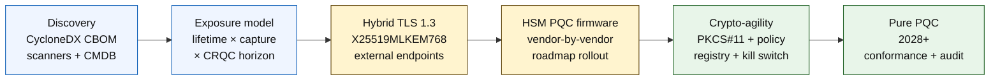

## The Quantum-Safe Banking Index pada 2026: Kriptografi Pasca-Kuantum, QKD, Ketangkasan Kripto, dan Risiko Harvest-Now-Decrypt-Later

Perbankan selamat-kuantum pada tahun 2026 adalah mengenai penghijrahan operasi, bukan spekulasi. NIST telah memuktamadkan tiga piawaian kriptografi pasca-kuantum yang pertama, dan bank kini mesti memahami sistem mana yang bergantung pada RSA, ECC, TLS, tandatangan, HSM, sijil, saluran pembayaran, arkib, dan data sulit hayat panjang. Soalan indeks adalah mudah: bolehkah institusi menggantikan kriptografi sebelum ancaman menjadi operasi?

---

> **Ringkasan Eksekutif / Perkara Penting**
>
> - **Piawaian NIST kini konkrit.** FIPS 203 mentakrifkan ML-KEM untuk penerangkuman kunci, FIPS 204 mentakrifkan ML-DSA untuk tandatangan, dan FIPS 205 mentakrifkan SLH-DSA sebagai piawaian tandatangan berasaskan cincang tanpa keadaan.
> - **Inventori ialah pintu kematangan pertama.** Sebuah bank tidak boleh menghijrahkan apa yang tidak dapat ditemuinya: sijil, kunci, protokol, aplikasi, vendor, HSM, API, arkib, dan sistem terbenam mesti dipetakan.
> - **Ketangkasan kripto ialah objektif yang tahan lama.** Matlamatnya bukan pertukaran algoritma sekali sahaja; ia adalah keupayaan untuk menukar primitif kriptografi tanpa mereka bentuk semula keseluruhan aplikasi.
> - **Data hayat panjang mengubah keperluan segera.** Risiko harvest-now-decrypt-later bermaksud data yang ditangkap hari ini mungkin menjadi boleh dibaca kemudian jika ia kekal bernilai cukup lama.
> - **[QKD](/2023-12-11-quantum-key-distribution-revolutionising-security-in-banking/index.html) ialah pelengkap khusus.** Pengagihan kunci kuantum mungkin relevan untuk saluran bernilai paling tinggi, tetapi ia tidak menggantikan penghijrahan PQC seluruh institusi.
>
---

## Mengapa 2026 Ialah Tahun Indeks Ini Penting

Tiga peralihan pada 2024-2025 menjadikan selamat-kuantum sebagai program bank yang boleh diukur dan bukannya titik pemantauan penyelidikan. Pertama, NIST memuktamadkan piawaian pasca-kuantum utama pada 13 Ogos 2024: [FIPS 203 (ML-KEM) ⧉](https://nvlpubs.nist.gov/nistpubs/FIPS/NIST.FIPS.203.pdf "FIPS 203 — Module-Lattice-Based Key-Encapsulation Mechanism"), [FIPS 204 (ML-DSA) ⧉](https://nvlpubs.nist.gov/nistpubs/FIPS/NIST.FIPS.204.pdf "FIPS 204 — Module-Lattice-Based Digital Signature Standard"), [FIPS 205 (SLH-DSA) ⧉](https://nvlpubs.nist.gov/nistpubs/FIPS/NIST.FIPS.205.pdf "FIPS 205 — Stateless Hash-Based Digital Signature Standard"). Perdebatan pemilihan algoritma ditutup pada tarikh tersebut; bank yang masih menjalankan aliran kerja dalaman "skema mana yang menang" pada tahun 2026 sudah ketinggalan 18 bulan.

Kedua, [CNSA 2.0 milik NSA ⧉](https://media.defense.gov/2022/Sep/07/2003071834/-1/-1/0/CSA_CNSA_2.0_ALGORITHMS_.PDF "Commercial National Security Algorithm Suite 2.0") menetapkan keadaan akhir persekutuan AS pada tahun 2033 dengan tarikh potong perantaraan bermula pada tahun 2027 untuk penandatanganan perisian dan perisian tegar, 2030 untuk pelayar dan sistem pengendalian. Mana-mana bank dengan pendedahan pihak lawan persekutuan AS — FedNow, operasi Perbendaharaan, akaun pelanggan persekutuan — berada dalam perimeter tersebut bagi sistem yang menyentuh data persekutuan. Jam itu tidak lagi abstrak.

Ketiga, [Harvest-Now-Decrypt-Later (HNDL) ⧉](https://csrc.nist.gov/Projects/post-quantum-cryptography "NIST Post-Quantum Cryptography programme") ialah hujah risiko yang menanggung beban bagi keperluan segera. Pihak lawan yang canggih sudah pun menangkap mesej pembayaran yang dilindungi TLS, sampul SWIFT, dokumentasi KYC, dan teks sifir arkib hayat panjang di pusat kewangan utama. Data yang ditangkap pada tahun 2026 hanya perlu kekal sensitif secara kerahsiaan pada saat penyahsulitan — bagi gadai janji 30 tahun, pengunderaitan insurans hayat, rakaman transaksi MiFID II / GDPR, dan arkib pengekalan M&A, tingkap tersebut memanjang jauh melepasi setiap anggaran munasabah untuk Komputer Kuantum Relevan Secara Kriptografi (CRQC). Pihak lawan tidak memerlukan komputer kuantum hari ini. Mereka memerlukannya sebelum data itu berhenti menjadi penting.

The Quantum-Safe Banking Index mengukur sama ada institusi anda boleh menyampaikan penghijrahan sebelum persilangan itu tiba. Kerja itu bukan lagi mengenai sama ada untuk menghijrah; ia adalah mengenai sama ada penghijrahan selesai pada garis masa yang boleh dipertahankan.

## Seni Bina Indeks 2026

| Lapisan Indeks | Hala Tuju 2026 | Metrik Kesediaan | Risiko Jika Tersalah Urus |
|---|---|---|---|
| **Inventori** | Petakan aset kriptografi, protokol, sijil, vendor, dan kelas data | Peratusan estet yang diinventorikan | Kebergantungan terdedah-kuantum yang tidak diketahui |
| **Pendedahan** | Kelaskan sistem mengikut hayat kerahsiaan dan kritikaliti transaksi | Aset berisiko tinggi mengikut nilai dan hayat | Penghijrahan yang tersalah keutamaan |
| **Penghijrahan** | Guna pakai corak hibrid dan sedia-PQC yang sejajar dengan piawaian NIST | Kesediaan ML-KEM dan ML-DSA | Pemplatforman semula kecemasan menjelang tarikh akhir |
| **Ketangkasan kripto** | Asingkan logik aplikasi daripada primitif kriptografi | Liputan kripto dikawal dasar | Algoritma berkod keras merentas estet |
| **Jaminan** | Uji kesalingoperasian, prestasi, sokongan HSM, sijil, dan kesediaan vendor | Kadar lulus ujian dan tunggakan pengecualian | Saluran rosak atau kawalan sandaran lemah |

### Kad Skor Kuantum Peringkat Lembaga

Sebuah kad skor kesediaan kuantum yang boleh dipercayai memerlukan penjejakan peratusan tepat, bukan hanya status projek:

1. **Kelengkapan Inventori:** Peratusan aplikasi peringkat-1 dengan Bil Bahan Kriptografi (CBOM) yang dipetakan sepenuhnya.
2. **Pendedahan HNDL:** Isi padu data sulit hayat panjang (cth., PII, rahsia dagangan) yang dihantar melalui rangkaian tanpa penerangkuman kunci selamat-kuantum hibrid.
3. **Kemajuan Penghijrahan NIST:** Peratusan kunci penyulitan asimetri dan tandatangan digital yang dihijrahkan kepada piawaian FIPS 203 (ML-KEM) dan FIPS 204 (ML-DSA).
4. **Kesediaan Ketangkasan Kripto:** Peratusan sistem kritikal di mana algoritma kriptografi boleh diputar melalui dasar berpusat tanpa memerlukan penyusunan semula kod.

## Isyarat Semasa untuk Dijejaki

| Isyarat | Maksudnya bagi Bank | Sumber |
|---|---|---|
| **FIPS 203 ML-KEM** | Piawaian NIST utama untuk pewujudan kunci penyulitan am | [NIST ⧉](https://www.nist.gov/news-events/news/2024/08/nist-releases-first-3-finalized-post-quantum-encryption-standards "First three finalized post-quantum encryption standards") |
| **FIPS 204 ML-DSA** | Piawaian NIST utama untuk tandatangan digital | [NIST ⧉](https://www.nist.gov/news-events/news/2024/08/nist-releases-first-3-finalized-post-quantum-encryption-standards "First three finalized post-quantum encryption standards") |
| **FIPS 205 SLH-DSA** | Alternatif tandatangan berasaskan cincang dan reka bentuk sandaran | [NIST ⧉](https://www.nist.gov/news-events/news/2024/08/nist-releases-first-3-finalized-post-quantum-encryption-standards "First three finalized post-quantum encryption standards") |
| **Penyepaduan segera digalakkan** | NIST secara jelas memberitahu pentadbir untuk mula menyepadukan piawaian kerana penyepaduan penuh mengambil masa | [NIST ⧉](https://www.nist.gov/news-events/news/2024/08/nist-releases-first-3-finalized-post-quantum-encryption-standards "First three finalized post-quantum encryption standards") |
| **Program kuantum bank sedang berkembang** | Bank-bank utama sedang meneroka teknologi kuantum sambil menyediakan peralihan PQC | [Quantum Insider ⧉](https://thequantuminsider.com/2026/03/27/15-plus-global-banks-probing-the-wonderful-world-of-quantum-technologies/ "Overview of global banks exploring quantum technologies") |

## Penghijrahan Bermula Dengan Lejar Kriptografi

Urutan penghijrahan telah difahami dengan baik pada peringkat ini. Setiap pintu menghasilkan bukti yang memacu pintu seterusnya; melangkau atau memampatkan sebuah pintu ialah apa yang menjana risiko pemplatforman semula kecemasan yang muncul dalam lajur kegagalan Seni Bina Indeks.

Penyampaian pertama bukanlah algoritma baharu; ia adalah bil bahan kriptografi (CBOM). Bank memerlukan inventori hidup yang menghubungkan perkhidmatan perniagaan kepada algoritma, pustaka, sijil, panjang kunci, HSM, hayat data, vendor, dan pemilik operasi. Tanpa lejar tersebut, penghijrahan selamat-kuantum menjadi tekaan.

Set rekod CBOM harus menangkap, bagi setiap primitif kriptografi: protokol atau antara muka (TLS 1.3, IPsec, SSH, format mesej pembayaran tersuai), algoritma dan set parameter (RSA-2048, ECDH P-256, ML-KEM-768, ML-DSA-65), pustaka dan versi (OpenSSL 3.4, cincangan komit BoringSSL, binaan SDK vendor), sempadan perkakasan (partisyen HSM, TPM, enklaf selamat, atau tiada), identiti sijil jika berkaitan, pemilik aplikasi, dan hayat pengelasan data. Alat yang mendarat dalam pengeluaran pada 2025-2026 — IBM Quantum Safe Inventory, [spesifikasi CycloneDX CBOM sumber terbuka ⧉](https://cyclonedx.org/capabilities/cbom/ "CycloneDX Cryptography Bill of Materials"), pengimbas perusahaan daripada CryptoNext / Sandbox / PQShield — bersepadu ke dalam saluran paip CMDB sedia ada. Tiada satu pun daripadanya lengkap dengan sendirinya; jangkakan kitaran pembinaan CBOM 12-18 bulan walaupun dengan perkakasan vendor dan tenaga kerja khusus.

Metrik untuk dijejaki ialah kesegaran, bukan liputan. Sebuah CBOM yang ketinggalan dua bulan adalah lebih buruk daripada tiada CBOM langsung kerana ia memberi pasukan keselamatan keyakinan palsu tentang apa yang telah dihijrahkan.

## Hibrid Dahulu, Tangkas Sentiasa

Kebanyakan bank tidak akan menukar segala-galanya sekaligus. Corak yang realistik ialah penggunaan hibrid, di mana mekanisme klasik dan pasca-kuantum berjalan bersama-sama sementara vendor, protokol, sijil, dan perkakasan operasi matang. Sasaran jangka panjang ialah ketangkasan kripto: pilihan kriptografi dikawal dasar yang boleh ditukar tanpa membina semula aplikasi perniagaan.

[Sisipkan Komponen Interaktif: Kalkulator Risiko Harvest-Now-Decrypt-Later (HNDL) — Satu alat berasaskan penggelongsor di mana eksekutif memasukkan hayat simpanan data lawan garis masa kuantum anggaran untuk melihat tingkap pendedahan mereka.]

> **Wawasan utama:** Jika data anda perlu kekal sulit selama 10 tahun, dan sebuah Komputer Kuantum Relevan Secara Kriptografi (CRQC) berada 7 tahun lagi, tarikh akhir penghijrahan anda bukan dalam 7 tahun — ia sudah 3 tahun yang lalu.

Dalam amalan, ini bermaksud TLS 1.3 dengan perkongsian kunci hibrid `X25519MLKEM768` untuk titik akhir menghadap luar (Chrome / Firefox / Cloudflare / Akamai semuanya menyokong ini hari ini), rantaian tandatangan klasik sehingga infrastruktur HSM dan CA menyusul, dan lapisan abstraksi PKCS#11 yang membolehkan daftar dasar memutar algoritma tanpa menyusun semula aplikasi perniagaan. Ketangkasan kripto ialah apa yang menentukan sama ada peralihan algoritma seterusnya (bila, bukan jika) ialah putaran enam minggu atau satu lagi program tujuh tahun.

## Di Mana QKD Bersesuaian

Pengagihan kunci kuantum tergolong dalam indeks sebagai pilihan saluran kepekaan tinggi, terutamanya untuk infrastruktur pasaran kewangan, kesambungan bank pusat, dan aliran institusi yang amat sensitif. Ia harus dianggap sebagai pelengkap kepada PQC, bukan sebagai alasan untuk menangguhkan penghijrahan perusahaan.

## Apa Maksudnya Mengikut Jenis Bank

### Bank Penting Secara Sistemik Global

Masalah sukarnya ialah skala: puluhan ribu titik akhir TLS, beratus-ratus partisyen HSM, berpuluh-puluh pihak berkuasa sijil dalaman, beratus-ratus aplikasi perniagaan dengan primitif kriptografi terbenam, dan SDK vendor yang tidak boleh diubah oleh bank. Pelaburan itu bukan satu lagi perintis; ia adalah perkakasan CBOM, lapisan abstraksi PKCS#11 yang disambungkan ke dalam setiap binaan baharu, pelan penyatuan HSM yang memilih satu vendor untuk mendahului perisian tegar PQC dan menerima ekor bertahun-tahun bagi yang lain, dan daftar dasar yang menjadi permukaan ketangkasan kripto tahan lama lama selepas penghijrahan FIPS 203 / 204 / 205 selesai.

### Bank Transaksi dan Korporat

Skop penghijrahan lebih sempit daripada peringkat G-SIB tetapi pendedahan HNDL adalah akut: pemesejan rentas sempadan SWIFT, data pembayaran berstruktur yang membawa PII pihak lawan korporat, platform pertukaran dokumen yang menyimpan dokumentasi pembiayaan dagangan, dan arkib pelaporan pengekalan panjang. Utamakan TLS hibrid pada setiap titik akhir menghadap pelanggan dan PQC pada rehat untuk arkib pengekalan. Tekan akauntabiliti vendor HSM — pasukan platform perbankan korporat mempunyai leverage perolehan langsung yang sering tiada pada pasukan teknologi borong.

### Bank Serantau

Beli tindanan vendor yang sudah mempunyai primitif ketangkasan kripto. Pilih platform perbankan teras yang vendornya menerbitkan CBOM dan komited kepada garis masa sokongan ML-KEM / ML-DSA. Sahkan bahawa peta jalan HSM vendor sejajar dengan tarikh akhir penghijrahan bank. Kapasiti kejuruteraan yang diperlukan untuk membina ketangkasan kripto dari awal adalah bertahun-tahun; vendor membayar kos itu merentas banyak pelanggan dan bank mewarisi manfaatnya. Kerja pengesahan — memeriksa dakwaan vendor bertahan proses MRM institusi — ialah skop dalaman yang sah.

### Fintech, PSP, dan Penyedia Infrastruktur

Soalan berdaya saing bagi vendor yang menjual kepada bank pada tahun 2026 bukanlah "adakah anda menyokong PQC." Ia adalah "bolehkah anda menghasilkan CBOM CycloneDX untuk platform anda, matriks sokongan vendor HSM, dan SLA putaran algoritma bertulis." Vendor yang menjawab ya akan lulus pintu perolehan peringkat-1 pada 2026-2027. Vendor yang tidak boleh akan kehilangan kitaran pembaharuan kepada pesaing yang boleh.

## Kesimpulan

Perbankan selamat-kuantum pada tahun 2026 bukanlah titik pemantauan penyelidikan; ia adalah program penyampaian dengan tarikh akhir yang ditetapkan oleh persilangan dua lengkung — hayat kerahsiaan data yang dipegang institusi hari ini, dan ufuk ketibaan Komputer Kuantum Relevan Secara Kriptografi. Institusi yang kelihatan boleh dipercayai kepada pengawal selia dan pihak lawan pada tahun 2030 ialah yang memulakan pembinaan CBOM pada tahun 2024, menggunakan TLS hibrid pada setiap titik akhir luaran menjelang penghujung 2026, dan mereka bentuk ketangkasan kripto ke dalam setiap binaan baharu dari hari pertama. Institusi yang tidak berbuat demikian akan mengetahui sama ada tingkap penghijrahan mereka telah pun tertutup bagi data yang dituai oleh pihak lawan mereka hari ini.

Ukur penghijrahan sebagaimana anda mengukur mana-mana program operasi: skop diketahui, urutan diutamakan, tarikh akhir dikomitkan, daftar pengecualian jujur. Semakin teliti anda memandang estet anda sendiri, semakin kecil rasa tingkap penghijrahan itu.

## Soalan Lazim

**Apakah yang harus diinventorikan oleh bank terlebih dahulu?**

Mulakan dengan TLS terdedah luaran, saluran pembayaran, pengesahan pelanggan, kesambungan antara bank, perkhidmatan disokong HSM, arkib jangka panjang, dan sistem yang mengendalikan data sulit dengan hayat berguna yang panjang.

**Adakah PQC hanya isu keselamatan siber?**

Tidak. Ia menjejaskan pembayaran, identiti, bukti undang-undang, penandatanganan transaksi, kepercayaan pelanggan, pengekalan data, pengurusan vendor, dan daya tahan operasi.

**Apakah maksud ketangkasan kripto?**

Ketangkasan kripto bermaksud keupayaan untuk menukar primitif kriptografi melalui dasar dan kawalan platform dan bukannya perubahan aplikasi berkod keras.

**Patutkah bank menunggu lebih banyak piawaian?**

Tidak. NIST telah menggalakkan pentadbir untuk mula menyepadukan piawaian muktamad pertama kerana penyepaduan penuh mengambil masa.

## Rujukan

- NIST, (2026). [First three finalized post-quantum encryption standards ⧉](https://www.nist.gov/news-events/news/2024/08/nist-releases-first-3-finalized-post-quantum-encryption-standards "First three finalized post-quantum encryption standards").
