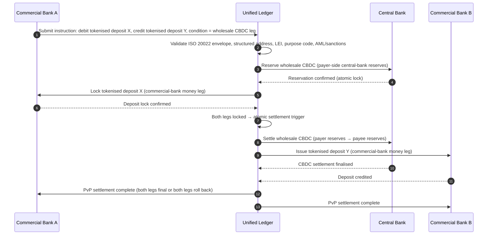

## Indeks Pembayaran Borong pada 2026: ISO 20022, Deposit Ditokenkan, Rel Masa Nyata, dan Penyelesaian Rentas Sempadan

Pembayaran borong pada 2026 sedang dibentuk semula oleh dua peralihan serentak: data pembayaran berstruktur dan penyelesaian boleh atur cara. Tonggak alamat berstruktur November 2026 SWIFT memaksa kualiti data masuk ke dalam model operasi, manakala BIS Project Agorá dan deposit ditokenkan sedang menguji sama ada penyelesaian rentas sempadan boleh menjadi lebih atom, telus, dan sentiasa dalam talian.

---

> **Ringkasan Eksekutif / Perkara Utama**
>
> - **November 2026 ialah tonggak data yang tegas.** SWIFT menyatakan bahawa pembayaran yang mengandungi alamat tidak berstruktur tidak lagi akan disokong selepas perubahan SR 2026.
> - **Data berstruktur menjadi infrastruktur produk.** Bandar dan negara mesti berada dalam medan yang ditetapkan sekurang-kurangnya, menjadikan kualiti data pembayaran satu isu pelanggan, operasi, dan pematuhan.
> - **Deposit ditokenkan ialah pilihan reka bentuk borong.** Project Agorá meneroka deposit bank perdagangan yang ditokenkan dan rizab bank pusat yang ditokenkan dalam model lejar bersatu.
> - **Indeks harus mengukur kualiti penyelesaian, bukan hanya kelajuan.** Kemuktamadan, ketelusan, kadar pembaikan, penggunaan kecairan, data pematuhan, dan keterlihatan pelanggan adalah sama penting seperti pelaksanaan segera.
> - **Pembayaran rentas sempadan kekal sebagai agenda awam-swasta.** FSB terus memacu peta jalan G20 melalui pelaksanaan, dengan penyelarasan sektor awam dan swasta.
>
---

## Mengapa 2026 Ialah Tahun Indeks Ini Penting

Stanford AI Index berguna kerana ia menganggap satu bidang teknologi yang bergerak pantas sebagai sesuatu yang boleh diukur: keluaran penyelidikan, prestasi teknikal, penggunaan bertanggungjawab, ekonomi, penerimaan sektor, dasar, dan sentimen awam dibawa ke dalam satu rangka tunggal ([Stanford HAI ⧉](https://hai.stanford.edu/ai-index/2026-ai-index-report "The 2026 AI Index Report")). Bank dan institusi kewangan kini memerlukan disiplin yang sama untuk infrastruktur. AI agentik, keselamatan selamat kuantum, daya tahan asli awan, dan pembayaran borong bukan lagi trek inovasi yang berasingan; ia sedang bertumpu menjadi satu model operasi.

Soalan praktikal untuk sebuah bank bukanlah sama ada setiap domain itu penting. Ia ialah sama ada institusi tersebut boleh mengukur kesediaan merentasi kesemuanya pada masa yang sama. Sebuah bank boleh menggunakan AI agentik dan masih rapuh jika kriptografinya tidak sedia untuk penghijrahan. Ia boleh memodenkan platform awan dan masih gagal jika data pembayaran kekal tidak berstruktur. Ia boleh menjalankan perintis pentokenan dan masih mewujudkan risiko sistemik jika lapisan penyelesaian, kecairan, identiti, dan audit tidak direka bersama-sama.

## Seni Bina Indeks 2026

| Lapisan Indeks | Arah 2026 | Metrik Kesediaan | Risiko Jika Tersalah Urus |
|---|---|---|---|
| **Data ISO 20022** | Beralih daripada teks tidak berstruktur kepada medan berstruktur yang ditadbir | Kesediaan alamat berstruktur dan kadar penolakan | Penolakan pembayaran dan pembaikan manual |
| **Orkestrasi rel** | Halakan merentasi rel RTGS, segera, koresponden, stablecoin, dan ditokenkan | Penghalaan yang sedar kos, kelajuan, kemuktamadan, dan bidang kuasa | Rel berpecah-belah dengan kawalan berganda |
| **Penyelesaian ditokenkan** | Gunakan deposit ditokenkan dan wang bank pusat di mana ia mengurangkan geseran | Liputan penyelesaian DvP, PvP, atom | Aset perintis tanpa nilai aliran kerja perniagaan |
| **Kecairan** | Optimumkan kecairan intraday, tunai terperangkap, dan tetingkap penyelesaian | Kecairan yang dijimatkan dan pengurangan kegagalan penyelesaian | Pengaliran kecairan yang lebih pantas |
| **Pematuhan** | Terapkan keperluan AML, sekatan, FATF, dan audit ke dalam data pembayaran | Pematuhan terus-menerus dan kebolehjelasan | Data lebih kaya tanpa kawalan lebih kukuh |

## Isyarat Utama Pembayaran Borong Dipetakan kepada Keutamaan Global

Set isyarat 2026 bukanlah agenda penyelidikan. Ia ialah senarai semak penyampaian yang seorang Ketua Pegawai Pembayaran bank sudah pun sedang diukur berdasarkannya. Kerja pemulihan muncul di tiga tempat: sampul mesej, lapisan orkestrasi rel, dan lejar penyelesaian.

| Isyarat | Rujukan G20 / SWIFT / BIS | Pelaksanaan Platform Teknikal |
|---|---|---|
| **65 % mesej pembayaran masih mengandungi alamat tidak berstruktur** | [SWIFT SR 2026 — tonggak alamat berstruktur, Nov 2026 ⧉](https://www.swift.com/news-events/news/iso-20022-milestone-november-2026-unstructured-addresses-be-removed "Tonggak alamat berstruktur ISO 20022 November 2026") | Pengesahan skema dalam perisian tengah pembayaran sebelum mesej mencecah penyesuai SWIFTNet; penghuraian alamat automatik pada kemasukan saluran korporat + bank koresponden. |
| **Sasaran G20 FSB: 75 % pembayaran rentas sempadan diselesaikan dalam masa 1 jam menjelang 2027** | [Peta jalan pembayaran rentas sempadan FSB, fasa pelaksanaan 2026 ⧉](https://www.fsb.org/2026/03/fsb-kicks-off-new-implementation-phase-to-enhance-cross-border-payments-through-public-private-partnership/ "Fasa pelaksanaan pembayaran rentas sempadan FSB") | Get laluan penukaran FX masa nyata dengan tetingkap kecairan yang dipersetujui terlebih dahulu; cangkuk pengesahan T+0 ke dalam portal pelanggan; enjin penghalaan rel yang mengecualikan mana-mana koridor yang tidak dapat memenuhi sampul 1 jam. |
| **Sasaran G20 FSB: purata kos transaksi rentas sempadan di bawah 1 %, runcit di bawah 3 %** | [Sasaran kuantitatif G20 FSB ⧉](https://www.fsb.org/2026/03/fsb-kicks-off-new-implementation-phase-to-enhance-cross-border-payments-through-public-private-partnership/ "Fasa pelaksanaan pembayaran rentas sempadan FSB") | Telemetri atribusi kos pada setiap koridor (spread FX, yuran koresponden, kos angkat); daftar dasar margin yang mendedahkan penetapan harga tidak patuh sebelum sebut harga. |
| **BIS Project Agorá memasuki fasa prototaip merentasi tujuh bank pusat + 41 bank perdagangan** | [BIS Project Agorá ⧉](https://www.bis.org/about/bisih/topics/fmis/agora.htm "Project Agorá") | Spesifikasi penyepaduan lejar bersatu: nod lejar deposit ditokenkan + satah penyelesaian CBDC borong + cangkuk KYC/AML; kolam kecairan atas rantai bersaiz mengikut bahagian koridor bank. |
| **Rangka kerja "wang digital" Deutsche Bank mengkristal dalam seni bina pelanggan** | [Deutsche Bank — Wang Digital: stablecoin, deposit ditokenkan dan CBDC ⧉](https://flow.db.com/publications/flow-white-papers-and-guides/digital-money-a-perspective-on-stablecoins-tokenised-deposits-and-cbdcs "Digital Money: stablecoins, tokenised deposits and CBDCs") | API penyelesaian agnostik dompet yang mengabstrakkan pemilihan stablecoin / deposit ditokenkan / CBDC bagi setiap pembayaran; syarat boleh atur cara dinilai terhadap daftar dasar bank, bukan pelanggan. |

## Titik Perubahan Data Pembayaran

ISO 20022 telah beralih daripada projek format pemesejan kepada model operasi kualiti data. Jika data benefisiari, penghutang, pemiutang, ejen, bandar, negara, tujuan, dan pihak adalah lemah, bank akan mengalami penolakan, pembaikan, geseran sekatan, kekecewaan pelanggan, dan analitik yang lemah.

**SR 2026 menjadikan ini kontrak yang tegas, bukan nasihat.** SWIFT Standards Release 2026 (November 2026) menguatkuasakan peraturan alamat berstruktur pada lapisan rangkaian — mesej yang unsur `<PstlAdr>`-nya tidak membawa `<TwnNm>` dan `<Ctry>` akan ditolak semasa penerimaan oleh timbunan pengesahan SWIFTNet, bukan ditandakan untuk pembaikan. Baris gilir pembaikan berhenti menjadi baris kos pejabat belakang dan menjadi peristiwa kegagalan penyelesaian dengan kelewatan yang boleh dilihat pelanggan. Pasukan operasi yang telah menganggap SR 2026 sebagai "panduan yang lebih ketat" sedang bekerja daripada buku panduan yang salah.

### Pematuhan Data Pembayaran Berstruktur di bawah ISO 20022

Permukaan pemulihan adalah sempit dan tersusun dengan jelas. Unsur XML di bawah ialah tempat timbunan pengesahan SWIFTNet November 2026 sebenarnya menggagalkan mesej; segala yang lain ialah akibat huluran.

| Unsur Data | Tag XML ISO 20022 | Keperluan SWIFT November 2026 | Strategi Pemulihan Teknikal |
|---|---|---|---|
| **Alamat Berstruktur** | `<PstlAdr>` mengandungi `<TwnNm>` + `<Ctry>` | Wajib. Teks `<AdrLine>` tidak berstruktur mencetuskan penolakan rangkaian pada penyesuai SWIFTNet penerima. | Penghuraian alamat automatik semasa permulaan pembayaran; penulisan semula borang saluran korporat; pembersihan buku lama pada setiap pihak lawan sebelum debit seterusnya. |
| **Pengecam Entiti Undang-undang (LEI)** | `<Id>` di bawah `<OrgId>` | Amat disyorkan untuk pengesahan pihak lawan kewangan bukan individu; wajib dalam beberapa koridor CBPR+. | Carian LEI + semak silang GLEIF semasa kemasukan korporat; pengayaan automatik untuk pihak lawan buku lama melalui perkhidmatan data rujukan. |
| **Kod Tujuan Pembayaran** | `<Purp>` mengandungi `<Cd>` | Wajib dalam pelbagai koridor masa nyata serantau (CBPR+, SEPA Inst, TIPS) untuk saringan AML / sekatan automatik. | Petakan kod transaksi warisan dalaman bank kepada senarai ExternalPurposeCode ISO 20022 standard; dedahkan pemilihan tujuan dalam UI saluran korporat; tolak-secara-lalai pada kod tidak dikenali. |
| **Pihak Muktamad** | `<UltmtDbtr>` / `<UltmtCdtr>` | Dedahkan konteks benefisiari muktamad untuk memenuhi parameter peraturan-perjalanan FATF G20 + sekatan; wajib untuk beberapa kod jenis pembayaran. | Ekstrak nama pihak hujung-ke-hujung daripada sub-akaun lejar; selaras dengan graf KYC; dedahkan pihak muktamad pada setiap pengesahan. |
| **Maklumat Kiriman Wang (Berstruktur)** | `<RmtInf><Strd>` dengan `<RfrdDocInf>` | Diperlukan untuk pembayaran korporat berpaut invois yang boleh dicocokkan di bawah CBPR+ Fasa 2. | Tangkap kiriman wang berstruktur semasa sebut harga dalam portal korporat; tolak sandaran teks bebas untuk aliran bernilai tinggi. |

## Deposit Ditokenkan dan CBDC Borong

Deposit ditokenkan mengekalkan model wang bank perdagangan sambil menambah kebolehaturcaraan. Wang bank pusat borong mengekalkan kemuktamadan penyelesaian. Corak reka bentuk yang menarik ialah gabungan: wang bank perdagangan untuk hubungan pelanggan dan pengantaraan kredit, wang bank pusat untuk penyelesaian muktamad dan keyakinan sistemik.

Project Agorá menjadikan gabungan itu konkrit. Seni bina di bawah ialah corak rujukan BIS untuk penyelesaian rentas sempadan pembayaran-lawan-pembayaran (PvP) yang atom menggunakan kedua-dua lejar deposit bank perdagangan dan satah penyelesaian CBDC borong, diselaraskan melalui lejar bersatu.

Penyelesaian itu bersifat atom secara pembinaan: kedua-dua kaki komit atau kedua-duanya berundur. Kemuktamadan penyelesaian pada kaki CBDC borong menjadikan pemindahan deposit ditokenkan bank perdagangan berkesan tanpa risiko koresponden. Lejar bersatu ialah satah penyelarasan, bukan sistem pembayaran dengan sendirinya — bank pusat masih mengeluarkan aset penyelesaian dan bank perdagangan masih membukukan liabiliti deposit.

## Produk Pembayaran Borong yang Baharu

Produk itu bukan lagi sekadar pembayaran. Ia ialah himpunan pelaksanaan, data, kecairan, pematuhan, kebolehkesanan, dan pengurusan pengecualian. Bank yang boleh mendedahkan keupayaan tersebut melalui API dan papan pemuka pelanggan akan menukar pematuhan infrastruktur menjadi nilai pelanggan.

## Apa Yang Ini Bermakna Mengikut Jenis Bank

### Bank Penting Secara Sistemik Global

Bank global harus menganggap indeks ini sebagai kad skor seni bina perusahaan. Keutamaannya bukanlah satu lagi bukti konsep; ia ialah bukti bahawa aliran kerja autonomi, penghijrahan kriptografi, kebergantungan awan, dan pemodenan pembayaran boleh ditadbir sebagai satu sistem risiko dan nilai tunggal.

### Bank Transaksi dan Bank Korporat

Bank transaksi harus menumpukan pada pembayaran borong, data berstruktur, kecairan, deposit ditokenkan, dan perkhidmatan perbendaharaan agentik. Cadangan pelanggan yang paling bernilai bukanlah pergerakan wang yang lebih pantas semata-mata; ia ialah pergerakan wang yang boleh dijelaskan, boleh diaudit, dan boleh diatur cara dengan lebih sedikit siasatan dan keterlihatan modal kerja yang lebih baik.

### Bank Serantau

Bank serantau harus menggunakan indeks ini untuk mengelakkan perebakan program. Mereka tidak perlu mendahului setiap sempadan, tetapi mereka perlu mempunyai pendirian yang meyakinkan mengenai tadbir urus AI, inventori pasca-kuantum, bukti keluar awan, dan kesediaan data pembayaran.

### Fintek, PSP, dan Penyedia Infrastruktur

Fintek dan penyedia infrastruktur harus menyelaraskan peta jalan produk mereka dengan kesediaan bank yang boleh diukur. Cadangan terbaik akan mengurangkan risiko penyepaduan, mengukuhkan bukti, dan menjadikan infrastruktur yang kompleks lebih mudah untuk ditadbir oleh bank.

## Kesimpulan

Nilai laporan bergaya indeks ialah ia menukar agenda teknologi yang berpecah-belah menjadi model operasi yang boleh diukur. Pada 2026, pemenang dalam infrastruktur kewangan bukanlah institusi yang mempunyai perintis paling banyak. Mereka ialah institusi yang boleh membuktikan kesediaan merentasi autonomi, keselamatan, daya tahan, penyelesaian, ekonomi, dan tadbir urus pada masa yang sama.

## Soalan Lazim

**Mengapa ISO 20022 masih menjadi isu pada 2026?**

Kerana penghijrahan itu belum selesai sehingga data pembayaran berstruktur, ditadbir, ditangkap di sumber, dan boleh digunakan merentasi saluran, pelanggan, dan infrastruktur pasaran.

**Apakah itu deposit ditokenkan?**

Deposit ditokenkan ialah perwakilan digital wang bank perdagangan, direka untuk mengekalkan hubungan bank–pendeposit sambil membolehkan penyelesaian boleh atur cara.

**Adakah deposit ditokenkan menggantikan stablecoin?**

Tidak di mana-mana. Stablecoin mungkin kekal berguna dalam sesetengah konteks aset digital dan rentas sempadan, manakala deposit ditokenkan secara struktur menarik untuk perbankan borong yang dikawal selia.

**Apa yang harus diukur oleh bank?**

Ukur kesediaan data berstruktur, penolakan pembayaran, kos pembaikan, masa penyelesaian, penggunaan kecairan, hasil penghalaan rel, dan keterlihatan pelanggan.

## Rujukan

- SWIFT, (2026). [Tonggak alamat berstruktur ISO 20022 November 2026 ⧉](https://www.swift.com/news-events/news/iso-20022-milestone-november-2026-unstructured-addresses-be-removed "Tonggak alamat berstruktur ISO 20022 November 2026").
- BIS Innovation Hub, (2026). [Project Agorá ⧉](https://www.bis.org/about/bisih/topics/fmis/agora.htm "Project Agorá").
- FSB, (2026). [Fasa pelaksanaan pembayaran rentas sempadan ⧉](https://www.fsb.org/2026/03/fsb-kicks-off-new-implementation-phase-to-enhance-cross-border-payments-through-public-private-partnership/ "Fasa pelaksanaan pembayaran rentas sempadan").
- Deutsche Bank, (2026). [Wang Digital: stablecoin, deposit ditokenkan dan CBDC ⧉](https://flow.db.com/publications/flow-white-papers-and-guides/digital-money-a-perspective-on-stablecoins-tokenised-deposits-and-cbdcs "Digital Money: stablecoins, tokenised deposits and CBDCs").
