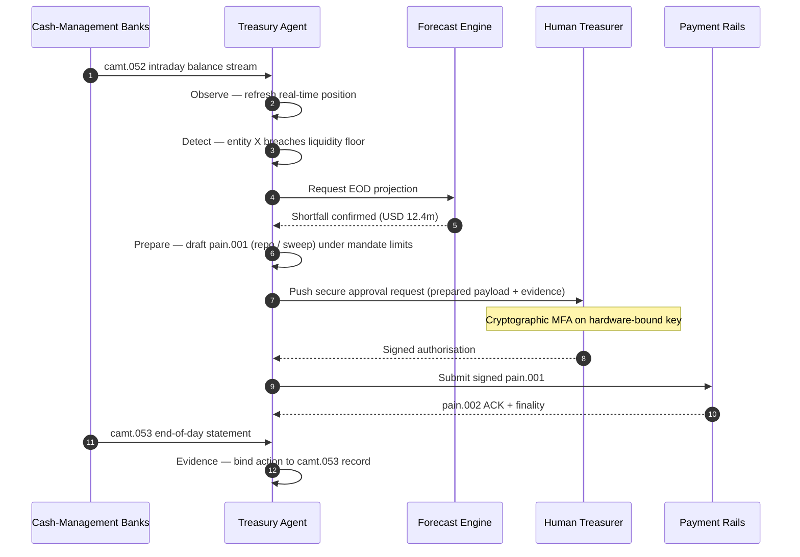

## Indeks Perbendaharaan Autonomi pada 2026: Perbendaharaan Agentik, Kecairan Boleh Aturcara, Deposit Ditokenkan, dan Kawalan Tunai Masa Nyata

Perbendaharaan autonomi ialah titik pertemuan semula jadi bagi AI agentik, pembayaran borong, deposit ditokenkan, dan kecairan masa nyata. Pada 2026, seni bina perbendaharaan terbaik bukan sekadar meramalkan tunai; ia akan mengesyorkan, menerangkan, dan akhirnya melaksanakan tindakan kecairan bersempadan merentasi akaun, mata wang, landasan, dan aset penyelesaian.

---

> **Ringkasan Eksekutif / Intipati Utama**
>
> - **Perbendaharaan beralih daripada pelaporan kepada kawalan.** Baki masa nyata, ramalan, status pembayaran, dan pergerakan kecairan sedang menjadi sebahagian daripada satu aliran kerja.
> - **AI agentik mewujudkan antara muka perbendaharaan yang baharu.** Ejen boleh memantau kedudukan, menonjolkan anomali, menyediakan tindakan pembiayaan, dan meningkatkan keputusan dalam mandat yang ditetapkan.
> - **Wang boleh aturcara mengubah kaki tunai.** Deposit ditokenkan dan eksperimen CBDC borong mewujudkan kemungkinan baharu untuk penyelesaian atomik, pembayaran bersyarat, dan kecairan sentiasa aktif.
> - **Indeks mesti mengukur kuasa.** Persoalannya bukan sama ada ejen boleh mencadangkan sesuatu tindakan; ia adalah sama ada kuasa, had, kelulusan, dan bukti itu jelas.
> - **Nilai perbendaharaan boleh diukur.** Kecairan yang dijimatkan, siasatan manual yang dikurangkan, kegagalan penyelesaian yang dielakkan, dan modal kerja yang dilepaskan seharusnya mentakrifkan kejayaan.
>
---

## Mengapa 2026 Ialah Tahun Indeks Ini Penting

Stanford AI Index berguna kerana ia menganggap bidang teknologi yang bergerak pantas sebagai sesuatu yang boleh diukur: keluaran penyelidikan, prestasi teknikal, penggunaan bertanggungjawab, ekonomi, penerimaan sektor, dasar, dan sentimen awam dibawa ke dalam satu kerangka ([Stanford HAI ⧉](https://hai.stanford.edu/ai-index/2026-ai-index-report "The 2026 AI Index Report")). Bank dan institusi kewangan kini memerlukan disiplin yang sama untuk infrastruktur. AI agentik, keselamatan selamat-kuantum, daya tahan cloud native, dan pembayaran borong bukan lagi trek inovasi yang berasingan; ia sedang menumpu menjadi satu model pengendalian.

Persoalan praktikal bagi sebuah bank bukanlah sama ada setiap domain itu penting. Persoalannya ialah sama ada institusi itu boleh mengukur kesediaan merentasi kesemuanya pada masa yang sama. Sebuah bank boleh menggunakan AI agentik dan masih rapuh jika kriptografinya tidak bersedia untuk migrasi. Ia boleh memodenkan platform cloud dan masih gagal jika data pembayaran kekal tidak berstruktur. Ia boleh menjalankan perintis tokenisasi dan masih mewujudkan risiko sistemik jika lapisan penyelesaian, kecairan, identiti, dan audit tidak direka bersama.

## Seni Bina Indeks 2026

| Lapisan Indeks | Hala Tuju 2026 | Metrik Kesediaan | Risiko jika Tersalah Urus |
|---|---|---|---|
| **Keterlihatan** | Menyatukan data akaun, pembayaran, kecairan, dan pendedahan | Liputan kedudukan tunai masa nyata | Keterlihatan tunai berpecah-belah |
| **Peramalan** | Menggunakan AI untuk meramal baki, aliran, dan keperluan pembiayaan | Ketepatan ramalan dan kadar pengecualian | Keyakinan palsu terhadap data lemah |
| **Autonomi** | Memberi ejen kuasa bersempadan untuk cadangan dan tindakan | Liputan mandat dan kualiti kelulusan | Tindakan tanpa kebenaran atau tanpa penjelasan |
| **Kebolehaturcaraan** | Menggunakan deposit ditokenkan dan syarat pintar di tempat ia menambah nilai | Kes penggunaan pembayaran bersyarat dan penyelesaian atomik | Perintis perbendaharaan dipacu teknologi |
| **Kawalan** | Menyerapkan had, sekatan, FX, kecairan, dan kawalan audit | Bukti kawalan bagi setiap tindakan perbendaharaan | Tadbir urus manual selepas pelaksanaan |

## Isyarat Semasa untuk Dipantau

| Isyarat | Maknanya bagi Bank | Sumber |
|---|---|---|
| **52% penerimaan AI agentik dalam perkhidmatan kewangan** | Perbendaharaan kini boleh menyerap aliran kerja agentik melalui platform yang ditadbir | [Cambridge CCAF ⧉](https://www.jbs.cam.ac.uk/faculty-research/centres/alternative-finance/publications/2026-global-ai-in-financial-services-report/ "2026 Global AI in Financial Services Report") |
| **Pembayaran bersyarat Project Agorá** | Tokenisasi mungkin membolehkan keupayaan pembayaran bersyarat dan sentiasa aktif | [BIS ⧉](https://www.bis.org/about/bisih/topics/fmis/agora.htm "Project Agorá") |
| **Digital Securities Sandbox Bank of England** | Bon dan ekuiti yang diterbitkan melalui DLT diselesaikan atas dasar Penyerahan-lawan-Pembayaran (DvP) — kaki aset dan kaki tunai (CBDC borong atau deposit bank perdagangan yang ditokenkan) diselesaikan dalam transaksi atomik yang sama, menghapuskan risiko pihak lawan prinsipal | [Bank of England ⧉](https://www.bankofengland.co.uk/financial-stability/digital-securities-sandbox "Digital Securities Sandbox") |
| **Tarikh akhir alamat berstruktur SWIFT** | Data perbendaharaan mesti ditangkap dengan betul di sumber | [SWIFT ⧉](https://www.swift.com/news-events/news/iso-20022-milestone-november-2026-unstructured-addresses-be-removed "ISO 20022 November 2026 structured address milestone") |
| **FI besar bergelut untuk mengukur nilai AI** | Automasi perbendaharaan memerlukan metrik ekonomi yang kukuh | [Cambridge CCAF ⧉](https://www.jbs.cam.ac.uk/faculty-research/centres/alternative-finance/publications/2026-global-ai-in-financial-services-report/ "2026 Global AI in Financial Services Report") |

## Mandat Ejen Perbendaharaan

Sebuah ejen perbendaharaan tidak seharusnya direka sebagai pembantu serba guna. Ia memerlukan mandat: memerhati akaun, mengesan pengecualian, meramal jurang pembiayaan, menyediakan tindakan, meminta kelulusan, melaksanakan dalam had, dan menghasilkan bukti. Setiap langkah seharusnya mempunyai model kuasa yang berbeza.

Gelung kawalan berjalan Perhati → Kesan → Ramal → Sedia → Minta Kelulusan — dan berhenti. Ejen itu tidak pernah melintasi sempadan kebenaran kriptografi dengan sendirinya. Rajah di bawah menjejak satu kitaran penuh: kekurangan kecairan intraday bernilai berjuta-juta dolar muncul dalam telemetri `camt.052`, ejen meramal kedudukan hujung hari, menyediakan repo atau sapuan antara syarikat sebagai `pain.001` yang terbentuk sepenuhnya, dan menyerahkannya kepada juruwang manusia untuk tandatangan kriptografi berbilang faktor pada kunci terikat perkakasan. Ejen kemudian menghantar muatan yang ditandatangani itu; kemuktamadan tiba sebagai pengesahan (ACK) `pain.002` dan `camt.053` rekod seterusnya.

Sempadan itulah intinya — setiap tindakan yang menggerakkan wang sebenar berada di belakang pintu kriptografi yang tidak dapat dipenuhi oleh ejen dengan sendirinya.

## Kecairan Boleh Aturcara

Kecairan boleh aturcara ialah keupayaan untuk memindahkan nilai dengan syarat: jika ambang dilanggar, jika cagaran layak, jika pihak lawan lulus saringan, jika kemuktamadan penyelesaian tersedia, atau jika penampan kecairan intraday terlalu rendah. Deposit ditokenkan dan platform penyelesaian borong menjadikan corak-corak ini lebih praktikal.

Boleh aturcara tidak bermaksud lari daripada standard. Laluan pelaksanaannya ialah `pain.001` — [ISO 20022](/2023-09-29-automating-iso-20022-compliant-payment-file-creation-with-pain001/index.html) Customer Credit Transfer Initiation. Tindakan yang disediakan oleh ejen ialah muatan `pain.001` yang terbentuk sepenuhnya, dihalakan ke bank melalui saluran yang sama seperti yang akan digunakan oleh ERP korporat, disahkan terhadap skema yang sama, diberi skor oleh enjin penipuan dan sekatan yang sama, dan diakui pada laporan status `pain.002` yang sama. Lapisan kebersyaratan (ambang, kelayakan cagaran, ketersediaan kemuktamadan, aras penampan) berada di atas mesej itu — ia mengawal *sama ada* sesuatu `pain.001` dihantar, bukan *bentuk apa* yang diambilnya. Platform perbendaharaan yang mencipta muatan tersuai untuk menyatakan syarat akan terkeluar daripada laluan yang boleh digunakan oleh bank dan kembali kepada integrasi dua hala.

## Bilik Kawalan Perbendaharaan

Model pengendalian seharusnya kelihatan seperti bilik kawalan: kedudukan, ramalan, keadaan pembayaran, penggunaan had, pengecualian, kelulusan, dan bukti dalam satu antara muka. Indeks seharusnya menghukum tindanan perbendaharaan yang memerlukan pasukan menyambungkan e-mel, hamparan, portal bank, dan papan pemuka yang tidak berhubung.

Satah data di sebalik antara muka itu ialah pengurusan tunai ISO 20022. Kedudukan intraday ialah `camt.052` — Bank-to-Customer Account Report — dialirkan daripada setiap bank pengurusan tunai ke dalam lapisan pemerhatian ejen pada kekerapan yang diterbitkan oleh bank (dalam beberapa minit untuk penyedia GTB tier-1, hujung kitaran untuk ekor panjang). Penyesuaian hujung hari ialah `camt.053` — Bank-to-Customer Statement — rekod yang boleh diaudit yang menjadi ukuran nilai ramalan ejen keesokan paginya. Platform perbendaharaan yang membaca penyata PDF atau mengikis skrin portal bank tidak dapat memenuhi Tahap 4 indeks ini; telemetri intraday mesti tiba sebagai `camt.052` berstruktur agar gelung ramalan dapat ditutup tepat pada masanya untuk bertindak.

## Apa Maknanya Mengikut Jenis Bank

### Bank Penting Secara Sistemik Global

Bank global seharusnya menganggap indeks ini sebagai kad markah seni bina perusahaan. Keutamaannya bukan satu lagi bukti konsep; ia adalah bukti bahawa aliran kerja autonomi, migrasi kriptografi, kebergantungan cloud, dan pemodenan pembayaran boleh ditadbir sebagai satu sistem risiko dan nilai.

### Bank Transaksi dan Bank Korporat

Bank transaksi seharusnya memberi tumpuan kepada pembayaran borong, data berstruktur, kecairan, deposit ditokenkan, dan perkhidmatan perbendaharaan agentik. Cadangan pelanggan yang paling bernilai bukan sekadar pergerakan wang yang lebih pantas; ia adalah pergerakan wang yang boleh diterangkan, boleh diaudit, dan boleh diaturcara dengan lebih sedikit siasatan dan keterlihatan modal kerja yang lebih baik.

### Bank Serantau

Bank serantau seharusnya menggunakan indeks ini untuk mengelakkan program yang berselerak. Mereka tidak perlu memimpin setiap sempadan, tetapi mereka memang perlu mempunyai kedudukan yang boleh dipercayai dalam tadbir urus AI, inventori pasca-kuantum, bukti keluar cloud, dan kesediaan data pembayaran.

### Fintech, PSP, dan Penyedia Infrastruktur

Fintech dan penyedia infrastruktur seharusnya menyelaraskan peta jalan produk mereka dengan kesediaan bank yang boleh diukur. Cadangan terbaik akan mengurangkan risiko integrasi, mengukuhkan bukti, dan menjadikan infrastruktur yang kompleks lebih mudah untuk ditadbir oleh bank.

## Kesimpulan

Nilai laporan bergaya indeks ialah ia menukarkan agenda teknologi yang berpecah-belah menjadi model pengendalian yang boleh diukur. Pada 2026, pemenang dalam infrastruktur kewangan bukanlah institusi yang mempunyai paling banyak perintis. Mereka ialah institusi yang dapat membuktikan kesediaan merentasi autonomi, keselamatan, daya tahan, penyelesaian, ekonomi, dan tadbir urus pada masa yang sama.

## Soalan Lazim

**Apakah itu perbendaharaan autonomi?**

Perbendaharaan autonomi ialah penggunaan ejen AI, data masa nyata, dan pembayaran boleh aturcara untuk memantau, mengesyorkan, dan berpotensi melaksanakan tindakan perbendaharaan dalam kawalan yang ditetapkan.

**Patutkah ejen perbendaharaan dibenarkan melaksanakan pembayaran?**

Hanya dalam mandat yang sempit, had yang kukuh, kelulusan yang jelas, dan kebolehauditan penuh. Kuasa pelaksanaan seharusnya diperoleh melalui kematangan.

**Bagaimana deposit ditokenkan membantu perbendaharaan?**

Ia boleh menyokong penyelesaian boleh aturcara, pelaksanaan atomik, dan berpotensi kawalan kecairan intraday yang lebih baik sambil mengekalkan hubungan wang bank perdagangan.

**Apakah langkah pelaksanaan pertama?**

Bina keterlihatan masa nyata dan kualiti data sebelum memberikan autonomi. Ejen tidak dapat mengoptimumkan tunai dengan selamat sekiranya ia tidak dapat melihatnya dengan tepat.

## Rujukan

- Cambridge Centre for Alternative Finance, (2026). [2026 Global AI in Financial Services Report ⧉](https://www.jbs.cam.ac.uk/faculty-research/centres/alternative-finance/publications/2026-global-ai-in-financial-services-report/ "2026 Global AI in Financial Services Report").
- SWIFT, (2026). [ISO 20022 November 2026 structured address milestone ⧉](https://www.swift.com/news-events/news/iso-20022-milestone-november-2026-unstructured-addresses-be-removed "ISO 20022 November 2026 structured address milestone").
- BIS Innovation Hub, (2026). [Project Agorá ⧉](https://www.bis.org/about/bisih/topics/fmis/agora.htm "Project Agorá").
- Bank of England, (2026). [Shaping the UK's digital financial future ⧉](https://www.bankofengland.co.uk/speech/2025/january/sasha-mills-speech-at-the-tokenisation-summit "Shaping the UK's digital financial future").
