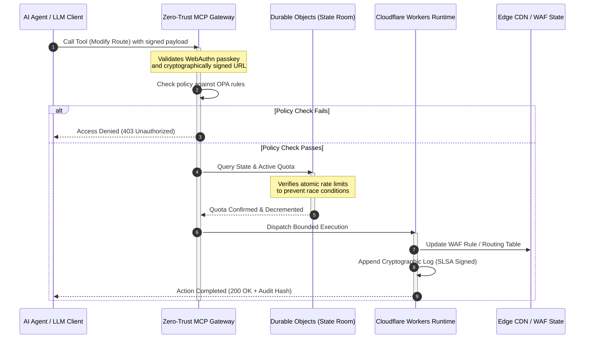

## CloudCDN: Rangka Tindakan Sumber Terbuka untuk Edge AI-Native pada 2026

Perdebatan tentang CDN sudah berakhir. Edge bukan lagi sekadar cache; ia ialah satah kawalan untuk perisian AI-native. Apabila ejen memanggil alat, memindahkan data, membersihkan cache, meminta URL bertandatangan, dan menyelaraskan aliran kerja, model lama papan pemuka legap dan satah kawalan proprietari bukan lagi sekadar gangguan tetapi menjadi liabiliti kawal selia. CloudCDN memperjuangkan model yang berbeza: platform edge yang terbuka, boleh diperiksa, dan boleh dikawal ejen, yang memperlakukan keselamatan, kebolehcapaian, prestasi, dan kebolehauditan sebagai lalai yang boleh dikuatkuasakan dan bukan janji vendor.

Titik rujukan sumber terbuka untuk artikel ini ialah [cloudcdn.pro ⧉](https://github.com/sebastienrousseau/cloudcdn.pro "cloudcdn.pro"). Repositori ini ialah CDN AI-native berbilang penyewa yang boleh dibaca dari hujung ke hujung dan digunakan secara bebas: TTFB bawah 100ms merentas Cloudflare PoP, kawalan MCP, penghadan kadar Durable Objects, kebolehcapaian WCAG-AA, URL bertandatangan, kunci laluan, SLSA Level 3, dan 3,185 ujian pada liputan 100%.

---

> **Ringkasan Eksekutif / Perkara Penting**
>
> - **Edge menjadi sempadan operasi.** CloudCDN menukar nod CDN standard menjadi get dasar aktif yang melaksanakan keselamatan, penghalaan, dan kawalan capaian dalam masa bawah satu milisaat.
> - **Durable Objects menjadikan penghadan kadar atomik.** Penguatkuasaan kuota masa nyata yang konsisten secara global menutup tetingkap keadaan perlumbaan yang dibiarkan terbuka oleh penghad yang konsisten akhirnya kepada penyerang dan ejen yang tidak berfungsi.
> - **Ejen mengendalikan infrastruktur melalui 42 alat MCP yang terikat.** Setiap panggilan disahkan terhadap kunci laluan WebAuthn, muatan bertandatangan, dan dasar OPA sebelum apa-apa dilaksanakan.
> - **Rantaian bekalan adalah sebahagian daripada produk.** Asal-usul SLSA Level 3 melalui Sigstore/Cosign memaut setiap keluaran secara kriptografi kepada sumbernya yang telah diaudit.
> - **Telemetri ialah bukti pematuhan.** Operasi edge dipetakan kepada DORA Artikel 5, BCBS 239, dan modal risiko operasi Basel III secara langsung, bukan melalui pelaporan selepas peristiwa.
>
---

## Mengapa Projek Sumber Terbuka Ini Penting pada 2026

IT perusahaan pada 2026 telah beralih daripada peruntukan infrastruktur statik kepada orkestrasi data masa nyata yang dipacu peristiwa. Dua daya pasaran mendorong peralihan ini.

Yang pertama ialah percambahan AI agentik. Model autonomi dan ejen perisian kini menjalankan tugas operasi yang rumit: mitigasi ancaman automatik, keputusan penghalaan, pengimbangan lejar masa nyata. Mereka tidak menggunakan papan pemuka. Mereka memanggil alat.

Yang kedua ialah penguatkuasaan aktif [Akta Daya Tahan Operasi Digital (DORA) ⧉](https://eur-lex.europa.eu/legal-content/EN/TXT/?uri=CELEX%3A32022R2554 "Regulation (EU) 2022/2554 on digital operational resilience for the financial sector"). Institusi perbankan tidak boleh lagi bergantung pada CDN pihak ketiga yang legap dan proprietari. Pengawal selia menuntut keterlihatan lengkap terhadap rantaian bekalan perisian, keupayaan keluar yang boleh disahkan, dan jejak audit kriptografi yang tidak boleh diubah.

Seni bina pelayan terpusat mengenakan penalti kependaman yang tidak dapat diserap oleh orkestrasi masa nyata. CDN proprietari berfungsi sebagai kotak hitam yang mendedahkan institusi kepada kompromi rantaian bekalan yang tidak dapat mereka lihat, apatah lagi buktikan. CloudCDN menutup jurang itu dengan rangka tindakan sumber terbuka yang telus dan zero-trust yang mengubah edge menjadi satah kawalan aktif. Bagi eksekutif teknologi, ia mengalihkan perbualan daripada kos pematuhan kepada pulangan daya tahan: modal yang terpelihara oleh saluran paip operasi yang automatik dan sedia audit.

## Lensa Seni Bina

Seni bina CloudCDN distrukturkan merentas lima lapisan, menggantikan middleware terpusat dengan primitif edge tempatan yang berkeadaan:

| Lapisan | Keputusan Reka Bentuk | Mengapa Ia Penting | Risiko Jika Tersalah Urus |
|---|---|---|---|
| **Masa jalan edge** | Cloudflare Workers dan Pages | Menghapuskan kependaman VM terpusat; melaksanakan dasar dalam masa bawah satu milisaat secara global | Peningkatan prestasi tanpa disiplin dasar menghasilkan hanyutan edge yang kacau-bilau |
| **Penyelarasan keadaan** | Durable Objects | Menjamin konsistensi atomik masa nyata untuk had kadar dan keadaan kongsi merentas rantau | Keadaan perlumbaan teragih, penyalahgunaan sumber API, kuota perimeter dipintas |
| **Antara muka ejen** | Get MCP zero-trust | Mendedahkan 42 alat MCP khusus supaya ejen AI mengendalikan infrastruktur dalam had yang ditadbir | Panggilan alat yang tidak terikat dan perubahan konfigurasi tanpa kebenaran |
| **Kawalan capaian** | Kunci laluan WebAuthn dan URL bertandatangan | Menggantikan kata laluan statik dengan tandatangan kriptografi untuk operasi yang boleh diaudit | Perubahan yang lemah atributnya; kecurian kelayakan membawa kepada pelanggaran perimeter |
| **Get kualiti** | SLSA Level 3 dan liputan ujian 100% | Mengesahkan sumber binaan secara matematik; menghalang suntikan kebergantungan berniat jahat | Kod berniat jahat disisipkan melalui rantaian bekalan perisian |

## Isyarat Operasi untuk Dipantau

Kesediaan edge boleh diukur. Berikut ialah penunjuk kuantitatif yang menunjukkan keupayaan pelaksanaan dan bukan sekadar niat:

| Isyarat | Metrik / Penanda Aras | Rujukan Kawal Selia | Pelaksanaan Platform |
|---|---|---|---|
| **42 alat MCP** | Kiraan pendaftaran alat yang terikat untuk pengurusan automatik | COBIT 2019 (BAI06) | Get MCP mengesahkan tandatangan ejen terhadap dasar OPA |
| **Durable Objects** | Penguatkuasaan kuota atomik tanpa kebocoran dalam masa bawah satu milisaat | DORA Artikel 6 | Durable Objects menjejaki keadaan kuota API global |
| **Kunci laluan dan URL bertandatangan** | 100% sesi pentadbir disahkan melalui FIDO2 WebAuthn | DORA Artikel 30 | Semakan tandatangan kriptografi terbenam dalam penghala edge |
| **SLSA Level 3** | Manifes binaan yang ditandatangani secara kriptografi (Sigstore) | DORA Artikel 30 | Saluran paip GitHub Actions menjana metadata binaan bertandatangan |
| **3,185 ujian unit** | Liputan 100%; get regresi pada setiap keluaran | NIST CSF 2.0 (PR.DS-01) | Saluran paip CI menghentikan pengerahan pada sebarang kegagalan ujian |

## CDN Menjadi Satah Kawalan Aktif

CDN tradisional direka bentuk berteraskan pemecutan kandungan statik yang pasif. CloudCDN mentakrifkan semula model itu. Dengan Cloudflare Workers dan Durable Objects disepadukan, edge berfungsi sebagai get dasar yang aktif dan berkeadaan.

Apabila ejen AI atau proses automatik meminta perubahan konfigurasi infrastruktur atau pelarasan penghalaan, ia tidak bercakap dengan pangkalan data terpusat yang mudah terdedah. Permintaan itu dipintas di nod edge terdekat dan dibawa melalui semakan identiti, dasar, dan kuota sebelum apa-apa dilaksanakan:

Setiap langkah dalam urutan itu menghasilkan rekod bertandatangan yang boleh diatributkan. Itulah perbezaan antara CDN yang mempercepatkan kandungan dan satah kawalan yang boleh ditadbir.

## Mengapa Sumber Terbuka Mengubah Model Kepercayaan

Bagi Ketua Pegawai Keselamatan Maklumat, CDN proprietari yang legap membentangkan risiko yang berganda. Rangkaian edge sumber tertutup ialah kotak hitam: jika vendor mengalami kompromi dalaman, bank mempunyai sifar keterlihatan sehingga pelanggaran itu didedahkan secara terbuka.

CloudCDN menggantikan ketaksimetrian itu dengan model kepercayaan sumber terbuka yang boleh diaudit sepenuhnya, dibina atas tiga mekanisme:

1. **Asal-usul binaan secara matematik.** Di bawah SLSA Level 3, setiap keluaran dipaut secara kriptografi kepada repositori GitHub sumber terbukanya. Seorang CISO boleh mengesahkan, secara matematik dan bukan secara kontrak, bahawa binari yang berjalan pada nod edge global Cloudflare mengandungi kod sumber teraudit yang tepat.
2. **Audit keselamatan awam yang berterusan.** Pangkalan kod tertakluk kepada imbasan automatik, pendedahan kerentanan awam, dan audit kod yang disemak rakan sebaya. Kekaburan bukan kawalan; semakan adalah kawalan.
3. **Tiada penguncian vendor (DORA Artikel 28).** DORA menghendaki bank membuktikan strategi keluar yang jelas dan diuji daripada penyedia pihak ketiga yang kritikal. Oleh sebab CloudCDN adalah sumber terbuka dan dibina atas primitif serverless standard, institusi boleh memindahkan konfigurasi edge daripada Cloudflare ke masa jalan serverless lain atau kluster Kubernetes persendirian, dan membuktikan keupayaan itu kepada pengawal selia.

## Corak Edge Gred Bank

CloudCDN direkayasa untuk memenuhi piawaian pematuhan sektor kewangan global, memetakan operasi edge teknikal terus kepada rangka kerja yang sebenarnya diperiksa oleh penyelia:

- **Pengurusan risiko model ([US Fed SR 11-7 ⧉](https://web.archive.org/web/20260414150921/https://www.federalreserve.gov/supervisionreg/srletters/sr1107.htm "Supervisory Guidance on Model Risk Management") / UK PRA SS1/23).** Model autonomi yang menjalankan tugas operasi termasuk dalam tadbir urus risiko model. Get MCP CloudCDN memperlakukan alat agentik sebagai model kuantitatif: had dasar yang ketat, pengelogan masa nyata, dan penggantian manusia-dalam-gelung yang wajib untuk tindakan berimpak tinggi.
- **BCBS 239 (pengagregatan data risiko).** Dengan menangkap, menandakan, dan menstrukturkan data transaksi di edge, metrik operasi dijana dalam masa nyata, sepadan dengan keperluan BCBS 239 untuk integriti data, ketepatan masa, dan kebolehjejakan kawal selia.
- **DORA Artikel 5 (akauntabiliti lembaga).** Lembaga memikul liabiliti peribadi muktamad untuk daya tahan operasi. CloudCDN menterjemahkan telemetri edge menjadi bukti yang dikuantifikasi dan boleh disahkan yang boleh dibawa oleh pengarah bukan teknikal ke dalam audit liabiliti peribadi.
- **Modal risiko operasi Basel III.** Bank memegang modal kawal selia terhadap risiko operasi. Pemulihan bencana automatik dan asal-usul SLSA Level 3 mengurangkan profil risiko operasi institusi, memelihara modal pada kunci kira-kira, bukan sekadar memenuhi audit.

## Apa Maksudnya Mengikut Jenis Bank

### Bank Penting Sistemik Global (G-SIB)

G-SIB mengendalikan jumlah transaksi yang besar merentas pelbagai bidang kuasa. Keutamaannya ialah menggantikan kawalan perimeter warisan yang berpecah-belah dengan satu satah edge yang bersatu. Menggunakan corak CloudCDN membolehkan G-SIB menyeragamkan dasar keselamatan, get API, dan tadbir urus agentik secara global, serta menjana saluran paip bukti yang patuh DORA sebagai hasil sampingan operasi dan bukan usaha tergesa-gesa suku tahunan.

### Bank Transaksi dan Korporat

Bagi bank transaksi, produk yang menghadap pelanggan ialah gabungan kelajuan pelaksanaan, keselamatan, dan ketelusan data. Corak CloudCDN membolehkan bank ini mendedahkan papan pemuka API selamat dan perkhidmatan penjejakan tunai masa nyata kepada bendahari korporat: postur edge berdaya tahan yang mempertahankan deposit perusahaan.

### Bank Serantau dan Bank Lebih Kecil

Bank serantau menghadapi pelaku ancaman yang sama seperti G-SIB tanpa belanjawan kejuruteraan yang setara. Rangka tindakan edge gred bank yang bersumber terbuka menyediakan kawalan itu secara sedia guna: penjajaran kawal selia serta-merta tanpa kos lesen proprietari, dan kod sumber untuk membuktikannya.

## Panduan Bilik Lembaga

Daya tahan operasi bukan lagi metrik IT sokongan belakang yang tidak kelihatan; ia ialah keutamaan bilik lembaga dengan liabiliti peribadi yang terlekat. Institusi yang mengekalkan kepercayaan pengawal selia, pelanggan, dan pemegang saham pada 2026 memperlakukan teknologi sebagai aset yang boleh disahkan dan boleh diperhatikan.

Pelan hala tuju untuk pemimpin teknologi kanan adalah ringkas:

1. **Wajibkan bukti sebagai produk.** Peruntukkan belanjawan untuk saluran paip automatik dan mendokumentasi diri di edge: bukti yang dijana oleh operasi, bukan disusun untuk juruaudit.
2. **Beralih kepada kawalan edge berkeadaan.** Alihkan penghadan kadar, WAF, dan pengesahan identiti daripada pelayan terpusat kepada primitif edge atomik.
3. **Wujudkan had agentik kriptografi.** Kuatkuasakan get MCP zero-trust dengan pengesahan kunci laluan dan OPA untuk setiap panggilan alat automatik.
4. **Tuntut audit binaan sumber terbuka.** Jadikan asal-usul binaan SLSA Level 3 sebagai syarat pengerahan, bukan sekadar aspirasi.

## Soalan Lazim

**Adakah CloudCDN sedia untuk audit DORA?**

Ya. CloudCDN direkayasa untuk menghasilkan bukti pematuhan automatik yang dipetakan terus kepada templat ITS pada Daftar Maklumat (RT.01 hingga RT.15) dan klausa kontrak DORA Artikel 30.

**Apakah kelebihan menggunakan Durable Objects untuk penghadan kadar?**

Penghad kadar teragih tradisional bergantung pada konsistensi akhirnya, yang meninggalkan tetingkap kependaman yang boleh dieksploitasi oleh penyerang atau ejen yang tidak berfungsi. Durable Objects menjamin konsistensi serta-merta dan atomik secara global, menutup tetingkap keadaan perlumbaan sepenuhnya.

**Apakah yang menjadikan CloudCDN AI-native?**

Operasinya yang dikawal MCP dan model kawalan yang sedar ejen. Infrastruktur dikendalikan melalui 42 alat yang ditadbir dengan identiti kriptografi dan had dasar, direka untuk aliran kerja autonomi, bukan sekadar papan pemuka manusia.

**Adakah kod sumber terbuka meningkatkan risiko eksploitasi zero-day?**

Tidak. CDN proprietari sumber tertutup bergantung pada keselamatan melalui kekaburan. Pangkalan kod CloudCDN sentiasa tertakluk kepada ujian automatik, semakan rakan sebaya awam, dan pengesahan SLSA Level 3: ambang kepercayaan yang boleh disahkan lebih tinggi.

## Rujukan

- European Parliament and Council of the European Union, (2022). [Regulation (EU) 2022/2554 on digital operational resilience for the financial sector (DORA) ⧉](https://eur-lex.europa.eu/legal-content/EN/TXT/?uri=CELEX%3A32022R2554 "Regulation (EU) 2022/2554 on digital operational resilience for the financial sector (DORA)"). Brussels: Official Journal of the European Union.
- Basel Committee on Banking Supervision (BCBS), (2013). [Principles for effective risk data aggregation and risk reporting (BCBS 239) ⧉](https://www.bis.org/publ/bcbs239.htm "Principles for effective risk data aggregation and risk reporting (BCBS 239)"). Basel: Bank for International Settlements.
- Board of Governors of the Federal Reserve System, (2011). [Supervisory Guidance on Model Risk Management (SR Letter 11-7) ⧉](https://web.archive.org/web/20260414150921/https://www.federalreserve.gov/supervisionreg/srletters/sr1107.htm "Supervisory Guidance on Model Risk Management (SR Letter 11-7)"). Washington D.C.: Federal Reserve.
- Cloudflare, (2026). [Durable Objects documentation: stateful edge coordination ⧉](https://developers.cloudflare.com/durable-objects/ "Durable Objects documentation"). San Francisco: Cloudflare.
- Cloudflare, (2026). [Building AI agents with MCP, authentication and Durable Objects ⧉](https://blog.cloudflare.com/building-ai-agents-with-mcp-authn-authz-and-durable-objects/ "Building AI agents with MCP, authentication and Durable Objects").
- GitHub, (2026). [cloudcdn.pro repository ⧉](https://github.com/sebastienrousseau/cloudcdn.pro "cloudcdn.pro repository").
