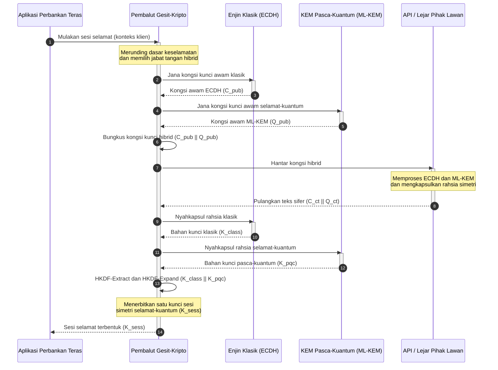

## KyberLib dan Migrasi Perbankan Pasca-Kuantum pada 2026: Daripada Piawaian kepada Kod

Migrasi pasca-kuantum sudah tidak lagi menjadi latihan perancangan. Pada 2026 ia merupakan keperluan operasi yang aktif, dan jurang antara niat kawal selia dengan pelaksanaan kejuruteraan itulah tempat risiko kini berada. [KyberLib ⧉](https://github.com/sebastienrousseau/kyberlib "kyberlib") menutup sebahagian daripada jurang tersebut: pustaka Rust yang berorientasikan pengeluaran dan selamat-memori yang melaksanakan ML-KEM mengikut parameter FIPS 203 yang dimuktamadkan serta membalutnya dalam sempadan gesit-kripto yang benar-benar diperlukan oleh estet transaksi sesebuah bank.

---

> **Ringkasan Eksekutif / Intipati Utama**
>
> - **Ancaman ini sudah beroperasi.** Musuh menjalankan penuaian "Simpan Sekarang, Nyahsulit Kemudian" hari ini; kerahsiaan data gagal secara retroaktif pada hari komputer kuantum yang relevan secara kriptografi tiba.
> - **Piawaian sudah dimuktamadkan.** NIST FIPS 203 (ML-KEM) dan FIPS 204 (ML-DSA) memberi jawatankuasa audit penanda aras yang jelas dan boleh diuji: tiada lagi alasan "menunggu piawaian".
> - **KyberLib ialah pelan cetak biru kejuruteraan.** Rust selamat-memori, kompilasi `no_std` untuk HSM dan kad pintar, serta corak jabat tangan hibrid yang mengekalkan kesalingoperasian klasik.
> - **Kegesitan kripto ialah objektif yang tahan lama.** Sempadan abstraksi yang stabil membolehkan primitif berubah tanpa penulisan semula aplikasi, iaitu pengajaran yang kekal melangkaui mana-mana algoritma tunggal.
> - **Lembaga pengarah memikul liabiliti.** DORA Artikel 5 meletakkan tanggungjawab peribadi ke atas pengarah; kod migrasi yang boleh diperiksa dan dicerap ialah bukti yang memenuhinya.
>
---

## Mengapa Projek Sumber Terbuka Ini Penting pada 2026

Apabila kriptografi asimetri menghampiri usang, ancaman tidak menunggu sebuah komputer kuantum yang relevan secara kriptografi dibina. Musuh sedang melaksanakan serangan **"Simpan Sekarang, Nyahsulit Kemudian" (SNDL)** sekarang, menuai aliran transit tersulit bagi transaksi bank korporat, rahsia dagangan, dan komunikasi institusi dengan niat untuk menyahsulitnya sebaik sahaja keupayaan kuantum matang. Bagi sesebuah bank, setiap jabat tangan klasik yang berada di talian hari ini ialah satu pelanggaran kerahsiaan dengan tarikh letupan yang tertangguh.

Pengawal selia telah bertindak balas dengan kewajipan yang konkrit:

1. **DORA Artikel 6 (pengurusan risiko ICT)** menghendaki institusi memetakan, mengenal pasti, dan mengurangkan kerentanan merentas estet kriptografi mereka, termasuk pertukaran kunci asimetri yang tersembunyi dalam perisian tengah yang tiada sesiapa telah inventorikan.
2. **NIST FIPS 203 dan 204** menetapkan piawaian pasca-kuantum rasmi bagi pengkapsulan kunci (ML-KEM) dan tandatangan digital (ML-DSA), memberi jawatankuasa audit satu penanda aras berpiawai untuk mengukur kemajuan migrasi.

Melaksanakan migrasi ini tanpa mengganggu operasi langsung memerlukan langkah melampaui kertas dasar kepada **infrastruktur kriptografi sumber terbuka yang boleh diperiksa**. [KyberLib ⧉](https://github.com/sebastienrousseau/kyberlib "kyberlib") menyampaikan tepat itu: pustaka Rust selamat-memori yang akur dengan FIPS 203 yang mengubah peralihan pasca-kuantum menjadi saluran kejuruteraan yang boleh diukur dan disahkan, serta mengalihkan perbualan pelaburan teknologi ke arah Pulangan atas Daya Tahan yang nyata.

## Kanta Seni Bina

KyberLib berada di sebalik sempadan API yang stabil, mengasingkan aplikasi transaksi teras sesebuah bank daripada perubahan pada primitif kriptografi peringkat rendah.

| Lapisan | Keputusan Reka Bentuk | Mengapa Ia Penting | Risiko jika Tersalah Urus |
|---|---|---|---|
| **Primitif** | Pengkapsulan kunci FIPS 203 ML-KEM | Menggantikan pertukaran kunci Diffie-Hellman dan RSA klasik dengan struktur berasaskan kekisi | Ketidakpatuhan dengan parameter FIPS 203 yang dimuktamadkan, membawa kepada audit pematuhan yang gagal |
| **Bahasa** | Pelaksanaan Rust selamat-memori | Menghapuskan kerentanan kerosakan memori (limpahan penimbal, guna-selepas-bebas) yang endemik kepada C/C++ | Pertambahan kebergantungan yang menjejaskan integriti rantaian binaan |
| **Abstraksi** | Sempadan gesit-kripto yang stabil | Aplikasi menukar algoritma di sebalik antara muka bersatu apabila piawaian berkembang | Primitif berkod-tetap yang memaksa penulisan semula secara manual dalam setiap migrasi masa hadapan |
| **Penggunaan** | Jabat tangan penyulitan hibrid | Menggabungkan KEM pasca-kuantum dengan algoritma klasik dalam sampul berbalut dua | Kehilangan kesalingoperasian warisan atau hanyutan konfigurasi senyap |
| **Jaminan** | Asal usul SLSA Level 3 dan ujian yang boleh diperiksa | Menjamin sumber dan asal usul kod; contoh boleh diaudit baris demi baris | Teater keselamatan: pustaka kotak-hitam yang ralat pelaksanaannya muncul dalam pengeluaran |

## Isyarat Operasi untuk Dijejaki

Menunjukkan pematuhan pasca-kuantum kepada lembaga penyeliaan dan pengawal selia bermakna menjejaki metrik tertentu yang boleh dikuantifikasikan:

| Isyarat | Metrik | Rujukan Kawal Selia | Pelaksanaan Platform |
|---|---|---|---|
| **Pematuhan FIPS 203 ML-KEM** | Pematuhan 100% dengan parameter yang dimuktamadkan (ML-KEM-512/768/1024) | NIST FIPS 203 | Kriptografi kekisi yang parameternya disahkan, dikompil di dalam modul KyberLib |
| **Inventori kriptografi** | Inventori lengkap penggunaan pertukaran kunci asimetri merentas semua sistem | NIST SP 1800-38 | Ejen pengimbasan automatik yang mencatat suite sifer aktif ke pendaftaran pusat |
| **Pertukaran kunci hibrid** | Peratusan jabat tangan lapisan pengangkutan yang dilaksanakan dalam sampul hibrid | DORA Artikel 6 | Proksi rangkaian yang membalut jabat tangan TLS 1.3 klasik dalam pengkapsulan PQC |
| **Kompilasi `no_std`** | Keupayaan untuk mengkompil tanpa pustaka standard Rust bagi sasaran terkekang | DORA Artikel 30 | Kompilasi `no_std` bersyarat dalam KyberLib untuk Modul Keselamatan Perkakasan |
| **Indeks kegesitan kripto** | Masa dalam minit untuk menukar primitif kriptografi merentas get laluan API | UK PRA SS1/23 | Pendaftaran penghalaan terabstrak yang mengurus peruntukan algoritma melalui pemboleh ubah masa jalan |

## Mengapa Rust Penting untuk Kriptografi Pasca-Kuantum

Melaksanakan algoritma pasca-kuantum seperti ML-KEM memerlukan operasi matematik peringkat rendah yang kompleks pada gelang polinomial. Secara sejarahnya, menjalankan operasi tersebut pada kelajuan pengeluaran bermakna C/C++ atau himpunan yang ditulis dengan tangan, iaitu satu permukaan serangan yang besar bagi kerosakan memori, tepat dalam kod yang paling tidak mampu disalah tangani oleh sesebuah bank.

Rust mengubah pendirian keselamatan kejuruteraan kriptografi dalam tiga cara yang konkrit:

1. **Keselamatan memori pada masa kompil.** Model pemilikan Rust menjamin bahawa limpahan penimbal, pembebasan berganda, dan ralat guna-selepas-bebas dicegah pada masa kompil. Itu amat penting bagi pustaka pasca-kuantum, tempat saiz kunci dan teks sifer jauh lebih besar berbanding rakan sejawat klasiknya.
2. **Abstraksi berketentuan dan kos-sifar.** Rust mengkompil kepada kod mesin natif tanpa pengumpul sampah, jadi kelajuan pelaksanaan dan jejak memori setara atau melebihi pustaka berasaskan C sambil mengekalkan keselamatan.
3. **Keserasian `no_std`.** KyberLib mengkompil tanpa pustaka standard Rust, jadi ia berjalan dalam persekitaran terkekang dan logam kosong, termasuk Modul Keselamatan Perkakasan dan kad pintar, mengekalkan kriptografi bertaraf bank di dalam sempadan keselamatan fizikal.

## Mereka Bentuk Seni Bina Gesit-Kripto

Mod kegagalan klasik dalam migrasi kriptografi ialah pengekodan tetap: andaian khusus algoritma yang dibenamkan terus ke dalam logik aplikasi, ditemui semula dengan menyakitkan pada setiap peralihan. Objektif yang tahan lama bagi 2026 ialah **kegesitan kripto**, iaitu lapisan abstraksi yang menganggap algoritma sebagai modul yang boleh ditukar di sebalik antara muka yang stabil, supaya migrasi seterusnya menjadi satu perubahan konfigurasi dan bukan penulisan semula seluruh estet.

Urutan di bawah menunjukkan bagaimana pembalut gesit-kripto KyberLib menyelaras jabat tangan pertukaran kunci hibrid (klasik tambah pasca-kuantum):

Sampul hibrid ialah butiran yang penting dari segi operasi. Sehingga primitif pasca-kuantum mengumpul penelitian pengeluaran bertahun-tahun, kunci sesi diterbitkan daripada kedua-dua rahsia klasik dan pasca-kuantum: penyerang mesti memecahkan ECDH **dan** ML-KEM untuk memulihkan saluran itu. Pihak lawan yang belum berpindah terus berfungsi; pihak lawan yang telah berpindah memperoleh perlindungan berasaskan kekisi dengan serta-merta.

## Buku Panduan Bilik Lembaga

Keselamatan pasca-kuantum bukanlah sekadar kebimbangan penyulitan pejabat belakang; ia merupakan isu tadbir urus bilik lembaga dengan pertaruhan peribadi. Pengurus kanan harus membingkai migrasi ini melalui tanggungjawab fidusiari:

- **DORA Artikel 5 (tadbir urus dan organisasi)** meletakkan tanggungjawab peribadi bagi keselamatan ICT ke atas lembaga pengarah. Ujian sumber terbuka yang boleh dicerap ialah bukti langsung yang diminta oleh audit liabiliti peribadi: "kami memilih pelaksanaan FIPS 203 yang boleh diperiksa dan inilah larian keakurannya" ialah jawapan yang boleh dipertahankan; "vendor kami memberi jaminan kepada kami" tidak.
- **Pengurusan risiko model (US Fed SR 11-7 / UK PRA SS1/23)** terpakai kepada seni bina pembalut kriptografi sebanyak mana ia terpakai kepada model penentuan harga. Lapisan abstraksi harus melalui pengesahan MRM, termasuk prestasi di bawah senario gangguan yang melampau.
- **Modal risiko operasi Basel III** memberi ganjaran kepada kematangan kawalan yang ditunjukkan. Jabat tangan hibrid yang diuji merendahkan profil risiko operasi jangka panjang institusi, memangkas premium modal dan membebaskan kapasiti kunci kira-kira untuk penggunaan perbendaharaan yang aktif.

## Apa Maksudnya Mengikut Jenis Bank

### Bank Penting Secara Sistemik Global (G-SIB)

G-SIB menjalankan estet transaksi yang sarat dengan warisan, jadi kekangan mengikatnya ialah penemuan: mengetahui di mana pertukaran kunci asimetri sebenarnya berlaku. Inventori kriptografi berterusan di bawah panduan NIST SP 1800-38 mendahului yang lain; KyberLib kemudiannya menyediakan pustaka berpiawai dan selamat-memori untuk melaksanakan pengkapsulan kunci pasca-kuantum merentas setiap nod moden yang didedahkan oleh inventori.

### Bank Transaksi dan Korporat

Kerahsiaan merentas landasan pembayaran ialah francais itu sendiri. Kerana KyberLib mengkompil kepada sasaran `no_std` logam kosong, bank transaksi boleh menggunakan jabat tangan pasca-kuantum terus di dalam perkakasan penghalaan pembayaran tepi dan pengurusan kecairan, bukan hanya dalam lapisan aplikasi.

### Bank Serantau dan yang Lebih Kecil

Institusi serantau berdepan penuaian yang ditaja negara yang sama tanpa bajet penyelidikan G-SIB. Pelaksanaan Rust sumber terbuka yang boleh diperiksa memberi mereka laluan siap-guna kepada keakuran NIST FIPS 203 dengan serta-merta, tanpa perlu berunding dengan peta hala tuju vendor kotak-hitam.

## Daripada Peta Hala Tuju kepada Kod yang Boleh Dikompil

Peralihan pasca-kuantum ialah tugas kejuruteraan yang aktif, dan institusi yang mengekalkan kepercayaan penyelia, pihak lawan, dan pegawai perbendaharaan korporat sepanjang 2026 ialah mereka yang beralih daripada peta hala tuju abstrak kepada kod yang boleh dicerap dan boleh dikompil. Mandat eksekutif menyusul secara langsung: audit titik pertukaran kunci warisan, gunakan jabat tangan hibrid pada saluran bernilai tertinggi, dan bina sempadan abstraksi stabil yang menjadikan setiap pertukaran primitif masa hadapan sebagai rutin. KyberLib menjadikan setiap langkah itu sebagai keupayaan operasi yang boleh diukur dan bukannya komitmen "slideware".

## Soalan Lazim

**Adakah KyberLib akur dengan piawaian NIST yang dimuktamadkan?**

Ya. KyberLib direka bentuk berdasarkan parameter ML-KEM sebagaimana yang dimuktamadkan dalam FIPS 203, mengekalkan pustaka yang dikompil selaras dengan jangkaan kawal selia persekutuan dan global.

**Adakah pustaka pasca-kuantum memerlukan perkakasan khusus?**

Tidak. Pelaksanaan Rust KyberLib mengkompil kepada seni bina sistem standard. Keupayaan `no_std`-nya secara tambahan membolehkannya berjalan pada Modul Keselamatan Perkakasan dan kad pintar khusus di mana jagaan kunci fizikal diperlukan.

**Bagaimana "Simpan Sekarang, Nyahsulit Kemudian" menjejaskan pematuhan semasa?**

Jika lapisan pengangkutan bergantung pada RSA atau ECC klasik, musuh boleh menuai trafik hari ini dan menyahsulitnya sebaik sahaja keupayaan kuantum matang. Pertukaran kunci hibrid yang digunakan sekarang mengekalkan data yang ditangkap di sebalik perlindungan berasaskan kekisi.

**Mengapa jabat tangan hibrid dan bukan terus beralih kepada primitif pasca-kuantum?**

Sampul hibrid menerbitkan kunci sesi daripada kedua-dua rahsia klasik dan pasca-kuantum, jadi keselamatan bertahan melainkan kedua-duanya dipecahkan. Itu mengekalkan kesalingoperasian dengan pihak lawan yang belum berpindah sementara primitif baharu mengumpul penelitian pengeluaran.

## Rujukan

- National Institute of Standards and Technology, (2024). [FIPS 203: Module-Lattice-Based Key-Encapsulation Mechanism Standard ⧉](https://www.nist.gov/news-events/news/2024/08/nist-releases-first-3-finalized-post-quantum-encryption-standards "Pengumuman NIST FIPS 203").
- Board of Governors of the Federal Reserve System, (2011). [Supervisory Guidance on Model Risk Management (SR Letter 11-7) ⧉](https://www.federalreserve.gov/supervisionreg/srletters/sr1107.htm "Federal Reserve SR 11-7").
- European Parliament and Council of the European Union, (2022). [Regulation (EU) 2022/2554 on digital operational resilience for the financial sector (DORA) ⧉](https://eur-lex.europa.eu/legal-content/EN/TXT/?uri=CELEX%3A32022R2554 "Peraturan DORA").
- NIST National Cybersecurity Center of Excellence, (2025). [Migration to Post-Quantum Cryptography (NIST SP 1800-38) ⧉](https://www.nccoe.nist.gov/projects/migration-post-quantum-cryptography "NIST SP 1800-38").
- GitHub, (2026). [kyberlib open-source repository ⧉](https://github.com/sebastienrousseau/kyberlib "repositori kyberlib").
