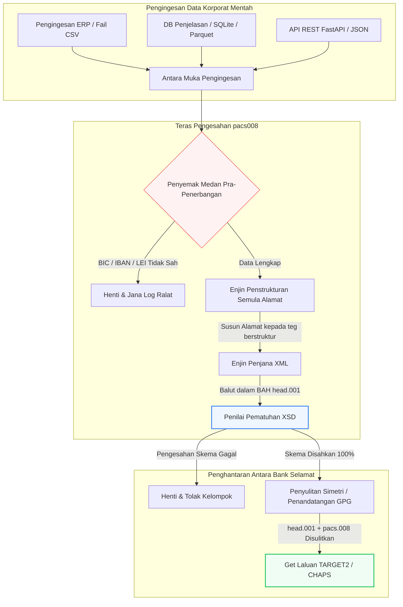

## Mengautomasikan Pembayaran Antara Bank pacs.008 ISO 20022 dengan Python Sumber Terbuka pada 2026

Merapatkan jurang antara data kewangan warisan dan pemesejan antara bank berstruktur melalui saluran paip Python yang boleh diaudit dan disahkan skema.

Titik rujukan sumber terbuka untuk artikel ini ialah [pacs008 ⧉](https://github.com/sebastienrousseau/pacs008 "pacs008 — pustaka Python sumber terbuka"). Repositori ini diletakkan sebagai pustaka Python untuk mengautomasikan mesej XML pemindahan kredit pelanggan FI-ke-FI pacs.008 [ISO 20022](/2023-09-29-automating-iso-20022-compliant-payment-file-creation-with-pain001/index.html).

## Mengapa Projek Sumber Terbuka Ini Penting pada 2026

Infrastruktur penjelasan pembayaran antara bank global sedang mengalami pemodenan paling mendalam dalam hampir setengah abad.

Pada Jun 2026, sektor perkhidmatan kewangan semakin menghampiri **Tebing Alamat Berstruktur SWIFT 14 November 2026**. Mulai tarikh ini, garis panduan SWIFT CBPR+, bersama-sama TARGET2, CHAPS, Fedwire, dan Lynx Kanada, akan secara rasmi menyahtauliahkan baris alamat pos tidak berstruktur (menggunakan hanya `<AdrLine>` dalam blok `<PstlAdr>`). Semua institusi kewangan yang mengambil bahagian mesti menghantar alamat sama ada dalam format hibrid (`<TwnNm>` dan `<Ctry>` berstruktur, dengan maksimum dua elemen `<AdrLine>` untuk butiran yang tinggal) atau format berstruktur sepenuhnya (elemen individu untuk nama jalan, nombor bangunan, dan poskod). Sebarang mesej yang gagal memenuhi kriteria ini akan ditolak di sempadan rangkaian.

Bagi institusi kewangan, peralihan ini mewujudkan kekangan operasi yang besar:

1. **Penalti penolakan sempadan.** Pembayaran yang gagal memenuhi kriteria alamat berstruktur akan menghadapi penolakan rangkaian serta-merta, mencetuskan kelewatan transaksi, sekatan kecairan, dan tunggakan operasi.
2. **Pengesahan Penerima Bayaran SEPA (VoP).** Mewajibkan semua Penyedia Perkhidmatan Pembayaran (PSP) dalam zon SEPA mengesahkan padanan antara nama benefisiari dan IBAN sebelum melaksanakan pemindahan kredit, menambah satu lagi pintu pengesahan pada permulaan mesej.

[Pacs008](https://github.com/sebastienrousseau/pacs008) menyelesaikan masalah ini. Ia ialah pustaka Python sumber terbuka yang ringan dan mengautomasikan penukaran data kewangan mentah kepada mesej pemindahan kredit pelanggan antara bank pacs.008 ISO 20022 yang disahkan sepenuhnya dan mematuhi skema. Dengan merapatkan jurang data warisan-ke-berstruktur, pacs008 memberikan Pulangan atas Daya Tahan (RoR) yang tinggi, memelihara modal kerja dan menjamin pelaksanaan masa nyata merentasi rel global.

## Mengapa saya membina pacs008 sebegini

Saya menulis `pacs008` dan pustaka adiknya di hulu, `pain001`, dan saya
menghabiskan kehidupan kerja saya dalam pembayaran borong serta pengurusan produk
API. Gabungan itulah sebab pustaka ini berbentuk sedemikian, jadi wajar keputusan
tersebut dinyatakan secara terang, bukan dibiarkan tersirat dalam kod.

**Pengesahan berjalan sebelum penjanaan, bukan selepasnya.** Naluri kebanyakan
warisan sistem pembayaran ialah menjana mesej kemudian memeriksanya, kerana
begitulah proses semakan dibentuk: fail dihasilkan, seseorang memeriksanya,
pengecualian masuk ke barisan. Susunan itu menjamin kecacatan ditemui pada titik
tuas paling rendah — selepas kerja menyusun mesej sudah selesai, dan selalunya
selepas mesej meninggalkan institusi. Mengesahkan dahulu bermakna alamat tidak
patuh atau IBAN cacat menjadi kegagalan binaan, bukan penolakan rangkaian.

**Lesennya MIT kerana bank perlu membaca logik pengesahan, bukan
mempercayainya.** Pengesah tertutup meminta institusi menerima tafsiran orang
lain terhadap garis panduan penggunaan secara membuta tuli. Itu bukan permintaan
munasabah kepada pasukan yang memikul kewajipan kawal selia. Setiap peraturan
dalam pustaka ini boleh diperiksa, dipertikaikan dan difork.

**Pengesahan dibuat terhadap skema XSD rasmi, bukan dilaksanakan semula.**
Anggaran tulisan tangan bagi peraturan ISO 20022 akan menyimpang daripada kontrak
sebenar rangkaian sebaik sahaja mana-mana pihak berubah. Skema itulah kontraknya;
apa-apa lain ialah sumber kebenaran kedua yang menanti untuk bercanggah.

**Ia menyasarkan CI, bukan langkah semakan.** Pengesah yang perlu diingat oleh
seseorang untuk dijalankan ialah pengesah yang berhenti dijalankan di bawah
tekanan tarikh akhir — tepat ketika ia paling penting.

Apa yang sengaja tidak dilakukan pustaka ini sama sengajanya. Ia ialah kit alat
lapisan mesej. Ia tidak menggantikan enjin pembayaran, sistem saringan sekatan,
atau pembersihan data induk pelanggan yang perlu dilakukan institusi di puncanya.
Ia menjadikan pembersihan itu boleh dikuatkuasakan; ia tidak melakukannya untuk
anda.

## Lensa Seni Bina pacs008 2026

Pustaka pacs008 distrukturkan sebagai enjin pengesahan dan penjanaan terpencil, memastikan input mentah dihurai, diperkaya, dan dibalut secara sistematik dalam sampul standard:

| Lapisan | Keputusan Reka Bentuk | Mengapa Ia Penting | Risiko jika Tersalah Kendali |
|---|---|---|---|
| **Lapisan Input** | Pengingesan CSV, JSON, SQLite, dan Parquet | Menemui pasukan integrasi perbankan di tempat data mereka sudah berada, menghalang migrasi platform. | Pengingesan muatan data mentah, tidak disahkan, atau rosak. |
| **Lapisan Pengesahan** | Pengesahan pra-penerbangan terhadap skema XSD rasmi dan peraturan perniagaan tersuai | Menghentikan pelaksanaan dan menanda ralat sebelum fail pembayaran dihantar ke rangkaian penjelasan. | Fail XML tidak sah mencetuskan penolakan rangkaian serta-merta dan kelewatan penjelasan. |
| **Lapisan Sampul BAH** | Pembalutan Pengepala Aplikasi Perniagaan (head.001) automatik | Menyeragamkan penghantaran dan penghalaan mesej berdasarkan teg `<MsgDefIdr>`. | Menghantar muatan pacs.008 mentah tanpa sampul luar yang diperlukan, menyebabkan penolakan sistem. |
| **Lapisan Pensirian** | Sokongan XML standard dan JSON yang mematuhi ISO (TS 23029) | Membolehkan terjemahan langsung antara muatan XML dan JSON, menyokong API REST moden dan penstriman Kafka. | Perwakilan data berpecah-pecah yang melanggar garis panduan ISO rasmi. |
| **Lapisan Kebolehcerapan** | Penjejakan OpenTelemetry berkunci pada UETR | Menangkap laluan pelaksanaan dan log terperinci, menyediakan kebolehauditan masa nyata. | Jurang penjejakan menyekat keterlihatan operasi dan pengauditan. |

## Isyarat Antara Bank Utama dan Pencapaian Kawal Selia

Untuk menunjukkan daya tahan operasi transaksi, pengurus teknologi dan risiko kanan mesti menjejaki penunjuk pematuhan yang khusus dan boleh diukur:

| Isyarat | Metrik / Penanda Aras Operasi | Rujukan G20 / SWIFT / DORA | Pelaksanaan Platform Teknikal |
|---|---|---|---|
| **Pematuhan Alamat Berstruktur** | % mesej pacs.008 yang menggunakan medan `<PstlAdr>` berstruktur sepenuhnya dengan `<TwnNm>` dan `<Ctry>` yang ditetapkan. | Tarikh Akhir SWIFT SR 2026 | Pemeriksaan skema pra-penerbangan dalam pacs008 menolak baris alamat tidak berstruktur. |
| **Pengesahan Penerima Bayaran SEPA** | Pengesahan padanan antara nama benefisiari dan IBAN sebelum pelaksanaan mesej. | Peraturan SEPA VoP | Kelas pembantu VoP terbina dalam melaksanakan pertanyaan pra-pengesahan pada IBAN/BIC. |
| **Integrasi BAH head.001** | Peratusan muatan pembayaran keluar yang berjaya dibalut dalam Pengepala Aplikasi Perniagaan. | Garis Panduan TARGET2 / CBPR+ | Subsistem pembalutan BAH menyusun sampul XML luar secara automatik. |
| **Hasil Semak Modulo LEI** | Pengesahan digit semak ISO 7064 Modulo 97-10 pada blok `<LEI>` penghutang dan pemiutang. | Mandat Bank of England | Penyemak algoritma mengesahkan integriti pengecam 20 aksara. |
| **Ketepatan Penjejakan UETR** | 100% pembayaran yang dijana disuntik dengan Rujukan Transaksi Hujung-ke-Hujung Unik yang sah. | Spesifikasi UETR SWIFT | Penjanaan dan penjejakan automatik kod rujukan UUIDv4 36 aksara. |

## Mengapa Python Ialah Laluan Masuk Ideal untuk Automasi Antara Bank

Hab pembayaran moden dan pasukan operasi perbendaharaan pada 2026 sangat bergantung pada Python untuk transformasi data, pemodelan kewangan, dan integrasi pangkalan data ERP.

Dengan memanfaatkan pustaka Python sumber terbuka, institusi mencapai kelebihan yang ketara:

1. **Beban kognitif rendah dan kesalingoperasian tinggi.** Python bertindak sebagai jambatan yang padu. Ia membolehkan pembangun menulis skrip mudah yang menarik arahan pembayaran mentah daripada pangkalan data warisan, mengesahkannya terhadap peraturan perbankan antarabangsa yang kompleks, dan mengeluarkan XML yang mematuhi dalam satu aliran kerja yang bersatu.
2. **Penghapusan penterjemah legap "kotak hitam".** Portal perbankan proprietari sering mengenakan yuran pelesenan yang tinggi untuk penterjemah fail pembayaran tersuai. Penterjemah ini ialah kotak hitam proprietari, menjadikannya mustahil bagi pasukan keselamatan untuk mengaudit cara data diproses atau di mana kunci disimpan. Pustaka sumber terbuka yang boleh diperiksa seperti pacs008 memastikan ketelusan kod yang lengkap.
3. **Integrasi CI/CD lancar.** Pacs008 berintegrasi secara langsung ke dalam saluran paip integrasi dan penggunaan berterusan, membolehkan pembangun mengautomasikan ujian fail pembayaran sebagai sebahagian daripada kitaran hayat penyampaian perisian standard mereka.

## Mereka Bentuk Saluran Paip Antara Bank Bersempadan

Kelemahan utama dalam penjelasan antara bank ialah "penjanaan kelompok tidak terkawal" — menjana fail tanpa gelung pengesahan yang jelas dan bersempadan. Pacs008 direka untuk beroperasi sebagai enjin pengesahan teras dalam saluran paip transaksi berbilang peringkat yang dikawal ketat.

Aliran operasi di bawah menunjukkan cara data transaksi mentah melalui saluran paip pacs008 untuk menjana fail pacs.008 yang selamat secara kriptografi dan mematuhi skema, dibalut dalam sampul BAH:

## Buku Panduan Lembaga Pengarah dan Liabiliti Fidusiari

Automasi pembayaran antara bank ialah isu pengurusan risiko dan tadbir urus korporat peringkat lembaga pengarah. Pengurus kanan mesti menangani kualiti data transaksi melalui lensa tanggungjawab fidusiari dan pengurangan risiko operasi:

- **DORA Artikel 5 (Akauntabiliti Lembaga Pengarah).** Meletakkan liabiliti langsung dan peribadi kepada ahli lembaga pengarah terhadap daya tahan dan keselamatan operasi ICT institusi. Oleh sebab penjelasan antara bank ialah fungsi korporat yang kritikal, lembaga pengarah mesti menunjukkan mereka telah melaksanakan kawalan transaksi yang teguh, disahkan, dan automatik untuk mengelakkan gangguan operasi atau pembayaran tertangguh.
- **BCBS 239 (Pengagregatan dan Pelaporan Data Risiko).** Menuntut agar pelaporan transaksi kewangan tepat, lengkap, dan dijana pada masa nyata. Pacs008 membantu institusi mencapai pematuhan BCBS 239 dengan memastikan data pembayaran distrukturkan dengan kemas dan disahkan pada sumbernya, menghapuskan jurang data dan ralat penyesuaian manual yang membelenggu hamparan warisan.
- **Pengurangan Caj Modal Risiko Operasi (Basel III).** Di bawah garis panduan Basel III, kadar ralat pembayaran yang tinggi dan overhed campur tangan manual meningkatkan keperluan modal risiko operasi bank, mengikat modal yang sebaliknya boleh digunakan untuk pemberian pinjaman atau pelaburan. Mengautomasikan saluran paip pembayaran secara langsung meminimumkan premium modal ini, memelihara nilai kunci kira-kira.

## Apa Makna Ini Mengikut Jenis Bank

### Bank Penting Sistemik Global (G-SIB)

G-SIB menguruskan volum transaksi korporat rentas sempadan yang besar. Cabaran utama mereka ialah pemulihan data warisan tidak berstruktur sebelum ia sampai ke rangkaian penjelasan. Dengan mengintegrasikan pacs008 ke dalam get laluan perbankan korporat mereka, G-SIB boleh menyediakan utiliti pengesahan automatik kepada pelanggan korporat mereka, mengurangkan overhed pembaikan pembayaran manual dan menjamin pelaksanaan masa nyata merentasi rangkaian SWIFT.

### Bank Transaksi dan Korporat

Bagi bank transaksi, kualiti data pembayaran ialah pembeza persaingan. Dengan menawarkan alat pengesahan sumber terbuka yang boleh diperiksa seperti pacs008 kepada pelanggan perbendaharaan korporat, bank-bank ini boleh mempercepat penerimaan pelanggan, meminimumkan penolakan fail pembayaran, dan membina kepercayaan pelanggan melalui kadar pemprosesan terus-melalui yang unggul.

### Bank Serantau dan Lebih Kecil

Bank serantau mesti mengekalkan pematuhan dengan standard pembayaran antarabangsa tanpa bajet teknologi besar seperti G-SIB. Pacs008 menyediakan penyelesaian berasaskan Python yang ringan, kos efektif, dan mematuhi sepenuhnya, membolehkan institusi lebih kecil menawarkan keupayaan permulaan pembayaran moden dan berstruktur tanpa lesen perisian tengah proprietari yang mahal.

## Kesimpulan: Peta Jalan Penjelasan Antara Bank

Tarikh akhir alamat berstruktur SWIFT November 2026 yang bakal tiba mewakili sempadan tegas bagi operasi perbendaharaan korporat. Bergantung pada hamparan warisan, kemasukan data manual, dan fail pembayaran tidak berstruktur ialah risiko perniagaan yang aktif.

Untuk menjamin kesinambungan transaksi dan meminimumkan overhed operasi, pengurus teknologi dan kewangan kanan patut melaksanakan peta jalan penjelasan yang jelas hari ini:

1. **Kuatkuasakan pengesahan pada sumber.** Wajibkan semua arahan pembayaran disahkan dan diformat mengikut skema XSD ISO 20022 rasmi sebelum meninggalkan sempadan ERP korporat.
2. **Audit saluran paip data.** Beralih daripada pemprosesan hamparan manual dan laksanakan aliran kerja berasaskan Python yang automatik dan boleh diperiksa menggunakan pacs008.
3. **Laksanakan keselamatan hibrid.** Pastikan fail pembayaran yang dijana ditandatangani secara kriptografi dan disulitkan sebelum penghantaran, memenuhi jangkaan rangkaian sifar-amanah.
4. **Selaras dengan keutamaan fidusiari.** Laporkan metrik automasi pembayaran dan kualiti data secara rasmi kepada lembaga pengarah, membingkaikan pelaburan itu sebagai program pengurangan risiko operasi kritikal di bawah DORA.

## Soalan Lazim

**Adakah pacs008 mematuhi peraturan alamat SWIFT SR 2026 yang bakal tiba?**

Ya. Pacs008 direka untuk menyokong pencapaian alamat berstruktur SWIFT November 2026 yang ketat, menguatkuasakan pengasingan wajib elemen alamat pos (bandar, negara, poskod) ke dalam medan XML ISO 20022 yang ditetapkan.

**Bolehkah pacs008 membalut muatan pembayaran dalam Pengepala Aplikasi Perniagaan?**

Ya. Oleh sebab pacs008 menyokong pembalutan Pengepala Aplikasi Perniagaan (BAH head.001) secara asli, ia secara automatik menyusun sampul luar yang diperlukan oleh rangkaian TARGET2, CHAPS, dan CBPR+.

**Mengapa pustaka sumber terbuka lebih diutamakan berbanding penterjemah fail proprietari?**

Penterjemah proprietari ialah kotak hitam yang legap, menjadikan audit keselamatan mustahil. Pustaka sumber terbuka yang disemak rakan sebaya seperti pacs008 menawarkan ketelusan kod yang lengkap, membolehkan pasukan keselamatan mengesahkan bahawa tiada data pembayaran sensitif terdedah semasa pemprosesan.

**Pengecam apakah yang disahkan oleh pacs008?**

Pacs008 disertakan dengan pengesah terbina dalam untuk Kod Pengecam Bank (BIC) dan Pengecam Entiti Undang-Undang (LEI) menggunakan pengiraan hasil semak ISO 7064 Modulo 97-10, ditambah pengesahan digit semak IBAN dan pemeriksaan keunikan UETR.

## Rujukan

- SWIFT, (2024). *ISO 20022 November 2026 Structured Address Milestone*. La Hulpe: SWIFT. Tersedia di: [Pencapaian ISO 20022 SWIFT ⧉](https://www.swift.com/standards/iso-20022/iso-20022-bytes/call-action-november-2026 "Pencapaian ISO 20022 SWIFT").
- Basel Committee on Banking Supervision (BCBS), (2013). *Principles for effective risk data aggregation and risk reporting (BCBS 239)*. Basel: Bank for International Settlements. Tersedia di: [Prinsip BCBS 239 ⧉](https://www.bis.org/publ/bcbs239.htm "Prinsip BCBS 239").
- European Parliament and Council of the European Union, (2022). *Regulation (EU) 2022/2554 on digital operational resilience for the financial sector (DORA)*. Brussels: Official Journal of the European Union. Tersedia di: [Peraturan DORA ⧉](https://eur-lex.europa.eu/legal-content/EN/TXT/?uri=CELEX%3A32022R2554 "Peraturan DORA").
- GitHub, (2026). *pacs008 open-source repository*. Tersedia di: [Repositori pacs008 ⧉](https://github.com/sebastienrousseau/pacs008 "Repositori pacs008").
