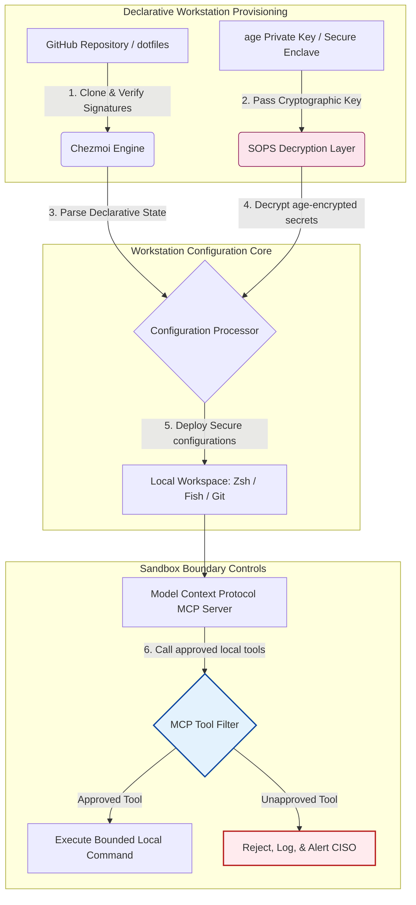

## Dotfiles Sedar-AI pada 2026: Membina Stesen Kerja Pembangun yang Selamat dan Boleh Dihasilkan Semula untuk MCP, SLSA dan Pariti Berbilang Shell

Merapatkan jurang antara konfigurasi stesen kerja deklaratif dengan rantaian bekalan perisian yang selamat dalam era model AI tempatan dan alat pembangun agentik.

Titik rujukan sumber terbuka untuk artikel ini ialah [dotfiles ⧉](https://github.com/sebastienrousseau/dotfiles "dotfiles — konfigurasi stesen kerja deklaratif"). Repositori ini diposisikan sebagai: dotfiles deklaratif untuk macOS, Linux dan WSL, menawarkan pariti berbilang shell, permulaan bawah-saat, keluaran ditandatangani SLSA, dan konfigurasi sedar-AI/MCP.

## Mengapa Projek Sumber Terbuka Ini Penting pada 2026

Pada Jun 2026, stesen kerja pembangun ialah pautan paling lemah dalam rantaian bekalan perisian dan sasaran bernilai tinggi bagi sindiket siber ditaja negara dan jenayah yang canggih.

Landskap keselamatan persekitaran pembangunan telah berubah secara radikal dengan kemunculan pembantu pengekodan AI berasaskan terminal (seperti Claude Code) dan penerimaan Model Context Protocol (MCP). Terminal pembangun tempatan kini menjadi hos kepada ejen AI aktif dan autonomi yang mampu:

- Membaca dan menyunting fail sumber tempatan.
- Memanggil alat CLI tempatan (`git`, `npm`, `aws`, `kubectl`).
- Memeriksa pemboleh ubah persekitaran shell, pangkalan data tempatan, dan tetapan konfigurasi.

Jika persekitaran tempatan pembangun tiada sempadan yang ketat, alat AI autonomi ini boleh secara tidak sengaja membaca data peribadi sensitif, membocorkan kelayakan awan kepada API LLM awam, atau melaksanakan pakej berniat jahat semasa binaan automatik.

Di bawah Digital Operational Resilience Act (DORA) dan NIST Cybersecurity Framework (CSF) 2.0, institusi kewangan diwajibkan dari segi undang-undang untuk mengesahkan asal-usul dan integriti keselamatan setiap peranti yang mengakses rantaian bekalan perisian. "Komputer riba salji" — konfigurasi yang dikonfigur secara manual, tidak diaudit, dan bergeser — tidak lagi mematuhi piawaian perbankan global.

[Dotfiles Sebastien Rousseau](https://github.com/sebastienrousseau/dotfiles) menyelesaikan masalah ini. Ia merupakan rangka kerja pengurusan stesen kerja deklaratif sumber terbuka yang mewujudkan stesen kerja pembangun yang selamat dan boleh dihasilkan semula. Dengan menguatkuasakan garis dasar konfigurasi yang piawai dan boleh diaudit, projek ini menyampaikan Pulangan atas Daya Tahan (RoR) yang tinggi, mengurangkan masa penyediaan pembangun daripada beberapa minggu kepada beberapa jam dan melindungi rantaian bekalan kewangan sensitif daripada kerentanan titik hujung.

## Kanta Seni Bina Stesen Kerja Sedar-AI 2026

Rangka kerja dotfiles berfungsi sebagai pengurus persekitaran deklaratif yang selamat — semua shell tempatan, alat dan rahsia diurus, diaudit dan diasingkan secara sistematik:

| Lapisan | Keputusan Reka Bentuk | Mengapa Ia Penting | Risiko Jika Tersalah Urus |
|---|---|---|---|
| **Lapisan Penyediaan** | Pengurusan konfigurasi deklaratif melalui Chezmoi | Membina stesen kerja yang boleh dihasilkan semula sepenuhnya merentasi macOS, Linux dan WSL, menghapuskan pergeseran. | Konfigurasi salji dengan keadaan tempatan yang tidak diaudit dan rentan. |
| **Lapisan Shell** | Pariti berbilang shell (Zsh, Fish, Nushell) | Memastikan permulaan bawah-saat yang seragam dan gelagat alias yang konsisten merentasi persekitaran berbeza. | Ketidakkonsistenan arahan shell menyebabkan hasil skrip yang tidak dijangka. |
| **Lapisan Rahsia** | Penyulitan fail menggunakan SOPS dan age | Menghalang kelayakan tertanam-keras dan kunci mentah daripada dikomit ke Git atau terdedah kepada LLM tempatan. | Kelayakan bocor ke dalam sejarah repositori awam atau terjejas oleh ejen tempatan. |
| **Lapisan AI/MCP** | Kawalan sempadan Model Context Protocol | Menghadkan ejen AI tempatan kepada senarai khusus alat yang diluluskan, mencatat semua pelaksanaan tempatan. | Ejen AI tanpa sempadan melaksanakan arahan tidak terkawal atau memusnahkan secara tempatan. |
| **Lapisan Rantaian Bekalan** | Keluaran ditandatangani SLSA dan pengesahan Sigstore | Membuktikan secara kriptografi keaslian skrip but dan fail konfigurasi. | Skrip persediaan terjejas menyuntik pintu belakang berniat jahat ke dalam persekitaran pembangun. |

## Isyarat Utama Keselamatan dan Automasi Stesen Kerja

Untuk mengekalkan keselamatan mutlak merentasi seluruh estet pembangunan, Ketua Pegawai Keselamatan Maklumat (CISO) dan pengurus teknologi mesti menjejaki penunjuk operasi yang khusus dan boleh diukur:

| Isyarat | Metrik / Penanda Aras Operasi | Rujukan NIST CSF / DORA | Pelaksanaan Platform Teknikal |
|---|---|---|---|
| **Kebolehhasilan Semula Stesen Kerja** | % komputer riba pembangun yang diurus sepenuhnya melalui repositori dotfile deklaratif tanpa pergeseran konfigurasi. | NIST CSF 2.0 (PR.DS-01) | Audit pengesanan pergeseran Chezmoi dilaksanakan secara automatik semasa permulaan terminal. |
| **Kebersihan Kelayakan** | Sifar rahsia atau kunci tidak tersulit disimpan dalam teks biasa merentasi fail konfigurasi tempatan. | DORA Artikel 6 (Keselamatan ICT) | Cangkuk pra-komit Git dan imbasan tempatan menolak fail tidak tersulit. |
| **Asal-usul Binaan** | 100% utiliti but stesen kerja disahkan menggunakan manifes yang ditandatangani secara kriptografi. | DORA Artikel 30 (Rantaian Bekalan) | Pengesahan Sigstore dan SLSA Tahap 3 terbenam dalam saluran paip persediaan. |
| **Masa Penyediaan Pembangun** | Masa berlalu daripada penyediaan perkakasan mentah kepada ruang kerja pembangunan yang dikonfigur sepenuhnya dan patuh. | Pulangan atas Daya Tahan (RoR) | Skrip persediaan deklaratif automatik menghimpun persekitaran dalam masa kurang 15 minit. |
| **Akses Terbatas Ejen AI** | Pengesahan bahawa alat AI tempatan beroperasi dalam had direktori yang ditetapkan dengan lalai baca-sahaja. | Pengurusan Risiko Model | Profil konfigurasi MCP menghadkan katalog alat ejen kepada operasi yang diluluskan. |

## Mengapa Konfigurasi Deklaratif Menjadi Teras Keselamatan Stesen Kerja

Pendekatan tradisional untuk menyediakan stesen kerja pembangun sangat manual, mengakibatkan "komputer riba salji" — persekitaran yang konfigurasinya bergeser dari masa ke masa apabila pembangun memasang alat tersuai, melaraskan pemboleh ubah, dan mengubah suai skrip tempatan. Pergeseran ini mewujudkan beberapa kerentanan kritikal:

1. **Konfigurasi bayangan yang tidak dijejak.** Komputer riba yang bergeser sering menjalankan pakej perisian yang lapuk dan rentan atau skrip tempatan yang memintas alat keselamatan korporat.
2. **Kebocoran rahsia.** Pembangun kerap menanam-keras kunci API, token GitHub, atau kelayakan AWS terus ke dalam skrip teks biasa atau profil shell, menjadikannya sangat rentan terhadap kecurian.
3. **Penyediaan yang tidak cekap.** Menyediakan stesen kerja pembangun baharu secara manual boleh mengambil masa sehingga dua minggu masa kejuruteraan, memberi kesan kepada halaju pasukan.

Dengan beralih kepada konfigurasi deklaratif dan dipacu-model menggunakan Chezmoi, seluruh ruang kerja pembangun menjadi sistem rekod yang dikawal versi dan boleh dihasilkan semula. Setiap perubahan, alias, kebergantungan pakej, dan lalai keselamatan didokumenkan dalam Git, disahkan terhadap dasar pematuhan organisasi, dan disahkan secara kriptografi sebelum digunakan pada komputer riba fizikal.

## Mereka Bentuk Persekitaran Pembangun AI yang Terbatas

Untuk menghalang ejen AI tempatan dan alat MCP daripada memperoleh akses tanpa sempadan kepada aset tempatan, stesen kerja mesti beroperasi sebagai satah pelaksanaan yang terbatas.

Aliran operasi di bawah menunjukkan bagaimana rangka kerja dotfiles menyelaraskan Chezmoi, SOPS dan age untuk menyahsulit dan menggunakan dotfiles yang selamat sambil mengekalkan sempadan pelaksanaan berkotak-pasir dan terpencil untuk ejen AI tempatan yang memanggil alat MCP:

## Buku Panduan Bilik Lembaga dan Liabiliti Fidusiari

Keselamatan stesen kerja pembangun dan integriti rantaian bekalan ialah keutamaan bilik lembaga yang kritikal. Pengurus kanan mesti menangani risiko persekitaran pembangun melalui kanta tanggungjawab fidusiari, pematuhan kawal selia, dan pemeliharaan nilai perniagaan:

- **DORA Artikel 5 (Akauntabiliti Lembaga).** Mewajibkan badan pengurusan (lembaga) memikul tanggungjawab muktamad ke atas pengurusan risiko ICT institusi. Oleh sebab stesen kerja pembangun ialah pintu masuk ke rantaian bekalan perisian, pengarah lembaga mesti mengesahkan bahawa titik hujung adalah selamat, boleh diaudit sepenuhnya, dan diurus di bawah rangka kerja konfigurasi yang ketat dan boleh dihasilkan semula untuk memenuhi audit kawal selia.
- **Pematuhan NIST CSF 2.0 (Keselamatan Titik Hujung).** Menuntut supaya hanya peranti yang dibenarkan dan disahkan, yang menjalankan konfigurasi yang piawai dan selamat, boleh mengakses rangkaian dan repositori korporat. Dotfiles deklaratif membolehkan pasukan keselamatan membuktikan secara matematik bahawa semua persekitaran pembangun mematuhi garis dasar keselamatan organisasi, menghapuskan risiko persediaan "salji" yang tidak diaudit.
- **Pemeliharaan Nilai Kunci Kira-kira.** Satu kelayakan pembangun yang terjejas atau satu pelanggaran rantaian bekalan boleh menyebabkan institusi berbelanja berjuta-juta dolar untuk pemulihan, denda kawal selia, dan kerosakan reputasi. Beralih kepada persekitaran pembangun deklaratif yang selamat secara langsung meminimumkan risiko ini, memelihara nilai kunci kira-kira dan melindungi kepercayaan pelanggan.

## Apa Maksudnya Mengikut Jenis Bank

### Bank Penting Sistemik Global (G-SIB)

G-SIB menguruskan beribu-ribu stesen kerja pembangun merentasi pelbagai benua dan bidang kuasa kawal selia. Cabaran utama mereka ialah mengekalkan kekonsistenan konfigurasi dan menghalang kebocoran kelayakan merentasi pasukan kejuruteraan yang besar. Dengan menerima pakai model dotfiles sumber terbuka dan deklaratif menggunakan Chezmoi, G-SIB boleh memiawaikan keselamatan titik hujung, mengautomasi audit pematuhan, dan memangkas masa penyediaan pembangun daripada beberapa minggu kepada beberapa minit merentasi organisasi global.

### Bank Transaksi dan Korporat

Bank transaksi mengendalikan gerbang pembayaran yang sensitif dan infrastruktur penjelasan borong. Membuktikan integriti mutlak kod yang digunakan ke persekitaran pengeluaran ini ialah tuntutan kawal selia yang tidak boleh dirunding. Memiawaikan stesen kerja pembangun di bawah rangka kerja dotfiles yang selamat dan patuh-SLSA menjamin bahawa rantaian bekalan perisian diaudit sepenuhnya dan dilindungi daripada kerentanan titik hujung pembangun tempatan.

### Bank Serantau dan Bank Lebih Kecil

Bank serantau mesti mengekalkan piawaian keselamatan siber yang tinggi tanpa belanjawan keselamatan yang besar seperti G-SIB. Rangka kerja dotfiles sumber terbuka ini menyediakan penyelesaian yang ringan, kos efektif, dan sangat selamat serta mesra Python dan Rust, membolehkan institusi lebih kecil melaksanakan keselamatan titik hujung dan perlindungan rantaian bekalan bertaraf perusahaan tanpa lesen perisian proprietari yang mahal.

## Kesimpulan: Peta Jalan Stesen Kerja Pembangun

Stesen kerja pembangun bukan lagi peranti pinggiran; ia merupakan satah kawalan kritikal dalam rantaian bekalan perisian. Membenarkan "komputer riba salji" yang dikonfigur secara manual dan tidak diaudit mengakses aset korporat ialah risiko operasi dan kawal selia yang serius.

Untuk melindungi rantaian bekalan perisian dan melindungi titik hujung daripada kerentanan ejen-AI tempatan, pengurus teknologi dan keselamatan kanan patut melaksanakan peta jalan pembangunan yang jelas hari ini:

1. **Wajibkan penyediaan deklaratif.** Hapuskan secara berperingkat proses persediaan manual yang dipandu dokumen dan wajibkan supaya semua persekitaran pembangun disediakan secara deklaratif menggunakan Chezmoi.
2. **Kuatkuasakan kebersihan rahsia.** Kuatkuasakan cangkuk pra-komit yang ketat dan utiliti imbasan untuk memastikan sifar kelayakan mentah, kunci, atau token API disimpan dalam teks biasa merentasi konfigurasi stesen kerja tempatan.
3. **Wujudkan sempadan kotak pasir AI.** Laksanakan profil konfigurasi MCP yang selamat dan terbatas untuk menghadkan pembantu pengekodan AI tempatan dan ejen kepada alat serta direktori yang diluluskan dan baca-sahaja.
4. **Lindungi rantaian bekalan.** Pastikan semua skrip but dan konfigurasi persekitaran disahkan secara kriptografi menggunakan asal-usul SLSA Tahap 3 sebelum penggunaan.

## Soalan Lazim

**Apakah Chezmoi dan mengapa ia digunakan untuk dotfiles?**

Chezmoi ialah pengurus dotfile deklaratif yang selamat dan sumber terbuka. Ia membolehkan pembangun menguruskan konfigurasi tempatan mereka sebagai repositori yang dikawal versi, memastikan kekonsistenan dan kebolehhasilan semula yang mutlak merentasi sistem pengendalian yang berbeza (macOS, Linux, WSL).

**Bagaimana rangka kerja ini melindungi rahsia?**

Rangka kerja ini menggunakan SOPS (Secrets Operations) dan penyulitan fail age untuk menyulitkan kelayakan sensitif (seperti token GitHub atau kunci akses awan) terus di dalam repositori dotfile. Ini menghalang kunci daripada dikomit dalam teks biasa atau dibaca oleh ejen AI tempatan yang tidak dibenarkan.

**Apakah Model Context Protocol (MCP) dan bagaimana ia mempengaruhi keselamatan?**

MCP ialah piawaian terbuka yang membolehkan model AI melaksanakan alat tempatan dan mengakses fail dengan selamat. Rangka kerja dotfiles melaksanakan fail konfigurasi MCP yang ketat untuk menghadkan alat dan ejen AI tempatan kepada direktori dan arahan yang diluluskan.

**Shell manakah yang disokong oleh rangka kerja ini?**

Bash, Zsh, Fish, Nushell dan PowerShell — dengan pariti merentasi macOS, Linux dan WSL supaya gelagat arahan kekal sama tidak kira terminal mana yang dibuka oleh pembangun.

## Rujukan

- Open Source Security Foundation (OpenSSF), (2024). *Supply-chain Levels for Software Artifacts (SLSA)*. Boleh didapati di: [SLSA Framework ⧉](https://slsa.dev/ "SLSA framework").
- NIST, (2024). *NIST Cybersecurity Framework 2.0*. Gaithersburg: National Institute of Standards and Technology. Boleh didapati di: [NIST CSF 2.0 ⧉](https://www.nist.gov/cyberframework "NIST Cybersecurity Framework 2.0").
- European Parliament and Council of the European Union, (2022). *Regulation (EU) 2022/2554 on digital operational resilience for the financial sector (DORA)*. Brussels: Official Journal of the European Union. Boleh didapati di: [DORA Regulation ⧉](https://eur-lex.europa.eu/legal-content/EN/TXT/?uri=CELEX%3A32022R2554 "DORA regulation").
- GitHub, (2026). *dotfiles open-source repository*. Boleh didapati di: [dotfiles Repository ⧉](https://github.com/sebastienrousseau/dotfiles "dotfiles repository").
