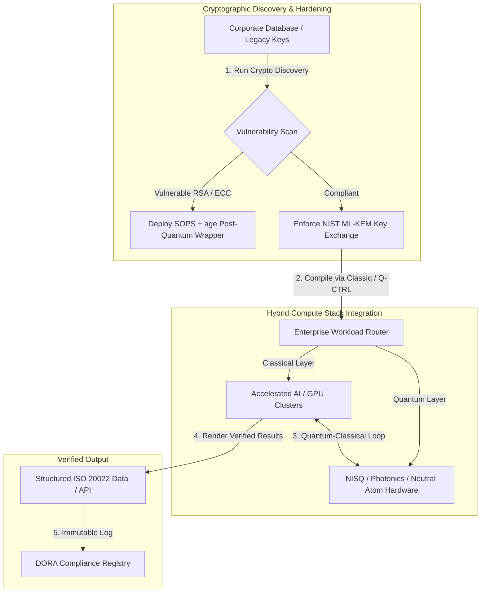

## Daripada Qubit kepada Keuntungan: Pengajaran Strategik daripada Sidang Kemuncak Economist 5th Annual Commercialising Quantum Global 2026

Kesediaan perusahaan, migrasi kriptografi pasca-kuantum, timbunan pengkomputeran hibrid, dan landskap komersial yang sedang muncul bagi penderiaan dan perangkaian kuantum.

**Ringkasan.** Persidangan 5th Annual Commercialising Quantum Global 2026, dianjurkan oleh Economist Impact pada 16–17 Jun 2026 di Business Design Centre di London, menghimpunkan lebih 1,100 pemimpin global merentasi perusahaan, kewangan, dasar, dan penyelidikan. Tema utama menandakan peralihan struktur yang jelas: teknologi kuantum telah beralih daripada sains makmal spekulatif kepada aliran kerja perusahaan hibrid yang praktikal. Disokong oleh $1.3 bilion modal teroka yang dikumpul dalam lima bulan pertama 2026 sahaja, perbincangan lembaga pengarah tidak lagi tertumpu pada mengira qubit fizikal, tetapi pada menubuhkan timbunan pengkomputeran hibrid "tanpa-kesal", melindungi aset digital daripada ancaman kriptografi "harvest-now, decrypt-later" (SNDL), dan menggerakkan sistem penderiaan kuantum jangka pendek untuk navigasi bebas GPS.

## Pengajaran utama

- **Peralihan perusahaan kepada aliran kerja praktikal.** Pemimpin industri ([Steve Suarez](https://www.linkedin.com/in/stevesuarez) dari HorizonX, [Phil Intallura](https://www.linkedin.com/in/intallura) dari HSBC) menekankan bahawa integrasi kuantum bukan lagi masalah fizik tetapi masalah operasi. Bank dan perusahaan sedang menggerakkan perintis hibrid kuantum-klasik untuk menyediakan bakat dan mengoptimumkan beban kerja aktif.
- **Kriptografi pasca-kuantum (PQC) ialah keutamaan lembaga pengarah.** Pakar keselamatan dan undang-undang (CMS UK, [Joanne Miller](https://www.linkedin.com/in/joanne-miller-nso) dari Microsoft, [Craig Farrell](https://www.linkedin.com/in/craig-farrell) dari EY) memberi amaran bahawa organisasi tidak boleh menunggu perkakasan tahan-kerosakan untuk menggerakkan PQC. Penuaian "harvest-now, decrypt-later" sedang berlaku hari ini, menjadikan migrasi ke piawaian NIST ML-KEM sebagai kebimbangan fidusiari segera.
- **Penderiaan kuantum mendahului keuntungan jangka pendek.** Walaupun pengkomputeran tahan-kerosakan masih bertahun-tahun jauhnya, penderiaan kuantum ([Matthew Kinsella](https://www.linkedin.com/in/matthewkinsella) dari Infleqtion) berkembang pesat. Jam kuantum dan penderia inersia sedang digerakkan dalam navigasi bebas GPS, keselamatan negara, dan grid tenaga ultra-stabil.
- **Kedaulatan, kluster dan keperluan mendesak dasar.** Menteri Sains UK [Lord Vallance](https://www.linkedin.com/in/patrick-vallance) dan [Lord William Hague](https://www.linkedin.com/in/williamhague) menggariskan misi negara untuk menukar penyelidikan kepada "superkluster" berskala industri yang berkoordinasi dengan National Quantum Computing Centre (NQCC). EU Quantum Act yang akan datang menegaskan lagi kesibukan geopolitik untuk kapasiti pengkomputeran berdaulat.
- **Quantcore memenangi hadiah qBIG.** Syarikat cabang University of Glasgow, Quantcore, memperoleh hadiah IOP qBIG atas komponen superkonduktor berasaskan niobium yang mercu, yang beroperasi pada suhu lebih tinggi daripada bahan tradisional, sekali gus mengurangkan overhed infrastruktur kriogenik dengan ketara.

**Bacaan berkaitan:** [KyberLib dan Migrasi Perbankan Pasca-Kuantum pada 2026: Daripada Piawaian kepada Kod](https://sebastienrousseau.com/2026-06-12-kyberlib-post-quantum-banking-migration-standards-code-2026/), [Indeks Ketahanan Perbankan pada 2026: AI, Awan, Kuantum, Pembayaran, dan Risiko Ketumpatan Pihak Ketiga](https://sebastienrousseau.com/2026-06-08-banking-resilience-index-ai-cloud-quantum-payments-third-party-risk-2026/), [Indeks Perbankan Awan-Semula Jadi pada 2026: DORA, Kejuruteraan Platform, Awan Berdaulat, dan Ketahanan Operasi](https://sebastienrousseau.com/2026-06-05-cloud-native-banking-index-dora-resilience-platform-engineering-2026/).

## 01. Mengapa Sidang Kemuncak 2026 Penting bagi Lembaga Pengarah

Edisi 2026 sidang kemuncak Commercialising Quantum Global Economist menandakan peralihan kekal dalam cara dunia korporat menilai teknologi mendalam.

Secara sejarah, pengkomputeran kuantum diletakkan dalam jabatan R&D sebagai usaha saintifik berbilang dekad. Pada Jun 2026, perspektif ini sudah lapuk. Organisasi mesti beralih daripada rasa ingin tahu "berpusatkan fizik" kepada pelaksanaan "berpusatkan perniagaan". Sebabnya ada dua:

1. **Penumpuan kuantum-AI.** Timbunan pengkomputeran berprestasi tinggi (HPC) sedang bergabung dengan nod klasik, AI dipercepat, dan NISQ (Noisy Intermediate-Scale Quantum) menjadi satu lapisan pengkomputeran bersatu. Organisasi yang menangguhkan pembinaan aplikasi sedia-kuantum akan mendapati bahawa tetingkap untuk merebut kelebihan strategik sedang tertutup lebih cepat daripada dijangka.
2. **Keperluan mendesak geopolitik dan fidusiari.** Dengan program kuantum dipimpin-misi UK dan EU Quantum Act yang akan datang, kapasiti kuantum telah menjadi soal kedaulatan negara dan kesinambungan korporat.

Tambahan pula, keselamatan siber pasca-kuantum bukan lagi keperluan pematuhan masa depan. Ancaman serangan "store now, decrypt later" (SNDL) yang bermusuhan bermakna data korporat yang dipintas hari ini akan dinyahsulit apabila sistem kuantum komersial berkembang, mewujudkan liabiliti segera di bawah mandat ketahanan operasi global seperti Digital Operational Resilience Act (DORA).

## 02. Lensa Strategik Commercialising Quantum 2026

Pemimpin teknologi perusahaan mesti memetakan kematangan kuantum merentasi lima lapisan operasi yang berbeza, menilai ufuk garis masa dan risiko kunci kira-kira.

### Jadual 1: Lensa strategik Commercialising Quantum 2026

| Lapisan | Fokus korporat | Garis masa / ufuk | Risiko korporat utama |
| ---- | ---- | ---- | ---- |
| **Perkakasan & pengkompil** | Memilih antara pendekatan bersaing (superkonduktor, ion terperangkap, atom neutral, fotonik) | 3 – 5 tahun (ketahanan-kerosakan) | Terkunci pada seni bina buntu atau menyokong satu platform terlalu awal. |
| **Pengukuhan kriptografi** | Penemuan dan inventori kebergantungan kriptografi; migrasi ke NIST ML-KEM | Segera (migrasi aktif) | Pelanggaran data sistemik dan kegagalan pematuhan di bawah DORA dan NIST CSF 2.0. |
| **Penderiaan kuantum** | Penggerakan navigasi bebas GPS, jam ultra-stabil, dan gravimeter | 1 – 2 tahun (komersial segera) | Gangguan operasi logistik, penghantaran, dan grid tenaga akibat pengganggu GPS. |
| **Integrasi sistem** | Menyambungkan perkakasan kuantum ke dalam pusat data HPC dan superkomputer klasik sedia ada | 1 – 3 tahun (fasa hibrid) | Kependaman tinggi, kesesakan pemindahan data, dan silo pengkomputeran berpecah-belah. |
| **Perisian perusahaan** | Mendedahkan algoritma kuantum melalui lapisan abstraksi peringkat tinggi dan API (Classiq, Q-CTRL) | Segera (pembinaan kemahiran) | Pengasingan bakat dan aliran kerja daripada pelaksanaan kejuruteraan sebenar. |

## 03. Isyarat Kuantum Utama dan Pencetus Lembaga Pengarah

Pemimpin teknologi mesti memantau metrik pasaran dan kawal selia tertentu yang boleh diukur untuk memandu pelaburan kuantum mereka.

### Jadual 2: Isyarat kuantum utama dan pencetus lembaga pengarah

| Isyarat | Metrik kuantitatif | Rujukan kawal selia / dasar | Keutamaan platform yang boleh diambil tindakan |
| ---- | ---- | ---- | ---- |
| **Lonjakan pembiayaan kuantum** | $1.3 bilion dikumpul di seluruh dunia dalam lima bulan pertama 2026 | Pulangan atas Ketahanan (RoR) | Alihkan bajet daripada perintis spekulatif kepada beban kerja hibrid kuantum-klasik "tanpa-kesal". |
| **Pendedahan penyahsulitan data** | 100% data tersulit yang dihantar melalui saluran awam terdedah kepada penuaian SNDL | DORA Perkara 6 (keselamatan ICT) | Laksanakan alat penemuan kriptografi untuk mengenal pasti kunci RSA/ECC terdedah merentasi seluruh estet. |
| **Infrastruktur berdaulat** | Peruntukan £2.5 bilion UK National Quantum Strategy | UK Quantum Missions / Lord Vallance | Wujudkan perkongsian tempatan dengan superkluster negara seperti NQCC. |
| **Tarikh akhir pematuhan** | Peralihan alamat berstruktur SWIFT 14 November 2026 | Arahan SWIFT SR 2026 | Bersihkan dan formatkan pangkalan data antara bank untuk memenuhi spesifikasi XML berstruktur. |

## 04. Penelitian Mendalam Tema Teras Sidang Kemuncak

### Kuantum mencapai titik peralihan pelaburan

Pembiayaan modal teroka telah mengalami pecutan ketara, mengumpul **$1.3 bilion** dalam lima bulan pertama 2026 sahaja. Tidak seperti kitaran gembar-gembur spekulatif tahun-tahun sebelumnya, gelombang modal semasa disokong oleh beban kerja jangka pendek dunia nyata. Pembentang dari Classiq dan IBM Quantum Platform menunjukkan bagaimana lapisan abstraksi perisian dan pengkompil automatik membolehkan pasukan pembangun bukan pakar melaksanakan algoritma hibrid kuantum-klasik pada infrastruktur klasik hari ini. Strategi "tanpa-kesal" ini membolehkan organisasi membina bakat dan aliran kerja sedia-kuantum dengan segera.

### Amaran undang-undang dan kawal selia mengenai "harvest now, decrypt later"

Rakan kongsi undang-undang dan eksekutif keselamatan siber mencetuskan penglibatan besar mengenai kesegeraan risiko data. Wakil daripada firma guaman penaja CMS UK dan CSO Microsoft [Joanne Miller](https://www.linkedin.com/in/joanne-miller-nso) menyampaikan amaran tegas kepada pengurusan kanan: *menunggu ketibaan perkakasan tahan-kerosakan sebelum menggerakkan kriptografi pasca-kuantum ialah kegagalan fidusiari yang kritikal.*

Di bawah paradigma "store now, decrypt later" (SNDL), pihak yang bermusuhan sedang giat menuai data korporat tersulit hari ini dengan niat untuk menyahsulitnya sebaik sahaja komputer kuantum yang relevan secara kriptografi muncul. Organisasi mesti menggerakkan perlindungan pasca-kuantum (seperti NIST ML-KEM) dengan segera untuk melindungi set data sensitif berhayat panjang, harta intelek, dan rekod pelanggan bersejarah.

### Penjajaran semula gembar-gembur "penderiaan kuantum"

Walaupun pengkomputeran kuantum tahan-kerosakan masih bertahun-tahun jauhnya, sidang kemuncak menonjolkan penderiaan kuantum sebagai gelombang penggerakan dunia nyata pertama yang benar-benar menguntungkan. Ketua Eksekutif [Matthew Kinsella](https://www.linkedin.com/in/matthewkinsella) dari Infleqtion menghuraikan bagaimana jam kuantum, penderia inersia, dan sistem frekuensi radio berkembang pesat merentasi pelbagai industri.

Kerana teknologi ini mengukur pemalar fizikal dengan ketepatan sub-atom, ia membolehkan **navigasi bebas GPS**, grid tenaga ultra-stabil, dan telekomunikasi angkasa lepas. Aplikasi ini amat relevan bagi penerbangan, pengangkutan maritim, dan sistem pertahanan negara yang menghadapi ancaman pengganggu GPS yang semakin meningkat.

### Kerjasama ekosistem dan kluster

Ekosistem kuantum UK menggunakan sidang kemuncak London untuk mempamerkan superkluster inovasi dalam negara. Kemas kini langsung daripada National Quantum Computing Centre (NQCC) dan Digital Catapult menghuraikan bagaimana syarikat cabang teknologi-mendalam peringkat awal boleh merapatkan "jurang teknologi" dengan mengintegrasikan perkakasan kuantum secara langsung ke dalam pusat data superkomputer klasik.

[Wridhdhisom Karar](https://www.linkedin.com/in/wridhdhisomkarar), pengasas bersama syarikat permulaan kuantum Scotland Quantcore, menerima hadiah berprestij Institute of Physics (IOP) Quantum Business Innovation and Growth (qBIG) atas komponen superkonduktor berasaskan niobium syarikat itu. Komponen ini beroperasi pada suhu lebih tinggi daripada bahan tradisional, sekali gus mengurangkan dengan ketara overhed infrastruktur kriogenik yang diperlukan untuk menskalakan pemproses kuantum.

### Kajian kes HSBC: mengapa menunggu kuantum ialah "kesilapan yang tidak dipaksa"

Pandangan daripada [**Philip Intallura, Ph.D.**](https://www.linkedin.com/in/intallura) (Ketua Global Teknologi Kuantum di HSBC, Penasihat Kerajaan UK, dan Penasihat Lembaga) pada Acara Economist 5th Annual Commercialising Quantum (2026) menyampaikan arahan lembaga pengarah yang berkuasa: *"Menunggu kuantum tahan-kerosakan sebelum anda bermula ialah kesilapan yang tidak dipaksa."*

Dr Intallura berhujah bahawa pendekatan "tunggu-dan-lihat" yang lazim dalam kalangan institusi kewangan ialah jaringan sendiri yang dibina atas tiga andaian yang salah:

- **ROI jangka pendek adalah nyata.** Dalam ujian empirikal, HSBC telah mengatasi model yang kini berjalan dalam pengeluaran, menghubungkan kerja kuantum kepada bahagian lain perniagaan, menggunakan kuantum untuk memperdalam hubungan dengan sebahagian pelanggan terbesarnya, dan menarik perniagaan baharu yang ketara ke dalam **HSBC Innovation Banking**.
- **Kuantum ialah keluk penerimaan yang curam.** Membina keupayaan, menetapkan strategi, mendapatkan pembiayaan, dan menjalankan kitaran eksperimen dalam organisasi yang dikawal selia dengan ketat bukanlah usaha yang singkat. Proses mesti diuji dan disesuaikan secara sistematik untuk teknologi tersebut.
- **Kuantum ialah satu ekosistem.** Tiada satu pihak pun sampai ke sana bersendirian. Setiap kertas penyelidikan, POC, dan perintis yang dilaksanakan HSBC telah dilakukan dalam kerjasama rapat dengan penyedia kuantum — dan dalam beberapa kes, kerjasama meluas kepada akademia, pengawal selia, dan kerajaan.

**Arahan penutup lembaga pengarah:** *"Keupayaan yang anda perlukan pada hari pertama ketahanan-kerosakan ialah keupayaan yang anda bina sekarang."*

## 05. Integrasi Kuantum Korporat dan Saluran Paip Kriptografi

Untuk melindungi aset digital sambil membina kesediaan kuantum, perusahaan mesti menubuhkan saluran paip integrasi yang jelas.

## 06. Buku Panduan Lembaga Pengarah: Imperatif yang Boleh Diambil Tindakan

Untuk menterjemahkan pandangan sidang kemuncak Commercialising Quantum Global 2026 kepada nilai perniagaan segera, pengurusan kanan harus melaksanakan buku panduan lembaga pengarah empat langkah berikut:

1. **Mandatkan penemuan kriptografi.** Arahkan Ketua Pegawai Keselamatan Maklumat (CISO) untuk mengkatalogkan semua aset kriptografi, memetakan setiap kunci warisan RSA dan ECC merentasi perusahaan untuk bersedia bagi migrasi pasca-kuantum.
2. **Gerakkan strategi hibrid "tanpa-kesal".** Elakkan menunggu perkakasan sempurna. Laburkan dalam perisian terilham-kuantum dan perintis hibrid klasik-kuantum untuk membangunkan bakat dalaman dan mengoptimumkan logistik kompleks atau portfolio risiko hari ini.
3. **Nilai penderiaan kuantum untuk logistik.** Jika organisasi anda bergantung pada rantaian bekalan global, penghantaran, atau infrastruktur kritikal, nilai secara aktif sistem penderiaan kuantum (seperti navigasi bebas GPS) untuk mengurangkan risiko gangguan geopolitik.
4. **Daftar untuk Insight Hour 30 Jun.** Pastikan pemimpin teknologi anda mendaftar untuk **Commercialising Quantum Global Insight Hour** maya pada 30 Jun 2026, jam 3:00 petang BST (disokong oleh IonQ) untuk terus menjejaki strategi pengurusan risiko perusahaan dan pengagihan bakat.

## 07. Soalan Lazim

**Apakah "harvest now, decrypt later" (SNDL) dan mengapa ia penting hari ini?**
SNDL ialah amalan memintas dan menyimpan data tersulit hari ini, dengan niat untuk menyahsulitnya kemudian sebaik sahaja komputer kuantum yang relevan secara kriptografi tersedia. Set data sensitif berhayat panjang — harta intelek, rekod pelanggan, komunikasi kerajaan — sudah pun disasarkan. Migrasi ke NIST ML-KEM ialah keputusan fidusiari yang tidak boleh ditangguhkan oleh lembaga.

**Mengapa penderiaan kuantum ialah gelombang komersial pertama dan bukan pengkomputeran?**
Penderia kuantum mengukur pemalar fizikal dengan ketepatan sub-atom dan tidak memerlukan perkakasan tahan-kerosakan seperti yang diperlukan pengkomputeran kuantum. Jam kuantum, gravimeter, dan penderia inersia sudah dalam penggerakan perintis untuk navigasi bebas GPS, grid tenaga ultra-stabil, dan komunikasi angkasa lepas.

**Adakah kerja kuantum HSBC hanya R&D atau telah menghasilkan pulangan yang boleh diukur?**
Menurut Philip Intallura pada sidang kemuncak, HSBC telah mengatasi model yang kini berjalan dalam pengeluaran, menggunakan kuantum untuk memperdalam hubungan dengan pelanggan terbesarnya, dan menarik perniagaan baharu yang ketara ke dalam HSBC Innovation Banking. Kerja itu telah beralih daripada penyelidikan kepada integrasi operasi.

## 08. Rujukan

- **Economist Impact, (2026).** *5th Annual Commercialising Quantum Global 2026.* Prosiding persidangan langsung, 16–17 Jun 2026. London: Business Design Centre. Tersedia di: [Economist Impact](https://events.economist.com/commercialising-quantum/).
- **National Institute of Standards and Technology (NIST), (2024).** *First Three Finalized Post-Quantum Encryption Standards (FIPS 203, 204, and 205).* Gaithersburg: U.S. Department of Commerce. Tersedia di: [NIST Standards](https://www.nist.gov/news-events/news/2024/08/nist-releases-first-3-finalized-post-quantum-encryption-standards).
- **European Parliament and Council of the European Union, (2022).** *Regulation (EU) 2022/2554 on digital operational resilience for the financial sector (DORA).* Brussels: Official Journal of the European Union. Tersedia di: [DORA Regulation](https://eur-lex.europa.eu/legal-content/EN/TXT/?uri=CELEX%3A32022R2554).
- **SWIFT, (2024).** *[ISO 20022](/2023-09-29-automating-iso-20022-compliant-payment-file-creation-with-pain001/index.html) November 2026 Structured Address Milestone.* La Hulpe: SWIFT. Tersedia di: [SWIFT ISO 20022 milestone](https://www.swift.com/standards/iso-20022/iso-20022-bytes/call-action-november-2026).
