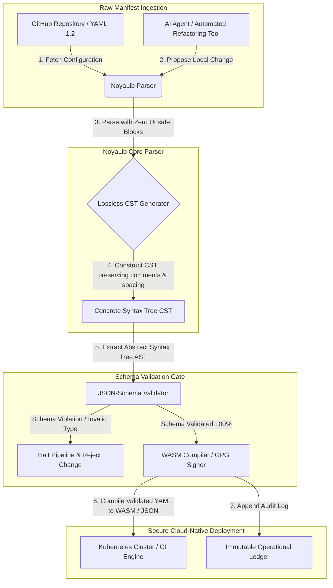

## Mengapa YAML Memerlukan Timbunan Rust yang Lebih Selamat untuk AI, MCP, dan Infrastruktur Kewangan pada 2026

Timbunan YAML Rust yang lebih selamat penting kerana YAML kini membawa saluran paip CI/CD, manifes Kubernetes, peraturan [Open Policy Agent](https://www.openpolicyagent.org/), dan pendaftaran alat Model Context Protocol (MCP) — dan satu huraian yang taksa boleh merosakkan sistem penjelasan, tersalah konfigurasi kumpulan keselamatan, atau menyerahkan kebenaran yang salah kepada ejen AI tempatan. [NoyaLib](https://github.com/sebastienrousseau/noyalib) ialah ekosistem penghuraian dan pengesahan [YAML 1.2](https://yaml.org/spec/1.2.2/) Rust tulen tanpa unsafe yang direka bentuk untuk menjadikan infrastruktur itu selamat secara lalai.

## Jawapan pantas

**Apakah NoyaLib dalam satu ayat?** NoyaLib ialah ekosistem penghurai dan pengesahan YAML 1.2 Rust tulen sumber terbuka dengan kod `unsafe` sifar, pematuhan spesifikasi 100 % merentas suite YAML 406-ujian rasmi, Concrete Syntax Tree tanpa kehilangan, dan pengesahan [JSON Schema](https://json-schema.org/) masa nyata — direka bentuk untuk menjadikan konfigurasi ejen AI, MCP, Kubernetes, dan infrastruktur kewangan selamat secara lalai.

## Ringkasan eksekutif

YAML kelihatan sederhana sehinggalah huraian yang taksa atau pelanggaran skema merosakkan sistem penjelasan pengeluaran bernilai berbilion dolar. Pada 2026, YAML ialah piawai de-facto untuk saluran paip [CI/CD](https://docs.github.com/en/actions/learn-github-actions/workflow-syntax-for-github-actions), manifes [Kubernetes](https://kubernetes.io/docs/concepts/configuration/overview/), peraturan [Open Policy Agent](https://www.openpolicyagent.org/), dan pendaftaran alat Model Context Protocol (MCP). Penghurai warisan yang legap — dengan kerentanan memori dan penghuraian yang merosakkan — merupakan risiko keselamatan yang tidak boleh diterima. NoyaLib ialah ekosistem YAML 1.2 Rust tulen tanpa unsafe: pematuhan spesifikasi 100 % merentas kesemua 406 ujian suite rasmi, Concrete Syntax Tree (CST) tanpa kehilangan yang mengekalkan komen dan jarak, dan pengesahan JSON-Schema terbina dalam. Hasilnya ialah YAML yang dibentuk semula sebagai satah kawalan konfigurasi yang boleh diaudit, selamat, dan boleh diakses ejen.

## Intipati penting

- **Konfigurasi ialah kod pengeluaran.** Satu fail YAML yang cacat boleh tersalah konfigurasi kumpulan keselamatan asli-awan atau kebenaran ejen AI. NoyaLib memperlakukan YAML sebagai infrastruktur kritikal.
- **Reka bentuk tanpa unsafe.** Dibina sepenuhnya dalam Rust selamat dengan sifar blok `unsafe`, NoyaLib menghapuskan kerentanan keselamatan memori — limpahan penimbal, pelaksanaan kod jarak jauh — dalam lapisan penghuraian teras.
- **Pematuhan spesifikasi mutlak 406/406.** Mengesahkan struktur konfigurasi secara matematik, menghapuskan percanggahan penghuraian dan hanyutan struktur antara persekitaran pementasan dan pengeluaran.
- **Concrete Syntax Tree tanpa kehilangan.** Tidak seperti penghurai warisan yang membuang komen dan pemformatan, NoyaLib mengekalkan jarak dan anotasi, membolehkan pemfaktoran semula automatik pergi-balik yang selamat oleh ejen AI.
- **Nilai fidusiari peringkat lembaga.** Menghubungkan integriti konfigurasi dengan metrik modal risiko operasi [DORA Article 5](https://eur-lex.europa.eu/legal-content/EN/TXT/?uri=CELEX%3A32022R2554) dan [Basel III](https://www.bis.org/bcbs/publ/d424.htm), secara langsung melindungi pengurusan kanan daripada liabiliti peribadi.

**Bacaan berkaitan:** [KyberLib dan Migrasi Perbankan Pasca-Kuantum pada 2026: Daripada Piawaian kepada Kod](https://sebastienrousseau.com/2026-06-12-kyberlib-post-quantum-banking-migration-standards-code-2026/), [Indeks Perbankan Asli-Awan pada 2026: DORA, Kejuruteraan Platform, Awan Berdaulat, dan Daya Tahan Operasi](https://sebastienrousseau.com/2026-06-05-cloud-native-banking-index-dora-resilience-platform-engineering-2026/), [Dotfiles Sedar-AI pada 2026: Membina Stesen Kerja Pembangun yang Selamat dan Boleh Dihasilkan Semula untuk MCP, SLSA, dan Pariti Berbilang-Shell](https://sebastienrousseau.com/2026-06-16-ai-aware-dotfiles-secure-reproducible-workstation-2026/).

## 01. Mengapa Timbunan YAML Rust yang Lebih Selamat Penting pada 2026

Pada Jun 2026, infrastruktur IT perusahaan sangat teragih dan semakin automatik.

YAML secara senyap telah menjadi bahasa konfigurasi yang menanggung beban untuk keseluruhan timbunan kejuruteraan perisian. Ia membawa aliran kerja penyepaduan berterusan (CI) yang mengkompil artifak pengeluaran, manifes [Kubernetes](https://kubernetes.io/docs/concepts/overview/) yang mengorkestra kluster asli-awan global, dan skema pelayan [Model Context Protocol](https://modelcontextprotocol.io/) (MCP) yang memberi ejen AI tempatan kebenaran untuk melaksanakan operasi tempatan.

Penghurai YAML warisan — [PyYAML](https://pyyaml.org/), [yaml-cpp](https://github.com/jbeder/yaml-cpp), [libyaml](https://github.com/yaml/libyaml) — membawa dua risiko struktur:

1. **Kerentanan pemaksaan jenis ("masalah Norway").** Penghurai warisan kerap memaksa rentetan tidak berpetik (kod negara `NO` menjadi boolean `false`, `yes`/`no` begitu juga) — lihat [tag boolean YAML 1.1 vs 1.2](https://yaml.org/type/bool.html) — menyebabkan kegagalan sistem kritikal atau salah konfigurasi keselamatan secara senyap.
2. **Eksploitasi keselamatan memori.** Penghurai legap yang ditulis dalam C/C++ mengalami eksploitasi kebocoran memori dan limpahan penimbal, yang boleh membawa kepada pelaksanaan kod jarak jauh (RCE) pada pelayan binaan teras.

[NoyaLib](https://github.com/sebastienrousseau/noyalib) menyelesaikan cabaran ini. Ia ialah ekosistem penghuraian dan pengesahan YAML 1.2 Rust tulen tanpa unsafe. Dengan mencapai pematuhan spesifikasi mutlak 406/406 dan menguatkuasakan pengesahan JSON-Schema yang ketat secara langsung semasa huraian, NoyaLib menyampaikan **Pulangan atas Daya Tahan (Return on Resilience, RoR)** yang tinggi — mencegah masa henti akibat konfigurasi dan mengamankan rantaian bekalan perisian bertaraf kewangan.

## 02. Kanta Seni Bina NoyaLib 2026

Ekosistem NoyaLib beroperasi sebagai penghurai konfigurasi yang selamat dan tanpa kehilangan. Setiap manifes tempatan dan awan disahkan secara struktur dan dilindungi pada lapisan pelaksanaan terendah.

### Jadual 1: Lapisan seni bina NoyaLib dan mitigasi risiko

| Lapisan | Keputusan reka bentuk | Mengapa ia penting | Risiko jika tersalah urus |
| ---- | ---- | ---- | ---- |
| **Lapisan penghurai** | Penghurai Rust tulen yang mematuhi YAML 1.2 dengan sifar blok `unsafe` | Menghapuskan kerentanan keselamatan memori dan limpahan penimbal pada lapisan pelaksanaan terendah. | Pelaksanaan kod jarak jauh (RCE) pada pelayan binaan teras. |
| **Lapisan pematuhan** | Pematuhan 100 % merentas 406/406 ujian suite YAML 1.2 rasmi | Menghapuskan percanggahan penghuraian dan hanyutan pemaksaan jenis antara pementasan dan pengeluaran. | Ralat pemaksaan jenis "masalah Norway" yang melumpuhkan kumpulan keselamatan. |
| **Lapisan pepohon sintaks** | Concrete Syntax Tree (CST) tanpa kehilangan | Mengekalkan komen, jarak dan turutan semasa penghuraian pergi-balik dan pemfaktoran semula secara pengaturcaraan. | Pemfaktoran semula AI automatik memusnahkan anotasi pembangun. |
| **Lapisan pengesahan** | Pengesahan [JSON Schema (Draft 2020-12)](https://json-schema.org/draft/2020-12/release-notes) semasa penghuraian | Menguatkuasakan model data ketat pada fail konfigurasi sebelum ia mencapai kluster pengeluaran. | Fail konfigurasi cacat mencetuskan kerosakan kluster asli-awan. |
| **Lapisan antara muka** | Pengikatan WebAssembly (WASM) dan MCP | Membenarkan pengesahan konfigurasi berjalan terus di dalam pelayar, nod edge, dan kit alat ejen tempatan. | Silo perkakasan di mana pengesahan tidak dapat dilaksanakan pada peranti edge. |

## 03. Isyarat Keselamatan Stesen Kerja dan Konfigurasi Utama

Untuk mengekalkan keselamatan mutlak merentas estet pembangunan dan operasi, Ketua Pegawai Keselamatan Maklumat (CISO) mesti memantau metrik khusus yang boleh diukur.

### Jadual 2: Isyarat keselamatan stesen kerja dan konfigurasi

| Isyarat | Metrik / penanda aras operasi | Rujukan NIST CSF / DORA | Pelaksanaan platform teknikal |
| ---- | ---- | ---- | ---- |
| **Pematuhan penghurai** | Kadar lulus 100 % merentas suite ujian YAML 1.2 rasmi (406/406 ujian). | [DORA Article 6](https://eur-lex.europa.eu/legal-content/EN/TXT/?uri=CELEX%3A32022R2554) (keselamatan ICT) | Teras penghurai NoyaLib mengesahkan semua manifes sebelum pelaksanaan CI. |
| **Profil keselamatan memori** | Sifar blok `unsafe` Rust dalam kebergantungan penghurai dan penyiri. | DORA Article 30 (rantaian bekalan) | Pemeriksaan pengkompil automatik ([`forbid(unsafe_code)`](https://doc.rust-lang.org/reference/attributes/diagnostics.html#the-forbid-attribute)) dalam binaan cargo. |
| **Pengesahan skema** | 100 % fail konfigurasi terhurai disahkan terhadap model [JSON Schema](https://json-schema.org/) yang sah. | [NIST CSF 2.0](https://www.nist.gov/cyberframework) (PR.DS-01) | Get pengesahan masa nyata menghentikan saluran paip binaan apabila berlaku pelanggaran skema. |
| **Hanyutan konfigurasi** | Pengesanan masa nyata dan pemulihan fail konfigurasi tempatan kepada keadaan berversi-git. | Pulangan atas Daya Tahan (RoR) | Telemetri berterusan mengelog semua pengubahsuaian fail tempatan. |
| **Kawalan akses ejen** | Kebenaran terbatas dan baca-sahaja untuk alat AI tempatan yang beroperasi melalui konfigurasi MCP. | Pengurusan risiko model ([SR 11-7](https://web.archive.org/web/20260414150921/https://www.federalreserve.gov/supervisionreg/srletters/sr1107.htm)) | Sempadan pelayan MCP menyekat operasi ejen kepada direktori yang diluluskan. |

## 04. Kesilapan Penghuraian Konfigurasi Legap

Satu kerentanan utama dalam operasi asli-awan ialah *penghuraian legap* — menggunakan penghurai yang membuang metadata struktur (komen, ruang putih, turutan dokumen) atau memaksa jenis secara senyap semasa kompilasi. Tingkah laku ini memperkenalkan dua risiko keselamatan yang serius:

1. **Pemfaktoran semula yang merosakkan.** Apabila pembantu pengekodan AI atau alat pemfaktoran semula automatik mengemas kini manifes penggunaan, penghurai tradisional membuang komen dan pemformatan pembangun, memusnahkan konteks yang diperlukan untuk semakan manusia dan forensik pasca-insiden.
2. **Percanggahan penghuraian.** Jika persekitaran pementasan menggunakan penghurai berasaskan Python dan pengeluaran menjalankan penghurai berasaskan C, perbezaan kecil dalam pematuhan spesifikasi YAML 1.2 boleh menyebabkan manifes pementasan yang sah gagal atau berkelakuan berbeza dalam pengeluaran, mewujudkan kerentanan keselamatan tersembunyi.

**Concrete Syntax Tree (CST) tanpa kehilangan** milik NoyaLib menyelesaikan hal ini. Ia mengekalkan setiap ruang, komen, dan baris dokumen semasa gelung huraian-dan-siri. Pembantu AI automatik boleh menyunting, memfaktor semula, dan komit fail konfigurasi sambil mengekalkan 100 % anotasi yang ditulis manusia — jejak audit yang mutlak.

## 05. Mereka Bentuk Saluran Paip Konfigurasi AI yang Terbatas

Untuk mencegah perubahan konfigurasi berniat jahat daripada mencapai persekitaran pengeluaran, organisasi mesti melaksanakan saluran paip konfigurasi yang terbatas secara ketat dan disahkan skema.

Aliran operasi di bawah menunjukkan cara NoyaLib menghuraikan YAML mentah, membina CST tanpa kehilangan, mengesahkan AST terhadap model JSON-Schema, dan mengkompil pengikatan WebAssembly untuk persekitaran pelayar atau edge.

## 06. Buku Panduan Bilik Lembaga dan Liabiliti Fidusiari

Keselamatan konfigurasi dan integriti rantaian bekalan perisian ialah keutamaan kritikal bilik lembaga. Pengurus kanan mesti menangani pengurusan konfigurasi melalui kanta tugas fidusiari dan daya tahan operasi.

- **DORA Article 5 (akauntabiliti lembaga).** Menetapkan bahawa lembaga memikul tanggungjawab muktamad dan tidak boleh diwakilkan untuk mengurus risiko ICT institusi. Kerana fail konfigurasi mengawal kumpulan keselamatan asli-awan yang kritikal dan laluan penghalaan pembayaran, lembaga mesti mengesahkan bahawa sistem yang menghuraikan manifes ini selamat memori dan mematuhi spesifikasi sepenuhnya untuk memenuhi audit kawal selia. ([Regulation (EU) 2022/2554](https://eur-lex.europa.eu/legal-content/EN/TXT/?uri=CELEX%3A32022R2554))
- **BCBS 239 (pengagregatan dan pelaporan data risiko).** Memerlukan pelaporan risiko dan metrik infrastruktur yang tepat, lengkap, dan dijana di bawah kawalan kualiti data yang ketat. NoyaLib menyokong BCBS 239 dengan menghuraikan dan mengesahkan fail konfigurasi terhadap skema yang ketat pada sumbernya, mencegah kebocoran data senyap atau gangguan akibat salah konfigurasi. ([BCBS 239 standard](https://www.bis.org/publ/bcbs239.htm))
- **Mitigasi caj modal risiko operasi (Basel III).** Gangguan akibat konfigurasi secara langsung membengkakkan caj modal risiko operasi di bawah Basel III, mengikat modal kunci kira-kira. Menyeragamkan timbunan konfigurasi perusahaan pada penghurai Rust tulen yang selamat seperti NoyaLib meminimumkan risiko ini, memelihara modal dan melindungi kepercayaan pelanggan. ([Basel III standards](https://www.bis.org/bcbs/publ/d424.htm))

## 07. Apa Maksudnya Mengikut Jenis Bank

### Bank Penting Sistemik Global (G-SIB)

G-SIB mengurus ribuan perkhidmatan mikro dan saluran paip penggunaan merentas pelbagai bidang kuasa. Cabaran utama mereka ialah mengekalkan konsistensi konfigurasi dan mencegah hanyutan keselamatan merentas estet asli-awan yang besar. Menyeragamkan pada timbunan YAML Rust yang lebih selamat seperti NoyaLib menjamin bahawa semua manifes Kubernetes, saluran paip CI/CD, dan dasar keselamatan dihuraikan dan disahkan di bawah rangka kerja yang seragam dan selamat memori — menghapuskan risiko konfigurasi "snowflake" yang tidak diaudit.

### Bank transaksi dan korporat

Bank transaksi mengendalikan get pembayaran yang sensitif dan infrastruktur penjelasan borong. Membuktikan keselamatan mutlak kod dan konfigurasi yang digunakan dalam persekitaran pengeluaran ini ialah tuntutan kawal selia yang tidak boleh ditawar. Menyepadukan NoyaLib menjamin bahawa rantaian bekalan perisian diaudit sepenuhnya, tanpa kehilangan, dan dilindungi daripada kerentanan penghuraian — kawalan yang dipetakan dengan kemas kepada DORA Article 6 dan [PCI DSS v4.0](https://www.pcisecuritystandards.org/document_library/) seksyen 6.

### Bank serantau dan lebih kecil

Bank serantau mesti mengekalkan piawai keselamatan siber yang tinggi tanpa belanjawan teknologi berskala G-SIB. Rangka kerja NoyaLib sumber terbuka menyediakan penyelesaian mesra-Rust yang ringan, kos efektif, dan sangat selamat, membolehkan institusi lebih kecil melaksanakan keselamatan konfigurasi bertaraf perusahaan dan perlindungan rantaian bekalan tanpa yuran lesen proprietari.

## 08. Kesimpulan: Peta Jalan Keselamatan Konfigurasi

Stesen kerja pembangun dan konfigurasi infrastruktur asli-awan ialah satah kawalan yang kritikal dalam rantaian bekalan perisian. Membenarkan fail konfigurasi yang tidak diaudit, taksa, atau tidak selamat mencapai aset korporat merupakan risiko operasi dan kawal selia yang tidak boleh diterima.

Untuk mengamankan rantaian bekalan perisian dan melindungi titik akhir daripada kerentanan konfigurasi, pengurus teknologi dan keselamatan kanan patut melaksanakan peta jalan pembangunan yang jelas hari ini:

1. **Wajibkan konfigurasi deklaratif.** Hapuskan secara berperingkat pelarasan konfigurasi manual yang tidak diaudit dan wajibkan semua manifes diurus sebagai sistem rekod deklaratif yang berkawalan versi.
2. **Kuatkuasakan pengesahan skema.** Kuatkuasakan cangkuk pra-komit yang ketat dan utiliti imbasan untuk memastikan semua fail konfigurasi disahkan terhadap model JSON-Schema yang sah sebelum penggunaan.
3. **Laksanakan pergi-balik tanpa kehilangan.** Pastikan semua pembantu pengekodan AI automatik dan alat pemfaktoran semula menggunakan penghuraian tanpa kehilangan untuk mengekalkan komen, jarak, dan konteks pembangun.
4. **Amankan rantaian bekalan.** Pastikan semua persediaan konfigurasi dan utiliti penghuraian disahkan secara kriptografi menggunakan pustaka Rust tulen tanpa unsafe seperti NoyaLib sebelum pelaksanaan. ([SLSA framework](https://slsa.dev/))

## 09. Soalan Lazim

**Apakah NoyaLib dan mengapa ia digunakan untuk penghuraian YAML?**
NoyaLib ialah penghurai YAML 1.2 Rust tulen tanpa unsafe yang bersifat sumber terbuka. Ia mencapai pematuhan spesifikasi 100 % merentas suite 406-ujian rasmi, menguatkuasakan pengesahan [JSON Schema](https://json-schema.org/) yang ketat semasa penghuraian, dan mendedahkan pengikatan WASM dan [MCP](https://modelcontextprotocol.io/) — menjadikannya timbunan YAML Rust yang lebih selamat untuk ejen AI, Kubernetes, dan infrastruktur kewangan.

**Mengapa reka bentuk tanpa unsafe penting untuk penghuraian konfigurasi?**
Kerentanan keselamatan memori — limpahan penimbal, use-after-free — dalam penghurai warisan yang ditulis dalam C/C++ boleh membawa kepada pelaksanaan kod jarak jauh pada pelayan binaan teras. Reka bentuk Rust tulen NoyaLib dengan [`#![forbid(unsafe_code)]`](https://doc.rust-lang.org/reference/attributes/diagnostics.html#the-forbid-attribute) menghapuskan kerentanan ini secara matematik pada masa kompilasi.

**Apakah Concrete Syntax Tree (CST) tanpa kehilangan dan mengapa ia penting?**
Penghurai tradisional membuang komen dan pemformatan, menjadikan suntingan automatik oleh ejen AI merosakkan. Concrete Syntax Tree tanpa kehilangan milik NoyaLib mengekalkan setiap komen, ruang, dan baris dokumen — jadi pembantu AI boleh menyunting dan memfaktor semula fail konfigurasi dengan selamat sambil mengekalkan konteks pembangun, forensik pasca-insiden, dan jejak audit tetap utuh.

**Bagaimana NoyaLib dipetakan kepada DORA, BCBS 239, dan Basel III?**
DORA Article 5 meletakkan akauntabiliti risiko-ICT pada lembaga; BCBS 239 menuntut kawalan kualiti data pada pelaporan risiko; Basel III mengenakan cukai pada modal risiko operasi. NoyaLib membekalkan lapisan huraian yang disahkan skema dan selamat memori yang diperlukan oleh peraturan tersebut untuk konfigurasi sebagai kod — menjadikan pemetaan kawal selia mudah dan caj modal risiko operasi lebih kecil.

## 10. Rujukan

- **YAML, (2026).** *YAML 1.2 specification*. Tersedia di: [YAML 1.2 spec](https://yaml.org/spec/1.2.2/).
- **JSON Schema, (2026).** *JSON Schema Draft 2020-12 release notes*. Tersedia di: [JSON Schema Draft 2020-12](https://json-schema.org/draft/2020-12/release-notes).
- **European Parliament and Council of the European Union, (2022).** *Regulation (EU) 2022/2554 on digital operational resilience for the financial sector (DORA)*. Brussels: Official Journal of the European Union. Tersedia di: [DORA regulation](https://eur-lex.europa.eu/legal-content/EN/TXT/?uri=CELEX%3A32022R2554).
- **Basel Committee on Banking Supervision, (2013).** *Principles for effective risk data aggregation and risk reporting (BCBS 239)*. Basel: Bank for International Settlements. Tersedia di: [BCBS 239 standard](https://www.bis.org/publ/bcbs239.htm).
- **Basel Committee on Banking Supervision, (2017).** *Basel III: finalising post-crisis reforms*. Basel: Bank for International Settlements. Tersedia di: [Basel III standards](https://www.bis.org/bcbs/publ/d424.htm).
- **Anthropic, (2025).** *Model Context Protocol (MCP) specification*. Tersedia di: [Model Context Protocol](https://modelcontextprotocol.io/).
- **GitHub, (2026).** *noyalib open-source repository*. Tersedia di: [NoyaLib repository](https://github.com/sebastienrousseau/noyalib).
