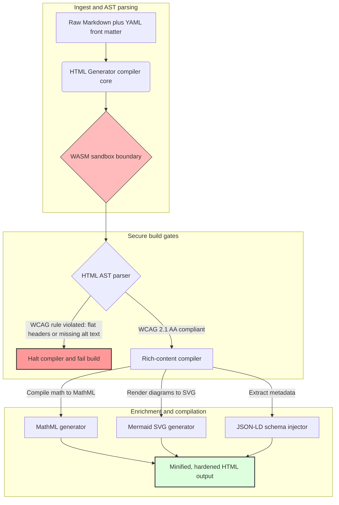

## Menukar Markdown kepada HTML Berstruktur yang Boleh Diakses dan Sedia SEO dengan Rust pada 2026

Pada 2026, kandungan web digunakan oleh perangkak carian AI, enjin carian yang disokong LLM dan saluran paip Retrieval-Augmented Generation (RAG) sama banyaknya seperti oleh pembaca manusia. HTML yang rata atau cacat menjejaskan keterlihatan mesin, manakala kegagalan mematuhi peraturan global yang ketat seperti [Akta Kebolehaksesan Eropah (EAA)](https://www.accessibility-act.eu/) dan [ADA Title III AS](https://www.ada.gov/topics/title-iii/) kini merupakan liabiliti sivil yang jelas. [HTML Generator](https://github.com/sebastienrousseau/html-generator) ialah pustaka Rust berprestasi tinggi yang direka bentuk untuk menutup jurang tersebut — di peringkat pengompil, bukan melalui tampalan selepas penggunaan.

## Jawapan pantas

**Apakah HTML Generator dalam satu ayat?** HTML Generator ialah pengompil Markdown-ke-HTML sumber terbuka yang ditulis sepenuhnya dalam Rust, yang menguatkuasakan [WCAG 2.1 AA](https://www.w3.org/TR/WCAG21/) pada masa binaan, menjana penanda aras semantik dan atribut ARIA secara automatik, menyuntik metadata [JSON-LD](https://json-ld.org/) yang patuh skema daripada YAML front matter, memaparkan gambar rajah Mermaid dan matematik kepada SVG dan MathML yang boleh diakses, serta berjalan di dalam kotak pasir [WebAssembly](https://webassembly.org/) — menjadikan penerbitan korporat sebagai satah kawalan bergred fidusiari yang berpagar kompilasi.

## Ringkasan eksekutif

Pemaparan Markdown kelihatan remeh. HTML bergred penerbitan pula ialah masalah pematuhan. Pada Jun 2026, setiap titik sentuh korporat — portal perhubungan pelabur, pemfailan kawal selia, dokumentasi pelanggan, rujukan API, estet pemasaran — dihuraikan oleh manusia dan mesin. Dua tekanan berlanggar pada setiap halaman: [EAA](https://www.accessibility-act.eu/) dan [ADA Title III](https://www.ada.gov/topics/title-iii/) menjadikan kebolehaksesan sebagai pendedahan undang-undang di peringkat lembaga pengarah, manakala penelanan AI dan saluran paip RAG memberi ganjaran kepada output yang berstruktur dan boleh dibaca mesin. Pustaka Markdown standard menghasilkan HTML rata yang gagal kedua-dua pagar tersebut. HTML Generator melayan penjanaan dokumen sebagai saluran paip berpagar kompilasi: pengesahan WCAG ialah ralat binaan, JSON-LD datang daripada YAML front matter tanpa pengecapan manual, MathML dan Mermaid dipaparkan secara boleh diakses, dan keseluruhan enjin dihantar sebagai sasaran WebAssembly supaya penghuraian dokumen yang tidak dipercayai kekal berkotak-pasir daripada hos.

## Intipati utama

- **Kebolehaksesan sebagai kod ialah garis asas baharu.** EAA mewajibkan kebolehaksesan untuk perkhidmatan digital pengguna. HTML Generator menilai pepohon dokumen pada masa kompilasi, menjana penanda aras semantik dan atribut ARIA secara automatik — kurang pembetulan selepas penggunaan, kurang bajet pemulihan, tiada teks-alt yang tertinggal dihantar ke produksi.
- **Data berstruktur untuk penemuan AI.** Carian moden dan RAG bergantung pada metadata yang boleh dibaca mesin. Pengompil menghuraikan YAML front matter dan menyuntik [JSON-LD yang patuh Schema.org](https://schema.org/) terus ke dalam kepala dokumen, menjadikan kandungan boleh ditafsir sepenuhnya oleh [Google Rich Results](https://developers.google.com/search/docs/appearance/structured-data/intro-structured-data), [Bing Webmaster](https://www.bing.com/webmasters) dan perangkak yang disokong LLM.
- **Kecemerlangan kandungan teknikal.** Penerbitan teknikal bukanlah teks rata. HTML Generator mengompil sambungan matematik Markdown mentah kepada [MathML](https://www.w3.org/Math/) yang boleh diakses, dan memaparkan gambar rajah [Mermaid.js](https://mermaid.js.org/) kepada SVG responsif — kedua-duanya mengekalkan struktur yang mematuhi WCAG dan bukannya jatuh kepada imej legap.
- **Kotak pasir WebAssembly.** Menghuraikan Markdown yang tidak dipercayai merupakan risiko keselamatan. Dengan menyasarkan [WASM](https://webassembly.org/), HTML Generator dilaksanakan di dalam kotak pasir terpencil yang menghalang pelaksanaan kod sewenang-wenangnya dan melindungi sistem hos — memenuhi secara langsung kewajipan keselamatan ICT [DORA Perkara 6](https://eur-lex.europa.eu/legal-content/EN/TXT/?uri=CELEX%3A32022R2554).
- **Perlindungan fidusiari untuk lembaga pengarah.** Ketidakpatuhan teknikal telah beralih ke bilik lembaga. Menyeragamkan enjin HTML yang berpagar pengompil melindungi pengarah dan pengurusan kanan daripada pendedahan sivil dan kawal selia peribadi di bawah DORA, EAA dan ADA Title III.

**Bacaan berkaitan:** [Mengapa YAML Memerlukan Timbunan Rust yang Lebih Selamat untuk AI, MCP dan Infrastruktur Kewangan pada 2026](https://sebastienrousseau.com/2026-06-18-noyalib-safe-yaml-rust-ai-mcp-financial-infrastructure-2026/), [Penjana Laman Statik Selamat-secara-Lalai untuk Penerbitan Era-AI pada 2026](https://sebastienrousseau.com/2026-06-17-static-site-generator-secure-default-ai-era-publishing-2026/), [CloudCDN: Cetak Biru Sumber Terbuka untuk Tepi Asli-AI pada 2026](https://sebastienrousseau.com/2026-06-11-cloudcdn-open-source-blueprint-ai-native-edge-2026/).

## 01. Mengapa Pengompil HTML yang Mengutamakan Kebolehaksesan Penting pada 2026

Estet web korporat, pustaka dokumentasi dan pusat bantuan produk ialah titik sentuh digital yang kritikal. Ia kini tertakluk kepada dua tekanan yang sengit dan bersilang.

Yang pertama ialah **penelanan dan keterlihatan AI**. Kandungan semakin banyak diproses oleh model bahasa besar dan saluran paip Retrieval-Augmented Generation. HTML yang rata atau cacat mengelirukan penghuraian perangkak, menyebabkan penyelidikan dan dokumentasi korporat tidak kelihatan kepada paradigma carian moden — termasuk [Google Search Generative Experience](https://blog.google/products/search/generative-ai-search/), pelayaran [ChatGPT](https://chat.openai.com/) dan ejen RAG perusahaan.

Yang kedua ialah **undang-undang kebolehaksesan global yang ketat**. Di bawah [Akta Kebolehaksesan Eropah](https://www.accessibility-act.eu/) (terpakai sepenuhnya mulai Jun 2025) dan [ADA Title III AS](https://www.ada.gov/topics/title-iii/), platform penerbitan korporat mesti menjamin kebolehaksesan digital yang lengkap. Kegagalan memenuhi [WCAG 2.1 AA](https://www.w3.org/TR/WCAG21/) bukan lagi kecuaian kejuruteraan; ia merupakan liabiliti sivil dan kawal selia yang telah menghasilkan penyelesaian bernilai berjuta-juta dolar.

[HTML Generator](https://github.com/sebastienrousseau/html-generator) menangani kedua-dua tekanan ini secara langsung. Ia merupakan pustaka Rust selamat-benang yang direka untuk mengubah Markdown kepada HTML berstruktur yang boleh diakses dan sedia SEO. Dengan melayan penjanaan dokumen sebagai saluran paip berpagar pengompil, enjin ini menyampaikan **Pulangan atas Ketahanan (RoR)** yang tinggi — melindungi kunci kira-kira daripada litigasi kebolehaksesan sambil memaksimumkan kebolehbacaan mesin untuk penemuan AI.

## 02. Kanta Seni Bina HTML Generator 2026

Rangka kerja ini direka sebagai saluran paip kompilasi berbilang peringkat yang selamat, yang menukar teks Markdown mentah kepada aset statik yang disahkan secara kriptografi dan sangat boleh diakses.

### Jadual 1: Lapisan seni bina HTML Generator dan mitigasi risiko

| Lapisan | Keputusan reka bentuk | Mengapa ia penting | Risiko jika tersalah urus |
| ---- | ---- | ---- | ---- |
| **Lapisan input** | Penghurai Markdown serta YAML front matter | Menemui penulis di tempat mereka berada; memisahkan prosa daripada metadata struktur. | Metadata tidak konsisten, peta laman rosak, jurang pengindeksan. |
| **Lapisan struktur** | Jadual Kandungan automatik dan penanda aras semantik dengan tag ARIA | Menghasilkan pepohon dokumen yang boleh dilayari dan boleh diakses secara binaan. | HTML rata yang merosakkan pembaca skrin dan melanggar WCAG. |
| **Lapisan kandungan kaya** | Pemaparan MathML asli dan SVG Mermaid.js | Mengompil formula dan gambar rajah kepada SVG dan MathML yang boleh diakses. | Kelewatan pemaparan JS pihak-klien dan output teknologi bantuan yang rosak. |
| **Lapisan SEO dan data** | Penjanaan JSON-LD dan metadata berstruktur bersepadu | Menyuntik JSON-LD patuh [Schema.org](https://schema.org/) terus ke dalam kepala. | Enjin carian dan perangkak AI tersalah baca pengarang, konteks, pelesenan. |
| **Lapisan masa jalan** | Pengompil Rust asli dengan sasaran WebAssembly | Membolehkan pelaksanaan yang selamat dan berkotak-pasir pada pelayan, nod tepi dan pelayar. | Pelaksanaan kod sewenang-wenangnya semasa penghuraian Markdown yang tidak dipercayai. |

## 03. Isyarat Keselamatan Web dan Kebolehaksesan Utama

Untuk mengesahkan bahawa aset penerbitan yang menghadap orang awam memenuhi audit kawal selia dan keselamatan moden, pegawai teknologi kanan mesti memantau metrik khusus yang boleh diukur.

### Jadual 2: Isyarat keselamatan web dan kebolehaksesan

| Isyarat | Metrik / penanda aras operasi | Rujukan EAA / DORA / W3C | Pelaksanaan teknikal |
| ---- | ---- | ---- | ---- |
| **Pematuhan kebolehaksesan** | 100 % halaman terkompil disahkan terhadap peraturan WCAG 2.1 AA. | [EAA](https://www.accessibility-act.eu/) dan [ADA Title III](https://www.ada.gov/topics/title-iii/) | Penghurai HTML masa-binaan yang menilai tag alt imej dan penanda aras semantik. |
| **Kotak pasir pelaksanaan WASM** | 100 % input Markdown yang tidak dipercayai dikompil dalam masa jalan WebAssembly terpencil. | [DORA Perkara 6](https://eur-lex.europa.eu/legal-content/EN/TXT/?uri=CELEX%3A32022R2554) (keselamatan ICT) | Pengasingan persekitaran penghuraian daripada pelayan hos. |
| **Liputan metadata berstruktur** | 100 % artikel diterbitkan disuntik dengan pengepala JSON-LD yang sah dan patuh skema. | Spesifikasi [Schema.org](https://schema.org/) | Penghuraian front matter automatik dan penukaran kepada objek JSON-LD. |
| **Daya pemprosesan kompilasi** | Sasaran halaman-sesaat melebihi 10,000 pada perkakasan komoditi. | Pulangan atas Ketahanan (RoR) | Pengompil AST Rust yang sangat selari. |
| **Pengesahan cebisan-kaya** | Sifar ralat penghuraian pada larian [Google Rich Results](https://search.google.com/test/rich-results) dan [pengesah Schema](https://validator.schema.org/). | Garis panduan Google Search | Pengesahan struktur JSON-LD yang dijana semasa saluran paip binaan. |

## 04. Mitos Pemaparan Markdown yang Mudah

Salah tanggapan lazim dalam kalangan pengurus teknologi ialah menukar Markdown kepada HTML merupakan latihan penggantian teks yang mudah. Banyak pustaka standard menterjemahkan pemformatan Markdown kepada HTML yang rata dan tidak berstruktur. Output tersebut dipaparkan kepada pembaca celik dalam pelayar, tetapi ia mewakili perangkap pematuhan.

HTML rata lazimnya kekurangan tiga perkara.

1. **Hierarki tajuk yang betul.** Markdown standard tidak menguatkuasakan susunan tajuk. Melompat daripada `<h1>` kepada `<h4>` melanggar WCAG 2.1 AA dan merosakkan navigasi dokumen untuk pembaca skrin.
2. **Semantik jadual yang eksplisit.** Jadual Markdown standard jarang dipaparkan dengan skop `<th>` dan atribut `<tbody>` yang betul yang diperlukan untuk penghuraian boleh diakses.
3. **Metadata yang boleh dibaca mesin.** HTML standard kekurangan cangkuk JSON-LD yang diperlukan oleh platform carian AI moden dan sistem penelanan RAG.

HTML Generator menyelesaikan hal ini dengan menghuraikan Markdown kepada **Pepohon Sintaks Abstrak (AST)**. Enjin menilai struktur dokumen sebelum memancarkan HTML, mengesahkan penyarangan tajuk, menyuntik atribut ARIA yang sesuai, dan menegaskan bahawa setiap aset media membawa teks alternatif — mengubah kebolehaksesan daripada audit manual kepada invarian masa-kompilasi yang terjamin.

## 05. Mereka Bentuk Saluran Paip Binaan Kebolehaksesan-sebagai-Kod

Untuk menghalang aset yang tidak boleh diakses atau tidak diindeks daripada pernah mencapai penggunaan awam, kebolehaksesan mesti menjadi pagar pengompil yang ketat. Saluran paip berikut menunjukkan bagaimana HTML Generator menilai Markdown, menjalankan pengesahan terpencil WebAssembly, dan memancarkan HTML yang berstruktur dan diperkukuh.

## 06. Panduan Bilik Lembaga dan Liabiliti Fidusiari

Pematuhan kebolehaksesan dan keselamatan web moden ialah isu bilik lembaga yang tidak boleh dirundingkan. Pengurusan kanan mesti mendekati infrastruktur penerbitan melalui kanta risiko undang-undang, pemeliharaan kewangan dan pendedahan kawal selia.

- **Akta Kebolehaksesan Eropah (EAA).** Mengenakan mandat pematuhan yang langsung dan mengikat secara undang-undang ke atas portal digital awam dan swasta. Ketidakpatuhan boleh menghasilkan penalti kewangan yang teruk, litigasi sivil, dan penarikan segera aset daripada pasaran EU. Dengan menyepadukan kebolehaksesan-sebagai-kod, lembaga pengarah boleh memperakui bahawa kod yang tidak patuh tidak boleh dihantar — menukar pemulihan reaktif kepada perisai undang-undang yang berstruktur.
- **DORA Perkara 6 (Persekitaran ICT Selamat).** Menetapkan peraturan ketat untuk keselamatan persekitaran ICT. Dengan mengasingkan kompilasi Markdown dalam kotak pasir WebAssembly, organisasi memastikan bahawa penghuraian dokumentasi yang dimuat naik pelanggan atau suapan rakan kongsi tidak dapat mendedahkan pelayan hos kepada pelaksanaan kod sewenang-wenangnya, melindungi portal perbankan kritikal.
- **Pengurangan kos dalam audit pematuhan.** Pematuhan kebolehaksesan tradisional bergantung pada audit selepas-penggunaan yang mahal dan retrospektif — puluhan ribu dolar setahun setiap laman. Melaksanakan pengesahan WCAG sebagai blok masa-kompilasi menghapuskan kos retrospektif tersebut, mengalihkan bajet pematuhan daripada pertahanan kepada inovasi.

## 07. Apa Maksudnya Mengikut Jenis Bank / Perusahaan

### Bank Penting Sistemik Global (G-SIB)

G-SIB mengendalikan estet awam yang besar dan berbilang bahasa yang menerbitkan beribu-ribu kertas penyelidikan, pendedahan kawal selia, dan dokumen perhubungan pelabur merentas pelbagai bidang kuasa. Cabaran mereka ialah skala dan keseimbangan berbilang bahasa. Sasaran WebAssembly HTML Generator dan enjin Rust berdaya pemprosesan tinggi membolehkan pustaka penyelidikan berskala besar dan disetempatkan dikemas kini, dikompil dan digunakan secara global dalam beberapa saat — tanpa kelewatan pemaparan atau regresi kebolehaksesan.

### Bank Transaksi dan Korporat

Bagi bank transaksi, portal pelanggan, pusat dokumentasi dan panduan API pembangun ialah titik sentuh digital yang kritikal. Mengompil aset tersebut melalui HTML Generator bermakna saluran yang menghadap pelanggan tidak membawa pendedahan XSS, tiada vektor rampasan-kebergantungan, dan tiada kekurangan kebolehaksesan — memelihara kepercayaan institusi dan mengurangkan permukaan litigasi.

### Bank Serantau dan Fintech

Bank serantau dan fintech tangkas bersaing atas pengalaman digital tanpa bajet kejuruteraan G-SIB. HTML Generator memberi pasukan tersebut saluran paip penerbitan bergred perusahaan secara sedia guna, membolehkan estet yang lebih kecil menghantar aset yang boleh diakses, sedia SEO dan berkotak-pasir yang tahan pemeriksaan daripada kedua-dua pengawal selia dan bakal pelanggan korporat.

## 08. Peta Jalan Infrastruktur Penerbitan

Estet web korporat yang menghadap orang awam ialah komponen teras ketahanan operasi. Bergantung pada enjin web yang perlahan, terdedah secara dinamik dan disokong pangkalan data — atau aset statik yang tidak ditandatangani — merupakan risiko perniagaan yang tidak boleh diterima.

Untuk mengamankan titik sentuh digital awam dan melindungi kunci kira-kira daripada litigasi kebolehaksesan, pengurus teknologi dan keselamatan kanan harus melaksanakan peta jalan yang jelas.

1. **Beralih kepada seni bina statik.** Hapuskan secara berperingkat platform CMS dinamik warisan untuk estet penyelidikan, pemasaran dan dokumentasi. Alihkan kandungan ke saluran paip berpagar pengompil seperti HTML Generator.
2. **Kuatkuasakan kebolehaksesan pada masa binaan.** Laksanakan kebolehaksesan-sebagai-kod. Gagalkan saluran paip kompilasi secara automatik atas sebarang pelanggaran WCAG 2.1 AA.
3. **Asingkan penghuraian dalam WebAssembly.** Kotakpasirkan semua penghuraian dokumen dan kandungan di dalam masa jalan WASM supaya input yang tidak dipercayai tidak pernah menyentuh sistem hos.
4. **Suntik metadata JSON-LD yang kaya.** Pastikan setiap aset diterbitkan membawa pengepala JSON-LD yang patuh skema untuk memaksimumkan keterlihatan AI.

## 09. Soalan Lazim

**Bagaimanakah HTML Generator menguatkuasakan kebolehaksesan?**

Ia menghuraikan Pepohon Sintaks Abstrak HTML yang dijana pada masa binaan, menilai dokumen terhadap peraturan [WCAG 2.1 AA](https://www.w3.org/TR/WCAG21/). Jika sesuatu peraturan dilanggar — atribut alt yang hilang, lompatan tajuk, kawalan borang tanpa label — pengompil menghentikan binaan, melayan kebolehaksesan sebagai invarian masa-kompilasi dan bukannya tugas audit selepas-penggunaan.

**Mengapa pengasingan WebAssembly penting?**

[WebAssembly](https://webassembly.org/) membenarkan enjin penghuraian Markdown dilaksanakan di dalam kotak pasir terpencil, dipisahkan daripada pelayan hos. Walaupun apabila pelaku bermusuhan memuat naik dokumen Markdown yang direka bentuk untuk mengeksploitasi kelemahan penghurai, pelaksanaan diperangkap — melindungi sistem hos dan memenuhi kewajipan keselamatan ICT DORA Perkara 6.

**Bagaimana JSON-LD memanfaatkan keterlihatan carian pada 2026?**

[JSON-LD](https://json-ld.org/) menyediakan metadata berstruktur yang boleh dibaca mesin dalam kepala dokumen. [Google Rich Results](https://developers.google.com/search/docs/appearance/structured-data/intro-structured-data), perangkak Bing, dan ejen carian yang disokong LLM mengenal pasti pengarang, lesen, tarikh penerbitan dan konteks semantik dengan serta-merta — memintas kesamaran HTML standard dan meningkatkan liputan dalam penemuan yang dipacu AI.

**Siapakah khalayak untuk HTML Generator?**

Pembina laman statik, pasukan dokumentasi, penulis teknikal, pembangun Rust, dan jurutera platform yang menghantar estet kritikal-kebolehaksesan atau menghadap-pengawal selia. Ia juga merupakan lapisan pemprosesan kandungan yang berdaya maju di dalam saluran paip penerbitan selamat yang lebih besar seperti [Static Site Generator (SSG)](https://github.com/sebastienrousseau/static-site-generator).

## 10. Rujukan

- World Wide Web Consortium (W3C), 2024. [Web Content Accessibility Guidelines (WCAG) 2.1 ⧉](https://www.w3.org/TR/WCAG21/ "Web Content Accessibility Guidelines 2.1").
- Schema.org, 2026. [Spesifikasi data berstruktur Schema.org ⧉](https://schema.org/ "Spesifikasi data berstruktur Schema.org").
- Parlimen Eropah dan Majlis Kesatuan Eropah, 2022. [Peraturan (EU) 2022/2554 mengenai ketahanan operasi digital untuk sektor kewangan (DORA) ⧉](https://eur-lex.europa.eu/legal-content/EN/TXT/?uri=CELEX%3A32022R2554 "Peraturan DORA").
- Suruhanjaya Eropah, 2025. [Akta Kebolehaksesan Eropah ⧉](https://www.accessibility-act.eu/ "Akta Kebolehaksesan Eropah").
- Jabatan Kehakiman AS, 2024. [ADA Title III ⧉](https://www.ada.gov/topics/title-iii/ "ADA Title III").
- WebAssembly Community Group, 2026. [Spesifikasi WebAssembly ⧉](https://webassembly.org/ "WebAssembly").
- GitHub, 2026. [Repositori HTML Generator ⧉](https://github.com/sebastienrousseau/html-generator "Repositori sumber terbuka HTML Generator").
