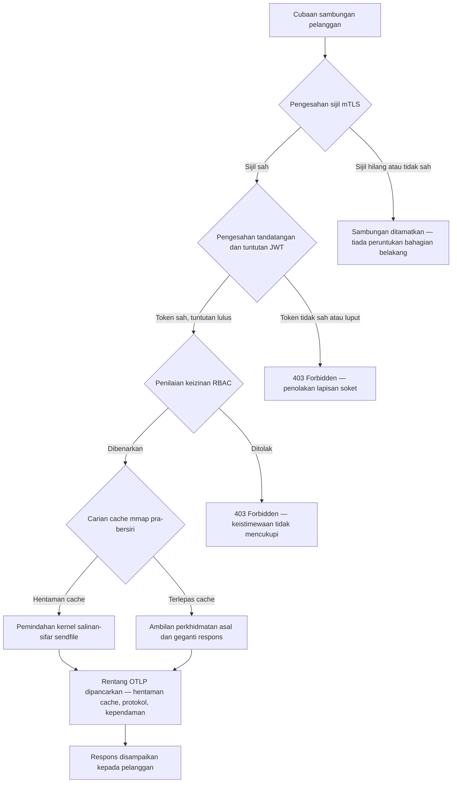

## http-handle: Ingress Tepi Berprestasi Tinggi Tanpa Kebergantungan untuk Perbankan pada 2026

Tepi perbankan mempunyai masalah kebergantungan. Setiap tika Nginx atau Envoy yang menghalakan trafik antara pelanggan dengan perkhidmatan perbankan teras membawa pokok kebergantungan: binaan OpenSSL, modul Lua, pustaka gRPC, dan lapisan kontena — setiap satunya berpotensi menjadi CVE, setiap satunya memerlukan kitaran penampalan yang tersendiri, setiap satunya menambah varians kependaman yang merumitkan pengukuran SLA. Di bawah [Akta Daya Tahan Operasi Digital (DORA)](https://eur-lex.europa.eu/eli/reg/2022/2554/oj), kerumitan itu kini menjadi liabiliti kawal selia sama seperti ia liabiliti operasi.

[http-handle](https://github.com/sebastienrousseau/http-handle) mengambil pendekatan yang berbeza. Ia ialah satu binari Rust terpaut secara statik dengan sifar kebergantungan masa jalan selain daripada `libc`. Ia menyampaikan 180,000 permintaan sesaat pada nod ARM64, menguatkuasakan pengesahan TLS bersama dan JWT pada lapisan soket rangkaian, dan merunding HTTP/2 serta HTTP/3 secara automatik — kesemuanya dalam jejak penggunaan di bawah 20 MB RAM.

## Jawapan pantas

**Apakah http-handle dalam satu ayat?** http-handle ialah binari Rust terpaut secara statik, sumber terbuka, yang menggantikan kontena proksi berat di tepi perbankan, menyampaikan 180,000 req/s pada ARM64 melalui pemindahan kernel salinan-sifar `sendfile(2)` Linux, menguatkuasakan mTLS, JWT, dan RBAC pada lapisan soket sebelum sebarang sumber bahagian belakang disentuh, serta memancarkan metrik [OpenTelemetry](https://opentelemetry.io/) asli — tanpa sebarang kebergantungan pustaka masa jalan selain daripada `libc`.

## Ringkasan eksekutif

Bank telah menjalankan Nginx dan Envoy di tepi mereka selama satu dekad. Kedua-duanya berkeupayaan; tetapi tiada satu pun direka untuk persekitaran kawal selia 2026. Imej kontena yang sarat kebergantungan menjana barisan CVE yang tidak dapat dibersihkan oleh pasukan pematuhan dengan cukup pantas, dan setiap kenaikan versi pustaka membawa risiko regresi. Artikel 5 dan 6 DORA menuntut agar risiko ICT diurus secara reka bentuk, bukan ditampal selepas ditemui. Rangka kerja risiko operasi Basel III menghukum seni bina di mana titik kegagalan berganda dengan kerumitan sistem.

http-handle menghapuskan masalah kebergantungan pada puncanya. Binari ini disusun sekali, secara statik, tanpa keperluan pustaka luaran pada masa jalan. Permukaan serangan mengecil kepada pustaka piawai Rust ditambah `libc`. Penguatkuasaan keselamatan — pengesahan sijil mTLS, pengesahan tuntutan JWT, dan kawalan capaian berasaskan peranan — dilaksanakan pada soket rangkaian sebelum sebarang peruntukan bahagian belakang, meruntuhkan perimeter Zero Trust kepada ungkapan terkecilnya yang mungkin. Prestasi mengikut seni bina: blok cache terpeta memori yang pra-bersiri digabungkan dengan pemindahan kernel `sendfile(2)` mengeluarkan data sepenuhnya daripada laluan salinan CPU-ke-memori, mengekalkan 180,000 req/s pada perkakasan ARM64. Hasilnya ialah lapisan ingress yang memenuhi keperluan daya tahan DORA, menyokong hujah pengurangan risiko operasi Basel III, dan memberikan pemimpin IT kanan di bawah SM&CR rantaian akauntabiliti komponen-tunggal yang boleh disahkan untuk infrastruktur tepi.

## Perkara utama

- **Binari lebih kecil, barisan CVE lebih kecil.** Satu binari tunggal terpaut secara statik mempunyai satu pakej untuk ditampal, satu keluaran untuk disahkan, dan satu artifak untuk diaudit. Nginx dengan set modul piawai dihantar dengan lebih daripada 30 kebergantungan pustaka dikongsi; setiap satu membawa kitaran hayat kerentanannya sendiri.
- **Salinan-sifar bukan pengoptimuman — ia satu kekangan reka bentuk.** Pada 180,000 req/s, sebarang salinan data ruang pengguna memperkenalkan varians kependaman yang boleh diukur. `sendfile(2)` memindahkan kandungan penerangan fail ke soket rangkaian sepenuhnya dalam ruang kernel. Digabungkan dengan blok cache respons yang disemat-mmap, CPU tidak pernah menyentuh laluan data untuk respons yang dicache.
- **Perimeter keselamatan sepatutnya berada di soket.** Mengesahkan JWT dan sijil mTLS dalam middleware aplikasi bermakna bahagian belakang telah pun memperuntukkan bebenang dan memori sebelum permintaan itu ditolak. Pengesahan lapisan soket memastikan bahawa permintaan tidak disahkan tidak menggunakan sebarang sumber bahagian belakang sama sekali.
- **OTLP menghapuskan jurang kebolehcerapan.** Penyepaduan OpenTelemetry asli bermakna setiap permintaan, setiap keputusan pengesahan, dan setiap rundingan protokol menghasilkan telemetri berstruktur tanpa ejen sisi. Papan pemuka bank sedia ada menyerap jejak OTLP secara langsung.

**Bacaan berkaitan:** [Mengapa YAML Memerlukan Timbunan Rust yang Lebih Selamat untuk AI, MCP, dan Infrastruktur Kewangan pada 2026](https://sebastienrousseau.com/2026-06-18-noyalib-safe-yaml-rust-ai-mcp-financial-infrastructure-2026/), [CloudCDN: Rangka Tindakan Sumber Terbuka untuk Tepi Natif-AI pada 2026](https://sebastienrousseau.com/2026-06-11-cloudcdn-open-source-blueprint-ai-native-edge-2026/), [Seni Bina Infrastruktur Awan Terbaik untuk Bank dan Institusi Kewangan pada 2026](https://sebastienrousseau.com/2026-05-16-best-cloud-infrastructure-architecture-2026/).

## 01. Masalah Proksi Berat dalam Perbankan

Nginx dan Envoy membina tepi internet moden. Ia boleh dikonfigurasi, teruji dalam pertempuran, dan disokong oleh komuniti yang besar. Namun ia juga pilihan seni bina yang dibuat sebelum DORA wujud, sebelum rangka kerja risiko operasi Basel III menuntut pengurangan kerumitan yang boleh dikira, dan sebelum nod awan ARM64 mengubah ekonomi pengiraan pemprosesan tinggi.

Akibat praktikalnya ialah jurang antara apa yang diperlukan oleh bank dengan apa yang disampaikan oleh kontena proksi berat.

**Permukaan kebergantungan.** Penggunaan Envoy piawai menarik masuk OpenSSL, Abseil, Protobuf, gRPC, Lua, dan berpuluh-puluh pustaka sekunder. Setiap satu membawa kitaran hayat CVE yang bebas. Apabila Pangkalan Data Kerentanan Kebangsaan menerbitkan nasihat OpenSSL kritikal, setiap tika Envoy dalam estet menjadi jam pematuhan: nilai, tampal, uji, guna semula, dan sahkan semula — merentasi setiap persekitaran tempat binari itu berjalan. Di bawah Artikel 6 DORA, bank mesti menunjukkan bahawa proses pengurusan risiko ICT adalah berkadaran, berdokumen, dan boleh disahkan. Pokok kebergantungan berbilang pustaka menjadikan penunjukan itu mahal untuk dikekalkan.

**Overhed memori.** Proses pekerja Nginx yang dikonfigurasi secara minimum menggunakan 40–80 MB memori pemastautin di bawah beban sederhana. Pada skala — beratus-ratus nod ingress merentasi sistem dagangan, API pembayaran, dan portal berhadapan pelanggan — overhed itu berganda menjadi kos infrastruktur yang boleh diukur tanpa sebarang manfaat prestasi yang sepadan berbanding alternatif binari-tunggal yang direka baik.

**Halaju penampalan.** Rantaian bekalan imej kontena memperkenalkan jeda berbilang hari antara penerbitan CVE dengan tampalan yang disahkan sampai ke pengeluaran. Imej asas mesti dibina semula, lapisan aplikasi dilapiskan semula, matriks ujian penuh dijalankan semula, dan saluran penggunaan dilaksanakan semula. Bagi sistem perbankan kritikal yang beroperasi di bawah tetingkap pelaporan insiden DORA, kitaran ini merupakan risiko struktur.

http-handle menangani ketiga-tiganya. Satu binari. Satu permukaan CVE. Satu artifak untuk ditampal. Di bawah 20 MB RAM untuk nod ingress pengeluaran.

## 02. Lensa Seni Bina http-handle 2026

Binari ini distrukturkan sebagai lima lapisan saling bergantung, setiap satu direka untuk menghapuskan kategori risiko tertentu yang terkumpul oleh seni bina proksi tradisional.

### Jadual 1: Lapisan seni bina http-handle dan mitigasi risiko

| Lapisan | Keputusan reka bentuk | Mengapa ia penting | Risiko jika tersalah urus |
| ---- | ---- | ---- | ---- |
| **Teras pelayan** | Satu binari Rust, terpaut secara statik, sifar kebergantungan selain daripada `libc` | Satu artifak untuk ditampal; menghapuskan penyebaran CVE pustaka merentasi estet | Serangan kekeliruan kebergantungan; pengumpulan kerentanan pustaka |
| **Enjin pemecutan** | Blok cache mmap pra-bersiri dan pemindahan kernel salinan-sifar `sendfile(2)` | 180,000 req/s pada ARM64 dengan overhed proksi bawah satu milisaat; tiada data memasuki ruang pengguna untuk respons yang dicache | Kebocoran pemetaan memori; kesesakan ruang kernel semasa pembatalan cache |
| **Keselamatan kriptografi** | mTLS asli dengan sokongan sijil muat-panas dan rundingan ALPN | Menjamin integriti data dan keserasian protokol; putaran sijil tanpa sambungan terputus | Luput sijil menyebabkan gangguan perkhidmatan; tetapan lalai suite sifer yang lemah |
| **Satah dasar capaian** | Pengesahan JWT lapisan soket dan penilaian tuntutan RBAC | Permintaan tidak disahkan tidak menggunakan sumber bahagian belakang; Zero Trust dikuatkuasakan di sempadan kernel | Serangan kekeliruan algoritma JWT; salah konfigurasi RBAC yang memberi capaian melebihi keistimewaan |
| **Kebolehcerapan** | Penyepaduan [OpenTelemetry (OTLP)](https://opentelemetry.io/docs/specs/otlp/) asli | Telemetri berstruktur tanpa ejen sisi; penyerapan terus ke dalam estet pemantauan bank sedia ada | Titik buta semasa gangguan; jejak audit tidak lengkap untuk pelaporan insiden DORA |

## 03. Isyarat Prestasi dan Keselamatan Utama

Bank yang mengendalikan http-handle di tepi mesti menginstrumen lima isyarat yang boleh dikira untuk memenuhi keperluan pelaporan operasi DORA dan tadbir urus SLA dalaman.

### Jadual 2: Penanda aras operasi dan rujukan kawal selia

| Isyarat | Penanda aras | Rujukan kawal selia | Pelaksanaan teknikal |
| ---- | ---- | ---- | ---- |
| **Pemprosesan** | ≥ 180,000 req/s pada nod ARM64 pada overhed proksi P99 ≤ 1 ms | Risiko operasi Basel III — pengurangan kerumitan sistem | `sendfile(2)` + blok cache pra-bersiri mmap; tiada salinan data ruang pengguna untuk hentaman cache |
| **Permukaan serangan** | Sifar kebergantungan pustaka masa jalan; satu artifak binari setiap keluaran | [Artikel 6 DORA](https://eur-lex.europa.eu/eli/reg/2022/2554/oj) — pengurusan risiko ICT secara reka bentuk | Kompilasi statik dengan `cargo build --release --target aarch64-unknown-linux-musl` |
| **Kependaman pengesahan** | Jabat tangan mTLS + pengesahan JWT selesai sebelum bait pertama respons bahagian belakang | [Artikel 5 DORA](https://eur-lex.europa.eu/eli/reg/2022/2554/oj) — perlindungan keselamatan ICT | Pemintasan lapisan soket; penilaian tuntutan JWT dalam Rust bersebelahan kernel sebelum penghalaan bahagian belakang |
| **Ketersediaan sijil** | Muat-panas sijil mTLS dengan sifar sambungan terputus semasa putaran | Akauntabiliti pengurusan kanan SM&CR untuk ketersediaan tepi | Pengawas sijil dipacu inotify; pertukaran penerangan fail atom semasa muat semula |
| **Liputan kebolehcerapan** | 100 % permintaan menghasilkan rentang OTLP dengan hasil pengesahan, versi protokol, dan status cache | Artikel 17 DORA — pengesanan dan pelaporan insiden | Pengeksport OTLP asli; tiada sisi diperlukan; pengangkutan gRPC atau HTTP/Protobuf boleh dikonfigurasi |

## 04. Enjin Salinan-Sifar: mmap dan sendfile(2)

Prestasi rangkaian dalam perbankan berfrekuensi tinggi — pembayaran masa nyata, API data-pasaran, perkhidmatan token pengesahan — dibatasi oleh satu kekangan lebih daripada mana-mana yang lain: kos memindahkan bait daripada storan ke soket rangkaian.

Pelayan HTTP konvensional membaca kandungan fail ke dalam penimbal ruang pengguna, kemudian menulis penimbal itu ke soket. Urutan itu memerlukan dua salinan memori dan dua penukaran konteks antara ruang pengguna dan ruang kernel bagi setiap respons. Pada 180,000 permintaan sesaat, overhed terkumpul adalah ketara.

http-handle menghapuskan kedua-dua salinan.

**Blok cache terpeta memori.** Apabila perkhidmatan bermula, ia membersirikan kandungan respons statik ke dalam kawasan terpeta memori menggunakan `mmap(2)`. Kawasan ini disemat dalam cache halaman kernel. Apabila permintaan tiba untuk sumber yang dicache, respons itu sudah dipetakan ke dalam memori kernel — tiada bacaan cakera, tiada peruntukan penimbal.

**Pemindahan kernel `sendfile(2)`.** Panggilan sistem `sendfile(2)` Linux memindahkan data terus daripada penerangan fail — atau kawasan terpeta memori — ke penerangan fail soket rangkaian, sepenuhnya dalam kernel. Tiada bait memasuki ruang pengguna. Peranan CPU berkurang kepada mengeluarkan panggilan sistem dan mengendalikan peristiwa penyelesaian. Pada nod ARM64 dengan seni bina ini, http-handle mengekalkan 180,000 req/s pada overhed proksi bawah satu milisaat di bawah beban berterusan.

Bagi bank yang menjalankan penyesuaian kelompok akhir bulan, pelaporan kecairan intraday, atau trafik API pemarkahan penipuan masa nyata, akibat kejuruteraannya adalah langsung: lebih sedikit nod ARM64 setiap peringkat trafik, kos infrastruktur lebih rendah, dan risiko daya tahan DORA yang lebih kecil daripada kekurangan kapasiti.

## 05. Satah Dasar Capaian mTLS dan JWT

Dalam perbankan, pengesahan di tepi bukan satu ciri — ia satu keperluan kawal selia. DORA mewajibkan agar kawalan keselamatan ICT adalah berkadaran, berdokumen, dan boleh disahkan. SM&CR meletakkan akauntabiliti peribadi bagi keputusan keselamatan infrastruktur pada pengurus kanan yang dinamakan. Soalannya bukan sama ada untuk mengesahkan di tepi, tetapi pada lapisan yang mana.

http-handle menguatkuasakan dasar Zero Trust tiga peringkat sebelum sebarang sumber bahagian belakang diperuntukkan.

**Peringkat 1: Pengesahan sijil pelanggan mTLS.** Semasa jabat tangan TLS, http-handle meminta dan mengesahkan sijil pelanggan terhadap stor amanah yang boleh dikonfigurasi. Sambungan tanpa sijil yang sah tamat pada jabat tangan. Tiada bebenang aplikasi dijelmakan, tiada kolam memori diperuntukkan. Bahagian belakang tidak pernah melihat permintaan itu.

**Peringkat 2: Pengesahan tuntutan JWT.** Bagi sambungan yang lulus mTLS, http-handle mengekstrak dan mengesahkan JSON Web Token daripada pengepala `Authorization` pada lapisan soket. Pengesahan tandatangan, semakan luput, dan pengesahan pengeluar berlaku sebelum permintaan sampai ke lapisan penghalaan. Serangan kekeliruan algoritma — di mana pelayan menerima algoritma simetri apabila kunci asimetri dijangka — disekat oleh penyenaraian benar algoritma secara eksplisit dalam konfigurasi.

**Peringkat 3: Penilaian tuntutan RBAC.** Tuntutan JWT yang disahkan dipetakan ke jadual peranan dalam memori. Permintaan yang membawa keizinan tidak mencukupi menerima respons 403 pada satah dasar capaian. Perkhidmatan bahagian belakang tidak pernah dipanggil untuk trafik yang tidak dibenarkan.

Penjujukan ini penting dari segi operasi. Di bawah model tradisional — di mana pengesahan berjalan dalam middleware aplikasi — penyerang boleh menghabiskan kolam bebenang bahagian belakang dengan permintaan tidak disahkan sebelum satu penolakan pun dikeluarkan. Pengesahan lapisan soket meruntuhkan vektor serangan itu sepenuhnya.

## 06. Penghalaan ALPN dan Rantaian Kembalian HTTP/3

Trafik perbankan tiba melalui keadaan rangkaian yang pelbagai: fiber korporat untuk meja dagangan, 5G untuk pelanggan perbankan mudah alih, kesalinghubungan satelit untuk operasi terpencil, dan proksi pemeriksaan TLS dalam persekitaran terkawal. Ingress protokol tunggal mencipta kekangan pembahagi sepunya terendah.

http-handle menggunakan [Application-Layer Protocol Negotiation (ALPN)](https://www.rfc-editor.org/rfc/rfc7301) untuk memilih protokol optimum bagi setiap sambungan secara automatik.

**HTTP/2** ialah lalai untuk trafik pelayar dan API melalui TCP. Strim berbilang guna melalui satu sambungan menghapuskan sekatan hujung-baris yang diperkenalkan HTTP/1.1 di bawah corak permintaan serentak.

**HTTP/3 (QUIC)** diaktifkan apabila rangkaian menyokong UDP dan pelanggan mengiklankan `h3` dalam sambungan ALPN-nya. Pemultiplekan strim bebas dan migrasi sambungan QUIC menjadikannya jauh lebih baik untuk pelanggan perbankan mudah alih pada rangkaian selular sesak di mana sambungan TCP kerap terputus dan bersambung semula.

**Kembalian anggun.** Jika rundingan ALPN gagal — kerana proksi perantaraan menanggalkan sambungan atau pelanggan warisan meninggalkannya — http-handle kembali ke HTTP/1.1 sambil mengekalkan semua pengepala keselamatan, penguatkuasaan mTLS, dan pengesahan JWT. Tiada sifat keselamatan merosot semasa kembalian protokol.

## 07. Kitaran Hayat Permintaan Salinan-Sifar

Rajah berikut menunjukkan laluan permintaan lengkap daripada sambungan pelanggan ke penyampaian respons, termasuk pintu pengesahan dan titik pancaran kebolehcerapan.

Laluan kritikal untuk respons hentaman cache merentasi tiga pintu keselamatan dan satu panggilan sistem. Tiada penimbal ruang pengguna diperuntukkan untuk badan respons. Rentang OTLP menangkap hasil pengesahan, versi protokol yang dirunding ALPN, status cache, dan kependaman hujung-ke-hujung dalam satu rekod berstruktur.

## 08. Penjajaran Kawal Selia: DORA, Basel III, dan SM&CR

### Artikel 5 dan 6 DORA — pengurusan dan perlindungan risiko ICT

[Artikel 5 DORA](https://eur-lex.europa.eu/eli/reg/2022/2554/oj) menghendaki entiti kewangan mengekalkan rangka kerja pengurusan risiko ICT. Artikel 6 menghendaki mereka melaksanakan langkah perlindungan dan pencegahan yang berkadaran dengan profil risiko sistem ICT mereka.

Satu binari tunggal terpaut secara statik memenuhi kedua-dua keperluan dengan lebih cekap daripada timbunan kontena berbilang pustaka. Permukaan serangan boleh dikira — satu artifak, satu kebergantungan (`libc`), satu permukaan CVE — dan langkah perlindungan bersifat struktur dan bukan prosedur: penguatkuasaan mTLS dan JWT tidak boleh dipintas oleh salah konfigurasi kerana ia dilaksanakan pada lapisan soket sebelum sebarang logik aplikasi yang boleh dikonfigurasi berjalan.

### Basel III — keperluan modal risiko operasi

[Rangka kerja risiko operasi Basel III](https://www.bis.org/bcbs/basel3.htm) mengaitkan keperluan modal kawal selia dengan pengurangan risiko yang boleh dibuktikan. Bank yang boleh mendokumenkan penurunan yang boleh diukur dalam kerumitan sistem dan bilangan titik kegagalan ICT mempunyai hujah yang boleh dikira untuk peruntukan modal risiko operasi yang dikurangkan. Menggantikan estet proksi berbilang kontena dengan nod ingress binari tunggal ialah tepat jenis pengurangan kerumitan yang menyokong hujah ini — dengan syarat pasukan kejuruteraan boleh menghasilkan dokumentasi pengesahan.

Artifak keluaran http-handle yang boleh diaudit — binaan boleh dihasilkan semula, manifes kebergantungan serasi-SBOM, dan log operasi berasaskan OTLP — menyokong rantaian dokumentasi yang diperlukan oleh perbincangan modal Basel III.

### SM&CR — akauntabiliti pengurus kanan

[Rejim Pengurus Kanan dan Pensijilan (SM&CR)](https://www.fca.org.uk/firms/senior-managers-certification-regime) meletakkan liabiliti peribadi pada pengurus kanan yang dinamakan bagi postur keselamatan ICT sistem di bawah akauntabiliti mereka. Ingress binari tunggal yang memuat-panas sijil tanpa gangguan perkhidmatan, menghasilkan log audit berstruktur melalui OTLP, dan mempunyai satu artifak berpin-versi setiap penggunaan memberikan pengurus kanan yang dinamakan itu rantaian keselamatan yang boleh disahkan dan didokumenkan. Timbunan kontena berbilang pustaka tidak melakukannya.

## 09. Apa Maksudnya Mengikut Peranan

### Lembaga pengarah dan ketua eksekutif

Pengoptimuman modal kawal selia di bawah rangka kerja risiko operasi Basel III bergantung pada pengurangan kerumitan yang boleh dibuktikan. Menggantikan Nginx atau Envoy dengan satu binari tunggal terpaut secara statik mengurangkan bilangan titik kegagalan ICT dengan cara yang boleh diaudit dan boleh dibentangkan kepada pengawal selia prudensial. Permukaan CVE yang dikurangkan juga menyokong rundingan semula premium insurans siber — penginsurans meletakkan harga berdasarkan metrik permukaan serangan yang boleh dibuktikan, dan binari ingress kebergantungan tunggal ialah titik data yang konkrit.

### Ketua pegawai keselamatan maklumat dan ketua pegawai risiko

Pematuhan DORA menghendaki langkah perlindungan ICT bersifat berkadaran dan boleh disahkan. Penguatkuasaan mTLS dan JWT lapisan soket menyediakan pintu pengesahan yang boleh disahkan dan tidak boleh dipintas di tepi. Putaran sijil muat-panas menghapuskan risiko tetingkap perkhidmatan yang dibawa oleh kemas kini sijil tradisional. Model kompilasi tanpa-kebergantungan bermakna apabila nasihat `libc` kritikal diterbitkan, seluruh estet boleh dibina semula, diuji, dan diguna semula daripada satu artifak sumber Rust dalam beberapa jam dan bukan beberapa hari.

### Pengurusan kejuruteraan dan IT

180,000 req/s pada nod ARM64 piawai mengubah perbualan penyaizan infrastruktur untuk API pembayaran dan perkhidmatan pengesahan. Penyepaduan OTLP asli menghapuskan keperluan untuk pengeksport Prometheus, ejen sisi, atau penghantar log tersuai. Model penggunaan Kubernetes ialah pod piawai — di bawah 20 MB RAM, tiada keizinan kontena istimewa, tiada capaian rangkaian-hos. Muat-panas sijil beroperasi tanpa overhed mula-semula bergolek Kubernetes.

## Soalan Lazim

**Bagaimana http-handle mengendalikan putaran sijil di bawah beban?**
Binari ini memantau laluan fail sijil menggunakan pengawas inotify. Apabila fail sijil dan kunci baharu dikesan, ia melakukan pertukaran atom bagi konteks TLS aktif — sambungan sedia ada selesai menggunakan sijil terdahulu manakala sambungan baharu serta-merta menggunakan yang telah diputar. Tiada sambungan terputus. Tiada tetingkap perkhidmatan diperlukan.

**Bolehkah http-handle berjalan di dalam kluster Kubernetes sebagai pengawal ingress?**
Ya. Binari ini berjalan sebagai pod berdiri sendiri dengan anotasi perkhidmatan ingress piawai. Keperluan sumber adalah di bawah 20 MB RAM pada pemprosesan penuh, tanpa keizinan kontena istimewa dan tanpa keperluan capaian rangkaian-hos. Ia juga boleh berjalan sebagai sisi dalam jejaring perkhidmatan di mana penguatkuasaan mTLS pada lapisan sisi lebih diutamakan berbanding pengesahan get laluan berpusat.

**Apakah sumbangan kependaman proksi itu sendiri yang boleh diukur?**
Bagi respons hentaman cache, overhed proksi — daripada penerimaan soket ke penyelesaian `sendfile(2)` — adalah bawah satu milisaat pada perkakasan ARM64. Bagi respons terlepas cache yang memerlukan ambilan huluan, overhed adalah angka bawah satu milisaat yang sama ditambah masa respons asal. Proksi itu sendiri tidak menambah kependaman beratur kerana pengesahan berlaku secara segerak pada lapisan soket tanpa peruntukan kolam bebenang sebelum pengesahan kelayakan selesai.

**Bagaimana http-handle sesuai dengan seni bina Zero Trust bersama get laluan API sedia ada?**
http-handle beroperasi pada sempadan Lapisan OSI 4/7: ia menguatkuasakan mTLS lapisan pengangkutan dan mengesahkan JWT lapisan aplikasi sebelum menghalakan ke perkhidmatan huluan. Ia boleh berada di hadapan get laluan API penuh — menyerap trafik tidak disahkan sebelum ia sampai ke lapisan pemprosesan get laluan yang lebih mahal — atau menggantikan get laluan itu sepenuhnya bagi perkhidmatan yang dasar capaiannya boleh diungkapkan sepenuhnya dalam tuntutan JWT.

**Adakah keluaran binari boleh dihasilkan semula untuk tujuan audit rantaian bekalan?**
Ya. Binaan boleh dihasilkan semula dengan versi rantaian alat Rust berpin dan `Cargo.lock` terkunci. Penjanaan SBOM melalui `cargo cyclonedx` menghasilkan bil bahan patuh-CycloneDX bagi setiap keluaran. Kedua-dua artifak boleh diterbitkan ke rantaian alat analisis komposisi perisian dalaman bank dan memenuhi keperluan dokumentasi risiko rantaian bekalan DORA.

## Kesimpulan

Tepi perbankan tidak memerlukan lebih banyak ciri — ia memerlukan lebih sedikit komponen, setiap satu melakukan lebih sedikit dan melakukannya secara boleh disahkan. http-handle mengurangkan lapisan ingress kepada minimum yang tidak boleh dikecilkan lagi: satu binari Rust yang menguatkuasakan pengesahan pada soket, memindahkan data tanpa menyalinnya, dan melaporkan segala yang dilakukannya dalam telemetri berstruktur. Bagi bank yang mengharungi garis masa pematuhan DORA, semakan pengoptimuman modal Basel III, dan keperluan akauntabiliti SM&CR, kesederhanaan itu bukan keutamaan kejuruteraan — ia satu hujah kawal selia.

[Kod sumber http-handle](https://github.com/sebastienrousseau/http-handle) tersedia di bawah lesen kembar MIT dan Apache 2.0.

---

*Rujukan*

Basel Committee on Banking Supervision (2011). *Basel III: A global regulatory framework for more resilient banks and banking systems*. Bank for International Settlements. Tersedia di: [https://www.bis.org/publ/bcbs189.htm](https://www.bis.org/publ/bcbs189.htm)

European Parliament and Council (2022). Regulation (EU) 2022/2554 on digital operational resilience for the financial sector (DORA). Tersedia di: [https://eur-lex.europa.eu/legal-content/EN/TXT/?uri=CELEX:32022R2554](https://eur-lex.europa.eu/legal-content/EN/TXT/?uri=CELEX:32022R2554)

Financial Conduct Authority (2015). *Senior Managers and Certification Regime (SM&CR)*. Tersedia di: [https://www.fca.org.uk/firms/senior-managers-certification-regime](https://www.fca.org.uk/firms/senior-managers-certification-regime)

Internet Engineering Task Force (2014). *RFC 7301: Transport Layer Security (TLS) Application-Layer Protocol Negotiation Extension*. Tersedia di: [https://www.rfc-editor.org/rfc/rfc7301](https://www.rfc-editor.org/rfc/rfc7301)

OpenTelemetry Authors (2024). *OpenTelemetry Protocol Specification (OTLP)*. Tersedia di: [https://opentelemetry.io/docs/specs/otlp/](https://opentelemetry.io/docs/specs/otlp/)
