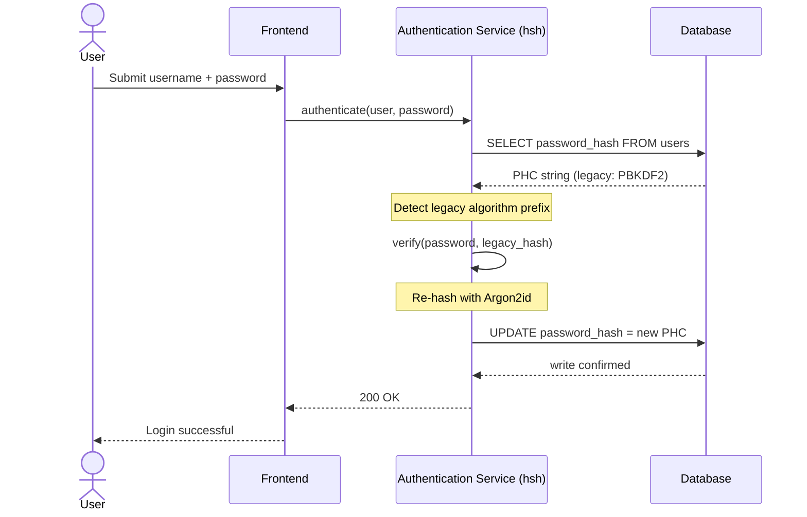
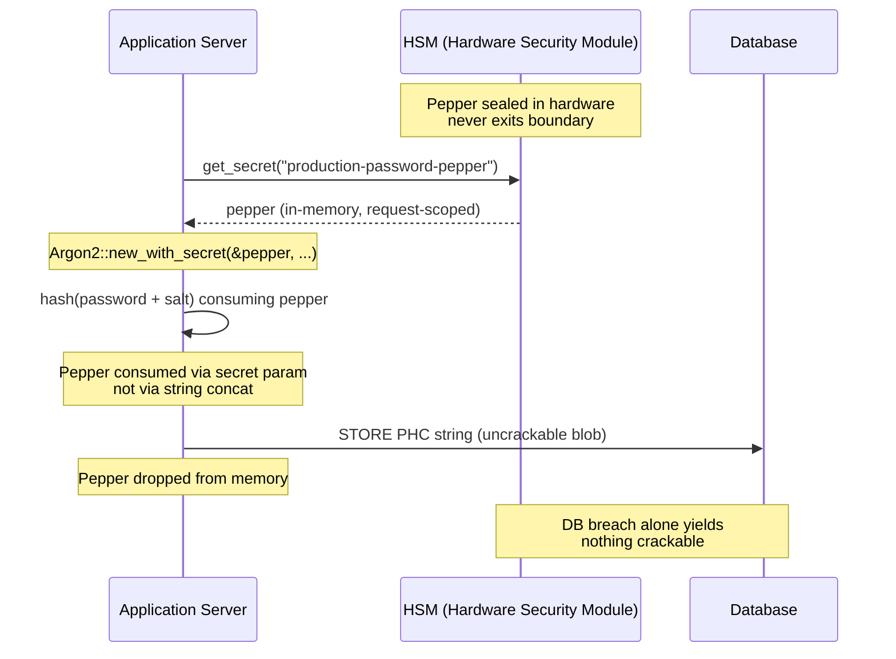

## Menjamin Pengurusan Kata Laluan dalam Perbankan Perusahaan: Cincangan Berbilang Algoritma dan Naik Taraf dengan hsh

> **Ringkasan Eksekutif.** Pengesahan perbankan yang dibina terhadap model ancaman 2018 tidak lagi sesuai digunakan di bawah rejim kawal selia 2026. Pemecahan dipecut-GPU, ketumpatan ASIC, dan cakerawala pasca-kuantum yang semakin hampir telah meruntuhkan margin keselamatan PBKDF2 dan scrypt berparameter awal; Artikel 5 DORA telah mengubah kereputan itu menjadi liabiliti yang boleh dipertanggungjawabkan kepada lembaga pengarah. hsh, sebuah rangka kerja Rust-tulen sumber-terbuka, menangani masalah ini pada tiga lapisan secara selari: sebuah penghantar `verify_and_upgrade` yang mencincang semula kelayakan tersimpan kepada parameter Argon2id semasa pada setiap log masuk yang berjaya tanpa tetingkap penyelenggaraan; sebuah lapisan peppering yang di-interlock HSM atau KMS yang menjadikan pelanggaran pangkalan data semata-mata tidak menghasilkan apa-apa yang boleh dipecahkan; dan sebuah rantaian bekalan yang selamat-ingatan yang menghapuskan permukaan serangan antara muka fungsi-asing yang wujud dalam pustaka kriptografi bersandarkan C. Hasilnya ialah substrat yang memenuhi DORA, disiplin risiko operasi Basel III, akauntabiliti pengurus kanan SM&CR, dan cakerawala pemindahan pasca-kuantum NIST IR 8547 — tanpa program tetap-semula pukal yang secara sejarah diperlukan untuk menaik taraf estet pengesahan.

Kebanyakan pengesahan perbankan perusahaan masih bersandar pada lapisan kata laluan yang dikeraskan mengikut model ancaman 2018. Perkakasan yang memecahkannya telah pun bergerak jauh ke hadapan. Apabila ladang GPU membesar dan komputer kuantum yang relevan secara kriptografi (CRQC) semakin hampir, cincangan warisan — PBKDF2, scrypt awal — mereput dengan setiap jam pengiraan yang dihabiskan penyerang pada baris giliran pemecahan luar talian. Kereputan itu senyap: tiada apa dalam pangkalan data pengeluaran memberitahu anda bahawa cincangan yang kuat semalam tidak lagi kuat hari ini.

Di bawah [Akta Daya Tahan Operasi Digital (DORA)](https://eur-lex.europa.eu/eli/reg/2022/2554/oj "Regulation (EU) 2022/2554 — Digital Operational Resilience Act"), membiarkan aset kriptografi warisan yang tidak dipusing dalam pengeluaran bukan lagi hutang teknikal. Ia ialah liabiliti kawal selia yang dinamakan.

[hsh](https://github.com/sebastienrousseau/hsh "hsh — rangka kerja cincangan kata laluan Rust-tulen") menutup jurang tersebut. Sebagai rangka kerja Rust-tulen, ia mengurus pelbagai format cincangan bersebelahan dan menaik taraf kelayakan lemah semasa sesi log masuk aktif berjalan. Infrastruktur pengesahan diselaraskan dengan mandat daya tahan 2026 tanpa tetingkap penyelenggaraan, tanpa tetap-semula paksa, tanpa sesaat pun waktu henti.

## 01. Masalah Kereputan Kriptografi dalam Perbankan

Untuk memahami keperluan sebuah rangka kerja seperti hsh, seseorang perlu memahami kitaran hayat cincangan kata laluan. Algoritma tidak menua dengan anggun; ia mereput berbanding perkakasan yang tersedia untuk memecahkannya.

**Jurang pecutan ASIC/GPU.** Algoritma seperti PBKDF2 direka bentuk agar mahal dari segi pengiraan untuk CPU. Hari ini, penyerang menggunakan GPU yang sangat berselari untuk melaksanakan serangan kamus luar talian. Cincangan warisan yang dijana pada 2018 jauh lebih lemah terhadap musuh 2026.

**Risiko pemindahan letupan-besar.** Apabila seorang CISO memutuskan untuk menaik taraf daripada PBKDF2 kepada algoritma keras-ingatan seperti Argon2id, mereka tidak boleh mengundurkan cincangan untuk menyulitkannya semula. Penyelesaian tradisional—memaksa tetap-semula kata laluan berjuta-juta pengguna—menyebabkan geseran pelanggan yang besar dan risiko operasi.

**Rantaian bekalan pustaka C.** Secara sejarah, perisian tengah perbankan telah bergantung pada pustaka seperti `argonautica` atau ikatan C mentah untuk pencincangan. Pustaka ini membawa risiko rantaian bekalan tersembunyi: satu limpahan penimbal-ingatan dalam modul pengesahan boleh membawa kepada pelaksanaan kod jarak jauh (RCE) pada lapisan paling berkeistimewaan dalam tindanan perbankan.

### Perbandingan algoritma — rintangan perkakasan dan permukaan penalaan

Ketiga-tiga algoritma yang secara realistik ditemui oleh sebuah bank dalam korpus pemindahan berbeza kurang dalam pemilihan primitif kriptografi dan lebih dalam cara ia menua di bawah tekanan perkakasan. Jadual di bawah meringkaskan pendirian praktikal tersebut.

| Algoritma | Keras-ingatan | Rintangan GPU / ASIC | Permukaan penalaan | Status 2026 |
| ---- | ---- | ---- | ---- | ---- |
| **PBKDF2** | Tidak | Rendah — bervektor pada GPU; sub-milisaat setiap tekaan pada perkakasan komoditi. | Bilangan lelaran sahaja. | Warisan. Boleh diterima hanya sebagai sandaran sisi-pengesahan semasa pemindahan. |
| **scrypt** | Ya (sederhana) | Sederhana — kos ingatan mengalahkan ladang GPU mudah; boleh dilunaskan-ASIC pada skala. | `N` (CPU/ingatan), `r` (saiz blok), `p` (keselarian). | Ditamatkan untuk projek baharu. Aktif dalam korpus pemindahan. |
| **Argon2id** | Ya (tinggi) | Tinggi — keras-ingatan dan keras-masa; menentang serangan saluran-sisi dan TMTO. | Kos ingatan (`m`), kos masa (`t`), keselarian (`p`), rahsia (pepper). | Lalai yang disyorkan. OWASP, deraf NIST SP 800-63B-4, FedRAMP. |

Intipati bagi pelan pemindahan adalah sempit: PBKDF2 ialah keadaan *sisi-pengesahan*, bukan destinasi *sisi-penulisan*. Setiap log masuk yang berjaya pada rekod PBKDF2 patut menghasilkan rekod Argon2id semasa keluar.

## 02. Lensa Seni Bina hsh 2026

Rangka kerja ini distruktur merentasi lima lapisan teras, setiap satunya dijuruteraan untuk mengurangkan kategori risiko operasi tertentu.

### Jadual 1: Lapisan Seni Bina hsh dan Mitigasi Risiko

| Lapisan | Keputusan Reka Bentuk | Mengapa Ia Penting | Risiko jika Salah Uruskan |
| ---- | ---- | ---- | ---- |
| **Primitif Kriptografi** | Format Rentetan PHC Bersatu menyokong Argon2id, scrypt, dan PBKDF2 | Menyediakan rintangan terbaik-dalam-kelas terhadap serangan GPU sambil mengekalkan keserasian ke belakang. | Silo data; algoritma lemah membenarkan 100B+ tekaan/saat luar talian. |
| **Enjin Dasar** | Penghantaran `verify_and_upgrade` | Mengautomasi peralihan daripada dasar warisan kepada dasar moden secara dinamik semasa log masuk. | Kereputan keselamatan; pengguna aktif kekal pada jenis cincangan warisan yang mudah dipecahkan. |
| **Interlock Perkakasan** | Keupayaan "peppering" HSM dan Cloud KMS | Memastikan bahawa pelanggaran pangkalan data semata-mata tidak mendedahkan calon kata laluan. | Serangan brute-force luar talian berjaya selepas pelanggaran suntikan SQL. |
| **Kebersihan Keselamatan** | Penguatkuasaan `deny.toml` dan Rust tulen | Menyekat FFI tidak selamat dan kebergantungan-C luaran tidak dipercayai sepenuhnya. | Serangan rantaian bekalan berbencana dan CVE rasuah-ingatan. |

## 03. Laluan Cincang-Semula Tanpa Henti

Corak `verify_and_upgrade` menyelesaikan pemindahan data melalui sistem penghantaran yang bijak dan sedar-keadaan yang memerlukan sifar waktu henti pangkalan data.

Apabila pengguna menyerahkan kelayakan mereka, hsh membaca rentetan Password Hashing Competition (PHC) yang tersimpan. Jika ia mengandungi cincangan warisan (contohnya, konfigurasi PBKDF2 yang lapuk), sistem melaksanakan aliran berikut:

1. **Pengenalpastian:** Menghurai algoritma warisan dan parameter khususnya.
2. **Pengesahan:** Mengesahkan calon kata laluan terhadap cincangan warisan.
3. **Naik Taraf Masa-Nyata:** Setelah padanan berjaya, ia mengambil calon kata laluan teks-biasa dalam ingatan dan segera mengira cincangan baharu menggunakan dasar Argon2id yang sangat selamat.
4. **Kekalan:** Ia mengembalikan rentetan PHC baharu kepada aplikasi perbankan, yang menulis ganti rekod warisan dalam pangkalan data.

Proses ini adalah telus sepenuhnya kepada pengguna akhir. Ia dengan berkesan memindahkan akaun yang paling aktif kepada tahap keselamatan tertinggi pada hari pertama, mengurangkan secara mendadak permukaan serangan bank secara organik dari masa ke masa.

Urutan di bawah menunjukkan apa yang berlaku semasa satu peristiwa log masuk apabila rekod tersimpan berada pada algoritma warisan. Pengguna tidak melihat apa-apa perubahan; estet pengesahan bank menjadi lebih kukuh sebanyak satu rekod.



### Corak pelaksanaan — penghantaran `verify_and_upgrade`

Permukaan penyepaduan di dalam perkhidmatan pengesahan adalah kecil. Laluan kod warisan kekal sebagai sandaran; laluan kod baharu ialah penghantar.

```rust
use hsh::{Hasher, UpgradeResult};

struct UserRecord {
    username: String,
    password_hash: String, // PHC string
}

async fn authenticate(user: UserRecord, password_attempt: &str) -> Result<bool, AuthError> {
    let hasher = Hasher::new();
    match hasher.verify_and_upgrade(password_attempt, &user.password_hash) {
        Ok(UpgradeResult::Verified(is_valid)) => Ok(is_valid),
        Ok(UpgradeResult::Upgraded(new_hash)) => {
            db::update_user_hash(&user.username, new_hash).await?;
            Ok(true)
        }
        Err(_) => Err(AuthError::InvalidCredentials),
    }
}
```

Tiga sifat penting:

- **Kesedaran-keadaan.** `verify_and_upgrade` memeriksa awalan rentetan PHC. Jika penanda algoritma ialah warisan, rangka kerja mencetuskan cincang-semula secara automatik terhadap dasar Argon2id yang dikonfigurasi. Tiada percabangan dalam kod pemanggil.
- **Keatoman.** Cincang-semula berlaku hanya selepas pengesahan warisan berjaya, dalam peristiwa pengesahan yang sama. Tiada kerja kelompok berasingan, tiada tetingkap pemindahan berjadual, dan tiada pemindahan pukal yang merosakkan untuk diundurkan.
- **Kekalan.** Varian `UpgradeResult::Upgraded` membawa rentetan PHC baharu. Aplikasi mengekalkannya melalui laluan data yang sama yang sudah wujud untuk rekod warisan — tiada permukaan tulis selari, tiada protokol tulis dua-fasa.

**Mod kegagalan.** Jika penulisan pangkalan data gagal atau KMS tidak dapat dicapai seketika semasa penulisan naik taraf, sesi masih berjaya terhadap cincangan warisan dan rekod kekal pada algoritma lama. Log masuk berjaya seterusnya mencuba semula naik taraf. Tiada keadaan separuh-terpindah dan tiada kegagalan yang boleh dilihat pengguna — pemindahan adalah monoton merentasi peristiwa log masuk, dan kos setiap-rekod bagi naik taraf yang gagal ialah tepat satu percubaan semula tambahan pada log masuk seterusnya.

## 04. Cincangan Ber-pepper melalui Interlock HSM / KMS

Pencincangan kata laluan piawai melindungi terhadap kebocoran pangkalan data secara langsung, tetapi jika penyerang memperoleh kedua-dua pangkalan data (cincangan dan garam), mereka boleh melaksanakan pemecahan luar talian.

hsh memperkenalkan lapisan keselamatan "ber-pepper" yang teguh. Dengan menyepadukan dengan Modul Keselamatan Perkakasan (HSM) atau Perkhidmatan Pengurusan Kunci (KMS) asli-awan, keluaran akhir Argon2id dibalut secara kriptografi dengan kunci berentropi-tinggi yang tidak pernah meninggalkan sempadan perkakasan selamat. Jika pangkalan data pengguna diselundup keluar, penyerang hanya memiliki gumpalan tersulit. Mereka tidak boleh mula memecahkan kata laluan tanpa turut menembusi infrastruktur HSM bank yang terpisah secara fizikal.

Rajah seni bina di bawah menjejaki laluan rahsia. Pepper tidak pernah mendarat dalam pangkalan data; pangkalan data tidak pernah memegang apa-apa yang boleh dialamatkan dengan sendirinya. Kedua-dua stor boleh gagal secara bebas — sistem hanya kehilangan kerahsiaan jika kedua-duanya gagal bersama.



### Corak pelaksanaan — Argon2id ber-pepper bersandarkan HSM

Pepper diperoleh daripada HSM pada masa permintaan, bukan daripada fail konfigurasi. `Argon2::new_with_secret` menggunakannya melalui parameter rahsia algoritma, bukan melalui penggabungan rentetan.

```rust
use argon2::{
    Argon2, Algorithm, Version, Params,
    PasswordHasher, PasswordVerifier,
    password_hash::{PasswordHash, SaltString, rand_core::OsRng},
};

async fn authenticate_with_hsm(
    user: UserRecord,
    password_attempt: &str,
) -> Result<bool, AuthError> {
    let pepper = hsm::client::get_secret("production-password-pepper").await?;
    let hasher = Argon2::new_with_secret(
        &pepper,
        Algorithm::Argon2id,
        Version::V0x13,
        Params::default(),
    )
    .map_err(|_| AuthError::Internal)?;

    let parsed = PasswordHash::new(&user.password_hash)
        .map_err(|_| AuthError::InvalidCredentials)?;
    if hasher.verify_password(password_attempt.as_bytes(), &parsed).is_ok() {
        if is_legacy_hash(&user.password_hash) {
            let new_hash = hasher
                .hash_password(
                    password_attempt.as_bytes(),
                    &SaltString::generate(&mut OsRng),
                )
                .map_err(|_| AuthError::Internal)?
                .to_string();
            db::update_user_hash(&user.username, new_hash).await?;
        }
        return Ok(true);
    }
    Err(AuthError::InvalidCredentials)
}
```

Tiga akibat yang selaras dengan DORA terhasil daripada bentuk ini:

- **Pusingan kunci sebagai masalah pengurusan-kunci.** Pepper hidup di sebalik sempadan HSM/KMS, bukan dalam pangkalan data. Pusingan menjadi perubahan pengurusan-kunci, bukan kempen cincang-semula merentasi estet pengguna. Cincangan baharu terikat pada versi pepper semasa; cincangan lama disahkan di bawah versi terikatnya sehingga ia menaik taraf secara semula jadi.
- **Pengasingan tugas.** Identiti perkhidmatan yang membaca pepper mestilah boleh-audit dan berkeistimewaan-paling-sedikit. Penyeludupan keluar pangkalan data penuh tanpa geran HSM yang sepadan tidak menghasilkan apa-apa yang boleh dipecahkan. Kompromi geran-HSM tanpa pangkalan data tidak menghasilkan apa-apa yang boleh dialamatkan. Radius letupan bagi mana-mana kegagalan tunggal adalah terbatas.
- **Elakkan pepijat sambungan-panjang dan penggabungan.** Menggunakan parameter rahsia Argon2 dan bukan penggabungan rentetan menghapuskan seluruh kelas jerangkap kriptografi — sambungan-panjang, penggabungan UTF-8 tersalah-taip, pepijat tertib garam/pepper — daripada permukaan pelaksanaan.

## 05. Penjajaran Kawal Selia: DORA, Basel III, dan SM&CR

- **Artikel 5 dan 6 DORA:** Memerlukan entiti kewangan mengekalkan rangka kerja pengurusan risiko ICT. Strategi yang bergantung pada cincangan kata laluan yang tidak dipusing dan berusia sedekad melanggar prinsip-prinsip ini. hsh menyediakan mekanisme yang berdokumen dan automatik untuk menaik taraf perlindungan kriptografi secara berterusan.
- **Basel III:** Mengaitkan modal kawal selia dengan kebarangkalian dan keterukan peristiwa kerugian. Dengan melaksanakan Argon2id dengan interlock HSM, keterukan pelanggaran pangkalan data dikurangkan secara mendadak, menyokong hujah yang boleh dikuantifikasi bagi peruntukan modal risiko operasi yang lebih rendah.
- **Akauntabiliti SM&CR:** Meluluskan seni bina yang secara aktif memulihkan kereputan kriptografi memberikan pengurus kanan yang dinamakan satu rantaian pengurangan risiko yang boleh disahkan dan didokumenkan.

## Soal Lazim

**Adakah hsh sedia-pengeluaran untuk laluan pengesahan perbankan peringkat pertama?**
Pustaka ini adalah sumber-terbuka, berdokumen, dan menjalankan Argon2id melalui crate `argon2` yang sama yang menyokong ekosistem cincangan-kata-laluan RustCrypto. Penerimaan peringkat pertama mengikut usaha wajar bank itu sendiri: semakan kod bebas, pengesahan binaan-boleh-hasil-semula, penyematan pokok-kebergantungan, ujian penyepaduan vendor-HSM, dan kelulusan Risiko Operasi. hsh menyediakan substrat; bank mengesahkan penggunaan.

**Bagaimanakah `verify_and_upgrade` mengelakkan risiko pemindahan-pukal?**
Pengesah memeriksa rentetan PHC pada masa penghuraian, menjalankan algoritma warisan untuk mengesahkan kata laluan, dan — jika algoritma atau set parameter tersimpan berada di bawah aras semasa — mencincang semula teks-biasa di bawah Argon2id dengan pepper HSM terikat dan menulis balik rentetan PHC baharu secara atomik. Pengguna mengalami log masuk biasa. Estet menjadi lebih kukuh sebanyak satu rekod bagi setiap pengesahan yang berjaya. Tiada kempen tetap-semula, tiada tetingkap penyelenggaraan, tiada peristiwa risiko operasi.

**Apakah yang berlaku kepada akaun tidak aktif yang tidak pernah log masuk?**
Rekod yang tidak pernah mengesah tidak pernah dicincang semula. Bank menangani ini dengan dua dasar saling melengkapi: ambang ketidakaktifan yang berdokumen (selalunya 18–24 bulan) selepas itu akaun dipusing secara pentadbiran di bawah kempen tetap-semula terkawal, dan larian cincang-semula sintetik semasa penyelenggaraan berjadual untuk akaun dalam kohort yang ditakrifkan (bernilai-tinggi, berkeistimewaan-tinggi, terkawal selia). Kedua-duanya adalah dasar, bukan gelagat pustaka; hsh merekodkan keputusan penghantaran dalam telemetri audit supaya pemilik operasi boleh membuktikan liputan.

**Adakah pepper HSM memperkenalkan satu titik kegagalan pada laluan pengesahan?**
HSM yang sama yang menandatangani mesej pembayaran dan memusingkan kunci bersandarkan-KMS berada pada laluan itu. Risikonya adalah sama dengan pendirian bank yang sedia ada; hsh mewarisinya dan bukan memperkenalkannya. Mitigasi adalah piawai: pasangan HSM HA, rantau KMS ganti-panas, pengambilan pepper berskop-permintaan dengan sandaran pemutus-litar ke mod baca-sahaja, dan buku panduan operasi eksplisit untuk ketaktersediaan HSM. Pepper ialah parameter rahsia `argon2`, digunakan dalam-proses dan dilepaskan daripada ingatan selepas digunakan.

**Di manakah hsh berada berbanding pemindahan pasca-kuantum?**
hsh ialah rangka kerja cincangan-kata-laluan-dan-rahsia, bukan primitif enkapsulasi-kunci atau tandatangan. Peralihan NIST PQC yang didokumenkan dalam [NIST IR 8547](https://csrc.nist.gov/pubs/ir/8547/ipd "Transition to Post-Quantum Cryptography Standards") menyasarkan penubuhan kunci (ML-KEM, FIPS 203) dan tandatangan (ML-DSA, FIPS 204; SLH-DSA, FIPS 205). Lapisan pencincangan yang diliputi hsh sebahagian besarnya bersudut-tegak dengan pemindahan itu. Kedua-duanya bertemu pada peringkat substrat — kedua-duanya mahukan rantaian bekalan kriptografi yang selamat-ingatan, boleh-audit, dan boleh-hasil-semula — yang merupakan tepat pendirian yang dimungkinkan hsh hari ini.

## Kesimpulan

Pencincangan kata laluan guna-dan-lupa sudah berakhir. DORA telah menggerakkan kepasifan kriptografi daripada hutang teknikal kepada liabiliti kawal selia yang dinamakan, dan lengkung perkakasan menjadi lebih curam setiap tahun. Sumbangan hsh bukanlah algoritma yang lebih kuat — Argon2id telah tersedia selama bertahun-tahun. Sumbangannya ialah jentera operasi untuk memindah kepadanya tanpa menjadualkan waktu henti, tanpa memaksa tetap-semula pengguna, dan tanpa mempercayai lapik FFI berasaskan C dengan laluan pengesahan bank.

[Kod sumber hsh](https://github.com/sebastienrousseau/hsh "hsh — rangka kerja cincangan kata laluan Rust-tulen, lesen kembar MIT dan Apache 2.0") tersedia di bawah lesen kembar MIT dan Apache 2.0.

## Rujukan

Basel Committee on Banking Supervision (2011). *Basel III: A global regulatory framework for more resilient banks and banking systems*. Bank for International Settlements. Tersedia di: [https://www.bis.org/publ/bcbs189.htm](https://www.bis.org/publ/bcbs189.htm "Basel III: A global regulatory framework for more resilient banks and banking systems")

Biryukov, A., Dinu, D., Khovratovich, D., and Josefsson, S. (2021). *RFC 9106: Argon2 Memory-Hard Function for Password Hashing and Proof-of-Work Applications*. Internet Engineering Task Force. Tersedia di: [https://datatracker.ietf.org/doc/html/rfc9106](https://datatracker.ietf.org/doc/html/rfc9106 "RFC 9106 — Argon2 Memory-Hard Function for Password Hashing")

European Parliament and Council (2022). *Regulation (EU) 2022/2554 on digital operational resilience for the financial sector (DORA)*. Tersedia di: [https://eur-lex.europa.eu/eli/reg/2022/2554/oj](https://eur-lex.europa.eu/eli/reg/2022/2554/oj "Regulation (EU) 2022/2554 — DORA")

Financial Conduct Authority (2015). *Senior Managers and Certification Regime (SM&CR)*. Tersedia di: [https://www.fca.org.uk/firms/senior-managers-certification-regime](https://www.fca.org.uk/firms/senior-managers-certification-regime "Senior Managers and Certification Regime")

National Institute of Standards and Technology (2024). *Initial Public Draft — Transition to Post-Quantum Cryptography Standards (NIST IR 8547)*. Tersedia di: [https://csrc.nist.gov/pubs/ir/8547/ipd](https://csrc.nist.gov/pubs/ir/8547/ipd "NIST IR 8547 — Transition to Post-Quantum Cryptography Standards")

OWASP Foundation (2024). *Password Storage Cheat Sheet*. Tersedia di: [https://cheatsheetseries.owasp.org/cheatsheets/Password_Storage_Cheat_Sheet.html](https://cheatsheetseries.owasp.org/cheatsheets/Password_Storage_Cheat_Sheet.html "OWASP Password Storage Cheat Sheet")
