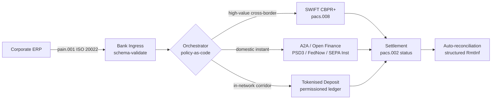

## Rentas Sempadan 2026: ISO 20022, Kewangan Terbuka dan Deposit Termooken dalam Perbendaharaan Korporat

> **Ringkasan Eksekutif.** Perbendaharaan korporat rentas sempadan pada 2026 ialah masalah kejuruteraan berbilang rel sebelum ia menjadi masalah pengurusan hubungan. PSD3 dan peraturan Akses Data Kewangan (FiDA) meluaskan perimeter perbankan terbuka ke dalam data perbendaharaan korporat; peralihan MT/MX SWIFT November 2026 menjadikan pacs.008 patuh CBPR+ satu-satunya format antara bank rentas sempadan yang berdaya maju; deposit termooken dan rel syiling stabil terkawal mengendalikan kaki penyelesaian borong dalam masa hampir T+0 di dalam rangkaian berkebenaran. CIB yang menang dalam kitaran ini bukanlah yang memilih satu rel tunggal; ia yang mengejuruterakan lapisan orkestrasi yang mengikat kesemuanya. Artikel ini menyusuri seni bina empat rel (A2A di bawah PSD3, SWIFT CBPR+, deposit termooken terbitan bank, syiling stabil terkawal) — apa yang setiap rel lakukan dengan baik, di mana sempadan pendedahan kredit jatuh, dan apa yang lapisan orkestrasi dasar-sebagai-kod di atasnya mesti kuatkuasakan supaya korporat melihat satu pembayaran dan penyelia melihat satu jejak yang boleh diaudit.

Sebuah korporat perindustrian Eropah membayar seorang pembekal Brazil sebanyak EUR 4.2 juta pada suatu pagi Rabu. Stesen kerja perbendaharaan tidak memilih bank. Ia memilih rel — satu urutan rel. Arahan yang menghadap pelanggan mendarat pada mesej pain.001 A2A yang dihalakan melalui penyedia kewangan terbuka di bawah PSD3. Bank membawanya merentasi dua bidang kuasa koresponden atas deposit termooken di dalam rangkaian persendirian CIB. Ekor panjang — pelunasan invois USD 80,000 kepada sub-pembekal tanpa hubungan deposit termooken — masih menaiki SWIFT CBPR+ sebagai pacs.008. Pelanggan melihat satu pembayaran. Seni bina melihat empat rel. [ISO 20022](/2023-09-29-automating-iso-20022-compliant-payment-file-creation-with-pain001/index.html) ialah satu-satunya sebab semuanya bergabung.

Inilah model operasi yang digambarkan Mastercard apabila ia bercakap tentang [evolusi daripada perbankan terbuka kepada kewangan terbuka](https://www.mastercard.com/us/en/news-and-trends/Insights/2026/open-banking-to-open-finance-the-evolution-of-financial-data.html "Mastercard: perbankan terbuka kepada kewangan terbuka, evolusi data kewangan") — data dan pembayaran bergabung menjadi satu lapisan orkestrasi, dengan rel dipilih oleh sistem, bukan oleh pelanggan. Persoalan menarik bagi ahli teknologi perbankan kanan bukanlah rel mana yang menang. Ia ialah bagaimana lapisan orkestrasi dikejuruterakan, ditadbir, dan diselaraskan.

## 01. Daripada kad kepada A2A — peralihan kewangan terbuka

Rel kad tidak akan hilang. Ia sedang dibingkai semula.

Sepanjang 2025 dan menjelang 2026, [PSD3 dan peraturan Akses Data Kewangan (FiDA)](https://www.consultancy.uk/news/42202/orchestrating-open-banking-for-platform-growth-2026-outlook "Consultancy.uk: mengorkestrasi perbankan terbuka untuk pertumbuhan platform, tinjauan 2026") memanjangkan kewajipan perbankan terbuka melangkaui akaun pembayaran ke dalam pencen, gadai janji, simpanan, insurans dan data perbendaharaan korporat. Implikasi perbendaharaan korporat adalah langsung: seorang pengurus hubungan CIB kini boleh menggunakan gambaran kecairan penuh sesebuah korporat merentasi berbilang bank melalui satu kontrak API, atas arahan korporat itu.

Dua pengendali sedang jelas membina lapisan orkestrasi yang akan digunakan oleh korporat. Nexi telah memanjangkan jejak pemerolehannya ke dalam pemula A2A merentasi koridor SEPA Instant dan RTGS pan-Eropah, natif ISO 20022 hujung ke hujung. Platform kewangan terbuka Mastercard — ditambat pada pemerolehan Aiia dan Finicity — menyediakan lapisan pengagregatan data dan kebenaran di bawahnya, dengan pemulaan pembayaran muncul melalui estet API yang sama yang sebelum ini menjana kebenaran kad.

Peralihan ini penting atas tiga sebab:

1. **Ekonomi unit.** A2A yang dimulakan di bawah PSD3 menyingkirkan caj antara bank daripada pembayaran. Bagi aliran B2B bertiket tinggi, penjimatannya ketara; bagi aliran pengguna bertiket rendah, timbunan kos peniaga runtuh.
2. **Kualiti data.** A2A di bawah ISO 20022 membawa data pengiriman wang berstruktur yang tidak pernah mampu dibawa oleh kad. Kadar penyelarasan automatik melebihi 95% kini menjadi kadar asas.
3. **Model risiko.** A2A ialah pindahan kredit, bukan kebenaran kad. Permukaan penipuan, model caj balik, dan model pertikaian semuanya berbeza. Pasukan perbendaharaan korporat perlu memahami bahawa lapisan perlindungan pelanggan sedang dibina semula, bukan diwarisi.

CIB yang menjual cadangan berbilang rel pada 2026 sedang menjual orkestrasi — bukan akses. Akses kini terkawal.

## 02. ISO 20022 sebagai lingua franca merentasi rel

Sebab utama berbilang rel dapat berjalan langsung ialah kerana format mesej kini konsisten merentasi rel.

Jawatankuasa Pembayaran dan Infrastruktur Pasaran (CPMI) di bawah BIS telah menjelaskan hujah seni binanya dalam [keperluan penyelarasan ISO 20022 untuk mempertingkatkan pembayaran rentas sempadan](https://www.bis.org/cpmi/publ/d230.pdf "BIS CPMI: keperluan penyelarasan ISO 20022 untuk mempertingkatkan pembayaran rentas sempadan"). Peralihan November 2025 kepada CBPR+ menutup era MT103 / MT202 bagi pemesejan antara bank rentas sempadan. Sejak titik itu, setiap rel utama — SWIFT, FedNow, SEPA Instant, RTP, dan sistem pembayaran serta-merta utama di Asia dan Amerika Latin — bertutur dengan tatabahasa pacs.008 / pacs.009 / pain.001 yang sama.

Akibat praktikal bagi perbendaharaan korporat:

- **Penghalaan dipacu data.** Stesen kerja perbendaharaan boleh membaca satu pain.001 sekali sahaja dan memutuskan rel bagi setiap pembayaran berdasarkan koridor, saiz tiket, waktu potong, dan hubungan pihak lawan — tanpa memetakan semula mesej itu.
- **Data pengiriman wang bertahan sepanjang lompatan.** Medan pengiriman wang berstruktur (`<RmtInf><Strd>`) menembusi kaki koresponden tanpa dipotong. Kadar penyelarasan automatik meningkat kerana data tidak lagi hilang di sempadan rel.
- **Penyaringan sekatan menjadi boleh diaudit.** Medan `<Dbtr>` / `<Cdtr>` / `<DbtrAgt>` / `<CdtrAgt>` berstruktur dengan rujukan LEI menggantikan penyaringan nama teks bebas. Kadar padanan menurun. Baris gilir siasatan mengecut.

Rajah di bawah menjejaki satu pain.001 melalui pintu masuk bank, ke dalam pengorkestra dasar-sebagai-kod, dan keluar ke mana-mana rel yang dituntut oleh koridor dan saiz tiket — satu mesej, banyak rel, tiada pemetaan semula.

Kos kekonsistenan ini ialah disiplin kejuruteraan. ISO 20022 bersifat membenarkan. Dua bank boleh patuh sepenuhnya CBPR+ namun masih menghasilkan mesej pacs.008 yang berbeza dalam penggunaan medan, set aksara, dan struktur data pengiriman wang. CIB yang menang dalam rentas sempadan pada 2026 menguatkuasakan profil mesej yang lebih ketat daripada yang dituntut oleh piawaian — dan menolak pada penghuraian, bukan pada penyelesaian.

## 03. Deposit termooken dan rel stabil

Kaki penyelesaian borong ialah tempat cerita rel menjadi menarik.

Gambaran 2026, yang dirakam dengan baik dalam [analisis Trade Treasury Payments tentang automasi, rel kontingensi, ISO 20022 dan syiling stabil](https://tradetreasurypayments.com/articles/automation-contingency-rails-iso-20022-and-stablecoins-the-2026-trends-reshaping-corporate-finance-and-b2b-payments "Trade Treasury Payments: automasi, rel kontingensi, ISO 20022 dan syiling stabil, trend 2026 yang membentuk semula kewangan korporat dan pembayaran B2B"), membahagikan lapisan penyelesaian borong kepada dua model yang berbeza dari segi struktur.

**Deposit termooken terbitan bank.** Sebuah bank perdagangan menerbitkan liabiliti termooken pada lejar berkebenaran — JPM Coin, token deposit terpaut Orion HSBC, setara CIB Eropah utama. Token itu ialah tuntutan langsung ke atas bank penerbit. Penyelesaian adalah hampir T+0 di dalam rangkaian. Pematuhan ialah tanggungjawab bank penerbit. Rel itu terkawal sepenuhnya, boleh dijejaki sepenuhnya, dan terhad kepada peserta yang telah dilog masuk oleh penerbit.

**Rel syiling stabil bersepadu.** Sebuah syiling stabil terkawal — dirizab sepenuhnya, diaudit, dan beroperasi di bawah MiCA atau rejim serantau yang setara — menyelesaikan koridor yang belum dicapai oleh deposit termooken terbitan bank. Token itu ialah tuntutan ke atas rizab, bukan ke atas kunci kira-kira bank. Pematuhan dikongsi antara penerbit, jalan masuk (on-ramp), dan jalan keluar (off-ramp).

Kedua-dua model itu bukan bersaing. Ia bertindan. Sesebuah produk rentas sempadan CIB pada 2026 lazimnya menggunakan deposit termooken terbitan bank untuk kaki dalam rangkaian dan syiling stabil terkawal untuk koridor di mana rel dalam rangkaian berakhir. Korporat melihat satu pembayaran ISO 20022. Cerita penyelesaian di bawahnya ialah berbilang token.

Persoalan peringkat lembaga adalah sama seperti yang telah ditanya oleh jawatankuasa risiko operasi sejak perintis kecairan boleh aturcara yang pertama: siapa yang menanggung pendedahan kredit ke atas token itu, dan untuk berapa lama? Deposit termooken memberi jawapan yang bersih — bank penerbit, sehingga pembakaran (burn). Rel syiling stabil bersepadu memberi jawapan yang lebih bernuansa — rizab, tertakluk kepada kitaran audit dan jaminan penebusan. Pasukan perbendaharaan yang tidak mendokumenkan jawapan bagi setiap rel bagi setiap koridor sedang menanggung risiko kredit yang tidak terukur pada kunci kira-kiranya.

## 04. Tindanan perbendaharaan autonomi

Di atas lapisan rel terletak lapisan orkestrasi. Di atas lapisan orkestrasi terletak lapisan ejen.

Saya telah menerangkan seni bina ini secara terperinci dalam [Indeks Perbendaharaan Autonomi 2026: Kecairan Boleh Aturcara dan Deposit Termooken](https://sebastienrousseau.com/2026-06-07-autonomous-treasury-index-programmable-liquidity-tokenised-deposits-2026 "Sebastien Rousseau: Indeks Perbendaharaan Autonomi 2026"). Versi ringkasnya: perbendaharaan ejenik pada 2026 ialah lapisan orkestrasi, dinyatakan sebagai dasar-sebagai-kod, dengan ejen bersempadan melaksanakan di dalamnya.

Tindanan itu ialah:

1. **Lapisan rel.** SWIFT CBPR+, A2A serta-merta, deposit termooken, syiling stabil terkawal. Setiap rel mempunyai profil yang diterbitkan, jadual waktu potong, lengkung kos, dan model kemuktamadan penyelesaian.
2. **Lapisan orkestrasi.** ISO 20022 masuk, ISO 20022 keluar. Keputusan rel bagi setiap pembayaran berdasarkan koridor, tiket, waktu potong, hubungan pihak lawan, dan dasar. Dasar diberi versi, ditandatangani, dan boleh diaudit.
3. **Lapisan ejen.** Ejen perbendaharaan bersempadan melaksanakan dasar orkestrasi dengan sempadan panggilan alat, log audit, dan suis mati. Ejen tidak memilih rel. Dasar memilih rel. Ejen menjalankan dasar.
4. **Lapisan penyelarasan.** Mesej ISO 20022 pacs.008 / pacs.002 / camt.054 diselaraskan terhadap arahan pain.001 asal, dengan data pengiriman wang berstruktur menutup gelung tanpa campur tangan manual.

CIB yang menjual tindanan ini pada 2026 sedang menjual empat perkara serentak — dan menetapkan harganya secara berasingan. Korporat yang membelinya sedang membeli keopsyenan merentasi rel, dengan satu piawaian mesej, satu lapisan dasar, satu suapan penyelarasan. Itulah peralihan seni bina. Segala-galanya yang lain ialah butiran pelaksanaan.

## Soalan Lazim

**Adakah "kewangan terbuka" hanya perbankan terbuka yang dijenamakan semula?**
Tidak. Perbankan terbuka di bawah PSD2 meliputi akaun pembayaran. PSD3 dan peraturan Akses Data Kewangan (FiDA) memanjangkan kewajipan perkongsian data ke dalam pencen, gadai janji, simpanan, insurans, dan data perbendaharaan korporat. Implikasi perbendaharaan korporat adalah langsung: seorang pengurus hubungan CIB kini boleh menggunakan gambaran kecairan penuh sesebuah korporat merentasi berbilang bank melalui satu kontrak API, atas arahan korporat itu, bukan sekadar sejarah akaun pembayarannya.

**Mengapa lapisan orkestrasi menjadi fokus seni bina, bukan rel?**
Kerana rel kini menjadi komoditi. SWIFT CBPR+ pacs.008, A2A di bawah PSD3, deposit termooken, dan syiling stabil terkawal semuanya membawa tatabahasa ISO 20022 yang sama pada peringkat mesej. Apa yang membezakan CIB 2026 ialah enjin dasar-sebagai-kod yang memilih rel bagi setiap pembayaran berdasarkan koridor, saiz tiket, keperluan kemuktamadan penyelesaian, dan hubungan pihak lawan — dan yang merekodkan pilihan itu dalam telemetri audit yang akan diminta oleh penyelia. Tanpa enjin itu, berbilang rel hanyalah keopsyenan tanpa tadbir urus.

**Di mana sempadan pendedahan kredit jatuh pada kaki deposit termooken?**
Deposit termooken terbitan bank pada lejar berkebenaran ialah tuntutan langsung ke atas bank penerbit — pendedahan kredit berakhir pada pembakaran (burn). Rel syiling stabil terkawal (diselia MiCA di EU, rejim kertas perbincangan Bank of England di UK, analog di tempat lain) ialah tuntutan ke atas rizab, dengan tetingkap pendedahan tertakluk kepada kitaran audit dan terma jaminan penebusan. Pasukan perbendaharaan yang tidak mendokumenkan jawapan bagi setiap rel bagi setiap koridor sedang menanggung risiko kredit yang tidak terukur pada kunci kira-kiranya.

**Apa yang berlaku kepada SWIFT dalam seni bina ini?**
SWIFT tidak lenyap — ia menambat ekor panjang. Koridor di mana deposit termooken terbitan bank belum mencapai (kebanyakan hubungan sub-pembekal pasaran memuncul, kebanyakan aliran rentas sempadan berfrekuensi rendah / bertiket rendah), dan koridor di mana korporat atau bank memerlukan jejak audit perbankan koresponden CBPR+, terus berjalan atas SWIFT pacs.008. Seni bina 2026 ialah "SWIFT + rel baharu", bukan "rel baharu menggantikan SWIFT".

**Apa yang dibeli oleh korporat apabila ia membeli tindanan ini?**
Keopsyenan merentasi rel, dengan satu piawaian mesej (ISO 20022), satu lapisan dasar (enjin orkestrasi), dan satu suapan penyelarasan (status pacs.002 + pengesahan camt.054 + penyata camt.053 berstruktur). Korporat tidak membayar untuk empat sambungan rel yang berasingan. Ia membayar untuk lapisan orkestrasi yang menjadikan empat rel berkelakuan sebagai satu dari segi operasi — dan jejak audit yang membolehkannya menjawab "rel mana yang dinaiki oleh pembayaran EUR 4.2 j itu, dan mengapa?" pada pagi selepas permintaan penyeliaan seterusnya.

## Kesimpulan

Perbendaharaan korporat rentas sempadan pada 2026 ialah masalah kejuruteraan berbilang rel. ISO 20022 ialah tatabahasa yang menjadikan berbilang rel boleh diuruskan. PSD3 dan FiDA meluaskan perimeter data dan memaksa kewangan terbuka masuk ke dalam aliran kerja perbendaharaan korporat. Deposit termooken dan syiling stabil terkawal mengendalikan kaki penyelesaian borong. SWIFT masih menambat ekor panjang.

CIB yang menang ialah yang membina lapisan orkestrasi — bukan yang memilih satu rel tunggal dan mempertaruhkan francais atasnya. Pasukan perbendaharaan korporat yang menang ialah yang mendokumenkan pendedahan kredit bagi setiap rel bagi setiap koridor, menguatkuasakan profil ISO 20022 yang lebih ketat daripada yang dituntut pengawal selia, dan menganggap keputusan rel sebagai dasar, bukan sebagai keputusan pertimbangan bagi setiap pembayaran.

Kerja yang menarik terletak pada lapisan orkestrasi. Binalah ia dengan berhati-hati.

## Rujukan

Bank for International Settlements, Committee on Payments and Market Infrastructures (2023). *Harmonised ISO 20022 data requirements for enhancing cross-border payments* (CPMI Papers No. 230). Boleh didapati di: [https://www.bis.org/cpmi/publ/d230.htm](https://www.bis.org/cpmi/publ/d230.htm "BIS CPMI 230 — Harmonised ISO 20022 data requirements")

Bank for International Settlements (2024). *Project Agorá: cross-border payments with tokenised commercial bank deposits and central bank money*. BIS Innovation Hub. Boleh didapati di: [https://www.bis.org/about/bisih/topics/fmis/agora.htm](https://www.bis.org/about/bisih/topics/fmis/agora.htm "BIS Project Agorá")

Bank of England (2023). *Regulatory regime for systemic payment systems using stablecoins and related service providers — Discussion Paper*. Boleh didapati di: [https://www.bankofengland.co.uk/paper/2023/dp/regulatory-regime-for-systemic-payment-systems-using-stablecoins-and-related-service-providers](https://www.bankofengland.co.uk/paper/2023/dp/regulatory-regime-for-systemic-payment-systems-using-stablecoins-and-related-service-providers "Bank of England — Regulatory regime for stablecoins discussion paper")

European Commission (2023). *Proposal for a Directive on payment services and electronic money services (PSD3)*. Boleh didapati di: [https://finance.ec.europa.eu/regulation-and-supervision/financial-services-legislation/implementing-and-delegated-acts/payment-services-directive_en](https://finance.ec.europa.eu/regulation-and-supervision/financial-services-legislation/implementing-and-delegated-acts/payment-services-directive_en "European Commission — Payment Services Directive proposal")

European Parliament and Council (2023). *Regulation (EU) 2023/1114 on markets in crypto-assets (MiCA)*. Boleh didapati di: [https://eur-lex.europa.eu/eli/reg/2023/1114/oj](https://eur-lex.europa.eu/eli/reg/2023/1114/oj "Regulation (EU) 2023/1114 — Markets in Crypto-Assets (MiCA)")

Financial Action Task Force (2023). *International standards on combating money laundering and the financing of terrorism — Recommendation 16 on wire transfers*. Boleh didapati di: [https://www.fatf-gafi.org/en/publications/Fatfrecommendations/Fatf-recommendations.html](https://www.fatf-gafi.org/en/publications/Fatfrecommendations/Fatf-recommendations.html "FATF Recommendations")

International Organization for Standardization (2020). *ISO 17442 Financial services — Legal entity identifier (LEI)*. Boleh didapati di: [https://www.gleif.org/en/about-lei/iso-17442-the-lei-code-structure](https://www.gleif.org/en/about-lei/iso-17442-the-lei-code-structure "ISO 17442 — Legal Entity Identifier")

SWIFT (2024). *Cross-Border Payments and Reporting Plus (CBPR+) usage guidelines*. Boleh didapati di: [https://www.swift.com/standards/iso-20022/iso-20022-programme](https://www.swift.com/standards/iso-20022/iso-20022-programme "SWIFT CBPR+ usage guidelines")
