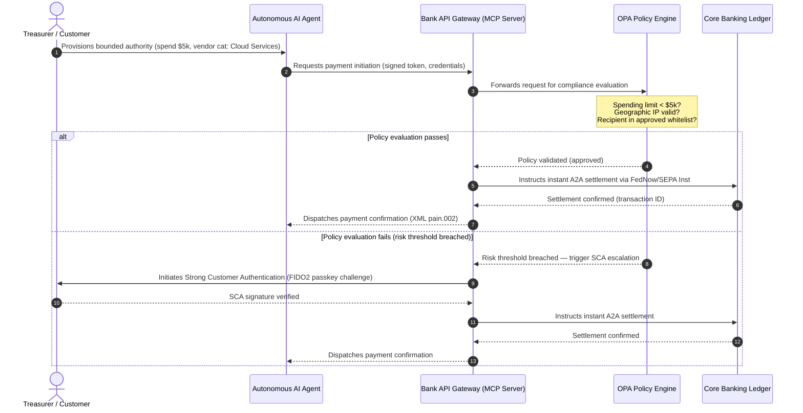

## Tinjauan Pembayaran Global 2026: Model Operasi, Risiko, dan Hasil dalam Dunia Agentik, Halimunan, dan Masa Nyata

Bagi bank transaksi global, kitaran 2026-2028 ialah tetingkap struktur. Infrastruktur pembayaran moden bukan lagi sekadar utiliti pentadbiran — ia menjadi teras strategi teknologi bertaraf bank. Di dalam G-SIB dan institusi serantau utama, teknologi, kawal selia, dan jangkaan pelanggan telah menyatu menjadi satu satah operasi.

Tiga daya menakrifkan kitaran ini, dan setiap satu memetakan secara langsung kepada satu keprihatinan peringkat eksekutif.

- **Perdagangan agentik** — pengedaran saluran, reka bentuk produk, penetapan liabiliti, dan Pengurusan Risiko Model di bawah pengawasan penyelia.
- **Pembayaran halimunan** — pengalaman pelanggan, dengan risiko penyahperantaraan apabila bank gagal membenamkan lejar mereka ke dalam bahagian hadapan korporat dan pedagang.
- **Pelaksanaan masa nyata** — halaju modal, dengan perubahan lanjutan kepada pengurusan kecairan, risiko kredit, ketahanan operasi, dan pertahanan penipuan.

Kepentingan kewangannya adalah nyata. Penipuan berskala dalam kelajuan dan kecanggihan; tarikh akhir kawal selia adalah tegas; dan bank yang secara proaktif memodenkan sistem teras mereka membuka peluang hasil yuran yang besar. Kos ketidaktindakan adalah sebaliknya: penolakan transaksi serta-merta, kesesakan operasi, penalti kawal selia, dan hakisan bahagian pasaran yang pantas.

## Tangga kepastian — apa yang bertarikh, apa yang dikawal selia, apa yang diramal

Bukan setiap perkara dalam laporan ini membawa tahap kepastian yang sama. Soalan peringkat lembaga ialah delta mana yang merupakan tarikh akhir, mana yang merupakan jangkaan penyelia, dan mana yang masih menjadi unjuran pasaran — kerana jawapannya mengubah perbualan bajet.

| Kategori | Contoh |
| --- | --- |
| **Tarikh akhir tegas** | Peralihan alamat berstruktur Swift CBPR+ (14 November 2026); buku peraturan skim EPC SEPA (15 November 2026) |
| **Kewajipan kawal selia** | Risiko ICT DORA + ujian ketahanan + pengawasan pihak ketiga (EU); perwakilan SCA di bawah PSD3/PSR; MRM di bawah SR 11-7 + PRA SS1/23 |
| **Peralihan pasaran berkebarangkalian tinggi** | API perbendaharaan masa nyata, pertahanan penipuan dipacu AI, kecairan berasaskan API, penipuan biometrik dipacu deepfake |
| **Pilihan strategik** | Deposit tertoken, lejar bersatu di bawah Project Agorá, koridor perdagangan agentik, FX berterusan (Wire 365) |
| **Ramalan** | Aliran perdagangan agentik tahunan $3-$5 trilion menjelang 2030 (garis dasar McKinsey) |

Anggap dua baris teratas sebagai fakta pematuhan yang memacu satu baris bajet sama ada bank menangkap sebarang kelebihan atau tidak. Anggap dua baris terbawah sebagai pilihan strategik — berkeyakinan tinggi dalam arah, tetapi di mana masa pelaksanaan ialah pilihan lembaga dan bukannya catatan kalendar seorang pengawal selia.

## Pertemuan pihak berkuasa pembayaran global

Laporan ini mensintesis tinjauan pembayaran dan perdagangan 2026 daripada empat suara industri berwibawa — [J.P. Morgan Payments](https://www.jpmorgan.com/payments/newsroom/payments-outlook-2026-trends-report-released "J.P. Morgan Payments — Outlook 2026"), [Global Payments](https://investors.globalpayments.com/news-events/press-releases/detail/497/global-payments-releases-its-2026-commerce-and-payment "Global Payments — 2026 Commerce and Payment Trends Report"), HSBC, dan The Payments Association — dan mentriangulasikannya terhadap [Pelan Hala Tuju G20 untuk Mempertingkatkan Pembayaran Rentas Sempadan](https://www.fsb.org/2026/03/fsb-kicks-off-new-implementation-phase-to-enhance-cross-border-payments-through-public-private-partnership/ "FSB — cross-border payments implementation phase, March 2026").

Setiap organisasi menghampiri ekosistem daripada sudut pasaran yang berbeza, tetapi penemuan mereka menyatu pada tiga ketetapan.

1. **Rel serta-merta yang dipacu API ialah asas.** Model pemprosesan kelompok lama dipinggirkan untuk aliran rentas sempadan dan bernilai tinggi; halaju transaksi dalam segmen tersebut ditentukan oleh pemesejan masa nyata yang sentiasa hidup.
2. **AI ialah ancaman sekali gus pertahanan.** Alat generatif dan deepfake meningkatkan skala penipuan transaksi, memerlukan pertahanan balas pembelajaran mesin masa nyata berbilang lapisan.
3. **Pentokenan ialah infrastruktur sedia pengeluaran.** Lejar sedang bersatu untuk menempatkan liabiliti perdagangan tertoken dan mata wang digital bank pusat borong.

| Laporan | Khalayak utama | Fokus | Tonggak utama | Implikasi bank |
| --- | --- | --- | --- | --- |
| **J.P. Morgan Payments** | Bendahari korporat, G-SIB | Kecairan masa nyata, penipuan | API, biometrik AI | Membina semula sistem kecairan, FX, dan risiko untuk penyelesaian berterusan 365 hari. |
| **Global Payments** | Pedagang, e-dagang | Evolusi POS, saluran omni | Perdagangan agentik, pembayaran tanpa geseran | Membina koridor pembayaran pedagang yang selamat dan berpagar API untuk ejen AI autonomi. |
| **HSBC Insights** | Korporat multinasional | Penyepaduan ERP (SAP/Oracle), tunai masa nyata | Treasury-as-a-Service, keterlihatan tunai | Mewangkan suite API transaksi dan membenamkan pelaporan lejar tunai masa nyata di sumber. |
| **The Payments Association** | Fintech, institusi pembayaran | Stablecoin, pentokenan, kawal selia global | Aset digital dikawal selia, pematuhan dasar | Menyediakan kunci kira-kira untuk deposit tertoken dan menavigasi struktur liabiliti PSD3/PSR. |

Keempat-empat tinjauan pada dasarnya menakrifkan tindanan operasi sektor swasta yang berjalan di atas infrastruktur dasar G20 sektor awam, menterjemahkan hasrat dasar kepada keputusan konkrit mengenai kecairan, pentokenan, data, dan kawalan penipuan di dalam bank.

## Tonggak 1 — Perdagangan agentik dan pembayaran halimunan

Perdagangan agentik ialah peralihan daripada pembayaran klik-untuk-beli yang dipacu manusia kepada permulaan transaksi autonomi yang dipacu model. Ramalan industri menyatu pada $3-$5 trilion perdagangan tahunan yang diantara oleh ejen autonomi menjelang 2030 — bahagian angka satu yang rendah daripada jumlah pembayaran global yang dilaksanakan tanpa manusia mengklik 'beli'.

Ekosistem runcit dan perdagangan mempunyai jurang yang sepadan. Majoriti jelas pengguna kini menjangkakan pembayaran hampir tanpa geseran, namun kurang daripada separuh pedagang telah mengutamakan pembayaran satu klik atau katalog produk boleh diakses API. Ejen AI tidak dapat menavigasi skrin pembayaran berbilang halaman lama yang direka untuk mata manusia; mereka memerlukan jabat tangan API mesin-ke-mesin yang berstruktur.

### Keutamaan bank dan kesan operasi

- **Pemilikan KYC dan AML.** Bank mesti menakrifkan siapa yang memegang kewajipan pematuhan di dalam rantaian transaksi agentik. Jika ejen AI peribadi seorang pengguna memulakan transaksi melalui pembayaran agentik seorang pedagang, bank mesti mengesahkan bahawa kuasa diwakilkan yang berasal itu terikat secara kriptografi kepada pemegang akaun utama.
- **Reka bentuk semula liabiliti dan caj balik.** Skim kad dan rel A2A direka berdasarkan kebenaran manusia. Apabila ejen AI membuat pembelian yang tersilap — memperoleh inventori perindustrian yang salah kerana ralat penghuraian data, contohnya — bank mesti memperuntukkan liabiliti dengan jelas antara pengguna, penyedia ejen, dan pedagang.
- **Menilai risiko aliran agentik.** Enjin penghalaan pembayaran mesti menilai risiko pembayaran agentik secara dinamik, mengenakan keperluan rizab atau kadar pertukaran yang lebih tinggi kepada transaksi yang tidak dimulakan oleh manusia sehingga rekod prestasi penyelesaian yang stabil wujud.

### Tindakan bersempadan dan kuasa bersempadan

Untuk mengurangkan "tindakan tanpa sempadan" — ejen perolehan perusahaan yang menjalankan gelung pembelian rekursif tanpa henti kerana pepijat perisian — bank mesti menggunakan **pintu API kuasa bersempadan**. Pintu ini menguatkuasakan had peringkat dasar merentasi tiga dimensi.

1. **Had kewangan berperingkat** — perbelanjaan ejen dihadkan mengikut saiz transaksi, nilai kumulatif harian, dan kategori pedagang.
2. **Perlindungan sedar konteks** — isyarat sekunder (waktu-hari, geolokasi IP, kekerapan transaksi) dinilai sebelum lejar melepaskan dana.
3. **Peningkatan manusia-dalam-gelung** — kebenaran manusia mandatori dicetuskan melalui Pengesahan Pelanggan Kukuh (SCA) di bawah PSD3 / PSR apabila transaksi melebihi ambang risiko.

Jujukan Mermaid di bawah menunjukkan seni bina sasaran yang akan dikenali oleh kebanyakan bank sebagai aliran pembayaran agentik kuasa bersempadan.

### Model Context Protocol (MCP)

Untuk menghubungkan model AI setempat kepada lapisan pelaksanaan yang ditadbir bank, industri sedang menyeragamkan sekitar [Model Context Protocol (MCP)](https://modelcontextprotocol.io "Model Context Protocol — open standard for LLM tool integration") — sebuah protokol terbuka yang membolehkan LLM memanggil alat dan API yang berskop jelas dan boleh diaudit tanpa akses mentah kepada sistem teras.

Membalut API perbankan (permulaan pembayaran, pertanyaan baki, pengesahan pihak) di dalam pelayan MCP menjauhkan LLM daripada jadual pangkalan data dan kawalan akar sistem. Model berinteraksi dengan lejar hanya melalui titik akhir yang berstruktur, diaudit, dan dihadkan kadar — keselamatan dikuatkuasakan di sempadan pelaksanaan alat agentik dan bukannya tersembunyi di dalam model.

## Tonggak 2 — Transformasi perbendaharaan dan kecairan yang dibayangkan semula

Halaju perbankan transaksi pada 2026 ditetapkan oleh peralihan daripada pemprosesan kelompok penghujung hari kepada operasi perbendaharaan masa nyata yang sentiasa hidup. Korporat multinasional tidak lagi bertoleransi dengan tunai terperangkap — kecairan yang terbiar dalam akaun tempatan pada hujung minggu atau cuti kerana sistem penyelesaian ditutup.

### Kes ekonomi bagi kecairan masa nyata

J.P. Morgan dan HSBC kedua-duanya melaporkan bahawa korporat dengan keupayaan tunai dan data masa nyata yang maju adalah jauh lebih berkemungkinan mengatasi rakan setara dalam pertumbuhan hasil dan kecekapan modal, terutamanya dengan mengurangkan kecairan terperangkap dan mengoptimumkan kitaran modal kerja.

Untuk menangkap nilai tersebut, bank menghantar **produk API Treasury-as-a-Service (TaaS)** yang membolehkan ERP korporat (SAP, Oracle) dipasang terus ke dalam lejar bank.

- **API baki masa nyata** menggunakan skema `camt.052` — menggantikan protokol pemindahan fail dengan pelaporan kedudukan tunai serta-merta yang dipacu peristiwa.
- **API permulaan pembayaran pukal** menggunakan `pain.001` — pelaksanaan terus dan terus-menerus bagi kelompok pembayaran vendor daripada lejar ERP.
- **API FX berterusan** — enjin perbendaharaan mengunci kadar pertukaran asing masa nyata secara algoritma untuk penyelesaian rentas sempadan, menghapuskan risiko jurang pasaran semalaman.
- **API akaun maya** — korporat secara dinamik mencipta dan menamatkan ribuan sub-akaun untuk pemadanan penghutang automatik dan pengasingan lejar.

### Ketahanan operasi dan DORA

Menawarkan kecairan sentiasa hidup mengubah profil risiko bank. Bagi API perbendaharaan masa nyata yang penting secara sistemik, **ketersediaan lima-sembilan (99.999 %)** menjadi sasaran kejuruteraan dalaman yang ditetapkan bank untuk diri mereka sendiri untuk menunjukkan ketahanan bertaraf DORA kepada penyelia. DORA sendiri tidak menetapkan suatu angka lima-sembilan yang universal; ia meliputi pengurusan risiko ICT, pelaporan insiden, ujian ketahanan, risiko pihak ketiga, dan pengawasan penyedia ICT kritikal — tetapi platform API perbendaharaan yang kadangkala terputus di bawah beban berterusan tidak akan dapat mempertahankan inventori senario teruk-tetapi-munasabahnya secara meyakinkan.

Di bawah [Akta Ketahanan Operasi Digital (DORA)](https://eur-lex.europa.eu/legal-content/EN/TXT/?uri=CELEX%3A32022R2554 "Regulation (EU) 2022/2554 — Digital Operational Resilience Act"), itu bukanlah KPI IT — ia adalah keperluan kawal selia yang ketat. Pengawal selia menjangkakan bank membuktikan bahawa permukaan API perbendaharaan masa nyata dan pangkalan data lejar boleh menyerap serangan siber, gangguan rangkaian, dan gangguan hyperscaler yang teruk-tetapi-munasabah tanpa mengganggu pembayaran kritikal atau menjejaskan kecairan sistemik. Itu memerlukan seni bina pangkalan data berbilang awan aktif-aktif dan lebihan geografi, lapisan pengesanan ancaman masa nyata, dan gagal-alih automatik — kelihatan dalam baris kos perubahan, bukan sekadar dosier audit.

### FX berterusan dan inovasi rentas sempadan

Perbendaharaan masa nyata tidak boleh hidup di dalam sempadan mata wang tunggal. G-SIB sedang menggunakan infrastruktur FX berterusan — platform [Wire 365](https://www.jpmorgan.com/insights/payments/fx-cross-border/wire-365-global-clearing "J.P. Morgan — Wire 365 global clearing reinvented") J.P. Morgan memproses pembayaran rentas sempadan dan penukaran FX pada mana-mana hari dalam setahun, melangkaui waktu RTGS bank pusat tradisional. Lapisan itu bergabung terus dengan sistem deposit tertoken dan lejar bersatu yang dibincangkan dalam Tonggak 3.

## Tonggak 3 — Deposit tertoken dan lejar bersatu

Pentokenan telah beralih daripada perintis bukti-konsep terpencil kepada infrastruktur monetari bertaraf bank yang berskala. Fokus telah beralih daripada stablecoin swasta dan aset kripto spekulatif kepada **deposit bank perdagangan tertoken** dan **mata wang digital bank pusat borong (wCBDC)** yang berjalan pada lejar bersatu boleh aturcara.

Rangka kerja rujukan ialah [Project Agorá](https://www.bis.org/about/bisih/topics/fmis/agora.htm "BIS Project Agorá — tokenisation of wholesale cross-border payments") — sebuah kerjasama awam-swasta utama yang dianjurkan oleh BIS dan IIF, melibatkan **lapan bank pusat** dan lebih 40 institusi kewangan swasta (menurut halaman BIS Agorá, dikemas kini 27 Mei 2026). Projek ini meneroka bagaimana deposit bank perdagangan tertoken bersepadu dengan wCBDC borong tertoken pada lejar boleh aturcara yang dikongsi untuk menghapuskan geseran penyelesaian rentas sempadan, menyelaraskan pemeriksaan pematuhan, dan membolehkan kemuktamadan atom 24/7.

### Perjalanan pentokenan lima langkah

Bagi G-SIB dan bank serantau utama, pentokenan ialah perjalanan berperingkat daripada pengoptimuman dalaman kepada kesalinghubungan pasaran terbuka.

1. **Kecairan perbendaharaan dalaman** — mentokenkan baki tunai korporat dalaman (cth. JPM Coin atau lejar bank swasta setara) untuk membolehkan pemindahan dan penjelasan bersih rentas sempadan serta-merta 24/7 merentasi cawangan bank sendiri.
2. **Koridor berbilang bank bersempadan** — konsortium tertutup yang dikawal selia (kotak pasir Project Agorá) untuk menguji penyelesaian antara bank dan keadaan lejar dikongsi merentasi institusi yang berlainan.
3. **FX boleh aturcara berterusan** — kontrak pintar pada lejar bersatu melaksanakan FX Bayaran-lawan-Bayaran (PvP) serta-merta, menghapuskan risiko penyelesaian merentasi zon waktu.
4. **Aset dunia sebenar tertoken (RWA)** — kaki tunai tertoken bersepadu dengan sekuriti, hutang, atau lejar perdagangan tertoken untuk kemuktamadan Penghantaran-lawan-Bayaran (DvP) serta-merta, mengurangkan kunci modal daripada hari kepada milisaat.
5. **Kesalinghubungan awam/hibrid yang dikawal selia** — pembalut get selamat membolehkan kecairan institusi berinteraksi dengan selamat dengan rangkaian awam terbuka.

### Implikasi prudensial dan kunci kira-kira

Tunai tertoken mesti dinavigasi melalui rangka kerja prudensial dengan berhati-hati. Penyelia menekankan bahawa deposit tertoken mesti setara secara ekonomi dengan deposit bank perdagangan tradisional — bermakna liabiliti tidak bercagar pada kunci kira-kira bank dengan perlindungan insurans deposit yang sama.

Secara operasi, deposit tertoken memperkenalkan risiko yang model tekanan kecairan klasik tidak dibina untuk mensimulasikan. Kontrak pintar melaksanakan pengeluaran boleh aturcara pada kelajuan dan jumlah yang tidak ditangkap oleh andaian lama. Di bawah Basel III, bank mesti memastikan enjin risiko dapat memodelkan larian tunai boleh aturcara dan bahawa lejar tertoken beroperasi dengan bersih dengan sistem RTGS lama sepanjang kitaran kecairan harian.

### Stablecoin lawan deposit tertoken — kedudukan yang bernuansa

Stablecoin swasta yang bersandaran penuh (USDC, dll.) terus menangkap bahagian pasaran dalam kiriman wang rentas sempadan runcit dan perdagangan terdesentralisasi, tetapi tidak mempunyai kapasiti penciptaan kredit dan kemuktamadan penyelesaian sistem perbankan perdagangan.

Daripada bersaing pada rel runcit, bank transaksi sedang menubuhkan penjagaan, menerbitkan instrumen liabiliti tertoken mereka sendiri yang dikawal selia, dan membina get on-/off-ramp yang selamat. Pelanggan korporat memperoleh fleksibiliti pengaturcaraan sambil mengekalkan modal di dalam perimeter yang dikawal selia.

### Soalan yang perlu ditanya oleh lembaga tentang wang tertoken

- **Penyertaan lejar bersatu.** Apakah pelan hala tuju strategik aktif kami untuk menyertai inisiatif lejar bersatu awam-swasta borong seperti Project Agorá?
- **Pemodelan kunci kira-kira dan risiko.** Adakah enjin risiko dan rangka kerja kecukupan modal kami telah mengemas kini ujian tekanan untuk mengambil kira kelajuan larian token yang dicetuskan kontrak pintar?
- **Segmen pelanggan penggerak pertama.** Segmen pelanggan perbendaharaan korporat dan perbankan perdagangan kami yang mana akan mendapat manfaat serta-merta daripada penyelesaian DvP/PvP tertoken yang boleh aturcara?

## Tonggak 4 — Data berstruktur dan pertahanan penipuan

Pematuhan infrastruktur pada 2026 didominasi oleh **peralihan alamat berstruktur 14/15 November 2026** — dua tarikh akhir bersebelahan yang bersama-sama menutup laluan alamat tidak berstruktur merentasi rel rentas sempadan dan intra-EU. Di bawah [SWIFT Standards Release (SR) 2026](https://www.swift.com/standards/iso-20022/removal-unstructured-address "SWIFT — Removal of unstructured address, November 2026"), CBPR+ berhenti menerima blok `<AdrLine>` yang tidak berstruktur sepenuhnya mulai **14 November 2026**. Di bawah buku peraturan skim EPC SEPA 2025, format alamat tidak berstruktur dibenarkan hanya sehingga **15 November 2026**. Selepas peralihan, sebarang mesej rentas sempadan atau domestik yang membawa alamat tidak berstruktur di mana elemen berstruktur dijangka akan dilewatkan atau ditolak oleh rangkaian.

Kebanyakan institusi mengetahui tarikh tersebut. Ramai menganggapnya sebagai latihan pemetaan cetek di lapisan antara muka. Realitinya ialah cabaran kualiti data dan tadbir urus data yang lebih mendalam. Untuk mengelakkan kadar penolakan yang bencana, operasi pembayaran memerlukan rangka tadbir urus rentas fungsi yang jelas.

- **Produk dan operasi.** Penangkapan data di sumber. Portal digital hadapan pelanggan, antara muka onboarding, dan medan input ERP korporat mesti menguatkuasakan medan alamat berstruktur (`<StrtNm>`, `<PstCd>`, `<TwnNm>`, `<Ctry>`) pada titik permulaan pembayaran.
- **Teknologi.** Penghuraian, pemetaan, pengesahan skema. Enjin pengesahan menyekat fail lama sebelum ia sampai ke antara muka SWIFT. Model pembelajaran mesin yang digunakan secara setempat menghuraikan blok alamat tidak berstruktur lama kepada tag patuh XML di bawah `<PstlAdr>`.
- **Pematuhan dan risiko.** Penyaringan sekatan, pemantauan transaksi, dan logik AML dikemas kini untuk mengambil medan XML berstruktur — menurunkan kadar positif palsu dan penyiasatan manual.

### Kes perniagaan bagi data berstruktur

Dianggap sebagai kos pematuhan, program data berstruktur adalah mahal. Dianggap sebagai pemboleh hasil, ia membayar untuk dirinya sendiri.

1. **Pembuatan keputusan kredit termaju.** Data invois, kiriman wang, dan penghutang muktamad yang berstruktur membolehkan bank membina program pembiayaan modal kerja automatik dan tepat serta pemfaktoran invois rantaian bekalan untuk pelanggan korporat.
2. **Pemadanan penghutang automatik.** Mendedahkan pengecam pihak dan invois yang berstruktur menyokong produk penyesuaian tunai premium dan pengumpulan akaun maya, menjana hasil yuran transaksi baharu.
3. **Analitik transaksi boleh diwangkan.** Bank membungkus dan menjual papan pemuka analitik kecairan masa nyata dan corak pembelian yang terperinci kepada CFO dan bendahari korporat.

### Pertahanan penipuan AI berlapis

Apabila kelajuan transaksi meningkat kepada masa nyata, teknik penipuan telah berskala. [Laporan Penipuan Identiti 2026 Entrust](https://www.entrust.com/resources/reports/identity-fraud-report "Entrust 2026 Identity Fraud Report") meletakkan deepfake pada **satu daripada lima percubaan penipuan biometrik**; analisis Entrust terdahulu meletakkan deepfake pada **40 % daripada percubaan penipuan biometrik video** secara khusus. Dalam mana-mana rangka, media sintetik kini merupakan saluran material untuk mengalahkan kawalan pengecaman suara dan wajah dalam aliran onboarding dan pembayaran.

Pertahanannya ialah **model penipuan AI tiga lapisan**.

1. **Lapisan identiti.** Kunci laluan [FIDO2](https://fidoalliance.org/fido2/ "FIDO Alliance — FIDO2 specification") yang disahkan secara biometrik, pengikatan peranti perkakasan yang ditandatangani secara kriptografi, dan dompet ID digital terdesentralisasi untuk mengamankan akses pembayaran.
2. **Lapisan kelakuan.** Biometrik kelakuan berterusan — kelajuan navigasi sesi, irama menaip, orientasi peranti — untuk mengesan pelaksanaan bot automatik atau percubaan rampasan sesi.
3. **Lapisan transaksi.** Medan berstruktur [ISO 20022](/2023-09-29-automating-iso-20022-compliant-payment-file-creation-with-pain001/index.html) menyuap enjin risiko pembelajaran mesin masa nyata, merujuk silang metadata transaksi dengan perisikan konsortium peringkat rangkaian yang dikongsi untuk mengenal pasti transaksi mencurigakan dalam milisaat selepas permulaan.

Untuk memuaskan hati penyelia, model AI lapisan transaksi menggabungkan **parameter kebolehterangan** yang ketat dan beroperasi di bawah program Pengurusan Risiko Model (MRM) yang khusus. Pengawal selia menjangkakan bank menerangkan titik data khusus dan logik algoritma yang mencetuskan sekatan automatik atau amaran penipuan, selaras dengan [SR 11-7 Rizab Persekutuan AS](https://www.federalreserve.gov/frrs/guidance/supervisory-guidance-on-model-risk-management.htm "US Federal Reserve — Supervisory Guidance on Model Risk Management, SR 11-7") dan [PRA SS1/23](https://www.bankofengland.co.uk/prudential-regulation/publication/2023/may/model-risk-management-principles-for-banks-ss "Bank of England PRA SS1/23 — Model Risk Management principles for banks") Bank of England.

## Agenda bilik lembaga 2026-2028

Untuk melaksanakan merentasi keempat-empat tonggak, badan pengurusan bank G-SIB dan serantau harus menyusun pelaburan operasi dan teknologi mengikut pelan hala tuju tiga-ufuk yang jelas.

### Ufuk 1 — Pematuhan segera dan pengukuhan teras (0-12 bulan)

- **Fokus.** Menyeragamkan kualiti data ISO 20022 dan mengamankan laluan transaksi masa nyata asas.
- **Petunjuk kejayaan (KPI).** Sifar penolakan alamat tidak berstruktur pada SWIFT dan SEPA selepas peralihan 14/15 November 2026.
- **Pemilik eksekutif.** Ketua Pegawai Operasi / Ketua Operasi Pembayaran.
- **Jenis penghasilan.** Langkah tanpa kesal. Kemas kini skema pangkalan data teras dan enjin pengesahan SWIFT SR 2026.

### Ufuk 2 — Automasi dan perlindungan agentik (12-24 bulan)

- **Fokus.** Pintu API agentik bersempadan dan seni bina pertahanan penipuan berterusan.
- **Petunjuk kejayaan (KPI).** 100 % transaksi API mesin-ke-mesin dan yang dimulakan AI disahkan melalui pengikatan perkakasan FIDO2 dan enjin dasar kuasa bersempadan.
- **Pemilik eksekutif.** Ketua Pegawai Maklumat / Ketua Pegawai Risiko.
- **Jenis penghasilan.** Langkah tanpa kesal (pertahanan penipuan) tambah pilihan strategik (perdagangan agentik). Pelancaran MCP dan AI penipuan tiga lapisan.

### Ufuk 3 — Pentokenan platform dan lejar bersatu (24-36 bulan)

- **Fokus.** Peralihan aset perbendaharaan kepada deposit tertoken dan menyertai lejar rentas sempadan yang dikongsi.
- **Petunjuk kejayaan (KPI).** Sekurang-kurangnya 15 % jumlah penyelesaian perbendaharaan korporat bernilai tinggi diproses secara asli melalui instrumen deposit tertoken atau susunan lejar bersatu (cth. koridor Project Agorá).
- **Pemilik eksekutif.** Bendahari Kumpulan / Ketua Perbankan Transaksi.
- **Jenis penghasilan.** Pilihan strategik. Infrastruktur lejar boleh aturcara, peraturan kecairan kontrak pintar, penyesuai penyelesaian DvP/PvP.

## Apa yang perlu dilakukan Isnin pagi — senarai semak enam item bank

Pelan hala tuju tiga-ufuk ialah pelan kitaran. Senarai semak di bawah ialah apa yang boleh diletakkan di atas meja oleh seorang CIO, COO, atau Ketua Perbankan Transaksi menjelang penghujung minggu kerja seterusnya, tidak kira betapa matang bakinya program itu.

1. **Inventorikan pendedahan alamat tidak berstruktur** mengikut saluran dan jenis mesej. Setiap laluan fail lama, setiap titik akhir API lama, setiap ERP korporat yang masih memancarkan `<AdrLine>` teks bebas. Output: satu kiraan, seorang pemilik, dan satu tarikh pemulihan bagi setiap sumber.
2. **Wujudkan taksonomi risiko pembayaran agentik.** Kategorikan aliran yang tidak dimulakan manusia mengikut kaedah permulaan (ejen pengguna, ejen pedagang, ejen perolehan korporat), jenis pihak lawan, dan rel. Output: satu taksonomi satu halaman dan satu tiket enjin penghalaan.
3. **Takrifkan had dasar kuasa diwakilkan untuk pembayaran dimulakan AI.** Had berperingkat mengikut saiz tiket, kategori pedagang, geografi. Output: satu spesifikasi dasar-sebagai-kod deraf yang boleh dikuatkuasakan enjin OPA.
4. **Petakan API perbendaharaan kritikal DORA dan kebergantungan pihak ketiga.** API mana yang berada dalam inventori senario teruk-tetapi-munasabah; pihak ketiga mana yang bergantung padanya; kontrak mana yang sudah memenuhi Artikel 28 DORA. Output: satu baris daftar pihak ketiga ICT kritikal bagi setiap API.
5. **Kenal pasti dua kes penggunaan deposit tertoken dengan nilai perbendaharaan boleh diukur.** Penjelasan bersih rentas cawangan dalaman dan satu koridor bersebelahan Project Agorá ialah dua yang realistik pertama. Output: satu kes perniagaan bersaiz bagi setiap satu, dengan pemilik dan tarikh keputusan 90 hari.
6. **Cipta rangka kerja kawalan risiko model untuk penipuan dan pembuatan keputusan agentik.** Petakan setiap model ML dalam laluan penipuan dan pembayaran agentik kepada jangkaan SR 11-7 / PRA SS1/23: tujuan berdokumen, silsilah data, kebolehterangan, pemantauan, laluan tindih. Output: satu matriks kawalan MRM satu halaman bagi setiap model.

Maksud senarai ini bukanlah bahawa mana-mana daripadanya adalah baharu. Maksudnya ialah ia cukup kecil untuk dimulakan minggu ini, cukup boleh diperhati untuk dijejaki pada jawatankuasa eksekutif seterusnya, dan sejajar secara struktur dengan keempat-empat tonggak supaya kerja awal menyuap program dan bukannya bersaing dengannya.

## Soalan Lazim

**Adakah perdagangan agentik benar-benar akan mencapai $3-$5 trilion menjelang 2030?**
Garis dasar McKinsey menunjuk kepada $5 trilion dalam jualan perdagangan agentik menjelang 2030, dengan julat ramalan bebas berkelompok antara $3 trilion dan $5 trilion. Varians itu mencerminkan betapa agresifnya pedagang menghantar API pembayaran boleh dibaca mesin dan betapa cepatnya bank membenarkan ejen bertransaksi di bawah perwakilan SCA — kesesakannya adalah di pihak bank dan pedagang, bukan di pihak keupayaan ejen.

**Adakah peralihan 14/15 November 2026 terpakai kepada aliran SEPA domestik juga?**
Ya. Keperluan alamat berstruktur terpakai kepada CBPR+ rentas sempadan dan kepada mesej pembayaran SEPA. Bank yang menjalankan kedua-dua rel memerlukan satu skema alamat kanonik tunggal di hulu antara muka SWIFT, bukan dua pemetaan selari.

**Adakah deposit tertoken sama dengan stablecoin?**
Tidak. Deposit tertoken ialah liabiliti tidak bercagar pada kunci kira-kira bank yang dikawal selia, dengan perlindungan insurans deposit yang sama seperti deposit tradisional. Stablecoin biasanya ialah instrumen bersandaran penuh yang diterbitkan oleh bukan bank, tanpa kapasiti penciptaan kredit. Reka bentuk Project Agorá menganggap deposit tertoken berdampingan dengan wCBDC borong pada lejar boleh aturcara yang dikongsi; stablecoin tidak muncul dalam kaki penyelesaian borong.

**Bagaimana Project Agorá berkaitan dengan perintis wCBDC sedia ada?**
Agorá ialah rangka penyepaduan. Eksperimen wCBDC kebangsaan meliputi kaki wang-bank-pusat; Agorá membawa deposit perdagangan tertoken ke atas lejar boleh aturcara yang sama supaya penyelesaian rentas sempadan bersifat atom merentasi kedua-dua jenis wang. Tujuh bank pusat yang menyertai dan 40+ institusi swasta menjadikannya tapak reka bentuk awam-swasta terbesar bagi seni bina wang tertoken borong.

**Apakah postur pematuhan DORA minimum bagi sebuah API TaaS?**
Penggunaan aktif-aktif berlebihan geografi, senario siber teruk-tetapi-munasabah berdokumen dengan pemilik bernama di bawah SM&CR (UK), dan gagal-alih yang diuji yang tidak mengganggu pembayaran kritikal. Tanpa itu, produk TaaS ialah liabiliti kawal selia sebelum ia menjadi baris hasil.

## Rujukan

- Bank for International Settlements (BIS) Innovation Hub. (2026). *Project Agorá: exploring tokenisation of wholesale cross-border payments*. [BIS Project Agorá](https://www.bis.org/about/bisih/topics/fmis/agora.htm).
- Deutsche Bank. (2026). *Digital Money: a perspective on stablecoins, tokenised deposits and CBDCs*. [Deutsche Bank Flow](https://flow.db.com/publications/flow-white-papers-and-guides/digital-money-a-perspective-on-stablecoins-tokenised-deposits-and-cbdcs).
- European Parliament and Council. (2022). *Regulation (EU) 2022/2554 on Digital Operational Resilience (DORA)*. [DORA Regulation](https://eur-lex.europa.eu/legal-content/EN/TXT/?uri=CELEX%3A32022R2554).
- Financial Stability Board. (2026). *FSB kicks off new implementation phase to enhance cross-border payments*. [FSB statement](https://www.fsb.org/2026/03/fsb-kicks-off-new-implementation-phase-to-enhance-cross-border-payments-through-public-private-partnership/).
- Global Payments. (2025). *2026 Commerce and Payment Trends Report — press release*. [Global Payments press release](https://investors.globalpayments.com/news-events/press-releases/detail/497/global-payments-releases-its-2026-commerce-and-payment).
- J.P. Morgan Payments. (2026). *Payments Outlook 2026 Trends Report Released*. [J.P. Morgan Newsroom](https://www.jpmorgan.com/payments/newsroom/payments-outlook-2026-trends-report-released).
- J.P. Morgan Insights. (2026). *5 Payment Trends to Watch for in 2026*. [J.P. Morgan Trends](https://www.jpmorgan.com/insights/payments/trends-innovation/five-payment-trends-in-2026).
- J.P. Morgan FX & Cross-Border. (2026). *Wire 365: Global Clearing Reinvented*. [J.P. Morgan FX Wire 365](https://www.jpmorgan.com/insights/payments/fx-cross-border/wire-365-global-clearing).
- SWIFT. (2026). *ISO 20022 milestone for November 2026: unstructured addresses to be removed*. [SWIFT ISO 20022 Milestone](https://www.swift.com/news-events/news/iso-20022-milestone-november-2026-unstructured-addresses-be-removed).
- SWIFT Standards. (2026). *Removal of unstructured address*. [SWIFT Standards](https://www.swift.com/standards/iso-20022/removal-unstructured-address).
- Bank of England. (2023). *Supervisory Statement (SS1/23) — Model Risk Management principles for banks*. [Bank of England PRA SS1/23](https://www.bankofengland.co.uk/prudential-regulation/publication/2023/may/model-risk-management-principles-for-banks-ss).
- US Federal Reserve. (2011). *Supervisory Guidance on Model Risk Management (SR 11-7)*. [SR 11-7](https://www.federalreserve.gov/frrs/guidance/supervisory-guidance-on-model-risk-management.htm).
- McKinsey & Company. (2025). *McKinsey forecast: $5 trillion in agentic commerce sales by 2030* (via Digital Commerce 360). [McKinsey agentic forecast](https://www.digitalcommerce360.com/2025/10/20/mckinsey-forecast-5-trillion-agentic-commerce-sales-2030/).
- HSBC Business. (2026). *HSBC Business Insights*. [HSBC Insights](https://www.business.hsbc.com/en-gb/insights).
- Bright Defense. (2026). *Deepfake Statistics: A Growing Security Concern*. [Deepfake fraud statistics](https://www.brightdefense.com/resources/deepfake-statistics/).
- European Banking Authority. (2019). *Guidelines on outsourcing arrangements (EBA/GL/2019/02)*. [EBA Outsourcing Guidelines](https://www.eba.europa.eu/regulation-and-policy/internal-governance/guidelines-on-outsourcing-arrangements).
