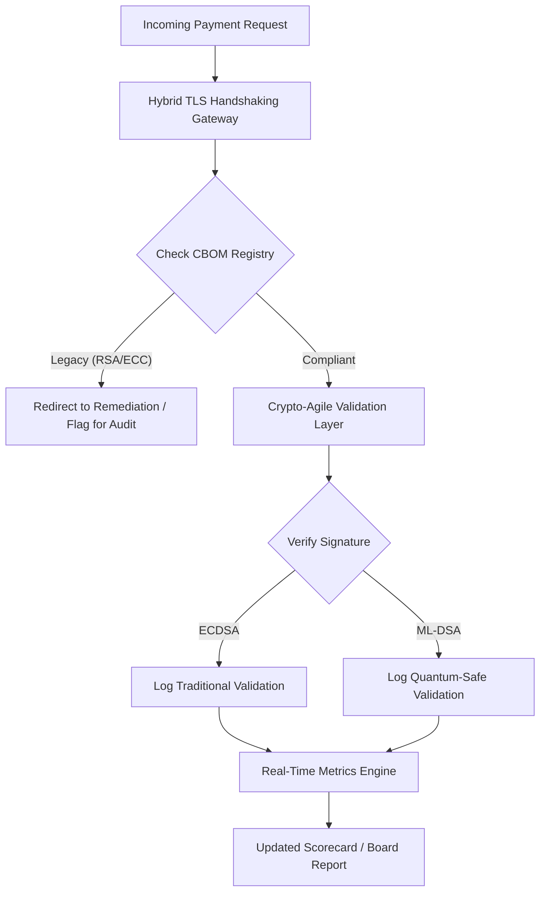

## Kad Skor Keselamatan Pasca-Kuantum 2026: Rangka Kerja Metrik Peringkat Lembaga untuk Ketangkasan Kriptografi Fidusiari

Keselamatan pasca-kuantum bukan lagi sekadar projek penyelidikan. "Jam penyeliaan" sedang berdetik menghampiri tarikh akhir penguatkuasaan penghujung dekad 2020-an. Pemuktamadan [NIST FIPS 203 (ML-KEM)](https://csrc.nist.gov/pubs/fips/203/final) dan [NIST FIPS 204 (ML-DSA)](https://csrc.nist.gov/pubs/fips/204/final) telah mengekodkan piawaian bagi pengkapsulan kunci dan tandatangan digital.

Badan-badan pengawal selia kini menjangkakan bank Peringkat Pertama untuk bergerak melangkaui program perintis. Pada 2026, fokus telah beralih kepada perindustrian piawaian ini. Kegagalan menunjukkan laluan migrasi yang jelas membawa penalti kawal selia yang ketara di bawah [Akta Daya Tahan Operasi Digital (DORA)](https://eur-lex.europa.eu/eli/reg/2022/2554/oj) dan potensi liabiliti peribadi bagi pengarah yang mengabaikan ancaman dekripsi terdaya kuantum yang boleh dijangka.

## 01. Kad Skor Kuantum Peringkat Lembaga

Metrik berikut menyediakan satu rangka kerja piawai untuk lembaga pengarah menilai kesediaan kuantum dan kesihatan kriptografi merentas estet Perbankan Komersial dan Pelaburan (CIB).

### Jadual 1: Metrik dan Toleransi Kad Skor PQC

| Metrik | Formula Matematik | Toleransi Diluluskan Lembaga | Risiko Jika Melebihi Toleransi |
| ---- | ---- | ---- | ---- |
| **Peratusan Kelengkapan Inventori (ICP)** | (Aset Kripto Dikenal Pasti / Jumlah Anggaran Aset) × 100 | > 98% | Penyulitan bayang-bayang dan titik buta dalam laluan data penjelasan bernilai tinggi. |
| **Kadar Pendedahan HNDL (HER)** | (Data Berjangka Panjang atas Kripto Warisan / Jumlah Data Berjangka Panjang) × 100 | < 5% | Kompromi kekal ke atas rahsia perdagangan, lejar hutang berdaulat, dan rekod pembayaran borong. |
| **Kadar Kemajuan Migrasi NIST (MPR)** | (Sistem menjalankan FIPS 203/204 / Jumlah Sistem Kritikal) × 100 | > 60% (menjelang hujung 2026) | Ketidakpatuhan kawal selia dan pengecualian daripada rakan niaga sejajar-G20. |
| **Indeks Kesediaan Ketangkasan Kripto (CARI)** | (Apl dengan Lapisan Kripto Terabstrak / Jumlah Apl Teras) × 100 | > 85% | Hutang teknikal teruk dan ketidakupayaan bertindak balas terhadap penyahgunaan algoritma masa hadapan. |

## 02. Bil Bahan Kriptografi (CBOM)

Metrik ICP ditetapkan garis asasnya melalui **Fasa Penemuan CBOM** yang komprehensif. Ini ialah proses automatik yang mengenal pasti setiap titik akhir kriptografi dalam perusahaan.

- **Penemuan Titik Akhir:** Mengimbas rangkaian dalaman dan awan bagi sesi TLS aktif untuk mengenal pasti penggunaan RSA atau ECC warisan.
- **Inventori Kunci:** Memetakan pasangan kunci awam/peribadi kepada pemilik masing-masing dan memetakan tarikh luput yang tepat.
- **Pemetaan Kebergantungan:** Mengenal pasti pustaka dan API pihak ketiga yang bergantung pada algoritma yang telah dinyahgunakan.

Fasa penemuan ini mencipta satu sumber kebenaran tunggal, membolehkan CISO melaporkan kesihatan kriptografi dengan tahap perincian yang sama seperti prestasi kewangan.

## 03. Menghapuskan Pendedahan HNDL dalam Pembayaran Borong

Pihak lawan sedang aktif menyasarkan pembayaran borong dan pangkalan data korporat berjangka panjang. Serangan "Harvest-Now-Decrypt-Later" (HNDL) ini melibatkan pemintasan dan pengarkiban trafik disulitkan hari ini.

Walaupun komputer kuantum yang relevan secara kriptografi (CRQC) belum wujud hari ini, data yang dipintas sekarang akan terdedah pada masa hadapan. Mengurangkan ini memerlukan migrasi keutamaan tinggi bagi data berjangka panjang (cth., rekod identiti, kontrak bon 30 tahun, dan arkib undang-undang), yang secara langsung mengurangkan metrik HER. Menaik taraf saluran pembayaran kepada penyulitan hibrid PQC-tradisional (menggunakan ML-KEM bersama X25519) menyediakan pertahanan segera terhadap ancaman arkib.

## 04. Mengoperasikan Ketangkasan Kripto melalui Antara Muka yang Direka dengan Baik

Ketangkasan kripto direalisasikan melalui abstraksi kejuruteraan. Pustaka moden seperti [KyberLib](https://sebastienrousseau.com/2026-06-12-kyberlib-post-quantum-banking-migration-standards-code-2026) menunjukkan bagaimana pembangun dapat melaksanakan modul selamat-kuantum tanpa menulis semula keseluruhan tindanan aplikasi.

- **Pembalut Terabstrak:** Aplikasi memanggil fungsi generik `encrypt()` atau `sign()` dan bukannya rutin khusus algoritma.
- **Penukaran Masa Jalan:** Modul asas boleh ditukar daripada ECDSA kepada ML-DSA melalui perubahan konfigurasi dan bukannya penempatan kod yang rumit.

Seni bina ini memastikan bahawa jika sesuatu algoritma PQC tertentu dikompromi pada masa hadapan, organisasi boleh beralih dalam masa jam dan bukannya tahun.

## 05. Aliran Kerja Pengesahan Kemasukan Selamat-Kuantum

Rajah berikut menggambarkan kitaran hayat data yang memasuki perimeter selamat dalam persekitaran perbankan tangkas-kuantum.

## Kesimpulan

Estet kriptografi sesebuah bank Peringkat Pertama bukan lagi kebimbangan CISO. Ia ialah infrastruktur fidusiari. NIST FIPS 203 dan 204 menetapkan algoritma; Perkara 5 DORA menetapkan permukaan akauntabiliti; SM&CR menambatkannya kepada seorang pengurus kanan yang bernama. Kad skor di atas — Kelengkapan Inventori, Pendedahan HNDL, Kemajuan Migrasi, Ketangkasan Kripto — memberikan lembaga empat nombor yang diperlukannya untuk mentadbir estet itu tanpa perlu membaca kod kriptografi.

Nombor yang paling penting ialah Pendedahan HNDL. Setiap rekod disulitkan-warisan yang tersimpan dalam arkib pembayaran borong hari ini akan boleh dibaca pada hari komputer kuantum pertama yang relevan secara kriptografi dihantar. Kiraan detik itu senyap dan tidak simetri: pembela hanya boleh bertindak ke atas data yang mereka pegang, manakala pihak lawan boleh bertindak ke atas data yang telah mereka eksfiltrasi bertahun-tahun lalu. Kontrak bon korporat 30 tahun yang disulitkan dengan RSA-2048 pada 2024 ialah kontrak yang kehilangan jaminan kerahsiaannya pada hari sebuah CRQC mula beroperasi.

[KyberLib](https://sebastienrousseau.com/2026-06-12-kyberlib-post-quantum-banking-migration-standards-code-2026) dan rakan-rakannya mengubah ini daripada penulisan semula platform bertahun-tahun kepada satu perubahan konfigurasi. Tugas lembaga bukanlah menulis kod. Tugas lembaga adalah menuntut agar Indeks Kesediaan Ketangkasan Kripto — bahagian aplikasi teras yang berada di sebalik antara muka kriptografi terabstrak — bergerak melepasi 85 % dalam tempoh dua belas bulan, dan membaca kad skor suku tahunan.
