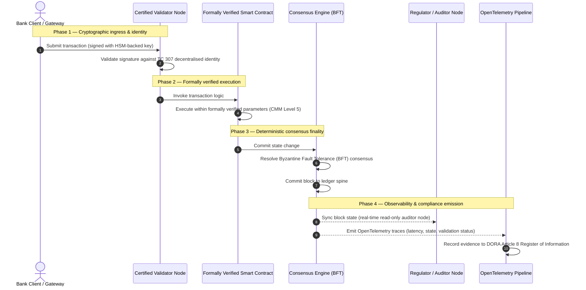

## Daripada Bukti kepada Kebenaran: Mengapa Blockchain Bertauliah Akan Menentukan Era Kepercayaan Perbankan Seterusnya

## Ringkasan Eksekutif & Konteks Strategik (TL;DR)

Perbankan borong dan transaksi global pada 2026 berada di titik infleksi bersejarah. Apabila perkhidmatan kewangan beralih kepada rangkaian penjelasan masa nyata yang bersifat digital secara asli, dan apabila kecerdasan buatan memperkenalkan ketidaktentuan probabilistik, model jaminan analog retrospektif tradisional (seperti audit statik berasaskan entiti) gagal memenuhi tuntutan pengurusan risiko dan fidusiari moden.

Jawatankuasa Teknikal ISO/IEC 307 (TC 307) telah menetapkan garis dasar yang terpiawai untuk teknologi lejar teragih. Namun, penerimaan korporat dan institusi yang sebenar memerlukan peralihan daripada panduan deskriptif kepada jaminan blockchain yang preskriptif dan boleh diperakui secara bebas. Dengan memberi skor kepada tadbir urus lejar, integriti konsensus, keselamatan kontrak pintar, dan ketangkasan kriptografi terhadap Model Kematangan Keupayaan (CMM) 5 tahap yang ketat, bank boleh beralih daripada andaian tampung-menampung khusus vendor kepada kebenaran kewangan yang boleh diperakui dan boleh diaudit oleh lembaga pengarah.

## Intipati Utama

* **Jurang Geseran Fidusiari**: Kita kini boleh memperakui bank (Basel III), awan (ISO 27001), dan sistem tadbir urus AI (ISO 42001), tetapi kita belum lagi mampu memperakui lejar teragih yang semakin menentukan apa yang benar. Asimetri ini merupakan kerentanan operasi yang besar.
* **DORA Menguatkuasakan Tanggungjawab Fidusiari Langsung**: Di bawah Perkara 5 DORA, lembaga pengarah bank menanggung liabiliti peribadi secara langsung dan tidak boleh diwakilkan untuk daya tahan operasi bagi semua penggunaan pihak ketiga dan lejar, dengan penalti peribadi SM&CR yang berat sekiranya berlaku kegagalan.
* **Tulang Belakang Audit AI**: Walaupun pembelajaran mesin memperkenalkan hasil probabilistik yang tidak boleh dihasilkan semula, blockchain bertauliah menyediakan penangkapan keadaan yang deterministik. Merekodkan versi model, input, dan keputusan pengesahan pada rantaian memenuhi piawaian ISO 42001 dan Pengurusan Risiko Model.
* **Indeks Blockchain Bertauliah**: Indeks ini memformalkan tadbir urus, konsensus, kontrak pintar, dan keteramatan menjadi kad skor yang boleh disahkan dan sedia diaudit pada skala CMM 0 hingga 5, menterjemahkan metrik kejuruteraan menjadi Penyata Selera Risiko yang diluluskan oleh lembaga pengarah.

## 01. Jurang Geseran Fidusiari dalam Perbankan Digital

Dalam perbankan klasik, kepercayaan bersifat perhubungan, institusi, dan retrospektif. Ia bergantung kepada juruaudit pihak ketiga yang bebas untuk menyemak keadaan kewangan pada titik masa yang statik, menyelaraskan percanggahan merentasi silo lejar dua hala. Dalam pasaran masa nyata yang dipacu API pada 2026, model ini memperkenalkan kependaman yang melampau dan risiko struktur.

Apabila transaksi diselesaikan serta-merta, kumpulan kecairan intrahari diurus secara dinamik oleh get laluan API, dan pemilikan aset ditokenkan merentasi lejar dikongsi bersama, audit retrospektif menjadi latihan forensik dan bukannya kawalan pencegahan. Fidusiari tidak lagi boleh bergantung semata-mata pada memperakui entiti korporat. Mereka mesti memperakui substrat digital itu sendiri.

Pada masa ini, bank beroperasi di bawah asimetri seni bina yang ketara:

1. **Infrastruktur Awan Bertauliah**: Nod perkakasan, bekas maya, dan pusat data fizikal disahkan terhadap kawalan ISO/IEC 27001 dan SOC 2 Type II.
2. **Proses Pengurusan Bertauliah**: Dasar risiko operasi, pelan kesinambungan perniagaan, dan penggunaan algoritma ditadbir di bawah rangka kerja risiko yang ketat.
3. **Enjin Lejar Tidak Bertauliah**: Mekanisme konsensus teragih teras, rantaian bekalan nod pengesah, sempadan kontrak pintar, dan model tadbir urus rangkaian dibiarkan kepada andaian yang tidak bertauliah, tersuai, atau khusus konsortium.

Asimetri ini merupakan titik kegagalan utama. Sesebuah bank boleh menjalankan aplikasi yang disahkan di dalam bekas awan yang selamat dan bertauliah ISO 27001, tetapi jika bekas itu menulis kepada lejar teragih dengan kawalan pengesah yang terpusat, parameter konsensus yang terdedah, atau kontrak pintar yang tidak diaudit, integriti transaksi tergugat. Untuk merapatkan jurang ini, enjin lejar itu sendiri mesti menjadi objek jaminan yang boleh diperakui.

## 02. Garis Dasar Pempiawaian ISO/IEC TC 307

Kerja asas yang diperlukan untuk mempiawaikan lejar teragih sedang ditetapkan oleh Jawatankuasa Teknikal ISO/IEC 307 (TC 307) (Blockchain dan teknologi lejar teragih). Daripada menganggap blockchain sebagai protokol teknikal yang terpencil, TC 307 menanganinya sebagai infrastruktur kepercayaan institusi, menyusun kerjanya merentasi lima tonggak teras:

1. **Taksonomi dan Perbendaharaan Kata (ISO 22739)**: Menetapkan tatanama yang sama, memastikan definisi undang-undang dan operasi yang konsisten merentasi bidang kuasa, skim kewangan, dan institusi yang berbeza.
2. **Seni Bina Rujukan (ISO/TR 23245)**: Mentakrifkan sempadan, lapisan, aliran data, dan komponen fungsi bagi sistem lejar teragih yang patuh.
3. **Keselamatan, Privasi, dan Kontrak Pintar (ISO/TR 23244 / ISO 23613)**: Menetapkan garis panduan keselamatan asas untuk sistem aset digital dan memperincikan amalan terbaik untuk mitigasi kerentanan kontrak pintar serta tadbir urus kitaran hayat.
4. **Rangka Kerja Kesalingoperasian**: Menangani mekanisme pertukaran data dan aset antara rangkaian lejar heterogen, mencegah pembentukan silo bertoken yang terpencil.
5. **Identiti Ternyahpusat dan Tambatan Kepercayaan**: Menyepadukan pengecam kriptografi berasaskan lejar dengan infrastruktur kunci awam (PKI) rasmi dan pendaftaran yang dibenarkan oleh negara.

Secara kolektif, TC 307 menandakan peralihan DLT daripada pilihan kejuruteraan tersuai kepada disiplin seni bina yang terpiawai. Namun, TC 307 kekal terutamanya deskriptif. Ia mentakrifkan rupa yang baik (panduan), tetapi ia tidak menyediakan protokol pengesahan preskriptif (jaminan) yang diperlukan oleh pegawai risiko dan penyelia untuk membenarkan penggunaan produksi bagi fungsi kritikal atau penting (CIF).

## 03. Panduan lwn. Jaminan: Perbezaan Fidusiari

Peserta pasaran kewangan tidak menggunakan teknologi kerana ia inovatif atau anggun; mereka menggunakannya apabila ia boleh ditadbir, diaudit, dipertahankan, dan diselaraskan dengan keperluan rizab modal. Inilah sebabnya pempiawaian dalam perbankan secara semula jadi terbahagi kepada dua lapisan:

* **Panduan (Rangka Kerja)**: Menggariskan amalan terbaik, sasaran rujukan, dan garis panduan seni bina (cth., ISO/IEC TC 307, rangka kerja NIST).
* **Jaminan (Bukti)**: Menyediakan bukti bebas, berterusan, dan boleh disahkan oleh pihak ketiga bahawa rangka kerja itu dilaksanakan dan beroperasi seperti yang direka (cth., pensijilan ISO 27001, audit SOC 2, pemeriksaan kawal selia).

Bergantung kepada konsensus lejar yang tidak bertauliah sambil memperakui infrastruktur awan merupakan jurang kawal selia yang kritikal. Blockchain yang "tidak boleh diubah" tidak semestinya "dipercayai secara institusi." Kebolehubahan hanya menjamin bahawa data yang dimasukkan tidak berubah; ia tidak mengesahkan bahawa nod pengesah selamat, protokol konsensus tahan terhadap pakatan sulit, logik kontrak pintar mantap secara matematik, atau pengurusan kunci kriptografi mematuhi mandat pasca-kuantum.

Untuk merapatkan jurang ini, Indeks Blockchain Bertauliah 2026 memformalkan keperluan ini menjadi Model Kematangan Keupayaan (CMM) yang boleh dikuantifikasi dan dipetakan kepada peraturan perbankan global.

## 04. Indeks Blockchain Bertauliah 2026

Untuk membolehkan pengurusan kanan menilai dan memperakui platform lejar mereka, indeks ini menstrukturkan infrastruktur lejar teragih kepada lima lapisan operasi yang boleh diaudit, diberi skor pada skala CMM 0 hingga 5.

## Jadual 1: Seni Bina Indeks Blockchain Bertauliah

| Lapisan Indeks | Tahap Kematangan Keupayaan (CMM) | Metrik Teknikal dan Operasi | Rujukan Kawalan Kawal Selia / Fidusiari |
| ---- | ---- | ---- | ---- |
| **Tadbir Urus Lejar** | **Tahap 0**: Konsortium ad-hoc**Tahap 3**: Penyaringan & putaran pengesah automatik**Tahap 5**: Penambatan identiti kriptografi berbilang pihak yang ternyahpusat | % nod pengesah yang dikendalikan oleh entiti kewangan yang disaring; masa purata untuk menyelesaikan pertikaian pengesah; taburan geografi nod | **DORA Perkara 5** (Tadbir Urus dan Organisasi); **CPMI-IOSCO PFMI Prinsip 2** (Tadbir Urus) & **Prinsip 3** (Rangka kerja bagi pengurusan risiko yang komprehensif) |
| **Integriti Konsensus** | **Tahap 0**: Nod tunggal atau POW legap**Tahap 3**: BFT teraudit dengan kemuktamadan deterministik**Tahap 5**: Konsensus berbilang bidang kuasa yang disahkan secara formal dengan pemantauan kependaman berterusan | Kependaman konsensus maksimum yang boleh diterima; ambang rintangan pakatan sulit; SLA masa berfungsi di bawah pembahagian nod yang disimulasikan | **DORA Perkara 6** (Rangka Kerja Pengurusan Risiko ICT); **CPMI-IOSCO PFMI Prinsip 8** (Kemuktamadan Penyelesaian) |
| **Identiti & Kriptografi** | **Tahap 0**: Kunci RSA / ECDSA yang lemah**Tahap 3**: Berbilang tandatangan dengan pengurusan kunci disokong HSM**Tahap 5**: Kunci hibrid selamat-kuantum (FIPS 203 ML-KEM) dan get privasi bukti tanpa pengetahuan | % transaksi lejar yang ditandatangani dengan kunci disokong HSM; skor kesediaan migrasi NIST PQC; kependaman bukti ZK | **NIST FIPS 203 / 204**; **ISO/IEC 27001** (Pengurusan Keselamatan Maklumat) |
| **Jaminan Kontrak Pintar** | **Tahap 0**: Skrip solidity tidak diaudit**Tahap 3**: Pengesahan pengkompil automatik & audit luaran**Tahap 5**: Kontrak pintar tidak boleh diubah yang disahkan secara formal dengan naik taraf pemutus litar | % kontrak pintar dengan pengesahan formal matematik; bilangan amaran pengkompil; liputan imbasan kerentanan | **Garis Panduan EBA mengenai Pengaturan Penyumberan Luar** (Perenggan 81, 113-117); **DORA Perkara 30** (Klausa Kontrak Minimum) |
| **Audit & Keteramatan** | **Tahap 0**: Pengikisan log manual**Tahap 3**: Jejak OTel berstruktur & nod juruaudit baca-sahaja**Tahap 5**: Penyelarasan automatik dan berterusan kepada daftar Perkara 8 | % transaksi yang dilindungi oleh jejak OpenTelemetry; kependaman daripada komit blok lejar kepada penyegerakan nod juruaudit | **BCBS 239** (Pengagregatan Data Risiko); **DORA Perkara 8** (Daftar Maklumat / Skema ITS) |

## Jadual 2: Isyarat Kepercayaan Utama Dipetakan kepada Piawaian Perbankan Global

| Isyarat / Penanda Aras | Metrik | Kesan terhadap Platform Perbankan | Sumber Kawal Selia |
| ---- | ---- | ---- | ---- |
| **Kemajuan ISO/IEC TC 307** | Peralihan daripada laporan teknikal ISO/TR kepada skim pensijilan rasmi | Menetapkan rangka kerja terpiawai pertama untuk memperakui enjin lejar teragih | **ISO/IEC JTC 1 / SC 44** (Teknologi Lejar Teragih) |
| **Fasa Prototaip Projek Agorá** | 40+ bank komersial yang mengambil bahagian; pengujian lejar bersatu bagi deposit bertoken | Mengalihkan penjelasan rentas sempadan daripada pemesejan (SWIFT) kepada penyelesaian bertoken atomik | **Hab Inovasi Bank untuk Penyelesaian Antarabangsa (BIS)** |
| **Audit Pihak Ketiga DORA Perkara 30** | 100% pembekal nod dan hos infrastruktur diaudit terhadap kriteria keselamatan | Menghapuskan "nod pengesah bayangan"; mewajibkan ketelusan rantaian bekalan sepenuhnya | **Pihak Berkuasa Penyeliaan Eropah (ESA)** |
| **ISO/IEC 42001 (Tadbir Urus AI)** | Model AI dan log latihan yang dijadikan tidak boleh diubah secara kriptografi pada rantaian | Menggunakan blockchain sebagai lejar bukti yang tidak boleh diubah ("tulang belakang audit") untuk pembelajaran mesin | **ISO/IEC 42001:2023** (Teknologi maklumat — Kecerdasan buatan) |
| **Kecukupan Modal Basel III** | Pengurangan penimbal modal risiko operasi berdasarkan pengurangan kerumitan yang didokumentasikan | Rangka kerja risiko operasi terpiawai secara langsung mengiktiraf daya tahan lejar yang disahkan | **Jawatankuasa Basel mengenai Penyeliaan Perbankan (BCBS)** |

## 05. "Tulang Belakang Audit" AI: Kecerdasan Probabilistik pada Infrastruktur Deterministik

Salah satu peranan strategik paling berkuasa bagi blockchain bertauliah pada 2026 ialah bertindak sebagai **"Tulang Belakang Audit"** untuk penggunaan kecerdasan buatan. Sistem kewangan moden semakin bersifat probabilistik. Pemarkahan kredit, pengesanan penipuan masa nyata, perdagangan algoritma, dan interaksi pelanggan autonomi dipacu oleh model pembelajaran mesin yang berkembang, hanyut, dan menyesuaikan diri dari semasa ke semasa. Model ini bersifat tidak deterministik: dengan input yang sama pada dua masa berbeza, ia mungkin menghasilkan output yang berbeza disebabkan pemberat dinamik dan latihan berterusan.

Ketidaktentuan ini memperkenalkan cabaran tadbir urus yang mendalam di bawah piawaian **ISO/IEC 42001 (Tadbir Urus AI)** dan **Pengurusan Risiko Model (MRM)** (seperti **SR 11-7** Rizab Persekutuan AS dan **SS1/23** PRA UK): *Bagaimanakah anda mengaudit, menjelaskan, dan mempertahankan keputusan yang tidak boleh dihasilkan semula secara tepat?*

Lejar teragih bertauliah menyediakan penyeimbang deterministik. Sementara model AI beroperasi secara probabilistik, blockchain bertauliah merekodkan parameternya secara deterministik, mewujudkan tulang belakang bukti yang tidak boleh diubah:

* **Pemberian Versi Model dan Penambatan Pemberat**: Setiap versi model yang digunakan, pemberat berkaitannya, dan hasil semak data latihannya di-hash dan ditulis ke lejar pada masa pembinaan, memenuhi keperluan rantaian bekalan **SLSA Tahap 3**.
* **Pengelogan Input Kontekstual**: Apabila model AI melaksanakan keputusan kritikal (cth., meluluskan pinjaman atau menandakan transaksi), input kontekstual yang tepat dan hash model ditulis ke lejar, mewujudkan sejarah yang menunjukkan bukti gangguan.
* **Kebolehauditan tanpa Akses Kod**: Jika pengawal selia bertanya, "Mengapa model anda menolak permohonan kredit ini pada 3 Jun?" bank tidak perlu mendedahkan kod proprietari atau cuba mencipta semula keadaan model yang tepat. Ia mengemukakan rekod lejar pada rantaian yang ditandatangani secara kriptografi bagi input, pemberat, dan keadaan pengesahan.

Dengan menambatkan keputusan probabilistik model pembelajaran mesin kepada konsensus deterministik blockchain bertauliah, institusi mewujudkan garis masa tindakan automatik yang boleh dipertahankan, boleh dibina semula, dan boleh disahkan secara bebas.

## 06. Menggambarkan Saluran Paip Konsensus-ke-Audit Bertauliah

Rajah jujukan berikut menggambarkan kitaran hayat transaksi yang melalui platform blockchain bertauliah, menunjukkan bagaimana get pengesahan, integriti konsensus, pelaksanaan kontrak pintar, dan pancaran telemetri saling berkait untuk menghasilkan bukti kawal selia yang sedia untuk lembaga pengarah:

Laluan kritikal bagi jujukan transaksi ini menghendaki setiap langkah pengesahan, pelaksanaan, dan konsensus ditandatangani secara kriptografi, memastikan asal-usul hujung-ke-hujung. Nod juruaudit pengawal selia menyegerakkan keadaan blok secara masa nyata, menghapuskan keperluan untuk penyelarasan kewangan manual yang retrospektif.

## 07. Buku Panduan Bilik Lembaga Pengarah untuk Pengurus Kanan

Untuk berjaya menavigasi peralihan daripada kepercayaan organisasi kepada kepercayaan infrastruktur, eksekutif bank dan pengurus kanan harus segera melaksanakan empat arahan utama:

1. **Wajibkan Audit Lejar dalam Pengurusan Risiko Perusahaan (ERM)**: Kuatkuasakan dasar bahawa tiada platform lejar teragih—sama ada persendirian, awam, atau berasaskan konsortium—boleh digunakan untuk fungsi kritikal atau penting (CIF) melainkan ia telah diaudit terhadap **Seni Bina Indeks Blockchain Bertauliah** 5 lapisan (minimum CMM Tahap 3).
2. **Sepadukan Blockchain sebagai Tulang Belakang Bukti AI ISO 42001**: Arahkan Ketua Pegawai Risiko dan Ketua Arkitek AI untuk menyepadukan semua model pembelajaran mesin berimpak tinggi dengan blockchain bertauliah, mewujudkan lejar audit yang menunjukkan bukti gangguan bagi versi, pemberat, input, dan keputusan model.
3. **Audit Rantaian Bekalan Nod Pengesah (DORA Perkara 30)**: Kehendaki bahagian perolehan untuk mengaudit semua entiti pihak ketiga yang mengehos nod pengesah atau mengurus pengehosan awan untuk rangkaian DLT, mewajibkan pematuhan kepada piawaian keselamatan siber dan daya tahan operasi yang sama seperti yang digunakan pada nod awan dalaman bank.
4. **Selaraskan Seni Bina Lejar dengan CPMI-IOSCO dan BCBS 239**: Arahkan pasukan kejuruteraan platform untuk menyelaraskan telemetri output lejar secara langsung dengan keperluan pelaporan data **BCBS 239**, dan pastikan parameter konsensus serta kemuktamadan penyelesaian mematuhi **CPMI-IOSCO Prinsip 8 dan 9** dengan ketat.

## 08. Soalan Lazim

**Adakah ISO/IEC TC 307 merupakan piawaian pensijilan?**
Tidak. ISO/IEC TC 307 ialah jawatankuasa teknikal yang menetapkan perbendaharaan kata, seni bina rujukan, dan garis panduan keselamatan. Walaupun ia mentakrifkan "rupa yang baik" (panduan), industri mesti mengoperasikan dokumen ini menjadi skim pensijilan rasmi yang boleh diaudit (jaminan) untuk memenuhi penyelia perbankan.

**Bagaimanakah blockchain bertauliah menyokong pematuhan DORA?**
Di bawah Perkara 5 DORA, lembaga pengarah bank menanggung liabiliti peribadi secara langsung untuk daya tahan teknologi. Blockchain bertauliah menyediakan bukti kriptografi yang boleh disahkan bagi integriti konsensus, kawalan rantaian bekalan pengesah, dan keselamatan kontrak pintar, memberikan ahli lembaga pengarah "langkah munasabah" yang boleh didokumentasikan untuk mempertahankan diri daripada tuntutan liabiliti peribadi SM&CR.

Apakah perbezaan antara audit lejar tradisional dan audit blockchain bertauliah?
Audit tradisional bersifat retrospektif, mengesahkan catatan manual dan fail statik selepas transaksi diselesaikan. Audit blockchain bertauliah bersifat berterusan dan masa nyata; nod pengesah, enjin konsensus BFT, dan kontrak pintar yang disahkan secara formal diperakui untuk melaksanakan transaksi secara deterministik, memancarkan telemetri berstruktur (OpenTelemetry) yang secara berterusan mengesahkan kesihatan sistem.

Bolehkah blockchain awam diperakui untuk kegunaan perbankan?
Dalam kebanyakan bidang kuasa, blockchain awam tanpa kebenaran yang tulen gagal memenuhi peraturan perbankan disebabkan ketiadaan pengesahan identiti pengesah, kos gas/transaksi yang tidak dapat diramal, dan kemuktamadan yang tidak deterministik (cth., cabang proof-of-work/stake probabilistik). Blockchain bertauliah dalam perbankan biasanya menggunakan seni bina perusahaan berkebenaran atau hibrid-awam yang dikawal ketat di mana pengendali nod pengesah ialah entiti kewangan yang dikenal pasti dan diaudit.

## 09. Rujukan

* Jawatankuasa Basel mengenai Penyeliaan Perbankan (BCBS), 2013. *Principles for effective risk data aggregation and reporting (BCBS 239)*. Basel: Bank for International Settlements. Tersedia di: [https://www.bis.org/publ/bcbs239.pdf](https://www.bis.org/publ/bcbs239.pdf).
* Jawatankuasa mengenai Pembayaran dan Infrastruktur Pasaran dan Jawatankuasa Teknikal Pertubuhan Antarabangsa Suruhanjaya Sekuriti (CPMI-IOSCO), 2012. *Principles for financial market infrastructures*. Basel: Bank for International Settlements. Tersedia di: [https://www.bis.org/cpmi/publ/d101a.pdf](https://www.bis.org/cpmi/publ/d101a.pdf).
* Pihak Berkuasa Perbankan Eropah (EBA), 2019. *EBA/GL/2019/02 — Guidelines on outsourcing arrangements*. Paris: EBA. Tersedia di: [https://www.eba.europa.eu/regulation-and-policy/internal-governance/guidelines-on-outsourcing-arrangements](https://www.eba.europa.eu/regulation-and-policy/internal-governance/guidelines-on-outsourcing-arrangements).
* Parlimen Eropah dan Majlis Kesatuan Eropah, 2022. *Regulation (EU) 2022/2554 on digital operational resilience for the financial sector (DORA)*. Brussels: Official Journal of the European Union. Tersedia di: [https://eur-lex.europa.eu/legal-content/EN/TXT/?uri=CELEX%3A32022R2554](https://eur-lex.europa.eu/legal-content/EN/TXT/?uri=CELEX%3A32022R2554).
* ISO/IEC JTC 1/SC 42, 2023. *ISO/IEC 42001:2023 — Information technology — Artificial intelligence — Management system*. Geneva: International Organization for Standardization. Tersedia di: [https://www.iso.org/standard/81230.html](https://www.iso.org/standard/81230.html).
* Jawatankuasa Teknikal ISO/IEC 307, 2020. *ISO/IEC 22739:2020 — Blockchain and distributed ledger technologies — Vocabulary*. Geneva: International Organization for Standardization. Tersedia di: [https://www.iso.org/standard/73771.html](https://www.iso.org/standard/73771.html).
* Institut Piawaian dan Teknologi Kebangsaan (NIST), 2026. *First Three Finalized Post-Quantum Encryption Standards (FIPS 203, 204, and 205)*. Gaithersburg: U.S. Department of Commerce. Tersedia di: [https://www.nist.gov/news-events/news/2024/08/nist-releases-first-3-finalized-post-quantum-encryption-standards](https://www.nist.gov/news-events/news/2024/08/nist-releases-first-3-finalized-post-quantum-encryption-standards).
