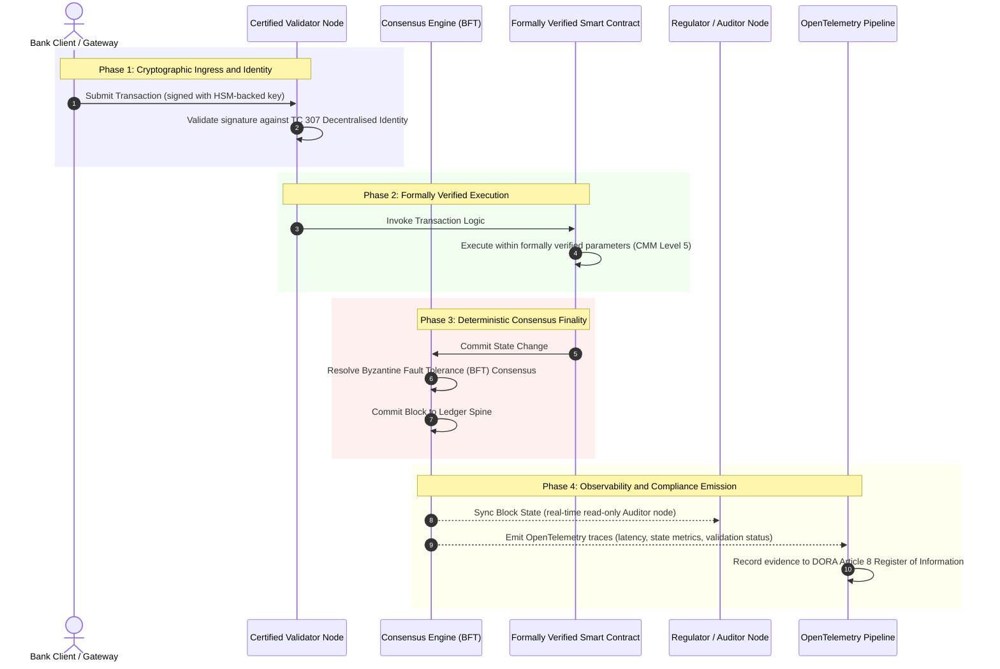

# Daripada Bukti kepada Kebenaran: Mengapa Blockchain Diperakui Akan Menentukan Era Baharu Kepercayaan Perbankan

**Tidak boleh diubah tidak sama dengan dipercayai.** Apabila perbankan borong beralih kepada penyelesaian masa nyata dan AI kebarangkalian, lejar yang menentukan apa yang benar telah menjadi satu-satunya lapisan yang masih tidak dapat diperakui oleh bank. Mereka memperakui entiti di bawah Basel III, awan di bawah ISO 27001 dan AI mereka di bawah ISO 42001, tetapi lejar teragih, tadbir urusnya, konsensus, kriptografi dan kontrak pintarnya, dibiarkan kepada andaian khusus vendor. Laporan ini berhujah bahawa menutup jurang fidusiari itu memerlukan peralihan daripada panduan ISO/IEC TC 307 kepada jaminan preskriptif: menilai lejar terhadap Indeks Blockchain Diperakui 5 tahap yang mengubah metrik kejuruteraan menjadi kebenaran yang boleh diaudit lembaga dan boleh dipertahankan di bawah DORA.

<!-- lead-start -->
<aside class="post-lead" aria-label="Ringkasan artikel">

<strong>TL;DR.</strong> Bank memperakui entiti, awan dan AI mereka, tetapi bukan lejar yang semakin menentukan apa yang benar. ISO/IEC TC 307 memberi panduan, bukan jaminan. Indeks Blockchain Diperakui 5 tahap menilai tadbir urus lejar, integriti konsensus, identiti dan kriptografi, jaminan kontrak pintar dan kebolehcerapan terhadap Capability Maturity Model, menutup jurang fidusiari dan memberi AI kebarangkalian tulang belakang audit berketentuan.

<strong>Perkara utama</strong>

<ul class="post-lead-takeaways">
  <li><strong>Jurang geseran fidusiari.</strong> Bank (Basel III), awan (ISO 27001) dan sistem tadbir urus AI (ISO 42001) boleh diperakui; lejar teragih yang menentukan apa yang benar belum boleh diperakui lagi. Ketidaksimetrian itu ialah kerentanan operasi yang aktif.</li>
  <li><strong>DORA menjadikannya peribadi.</strong> Di bawah DORA Article 5, lembaga bank memikul liabiliti langsung yang tidak boleh diwakilkan bagi daya tahan penggunaan pihak ketiga dan lejar, dengan penalti peribadi SM&amp;CR bagi kegagalan.</li>
  <li><strong>Tulang belakang audit AI.</strong> Pembelajaran mesin tidak boleh dihasilkan semula; blockchain diperakui menangkap versi model, input dan keputusan pengesahan secara berketentuan di atas rantai, memenuhi ISO 42001 dan piawaian pengurusan risiko model.</li>
  <li><strong>Indeks Blockchain Diperakui.</strong> Tadbir urus, konsensus, kriptografi, kontrak pintar dan kebolehcerapan menjadi kad skor CMM 0 hingga 5 yang menterjemah metrik kejuruteraan kepada Penyata Selera Risiko yang diluluskan lembaga.</li>
</ul>

<strong>Bacaan berkaitan:</strong> <a href="https://sebastienrousseau.com/2026-07-02-certified-blockchains-banking-trust-tc307-assurance-2026">Blockchain Diperakui dan Kepercayaan Perbankan: Jaminan TC 307</a>, <a href="https://sebastienrousseau.com/2026-07-24-global-payments-outlook-operating-model-risk-revenue">Tinjauan Pembayaran Global 2026</a>.

</aside>
<!-- lead-end -->

> **Ringkasan Eksekutif**
>
> - **Perbankan borong berada pada titik infleksi.** Penjelasan masa nyata dan AI kebarangkalian mematahkan model jaminan analog dan retrospektif: audit statik berasaskan entiti tidak lagi memenuhi tuntutan pengurusan risiko atau fidusiari moden.
> - **TC 307 ialah asas, bukan sijil.** ISO/IEC TC 307 telah menstandardkan perbendaharaan kata, seni bina rujukan dan panduan keselamatan bagi lejar teragih, tetapi ia bersifat deskriptif. Ia mentakrifkan rupa yang baik; ia tidak menyediakan pengesahan preskriptif yang diperlukan oleh pegawai risiko dan penyelia untuk membenarkan penggunaan pengeluaran.
> - **Jaminan bermaksud menilai lejar.** Tadbir urus, integriti konsensus, keselamatan kontrak pintar dan ketangkasan kriptografi, dinilai terhadap Capability Maturity Model 5 tahap yang ketat, menggerakkan bank daripada andaian khusus vendor yang bertampal-tampal kepada kebenaran kewangan yang boleh diperakui dan boleh diaudit lembaga.
> - **Lejar ialah tulang belakang audit untuk AI.** Menambat versi model, input dan keputusan pengesahan kepada konsensus berketentuan memberi pembelajaran mesin yang tidak boleh dihasilkan semula suatu rekod keterangan yang boleh dipertahankan dan boleh dibina semula di bawah ISO 42001, SR 11-7 dan PRA SS1/23.

## Jurang Geseran Fidusiari dalam Perbankan Digital

Dalam perbankan klasik, kepercayaan bersifat perhubungan, institusi dan retrospektif. Ia bergantung pada juruaudit pihak ketiga yang bebas mengkaji keadaan kewangan pada titik masa yang statik, menyelaraskan percanggahan merentas silo lejar dua hala. Dalam pasaran masa nyata yang dipacu API pada 2026, model ini memperkenalkan kelewatan yang melampau dan risiko struktur.

Apabila transaksi diselesaikan serta-merta, kumpulan kecairan intrahari diurus secara dinamik oleh get laluan API, dan pemilikan aset ditokenkan merentas lejar berkongsi, audit retrospektif menjadi latihan forensik dan bukannya kawalan pencegahan. Fidusiari tidak lagi boleh bergantung semata-mata pada memperakui entiti korporat. Mereka mesti memperakui substrat digital itu sendiri.

Pada masa ini, bank beroperasi di bawah ketidaksimetrian seni bina yang ketara:

1. **Infrastruktur Awan Diperakui**: Nod perkakasan, bekas maya dan pusat data fizikal disahkan terhadap kawalan ISO/IEC 27001 dan SOC 2 Type II.  
2. **Proses Pengurusan Diperakui**: Dasar risiko operasi, pelan kesinambungan perniagaan dan penggunaan algoritma ditadbir di bawah rangka kerja risiko yang ketat.  
3. **Enjin Lejar Tidak Diperakui**: Mekanisme konsensus teragih teras, rantaian bekalan nod pengesah, sempadan kontrak pintar dan model tadbir urus rangkaian dibiarkan kepada andaian tidak diperakui, tersuai atau khusus konsortium.

Ketidaksimetrian ini merupakan titik kegagalan utama. Sebuah bank boleh menjalankan aplikasi yang disahkan di dalam bekas awan yang selamat dan diperakui ISO 27001, tetapi jika bekas itu menulis kepada lejar teragih dengan kawalan pengesah berpusat, parameter konsensus yang terdedah, atau kontrak pintar yang tidak diaudit, integriti transaksi terjejas. Untuk merapatkan jurang ini, enjin lejar itu sendiri mesti menjadi objek jaminan yang boleh diperakui.

## Asas Penstandardan ISO/IEC TC 307

Kerja asas yang diperlukan untuk menstandardkan lejar teragih sedang ditubuhkan oleh Jawatankuasa Teknikal ISO/IEC 307 (TC 307\) (Blockchain dan teknologi lejar teragih). Daripada menganggap blockchain sebagai protokol teknikal yang terpencil, TC 307 menanganinya sebagai infrastruktur kepercayaan institusi, menyusun kerjanya merentas lima tonggak teras:

1. **Taksonomi dan Perbendaharaan Kata (ISO 22739\)**: Menubuhkan tatanama sepunya, memastikan definisi undang-undang dan operasi yang konsisten merentas bidang kuasa, skim kewangan dan institusi yang berbeza.  
2. **Seni Bina Rujukan (ISO/TR 23245\)**: Mentakrifkan sempadan, lapisan, aliran data dan komponen berfungsi sistem lejar teragih yang patuh.  
3. **Keselamatan, Privasi dan Kontrak Pintar (ISO/TR 23244 / ISO 23613\)**: Menubuhkan garis panduan keselamatan asas bagi sistem aset digital dan memperincikan amalan terbaik untuk mitigasi kerentanan kontrak pintar dan tadbir urus kitaran hayat.  
4. **Rangka Kerja Kesalingoperasian**: Menangani mekanisme pertukaran data dan aset antara rangkaian lejar heterogen, mencegah pembentukan silo bertoken yang terpencil.  
5. **Identiti Ternyahpusat dan Sauh Kepercayaan**: Mengintegrasikan pengecam kriptografi berasaskan lejar dengan infrastruktur kunci awam (PKI) formal dan pendaftaran yang dibenarkan negara.

Secara kolektif, TC 307 menandakan peralihan DLT daripada pilihan kejuruteraan tersuai kepada disiplin seni bina yang distandardkan. Namun, TC 307 kekal terutamanya deskriptif. Ia mentakrifkan rupa yang baik (panduan), tetapi ia tidak menyediakan protokol pengesahan preskriptif (jaminan) yang diperlukan oleh pegawai risiko dan penyelia untuk membenarkan penggunaan pengeluaran fungsi kritikal atau penting (CIFs).

## Panduan lwn. Jaminan: Perbezaan Fidusiari

Peserta pasaran kewangan tidak menggunakan teknologi kerana ia inovatif atau elegan; mereka menggunakannya apabila ia boleh ditadbir, diaudit, dipertahankan dan diselaraskan dengan keperluan rizab modal. Inilah sebabnya penstandardan dalam perbankan secara semula jadi terurai kepada dua lapisan:

* **Panduan (Rangka Kerja)**: Menggariskan amalan terbaik, sasaran rujukan dan garis panduan seni bina (cth., ISO/IEC TC 307, rangka kerja NIST).  
* **Jaminan (Bukti)**: Menyediakan bukti bebas, berterusan dan boleh disahkan pihak ketiga bahawa rangka kerja itu dilaksanakan dan beroperasi seperti yang direka (cth., pensijilan ISO 27001, audit SOC 2, pemeriksaan kawal selia).

Bergantung pada konsensus lejar tidak diperakui sambil memperakui infrastruktur awan ialah jurang kawal selia yang kritikal. Blockchain yang "tidak boleh diubah" tidak semestinya "dipercayai institusi." Ketakbolehubahan hanya menjamin bahawa data yang dimasukkan tidak berubah; ia tidak mengesahkan bahawa nod pengesah selamat, protokol konsensus tahan terhadap pakatan sulit, logik kontrak pintar wajar secara matematik, atau pengurusan kunci kriptografi mematuhi mandat pasca-kuantum.

Untuk menutup jurang ini, Indeks Blockchain Diperakui 2026 memformalkan keperluan ini menjadi Capability Maturity Model (CMM) yang boleh dikuantifikasi yang dipetakan kepada peraturan perbankan global.

## Indeks Blockchain Diperakui 2026

Untuk membolehkan pengurusan kanan menilai dan memperakui platform lejar mereka, indeks ini menstrukturkan infrastruktur lejar teragih kepada lima lapisan operasi yang boleh diaudit, dinilai pada skala CMM 0 hingga 5.

### Jadual 1: Seni Bina Indeks Blockchain Diperakui

| Lapisan Indeks | Tahap Kematangan Keupayaan (CMM) | Metrik Teknikal dan Operasi | Rujukan Kawalan Kawal Selia / Fidusiari |
| ---- | ---- | ---- | ---- |
| **Tadbir Urus Lejar** | **Tahap 0**: Konsortium ad-hoc**Tahap 3**: Penyaringan & putaran pengesah automatik**Tahap 5**: Penambatan identiti kriptografi berbilang pihak ternyahpusat | % nod pengesah yang dikendalikan oleh entiti kewangan yang disaring; masa purata menyelesaikan pertikaian pengesah; taburan geografi nod | **DORA Article 5** (Tadbir Urus dan Organisasi); **CPMI-IOSCO PFMI Principle 2** (Tadbir Urus) & **Principle 3** (Rangka kerja untuk pengurusan risiko yang menyeluruh) |
| **Integriti Konsensus** | **Tahap 0**: Nod tunggal atau POW legap**Tahap 3**: BFT diaudit dengan kemuktamadan berketentuan**Tahap 5**: Konsensus disahkan secara formal berbilang bidang kuasa dengan pemantauan kependaman berterusan | Kependaman konsensus maksimum yang boleh ditoleransi; ambang rintangan pakatan sulit; SLA masa beroperasi di bawah partition nod simulasi | **DORA Article 6** (Rangka Kerja Pengurusan Risiko ICT); **CPMI-IOSCO PFMI Principle 8** (Kemuktamadan Penyelesaian) |
| **Identiti & Kriptografi** | **Tahap 0**: Kunci RSA / ECDSA lemah**Tahap 3**: Berbilang tandatangan dengan pengurusan kunci disokong HSM**Tahap 5**: Kunci hibrid selamat kuantum (FIPS 203 ML-KEM) dan get privasi tanpa pengetahuan | % transaksi lejar yang ditandatangani dengan kunci disokong HSM; skor kesediaan migrasi PQC; kependaman bukti ZK | **NIST FIPS 203 / 204**; **ISO/IEC 27001** (Pengurusan Keselamatan Maklumat) |
| **Jaminan Kontrak Pintar** | **Tahap 0**: Skrip solidity tidak diaudit**Tahap 3**: Pengesahan pengkompil automatik & audit luaran**Tahap 5**: Kontrak pintar tidak boleh diubah yang disahkan secara formal dengan naik taraf pemutus litar | % kontrak pintar dengan pengesahan formal matematik; bilangan amaran pengkompil; liputan imbasan kerentanan | **EBA Guidelines on Outsourcing Arrangements** (Perenggan 81, 113-117); **DORA Article 30** (Klausa Kontraktual Minimum) |
| **Audit & Kebolehcerapan** | **Tahap 0**: Pengikisan log manual**Tahap 3**: Jejak OTel berstruktur & nod juruaudit baca sahaja**Tahap 5**: Penyelarasan automatik dan berterusan kepada daftar Article 8 | % transaksi yang diliputi jejak OpenTelemetry; kependaman dari komit blok lejar ke penyegerakan nod juruaudit | **BCBS 239** (Pengagregatan Data Risiko); **DORA Article 8** (Daftar Maklumat / Skema ITS) |

### Jadual 2: Isyarat Kepercayaan Utama Dipetakan kepada Piawaian Perbankan Global

| Isyarat / Penanda Aras | Metrik | Kesan pada Platform Perbankan | Sumber Kawal Selia |
| ---- | ---- | ---- | ---- |
| **Kemajuan ISO/IEC TC 307** | Peralihan daripada laporan teknikal ISO/TR kepada skim pensijilan formal | Menubuhkan rangka kerja distandardkan pertama untuk memperakui enjin lejar teragih | **ISO/IEC JTC 1 / SC 44** (Distributed Ledger Technologies) |
| **Fasa Prototaip Project Agorá** | 40+ bank komersial yang mengambil bahagian; ujian lejar bersatu deposit bertoken | Mengalihkan penjelasan rentas sempadan daripada pemesejan (SWIFT) kepada penyelesaian bertoken atomik | **Bank for International Settlements (BIS) Innovation Hub** |
| **Audit Pihak Ketiga DORA Article 30** | 100% penyedia nod dan hos infrastruktur diaudit terhadap kriteria keselamatan | Menghapuskan "nod pengesah bayang"; mewajibkan ketelusan rantaian bekalan sepenuhnya | **European Supervisory Authorities (ESA)** |
| **ISO/IEC 42001 (Tadbir Urus AI)** | Log model dan latihan AI dikriptografikan tidak boleh diubah di atas rantai | Menggunakan blockchain sebagai lejar keterangan tidak boleh diubah ("tulang belakang audit") untuk pembelajaran mesin | **ISO/IEC 42001:2023** (Information technology, Artificial intelligence) |
| **Kecukupan Modal Basel III** | Pengurangan penampan modal risiko operasi berdasarkan pengurangan kerumitan yang didokumenkan | Rangka kerja risiko operasi distandardkan secara langsung mengkredit daya tahan lejar yang disahkan | **Basel Committee on Banking Supervision (BCBS)** |

## Tulang Belakang Audit AI: Kecerdasan Kebarangkalian pada Infrastruktur Berketentuan

Salah satu peranan strategik paling berkuasa bagi blockchain diperakui pada 2026 ialah bertindak sebagai **"Tulang Belakang Audit"** untuk penggunaan kecerdasan buatan. Sistem kewangan moden semakin bersifat kebarangkalian. Pemarkahan kredit, pengesanan penipuan masa nyata, dagangan algoritma dan interaksi pelanggan autonomi dipacu oleh model pembelajaran mesin yang berkembang, hanyut dan menyesuaikan diri dari semasa ke semasa. Model ini tidak berketentuan: diberi input yang sama pada dua masa berbeza, ia mungkin menghasilkan output yang berbeza disebabkan pemberat dinamik dan latihan berterusan.

Ketidakberketentuan ini memperkenalkan cabaran tadbir urus yang mendalam di bawah **ISO/IEC 42001 (Tadbir Urus AI)** dan piawaian **Pengurusan Risiko Model (MRM)** (seperti **US Federal Reserve SR 11-7** dan **UK PRA SS1/23**): *Bagaimanakah anda mengaudit, menerangkan dan mempertahankan keputusan yang tidak boleh dihasilkan semula dengan tepat?*

Lejar teragih yang diperakui menyediakan pengimbang berketentuan. Sementara model AI beroperasi secara kebarangkalian, blockchain diperakui merekodkan parameternya secara berketentuan, mewujudkan tulang belakang keterangan yang tidak boleh diubah:

* **Versi Model dan Penambatan Pemberat**: Setiap versi model yang digunakan, pemberat berkaitannya dan checksum data latihannya dicincang dan ditulis ke lejar pada masa binaan, memenuhi keperluan rantaian bekalan **SLSA Level 3**.  
* **Pengelogan Input Kontekstual**: Apabila model AI melaksanakan keputusan kritikal (cth., meluluskan pinjaman atau menandakan transaksi), input kontekstual tepat dan cincangan model ditulis ke lejar, mewujudkan sejarah yang jelas jika diusik.  
* **Kebolehauditan tanpa Akses Kod**: Jika pengawal selia bertanya, "Mengapakah model anda menolak permohonan kredit ini pada 3 Jun?" bank tidak perlu mendedahkan kod proprietari atau cuba mencipta semula keadaan model yang tepat. Ia membentangkan rekod lejar di atas rantai yang ditandatangani secara kriptografi bagi input, pemberat dan keadaan pengesahan.

Dengan menambat keputusan kebarangkalian model pembelajaran mesin kepada konsensus berketentuan blockchain diperakui, institusi mewujudkan garis masa tindakan automatik yang boleh dipertahankan, boleh dibina semula dan boleh disahkan secara bebas.

## Menggambarkan Saluran Konsensus-ke-Audit Diperakui

Rajah jujukan berikut menggambarkan kitaran hayat transaksi yang melalui platform blockchain diperakui, menunjukkan bagaimana get pengesahan, integriti konsensus, pelaksanaan kontrak pintar dan pancaran telemetri saling mengunci untuk menghasilkan bukti kawal selia yang sedia untuk lembaga:

Laluan kritikal bagi jujukan transaksi ini memerlukan setiap langkah pengesahan, pelaksanaan dan konsensus ditandatangani secara kriptografi, memastikan asal usul hujung ke hujung. Nod juruaudit pengawal selia menyegerakkan keadaan blok secara masa nyata, menghapuskan keperluan untuk penyelarasan kewangan retrospektif dan manual.

## Buku Panduan Dewan Lembaga untuk Pengurus Kanan

Untuk berjaya menguruskan peralihan daripada kepercayaan organisasi kepada kepercayaan infrastruktur, eksekutif bank dan pengurus kanan harus segera melaksanakan empat arahan utama:

1. **Wajibkan Audit Lejar dalam Pengurusan Risiko Perusahaan (ERM)**: Kuatkuasakan dasar bahawa tiada platform lejar teragih, sama ada persendirian, awam atau berasaskan konsortium, boleh digunakan untuk fungsi kritikal atau penting (CIFs) melainkan ia telah diaudit terhadap **Seni Bina Indeks Blockchain Diperakui** 5 lapisan (minimum Tahap CMM 3).  
2. **Integrasikan Blockchain sebagai Tulang Belakang Keterangan AI ISO 42001**: Arahkan Ketua Pegawai Risiko dan Ketua Arkitek AI untuk mengintegrasikan semua model pembelajaran mesin berimpak tinggi dengan blockchain diperakui, mewujudkan lejar audit yang jelas jika diusik bagi versi model, pemberat, input dan keputusan.  
3. **Audit Rantaian Bekalan Nod Pengesah (DORA Article 30\)**: Kehendaki bahagian perolehan mengaudit semua entiti pihak ketiga yang mengehos nod pengesah atau menguruskan pengehosan awan untuk rangkaian DLT, mewajibkan pematuhan dengan piawaian keselamatan siber dan daya tahan operasi yang sama seperti yang digunakan pada nod awan dalaman bank.  
4. **Selaraskan Seni Bina Lejar dengan CPMI-IOSCO dan BCBS 239**: Arahkan pasukan kejuruteraan platform untuk menyelaraskan telemetri output lejar secara langsung dengan keperluan pelaporan data **BCBS 239**, dan pastikan parameter konsensus dan kemuktamadan penyelesaian mematuhi dengan ketat **CPMI-IOSCO Principles 8 and 9**.

## Soalan Lazim

**Adakah ISO/IEC TC 307 satu piawaian pensijilan?**  
Tidak. ISO/IEC TC 307 ialah jawatankuasa teknikal yang menubuhkan perbendaharaan kata, seni bina rujukan dan garis panduan keselamatan. Walaupun ia mentakrifkan "rupa yang baik" (panduan), industri mesti mengoperasikan dokumen ini menjadi skim pensijilan formal yang boleh diaudit (jaminan) untuk memuaskan penyelia perbankan.

**Bagaimanakah blockchain diperakui menyokong pematuhan DORA?**  
Di bawah DORA Article 5, lembaga bank memikul liabiliti langsung dan peribadi bagi daya tahan teknologi. Blockchain diperakui menyediakan bukti kriptografi yang boleh disahkan bagi integriti konsensus, kawalan rantaian bekalan pengesah dan keselamatan kontrak pintar, memberi ahli lembaga "langkah munasabah" yang boleh didokumenkan yang diperlukan untuk mempertahankan diri daripada tuntutan liabiliti peribadi SM\&CR.

**Apakah perbezaan antara audit lejar tradisional dan audit blockchain diperakui?**  
Audit tradisional bersifat retrospektif, mengesahkan entri manual dan fail statik selepas transaksi diselesaikan. Audit blockchain diperakui bersifat berterusan dan masa nyata; nod pengesah, enjin konsensus BFT dan kontrak pintar yang disahkan secara formal diperakui untuk melaksanakan transaksi secara berketentuan, memancarkan telemetri berstruktur (OpenTelemetry) yang mengesahkan kesihatan sistem secara berterusan.

**Bolehkah blockchain awam diperakui untuk kegunaan perbankan?**  
Dalam kebanyakan bidang kuasa, blockchain awam tanpa kebenaran tulen gagal memenuhi peraturan perbankan disebabkan kekurangan pengesahan identiti pengesah, kos gas/transaksi yang tidak dapat diramal, dan kemuktamadan tidak berketentuan (cth., bukti kerja/pertaruhan kebarangkalian yang bercabang). Blockchain diperakui dalam perbankan biasanya menggunakan seni bina perusahaan berkebenaran atau hibrid awam yang sangat dikawal selia di mana pengendali nod pengesah ialah entiti kewangan yang dikenal pasti dan diaudit.

## Rujukan

* Basel Committee on Banking Supervision (BCBS), 2013\. *Principles for effective risk data aggregation and reporting (BCBS 239\)*. Basel: Bank for International Settlements. Boleh didapati di: [Basel Committee on Banking Supervision (BCBS), 2013\.](https://www.bis.org/publ/bcbs239.pdf "Basel Committee on Banking Supervision (BCBS), 2013\.").  
* Committee on Payments and Market Infrastructures and Technical Committee of the International Organisation of Securities Commissions (CPMI-IOSCO), 2012\. *Principles for financial market infrastructures*. Basel: Bank for International Settlements. Boleh didapati di: [Committee on Payments and Market Infrastructures and Technical Committee of the International Organisation of Securities Commissions (CPMI-IOSCO), 2012\.](https://www.bis.org/cpmi/publ/d101.htm "Committee on Payments and Market Infrastructures and Technical Committee of the International Organisation of Securities Commissions (CPMI-IOSCO), 2012\.").  
* European Banking Authority (EBA), 2019\. *EBA/GL/2019/02, Guidelines on outsourcing arrangements*. Paris: EBA. Boleh didapati di: [European Banking Authority (EBA), 2019\.](https://www.eba.europa.eu/regulation-and-policy/internal-governance/guidelines-on-outsourcing-arrangements "European Banking Authority (EBA), 2019\.").  
* European Parliament and Council of the European Union, 2022\. *Regulation (EU) 2022/2554 on digital operational resilience for the financial sector (DORA)*. Brussels: Official Journal of the European Union. Boleh didapati di: [European Parliament and Council of the European Union, 2022\.](https://eur-lex.europa.eu/legal-content/EN/TXT/?uri=CELEX%3A32022R2554 "European Parliament and Council of the European Union, 2022\.").  
* ISO/IEC JTC 1/SC 42, 2023\. *ISO/IEC 42001:2023, Information technology, Artificial intelligence, Management system*. Geneva: International Organisation for Standardisation. Boleh didapati di: [ISO/IEC JTC 1/SC 42, 2023\.](https://www.iso.org/standard/81230.html "ISO/IEC JTC 1/SC 42, 2023\.").  
* ISO/IEC Technical Committee 307, 2020\. *ISO/IEC 22739:2020, Blockchain and distributed ledger technologies, Vocabulary*. Geneva: International Organisation for Standardisation. Boleh didapati di: [ISO/IEC Technical Committee 307, 2020\.](https://www.iso.org/standard/73771.html "ISO/IEC Technical Committee 307, 2020\.").  
* National Institute of Standards and Technology (NIST), 2026\. *First Three Finalised Post-Quantum Encryption Standards (FIPS 203, 204, and 205\)*. Gaithersburg: U.S. Department of Commerce. Boleh didapati di: [National Institute of Standards and Technology (NIST), 2026\.](https://www.nist.gov/news-events/news/2024/08/nist-releases-first-3-finalized-post-quantum-encryption-standards "National Institute of Standards and Technology (NIST), 2026\.").

