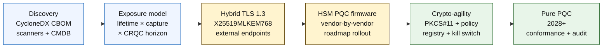

# De Quantum-Safe Banking Index in 2026: post-kwantumcryptografie, QKD, crypto-wendbaarheid en harvest-now-decrypt-later-risico

<!-- lead-start: manual -->
<aside class="post-lead" aria-label="Samenvatting van het artikel">

<strong>TL;DR.</strong> Quantum-safe banking in 2026 is een leveringsprogramma met een deadline die wordt bepaald door het snijpunt van twee curves — de vertrouwelijkheidshorizon van de data die de instelling vandaag bewaart, en de aankomsthorizon van een Cryptographically Relevant Quantum Computer (CRQC). NIST FIPS 203 / 204 / 205 zijn definitief sinds augustus 2024; CNSA 2.0 legt het Amerikaanse federale eindpunt vast op 2033; harvest-now-decrypt-later treft langlevende data nu al. De Board-Level Quantum Scorecard volgt vier exacte percentages: volledigheid van de inventaris, HNDL-blootstelling, NIST-migratievoortgang, gereedheid in crypto-wendbaarheid.

<strong>Belangrijkste conclusies</strong>

<ul class="post-lead-takeaways">
  <li><strong>Het algoritmedebat is op 13 augustus 2024 gesloten.</strong> ML-KEM (FIPS 203), ML-DSA (FIPS 204) en SLH-DSA (FIPS 205) zijn de antwoorden. Banken die in 2026 nog interne evaluaties draaien om "de winnaar te kiezen", lopen 18 maanden achter.</li>
  <li><strong>Harvest-now-decrypt-later is al van toepassing.</strong> Alles met een vertrouwelijkheidshorizon voorbij een geloofwaardige CRQC-aankomst — hypotheken met een looptijd van 30 jaar, acceptatie van levensverzekeringen, MiFID II- / AVG-transactieopnames, retentiearchieven voor M&amp;A — moet nu overstappen op hybride quantum-safe key encapsulation, niet pas wanneer een CRQC wordt aangekondigd.</li>
  <li><strong>Inventarisatie is de poortwachter van de volwassenheid.</strong> Een Cryptographic Bill of Materials (CBOM) — protocol, bibliotheek, certificaat, HSM-partitie, leveranciersafhankelijkheid, applicatie-eigenaar, levensduur op basis van dataclassificatie — is de voorwaarde voor al het overige. Stuur op actualiteit, niet op dekking.</li>
  <li><strong>Hybride TLS 1.3 is de uitrol van 2026.</strong> De hybride key share X25519MLKEM768 is wat Chrome / Firefox / Cloudflare / Akamai vandaag daadwerkelijk onderhandelen. Pure ML-KEM TLS wacht op HSM-firmware en CA-gereedheid.</li>
  <li><strong>Crypto-wendbaarheid is het duurzame resultaat.</strong> PKCS#11-abstractie, gelabelde sleutels, een policyregister dat bedrijfsdiensten koppelt aan de toegestane algoritmeset. Zonder dat wordt elke volgende algoritmewissel opnieuw een meerjarig programma.</li>
</ul>
</aside>
<!-- lead-end -->

Quantum-safe banking in 2026 draait om operationele migratie, niet om speculatie. NIST heeft de eerste drie standaarden voor post-kwantumcryptografie definitief gemaakt en banken moeten nu vaststellen welke systemen afhankelijk zijn van RSA, ECC, TLS, handtekeningen, HSM's, certificaten, betaalkanalen, archieven en langlevende vertrouwelijke data. De indexvraag is eenvoudig: kan de instelling haar cryptografie vervangen voordat de dreiging operationeel wordt?

---

> **Managementsamenvatting / belangrijkste conclusies**
>
> - **De NIST-standaarden zijn nu concreet.** FIPS 203 definieert ML-KEM voor key encapsulation, FIPS 204 definieert ML-DSA voor handtekeningen en FIPS 205 stelt SLH-DSA vast als toestandsloze, op hash gebaseerde handtekeningstandaard.
> - **Inventarisatie is de eerste volwassenheidspoort.** Een bank kan niet migreren wat zij niet kan vinden: certificaten, sleutels, protocollen, applicaties, leveranciers, HSM's, API's, archieven en ingebedde systemen moeten in kaart worden gebracht.
> - **Crypto-wendbaarheid is het duurzame doel.** Het doel is geen eenmalige algoritmewissel; het is het vermogen om cryptografische primitieven te wijzigen zonder volledige applicaties opnieuw te ontwerpen.
> - **Langlevende data verandert de urgentie.** Het harvest-now-decrypt-later-risico betekent dat data die vandaag wordt vastgelegd later leesbaar kan worden, als zij lang genoeg waardevol blijft.
> - **QKD is een gespecialiseerde aanvulling.** Quantum key distribution kan relevant zijn voor de kanalen met de hoogste waarde, maar vervangt geen instellingsbrede PQC-migratie.
>
---

## Waarom 2026 het jaar is waarin deze index ertoe doet

Drie verschuivingen in 2024-2025 maakten quantum-safe tot een meetbaar bankprogramma in plaats van een onderzoeksonderwerp. Ten eerste rondde NIST op 13 augustus 2024 de belangrijkste post-kwantumstandaarden af: [FIPS 203 (ML-KEM) ⧉](https://nvlpubs.nist.gov/nistpubs/FIPS/NIST.FIPS.203.pdf "FIPS 203 — Module-Lattice-Based Key-Encapsulation Mechanism"), [FIPS 204 (ML-DSA) ⧉](https://nvlpubs.nist.gov/nistpubs/FIPS/NIST.FIPS.204.pdf "FIPS 204 — Module-Lattice-Based Digital Signature Standard"), [FIPS 205 (SLH-DSA) ⧉](https://nvlpubs.nist.gov/nistpubs/FIPS/NIST.FIPS.205.pdf "FIPS 205 — Stateless Hash-Based Digital Signature Standard"). Het debat over algoritmekeuze is op die datum gesloten; banken die in 2026 nog interne werkstromen draaien over "welk schema wint" lopen 18 maanden achter.

Ten tweede legt [CNSA 2.0 van de NSA ⧉](https://media.defense.gov/2022/Sep/07/2003071834/-1/-1/0/CSA_CNSA_2.0_ALGORITHMS_.PDF "Commercial National Security Algorithm Suite 2.0") het Amerikaanse federale eindpunt vast op 2033, met tussenliggende deadlines vanaf 2027 voor software- en firmware-ondertekening en 2030 voor browsers en besturingssystemen. Iedere bank met blootstelling aan Amerikaanse federale tegenpartijen — FedNow, treasuryoperaties, federale klantrekeningen — valt voor de systemen die federale data raken binnen die perimeter. De klok is niet langer abstract.

Ten derde is [Harvest-Now-Decrypt-Later (HNDL) ⧉](https://csrc.nist.gov/Projects/post-quantum-cryptography "NIST Post-Quantum Cryptography programme") het dragende risicoargument voor urgentie. Geavanceerde tegenstanders leggen nu al TLS-beschermde betaalberichten, SWIFT-enveloppen, KYC-documentatie en cijfertekst uit langlevende archieven vast bij de grote financiële centra. De data die in 2026 wordt vastgelegd hoeft alleen op het moment van ontsleuteling nog vertrouwelijk te zijn — voor hypotheken met een looptijd van 30 jaar, acceptatie van levensverzekeringen, MiFID II- / AVG-transactieopnames en retentiearchieven voor M&A reikt dat venster ruim voorbij elke geloofwaardige schatting van een Cryptographically Relevant Quantum Computer (CRQC). De tegenstander heeft vandaag geen kwantumcomputer nodig. Zij heeft er een nodig voordat de data niet meer relevant is.

De Quantum-Safe Banking Index meet of uw instelling de migratie kan opleveren voordat dat snijpunt arriveert. Het werk gaat niet meer om of er gemigreerd wordt; het gaat om of de migratie wordt afgerond binnen een verdedigbaar tijdpad.

## De indexarchitectuur voor 2026

| Indexlaag | Richting in 2026 | Gereedheidsmaatstaf | Risico bij verkeerde aanpak |
|---|---|---|---|
| **Inventaris** | Breng cryptografische assets, protocollen, certificaten, leveranciers en dataklassen in kaart | Percentage van het landschap dat is geïnventariseerd | Onbekende kwantumkwetsbare afhankelijkheden |
| **Blootstelling** | Classificeer systemen op vertrouwelijkheidshorizon en transactiekriticaliteit | Hoogrisicoassets naar waarde en levensduur | Verkeerd geprioriteerde migratie |
| **Migratie** | Adopteer hybride en PQC-klare patronen, afgestemd op NIST-standaarden | ML-KEM- en ML-DSA-gereedheid | Noodgedwongen herplatforming onder tijdsdruk |
| **Crypto-wendbaarheid** | Scheid applicatielogica van cryptografische primitieven | Dekking van crypto onder policysturing | Hardgecodeerde algoritmes verspreid over het landschap |
| **Borging** | Test interoperabiliteit, prestaties, HSM-ondersteuning, certificaten en leveranciersgereedheid | Slagingspercentage van tests en achterstand in uitzonderingen | Kapotte kanalen of zwakke terugvalmaatregelen |

### De Board-Level Quantum Scorecard

Een geloofwaardige scorecard voor kwantumgereedheid vraagt het volgen van exacte percentages, niet alleen projectstatussen:

1. **Volledigheid van de inventaris:** het percentage tier-1-applicaties met een volledig in kaart gebrachte Cryptographic Bill of Materials (CBOM).
2. **HNDL-blootstelling:** het volume langlevende vertrouwelijke data (bijv. persoonsgegevens, bedrijfsgeheimen) dat over netwerken wordt verstuurd zonder hybride quantum-safe key encapsulation.
3. **NIST-migratievoortgang:** het percentage asymmetrische versleutelingssleutels en digitale handtekeningen dat is gemigreerd naar de standaarden FIPS 203 (ML-KEM) en FIPS 204 (ML-DSA).
4. **Gereedheid in crypto-wendbaarheid:** het percentage kritieke systemen waarin cryptografische algoritmes via centraal beleid kunnen worden geroteerd, zonder dat code opnieuw hoeft te worden gecompileerd.

## Actuele signalen om te volgen

| Signaal | Wat het voor banken betekent | Bron |
|---|---|---|
| **FIPS 203 ML-KEM** | Belangrijkste NIST-standaard voor algemeen vaststellen van versleutelingssleutels | [NIST ⧉](https://www.nist.gov/news-events/news/2024/08/nist-releases-first-3-finalized-post-quantum-encryption-standards "First three finalized post-quantum encryption standards") |
| **FIPS 204 ML-DSA** | Belangrijkste NIST-standaard voor digitale handtekeningen | [NIST ⧉](https://www.nist.gov/news-events/news/2024/08/nist-releases-first-3-finalized-post-quantum-encryption-standards "First three finalized post-quantum encryption standards") |
| **FIPS 205 SLH-DSA** | Op hash gebaseerd alternatief en back-uponderwerp voor handtekeningen | [NIST ⧉](https://www.nist.gov/news-events/news/2024/08/nist-releases-first-3-finalized-post-quantum-encryption-standards "First three finalized post-quantum encryption standards") |
| **Onmiddellijke integratie aangemoedigd** | NIST roept beheerders expliciet op om met integratie te beginnen, omdat volledige integratie tijd kost | [NIST ⧉](https://www.nist.gov/news-events/news/2024/08/nist-releases-first-3-finalized-post-quantum-encryption-standards "First three finalized post-quantum encryption standards") |
| **Bank-kwantumprogramma's breiden uit** | Grote banken verkennen kwantumtechnologieën en bereiden tegelijkertijd PQC-transities voor | [Quantum Insider ⧉](https://thequantuminsider.com/2026/03/27/15-plus-global-banks-probing-the-wonderful-world-of-quantum-technologies/ "Overview of global banks exploring quantum technologies") |

## De migratie begint met het cryptografieregister

De migratievolgorde is op dit punt goed begrepen. Elke poort levert bewijs dat de volgende stap stuurt; het overslaan of inkorten van een poort is precies wat het risico op noodgedwongen herplatforming oplevert dat in de faalkolom van de indexarchitectuur opduikt.

Het eerste oplevermoment is geen nieuw algoritme; het is een cryptographic bill of materials (CBOM). Banken hebben een levende inventaris nodig die bedrijfsdiensten koppelt aan algoritmes, bibliotheken, certificaten, sleutellengtes, HSM's, datalevensduur, leveranciers en operationele eigenaren. Zonder dat register wordt quantum-safe migratie giswerk.

De CBOM-records moeten voor elke cryptografische primitieve vastleggen: het protocol of de interface (TLS 1.3, IPsec, SSH, een eigen formaat voor betaalberichten), het algoritme en de parameterset (RSA-2048, ECDH P-256, ML-KEM-768, ML-DSA-65), de bibliotheek en versie (OpenSSL 3.4, BoringSSL-commit-hash, vendor-SDK-build), de hardwaregrens (HSM-partitie, TPM, secure enclave of geen), de certificaatidentiteit indien van toepassing, de applicatie-eigenaar en de levensduur op basis van de dataclassificatie. Tools die in 2025-2026 in productie verschijnen — IBM Quantum Safe Inventory, de opensource [CycloneDX CBOM-specificatie ⧉](https://cyclonedx.org/capabilities/cbom/ "CycloneDX Cryptography Bill of Materials"), enterprise scanners van CryptoNext / Sandbox / PQShield — integreren in bestaande CMDB-pipelines. Geen daarvan is op zichzelf compleet; reken op een opbouwcyclus van 12 tot 18 maanden voor de CBOM, zelfs met leveranciersgereedschap en toegewijde capaciteit.

De maatstaf om te volgen is actualiteit, niet dekking. Een CBOM van twee maanden oud is slechter dan helemaal geen CBOM, omdat zij het securityteam een vals gevoel van zekerheid geeft over wat al is gemigreerd.

## Eerst hybride, altijd wendbaar

De meeste banken zullen niet alles tegelijk omschakelen. Het realistische patroon is hybride uitrol, waarin klassieke en post-kwantummechanismen naast elkaar draaien terwijl leveranciers, protocollen, certificaten en operationele tooling volwassen worden. Het langetermijndoel is crypto-wendbaarheid: cryptografische keuzes onder policysturing die gewijzigd kunnen worden zonder de bedrijfsapplicatie te herbouwen.

[Voeg interactief onderdeel in: Harvest-Now-Decrypt-Later (HNDL) risicocalculator — een tool met sliders waarin bestuurders de houdbaarheid van hun data afzetten tegen het geschatte kwantumtijdpad om hun blootstellingsvenster te zien.]

> **Belangrijk inzicht:** als uw data 10 jaar vertrouwelijk moet blijven en een Cryptographically Relevant Quantum Computer (CRQC) nog 7 jaar weg is, ligt uw migratiedeadline niet over 7 jaar — die lag 3 jaar geleden.

In de praktijk betekent dit TLS 1.3 met de hybride `X25519MLKEM768` key share voor extern bereikbare endpoints (Chrome / Firefox / Cloudflare / Akamai ondersteunen dit vandaag al), klassieke handtekeningketens totdat HSM- en CA-infrastructuur is bijgetrokken, en een PKCS#11-abstractielaag waarmee het policyregister algoritmes kan roteren zonder bedrijfsapplicaties opnieuw te compileren. Crypto-wendbaarheid bepaalt of de volgende algoritmewissel (wanneer, niet of) een rotatie van zes weken wordt of opnieuw een programma van zeven jaar.

## Waar QKD past

Quantum key distribution hoort in de index thuis als optie voor kanalen met hoge gevoeligheid, met name voor financiële marktinfrastructuur, connectiviteit met centrale banken en uiterst gevoelige institutionele stromen. Behandel het als aanvulling op PQC, niet als excuus om de bredere migratie uit te stellen.

## Wat dit per banktype betekent

### Mondiaal systeemrelevante banken

Het lastige probleem is schaal: tienduizenden TLS-endpoints, honderden HSM-partities, tientallen interne certificaatautoriteiten, honderden bedrijfsapplicaties met ingebedde cryptografische primitieven en vendor-SDK's die de bank niet kan aanpassen. De investering is geen nieuwe pilot; het zijn de CBOM-tooling, de PKCS#11-abstractielaag die in elke nieuwe build wordt aangesloten, het HSM-consolidatieplan dat één leverancier kiest om voorop te lopen met PQC-firmware en een meerjarige staart accepteert bij de overige leveranciers, en het policyregister dat ook na de migratie van FIPS 203 / 204 / 205 het duurzame oppervlak voor crypto-wendbaarheid blijft.

### Transactiebanken en zakelijke banken

De migratiescope is smaller dan bij een G-SIB, maar de HNDL-blootstelling is scherp: SWIFT-grensoverschrijdend berichtenverkeer, gestructureerde betaaldata met persoonsgegevens van zakelijke tegenpartijen, document-uitwisselingsplatforms met handelsfinancieringsdocumentatie en rapportagearchieven met lange bewaartermijnen. Prioriteer hybride TLS op elk klantgericht endpoint en PQC in rust voor retentiearchieven. Druk de verantwoordelijkheid van HSM-leveranciers door — het corporate-banking-platformteam heeft directe inkoopinvloed die het wholesale-technologyteam vaak mist.

### Regionale banken

Koop de leverancierstack die de primitieven voor crypto-wendbaarheid al heeft. Kies een kernbankplatform waarvan de leverancier een CBOM publiceert en zich committeert aan ondersteuningstijdlijnen voor ML-KEM / ML-DSA. Toets of de HSM-roadmap van de leverancier strookt met de migratiedeadline van de bank. De engineeringcapaciteit om crypto-wendbaarheid van de grond af te bouwen is meerjarig; de leverancier draagt die kosten over veel klanten en de bank profiteert. Het validatiewerk — controleren of de claims van de leverancier het MRM-proces van de instelling doorstaan — is de legitieme interne scope.

### Fintechs, PSP's en infrastructuuraanbieders

De concurrentievraag voor leveranciers die in 2026 aan banken verkopen is niet "ondersteunt u PQC". Zij luidt: "kunt u een CycloneDX CBOM voor uw platform, een ondersteuningsmatrix per HSM-leverancier en een schriftelijke SLA voor algoritmerotatie leveren." Leveranciers die met ja antwoorden komen in 2026-2027 door de inkoopporten van tier-1-banken. Leveranciers die dat niet kunnen verliezen de verlengingscyclus aan een concurrent die het wel kan.

## Conclusie

Quantum-safe banking in 2026 is geen onderzoeksonderwerp; het is een leveringsprogramma met een deadline die wordt bepaald door het snijpunt van twee curves — de vertrouwelijkheidshorizon van de data die de instelling vandaag bewaart, en de aankomsthorizon van een Cryptographically Relevant Quantum Computer. De instellingen die in 2030 geloofwaardig overkomen bij toezichthouders en tegenpartijen, zijn de instellingen die in 2024 zijn begonnen met de bouw van hun CBOM, eind 2026 hybride TLS hebben uitgerold op elk extern endpoint en crypto-wendbaarheid vanaf dag één in elke nieuwe build hebben verankerd. De instellingen die dat niet hebben gedaan, komen erachter of hun migratievenster al gesloten is voor de data die hun tegenstander vandaag oogst.

Meet de migratie zoals u elk operationeel programma meet: scope bekend, sequentiëring geprioriteerd, deadlines vastgelegd, uitzonderingsregisters eerlijk. Hoe scherper u naar uw eigen landschap kijkt, hoe smaller het migratievenster aanvoelt.

## Veelgestelde vragen

**Wat moet een bank het eerst inventariseren?**

Begin bij extern bereikbare TLS, betaalkanalen, klantauthenticatie, interbancaire connectiviteit, HSM-onderbouwde diensten, langetermijnarchieven en systemen die vertrouwelijke data met een lange nuttige levensduur verwerken.

**Is PQC alleen een cybersecuritykwestie?**

Nee. Het raakt betalingen, identiteit, juridisch bewijs, transactiehandtekeningen, klantvertrouwen, dataretentie, leveranciersbeheer en operationele veerkracht.

**Wat betekent crypto-wendbaarheid?**

Crypto-wendbaarheid is het vermogen om cryptografische primitieven te wijzigen via beleid en platformcontroles, in plaats van via hardgecodeerde applicatiewijzigingen.

**Moeten banken op meer standaarden wachten?**

Nee. NIST heeft beheerders opgeroepen om met de eerste definitieve standaarden te beginnen, omdat volledige integratie tijd kost.

## Bronnen

- NIST, (2026). [Eerste drie definitieve standaarden voor post-kwantumversleuteling ⧉](https://www.nist.gov/news-events/news/2024/08/nist-releases-first-3-finalized-post-quantum-encryption-standards "Eerste drie definitieve standaarden voor post-kwantumversleuteling").

<!-- enrich-start -->
<aside class="author-card" aria-label="Over de auteur"><strong class="author-card-name"><a href="/about/index.html">Sebastien Rousseau</a></strong>Senior banking technologist, schrijft over toegepaste AI, betalingsinfrastructuur, getokeniseerd geld, ISO 20022, post-kwantumbeveiliging, cloud-native financiële dienstverlening en gereguleerde digitale markten.Meer dan 20 jaar bij HSBC Commercial &amp; Investment Bank, PayPal, Barclays, Shazam, AKQA, Virgin Group. <a href="/about/index.html">Volledig profiel</a> &middot; <a href="https://www.linkedin.com/in/sebastienrousseau/" rel="external noopener">LinkedIn</a> &middot; <a href="https://github.com/sebastienrousseau" rel="external noopener">GitHub</a></aside>

Laatst beoordeeld <time datetime="2026-06-04">2026-06-04</time>.

<!-- enrich-end -->
