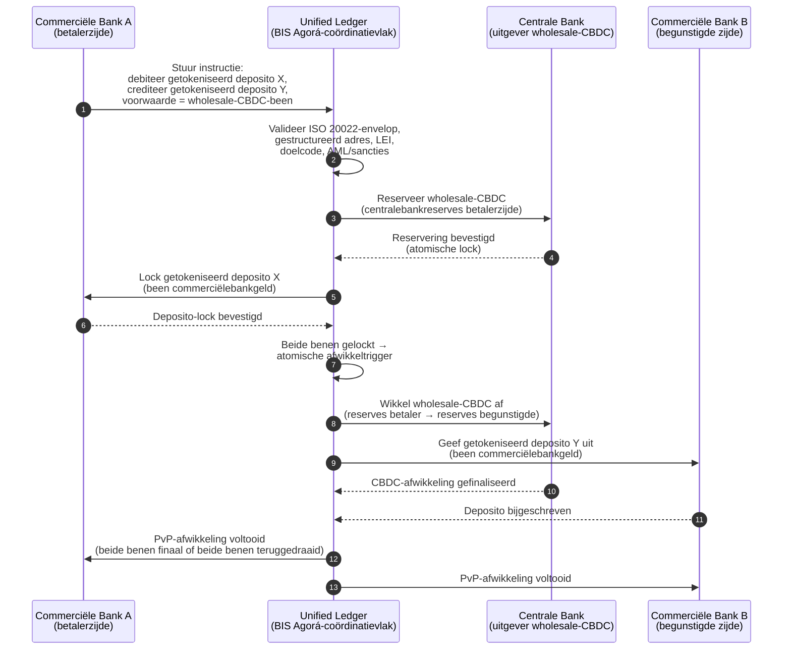

<!-- lead-start: manual -->
<aside class="post-lead" aria-label="Samenvatting van het artikel">

<strong>TL;DR.</strong> Grootschalig betalingsverkeer zit in 2026 op het snijpunt van twee structurele verschuivingen: ISO 20022 dwingt gestructureerde betalingsdata in het operating model, en getokeniseerde deposito's plus BIS Project Agorá verschuiven grensoverschrijdende afwikkeling naar atomische, programmeerbare en altijd-aan rails. De vraag van 2026 voor een bank is niet langer "hebben we de berichten gemigreerd", maar "zijn onze betalingsoperaties meetbaar, gerouteerd en toezichtsklaar" — en de index splitst dat in vier exacte percentages: volledigheid van gestructureerde data, optimaliteit van railroutering, vertraging tot afwikkelingsfinaliteit en dekking van Agorá-corridors.

<strong>Belangrijkste conclusies</strong>

<ul class="post-lead-takeaways">
  <li><strong>November 2026 is een harde deadline, geen richtlijn.</strong> SWIFT schrapt de ondersteuning voor ongestructureerde adressen in SR 2026; betalingen zonder plaats en land in de aangewezen velden worden niet meer verwerkt. Reparatiekosten, weigeringspercentage en operationele capaciteit verschuiven van "metriek" naar "houding die zichtbaar is voor de toezichthouder".</li>
  <li><strong>Getokeniseerde deposito's verslaan stablecoins voor gereguleerd grootschalig verkeer.</strong> Ze behouden de relatie tussen bank en depositohouder en de centralebankafwikkeling, en stellen tegelijk programmeerbaarheid open. Stablecoins houden een rol aan de randen; getokeniseerde deposito's verankeren de kern.</li>
  <li><strong>BIS Project Agorá is de corridor-referentie.</strong> Als een grensoverschrijdend product van een bank in 2027 niet binnen een Agorá-corridor kan draaien, concurreert het op een rail die de rest van de markt al verlaat.</li>
  <li><strong>Orkestratie van real-time rails is het operating model.</strong> De multi-rail-keuze van 2026 (FedNow / RTP / TIPS / SEPA Inst / on-chain) gaat niet over "welke rail" — het is het policy register, het liquiditeitsprofiel en de routing-engine die per betaling de rail kiezen.</li>
  <li><strong>Meten of gemeten worden.</strong> Vier percentages — volledigheid van gestructureerde data, optimaliteit van railroutering, vertraging tot afwikkelingsfinaliteit, dekking van Agorá-corridors — vertalen de betalingshouding naar toezichtsklaar bewijs vóór het auditvenster van 2026/27.</li>
</ul>
</aside>
<!-- lead-end -->

# De Wholesale Payments Index in 2026: ISO 20022, getokeniseerde deposito's, real-time rails en grensoverschrijdende afwikkeling

Grootschalig betalingsverkeer wordt in 2026 hervormd door twee gelijktijdige verschuivingen: gestructureerde betalingsdata en programmeerbare afwikkeling. De mijlpaal van SWIFT voor gestructureerde adressen in november 2026 dwingt datakwaliteit het operating model in, terwijl BIS Project Agorá en getokeniseerde deposito's toetsen of grensoverschrijdende afwikkeling atomischer, transparanter en altijd-aan kan worden.

---

> **Managementsamenvatting / Belangrijkste conclusies**
>
> - **November 2026 is een harde data-mijlpaal.** SWIFT stelt dat betalingen met ongestructureerde adressen na de SR 2026-wijziging niet langer worden ondersteund.
> - **Gestructureerde data wordt productinfrastructuur.** Plaats en land moeten minstens in de aangewezen velden staan; daardoor wordt datakwaliteit van betalingen een vraagstuk voor klant, operatie en compliance.
> - **Getokeniseerde deposito's zijn een ontwerpoptie voor wholesale.** Project Agorá onderzoekt getokeniseerde commerciëlebankdeposito's en getokeniseerde centralebankreserves in één unified-ledgermodel.
> - **De index moet afwikkelingskwaliteit meten, niet alleen snelheid.** Finaliteit, transparantie, reparatiepercentages, liquiditeitsgebruik, compliance-data en klantzichtbaarheid wegen even zwaar als directe uitvoering.
> - **Grensoverschrijdende betalingen blijven een publiek-private agenda.** De FSB stuurt het G20-stappenplan door de implementatie heen, met coördinatie tussen publieke en private sector.
>
---

## Waarom 2026 het jaar is waarin deze index telt

De Stanford AI Index werkt omdat hij een snel bewegend technologieveld behandelt als iets meetbaars: onderzoeksoutput, technische prestaties, verantwoorde uitrol, economie, sectoradoptie, beleid en publieke opinie komen samen in één kader ([Stanford HAI ⧉](https://hai.stanford.edu/ai-index/2026-ai-index-report "Het AI Index-rapport 2026")). Banken en financiële instellingen hebben nu dezelfde discipline nodig voor infrastructuur. Agentic AI, quantum-veilige beveiliging, cloud-native veerkracht en grootschalig betalingsverkeer zijn geen aparte innovatiesporen meer; ze convergeren in één operating model.

De praktische vraag voor een bank is niet of elk domein belangrijk is. De vraag is of de instelling gereedheid op al die domeinen tegelijk kan meten. Een bank kan agentic AI uitrollen en toch broos zijn als haar cryptografie niet migratieklaar is. Ze kan cloudplatformen moderniseren en toch falen als betalingsdata ongestructureerd blijft. Ze kan tokenisatiepilots draaien en toch systeemrisico creëren als de lagen voor afwikkeling, liquiditeit, identiteit en auditlog niet samen worden ontworpen.

## De architectuur van de index 2026

| Indexlaag | Richting in 2026 | Gereedheidsmetriek | Risico bij verkeerde aanpak |
|---|---|---|---|
| **ISO 20022-data** | Verschuif van ongestructureerde tekst naar bestuurde gestructureerde velden | Gereedheid voor gestructureerd adres en weigeringspercentage | Geweigerde betalingen en handmatige reparatie |
| **Railorkestratie** | Routeer over RTGS, instant, correspondent, stablecoin en getokeniseerde rails | Kosten, snelheid, finaliteit en jurisdictiebewuste routering | Gefragmenteerde rails met dubbele controles |
| **Getokeniseerde afwikkeling** | Gebruik getokeniseerde deposito's en centralebankgeld waar ze wrijving verminderen | Dekking van DvP, PvP en atomische afwikkeling | Pilot-activa zonder waarde voor de businessworkflow |
| **Liquiditeit** | Optimaliseer intraday-liquiditeit, vastzittend kasgeld en afwikkelvensters | Bespaarde liquiditeit en daling van afwikkelfalen | Snellere uitstroom van liquiditeit |
| **Compliance** | Verweef AML, sancties, FATF en audit-eisen in betalingsdata | Straight-through compliance en verklaarbaarheid | Rijkere data zonder sterkere vangrails |

## Belangrijkste signalen in grootschalig betalingsverkeer, afgezet tegen mondiale prioriteiten

De signalenset van 2026 is geen onderzoeksagenda. Het is een opleverlijst waarop de Chief Payments Officer van een bank al wordt afgerekend. Het remediatiewerk landt op drie plekken: de berichtenenvelop, de laag voor railorkestratie en het afwikkelingsgrootboek.

| Signaal | G20- / SWIFT- / BIS-referentie | Technische platformimplementatie |
|---|---|---|
| **65% van de betaalberichten bevat nog ongestructureerde adressen** | [SWIFT SR 2026 — mijlpaal gestructureerd adres, nov. 2026 ⧉](https://www.swift.com/news-events/news/iso-20022-milestone-november-2026-unstructured-addresses-be-removed "ISO 20022-mijlpaal november 2026 gestructureerd adres") | Schemavalidatie in de betaal-middleware vóór het bericht de SWIFTNet-adapter raakt; geautomatiseerde adresontleding bij ingress vanuit corporate-kanalen en correspondentbanken. |
| **FSB G20-doel: 75% van de grensoverschrijdende betalingen binnen 1 uur afgerond in 2027** | [FSB-stappenplan grensoverschrijdende betalingen, implementatiefase 2026 ⧉](https://www.fsb.org/2026/03/fsb-kicks-off-new-implementation-phase-to-enhance-cross-border-payments-through-public-private-partnership/ "Implementatiefase grensoverschrijdende betalingen") | Real-time FX-conversiegateways met vooraf overeengekomen liquiditeitsvensters; T+0-bevestigingshaken in het klantportaal; routing-engine voor rails die elke corridor uitsluit die de 1 uur-envelop niet haalt. |
| **FSB G20-doel: gemiddelde kosten grensoverschrijdende transactie onder 1%, retail onder 3%** | [Kwantitatieve FSB G20-doelen ⧉](https://www.fsb.org/2026/03/fsb-kicks-off-new-implementation-phase-to-enhance-cross-border-payments-through-public-private-partnership/ "Implementatiefase grensoverschrijdende betalingen") | Telemetrie voor kostenattributie per corridor (FX-spread, correspondent-fee, lifting cost); registry voor margebeleid dat niet-conforme prijsstelling vóór de quote zichtbaar maakt. |
| **BIS Project Agorá in prototypefase met zeven centrale banken en 41 commerciële banken** | [BIS Project Agorá ⧉](https://www.bis.org/about/bisih/topics/fmis/agora.htm "Project Agorá") | Integratiespec voor de unified ledger: node voor het grootboek van getokeniseerde deposito's + afwikkelingsvlak voor wholesale-CBDC + KYC/AML-haken; on-chain liquiditeitspools die zijn gedimensioneerd op het corridoraandeel van de bank. |
| **Kader "digitaal geld" van Deutsche Bank krijgt vorm in klantarchitectuur** | [Deutsche Bank — Digital Money: stablecoins, getokeniseerde deposito's en CBDC's ⧉](https://flow.db.com/publications/flow-white-papers-and-guides/digital-money-a-perspective-on-stablecoins-tokenised-deposits-and-cbdcs "Digitaal geld: stablecoins, getokeniseerde deposito's en CBDC's") | Wallet-agnostische afwikkel-API die per betaling de keuze tussen stablecoin, getokeniseerd deposito en CBDC abstraheert; programmeerbare voorwaarden worden getoetst aan het policy register van de bank, niet aan dat van de klant. |

## Het kantelpunt in betalingsdata

ISO 20022 is verschoven van een berichtenformaatproject naar een operating model voor datakwaliteit. Als de gegevens over begunstigde, debiteur, crediteur, agent, plaats, land, doel en partij zwak zijn, dan krijgt de bank weigeringen, reparaties, sanctiefrictie, klantfrustratie en zwakke analytics.

**SR 2026 maakt hier een hard contract van, geen advies.** SWIFT Standards Release 2026 (november 2026) handhaaft de regel voor gestructureerd adres op netwerkniveau — berichten waarvan het `<PstlAdr>`-element geen `<TwnNm>` en `<Ctry>` bevat, worden bij ontvangst door de SWIFTNet-validatiestack geweigerd, niet gemarkeerd voor reparatie. De reparatiewachtrij is geen back-office-kostenpost meer, maar een afwikkelingsfalen met klantzichtbare vertraging. Operationele teams die SR 2026 als "strakkere richtlijn" behandelen, werken met het verkeerde draaiboek.

### Compliance van gestructureerde betalingsdata onder ISO 20022

Het remediatie-oppervlak is smal en scherp afgebakend. De onderstaande XML-elementen zijn de plekken waar de SWIFTNet-validatiestack van november 2026 berichten daadwerkelijk laat falen; al het overige is een afgeleid gevolg.

| Data-element | ISO 20022 XML-tag | Eis SWIFT november 2026 | Strategie technische remediatie |
|---|---|---|---|
| **Gestructureerd adres** | `<PstlAdr>` met `<TwnNm>` + `<Ctry>` | Verplicht. Ongestructureerde `<AdrLine>`-tekst veroorzaakt netwerkweigering bij de ontvangende SWIFTNet-adapter. | Geautomatiseerde adresontleding bij betaalinitiatie; herschrijven van corporate-kanaalformulieren; back-book-opschoning op elke counterparty vóór de volgende debet. |
| **Legal Entity Identifier (LEI)** | `<Id>` onder `<OrgId>` | Sterk aanbevolen voor verificatie van niet-individuele financiële tegenpartijen; verplicht in meerdere CBPR+-corridors. | LEI-lookup + GLEIF-controle bij corporate onboarding; automatische verrijking voor back-book-counterparties via referentiegegevensdiensten. |
| **Codes voor betalingsdoel** | `<Purp>` met `<Cd>` | Verplicht in meerdere regionale real-time corridors (CBPR+, SEPA Inst, TIPS) voor geautomatiseerde AML- en sanctiescreening. | Map de oude bank-interne transactiecodes naar de standaard ISO 20022-lijst ExternalPurposeCode; toon de doel-selectie in de UI van het corporate-kanaal; default-deny bij onbekende codes. |
| **Ultimate parties** | `<UltmtDbtr>` / `<UltmtCdtr>` | Maak de uiteindelijke begunstigde-context zichtbaar voor de G20-FATF travel rule en sanctieparameters; verplicht voor meerdere betaaltypecodes. | Haal end-to-end-partijnamen uit grootboek-subrekeningen; reconcilieer tegen de KYC-graaf; toon de uiteindelijke partij op elke bevestiging. |
| **Betalingsinformatie (gestructureerd)** | `<RmtInf><Strd>` met `<RfrdDocInf>` | Vereist voor reconcilieerbare, aan facturen gekoppelde corporate betalingen onder CBPR+ fase 2. | Leg gestructureerde remittance vast op het moment van quote in het corporate-portaal; weiger free-text-fallback voor high-value flows. |

## Getokeniseerde deposito's en wholesale CBDC

Getokeniseerde deposito's behouden het model van commerciëlebankgeld en voegen programmeerbaarheid toe. Wholesale centralebankgeld behoudt de afwikkelingsfinaliteit. Het interessante ontwerppatroon is de combinatie: commerciëlebankgeld voor klantrelaties en kredietintermediatie, centralebankgeld voor eindafwikkeling en systemisch vertrouwen.

Project Agorá maakt de combinatie concreet. De onderstaande architectuur is het BIS-referentiepatroon voor een atomische, payment-versus-payment (PvP) grensoverschrijdende afwikkeling waarbij zowel een grootboek voor commerciëlebankdeposito's als een afwikkelingsvlak voor wholesale-CBDC wordt gebruikt, gecoördineerd via een unified ledger.

De afwikkeling is per constructie atomisch: beide benen committen of beide benen draaien terug. Afwikkelingsfinaliteit op het wholesale-CBDC-been maakt de overdracht van het getokeniseerde commerciëlebankdeposito effectief zonder correspondent-risico. De unified ledger is het coördinatievlak, geen zelfstandig betaalsysteem — de centrale bank blijft het afwikkelingsactief uitgeven en de commerciële bank blijft de depositoverplichting boeken.

## Het nieuwe wholesale betaalproduct

Het product is niet langer simpelweg een betaling. Het is een bundel van uitvoering, data, liquiditeit, compliance, traceerbaarheid en exceptiebeheer. Banken die deze capaciteiten via API's en klantdashboards openen, vertalen infrastructuur-compliance in klantwaarde.

## Wat dit betekent per banktype

### Mondiaal systeemrelevante banken

Mondiale banken moeten deze index behandelen als een enterprise-architectuur-scorecard. De prioriteit is niet nog een proof of concept; het is bewijs dat autonome werkstromen, cryptografische migratie, cloud-afhankelijkheid en betaalmodernisering bestuurd kunnen worden als één risico- en waardesysteem.

### Transactiebanken en corporate banken

Transactiebanken moeten zich richten op grootschalig betalingsverkeer, gestructureerde data, liquiditeit, getokeniseerde deposito's en agentic treasury-diensten. De waardevolste klantpropositie is niet enkel snellere geldbeweging; het is verklaarbare, auditbare, programmeerbare geldbeweging met minder onderzoeken en betere zicht op werkkapitaal.

### Regionale banken

Regionale banken moeten de index gebruiken om programmawildgroei te vermijden. Ze hoeven niet elke frontlinie te leiden, maar ze hebben wel geloofwaardige posities nodig op AI-governance, post-kwantum-inventaris, cloud-exit-bewijs en gereedheid van betalingsdata.

### Fintechs, PSP's en infrastructuuraanbieders

Fintechs en infrastructuuraanbieders moeten hun productroadmaps afstemmen op meetbare bankgereedheid. De beste proposities verminderen integratierisico, versterken bewijslast en maken complexe infrastructuur eenvoudiger te besturen voor banken.

## Conclusie

De waarde van een index-rapport is dat het een gefragmenteerde technologie-agenda omzet in een meetbaar operating model. In 2026 zijn de winnaars in financiële infrastructuur niet de instellingen met de meeste pilots. Het zijn de instellingen die tegelijk gereedheid kunnen aantonen op autonomie, beveiliging, veerkracht, afwikkeling, economie en governance.

## Veelgestelde vragen

**Waarom is ISO 20022 in 2026 nog steeds een vraagstuk?**

Omdat de migratie pas afgerond is wanneer betalingsdata gestructureerd, bestuurd, aan de bron vastgelegd en bruikbaar is over kanalen, klanten en marktinfrastructuren heen.

**Wat is een getokeniseerd deposito?**

Een getokeniseerd deposito is een digitale weergave van commerciëlebankgeld, ontworpen om de relatie tussen bank en depositohouder te behouden en tegelijk programmeerbare afwikkeling mogelijk te maken.

**Vervangen getokeniseerde deposito's stablecoins?**

Niet overal. Stablecoins blijven nuttig in sommige digital-asset- en grensoverschrijdende contexten, terwijl getokeniseerde deposito's structureel aantrekkelijk zijn voor gereguleerd grootschalig bankieren.

**Wat moeten banken meten?**

Meet gereedheid van gestructureerde data, geweigerde betalingen, reparatiekosten, afwikkeltijd, liquiditeitsgebruik, uitkomsten van railroutering en klantzichtbaarheid.

## Bronnen

- SWIFT, (2026). [ISO 20022-mijlpaal november 2026 gestructureerd adres ⧉](https://www.swift.com/news-events/news/iso-20022-milestone-november-2026-unstructured-addresses-be-removed "ISO 20022-mijlpaal november 2026 gestructureerd adres").
- BIS Innovation Hub, (2026). [Project Agorá ⧉](https://www.bis.org/about/bisih/topics/fmis/agora.htm "Project Agorá").
- FSB, (2026). [Implementatiefase grensoverschrijdende betalingen ⧉](https://www.fsb.org/2026/03/fsb-kicks-off-new-implementation-phase-to-enhance-cross-border-payments-through-public-private-partnership/ "Implementatiefase grensoverschrijdende betalingen").
- Deutsche Bank, (2026). [Digitaal geld: stablecoins, getokeniseerde deposito's en CBDC's ⧉](https://flow.db.com/publications/flow-white-papers-and-guides/digital-money-a-perspective-on-stablecoins-tokenised-deposits-and-cbdcs "Digitaal geld: stablecoins, getokeniseerde deposito's en CBDC's").

<!-- enrich-start -->
<aside class="author-card" aria-label="Over de auteur"><strong class="author-card-name"><a href="/about/index.html">Sebastien Rousseau</a></strong>Senior banking technologist, schrijft over toegepaste AI, betalingsinfrastructuur, getokeniseerd geld, ISO 20022, post-kwantumbeveiliging, cloud-native financiële dienstverlening en gereguleerde digitale markten.Meer dan 20 jaar bij HSBC Commercial &amp; Investment Bank, PayPal, Barclays, Shazam, AKQA, Virgin Group. <a href="/about/index.html">Volledig profiel</a> &middot; <a href="https://www.linkedin.com/in/sebastienrousseau/" rel="external noopener">LinkedIn</a> &middot; <a href="https://github.com/sebastienrousseau" rel="external noopener">GitHub</a></aside>

Laatst beoordeeld <time datetime="2026-06-06">2026-06-06</time>.

<!-- enrich-end -->
