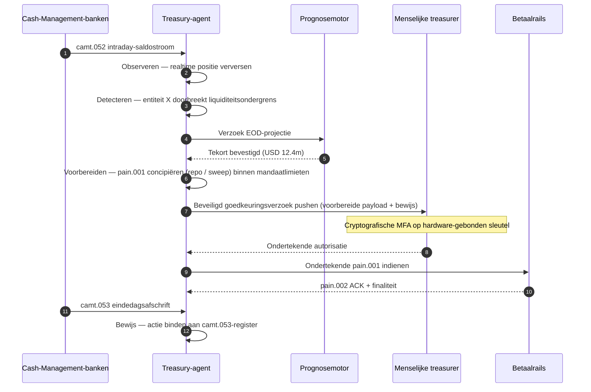

# De Autonome Treasury-Index in 2026: agentische treasury, programmeerbare liquiditeit, getokeniseerde deposito's en realtime cash control

<!-- lead-start -->
<aside class="post-lead" aria-label="Samenvatting artikel">

<strong>TL;DR.</strong> Een autonome treasury-index 2026 — meting van agentische workflows, dekking van programmeerbare liquiditeit, integratie van getokeniseerde deposito's, orkestratie van realtime betalingen en geautomatiseerde cash control als één operating-model.

<strong>Belangrijkste punten</strong>

<ul class="post-lead-takeaways">
  <li><strong>Treasury wordt een realtime operating system.</strong> Statische liquiditeitsprognoses en batch-sweeps zijn niet langer de meeteenheid; agentische workflows op realtime data zijn dat wel.</li>
  <li><strong>Programmeerbare liquiditeit is nu haalbaar.</strong> Getokeniseerde deposito's plus realtime rails maken liquiditeitsvoorziening per gebeurtenis tot een workflowprimitief, niet tot een kwartaalinitiatief.</li>
  <li><strong>Getokeniseerde deposito's zijn het voorkeursgeld van de treasurer.</strong> De economie van bankgeld, programmeerbaarheid en intraday-zekerheid — zonder de uitgever- en reservevragen van stablecoins.</li>
  <li><strong>De control plane is het nieuwe auditoppervlak.</strong> Mandaten, limieten, handmatige override-paden en bewijs van terugboeking moeten als platformprimitieven draaien, niet als handmatige goedkeuringen per actie.</li>
  <li><strong>De CFO-scorecard is per besluit, niet per kwartaal.</strong> Kosten van liquiditeit, verlaging van intraday-liquiditeitsbuffers, FX-efficiëntie en prognosenauwkeurigheid worden op workflowsnelheid gemeten.</li>
</ul>

<strong>Verwante artikelen:</strong> <a href="https://sebastienrousseau.com/nl/2026-05-25-programmable-liquidity-ai-tokenised-deposits-real-time-treasury-2026/index.html">Programmeerbare liquiditeit in 2026: AI, getokeniseerde deposito's en realtime treasury-orkestratie</a>, <a href="https://sebastienrousseau.com/nl/2026-05-21-tokenised-deposits-banking-services-status-2026/index.html">Getokeniseerde deposito's in 2026: bankdiensten, stablecoin-concurrentie en de status van programmeerbaar commercieel bankgeld</a>.

</aside>
<!-- lead-end -->

Autonome treasury is het natuurlijke snijpunt van agentische AI, wholesale-betalingen, getokeniseerde deposito's en realtime liquiditeit. In 2026 zullen de beste treasury-architecturen niet alleen liquiditeitsprognoses opstellen; ze bevelen aan, leggen uit en voeren uiteindelijk begrensde liquiditeitsacties uit over rekeningen, valuta's, rails en settlementactiva heen.

---

> **Managementsamenvatting / belangrijkste punten**
>
> - **Treasury verschuift van rapportage naar control.** Realtime saldi, prognoses, betalingsstatus en liquiditeitsbeweging worden onderdeel van één workflow.
> - **Agentische AI creëert een nieuwe treasury-interface.** Agenten kunnen posities monitoren, anomalieën signaleren, fundingacties voorbereiden en besluiten escaleren binnen vastgelegde mandaten.
> - **Programmeerbaar geld verandert de cash leg.** Getokeniseerde deposito's en wholesale-CBDC-experimenten openen nieuwe mogelijkheden voor atomair settlement, conditionele betalingen en always-on liquiditeit.
> - **De index moet bevoegdheid meten.** De vraag is niet of de agent een actie kan voorstellen; het is of de bevoegdheid, limieten, goedkeuringen en bewijslast helder zijn.
> - **Treasury-waarde is meetbaar.** Bespaarde liquiditeit, minder handmatig onderzoek, vermeden settlementfalen en vrijgekomen werkkapitaal moeten succes definiëren.
>
---

## Waarom 2026 het jaar is waarin deze index ertoe doet

De Stanford AI-index is bruikbaar omdat hij een snel bewegend technologieveld behandelt als iets dat gemeten kan worden: onderzoeksoutput, technische prestaties, verantwoorde inzet, economie, sectorale adoptie, beleid en publieke perceptie worden in één kader gebracht ([Stanford HAI ⧉](https://hai.stanford.edu/ai-index/2026-ai-index-report "Het AI Index-rapport 2026")). Banken en financiële instellingen hebben nu dezelfde discipline nodig voor infrastructuur. Agentische AI, kwantumveilige beveiliging, cloud-native veerkracht en wholesale-betalingen zijn niet langer afzonderlijke innovatiesporen; ze convergeren tot één operating model.

De praktische vraag voor een bank is niet of elk domein belangrijk is. Het is of de instelling gereedheid op alle domeinen tegelijk kan meten. Een bank kan agentische AI uitrollen en toch broos zijn als haar cryptografie niet migratiegereed is. Ze kan cloudplatforms moderniseren en toch falen als betalingsdata ongestructureerd blijven. Ze kan tokenisatiepilots draaien en toch systeemrisico creëren als settlement, liquiditeit, identiteit en auditlagen niet samen worden ontworpen.

## De index-architectuur 2026

| Indexlaag | Richting 2026 | Gereedheidsmaatstaf | Risico bij verkeerde aanpak |
|---|---|---|---|
| **Zichtbaarheid** | Rekening-, betaal-, liquiditeits- en blootstellingsdata samenbrengen | Dekking van realtime cashposities | Gefragmenteerde liquiditeitszichtbaarheid |
| **Prognose** | AI inzetten voor saldi-, stromen- en fundingprognoses | Prognose­nauwkeurigheid en uitzonderingspercentage | Vals vertrouwen in zwakke data |
| **Autonomie** | Agenten begrensde bevoegdheid geven voor adviezen en acties | Mandaatdekking en kwaliteit van goedkeuringen | Onbevoegde of onverklaarde actie |
| **Programmeerbaarheid** | Getokeniseerde deposito's en slimme voorwaarden inzetten waar ze waarde toevoegen | Conditionele betalings- en atomaire settlement-use-cases | Technologiegedreven treasury-pilots |
| **Controles** | Limieten, sancties, FX, liquiditeit en audit als ingebedde controles | Controlebewijs per treasury-actie | Handmatige governance na uitvoering |

## Huidige signalen om te volgen

| Signaal | Wat het betekent voor banken | Bron |
|---|---|---|
| **52% adoptie van agentische AI in de financiële sector** | Treasury kan agentische workflows nu absorberen via beheerde platforms | [Cambridge CCAF ⧉](https://www.jbs.cam.ac.uk/faculty-research/centres/alternative-finance/publications/2026-global-ai-in-financial-services-report/ "Global AI in Financial Services Report 2026") |
| **Conditionele betalingen in Project Agorá** | Tokenisatie kan conditionele en always-on betaalfunctionaliteiten mogelijk maken | [BIS ⧉](https://www.bis.org/about/bisih/topics/fmis/agora.htm "Project Agorá") |
| **Bank of England Digital Securities Sandbox** | DLT-uitgegeven obligaties en aandelen settelen op basis van Levering tegen Betaling (DvP) — het asset-been en het cash-been (wholesale-CBDC of getokeniseerde commerciële-bankdeposito's) settelen in dezelfde atomaire transactie, waardoor het principal-tegenpartijrisico wordt geëlimineerd | [Bank of England ⧉](https://www.bankofengland.co.uk/financial-stability/digital-securities-sandbox "Digital Securities Sandbox") |
| **SWIFT-deadline voor gestructureerde adressen** | Treasury-data moeten correct aan de bron worden vastgelegd | [SWIFT ⧉](https://www.swift.com/news-events/news/iso-20022-milestone-november-2026-unstructured-addresses-be-removed "ISO 20022-mijlpaal november 2026 voor gestructureerde adressen") |
| **Grote FI's hebben moeite met het meten van AI-waarde** | Treasury-automatisering vraagt om harde economische maatstaven | [Cambridge CCAF ⧉](https://www.jbs.cam.ac.uk/faculty-research/centres/alternative-finance/publications/2026-global-ai-in-financial-services-report/ "Global AI in Financial Services Report 2026") |

## Het mandaat van de treasury-agent

Een treasury-agent mag niet worden ontworpen als een algemene assistent. Hij heeft een mandaat nodig: rekeningen observeren, uitzonderingen detecteren, fundingtekorten prognosticeren, acties voorbereiden, goedkeuringen aanvragen, uitvoeren binnen limieten en bewijs produceren. Elke stap hoort een ander bevoegdhedenmodel te kennen.

De controlelus loopt Observeren → Detecteren → Prognosticeren → Voorbereiden → Goedkeuring Aanvragen — en stopt. De agent overschrijdt nooit zelfstandig de cryptografische autorisatiegrens. Het diagram hieronder traceert één volledige cyclus: een intraday-liquiditeitstekort van meerdere miljoenen dollars verschijnt in `camt.052`-telemetrie, de agent prognosticeert de eindedagspositie, bereidt een repo of intercompany-sweep voor als een volledig opgemaakte `pain.001`, en geeft die door aan de menselijke treasurer voor multifactor cryptografische ondertekening op een hardware-gebonden sleutel. De agent dient vervolgens de ondertekende payload in; finaliteit landt als een `pain.002`-ACK en de volgende `camt.053` als register.

De grens is het punt — elke actie die echt geld verplaatst, zit achter een cryptografische poort die de agent niet zelfstandig kan passeren.

## Programmeerbare liquiditeit

Programmeerbare liquiditeit is het vermogen om waarde te verplaatsen onder voorwaarden: als een drempel wordt doorbroken, als onderpand in aanmerking komt, als een tegenpartij door screening komt, als settlementfinaliteit beschikbaar is of als een intraday-liquiditeitsbuffer te laag is. Getokeniseerde deposito's en wholesale-settlementplatforms maken deze patronen praktischer.

Programmeerbaar betekent niet buiten de standaard. Het uitvoeringspad is `pain.001` — ISO 20022 Customer Credit Transfer Initiation. De door de agent voorbereide actie is een volledig opgemaakte `pain.001`-payload die naar de bank wordt gerouteerd via hetzelfde kanaal dat een zakelijke ERP zou gebruiken, gevalideerd tegen hetzelfde schema, gescoord door dezelfde fraude- en sanctie-engines en bevestigd op dezelfde `pain.002`-statusberichten. De conditionaliteitslaag (drempel, onderpand-eligibility, beschikbaarheid van finaliteit, buffergrens) zit boven het bericht — die bepaalt *of* een `pain.001` wordt verstuurd, niet *welke vorm* die heeft. Treasury-platforms die maatwerkpayloads bedenken om voorwaarden uit te drukken, vallen uit het bank-consumeerbare pad en belanden weer in bilaterale integratie.

## De treasury-controlekamer

Het operating model moet eruitzien als een controlekamer: posities, prognoses, betalingsstatussen, limietgebruik, uitzonderingen, goedkeuringen en bewijs in één interface. De index moet treasury-stacks penaliseren die teams dwingen e-mails, spreadsheets, bankportalen en losse dashboards aan elkaar te knopen.

Het dataplane achter die interface is ISO 20022 cash management. Intraday-positie is `camt.052` — Bank-to-Customer Account Report — gestreamd vanuit elke cash-management-bank naar de observatielaag van de agent op de frequentie waarmee de bank publiceert (minuten voor tier-1 GTB-aanbieders, einde-cyclus voor de lange staart). Einde-dag-reconciliatie is `camt.053` — Bank-to-Customer Statement — het auditeerbare register waartegen de prognose van de agent de volgende ochtend wordt gewogen. Treasury-platforms die PDF-afschriften lezen of bankportalen screen-scrapen, halen Niveau 4 van de index niet; de intraday-telemetrie moet binnenkomen als gestructureerde `camt.052` om de prognoselus op tijd te sluiten voor actie.

## Wat dit betekent per banktype

### Mondiaal systeemrelevante banken

Mondiale banken zouden deze index als enterprise-architectuur­scorecard moeten behandelen. De prioriteit is geen volgend proof of concept; het is bewijs dat autonome workflows, cryptografische migratie, cloudafhankelijkheid en betalingsmodernisering te besturen zijn als één risico- en waardesysteem.

### Transactie- en zakelijke banken

Transactiebanken zouden zich moeten richten op wholesale-betalingen, gestructureerde data, liquiditeit, getokeniseerde deposito's en agentische treasurydiensten. De waardevolste klantpropositie is niet alleen snellere geldoverdracht; het is uitlegbare, auditeerbare en programmeerbare geldoverdracht met minder onderzoeken en betere zicht op werkkapitaal.

### Regionale banken

Regionale banken zouden de index moeten gebruiken om programmawildgroei te vermijden. Ze hoeven niet elk front aan te voeren, maar ze hebben wel geloofwaardige posities nodig op AI-governance, post-kwantuminventaris, bewijs van cloud-exit en gereedheid van betalingsdata.

### Fintechs, PSP's en infrastructuuraanbieders

Fintechs en infrastructuuraanbieders zouden hun product­roadmaps moeten afstemmen op meetbare bankgereedheid. De beste proposities verlagen het integratierisico, versterken het bewijs en maken complexe infrastructuur eenvoudiger te besturen voor banken.

## Conclusie

De waarde van een indexrapport ligt erin dat het een gefragmenteerde technologie-agenda omzet in een meetbaar operating model. In 2026 winnen in de financiële infrastructuur niet de instellingen met de meeste pilots. Het zijn de instellingen die gereedheid kunnen aantonen op autonomie, beveiliging, veerkracht, settlement, economie en governance — gelijktijdig.

## Veelgestelde vragen

**Wat is autonome treasury?**

Autonome treasury is het gebruik van AI-agenten, realtime data en programmeerbare betalingen om treasury-acties te monitoren, aan te bevelen en mogelijk uit te voeren binnen vastgelegde controles.

**Mogen treasury-agenten betalingen uitvoeren?**

Alleen binnen smalle mandaten, sterke limieten, expliciete goedkeuringen en volledige auditeerbaarheid. Uitvoerings­bevoegdheid moet worden verdiend via maturiteit.

**Hoe helpen getokeniseerde deposito's bij treasury?**

Ze kunnen programmeerbaar settlement, atomaire uitvoering en potentieel betere intraday-liquiditeitscontrole ondersteunen, terwijl de relatie met commercieel bankgeld behouden blijft.

**Wat is de eerste implementatiestap?**

Bouw eerst realtime zichtbaarheid en datakwaliteit op voordat autonomie wordt verleend. Agenten kunnen geen liquiditeit veilig optimaliseren die ze niet nauwkeurig kunnen zien.

## Referenties

- Cambridge Centre for Alternative Finance, (2026). [Global AI in Financial Services Report 2026 ⧉](https://www.jbs.cam.ac.uk/faculty-research/centres/alternative-finance/publications/2026-global-ai-in-financial-services-report/ "Global AI in Financial Services Report 2026").
- SWIFT, (2026). [ISO 20022-mijlpaal november 2026 voor gestructureerde adressen ⧉](https://www.swift.com/news-events/news/iso-20022-milestone-november-2026-unstructured-addresses-be-removed "ISO 20022-mijlpaal november 2026 voor gestructureerde adressen").
- BIS Innovation Hub, (2026). [Project Agorá ⧉](https://www.bis.org/about/bisih/topics/fmis/agora.htm "Project Agorá").
- Bank of England, (2026). [De digitale financiële toekomst van het VK vormgeven ⧉](https://www.bankofengland.co.uk/speech/2025/january/sasha-mills-speech-at-the-tokenisation-summit "De digitale financiële toekomst van het VK vormgeven").

<!-- enrich-start -->
<aside class="author-card" aria-label="Over de auteur"><strong class="author-card-name"><a href="/about/index.html">Sebastien Rousseau</a></strong>Senior banking technologist, schrijft over toegepaste AI, betalingsinfrastructuur, getokeniseerd geld, ISO 20022, post-kwantumbeveiliging, cloud-native financiële dienstverlening en gereguleerde digitale markten.Meer dan 20 jaar bij HSBC Commercial &amp; Investment Bank, PayPal, Barclays, Shazam, AKQA, Virgin Group. <a href="/about/index.html">Volledig profiel</a> &middot; <a href="https://www.linkedin.com/in/sebastienrousseau/" rel="external noopener">LinkedIn</a> &middot; <a href="https://github.com/sebastienrousseau" rel="external noopener">GitHub</a></aside>

Laatst beoordeeld <time datetime="2026-06-07">2026-06-07</time>.

<!-- enrich-end -->
