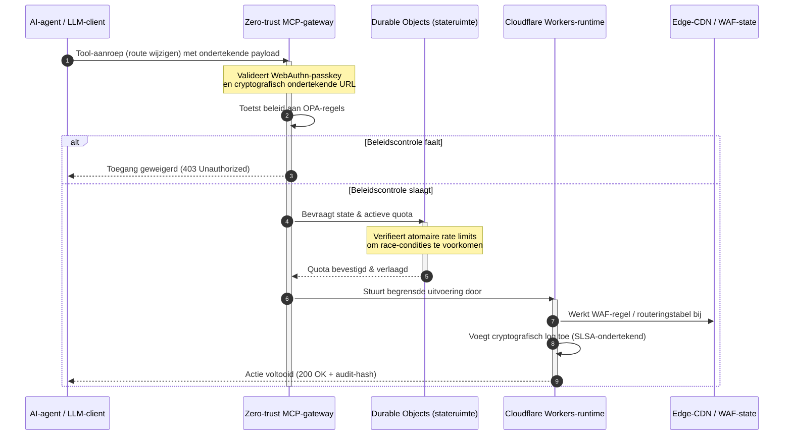

---

# Front Matter (YAML)

author: "contact@sebastienrousseau.com (Sebastien Rousseau)"
banner_alt: "Verlicht datacenter-rackstack bij nacht — symbool voor de inspecteerbare, agent-bestuurbare, open source edge waarop CloudCDN is gebouwd"
banner_height: "1597"
banner_width: "2584"
banner: "https://cloudcdn.pro/stocks/images/alis-po-IdVNRv-5wJo.webp"
cdn: "https://cloudcdn.pro"
charset: "UTF-8"
cname: "sebastienrousseau.com"
copyright: "© Copyright 2025 - 2026 - Sebastien Rousseau. Alle rechten voorbehouden."
date: "11 juni 2026"
description: "CloudCDN maakt van de CDN een cryptografisch beveiligd, agent-bestuurbaar edge-controlevlak — zero-trust MCP-gateway, Durable Objects, SLSA Level 3, DORA-bewijs."
format-detection: "telephone=no"
hreflang: "nl"
icon: "https://cloudcdn.pro/clients/sebastienrousseau/v1/logos/sebastienrousseau.svg"
id: "https://sebastienrousseau.com/nl/2026-06-11-cloudcdn-open-source-blueprint-ai-native-edge-2026"
image_alt: "Zwart-witportret van Sebastien Rousseau"
image_height: "162"
image_width: "162"
image: "https://cloudcdn.pro/stocks/images/sebastienrousseau.webp"
keywords: "CloudCDN, AI-native edge, open source CDN, MCP-server, Cloudflare Workers, Durable Objects, zero trust, WebAuthn, ondertekende URLs, SLSA Level 3, DORA, edge-controlevlak"
language: "nl"
last_reviewed: "2026-06-11"
layout: "report"
locale: "nl_NL"
logo_alt: "Logo van Sebastien Rousseau"
logo_height: "44"
logo_width: "44"
logo: "https://cloudcdn.pro/clients/sebastienrousseau/v1/logos/sebastienrousseau.svg"
menu: ""
measurementID: "G-169G4ET5HQ"
name: "Sebastien Rousseau"
permalink: "https://sebastienrousseau.com/nl/2026-06-11-cloudcdn-open-source-blueprint-ai-native-edge-2026"
rating: "general"
referrer: "no-referrer"
robots: "index, follow"
schema: "FAQPage, Article"
seo_title: "CloudCDN: open source AI-native edge-blauwdruk"
short_name: "sebastienrousseau"
subtitle: "Van statische contentcaching naar een cryptografisch beveiligd, agent-bestuurbaar edge-controlevlak voor de wereldwijde CDN."
tags: "CloudCDN, open source, CDN, edge, AI-agents, MCP, Cloudflare Workers, Durable Objects, rate limiting, zero trust, WebAuthn, SLSA, DORA, BCBS 239, Basel III, cloud-native banking"
theme-color: "0, 83, 191"
title: "CloudCDN: een open source blauwdruk voor de AI-native edge in 2026"
url: "https://sebastienrousseau.com/nl/2026-06-11-cloudcdn-open-source-blueprint-ai-native-edge-2026"
viewport: "width=device-width, initial-scale=1, shrink-to-fit=no"

# RSS - The RSS feed front matter (YAML).
atom_link: "https://sebastienrousseau.com/2026-06-11-cloudcdn-open-source-blueprint-ai-native-edge-2026/rss.xml"
category: "Technology"
docs: https://validator.w3.org/feed/docs/rss2.html
generator: "Static Site Generator (SSG) (version 0.0.26)"
item_description: "CloudCDN maakt van de CDN een cryptografisch beveiligd, agent-bestuurbaar edge-controlevlak — zero-trust MCP-gateway, Durable Objects, SLSA Level 3, DORA-bewijs."
item_guid: "https://sebastienrousseau.com/2026-06-11-cloudcdn-open-source-blueprint-ai-native-edge-2026/rss.xml"
item_link: "https://sebastienrousseau.com/2026-06-11-cloudcdn-open-source-blueprint-ai-native-edge-2026/rss.xml"
item_pub_date: "Thu, 11 Jun 2026 06:06:06 +0000"
item_title: "CloudCDN: een open source blauwdruk voor de AI-native edge in 2026"
last_build_date: "Thu, 11 Jun 2026 06:06:06 +0000"
managing_editor: "contact@sebastienrousseau.com (Sebastien Rousseau)"
pub_date: "Thu, 11 Jun 2026 06:06:06 +0000"
ttl: "60"
type: "article"
webmaster: "contact@sebastienrousseau.com"

# Apple - The Apple front matter (YAML).
apple_mobile_web_app_orientations: "portrait"
apple_touch_icon_sizes: "192x192"
apple-mobile-web-app-capable: "yes"
apple-mobile-web-app-status-bar-inset: "black"
apple-mobile-web-app-status-bar-style: "black-translucent"
apple-mobile-web-app-title: "CloudCDN: open source AI-native edge-blauwdruk"
apple-touch-fullscreen: "yes"

# MS Application - The MS Application front matter (YAML).

msapplication-navbutton-color: "0, 83, 191"

# Twitter Card - The Twitter Card front matter (YAML).

twitter_card: "summary_large_image"
twitter_creator: "@wwdseb"
twitter_description: "CloudCDN maakt van de CDN een cryptografisch beveiligd, agent-bestuurbaar edge-controlevlak — zero-trust MCP-gateway, Durable Objects, SLSA Level 3, DORA-bewijs."
twitter_image: "https://cloudcdn.pro/clients/sebastienrousseau/v1/logos/sebastienrousseau.svg"
twitter_image_alt: "Logo van Sebastien Rousseau"
twitter_site: "@wwdseb"
twitter_title: "CloudCDN: open source AI-native edge-blauwdruk"
twitter_url: "https://sebastienrousseau.com/2026-06-11-cloudcdn-open-source-blueprint-ai-native-edge-2026"

excerpt: "CloudCDN is een open source blauwdruk voor de AI-native edge — een zero-trust MCP-gateway met 42 tools, atomair rate limiting via Durable Objects, WebAuthn-passkeys, ondertekende URLs, SLSA Level 3-provenance en 3.185 tests bij 100% dekking, gekoppeld aan DORA, BCBS 239 en Basel III."

# Humans.txt - The Humans.txt front matter (YAML).
author_website: "https://sebastienrousseau.com"
author_twitter: "@wwdseb"
author_location: "London, UK"
thanks: "Bedankt voor het lezen!"
site_last_updated: "2026-06-11"
site_standards: "HTML5, CSS3, RSS, Atom, JSON, XML, YAML, Markdown, TOML"
site_components: "Kaishi, Kaishi Builder, Kaishi CLI, Kaishi Templates, Kaishi Themes"
site_software: "Static Site Generator, Rust"

---

# CloudCDN: een open source blauwdruk voor de AI-native edge in 2026

<!-- lead-start: manual -->
<aside class="post-lead" aria-label="Samenvatting artikel">

<strong>TL;DR.</strong> Enterprise-technologie in 2026 wordt bepaald door de samenkomst van wereldwijd gedistribueerde serverless-uitvoering en agentische AI. Standaard-CDN's — gebouwd voor het cachen van statische bestanden en elementaire verkeersroutering — zijn structureel verouderd in een tijdperk van actieve, realtime data-orkestratie. CloudCDN is een open source blauwdruk die de edge herinricht als een actief controlevlak: serverless-runtimes, stateful coördinatie via Cloudflare Durable Objects, en een zero-trust Model Context Protocol (MCP)-gateway waarmee autonome AI-agents webinfrastructuur bedienen binnen begrensde, cryptografisch beveiligde operationele kaders.

<strong>Belangrijkste punten</strong>

<ul class="post-lead-takeaways">
  <li><strong>Van statische cache naar begrensd controlevlak.</strong> CloudCDN verplaatst de operationele grens naar de edge en maakt van CDN-knooppunten actieve beleidspoorten die beveiligings-, routerings- en toegangsbeslissingen in sub-milliseconden uitvoeren.</li>
  <li><strong>Stateful edge-coördinatie.</strong> Cloudflare Durable Objects dwingen atomair, realtime rate limiting en statecoördinatie wereldwijd af — geen gedistribueerde race-condities, geen systemisch quotamisbruik over edge-regio's heen.</li>
  <li><strong>Veilig agentisch infrastructuurbeheer via MCP.</strong> Een zero-trust gateway stelt 42 gespecialiseerde MCP-tools beschikbaar, waarmee AI-agents infrastructuur inspecteren, configureren en bedienen binnen cryptografisch ondertekende grenzen.</li>
  <li><strong>Toeleveringsketenbeveiliging als pipeline-deliverable.</strong> SLSA Level 3-buildprovenance via Sigstore/Cosign en 3.185 unit tests bij 100% dekking op elke release.</li>
  <li><strong>Bewijs op bestuursniveau, geen dashboards.</strong> Edge-telemetrie sluit direct aan op de bestuursverantwoordelijkheid van DORA artikel 5, BCBS 239-risicorapportage en de Basel III-kapitaalregels voor operationeel risico.</li>
</ul>

<strong>Verwante lectuur:</strong> <a href="/2026-05-16-best-cloud-infrastructure-architecture-2026/">Cloudinfrastructuur-architectuur 2026</a> · <a href="/2026-06-05-cloud-native-banking-index-dora-resilience-platform-engineering-2026/">Cloud Native Banking Index 2026</a> · <a href="/2026-06-03-agentic-ai-index-banks-autonomy-governance-auditability-2026/">Agentic AI Index voor banken 2026</a>

</aside>
<!-- lead-end -->

Het CDN-debat is voorbij. De edge is geen cache meer; het is het controlevlak voor AI-native software. Nu agents tools aanroepen, data verplaatsen, caches purgen, ondertekende URLs aanvragen en workflows coördineren, is het oude model van ondoorzichtige dashboards en proprietaire controlevlakken niet langer een ongemak maar een regelgevende aansprakelijkheid. CloudCDN bepleit een ander model: een open, inspecteerbaar, agent-bestuurbaar edge-platform dat beveiliging, toegankelijkheid, prestaties en auditeerbaarheid behandelt als afdwingbare standaardinstellingen in plaats van leveranciersbeloften.

Het open source referentiepunt voor dit artikel is [cloudcdn.pro ⧉](https://github.com/sebastienrousseau/cloudcdn.pro "cloudcdn.pro"). De repository is een multi-tenant, AI-native CDN die end-to-end te lezen en zelfstandig te deployen is: TTFB onder de 100 ms over Cloudflare PoPs, MCP-besturing, rate limiting via Durable Objects, WCAG-AA-toegankelijkheid, ondertekende URLs, passkeys, SLSA Level 3 en 3.185 tests bij 100% dekking.

---

> **Managementsamenvatting / belangrijkste punten**
>
> - **De edge wordt de operationele grens.** CloudCDN maakt van standaard-CDN-knooppunten actieve beleidspoorten die beveiliging, routering en toegangscontrole in sub-milliseconden uitvoeren.
> - **Durable Objects maken rate limiting atomair.** Realtime, wereldwijd consistente quotahandhaving sluit het race-conditievenster dat eventueel consistente limiters openlaten voor aanvallers en haperende agents.
> - **Agents bedienen infrastructuur via 42 begrensde MCP-tools.** Elke aanroep wordt gevalideerd tegen WebAuthn-passkeys, ondertekende payloads en OPA-beleid voordat er iets wordt uitgevoerd.
> - **De toeleveringsketen is onderdeel van het product.** SLSA Level 3-provenance via Sigstore/Cosign koppelt elke release cryptografisch aan de geauditeerde broncode.
> - **Telemetrie is compliance-bewijs.** Edge-operaties sluiten aan op DORA artikel 5, BCBS 239 en Basel III-kapitaal voor operationeel risico — direct, niet via rapportage achteraf.
>
---

## Waarom dit open source project er in 2026 toe doet

Enterprise-IT is in 2026 verschoven van statische infrastructuurprovisioning naar realtime, event-gedreven data-orkestratie. Twee marktkrachten drijven die verschuiving.

De eerste is de opmars van agentische AI. Autonome modellen en softwareagents voeren inmiddels complexe operationele taken uit — geautomatiseerde dreigingsmitigatie, routeringsbeslissingen, realtime grootboekafstemming. Ze gebruiken geen dashboards. Ze roepen tools aan.

De tweede is de actieve handhaving van de [Digital Operational Resilience Act (DORA) ⧉](https://eur-lex.europa.eu/legal-content/EN/TXT/?uri=CELEX%3A32022R2554 "Verordening (EU) 2022/2554 betreffende digitale operationele weerbaarheid voor de financiële sector"). Bankinstellingen kunnen niet langer leunen op ondoorzichtige, proprietaire CDN's van derden. Toezichthouders eisen volledig zicht op de softwaretoeleveringsketen, aantoonbare exitcapaciteit en onveranderbare cryptografische audittrails.

Gecentraliseerde serverarchitecturen leggen latentiestraffen op die realtime orkestratie niet kan absorberen. Proprietaire CDN's functioneren als zwarte dozen die instellingen blootstellen aan compromittering van de toeleveringsketen die ze niet kunnen zien, laat staan bewijzen. CloudCDN dicht dat gat met een transparante, zero-trust, open source blauwdruk die van de edge een actief controlevlak maakt. Voor technologiebestuurders verschuift het gesprek daarmee van de kosten van compliance naar het rendement op weerbaarheid (Return on Resilience): kapitaal dat behouden blijft door geautomatiseerde, audit-klare operationele pipelines.

## De architectuurlens

De CloudCDN-architectuur is opgebouwd uit vijf lagen, waarbij gecentraliseerde middleware wordt vervangen door gelokaliseerde, stateful edge-primitieven:

| Laag | Ontwerpkeuze | Waarom het ertoe doet | Risico bij verkeerde aanpak |
|---|---|---|---|
| **Edge-runtime** | Cloudflare Workers en Pages | Elimineert de latentie van gecentraliseerde VM's; voert beleid wereldwijd in sub-milliseconden uit | Prestatiewinst zonder beleidsdiscipline leidt tot chaotische edge-drift |
| **Statecoördinatie** | Durable Objects | Garandeert atomaire, realtime consistentie voor rate limits en gedeelde state over regio's heen | Gedistribueerde race-condities, misbruik van API-resources, omzeilde perimeterquota's |
| **Agent-interface** | Zero-trust MCP-gateway | Stelt 42 gespecialiseerde MCP-tools beschikbaar zodat AI-agents infrastructuur bedienen binnen beheerde grenzen | Onbegrensde tool-aanroepen en ongeautoriseerde configuratiewijzigingen |
| **Toegangscontrole** | WebAuthn-passkeys en ondertekende URLs | Vervangt statische wachtwoorden door cryptografische handtekeningen voor auditeerbare operaties | Zwak toegeschreven wijzigingen; credential-diefstal die tot een perimeterdoorbraak leidt |
| **Kwaliteitspoorten** | SLSA Level 3 en 100% testdekking | Verifieert de buildbron wiskundig; blokkeert kwaadaardige dependency-injectie | Kwaadaardige code die via de softwaretoeleveringsketen binnenkomt |

## Operationele signalen om te volgen

Edge-gereedheid is meetbaar. Dit zijn de kwantitatieve indicatoren die uitvoeringscapaciteit aantonen in plaats van intentie:

| Signaal | Metriek / benchmark | Regelgevende referentie | Platformimplementatie |
|---|---|---|---|
| **42 MCP-tools** | Begrensd toolregister voor geautomatiseerd beheer | COBIT 2019 (BAI06) | MCP-gateway die agent-handtekeningen toetst aan OPA-beleid |
| **Durable Objects** | Lekvrije, atomaire quotahandhaving in sub-milliseconden | DORA artikel 6 | Durable Objects die de wereldwijde API-quotastatus bijhouden |
| **Passkeys en ondertekende URLs** | 100% van de beheersessies geverifieerd via FIDO2 WebAuthn | DORA artikel 30 | Cryptografische handtekeningcontroles ingebed in de edge-router |
| **SLSA Level 3** | Cryptografisch ondertekende buildmanifesten (Sigstore) | DORA artikel 30 | GitHub Actions-pipelines die ondertekende buildmetadata genereren |
| **3.185 unit tests** | 100% dekking; regressiepoorten op elke release | NIST CSF 2.0 (PR.DS-01) | CI-pipelines die deployment stilleggen bij elke testfout |

## De CDN wordt een actief controlevlak

Traditionele CDN's zijn ontworpen rond passieve versnelling van statische content. CloudCDN herdefinieert dat model. Met geïntegreerde Cloudflare Workers en Durable Objects functioneert de edge als een actieve, stateful beleidspoort.

Wanneer een AI-agent of geautomatiseerd proces een infrastructuurconfiguratiewijziging of routeringsaanpassing aanvraagt, praat het niet met een kwetsbare, gecentraliseerde database. Het verzoek wordt onderschept op het dichtstbijzijnde edge-knooppunt en doorloopt identiteits-, beleids- en quotacontroles voordat er iets wordt uitgevoerd:

Elke stap in die sequentie levert een herleidbaar, ondertekend record op. Dat is het verschil tussen een CDN die content versnelt en een controlevlak dat bestuurd kan worden.

## Waarom open source het vertrouwensmodel verandert

Voor Chief Information Security Officers vormen ondoorzichtige proprietaire CDN's een zichzelf versterkend risico. Closed source edge-netwerken zijn zwarte dozen: als de leverancier intern wordt gecompromitteerd, heeft de bank geen enkel zicht totdat het lek publiek wordt gemaakt.

CloudCDN vervangt die asymmetrie door een volledig auditeerbaar, open source vertrouwensmodel dat steunt op drie mechanismen:

1. **Wiskundige buildprovenance.** Onder SLSA Level 3 wordt elke release cryptografisch gekoppeld aan de open source GitHub-repository. Een CISO kan verifiëren — wiskundig, niet contractueel — dat de binary op de wereldwijde edge-knooppunten van Cloudflare exact de geauditeerde broncode bevat.
2. **Doorlopende, publieke beveiligingsaudits.** De codebase wordt onderworpen aan geautomatiseerde scans, publieke kwetsbaarheidsmeldingen en peer-reviewed code-audits. Obscuriteit is geen beheersmaatregel; review wel.
3. **Geen vendor lock-in (DORA artikel 28).** DORA verplicht banken een duidelijke, geteste exitstrategie aan te tonen voor kritieke derde aanbieders. Omdat CloudCDN open source is en op standaard serverless-primitieven is gebouwd, kunnen instellingen edge-configuraties migreren van Cloudflare naar andere serverless-runtimes of private Kubernetes-clusters — en die capaciteit aantonen bij de toezichthouder.

## Het bank-grade edge-patroon

CloudCDN is ontworpen om te voldoen aan de compliance-standaarden van de mondiale financiële sector en koppelt technische edge-operaties direct aan de kaders die toezichthouders daadwerkelijk toetsen:

- **Modelrisicobeheer ([US Fed SR 11-7 ⧉](https://www.federalreserve.gov/supervisionreg/srletters/sr1107.htm "Toezichtsrichtsnoeren voor modelrisicobeheer") / UK PRA SS1/23).** Autonome modellen die operationele taken uitvoeren, vallen onder modelrisicogovernance. De MCP-gateway van CloudCDN behandelt agentische tools als kwantitatieve modellen: strikte beleidsgrenzen, realtime logging en verplichte human-in-the-loop-overrides voor acties met grote impact.
- **BCBS 239 (aggregatie van risicodata).** Door transactiedata aan de edge vast te leggen, te taggen en te structureren, ontstaan operationele metrieken in realtime — conform de BCBS 239-eisen voor data-integriteit, tijdigheid en traceerbaarheid richting de toezichthouder.
- **DORA artikel 5 (bestuursverantwoordelijkheid).** Het bestuur draagt de uiteindelijke persoonlijke aansprakelijkheid voor operationele weerbaarheid. CloudCDN vertaalt edge-telemetrie naar gekwantificeerd, verifieerbaar bewijs dat niet-technische bestuurders kunnen meenemen naar een audit met persoonlijke aansprakelijkheid.
- **Basel III-kapitaal voor operationeel risico.** Banken houden regelgevend kapitaal aan tegen operationeel risico. Geautomatiseerde DR-failover en SLSA Level 3-provenance verlagen het operationeel risicoprofiel van de instelling — kapitaal dat op de balans behouden blijft, niet alleen een afgevinkte audit.

## Wat dit per banktype betekent

### Mondiaal systeemrelevante banken (G-SIB's)

G-SIB's verwerken enorme transactievolumes over meerdere jurisdicties. De prioriteit is het vervangen van gefragmenteerde legacy-perimetercontroles door één uniform edge-vlak. Met het CloudCDN-patroon kan een G-SIB beveiligingsbeleid, API-gateways en agentische governance wereldwijd standaardiseren — en DORA-conforme bewijspipelines genereren als bijproduct van de operatie in plaats van als kwartaalsprint.

### Transactiebanken en corporate banks

Voor transactiebanken is het klantgerichte product een bundel van uitvoeringssnelheid, beveiliging en datatransparantie. Met het CloudCDN-patroon kunnen deze banken beveiligde API-dashboards en realtime cash-trackingdiensten aanbieden aan corporate treasurers — een weerbare edge-houding die zakelijke deposito's verdedigt.

### Regionale en kleinere banken

Regionale banken staan tegenover dezelfde dreigingsactoren als G-SIB's, zonder de engineeringbudgetten. Een open source, bank-grade edge-blauwdruk levert de controles kant-en-klaar: directe regelgevende aansluiting zonder proprietaire licentiekosten, met de broncode als bewijs.

## Het draaiboek voor de bestuurskamer

Operationele weerbaarheid is niet langer een onzichtbare backoffice-IT-metriek; het is een bestuursprioriteit met persoonlijke aansprakelijkheid. De instellingen die in 2026 het vertrouwen van toezichthouders, klanten en aandeelhouders behouden, behandelen technologie als een verifieerbaar, observeerbaar bedrijfsmiddel.

De routekaart voor senior technologieleiders is kort:

1. **Maak bewijs een product.** Budgetteer voor geautomatiseerde, zelfdocumenterende pipelines aan de edge — bewijs dat de operatie zelf genereert, niet dat voor de auditor wordt samengesteld.
2. **Stap over op stateful edge-controle.** Haal rate limiting, WAF en identiteitsverificatie van gecentraliseerde servers af en breng ze onder bij atomaire edge-primitieven.
3. **Stel cryptografische agentische grenzen in.** Dwing zero-trust MCP-gateways af met passkey- en OPA-validatie voor elke geautomatiseerde tool-aanroep.
4. **Eis open source build-audits.** Maak SLSA Level 3-buildprovenance een voorwaarde voor deployment, geen ambitie.

## Veelgestelde vragen

**Is CloudCDN klaar voor DORA-audits?**

Ja. CloudCDN is ontworpen om geautomatiseerd compliance-bewijs te produceren dat direct aansluit op de ITS-templates van het Register of Information (RT.01 tot en met RT.15) en de contractuele bepalingen van DORA artikel 30.

**Wat is het voordeel van Durable Objects voor rate limiting?**

Traditionele gedistribueerde rate limiters leunen op eventuele consistentie, wat een latentievenster openlaat dat aanvallers of haperende agents kunnen uitbuiten. Durable Objects garanderen onmiddellijke, atomaire consistentie wereldwijd en sluiten dat race-conditievenster volledig.

**Wat maakt CloudCDN AI-native?**

De MCP-bestuurde operaties en het agent-bewuste controlemodel. Infrastructuur wordt bediend via 42 beheerde tools met cryptografische identiteit en beleidsgrenzen — ontworpen voor autonome workflows, niet alleen voor menselijke dashboards.

**Vergroot open source code het risico op zero-day-exploits?**

Nee. Proprietaire, closed source CDN's leunen op beveiliging door obscuriteit. De codebase van CloudCDN wordt doorlopend onderworpen aan geautomatiseerde tests, publieke peer review en SLSA Level 3-validatie — een aantoonbaar hogere vertrouwensdrempel.

## Referenties

- Europees Parlement en Raad van de Europese Unie, (2022). [Verordening (EU) 2022/2554 betreffende digitale operationele weerbaarheid voor de financiële sector (DORA) ⧉](https://eur-lex.europa.eu/legal-content/EN/TXT/?uri=CELEX%3A32022R2554 "Verordening (EU) 2022/2554 betreffende digitale operationele weerbaarheid voor de financiële sector (DORA)"). Brussel: Publicatieblad van de Europese Unie.
- Basel Committee on Banking Supervision (BCBS), (2013). [Beginselen voor effectieve aggregatie van risicodata en risicorapportage (BCBS 239) ⧉](https://www.bis.org/publ/bcbs239.htm "Beginselen voor effectieve aggregatie van risicodata en risicorapportage (BCBS 239)"). Bazel: Bank for International Settlements.
- Board of Governors of the Federal Reserve System, (2011). [Toezichtsrichtsnoeren voor modelrisicobeheer (SR Letter 11-7) ⧉](https://www.federalreserve.gov/supervisionreg/srletters/sr1107.htm "Toezichtsrichtsnoeren voor modelrisicobeheer (SR Letter 11-7)"). Washington D.C.: Federal Reserve.
- Cloudflare, (2026). [Documentatie Durable Objects: stateful edge-coördinatie ⧉](https://developers.cloudflare.com/durable-objects/ "Documentatie Durable Objects"). San Francisco: Cloudflare.
- Cloudflare, (2026). [AI-agents bouwen met MCP, authenticatie en Durable Objects ⧉](https://blog.cloudflare.com/building-ai-agents-with-mcp-authn-authz-and-durable-objects/ "AI-agents bouwen met MCP, authenticatie en Durable Objects").
- GitHub, (2026). [cloudcdn.pro-repository ⧉](https://github.com/sebastienrousseau/cloudcdn.pro "cloudcdn.pro-repository").

<!-- enrich-start -->
<aside class="author-card" aria-label="Over de auteur"><strong class="author-card-name"><a href="/about/index.html">Sebastien Rousseau</a></strong>Senior banking technologist, schrijft over toegepaste AI, betalingsinfrastructuur, getokeniseerd geld, ISO 20022, post-kwantumbeveiliging, cloud-native financiële dienstverlening, open source infrastructuur en gereguleerde digitale markten.Meer dan 20 jaar bij HSBC Commercial &amp; Investment Bank, PayPal, Barclays, Shazam, AKQA, Virgin Group. <a href="/about/index.html">Volledig profiel</a> &middot; <a href="https://www.linkedin.com/in/sebastienrousseau/" rel="external noopener">LinkedIn</a> &middot; <a href="https://github.com/sebastienrousseau" rel="external noopener">GitHub</a></aside>

Laatst beoordeeld <time datetime="2026-06-11">2026-06-11</time>.

<!-- enrich-end -->
