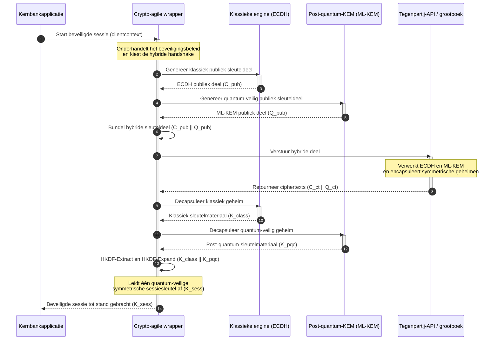

# KyberLib en de post-quantum-migratie van banken in 2026: van standaarden naar code

<!-- lead-start: manual -->
<aside class="post-lead" aria-label="Samenvatting artikel">

<strong>TL;DR.</strong> De bancaire infrastructuur staat in 2026 tegenover een systemische dreiging met een bekend eindpunt: rekenkracht op quantumschaal breekt de RSA- en ECC-sleuteluitwisseling die het transitverkeer van vandaag beschermt. Federale standaarden en toezichtnota's hebben het bewustzijn vergroot; de technische uitvoering blijft versnipperd. <a href="https://github.com/sebastienrousseau/kyberlib">KyberLib</a> is een open source-engineeringblauwdruk die het post-quantum-verhaal vertaalt naar concrete, geheugenveilige Rust-code — met een implementatie van door NIST gestandaardiseerde ML-KEM (FIPS 203) achter crypto-agile abstractiegrenzen, zodat instellingen transportbeveiliging en sleutel-encapsulatie kunnen opwaarderen voordat "Store Now, Decrypt Later"-aanvallen hun archieven bereiken.

<strong>Belangrijkste punten</strong>

<ul class="post-lead-takeaways">
  <li><strong>Van beleid naar inspecteerbare code.</strong> KyberLib verplaatst post-quantum-cryptografie van abstracte strategische roadmaps naar concrete, hoogperformante, auditeerbare Rust-implementaties.</li>
  <li><strong>Gestandaardiseerde FIPS 203 ML-KEM-uitvoering.</strong> De bibliotheek implementeert ML-KEM — het sleutelvaststellingsalgoritme dat onder NIST FIPS 203 definitief is gemaakt — en houdt conformiteit in lijn met mondiale toezichtverwachtingen.</li>
  <li><strong>Crypto-agility by design.</strong> Stabiele abstractiegrenzen laten bankapplicaties cryptografische primitieven wisselen zonder dure, foutgevoelige herschrijvingen van applicaties.</li>
  <li><strong>Geheugenveiligheid op Rust-niveau.</strong> Eigenaarschapsregels op compileertijd elimineren de bufferoverflows en geheugenlekken die legacy C-cryptobibliotheken teisteren, op zero-cost-abstractiesnelheid.</li>
  <li><strong>Beperking van fiduciaire aansprakelijkheid.</strong> Observeerbaar, testbaar migratiebewijs geeft bestuurders het "redelijke stappen"-dossier dat persoonlijke-aansprakelijkheidsaudits onder DORA artikel 5 vereisen.</li>
</ul>

<strong>Verwante artikelen:</strong> <a href="/2026-05-18-quantum-cryptography-standards-developments-2026/">Quantum-cryptografiestandaarden 2026</a>, <a href="/2026-05-28-dora-ai-act-data-sovereignty-banking-compliance-stack-2026/">DORA + AI Act compliance-stack</a>, <a href="/2026-05-20-cloud-native-banking-financial-institutions-2026/">Cloud-native bankieren</a>.

</aside>
<!-- lead-end -->

De post-quantum-migratie is geen planningsoefening meer. In 2026 is zij een actieve operationele vereiste, en de kloof tussen regelgevende intentie en technische uitvoering is waar het risico nu zit. [KyberLib ⧉](https://github.com/sebastienrousseau/kyberlib "kyberlib") dicht een deel van die kloof: een productiegerichte, geheugenveilige Rust-bibliotheek die ML-KEM implementeert volgens de definitieve FIPS 203-parameters en haar verpakt in de crypto-agile grenzen die de transactionele omgeving van een bank werkelijk nodig heeft.

---

> **Managementsamenvatting / belangrijkste punten**
>
> - **De dreiging is al operationeel.** Tegenstanders voeren vandaag "Store Now, Decrypt Later"-harvesting uit; datavertrouwelijkheid faalt met terugwerkende kracht op de dag dat een cryptografisch relevante quantumcomputer arriveert.
> - **De standaarden zijn definitief.** NIST FIPS 203 (ML-KEM) en FIPS 204 (ML-DSA) geven auditcommissies een helder, testbaar ijkpunt — het verweer "wachten op standaarden" bestaat niet meer.
> - **KyberLib is de engineeringblauwdruk.** Geheugenveilige Rust, `no_std`-compilatie voor HSM's en smartcards, en hybride handshake-patronen die klassieke interoperabiliteit behouden.
> - **Crypto-agility is het duurzame doel.** Stabiele abstractiegrenzen laten primitieven veranderen zonder applicatieherschrijvingen — de les die elk afzonderlijk algoritme overleeft.
> - **Besturen dragen de aansprakelijkheid.** DORA artikel 5 legt persoonlijke verantwoordelijkheid bij bestuurders; inspecteerbare, observeerbare migratiecode is het bewijs dat daaraan voldoet.
>
---

## Waarom dit open source-project er in 2026 toe doet

Nu asymmetrische cryptografie haar einde nadert, wacht de dreiging niet tot een cryptografisch relevante quantumcomputer is gebouwd. Tegenstanders voeren nu **"Store Now, Decrypt Later" (SNDL)**-aanvallen uit — zij oogsten versleutelde transitstromen van zakelijke banktransacties, handelsgeheimen en institutionele communicatie met de intentie die te ontsleutelen zodra quantumcapaciteiten volwassen zijn. Voor een bank is elke klassieke handshake die vandaag over de lijn gaat een vertrouwelijkheidsinbreuk met een uitgestelde ontploffingsdatum.

Toezichthouders hebben gereageerd met concrete verplichtingen:

1. **DORA artikel 6 (ICT-risicobeheer)** verplicht instellingen kwetsbaarheden in hun cryptografische omgeving in kaart te brengen, te identificeren en te mitigeren — inclusief de asymmetrische sleuteluitwisseling die begraven ligt in middleware die niemand heeft geïnventariseerd.
2. **NIST FIPS 203 en 204** vestigen de officiële post-quantum-standaarden voor sleutel-encapsulatie (ML-KEM) en digitale handtekeningen (ML-DSA), en geven auditcommissies een gestandaardiseerd ijkpunt waaraan zij migratievoortgang afmeten.

Deze migratie uitvoeren zonder lopende operaties te verstoren, vraagt meer dan beleidsnota's: het vraagt **inspecteerbare, open source cryptografische infrastructuur**. [KyberLib ⧉](https://github.com/sebastienrousseau/kyberlib "kyberlib") levert precies dat: een geheugenveilige Rust-bibliotheek conform FIPS 203 die de post-quantum-transitie omzet in een meetbare, verifieerbare engineeringpijplijn — en het gesprek over technologie-investeringen verschuift naar een tastbare Return on Resilience.

## De architectuurlens

KyberLib zit achter stabiele API-grenzen en schermt de transactionele kernapplicaties van een bank af van veranderingen in laag-niveau cryptografische primitieven.

| Laag | Ontwerpkeuze | Waarom het ertoe doet | Risico bij verkeerde aanpak |
|---|---|---|---|
| **Primitief** | FIPS 203 ML-KEM-sleutel-encapsulatie | Vervangt klassieke Diffie-Hellman- en RSA-sleuteluitwisseling door op roosters gebaseerde structuren | Non-conformiteit met de definitieve FIPS 203-parameters, met gefaalde compliance-audits tot gevolg |
| **Taal** | Geheugenveilige Rust-implementatie | Elimineert de geheugencorruptiekwetsbaarheden (bufferoverflows, use-after-free) die endemisch zijn in C/C++ | Wildgroei aan afhankelijkheden die de integriteit van de buildketen ondermijnt |
| **Abstractie** | Stabiele crypto-agile grenzen | Applicaties wisselen algoritmen achter één uniforme interface terwijl standaarden evolueren | Hard gecodeerde primitieven die bij elke toekomstige migratie handmatige herschrijvingen afdwingen |
| **Uitrol** | Hybride encryptie-handshakes | Combineert post-quantum-KEM's met klassieke algoritmen in een dubbel gewikkelde envelop | Verlies van legacy-interoperabiliteit of stille configuratiedrift |
| **Assurance** | SLSA Level 3-herkomst en inspecteerbare tests | Garandeert codebron en herkomst; voorbeelden zijn regel voor regel te auditen | Veiligheidstheater — black-box-bibliotheken waarvan implementatiefouten pas in productie opduiken |

## Operationele signalen om te volgen

Post-quantum-compliance aantonen tegenover raden van toezicht en toezichthouders betekent specifieke, kwantificeerbare metrieken volgen:

| Signaal | Metriek | Regelgevende referentie | Platformimplementatie |
|---|---|---|---|
| **FIPS 203 ML-KEM-conformiteit** | 100% naleving van de definitieve parameters (ML-KEM-512/768/1024) | NIST FIPS 203 | Parameter-geverifieerde roostercryptografie gecompileerd binnen KyberLib-modules |
| **Cryptografische inventaris** | Volledige inventaris van het gebruik van asymmetrische sleuteluitwisseling in alle systemen | NIST SP 1800-38 | Geautomatiseerde scanagents die actieve ciphersuites loggen in een centraal register |
| **Hybride sleuteluitwisseling** | Percentage transportlaag-handshakes dat in een hybride envelop draait | DORA artikel 6 | Netwerkproxy's die klassieke TLS 1.3-handshakes wikkelen in PQC-encapsulatie |
| **`no_std`-compilatie** | Vermogen om zonder de standaardbibliotheek van Rust te compileren voor beperkte targets | DORA artikel 30 | Conditionele `no_std`-compilatie in KyberLib voor Hardware Security Modules |
| **Crypto-agility-index** | Tijd in minuten om een cryptografisch primitief te wisselen over de API-gateway | UK PRA SS1/23 | Geabstraheerde routeringsregisters die algoritmetoewijzing beheren via runtimevariabelen |

## Waarom Rust ertoe doet voor post-quantum-cryptografie

Het implementeren van post-quantum-algoritmen zoals ML-KEM vereist complexe, laag-niveau wiskundige bewerkingen op polynoomringen. Historisch betekende het op productiesnelheid draaien van die bewerkingen handgeschreven C/C++ of assembly — een groot aanvalsoppervlak voor geheugencorruptie, in precies de code waar een bank zich het minst een fout kan veroorloven.

Rust verandert de beveiligingspositie van cryptografische engineering op drie concrete manieren:

1. **Geheugenveiligheid op compileertijd.** Het eigenaarschapsmodel van Rust garandeert dat bufferoverflows, double frees en use-after-free-fouten op compileertijd worden voorkomen. Dat telt extra zwaar voor post-quantum-bibliotheken, waar sleutelgroottes en ciphertexts aanzienlijk groter zijn dan hun klassieke tegenhangers.
2. **Deterministische, zero-cost abstracties.** Rust compileert naar native machinecode zonder garbage collector, zodat uitvoeringssnelheid en geheugenvoetafdruk C-bibliotheken evenaren of overtreffen met behoud van veiligheid.
3. **`no_std`-compatibiliteit.** KyberLib compileert zonder de standaardbibliotheek van Rust en draait dus in beperkte, bare-metal-omgevingen — Hardware Security Modules en smartcards inbegrepen — zodat cryptografie van bancaire kwaliteit binnen fysieke beveiligingsgrenzen blijft.

## Een crypto-agile architectuur ontwerpen

De klassieke faalwijze bij cryptografische migraties is hardcoderen: algoritmespecifieke aannames rechtstreeks ingebed in applicatielogica, bij elke transitie opnieuw pijnlijk herontdekt. Het duurzame doel voor 2026 is **crypto-agility** — een abstractielaag die algoritmen behandelt als verwisselbare modules achter een stabiele interface, zodat de volgende migratie een configuratiewijziging is in plaats van een herschrijving van het hele applicatiepark.

De sequentie hieronder toont hoe de crypto-agile wrapper van KyberLib een hybride (klassiek plus post-quantum) sleuteluitwisselings-handshake coördineert:

De hybride envelop is het operationeel belangrijke detail. Totdat post-quantum-primitieven jaren productie-ervaring hebben opgebouwd, wordt de sessiesleutel afgeleid van zowel het klassieke als het post-quantum-geheim: een aanvaller moet ECDH **en** ML-KEM breken om het kanaal te kraken. Tegenpartijen die nog niet zijn gemigreerd, blijven gewoon werken; tegenpartijen die dat wel zijn, krijgen onmiddellijk op roosters gebaseerde bescherming.

## Het draaiboek voor de bestuurskamer

Post-quantum-beveiliging is geen encryptiekwestie voor de backoffice; het is een governancevraagstuk voor de bestuurskamer met persoonlijke inzet. Senior managers horen de migratie te framen via fiduciaire verantwoordelijkheid:

- **DORA artikel 5 (governance en organisatie)** legt de persoonlijke verantwoordelijkheid voor ICT-beveiliging bij de raad van bestuur. Open source, observeerbare tests zijn het directe bewijs waar een persoonlijke-aansprakelijkheidsaudit om vraagt — "wij hebben een inspecteerbare FIPS 203-implementatie geselecteerd en dit zijn haar conformiteitsruns" is een verdedigbaar antwoord; "onze leverancier heeft ons gerustgesteld" is dat niet.
- **Modelrisicobeheer (US Fed SR 11-7 / UK PRA SS1/23)** geldt evenzeer voor cryptografische wrapper-architecturen als voor pricingmodellen. Abstractielagen horen door MRM-validatie te gaan, inclusief prestaties onder extreme verstoringsscenario's.
- **Operationeel-risicokapitaal onder Basel III** beloont aangetoonde controlematuriteit. Geteste hybride handshakes verlagen het operationele risicoprofiel van de instelling op lange termijn, drukken de kapitaalpremie en maken balanscapaciteit vrij voor actieve treasury-inzet.

## Wat dit betekent per banktype

### Mondiaal systeemrelevante banken (G-SIB's)

G-SIB's draaien transactionele omgevingen vol legacy, dus hun bindende beperking is ontdekking: weten waar asymmetrische sleuteluitwisseling daadwerkelijk plaatsvindt. Continue cryptografische inventarissen volgens de richtsnoeren van NIST SP 1800-38 komen eerst; KyberLib levert vervolgens de gestandaardiseerde, geheugenveilige bibliotheek om post-quantum-sleutel-encapsulatie uit te voeren op elk modern knooppunt dat de inventaris blootlegt.

### Transactie- en corporate banken

Vertrouwelijkheid over betaalrails is de franchise. Omdat KyberLib compileert naar bare-metal `no_std`-targets, kunnen transactiebanken post-quantum-handshakes rechtstreeks uitrollen binnen edge-hardware voor betalingsroutering en liquiditeitsbeheer — niet alleen in de applicatielaag.

### Regionale en kleinere banken

Regionale instellingen staan tegenover dezelfde staatsgesteunde harvesting zonder de onderzoeksbudgetten van een G-SIB. Een inspecteerbare, open source Rust-implementatie geeft hun onmiddellijk een kant-en-klaar pad naar NIST FIPS 203-conformiteit, zonder onderhandelingen over ondoorzichtige leveranciersroadmaps.

## Van roadmaps naar compilerende code

De post-quantum-transitie is een actieve engineeringtaak, en de instellingen die tot en met 2026 het vertrouwen van toezichthouders, tegenpartijen en corporate treasurers behouden, zijn de instellingen die van abstracte roadmaps naar observeerbare, compilerende code bewegen. Het bestuursmandaat volgt daar direct uit: auditeer de legacy-sleuteluitwisselingspunten, rol hybride handshakes uit op de kanalen met de hoogste waarde, en bouw de stabiele abstractiegrenzen die elke toekomstige primitiefwissel routinematig maken. KyberLib maakt van elk van die stappen een meetbare operationele capaciteit in plaats van een belofte op een slide.

## Veelgestelde vragen

**Voldoet KyberLib aan de definitieve NIST-standaarden?**

Ja. KyberLib is ontworpen rond de parameters van ML-KEM zoals definitief gemaakt in FIPS 203, zodat de gecompileerde bibliotheek in lijn blijft met federale en mondiale toezichtverwachtingen.

**Vereist een post-quantum-bibliotheek gespecialiseerde hardware?**

Nee. De Rust-implementatie van KyberLib compileert naar standaard systeemarchitecturen. Haar `no_std`-capaciteit laat haar bovendien draaien op gespecialiseerde Hardware Security Modules en smartcards waar fysiek sleutelbeheer vereist is.

**Hoe raakt "Store Now, Decrypt Later" de compliance van vandaag?**

Als de transportlaag op klassieke RSA of ECC leunt, kunnen tegenstanders vandaag verkeer oogsten en het ontsleutelen zodra quantumcapaciteit volwassen is. Hybride sleuteluitwisseling die nu wordt uitgerold, houdt onderschepte data achter op roosters gebaseerde bescherming.

**Waarom hybride handshakes in plaats van direct overstappen op post-quantum-primitieven?**

Hybride enveloppen leiden de sessiesleutel af van zowel een klassiek als een post-quantum-geheim, zodat de beveiliging standhoudt tenzij beide worden gebroken. Dat behoudt interoperabiliteit met niet-gemigreerde tegenpartijen terwijl de nieuwe primitieven productie-ervaring opbouwen.

## Referenties

- National Institute of Standards and Technology, (2024). [FIPS 203: Module-Lattice-Based Key-Encapsulation Mechanism Standard ⧉](https://www.nist.gov/news-events/news/2024/08/nist-releases-first-3-finalized-post-quantum-encryption-standards "NIST FIPS 203-aankondiging").
- Board of Governors of the Federal Reserve System, (2011). [Supervisory Guidance on Model Risk Management (SR Letter 11-7) ⧉](https://www.federalreserve.gov/supervisionreg/srletters/sr1107.htm "Federal Reserve SR 11-7").
- Europees Parlement en Raad van de Europese Unie, (2022). [Verordening (EU) 2022/2554 betreffende digitale operationele weerbaarheid voor de financiële sector (DORA) ⧉](https://eur-lex.europa.eu/legal-content/EN/TXT/?uri=CELEX%3A32022R2554 "DORA-verordening").
- NIST National Cybersecurity Center of Excellence, (2025). [Migration to Post-Quantum Cryptography (NIST SP 1800-38) ⧉](https://www.nccoe.nist.gov/projects/migration-post-quantum-cryptography "NIST SP 1800-38").
- GitHub, (2026). [kyberlib open source-repository ⧉](https://github.com/sebastienrousseau/kyberlib "kyberlib-repository").

<!-- enrich-start -->
<aside class="author-card" aria-label="Over de auteur"><strong class="author-card-name"><a href="/about/index.html">Sebastien Rousseau</a></strong>Senior banking technologist, schrijft over toegepaste AI, betalingsinfrastructuur, getokeniseerd geld, ISO 20022, post-kwantumbeveiliging, cloud-native financiële dienstverlening en gereguleerde digitale markten.Meer dan 20 jaar bij HSBC Commercial &amp; Investment Bank, PayPal, Barclays, Shazam, AKQA, Virgin Group. <a href="/about/index.html">Volledig profiel</a> &middot; <a href="https://www.linkedin.com/in/sebastienrousseau/" rel="external noopener">LinkedIn</a> &middot; <a href="https://github.com/sebastienrousseau" rel="external noopener">GitHub</a></aside>

Laatst beoordeeld <time datetime="2026-05-29">2026-05-29</time>.

<!-- enrich-end -->
