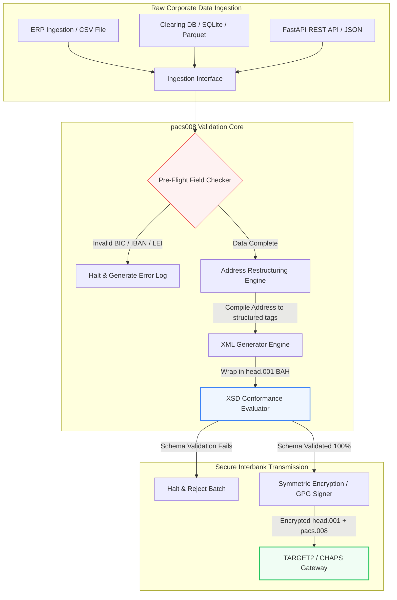

---

# Front Matter (YAML)

author: "contact@sebastienrousseau.com (Sebastien Rousseau)"
banner_alt: "Kantoormedewerker met spraakassistent en laptop — symbool voor de gestructureerde, machineleesbare interbancaire betaalberichten die pacs.008-automatisering programmeerbaar maakt"
banner_height: "1597"
banner_width: "2584"
banner: "https://cloudcdn.pro/stocks/images/tyler-prahm-lmV3gJSAgbo.webp"
cdn: "https://cloudcdn.pro"
charset: "UTF-8"
cname: "sebastienrousseau.com"
copyright: "© Copyright 2025 - 2026 - Sebastien Rousseau. Alle rechten voorbehouden."
date: "June 15, 2026"
description: "pacs008 is een open source Python-bibliotheek die ISO 20022 pacs.008 FI-to-FI klant-overboekingen genereert en valideert — gestructureerde adressen, BAH head.001-omhulling, BIC/LEI/IBAN-controlecijfers, OpenTelemetry UETR-tracing — gebouwd voor de SWIFT-overgang van november 2026."
format-detection: "telephone=no"
hreflang: "nl"
icon: "https://cloudcdn.pro/clients/sebastienrousseau/v1/logos/sebastienrousseau.svg"
id: "https://sebastienrousseau.com/2026-06-15-pacs008-automation-iso-20022-interbank-payments-2026"
image_alt: "Zwart-witportret van Sebastien Rousseau"
image_height: "162"
image_width: "162"
image: "https://cloudcdn.pro/stocks/images/sebastienrousseau.webp"
keywords: "pacs008, ISO 20022 pacs.008, FI-to-FI klant-overboeking, gestructureerd adres, SWIFT CBPR+, BAH head.001, TARGET2, CHAPS, Fedwire, DORA, BCBS 239, Basel III, UETR, LEI-validatie, SEPA VoP"
language: "nl-NL"
last_reviewed: "2026-06-15"
layout: "report"
locale: "nl_NL"
logo_alt: "Logo van Sebastien Rousseau"
logo_height: "44"
logo_width: "44"
logo: "https://cloudcdn.pro/clients/sebastienrousseau/v1/logos/sebastienrousseau.svg"
menu: ""
measurementID: "G-169G4ET5HQ"
name: "Sebastien Rousseau"
permalink: "https://sebastienrousseau.com/2026-06-15-pacs008-automation-iso-20022-interbank-payments-2026"
rating: "general"
referrer: "no-referrer"
robots: "index, follow"
schema: "FAQPage, Article"
seo_title: "pacs.008-automatisering voor het ISO 20022-tijdperk"
short_name: "sebastienrousseau"
subtitle: "Het pacs.008-bericht is waar interbancaire betaalgegevens, gestructureerde adressen, compliance, routing en afwikkeling samenkomen."
tags: "pacs008, ISO 20022, interbancaire betalingen, wholesale-betalingen, Python"
theme-color: "0, 83, 191"
title: "pacs.008-automatisering bouwen voor het ISO 20022-interbancaire tijdperk in 2026"
url: "https://sebastienrousseau.com/2026-06-15-pacs008-automation-iso-20022-interbank-payments-2026"
viewport: "width=device-width, initial-scale=1, shrink-to-fit=no"

# RSS - The RSS feed front matter (YAML).
atom_link: "https://sebastienrousseau.com/2026-06-15-pacs008-automation-iso-20022-interbank-payments-2026/rss.xml"
category: "Finance"
docs: https://validator.w3.org/feed/docs/rss2.html
generator: "Static Site Generator (SSG) (version 0.0.26)"
item_description: "pacs008 biedt een open source Python-fundament voor het automatiseren van ISO 20022 FI-to-FI klant-overboekingen in het tijdperk van interbancaire betalingen."
item_guid: "https://sebastienrousseau.com/2026-06-15-pacs008-automation-iso-20022-interbank-payments-2026/rss.xml"
item_link: "https://sebastienrousseau.com/2026-06-15-pacs008-automation-iso-20022-interbank-payments-2026/rss.xml"
item_pub_date: "Mon, 15 Jun 2026 06:06:06 +0000"
item_title: "pacs.008-automatisering bouwen voor het ISO 20022-interbancaire tijdperk in 2026"
last_build_date: "Mon, 15 Jun 2026 06:06:06 +0000"
managing_editor: "contact@sebastienrousseau.com (Sebastien Rousseau)"
pub_date: "Mon, 15 Jun 2026 06:06:06 +0000"
ttl: "60"
type: "article"
webmaster: "contact@sebastienrousseau.com"

# Apple - The Apple front matter (YAML).
apple_mobile_web_app_orientations: "portrait"
apple_touch_icon_sizes: "192x192"
apple-mobile-web-app-capable: "yes"
apple-mobile-web-app-status-bar-inset: "black"
apple-mobile-web-app-status-bar-style: "black-translucent"
apple-mobile-web-app-title: "pacs.008-automatisering ISO 20022"
apple-touch-fullscreen: "yes"

# MS Application - The MS Application front matter (YAML).

msapplication-navbutton-color: "0, 83, 191"

# Twitter Card - The Twitter Card front matter (YAML).

twitter_card: "summary_large_image"
twitter_creator: "@wwdseb"
twitter_description: "pacs008 biedt een open source Python-fundament voor het automatiseren van ISO 20022 FI-to-FI klant-overboekingen in het tijdperk van interbancaire betalingen."
twitter_image: "https://cloudcdn.pro/clients/sebastienrousseau/v1/logos/sebastienrousseau.svg"
twitter_image_alt: "Logo van Sebastien Rousseau"
twitter_site: "@wwdseb"
twitter_title: "pacs.008-automatisering voor het ISO 20022-tijdperk"
twitter_url: "https://sebastienrousseau.com/2026-06-15-pacs008-automation-iso-20022-interbank-payments-2026"

excerpt: "pacs008 is een open source Python-toolkit die ISO 20022 FI-to-FI klant-overboekingen programmeerbaar maakt — gestructureerde adressen, validatie, routing, compliance-haken en de SWIFT-deadline van november 2026 standaard ingebouwd."

# Humans.txt - The Humans.txt front matter (YAML).
author_website: "https://sebastienrousseau.com"
author_twitter: "@wwdseb"
author_location: "London, UK"
thanks: "Bedankt voor het lezen!"
site_last_updated: "2026-06-15"
site_standards: "HTML5, CSS3, RSS, Atom, JSON, XML, YAML, Markdown, TOML"
site_components: "Kaishi, Kaishi Builder, Kaishi CLI, Kaishi Templates, Kaishi Themes"
site_software: "Static Site Generator, Rust"

---

# ISO 20022 pacs.008 interbancaire betalingen automatiseren met open source Python in 2026

<!-- lead-start -->
<aside class="post-lead" aria-label="Samenvatting van het artikel">

<strong>TL;DR.</strong> Onder de SWIFT CBPR+-richtlijnen ontmantelt de Structured Address Cliff van 14 november 2026 ongestructureerde postadressen in TARGET2, CHAPS, Fedwire, Lynx en SEPA. pacs008 is een open source Python-bibliotheek die de generatie en validatie van ISO 20022 FI-to-FI klant-overboekingen (pacs.008) automatiseert, betalingen omhult in Business Application Headers (BAH head.001) en compliance voor gestructureerde adressen in het datapad inbouwt voordat het bericht een clearingnetwerk raakt.

<strong>Belangrijkste punten</strong>

<ul class="post-lead-takeaways">
  <li><strong>De deadline voor gestructureerde adressen is absoluut.</strong> Na 14 november 2026 worden ongestructureerde adresblokken uitgefaseerd. pacs008 dwingt gestructureerde postadreselementen (<code>&lt;TwnNm&gt;</code>, <code>&lt;Ctry&gt;</code>, <code>&lt;PstCd&gt;</code>) af bij de datacompilatie om afwijzingen aan de netwerkgrens te voorkomen.</li>
  <li><strong>Uniforme berichtorkestratie.</strong> De kern-pacs.008-betalingspayload wordt omhuld in een conforme Business Application Header (head.001)-envelop, met een standaard round-trip-verwerkingsmodel.</li>
  <li><strong>Algoritmische integriteit.</strong> Ingebouwde validators voor BIC's en Legal Entity Identifiers (LEI's) met ISO 7064 Modulo 97-10-controlecijferberekeningen.</li>
  <li><strong>DORA-waardige traceerbaarheid.</strong> Volledige OpenTelemetry-instrumentatie op basis van de Unique End-to-End Transaction Reference (UETR) voor realtime auditlogs en cryptografische audithandtekeningen.</li>
  <li><strong>Behoud van fiduciaire verantwoordelijkheid op bestuursniveau.</strong> Lijnt de nauwkeurigheid van interbancaire berichten af met DORA Artikel 5, BCBS 239-rapportage en Basel III-kapitaalbesparingen voor operationeel risico.</li>
</ul>

<strong>Verwante lectuur:</strong> <a href="https://sebastienrousseau.com/2026-05-19-global-wholesale-payments-economics-2026">Wereldwijde wholesale-betalingen in 2026: ISO 20022, RTGS-vernieuwing en de economie van interoperabiliteit</a>, <a href="https://sebastienrousseau.com/2026-05-27-ai-operating-system-payments-fraud-routing-resilience-compliance-2026">AI als het besturingssysteem van betalingen: fraude, routing, veerkracht en compliance in 2026</a>, <a href="https://sebastienrousseau.com/2026-05-12-iso-20022-pacs008-structured-address-deadline">De pacs.008-deadline voor gestructureerde adressen van november 2026: een zesmaandenblik</a>.

</aside>
<!-- lead-end -->

Het overbruggen van de kloof tussen legacy financiële data en gestructureerde interbancaire berichten via een auditeerbare, schema-gevalideerde Python-pijplijn.

Het open source referentiepunt voor dit artikel is [pacs008 ⧉](https://github.com/sebastienrousseau/pacs008 "pacs008 — open source Python-bibliotheek"). De repository wordt gepositioneerd als een Python-bibliotheek voor het automatiseren van XML-berichten voor ISO 20022 pacs.008 FI-to-FI klant-overboekingen.

## Waarom dit open source-project ertoe doet in 2026

De wereldwijde clearinginfrastructuur voor interbancaire betalingen ondergaat haar diepgaandste modernisering in bijna een halve eeuw.

In juni 2026 nadert de financiële sector snel de **SWIFT Structured Address Cliff van 14 november 2026**. Vanaf die datum zullen SWIFT CBPR+-richtlijnen, samen met TARGET2, CHAPS, Fedwire en het Canadese Lynx, ongestructureerde postadresregels (alleen `<AdrLine>` binnen `<PstlAdr>`-blokken) officieel ontmantelen. Alle deelnemende financiële instellingen moeten adressen verzenden in hybride formaat (gestructureerd `<TwnNm>` en `<Ctry>`, met maximaal twee `<AdrLine>`-elementen voor resterende details) of in volledig gestructureerd formaat (afzonderlijke elementen voor straatnaam, huisnummer en postcode). Elk bericht dat niet aan dit criterium voldoet, wordt afgewezen aan de netwerkgrens.

Voor financiële instellingen creëert deze overgang grote operationele beperkingen:

1. **De afwijzingspenalty aan de grens.** Betalingen die niet voldoen aan de criteria voor gestructureerde adressen zullen onmiddellijke netwerkafwijzingen ondervinden, met transactievertragingen, liquiditeitsblokkades en operationele achterstanden als gevolg.
2. **SEPA Verification of Payee (VoP).** Verplicht alle Payment Service Providers (PSP's) binnen de SEPA-zone om de overeenkomst tussen de naam van de begunstigde en de IBAN te verifiëren vóór de uitvoering van overboekingen, wat een extra validatiehek aan de berichtinitiatie toevoegt.

[pacs008](https://github.com/sebastienrousseau/pacs008) lost dit probleem op. Het is een open source, lichtgewicht Python-bibliotheek die de conversie automatiseert van ruwe financiële data naar volledig gevalideerde, schema-conforme ISO 20022 pacs.008-berichten voor interbancaire klant-overboekingen. Door de kloof tussen legacy en gestructureerde data te overbruggen, levert pacs008 een hoog Return on Resilience (RoR), met behoud van werkkapitaal en zekerstelling van realtime-uitvoering over wereldwijde rails.

## Waarom ik pacs008 zo heb gebouwd

Ik heb `pacs008` geschreven, en het bovenstroomse zusterproject `pain001`, en ik
besteed mijn werkende leven aan wholesale payments en API-productmanagement. Die
combinatie verklaart waarom deze bibliotheek eruitziet zoals ze eruitziet, dus is
het de moeite waard de keuzes expliciet te maken in plaats van ze impliciet in de
code te laten.

**Validatie draait vóór generatie, niet erna.** De reflex in de meeste
betaallandschappen is een bericht genereren en het daarna controleren, omdat het
reviewproces zo is gevormd: er wordt een bestand geproduceerd, iemand bekijkt
het, uitzonderingen gaan naar een wachtrij. Die volgorde garandeert dat fouten
worden gevonden op het punt met de minste hefboom — nadat het samenstellen van
het bericht al is gedaan, en vaak nadat het het pand al heeft verlaten. Eerst
valideren betekent dat een niet-conform adres of een misvormd IBAN een
build-fout wordt in plaats van een afwijzing op het netwerk.

**De licentie is MIT omdat banken de validatielogica moeten kunnen lezen, niet
vertrouwen.** Een gesloten validator vraagt een instelling om andermans lezing
van de usage guidelines op goed geloof te aanvaarden. Dat is geen redelijke vraag
aan een team dat de regulatoire verplichting draagt. Elke regel in deze
bibliotheek kan worden geïnspecteerd, betwist en geforkt.

**Er wordt gevalideerd tegen de officiële XSD-schema's in plaats van tegen een
herimplementatie.** Een met de hand geschreven benadering van de ISO 20022-regels
loopt uit de pas met het feitelijke contract van het netwerk zodra een van beide
zijden verandert. De schema's zijn het contract; al het andere is een tweede bron
van waarheid die staat te wachten om het tegen te spreken.

**Ze richt zich op CI in plaats van op een reviewstap.** Een validator die iemand
moet onthouden te draaien, is een validator die onder tijdsdruk niet meer wordt
gedraaid — precies wanneer het er het meest toe doet.

Wat de bibliotheek bewust níét doet, is even bewust gekozen. Ze is een toolkit
voor de berichtlaag. Ze vervangt geen betaalengine, geen sanctiescreening en
evenmin het opschonen van de klantstamgegevens dat een instelling bij de bron
moet doen. Ze maakt dat opschonen afdwingbaar; ze doet het niet voor u.

## Architectuurperspectief van pacs008 in 2026

De pacs008-bibliotheek is gestructureerd als een geïsoleerde validatie- en generatie-engine, die ervoor zorgt dat ruwe invoer systematisch wordt geparseerd, verrijkt en in standaard-enveloppen wordt verpakt:

| Laag | Ontwerpbeslissing | Waarom het ertoe doet | Risico bij verkeerde aanpak |
|---|---|---|---|
| **Invoerlaag** | Inname van CSV, JSON, SQLite en Parquet | Sluit aan op de bestaande databronnen van bancaire integratieteams en voorkomt platformmigraties. | Inname van ruwe, niet-gevalideerde of corrupte datapayloads. |
| **Validatielaag** | Pre-flight-validatie tegen officiële XSD-schema's en aangepaste bedrijfsregels | Stopt de uitvoering en signaleert fouten voordat het betaalbestand naar het clearingnetwerk wordt verzonden. | Ongeldige XML-bestanden veroorzaken onmiddellijke netwerkafwijzingen en clearingvertragingen. |
| **BAH-enveloplaag** | Automatische Business Application Header (head.001)-omhulling | Standaardiseert berichtverzending en routing op basis van de `<MsgDefIdr>`-tag. | Verzending van ruwe pacs.008-payloads zonder de vereiste buitenenvelop, met systeemafwijzing als gevolg. |
| **Serialisatielaag** | Standaard XML- en ISO-conforme JSON-ondersteuning (TS 23029) | Maakt directe vertaling tussen XML- en JSON-payloads mogelijk, ter ondersteuning van moderne REST API en Kafka-streaming. | Gefragmenteerde datarepresentaties die de officiële ISO-richtlijnen schenden. |
| **Observability-laag** | OpenTelemetry-tracing op basis van de UETR | Legt gedetailleerde uitvoeringspaden en logs vast en biedt realtime-auditeerbaarheid. | Lacunes in tracing die operationele zichtbaarheid en auditing blokkeren. |

## Belangrijkste interbancaire signalen en regelgevende mijlpalen

Om operationele veerkracht van transacties aan te tonen, moeten senior technologie- en risicomanagers specifieke, kwantificeerbare compliance-indicatoren volgen:

| Signaal | Metriek / operationele benchmark | G20- / SWIFT- / DORA-referentie | Technische platformimplementatie |
|---|---|---|---|
| **Compliance gestructureerd adres** | % pacs.008-berichten dat volledig gestructureerde `<PstlAdr>`-velden gebruikt met aangewezen `<TwnNm>` en `<Ctry>`. | SWIFT SR 2026-deadline | Pre-flight-schemacontroles in pacs008 die ongestructureerde adresregels afwijzen. |
| **SEPA Verification of Payee** | Matchvalidatie tussen de naam van de begunstigde en de IBAN vóór berichtuitvoering. | SEPA VoP-verordening | Ingebouwde VoP-helperklassen die pre-validatiequery's op IBAN/BIC uitvoeren. |
| **BAH head.001-integratie** | Percentage uitgaande betalingspayloads dat met succes wordt omhuld in Business Application Headers. | TARGET2 / CBPR+-richtlijnen | BAH-omhullingssubsysteem dat de buiten-XML-envelop automatisch samenstelt. |
| **LEI Modulo-controlecijfer** | ISO 7064 Modulo 97-10-controlecijfervalidatie op `<LEI>`-blokken van debiteur en crediteur. | Mandaat Bank of England | Algoritmische controller die de integriteit van de 20-tekens identificator verifieert. |
| **Nauwkeurigheid UETR-tracking** | 100% van de gegenereerde betalingen voorzien van een geldige Unique End-to-End Transaction Reference. | SWIFT UETR-specificaties | Geautomatiseerde generatie en tracing van de 36-tekens UUIDv4-referentiecode. |

## Waarom Python de ideale on-ramp is voor interbancaire automatisering

Moderne betaalhubs en treasury-operationsteams vertrouwen in 2026 sterk op Python voor datatransformatie, financiële modellering en ERP-database-integratie.

Door gebruik te maken van een open source Python-bibliotheek behalen instellingen aanzienlijke voordelen:

1. **Lage cognitieve last en hoge interoperabiliteit.** Python fungeert als een samenhangende brug. Het stelt ontwikkelaars in staat eenvoudige scripts te schrijven die ruwe betalingsopdrachten uit legacy-databases halen, ze valideren tegen complexe internationale bankregels en conforme XML produceren binnen één uniforme workflow.
2. **Eliminatie van ondoorzichtige "black box"-vertalers.** Eigendomsmatige bankportalen rekenen vaak hoge licentiekosten voor maatwerk-betaalbestandsvertalers. Deze vertalers zijn proprietary black boxes, waardoor het voor securityteams onmogelijk is om te auditen hoe data wordt verwerkt of waar sleutels worden opgeslagen. Een open source, inspecteerbare bibliotheek als pacs008 garandeert volledige codetransparantie.
3. **Naadloze CI/CD-integratie.** pacs008 integreert direct in continuous integration- en deployment-pijplijnen, waardoor ontwikkelaars het testen van betaalbestanden kunnen automatiseren als onderdeel van hun standaard software delivery-cyclus.

## Een afgebakende interbancaire pijplijn ontwerpen

Een grote kwetsbaarheid in interbancaire clearing is "ongecontroleerde batchgeneratie" — bestanden genereren zonder een duidelijke, afgebakende verificatielus. pacs008 is ontworpen om te functioneren als de kernvalidatie-engine binnen een strikt gecontroleerde, meertraps transactiepijplijn.

De operationele stroom hieronder toont hoe ruwe transactiedata door de pacs008-pijplijn loopt om een cryptografisch beveiligd, schemaconform pacs.008-bestand te genereren dat is omhuld in een BAH-envelop:

## Het bestuurlijke playbook en fiduciaire aansprakelijkheid

Automatisering van interbancaire betalingen is een risicobeheer- en corporate governance-vraagstuk op bestuursniveau. Senior managers moeten de kwaliteit van transactiedata adresseren door de lens van fiduciaire verantwoordelijkheid en reductie van operationeel risico:

- **DORA Artikel 5 (bestuursverantwoordelijkheid).** Legt directe, persoonlijke aansprakelijkheid bij bestuursleden voor de veerkracht en beveiliging van de ICT-operatie van de instelling. Omdat interbancaire clearing een kritieke bedrijfsfunctie is, moeten besturen aantonen dat zij robuuste, gevalideerde en geautomatiseerde transactiecontroles hebben geïmplementeerd om operationele verstoringen of vertraagde betalingen te voorkomen.
- **BCBS 239 (aggregatie en rapportage van risicodata).** Eist dat rapportage van financiële transacties nauwkeurig, volledig en realtime gegenereerd is. pacs008 helpt instellingen om BCBS 239-conformiteit te bereiken door betalingsdata schoon gestructureerd en gevalideerd te leveren aan de bron, waardoor datalacunes en handmatige reconciliatiefouten die legacy-spreadsheets teisteren worden geëlimineerd.
- **Mitigatie van kapitaaleisen voor operationeel risico (Basel III).** Onder Basel III-richtlijnen verhogen hoge betalingsfoutpercentages en handmatige interventie-overhead de kapitaaleisen voor operationeel risico van de bank, waardoor kapitaal vastligt dat anders kan worden ingezet voor kredietverlening of investering. Automatisering van de betaalpijplijn minimaliseert deze kapitaalpremies direct en behoudt de waarde van de balans.

## Wat dit betekent per banktype

### Global Systemically Important Banks (G-SIB's)

G-SIB's beheren enorme, grensoverschrijdende transactievolumes van bedrijfsklanten. Hun primaire uitdaging is het herstellen van ongestructureerde legacy-data voordat deze het clearingnetwerk raakt. Door pacs008 te integreren in hun corporate banking-gateways kunnen G-SIB's geautomatiseerde validatiehulpprogramma's aan hun corporate clients leveren, de overhead van handmatige betalingsreparaties verminderen en realtime-uitvoering over het SWIFT-netwerk veiligstellen.

### Transactie- en corporate banks

Voor transactiebanken is de kwaliteit van betalingsdata een concurrentievoordeel. Door een open source, inspecteerbare validatietool als pacs008 aan corporate treasury-klanten aan te bieden, kunnen deze banken de onboarding versnellen, afwijzingen van betaalbestanden minimaliseren en klantvertrouwen opbouwen via superieure straight-through processing-percentages.

### Regionale en kleinere banken

Regionale banken moeten compliance met internationale betalingsstandaarden handhaven zonder de enorme technologiebudgetten van G-SIB's. pacs008 levert een lichtgewicht, kostenefficiënte en volledig conforme Python-gebaseerde oplossing, waardoor kleinere instellingen moderne, gestructureerde initiatiemogelijkheden voor betalingen kunnen aanbieden zonder dure proprietary middleware-licenties.

## Conclusie: de interbancaire clearing-routekaart

De aanstaande SWIFT-deadline van november 2026 voor gestructureerde adressen vertegenwoordigt een harde grens voor corporate treasury-operaties. Vertrouwen op legacy-spreadsheets, handmatige data-invoer en ongestructureerde betaalbestanden is een actief bedrijfsrisico.

Om transactiecontinuïteit veilig te stellen en operationele overhead te minimaliseren, moeten senior technologie- en finance-managers vandaag een duidelijke clearing-routekaart uitvoeren:

1. **Dwing validatie af aan de bron.** Verplicht dat alle betalingsopdrachten worden gevalideerd en geformatteerd volgens officiële ISO 20022 XSD-schema's voordat ze de ERP-grenzen van het bedrijf verlaten.
2. **Audit de datapijplijn.** Stap weg van handmatige spreadsheetverwerking en implementeer geautomatiseerde, inspecteerbare Python-gebaseerde workflows met pacs008.
3. **Implementeer hybride beveiliging.** Zorg dat gegenereerde betaalbestanden cryptografisch zijn ondertekend en versleuteld voor verzending, om aan zero-trust-netwerkverwachtingen te voldoen.
4. **Stem af met fiduciaire prioriteiten.** Rapporteer metrieken voor betalingsautomatisering en datakwaliteit formeel aan het bestuur, en kader de investering als een kritiek programma voor reductie van operationeel risico onder DORA.

## Veelgestelde vragen

**Is pacs008 conform de aanstaande SWIFT SR 2026-adresregels?**

Ja. pacs008 is ontworpen om de strikte SWIFT-mijlpaal van november 2026 voor gestructureerde adressen te ondersteunen, en dwingt de verplichte scheiding van postadreselementen (stad, land, postcode) in aangewezen ISO 20022 XML-velden af.

**Kan pacs008 betalingspayloads omhullen in Business Application Headers?**

Ja. Omdat pacs008 native ondersteuning biedt voor Business Application Header (BAH head.001)-omhulling, stelt het automatisch de buitenenvelop samen die TARGET2-, CHAPS- en CBPR+-netwerken vereisen.

**Waarom heeft een open source-bibliotheek de voorkeur boven proprietary bestandsvertalers?**

Proprietary vertalers zijn ondoorzichtige black boxes, waardoor securityaudits onmogelijk zijn. Een open source, peer-reviewed bibliotheek als pacs008 biedt volledige codetransparantie, waardoor securityteams kunnen verifiëren dat er tijdens verwerking geen gevoelige betalingsdata wordt blootgesteld.

**Welke identificatoren valideert pacs008?**

pacs008 levert ingebouwde validators voor Bank Identifier Codes (BIC's) en Legal Entity Identifiers (LEI's) met ISO 7064 Modulo 97-10-controlecijferberekeningen, plus IBAN-controlecijfervalidatie en UETR-uniciteitscontroles.

## Referenties

- SWIFT, (2024). *ISO 20022 mijlpaal gestructureerd adres november 2026*. La Hulpe: SWIFT. Beschikbaar op: [SWIFT ISO 20022-mijlpaal ⧉](https://www.swift.com/standards/iso-20022/iso-20022-bytes/call-action-november-2026 "SWIFT ISO 20022-mijlpaal").
- Bazels Comité voor Bankentoezicht (BCBS), (2013). *Principles for effective risk data aggregation and risk reporting (BCBS 239)*. Basel: Bank for International Settlements. Beschikbaar op: [BCBS 239-principes ⧉](https://www.bis.org/publ/bcbs239.htm "BCBS 239-principes").
- Europees Parlement en Raad van de Europese Unie, (2022). *Verordening (EU) 2022/2554 betreffende digitale operationele weerbaarheid voor de financiële sector (DORA)*. Brussel: Publicatieblad van de Europese Unie. Beschikbaar op: [DORA-verordening ⧉](https://eur-lex.europa.eu/legal-content/EN/TXT/?uri=CELEX%3A32022R2554 "DORA-verordening").
- GitHub, (2026). *pacs008 open source repository*. Beschikbaar op: [pacs008-repository ⧉](https://github.com/sebastienrousseau/pacs008 "pacs008-repository").

<!-- enrich-start -->
<aside class="author-card" aria-label="Over de auteur"><strong class="author-card-name"><a href="/about/index.html">Sebastien Rousseau</a></strong>Senior banking technologist die schrijft over toegepaste AI, ISO 20022-migratie, post-kwantumcryptografie voor financiële dienstverlening en de structurele transformatie van wholesale-betalingen.Meer dan 20 jaar bij HSBC Commercial &amp; Investment Bank, PayPal, Barclays, Shazam, AKQA, Virgin Group. <a href="/about/index.html">Volledig profiel</a> &middot; <a href="https://www.linkedin.com/in/sebastienrousseau/" rel="external noopener">LinkedIn</a> &middot; <a href="https://github.com/sebastienrousseau" rel="external noopener">GitHub</a></aside>

Laatst beoordeeld <time datetime="2026-06-15">2026-06-15</time>.

<aside class="related-posts" aria-labelledby="related-heading">
<h2 id="related-heading" class="related-heading">Verwante lectuur</h2>

<article class="related-card"><footer class="related-body"><h3><a href="https://sebastienrousseau.com/2026-05-19-global-wholesale-payments-economics-2026">Wereldwijde wholesale-betalingen in 2026: ISO 20022, RTGS-vernieuwing en de economie van interoperabiliteit</a></h3>
<time datetime="2026-05-19">2026-05-19</time>
</footer></article>
<article class="related-card"><footer class="related-body"><h3><a href="https://sebastienrousseau.com/2026-05-27-ai-operating-system-payments-fraud-routing-resilience-compliance-2026">AI als het besturingssysteem van betalingen: fraude, routing, veerkracht en compliance in 2026</a></h3>
<time datetime="2026-05-27">2026-05-27</time>
</footer></article>
<article class="related-card"><footer class="related-body"><h3><a href="https://sebastienrousseau.com/2026-05-12-iso-20022-pacs008-structured-address-deadline">De pacs.008-deadline voor gestructureerde adressen van november 2026: een zesmaandenblik</a></h3>
<time datetime="2026-05-12">2026-05-12</time>
</footer></article>

</aside>
<!-- enrich-end -->
