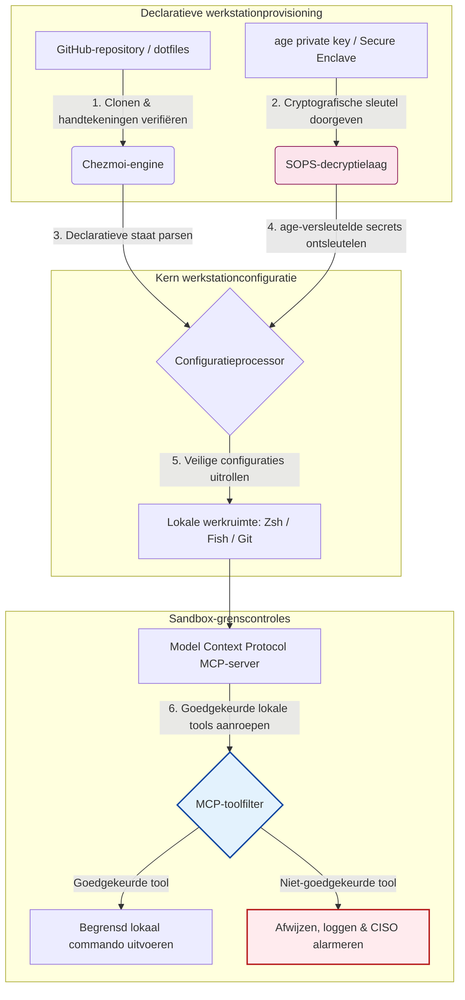

---

# Front Matter (YAML)

author: "contact@sebastienrousseau.com (Sebastien Rousseau)"
banner_alt: "Ontwikkelaarswerkstation in gedempt licht — symbool voor AI-bewuste, reproduceerbare, veilige dotfiles voor MCP-servers, SLSA-ondertekening, age/SOPS-secrets en multi-shell-pariteit"
banner_height: "1597"
banner_width: "2584"
banner: "https://cloudcdn.pro/stocks/images/almas-salakhov-Vq2ap8aFFEs.webp"
cdn: "https://cloudcdn.pro"
charset: "UTF-8"
cname: "sebastienrousseau.com"
copyright: "© Copyright 2025 - 2026 - Sebastien Rousseau. Alle rechten voorbehouden."
date: "16 juni 2026"
description: "AI-bewuste dotfiles vormen een veilig, reproduceerbaar werkstationmodel voor het MCP-tijdperk — declaratieve configuratie via Chezmoi, SOPS/age-secrets, SLSA Level 3-provenance, multi-shell-pariteit en begrensde sandbox-grenzen voor lokale AI-agents."
format-detection: "telephone=no"
hreflang: "nl"
icon: "https://cloudcdn.pro/clients/sebastienrousseau/v1/logos/sebastienrousseau.svg"
id: "https://sebastienrousseau.com/2026-06-16-ai-aware-dotfiles-secure-reproducible-workstation-2026"
image_alt: "Zwart-witportret van Sebastien Rousseau"
image_height: "162"
image_width: "162"
image: "https://cloudcdn.pro/stocks/images/sebastienrousseau.webp"
keywords: "dotfiles, Chezmoi, MCP, Model Context Protocol, SLSA, SOPS, age-encryptie, declaratieve configuratie, ontwikkelaarswerkstation, DORA Artikel 5, NIST CSF 2.0, leveringsketenbeveiliging, agentic AI, multi-shell-pariteit, Zsh, Fish, Nushell"
language: "nl-NL"
last_reviewed: "2026-06-16"
layout: "report"
locale: "nl_NL"
logo_alt: "Logo van Sebastien Rousseau"
logo_height: "44"
logo_width: "44"
logo: "https://cloudcdn.pro/clients/sebastienrousseau/v1/logos/sebastienrousseau.svg"
menu: ""
measurementID: "G-169G4ET5HQ"
name: "Sebastien Rousseau"
permalink: "https://sebastienrousseau.com/2026-06-16-ai-aware-dotfiles-secure-reproducible-workstation-2026"
rating: "general"
referrer: "no-referrer"
robots: "index, follow"
schema: "FAQPage, Article"
seo_title: "AI-bewuste dotfiles voor een veilig ontwikkelaarswerkstation"
short_name: "sebastienrousseau"
subtitle: "Het ontwikkelaarswerkstation maakt nu deel uit van de AI-leveringsketen; dotfiles vragen om security, reproduceerbaarheid, secrets-hygiëne en MCP-bewuste workflows."
tags: "dotfiles, ontwikkelaarstools, MCP, SLSA, veilig werkstation, chezmoi, macOS, Linux, WSL"
theme-color: "0, 83, 191"
title: "AI-bewuste dotfiles in 2026: een veilig, reproduceerbaar ontwikkelaarswerkstation voor MCP, SLSA en multi-shell-pariteit"
url: "https://sebastienrousseau.com/2026-06-16-ai-aware-dotfiles-secure-reproducible-workstation-2026"
viewport: "width=device-width, initial-scale=1, shrink-to-fit=no"

# RSS - The RSS feed front matter (YAML).
atom_link: "https://sebastienrousseau.com/2026-06-16-ai-aware-dotfiles-secure-reproducible-workstation-2026/rss.xml"
category: "Technology"
docs: https://validator.w3.org/feed/docs/rss2.html
generator: "Static Site Generator (SSG) (version 0.0.26)"
item_description: "Een overzicht van declaratieve dotfiles voor veilige, reproduceerbare ontwikkelaarswerkstations op macOS, Linux en WSL, met MCP-bewustzijn, SLSA, age, SOPS en multi-shell-pariteit."
item_guid: "https://sebastienrousseau.com/2026-06-16-ai-aware-dotfiles-secure-reproducible-workstation-2026/rss.xml"
item_link: "https://sebastienrousseau.com/2026-06-16-ai-aware-dotfiles-secure-reproducible-workstation-2026/rss.xml"
item_pub_date: "Tue, 16 Jun 2026 06:06:06 +0000"
item_title: "AI-bewuste dotfiles in 2026: een veilig, reproduceerbaar ontwikkelaarswerkstation voor MCP, SLSA en multi-shell-pariteit"
last_build_date: "Tue, 16 Jun 2026 06:06:06 +0000"
managing_editor: "contact@sebastienrousseau.com (Sebastien Rousseau)"
pub_date: "Tue, 16 Jun 2026 06:06:06 +0000"
ttl: "60"
type: "article"
webmaster: "contact@sebastienrousseau.com"

# Apple - The Apple front matter (YAML).
apple_mobile_web_app_orientations: "portrait"
apple_touch_icon_sizes: "192x192"
apple-mobile-web-app-capable: "yes"
apple-mobile-web-app-status-bar-inset: "black"
apple-mobile-web-app-status-bar-style: "black-translucent"
apple-mobile-web-app-title: "AI-bewuste dotfiles voor een veilig werkstation"
apple-touch-fullscreen: "yes"

# MS Application - The MS Application front matter (YAML).

msapplication-navbutton-color: "0, 83, 191"

# Twitter Card - The Twitter Card front matter (YAML).

twitter_card: "summary_large_image"
twitter_creator: "@wwdseb"
twitter_description: "Een overzicht van declaratieve dotfiles voor veilige, reproduceerbare ontwikkelaarswerkstations op macOS, Linux en WSL, met MCP-bewustzijn, SLSA, age, SOPS en multi-shell-pariteit."
twitter_image: "https://cloudcdn.pro/clients/sebastienrousseau/v1/logos/sebastienrousseau.svg"
twitter_image_alt: "Logo van Sebastien Rousseau"
twitter_site: "@wwdseb"
twitter_title: "AI-bewuste dotfiles voor een veilig ontwikkelaarswerkstation"
twitter_url: "https://sebastienrousseau.com/2026-06-16-ai-aware-dotfiles-secure-reproducible-workstation-2026"

excerpt: "AI-bewuste dotfiles in 2026 behandelen het ontwikkelaarswerkstation als infrastructuur in de leveringsketen — declaratieve, met chezmoi beheerde configuratie met MCP-bewustzijn, SLSA-ondertekende releases, age/SOPS-secrets, sub-seconde startup en pariteit tussen macOS, Linux en WSL."

# Humans.txt - The Humans.txt front matter (YAML).
author_website: "https://sebastienrousseau.com"
author_twitter: "@wwdseb"
author_location: "London, UK"
thanks: "Bedankt voor het lezen!"
site_last_updated: "2026-06-16"
site_standards: "HTML5, CSS3, RSS, Atom, JSON, XML, YAML, Markdown, TOML"
site_components: "Kaishi, Kaishi Builder, Kaishi CLI, Kaishi Templates, Kaishi Themes"
site_software: "Static Site Generator, Rust"

---

# AI-bewuste dotfiles in 2026: een veilig, reproduceerbaar ontwikkelaarswerkstation voor MCP, SLSA en multi-shell-pariteit

<!-- lead-start -->
<aside class="post-lead" aria-label="Artikelsamenvatting">

<strong>TL;DR.</strong> Het ontwikkelaarswerkstation is geen eindpunt meer; het is een actieve deelnemer in de software-leveringsketen en een directe interface voor het lokale AI-control-plane. Terminalgebaseerde AI-assistenten en <a href="https://modelcontextprotocol.io">Model Context Protocol (MCP)</a>-servers voeren lokale shell-commando's uit, inspecteren repositories en lezen gevoelige configuratiebestanden rechtstreeks. <a href="https://github.com/sebastienrousseau/dotfiles">Sebastien Rousseau's Dotfiles</a> is een declaratief, open-source framework dat veilige, reproduceerbare werkstations bouwt op macOS, Linux en Windows Subsystem for Linux (WSL) — met integratie van <a href="https://www.chezmoi.io/">Chezmoi</a>, <a href="https://github.com/getsops/sops">SOPS, age</a> en SLSA Level 3-buildprovenance voor geheugenveilige secrets-isolatie en begrensde uitvoeringspaden voor lokale AI-modellen.

<strong>Belangrijkste punten</strong>

<ul class="post-lead-takeaways">
  <li><strong>Werkstations zijn infrastructuur in de leveringsketen.</strong> Configuraties van ontwikkelmilieus moeten met dezelfde declaratieve striktheid worden behandeld als productie-serverdeployments, zodat handmatige configuratiedrift wordt geëlimineerd.</li>
  <li><strong>De uitdaging van het AI-control-plane.</strong> Terminalgebaseerde AI-modellen en MCP-tools kunnen lokale directories benaderen. Dotfiles moeten begrensde sandbox-grenzen, strikte tool-permissielijsten en onveranderlijke lokale logs afdwingen om datalekken te voorkomen.</li>
  <li><strong>Absolute pariteit tussen platforms.</strong> Identieke, sub-seconde shellprestaties en beveiligingsprofielen op macOS, Linux (Zsh, Fish, Nushell) en WSL, waardoor onboarding-tijd van ontwikkelaars wordt teruggebracht van weken naar minuten.</li>
  <li><strong>Cryptografisch veilige secrets-isolatie.</strong> Bestandsversleuteling met SOPS en age voorkomt dat hardcoded credentials (GitHub-tokens, cloud-accesskeys) in Git worden gecommit of door lokale LLM's worden gelezen.</li>
  <li><strong>Fiduciaire waarde op bestuursniveau.</strong> Vertaalt compliance voor werkstationconfiguratie naar duidelijke prioriteiten in de bestuurskamer, ter ondersteuning van DORA Artikel 5, NIST CSF 2.0-eindpuntstandaarden en reductie van Basel III Operationeel Risico.</li>
</ul>

<strong>Verder lezen:</strong> <a href="https://sebastienrousseau.com/2026-05-23-agentic-payments-banking-consent-liability-new-payment-ux-2026">Agentic Payments in Banking: Consent, Liability, and the New Payment UX in 2026</a>, <a href="https://sebastienrousseau.com/2024-03-12-revolutionising-real-time-speech-recognition-on-macos-with-openai-whisper/index.html">Fast Real-Time Speech Recognition on macOS: OpenAI Whisper</a>, <a href="https://sebastienrousseau.com/2024-02-26-google-gemma-ai-transforming-open-source-ai-development/index.html">Google Gemma AI: Transforming Open-Source AI Development</a>.

</aside>
<!-- lead-end -->

De brug slaan tussen declaratieve werkstationconfiguratie en veilige software-leveringsketens in een tijdperk van lokale AI-modellen en agentic ontwikkelaarstools.

Het open-source referentiepunt voor dit artikel is [dotfiles ⧉](https://github.com/sebastienrousseau/dotfiles "dotfiles — declaratieve werkstationconfiguratie"). De repository wordt gepositioneerd als: declaratieve dotfiles voor macOS, Linux en WSL, met multi-shell-pariteit, sub-seconde startup, SLSA-ondertekende releases en AI/MCP-bewuste configuratie.

## Waarom dit open-source project ertoe doet in 2026

In juni 2026 is het ontwikkelaarswerkstation de zwakste schakel in de software-leveringsketen en een doelwit van hoge waarde voor geavanceerde staatsgesponsorde en criminele cybersyndicaten.

De security van het ontwikkelmilieu is radicaal veranderd met de opkomst van terminalgebaseerde AI-codeerassistenten (zoals Claude Code) en de adoptie van het Model Context Protocol (MCP). Lokale ontwikkelaarsterminals hosten nu actieve, autonome AI-agents die in staat zijn tot:

- Lezen en bewerken van lokale broncodebestanden.
- Aanroepen van lokale CLI-tools (`git`, `npm`, `aws`, `kubectl`).
- Inspecteren van shell-omgevingsvariabelen, lokale databases en configuratie-instellingen.

Als het lokale milieu van de ontwikkelaar geen strikte grenzen kent, kunnen deze autonome AI-tools onbedoeld gevoelige persoonsgegevens lezen, cloud-credentials lekken naar publieke LLM-API's of kwaadaardige packages uitvoeren tijdens geautomatiseerde builds.

Onder de Digital Operational Resilience Act (DORA) en het NIST Cybersecurity Framework (CSF) 2.0 zijn financiële instellingen wettelijk verplicht om de provenance en beveiligingsintegriteit te verifiëren van elk apparaat dat toegang heeft tot de software-leveringsketen. "Snowflake-laptops" — handmatig geconfigureerde, niet-geaudite, driftende configuraties — voldoen niet langer aan de mondiale bankstandaarden.

[Sebastien Rousseau's Dotfiles](https://github.com/sebastienrousseau/dotfiles) lost dit probleem op. Het is een open-source, declaratief framework voor werkstationbeheer dat veilige, reproduceerbare ontwikkelaarswerkstations vestigt. Door een gestandaardiseerde, auditeerbare configuratiebasis af te dwingen, levert het project een hoog Return on Resilience (RoR), reduceert het de onboarding-tijd van ontwikkelaars van weken naar uren en beschermt het gevoelige financiële leveringsketens tegen eindpuntkwetsbaarheden.

## De architectuurbril voor het AI-bewuste werkstation 2026

Het dotfiles-framework opereert als een veilige, declaratieve milieubeheerder — alle lokale shells, tools en secrets worden systematisch beheerd, geaudit en geïsoleerd:

| Laag | Ontwerpkeuze | Waarom het ertoe doet | Risico bij verkeerde aanpak |
|---|---|---|---|
| **Provisioning-laag** | Declaratief configuratiebeheer via Chezmoi | Bouwt volledig reproduceerbare werkstations op macOS, Linux en WSL en elimineert drift. | Snowflake-configuraties met niet-geaudite, kwetsbare lokale staten. |
| **Shell-laag** | Multi-shell-pariteit (Zsh, Fish, Nushell) | Garandeert identieke, sub-seconde startup en consistent aliasgedrag in verschillende milieus. | Inconsistente shell-commando's die tot onverwachte scriptuitkomsten leiden. |
| **Secrets-laag** | Bestandsversleuteling met SOPS en age | Voorkomt dat hardcoded credentials en ruwe sleutels in Git worden gecommit of door lokale LLM's worden gezien. | Credentials gelekt naar publieke repositorygeschiedenis of gecompromitteerd door lokale agents. |
| **AI/MCP-laag** | Model Context Protocol-grenscontroles | Beperkt lokale AI-agents tot een specifieke lijst goedgekeurde tools en logt alle lokale uitvoeringen. | Onbegrensde AI-agents die op hol geslagen of destructieve commando's lokaal uitvoeren. |
| **Leveringsketen-laag** | SLSA-ondertekende releases en Sigstore-verificatie | Bewijst cryptografisch de authenticiteit van bootstrap-scripts en configuratiebestanden. | Gecompromitteerde setup-scripts die kwaadaardige backdoors injecteren in ontwikkelmilieus. |

## Belangrijke signalen voor werkstationbeveiliging en automatisering

Om absolute security te behouden over de gehele ontwikkelvloot moeten Chief Information Security Officers (CISO's) en technologiemanagers specifieke, kwantificeerbare operationele indicatoren volgen:

| Signaal | Metriek / operationele benchmark | NIST CSF / DORA-referentie | Technische platformimplementatie |
|---|---|---|---|
| **Werkstationreproduceerbaarheid** | % ontwikkelaarslaptops dat volledig wordt beheerd via declaratieve dotfile-repositories zonder configuratiedrift. | NIST CSF 2.0 (PR.DS-01) | Chezmoi-drift-detectieaudits die automatisch worden uitgevoerd bij het opstarten van de terminal. |
| **Credential-hygiëne** | Nul niet-versleutelde secrets of sleutels opgeslagen in platte tekst in lokale configuratiebestanden. | DORA Artikel 6 (ICT-security) | Git pre-commit hooks en lokale scans die niet-versleutelde bestanden weigeren. |
| **Build-provenance** | 100% van de bootstrap-utilities voor werkstations geverifieerd met cryptografisch ondertekende manifesten. | DORA Artikel 30 (leveringsketen) | Sigstore- en SLSA Level 3-verificatie ingebed in setup-pipelines. |
| **Onboarding-tijd ontwikkelaars** | Verstreken tijd vanaf ruwe hardware-uitlevering tot een volledig geconfigureerde, compliante ontwikkelwerkruimte. | Return on Resilience (RoR) | Geautomatiseerde, declaratieve setup-scripts die het milieu binnen 15 minuten compileren. |
| **Begrensde toegang van AI-agents** | Verificatie dat lokale AI-tools opereren binnen gedefinieerde directorygrenzen met read-only standaardinstellingen. | Model Risk Management | MCP-configuratieprofielen die de toolcatalogi van agents beperken tot goedgekeurde operaties. |

## Waarom declaratieve configuratie de kern is van werkstationbeveiliging

Traditionele aanpakken voor de setup van ontwikkelaarswerkstations zijn sterk handmatig en resulteren in "snowflake-laptops" — milieus waar configuraties in de loop van de tijd driften omdat ontwikkelaars eigen tools installeren, variabelen aanpassen en lokale scripts wijzigen. Deze drift creëert verschillende kritieke kwetsbaarheden:

1. **Niet-getraceerde schaduwconfiguraties.** Driftende laptops draaien vaak verouderde, kwetsbare softwarepackages of lokale scripts die zakelijke beveiligingstools omzeilen.
2. **Secrets-lekken.** Ontwikkelaars hardcoden vaak API-keys, GitHub-tokens of AWS-credentials rechtstreeks in platte-tekst scripts of shellprofielen, waardoor ze zeer kwetsbaar zijn voor diefstal.
3. **Inefficiënte onboarding.** Het handmatig opzetten van een nieuw ontwikkelaarswerkstation kan tot twee weken engineering-tijd kosten, met impact op teamsnelheid.

Door over te stappen op declaratieve, model-gedreven configuratie met Chezmoi wordt de gehele ontwikkelwerkruimte een versiebeheerd, reproduceerbaar systeem van vastlegging. Elke wijziging, alias, package-afhankelijkheid en beveiligingsstandaard wordt gedocumenteerd in Git, gevalideerd tegen het organisatorische compliancebeleid en cryptografisch geverifieerd voordat deze op de fysieke laptop wordt toegepast.

## Een begrensd AI-ontwikkelmilieu ontwerpen

Om te voorkomen dat lokale AI-agents en MCP-tools onbegrensde toegang krijgen tot lokale activa, moet het werkstation opereren als een begrensd uitvoeringsvlak.

De operationele flow hieronder laat zien hoe het dotfiles-framework Chezmoi, SOPS en age coördineert om veilige dotfiles te ontsleutelen en uit te rollen, terwijl een geïsoleerde, sandboxed uitvoeringsgrens wordt gehandhaafd voor lokale AI-agents die MCP-tools aanroepen:

## Het bestuurskamerdraaiboek en fiduciaire aansprakelijkheid

Werkstationbeveiliging en integriteit van de leveringsketen zijn kritieke prioriteiten op bestuursniveau. Senior managers moeten ontwikkelmilieurisico's behandelen door de bril van fiduciaire verantwoordelijkheid, regelgevingsnaleving en behoud van bedrijfswaarde:

- **DORA Artikel 5 (bestuursaansprakelijkheid).** Verplicht dat het bestuursorgaan (de raad) eindverantwoordelijk is voor het ICT-risicomanagement van de instelling. Omdat ontwikkelaarswerkstations de toegangspoort tot de software-leveringsketen zijn, moeten bestuursleden verifiëren dat eindpunten veilig, volledig auditeerbaar en beheerd onder strikte, reproduceerbare configuratieframeworks zijn om regelgevingsaudits te doorstaan.
- **NIST CSF 2.0-compliance (eindpuntbeveiliging).** Vereist dat alleen geautoriseerde en gevalideerde apparaten met gestandaardiseerde, veilige configuraties toegang krijgen tot bedrijfsnetwerken en repositories. Declaratieve dotfiles stellen security-teams in staat om wiskundig te bewijzen dat alle ontwikkelmilieus voldoen aan de beveiligingsbasis van de organisatie, waarmee het risico van niet-geaudite "snowflake"-setups wordt geëlimineerd.
- **Behoud van balanswaarde.** Een enkele gecompromitteerde ontwikkelaarscredential of leveringsketenbreuk kan een instelling miljoenen dollars kosten aan remediation, regelgevingsboetes en reputatieschade. De overgang naar een veilig, declaratief ontwikkelmilieu minimaliseert dit risico direct, behoudt balanswaarde en beschermt klantvertrouwen.

## Wat dit betekent per banktype

### Globaal Systeemrelevante Banken (G-SIB's)

G-SIB's beheren duizenden ontwikkelaarswerkstations op meerdere continenten en in meerdere regelgevingsjurisdicties. Hun primaire uitdaging is het handhaven van configuratieconsistentie en het voorkomen van credential-lekken in massale engineering-teams. Door een declaratief, open-source dotfiles-model met Chezmoi te adopteren, kunnen G-SIB's eindpuntbeveiliging standaardiseren, compliance-audits automatiseren en de onboarding-tijden van ontwikkelaars wereldwijd terugbrengen van weken naar minuten.

### Transactie- en zakelijke banken

Transactiebanken beheren gevoelige betaalgateways en wholesale clearing-infrastructuur. Het bewijzen van de absolute integriteit van de code die naar deze productiemilieus wordt uitgerold, is een niet-onderhandelbare regelgevingseis. Het standaardiseren van ontwikkelaarswerkstations onder een veilig, SLSA-compliant dotfiles-framework garandeert dat de software-leveringsketen volledig wordt geaudit en beschermd tegen kwetsbaarheden van lokale ontwikkelaarseindpunten.

### Regionale en kleinere banken

Regionale banken moeten hoge cybersecuritystandaarden handhaven zonder de enorme beveiligingsbudgetten van G-SIB's. Dit open-source dotfiles-framework levert een lichtgewicht, kosteneffectieve en zeer veilige Python- en Rust-vriendelijke oplossing, waarmee kleinere instellingen enterprise-grade eindpuntbeveiliging en leveringsketenbescherming kunnen implementeren zonder dure proprietary softwarelicenties.

## Conclusie: de routekaart voor het ontwikkelaarswerkstation

Het ontwikkelaarswerkstation is niet langer een randapparaat; het is een kritisch control plane in de software-leveringsketen. Toestaan dat handmatig geconfigureerde, niet-geaudite "snowflake-laptops" toegang krijgen tot bedrijfsmiddelen is een ernstig operationeel en regelgevend risico.

Om de software-leveringsketen te beveiligen en eindpunten te beschermen tegen kwetsbaarheden van lokale AI-agents, moeten senior technologie- en security-managers vandaag een duidelijke ontwikkelroutekaart uitvoeren:

1. **Verplicht declaratieve provisioning.** Fase handmatige, documentgeleide setup-processen uit en verplicht dat alle ontwikkelmilieus declaratief worden geprovisioneerd met Chezmoi.
2. **Dwing secrets-hygiëne af.** Dwing strikte pre-commit hooks en scan-utilities af om te garanderen dat nul ruwe credentials, sleutels of API-tokens in platte tekst worden opgeslagen in lokale werkstationconfiguraties.
3. **Vestig AI-sandbox-grenzen.** Implementeer veilige, begrensde MCP-configuratieprofielen om lokale AI-codeerassistenten en agents te beperken tot goedgekeurde, read-only tools en directories.
4. **Beveilig de leveringsketen.** Zorg dat alle bootstrap-scripts en milieuconfiguraties cryptografisch worden geverifieerd met SLSA Level 3-provenance voor uitrol.

## Veelgestelde vragen

**Wat is Chezmoi en waarom wordt het gebruikt voor dotfiles?**

Chezmoi is een open-source, veilige, declaratieve dotfile-manager. Het stelt ontwikkelaars in staat om hun lokale configuraties te beheren als een versiebeheerde repository, wat absolute consistentie en reproduceerbaarheid garandeert op verschillende besturingssystemen (macOS, Linux, WSL).

**Hoe beschermt het framework secrets?**

Het framework gebruikt SOPS (Secrets Operations) en age-bestandsversleuteling om gevoelige credentials (zoals GitHub-tokens of cloud-accesskeys) direct binnen de dotfile-repository te versleutelen. Dit voorkomt dat sleutels in platte tekst worden gecommit of door ongeautoriseerde lokale AI-agents worden gelezen.

**Wat is Model Context Protocol (MCP) en hoe beïnvloedt het de beveiliging?**

MCP is een open standaard die AI-modellen in staat stelt om veilig lokale tools uit te voeren en bestanden te benaderen. Het dotfiles-framework implementeert strikte MCP-configuratiebestanden om lokale AI-tools en agents te beperken tot goedgekeurde directories en commando's.

**Welke shells ondersteunt het framework?**

Bash, Zsh, Fish, Nushell en PowerShell — met pariteit op macOS, Linux en WSL, zodat het commandogedrag identiek blijft, ongeacht welke terminal een ontwikkelaar opent.

## Referenties

- Open Source Security Foundation (OpenSSF), (2024). *Supply-chain Levels for Software Artifacts (SLSA)*. Beschikbaar via: [SLSA Framework ⧉](https://slsa.dev/ "SLSA-framework").
- NIST, (2024). *NIST Cybersecurity Framework 2.0*. Gaithersburg: National Institute of Standards and Technology. Beschikbaar via: [NIST CSF 2.0 ⧉](https://www.nist.gov/cyberframework "NIST Cybersecurity Framework 2.0").
- Europees Parlement en Raad van de Europese Unie, (2022). *Verordening (EU) 2022/2554 betreffende digitale operationele veerkracht voor de financiële sector (DORA)*. Brussel: Publicatieblad van de Europese Unie. Beschikbaar via: [DORA-verordening ⧉](https://eur-lex.europa.eu/legal-content/EN/TXT/?uri=CELEX%3A32022R2554 "DORA-verordening").
- GitHub, (2026). *dotfiles open-source repository*. Beschikbaar via: [dotfiles-repository ⧉](https://github.com/sebastienrousseau/dotfiles "dotfiles-repository").

<!-- enrich-start -->
<aside class="author-card" aria-label="Over de auteur"><strong class="author-card-name"><a href="/about/index.html">Sebastien Rousseau</a></strong>Senior banking technologist, schrijft over toegepaste AI, ISO 20022-migratie, post-kwantumcryptografie voor financiële dienstverlening en de structurele transformatie van wholesale-betalingen.Meer dan 20 jaar bij HSBC Commercial &amp; Investment Bank, PayPal, Barclays, Shazam, AKQA, Virgin Group. <a href="/about/index.html">Volledig profiel</a> &middot; <a href="https://www.linkedin.com/in/sebastienrousseau/" rel="external noopener">LinkedIn</a> &middot; <a href="https://github.com/sebastienrousseau" rel="external noopener">GitHub</a></aside>

Laatst beoordeeld <time datetime="2026-06-16">2026-06-16</time>.

<aside class="related-posts" aria-labelledby="related-heading">
<h2 id="related-heading" class="related-heading">Verder lezen</h2>

<article class="related-card"><footer class="related-body"><h3><a href="https://sebastienrousseau.com/2026-05-23-agentic-payments-banking-consent-liability-new-payment-ux-2026">Agentic Payments in Banking: Consent, Liability, and the New Payment UX in 2026</a></h3>
<time datetime="2026-05-23">2026-05-23</time>
</footer></article>
<article class="related-card"><footer class="related-body"><h3><a href="https://sebastienrousseau.com/2024-03-12-revolutionising-real-time-speech-recognition-on-macos-with-openai-whisper/index.html">Fast Real-Time Speech Recognition on macOS: OpenAI Whisper</a></h3>
<time datetime="2024-03-12">2024-03-12</time>
</footer></article>
<article class="related-card"><footer class="related-body"><h3><a href="https://sebastienrousseau.com/2024-02-26-google-gemma-ai-transforming-open-source-ai-development/index.html">Google Gemma AI: Transforming Open-Source AI Development</a></h3>
<time datetime="2024-02-26">2024-02-26</time>
</footer></article>

</aside>
<!-- enrich-end -->
