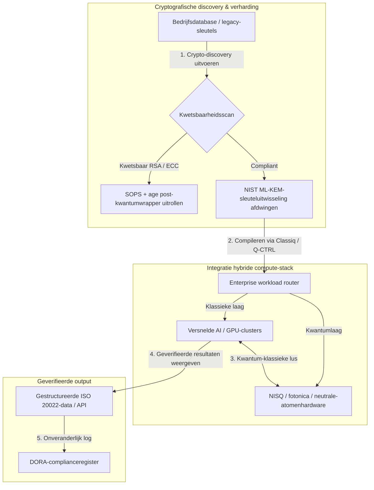

---

# Front Matter (YAML)

author: "contact@sebastienrousseau.com (Sebastien Rousseau)"
banner_alt: "Zicht op het podium van de Economist Impact 5th Annual Commercialising Quantum Global 2026-top in Londen — symbool voor de overgang van kwantumtechnologie van fysica-onderzoek naar enterprise-werkstromen"
banner_height: "1597"
banner_width: "2584"
banner: "https://cloudcdn.pro/stocks/images/sebastien-rousseau-20260617-5th-commercialising-quantum-2.webp"
cdn: "https://cloudcdn.pro"
charset: "UTF-8"
cname: "sebastienrousseau.com"
copyright: "© Copyright 2025 - 2026 - Sebastien Rousseau. Alle rechten voorbehouden."
date: "17 juni 2026"
description: "Bestuurskamerinzichten van de Economist Impact 5th Annual Commercialising Quantum Global 2026-top — $1,3 mld aan financiering, no-regrets hybride stacks, urgente migratie naar post-kwantumcryptografie, commercialisering van kwantumsensing en de HSBC-richtlijn dat afwachten een onnodige fout is."
format-detection: "telephone=no"
hreflang: "nl"
icon: "https://cloudcdn.pro/clients/sebastienrousseau/v1/logos/sebastienrousseau.svg"
id: "https://sebastienrousseau.com/2026-06-17-economist-commercialising-quantum-summit-2026"
image_alt: "Zwart-witportret van Sebastien Rousseau"
image_height: "162"
image_width: "162"
image: "https://cloudcdn.pro/stocks/images/sebastienrousseau.webp"
keywords: "Commercialising Quantum Global 2026, Economist Impact-top, post-kwantumcryptografie, NIST ML-KEM, harvest-now decrypt-later, SNDL, HSBC kwantum, Philip Intallura, kwantumsensing, GPS-onafhankelijke navigatie, NQCC, EU Quantum Act, Quantcore, qBIG-prijs, Lord Vallance, hybride kwantum-klassiek, DORA Artikel 6"
language: "nl-NL"
last_reviewed: "2026-06-17"
layout: "report"
locale: "nl_NL"
logo_alt: "Logo van Sebastien Rousseau"
logo_height: "44"
logo_width: "44"
logo: "https://cloudcdn.pro/clients/sebastienrousseau/v1/logos/sebastienrousseau.svg"
menu: ""
measurementID: "G-169G4ET5HQ"
name: "Sebastien Rousseau"
permalink: "https://sebastienrousseau.com/2026-06-17-economist-commercialising-quantum-summit-2026"
rating: "general"
referrer: "no-referrer"
robots: "index, follow"
schema: "FAQPage, Article"
seo_title: "Commercialising Quantum 2026: inzichten voor het bestuur"
short_name: "sebastienrousseau"
subtitle: "Kwantumtechnologie is overgegaan van speculatieve laboratoriumwetenschap naar hybride enterprise-werkstromen; het bestuur moet reageren op $1,3 mld aan financiering in 2026, onmiddellijke post-kwantummigratie en de HSBC-richtlijn om te stoppen met afwachten."
tags: "kwantum, post-kwantumcryptografie, NIST ML-KEM, harvest-now decrypt-later, kwantumsensing, HSBC, Economist Impact, hybride compute, DORA, EU Quantum Act, NQCC, inzichten top"
theme-color: "0, 83, 191"
title: "Van qubits naar winst: strategische inzichten van de 5th Annual Commercialising Quantum Global 2026-top van The Economist"
url: "https://sebastienrousseau.com/2026-06-17-economist-commercialising-quantum-summit-2026"
viewport: "width=device-width, initial-scale=1, shrink-to-fit=no"

# RSS - The RSS feed front matter (YAML).
atom_link: "https://sebastienrousseau.com/2026-06-17-economist-commercialising-quantum-summit-2026/rss.xml"
category: "Technology"
docs: https://validator.w3.org/feed/docs/rss2.html
generator: "Static Site Generator (SSG) (version 0.0.26)"
item_description: "Bestuurskamerinzichten van de Economist Impact 5th Annual Commercialising Quantum Global 2026-top — $1,3 mld aan financiering, no-regrets hybride stacks, urgente migratie naar post-kwantumcryptografie, commercialisering van kwantumsensing en de HSBC-richtlijn dat afwachten een onnodige fout is."
item_guid: "https://sebastienrousseau.com/2026-06-17-economist-commercialising-quantum-summit-2026/rss.xml"
item_link: "https://sebastienrousseau.com/2026-06-17-economist-commercialising-quantum-summit-2026/rss.xml"
item_pub_date: "Wed, 17 Jun 2026 06:06:06 +0000"
item_title: "Van qubits naar winst: strategische inzichten van de 5th Annual Commercialising Quantum Global 2026-top van The Economist"
last_build_date: "Wed, 17 Jun 2026 06:06:06 +0000"
managing_editor: "contact@sebastienrousseau.com (Sebastien Rousseau)"
pub_date: "Wed, 17 Jun 2026 06:06:06 +0000"
ttl: "60"
type: "article"
webmaster: "contact@sebastienrousseau.com"

# Apple - The Apple front matter (YAML).
apple_mobile_web_app_orientations: "portrait"
apple_touch_icon_sizes: "192x192"
apple-mobile-web-app-capable: "yes"
apple-mobile-web-app-status-bar-inset: "black"
apple-mobile-web-app-status-bar-style: "black-translucent"
apple-mobile-web-app-title: "Commercialising Quantum 2026: bestuursinzichten"
apple-touch-fullscreen: "yes"

# MS Application - The MS Application front matter (YAML).

msapplication-navbutton-color: "0, 83, 191"

# Twitter Card - The Twitter Card front matter (YAML).

twitter_card: "summary_large_image"
twitter_creator: "@wwdseb"
twitter_description: "Bestuurskamerinzichten van de Economist Impact 5th Annual Commercialising Quantum Global 2026-top — $1,3 mld aan financiering, no-regrets hybride stacks, urgente migratie naar post-kwantumcryptografie, commercialisering van kwantumsensing en de HSBC-richtlijn dat afwachten een onnodige fout is."
twitter_image: "https://cloudcdn.pro/clients/sebastienrousseau/v1/logos/sebastienrousseau.svg"
twitter_image_alt: "Logo van Sebastien Rousseau"
twitter_site: "@wwdseb"
twitter_title: "Commercialising Quantum 2026: inzichten voor het bestuur"
twitter_url: "https://sebastienrousseau.com/2026-06-17-economist-commercialising-quantum-summit-2026"

excerpt: "De Economist Impact 5th Annual Commercialising Quantum Global 2026-top bevestigde de pivot van kwantum naar enterprise-werkstromen: $1,3 mld opgehaald in vijf maanden, post-kwantumcryptografie is een fiduciair vraagstuk op bestuursniveau onder SNDL-harvesting, kwantumsensing wordt vandaag uitgerold voor GPS-onafhankelijke navigatie, en Philip Intallura van HSBC gaf de richtlijn dat wachten op fout-tolerante hardware een onnodige fout is."

# Humans.txt - The Humans.txt front matter (YAML).
author_website: "https://sebastienrousseau.com"
author_twitter: "@wwdseb"
author_location: "London, UK"
thanks: "Bedankt voor het lezen!"
site_last_updated: "2026-06-17"
site_standards: "HTML5, CSS3, RSS, Atom, JSON, XML, YAML, Markdown, TOML"
site_components: "Kaishi, Kaishi Builder, Kaishi CLI, Kaishi Templates, Kaishi Themes"
site_software: "Static Site Generator, Rust"

---

# Van qubits naar winst: strategische inzichten van de 5th Annual Commercialising Quantum Global 2026-top van The Economist

Enterprise-gereedheid, migraties naar post-kwantumcryptografie, hybride compute-stacks en het opkomende commerciële landschap van kwantumsensing en -netwerken.

**TL;DR.** De 5e jaarlijkse Commercialising Quantum Global 2026-conferentie, georganiseerd door Economist Impact op 16 en 17 juni 2026 in het Business Design Centre in Londen, bracht ruim 1.100 wereldwijde leiders bijeen uit het bedrijfsleven, finance, beleid en onderzoek. Het centrale thema markeerde een duidelijke structurele pivot: kwantumtechnologie is overgegaan van speculatieve laboratoriumwetenschap naar praktische, hybride enterprise-werkstromen. Met $1,3 miljard aan durfkapitaal opgehaald in alleen al de eerste vijf maanden van 2026, draait het bestuurskamerdebat niet meer om het tellen van fysieke qubits, maar om het opzetten van "no-regrets" hybride compute-stacks, het beveiligen van digitale activa tegen de cryptografische "harvest-now, decrypt-later"-dreiging (SNDL) en het uitrollen van kwantumsensingsystemen op korte termijn voor GPS-onafhankelijke navigatie.

## Belangrijkste inzichten

- **Verschuiving naar praktische enterprise-werkstromen.** Sectorleiders ([Steve Suarez](https://www.linkedin.com/in/stevesuarez) van HorizonX, [Phil Intallura](https://www.linkedin.com/in/intallura) van HSBC) benadrukten dat kwantumintegratie niet langer een fysicaprobleem is, maar een operationeel vraagstuk. Banken en bedrijven rollen hybride kwantum-klassieke pilots uit om talent voor te bereiden en actieve workloads te optimaliseren.
- **Post-kwantumcryptografie (PQC) is een bestuursprioriteit.** Security- en juridische experts (CMS UK, [Joanne Miller](https://www.linkedin.com/in/joanne-miller-nso) van Microsoft, [Craig Farrell](https://www.linkedin.com/in/craig-farrell) van EY) waarschuwden dat organisaties niet kunnen wachten op fout-tolerante hardware om PQC uit te rollen. "Harvest-now, decrypt-later"-oogsten gebeurt vandaag, waardoor migratie naar NIST ML-KEM-standaarden een onmiddellijk fiduciair vraagstuk wordt.
- **Kwantumsensing leidt de winstgevendheid op korte termijn.** Hoewel fout-tolerante computing nog jaren weg is, schaalt kwantumsensing ([Matthew Kinsella](https://www.linkedin.com/in/matthewkinsella) van Infleqtion) snel op. Kwantumklokken en inertiële sensoren worden uitgerold in GPS-onafhankelijke navigatie, nationale veiligheid en ultrastabiele energienetwerken.
- **Soevereiniteit, clusters en beleidsurgentie.** UK-wetenschapsminister [Lord Vallance](https://www.linkedin.com/in/patrick-vallance) en [Lord William Hague](https://www.linkedin.com/in/williamhague) schetsten nationale missies om onderzoek om te zetten in industriële "superclusters" in coördinatie met het National Quantum Computing Centre (NQCC). De aanstaande EU Quantum Act onderstreept verder de geopolitieke race om soevereine compute-capaciteit.
- **Quantcore wint de qBIG-prijs.** Quantcore, een spin-out van de University of Glasgow, won de IOP qBIG-prijs voor haar doorbraak met op niobium gebaseerde supergeleidende componenten, die op hogere temperaturen werken dan traditionele materialen en zo de overhead aan cryogene infrastructuur sterk verlagen.

**Verder lezen:** [KyberLib en de post-kwantum bankmigratie in 2026: van standaarden naar code](https://sebastienrousseau.com/2026-06-12-kyberlib-post-quantum-banking-migration-standards-code-2026/), [De Banking Resilience Index in 2026: AI, cloud, kwantum, betalingen en concentratierisico bij derden](https://sebastienrousseau.com/2026-06-08-banking-resilience-index-ai-cloud-quantum-payments-third-party-risk-2026/), [De Cloud Native Banking Index in 2026: DORA, platform engineering, soevereine cloud en operationele veerkracht](https://sebastienrousseau.com/2026-06-05-cloud-native-banking-index-dora-resilience-platform-engineering-2026/).

## 01. Waarom de top van 2026 ertoe doet voor het bestuur

De editie 2026 van de Commercialising Quantum Global-top van The Economist markeerde een permanente verschuiving in de manier waarop de bedrijfswereld deep tech beoordeelt.

Historisch werd kwantumcomputing afgedaan als R&D-aangelegenheid en als wetenschappelijke onderneming van meerdere decennia. In juni 2026 is dat perspectief achterhaald. Organisaties moeten overgaan van "fysica-gerichte" nieuwsgierigheid naar "business-gerichte" implementatie. De reden is tweeledig:

1. **De convergentie van kwantum en AI.** Stacks voor high-performance computing (HPC) smelten klassieke nodes, versnelde AI en NISQ-nodes (Noisy Intermediate-Scale Quantum) samen tot één geïntegreerde compute-laag. Organisaties die het bouwen van kwantum-gerede applicaties uitstellen, zullen ontdekken dat het venster om strategisch voordeel te behalen sneller sluit dan verwacht.
2. **Geopolitieke en fiduciaire urgentie.** Met het missie-gedreven kwantumprogramma van het Verenigd Koninkrijk en de aanstaande EU Quantum Act is kwantumcapaciteit een kwestie geworden van nationale soevereiniteit en bedrijfscontinuïteit.

Bovendien is post-kwantumcybersecurity niet langer een toekomstige compliancevereiste. De dreiging van vijandige "store-now, decrypt-later"-aanvallen (SNDL) betekent dat bedrijfsgegevens die vandaag worden onderschept, worden ontsleuteld zodra commerciële kwantumsystemen opschalen — wat een directe aansprakelijkheid creëert onder wereldwijde mandaten voor operationele veerkracht zoals de Digital Operational Resilience Act (DORA).

## 02. De strategische bril van Commercialising Quantum 2026

Technologieleiders in het bedrijfsleven moeten kwantumvolwassenheid in kaart brengen over vijf afzonderlijke operationele lagen, waarbij zij tijdshorizonten en balansrisico's afwegen.

### Tabel 1: De strategische bril van Commercialising Quantum 2026

| Laag | Bedrijfsfocus | Tijdspad / horizon | Belangrijkste bedrijfsrisico |
| ---- | ---- | ---- | ---- |
| **Hardware en compiler** | Keuze tussen concurrerende benaderingen (supergeleidend, gevangen ionen, neutrale atomen, fotonica) | 3 – 5 jaar (fout-tolerantie) | Vastlopen in een doodlopende architectuur of te vroeg op één platform inzetten. |
| **Cryptografische verharding** | Inventarisatie en in kaart brengen van cryptografische afhankelijkheden; migratie naar NIST ML-KEM | Onmiddellijk (actieve migratie) | Systemische datalekken en compliance-tekortkomingen onder DORA en NIST CSF 2.0. |
| **Kwantumsensing** | Uitrol van GPS-onafhankelijke navigatie, ultrastabiele klokken en gravimeters | 1 – 2 jaar (onmiddellijk commercieel) | Operationele verstoring van logistiek, scheepvaart en energienetwerken door GPS-jamming. |
| **Systeemintegratie** | Verbinden van kwantumhardware met bestaande klassieke HPC- en supercomputing-datacenters | 1 – 3 jaar (hybride fase) | Hoge latency, knelpunten in datatransfer en gefragmenteerde compute-silo's. |
| **Enterprise-software** | Beschikbaar maken van kwantumalgoritmes via abstractielagen en API's op hoog niveau (Classiq, Q-CTRL) | Onmiddellijk (skills-opbouw) | Isolatie van talent en werkstromen van de feitelijke engineering-uitvoering. |

## 03. Belangrijke kwantumsignalen en bestuurskamertriggers

Technologieleiders moeten specifieke, kwantificeerbare markt- en regelgevingsindicatoren volgen om hun kwantuminvesteringen te sturen.

### Tabel 2: Belangrijke kwantumsignalen en bestuurskamertriggers

| Signaal | Kwantitatieve metriek | Regelgevende / beleidsreferentie | Actiegerichte platformprioriteit |
| ---- | ---- | ---- | ---- |
| **Kwantumfinancieringsgolf** | $1,3 miljard wereldwijd opgehaald in de eerste vijf maanden van 2026 | Return on Resilience (RoR) | Verschuif budgetten van speculatieve pilots naar "no-regrets" hybride kwantum-klassieke workloads. |
| **Blootstelling aan dataontsleuteling** | 100% van de versleutelde data verzonden via publieke kanalen is blootgesteld aan SNDL-harvesting | DORA Artikel 6 (ICT-security) | Implementeer cryptografische discovery-tools om kwetsbare RSA-/ECC-sleutels in het gehele landschap te identificeren. |
| **Soevereine infrastructuur** | £2,5 miljard allocatie binnen de UK National Quantum Strategy | UK Quantum Missions / Lord Vallance | Bouw lokale partnerschappen met nationale superclusters zoals het NQCC. |
| **Compliancedeadlines** | Cutover naar gestructureerde SWIFT-adressen op 14 november 2026 | SWIFT SR 2026-richtlijn | Schoon en formatteer interbancaire databases om aan de gestructureerde XML-specificaties te voldoen. |

## 04. Verdieping in de centrale thema's van de top

### Kwantum bereikt een investeringskantelpunt

Durfkapitaalfinanciering is sterk versneld, met **$1,3 miljard** opgehaald in alleen de eerste vijf maanden van 2026. Anders dan de speculatieve hype-cycli van voorgaande jaren wordt de huidige kapitaalgolf onderbouwd door reële workloads op korte termijn. Sprekers van Classiq en het IBM Quantum Platform lieten zien hoe software-abstractielagen en geautomatiseerde compilers niet-gespecialiseerde ontwikkelteams in staat stellen om hybride kwantum-klassieke algoritmes uit te voeren op de klassieke infrastructuur van vandaag. Deze "no-regrets"-strategie stelt organisaties in staat om direct kwantum-gereed talent en werkstromen op te bouwen.

### Juridische en regelgevende waarschuwingen over "harvest-now, decrypt-later"

Juridisch partners en cybersecurity-bestuurders zorgden voor grote betrokkenheid rond de urgentie van datarisico. Vertegenwoordigers van sponsorend advocatenkantoor CMS UK en Microsoft-CSO [Joanne Miller](https://www.linkedin.com/in/joanne-miller-nso) brachten een scherpe waarschuwing aan het senior management: *wachten op de komst van fout-tolerante hardware voordat post-kwantumcryptografie wordt uitgerold, is een kritisch fiduciair tekortschieten.*

Onder het "store-now, decrypt-later"-paradigma (SNDL) oogsten vijandige actoren vandaag actief versleutelde bedrijfsgegevens met de bedoeling deze te ontsleutelen zodra cryptografisch relevante kwantumcomputers verschijnen. Organisaties moeten direct post-kwantumbeschermingen (zoals NIST ML-KEM) uitrollen om langlevende gevoelige datasets, intellectueel eigendom en historische klantgegevens te beschermen.

### De herijking van de "kwantumsensing"-hype

Hoewel fout-tolerante kwantumcomputing nog jaren weg is, zette de top kwantumsensing in de schijnwerpers als de eerste werkelijk winstgevende golf van praktische uitrol. CEO [Matthew Kinsella](https://www.linkedin.com/in/matthewkinsella) van Infleqtion lichtte toe hoe kwantumklokken, inertiële sensoren en radiofrequentiesystemen snel opschalen in meerdere sectoren.

Omdat deze technologieën fysische constanten meten met sub-atomaire precisie, maken zij **GPS-onafhankelijke navigatie**, ultrastabiele energienetwerken en deep-space-telecommunicatie mogelijk. Deze toepassingen zijn bijzonder relevant voor luchtvaart, maritiem transport en nationale defensiesystemen die te maken hebben met groeiende GPS-jammingdreigingen.

### Ecosysteem en clustersamenwerking

Het kwantumecosysteem van het Verenigd Koninkrijk gebruikte de Londense top om binnenlandse innovatie-superclusters te presenteren. Live-updates van het National Quantum Computing Centre (NQCC) en Digital Catapult lieten zien hoe deep-tech-spin-outs in een vroeg stadium de "technologiekloof" kunnen overbruggen door kwantumhardware rechtstreeks te integreren in klassieke supercomputing-datacenters.

[Wridhdhisom Karar](https://www.linkedin.com/in/wridhdhisomkarar), medeoprichter van de Schotse kwantumstartup Quantcore, ontving de prestigieuze Quantum Business Innovation and Growth (qBIG)-prijs van het Institute of Physics (IOP) voor de op niobium gebaseerde supergeleidende componenten van het bedrijf. Deze componenten werken op hogere temperaturen dan traditionele materialen en verlagen de cryogene infrastructuur-overhead die nodig is om kwantumprocessors op te schalen aanzienlijk.

### De HSBC-case study: waarom wachten op kwantum een "onnodige fout" is

Inzichten van [**Philip Intallura, Ph.D.**](https://www.linkedin.com/in/intallura) (Global Head of Quantum Technologies bij HSBC, adviseur van de Britse regering en board advisor) op de 5th Annual Commercialising Quantum Event (2026) van The Economist bevatten een krachtige bestuurskamerrichtlijn: *"Wachten op fout-tolerante kwantum voordat u begint, is een onnodige fout."*

Dr. Intallura betoogde dat de gebruikelijke "afwachten"-houding bij financiële instellingen een eigen doelpunt is, gebaseerd op drie onjuiste aannames:

- **Korte-termijn-ROI is reëel.** In empirische tests heeft HSBC modellen overtroffen die momenteel in productie draaien, kwantumwerk verbonden met andere bedrijfsonderdelen, kwantum gebruikt om relaties met enkele van de grootste klanten te verdiepen en aanzienlijke nieuwe business aangetrokken naar **HSBC Innovation Banking**.
- **Kwantum kent een steile adoptiecurve.** Het opbouwen van capability, het bepalen van strategie, het binnenhalen van financiering en het draaien van experimentcycli binnen een sterk gereguleerde organisatie is geen kortlopende onderneming. Processen moeten systematisch worden getest en aangepast aan de technologie.
- **Kwantum is een ecosysteem.** Geen enkele speler komt er alleen. Elk onderzoekspaper, POC en pilot die HSBC heeft uitgevoerd, is tot stand gekomen in nauwe samenwerking met een kwantumleverancier — en in sommige gevallen strekt de samenwerking zich uit tot academia, toezichthouders en overheid.

**Afsluitende bestuursrichtlijn:** *"De capability die u op dag één van fault tolerance nodig heeft, is de capability die u nu opbouwt."*

## 05. Bedrijfsmatige kwantumintegratie en cryptografie-pijplijn

Om digitale activa te beveiligen terwijl kwantumgereedheid wordt opgebouwd, moet de onderneming een duidelijke integratiepijplijn opzetten.

## 06. Het bestuurskamerdraaiboek: actiegerichte verplichtingen

Om de inzichten van de Commercialising Quantum Global 2026-top om te zetten in onmiddellijke bedrijfswaarde, moet het senior management het volgende bestuurskamerdraaiboek in vier stappen uitvoeren:

1. **Verplicht cryptografische discovery.** Geef de Chief Information Security Officer (CISO) opdracht alle cryptografische activa in kaart te brengen en elke legacy-RSA- en -ECC-sleutel in de gehele onderneming te catalogiseren ter voorbereiding op de post-kwantummigratie.
2. **Rol een "no-regrets" hybride strategie uit.** Wacht niet op perfecte hardware. Investeer in door kwantum geïnspireerde software en hybride klassiek-kwantumpilots om vandaag interne capabilities op te bouwen en complexe logistiek of risicoportefeuilles te optimaliseren.
3. **Beoordeel kwantumsensing voor logistiek.** Als uw organisatie afhankelijk is van mondiale toeleveringsketens, scheepvaart of kritieke infrastructuur, beoordeel dan actief kwantumsensingsystemen (zoals GPS-onafhankelijke navigatie) om geopolitieke verstoringsrisico's te beperken.
4. **Schrijf in voor het Insight Hour van 30 juni.** Zorg dat uw technologieleiders zich inschrijven voor het virtuele **Commercialising Quantum Global Insight Hour** op 30 juni 2026 om 15:00 uur BST (ondersteund door IonQ) om enterprise risk management en talentallocatiestrategieën te blijven volgen.

## 07. Veelgestelde vragen

**Wat is "harvest-now, decrypt-later" (SNDL) en waarom doet het er vandaag toe?**
SNDL is de praktijk om versleutelde data vandaag te onderscheppen en op te slaan met de bedoeling deze later te ontsleutelen zodra cryptografisch relevante kwantumcomputers beschikbaar komen. Langlevende gevoelige datasets — intellectueel eigendom, klantgegevens, overheidscommunicatie — worden nu al doelwit. Migratie naar NIST ML-KEM is een fiduciair besluit dat het bestuur niet kan uitstellen.

**Waarom is kwantumsensing de eerste commerciële golf in plaats van computing?**
Kwantumsensoren meten fysische constanten met sub-atomaire precisie en vereisen niet de fout-tolerante hardware die kwantumcomputing wel nodig heeft. Kwantumklokken, gravimeters en inertiële sensoren bevinden zich al in pilot-uitrol voor GPS-onafhankelijke navigatie, ultrastabiele energienetwerken en deep-space-communicatie.

**Is het kwantumwerk van HSBC slechts R&D of heeft het meetbare opbrengsten geleverd?**
Volgens Philip Intallura op de top heeft HSBC modellen overtroffen die momenteel in productie draaien, kwantum gebruikt om relaties met haar grootste klanten te verdiepen en aanzienlijke nieuwe business aangetrokken naar HSBC Innovation Banking. Het werk is overgegaan van onderzoek naar operationele integratie.

## 08. Referenties

- **Economist Impact, (2026).** *5th Annual Commercialising Quantum Global 2026.* Live conferentieverslag, 16–17 juni 2026. Londen: Business Design Centre. Beschikbaar via: [Economist Impact](https://events.economist.com/commercialising-quantum/).
- **National Institute of Standards and Technology (NIST), (2024).** *First Three Finalized Post-Quantum Encryption Standards (FIPS 203, 204, en 205).* Gaithersburg: U.S. Department of Commerce. Beschikbaar via: [NIST Standards](https://www.nist.gov/news-events/news/2024/08/nist-releases-first-3-finalized-post-quantum-encryption-standards).
- **Europees Parlement en Raad van de Europese Unie, (2022).** *Verordening (EU) 2022/2554 betreffende digitale operationele veerkracht voor de financiële sector (DORA).* Brussel: Publicatieblad van de Europese Unie. Beschikbaar via: [DORA-verordening](https://eur-lex.europa.eu/legal-content/EN/TXT/?uri=CELEX%3A32022R2554).
- **SWIFT, (2024).** *ISO 20022 Structured Address Milestone november 2026.* La Hulpe: SWIFT. Beschikbaar via: [SWIFT ISO 20022-mijlpaal](https://www.swift.com/standards/iso-20022/iso-20022-bytes/call-action-november-2026).
