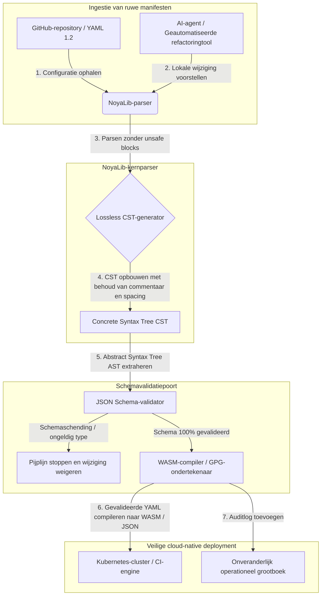

---

# Front Matter (YAML)

author: "contact@sebastienrousseau.com (Sebastien Rousseau)"
banner_alt: "Architecturale geometrie onder dramatisch licht — symbool voor de rol van NoyaLib als dragende, veilige Rust YAML-parser onder CI, Kubernetes, MCP en de configuratie van financiële dienstverlening"
banner_height: "1597"
banner_width: "2584"
banner: "https://cloudcdn.pro/stocks/images/ken-cheung-KonWFWUaAuk.webp"
cdn: "https://cloudcdn.pro"
charset: "UTF-8"
cname: "sebastienrousseau.com"
copyright: "© Copyright 2025 - 2026 - Sebastien Rousseau. Alle rechten voorbehouden."
date: "June 18, 2026"
description: "NoyaLib, een zero-unsafe Rust YAML 1.2-parser met 406/406 spec-compliance, JSON Schema-validatie, lossless CST en MCP/WASM-bindings voor financiële infrastructuur."
format-detection: "telephone=no"
hreflang: "nl"
icon: "https://cloudcdn.pro/clients/sebastienrousseau/v1/logos/sebastienrousseau.svg"
id: "https://sebastienrousseau.com/2026-06-18-noyalib-safe-yaml-rust-ai-mcp-financial-infrastructure-2026"
image_alt: "Zwart-witportret van Sebastien Rousseau"
image_height: "162"
image_width: "162"
image: "https://cloudcdn.pro/stocks/images/sebastienrousseau.webp"
keywords: "veiligere Rust YAML-parser, NoyaLib, YAML 1.2 spec-compliance, zero-unsafe Rust, JSON Schema-validatie, lossless Concrete Syntax Tree, CST, MCP, Model Context Protocol, WebAssembly, Kubernetes-manifesten, CI/CD-configuratie, DORA Artikel 5, BCBS 239, Basel III operationeel risico, financiële infrastructuur, configuratiebeveiliging, software supply chain"
language: "nl-NL"
last_reviewed: "2026-06-18"
layout: "report"
locale: "nl_NL"
logo_alt: "Logo van Sebastien Rousseau"
logo_height: "44"
logo_width: "44"
logo: "https://cloudcdn.pro/clients/sebastienrousseau/v1/logos/sebastienrousseau.svg"
menu: ""
measurementID: "G-169G4ET5HQ"
name: "Sebastien Rousseau"
permalink: "https://sebastienrousseau.com/2026-06-18-noyalib-safe-yaml-rust-ai-mcp-financial-infrastructure-2026"
rating: "general"
referrer: "no-referrer"
robots: "index, follow"
schema: "FAQPage, Article"
seo_title: "Veiligere Rust YAML-parser voor AI, MCP en financiën"
short_name: "sebastienrousseau"
subtitle: "Een veiligere Rust YAML-stack — NoyaLib — maakt van YAML 1.2 niet langer gemaksmarkup, maar een cryptografisch veilige, spec-compliante configuratie-control-plane voor AI-agenten, MCP, Kubernetes en de infrastructuur van financiële dienstverlening."
tags: "veiligere Rust YAML-parser, NoyaLib, YAML 1.2, zero-unsafe Rust, JSON Schema, MCP, WebAssembly, Kubernetes, DORA, BCBS 239, Basel III, financiële infrastructuur, supply chain-beveiliging"
theme-color: "0, 83, 191"
title: "Waarom YAML een veiligere Rust-stack nodig heeft voor AI, MCP en financiële infrastructuur in 2026"
url: "https://sebastienrousseau.com/2026-06-18-noyalib-safe-yaml-rust-ai-mcp-financial-infrastructure-2026"
viewport: "width=device-width, initial-scale=1, shrink-to-fit=no"

# RSS - The RSS feed front matter (YAML).
atom_link: "https://sebastienrousseau.com/2026-06-18-noyalib-safe-yaml-rust-ai-mcp-financial-infrastructure-2026/rss.xml"
category: "Technology"
docs: https://validator.w3.org/feed/docs/rss2.html
generator: "Static Site Generator (SSG) (version 0.0.26)"
item_description: "NoyaLib, een zero-unsafe Rust YAML 1.2-parser met 406/406 spec-compliance, JSON Schema-validatie, lossless CST en MCP/WASM-bindings voor financiële infrastructuur."
item_guid: "https://sebastienrousseau.com/2026-06-18-noyalib-safe-yaml-rust-ai-mcp-financial-infrastructure-2026/rss.xml"
item_link: "https://sebastienrousseau.com/2026-06-18-noyalib-safe-yaml-rust-ai-mcp-financial-infrastructure-2026/rss.xml"
item_pub_date: "Thu, 18 Jun 2026 06:06:06 +0000"
item_title: "Waarom YAML een veiligere Rust-stack nodig heeft voor AI, MCP en financiële infrastructuur in 2026"
last_build_date: "Thu, 18 Jun 2026 06:06:06 +0000"
managing_editor: "contact@sebastienrousseau.com (Sebastien Rousseau)"
pub_date: "Thu, 18 Jun 2026 06:06:06 +0000"
ttl: "60"
type: "article"
webmaster: "contact@sebastienrousseau.com"

# Apple - The Apple front matter (YAML).
apple_mobile_web_app_orientations: "portrait"
apple_touch_icon_sizes: "192x192"
apple-mobile-web-app-capable: "yes"
apple-mobile-web-app-status-bar-inset: "black"
apple-mobile-web-app-status-bar-style: "black-translucent"
apple-mobile-web-app-title: "Veiligere Rust YAML-parser voor AI, MCP en financiën"
apple-touch-fullscreen: "yes"

# MS Application - The MS Application front matter (YAML).

msapplication-navbutton-color: "0, 83, 191"

# Twitter Card - The Twitter Card front matter (YAML).

twitter_card: "summary_large_image"
twitter_creator: "@wwdseb"
twitter_description: "NoyaLib, een zero-unsafe Rust YAML 1.2-parser met 406/406 spec-compliance, JSON Schema-validatie, lossless CST en MCP/WASM-bindings voor financiële infrastructuur."
twitter_image: "https://cloudcdn.pro/clients/sebastienrousseau/v1/logos/sebastienrousseau.svg"
twitter_image_alt: "Logo van Sebastien Rousseau"
twitter_site: "@wwdseb"
twitter_title: "Veiligere Rust YAML-parser voor AI, MCP en financiën"
twitter_url: "https://sebastienrousseau.com/2026-06-18-noyalib-safe-yaml-rust-ai-mcp-financial-infrastructure-2026"

excerpt: "NoyaLib is een veiligere Rust YAML-stack — geen unsafe blocks, 406/406 YAML 1.2 spec-compliance, lossless Concrete Syntax Tree, JSON Schema-validatie (Draft 2020-12) en MCP/WASM-bindings — gebouwd voor AI-agenten, Kubernetes, CI/CD en de configuratie-control-plane achter financiële infrastructuur."

# Humans.txt - The Humans.txt front matter (YAML).
author_website: "https://sebastienrousseau.com"
author_twitter: "@wwdseb"
author_location: "London, UK"
thanks: "Bedankt voor het lezen!"
site_last_updated: "2026-06-18"
site_standards: "HTML5, CSS3, RSS, Atom, JSON, XML, YAML, Markdown, TOML"
site_components: "Kaishi, Kaishi Builder, Kaishi CLI, Kaishi Templates, Kaishi Themes"
site_software: "Static Site Generator, Rust"

---

# Waarom YAML een veiligere Rust-stack nodig heeft voor AI, MCP en financiële infrastructuur in 2026

Een veiligere Rust YAML-stack is van belang omdat YAML inmiddels CI/CD-pijplijnen draagt, naast Kubernetes-manifesten, [Open Policy Agent](https://www.openpolicyagent.org/)-regels en registers van Model Context Protocol (MCP)-tools — en één enkele dubbelzinnige parse kan een clearingsysteem stilleggen, een security group verkeerd configureren of een lokale AI-agent de verkeerde rechten geven. [NoyaLib](https://github.com/sebastienrousseau/noyalib) is een pure-Rust, zero-unsafe parsing- en validatie-ecosysteem voor [YAML 1.2](https://yaml.org/spec/1.2.2/), gebouwd om die infrastructuur standaard veilig te maken.

## Kort antwoord

**Wat is NoyaLib in één zin?** NoyaLib is een open source pure-Rust YAML 1.2-parser- en validatie-ecosysteem zonder `unsafe`-code, met 100% spec-compliance over de officiële 406-testen tellende YAML-suite, een lossless Concrete Syntax Tree en realtime [JSON Schema](https://json-schema.org/)-validatie — gebouwd om configuratie van AI-agenten, MCP, Kubernetes en financiële infrastructuur standaard veilig te maken.

## Executive summary

YAML lijkt onschuldig, totdat een dubbelzinnige parse of een schemaschending een miljardenproductie-clearingsysteem onderuit haalt. In 2026 is YAML de feitelijke standaard voor [CI/CD](https://docs.github.com/en/actions/learn-github-actions/workflow-syntax-for-github-actions)-pijplijnen, [Kubernetes](https://kubernetes.io/docs/concepts/configuration/overview/)-manifesten, [Open Policy Agent](https://www.openpolicyagent.org/)-regels en registers van Model Context Protocol (MCP)-tools. Ondoorzichtige legacy-parsers — met geheugenkwetsbaarheden en destructief parsen — vormen een onaanvaardbaar veiligheidsrisico. NoyaLib is een pure-Rust, zero-unsafe YAML 1.2-ecosysteem: 100% spec-compliance over alle 406 officiële suitetesten, een lossless Concrete Syntax Tree (CST) die commentaar en spacing bewaart, en ingebouwde JSON Schema-validatie. Het resultaat is YAML, herzien als een auditeerbare, veilige en voor agenten toegankelijke configuratie-control-plane.

## Belangrijkste inzichten

- **Configuratie is productiecode.** Eén slecht gevormd YAML-bestand kan cloud-native security groups of de rechten van een AI-agent verkeerd configureren. NoyaLib behandelt YAML als kritieke infrastructuur.
- **Zero-unsafe ontwerp.** Volledig gebouwd in veilig Rust zonder `unsafe`-blocks; NoyaLib elimineert geheugenkwetsbaarheden — buffer overflows, remote code execution — in de centrale parsinglagen.
- **Absolute 406/406 spec-compliance.** Valideert configuratiestructuren mathematisch en elimineert parsingverschillen en structurele drift tussen staging- en productieomgevingen.
- **Lossless Concrete Syntax Tree.** Anders dan legacy-parsers die commentaar en opmaak weggooien, bewaart NoyaLib spacing en annotaties, waardoor veilige, round-trip geautomatiseerde refactoring door AI-agenten mogelijk wordt.
- **Fiduciaire waarde op bestuursniveau.** Verbindt configuratie-integriteit met [DORA Artikel 5](https://eur-lex.europa.eu/legal-content/EN/TXT/?uri=CELEX%3A32022R2554) en de operationele-risicokapitaalmetrieken van [Basel III](https://www.bis.org/bcbs/publ/d424.htm), en beschermt senior management direct tegen persoonlijke aansprakelijkheid.

**Verder lezen:** [KyberLib en de post-kwantum bankmigratie in 2026: van standaarden naar code](https://sebastienrousseau.com/2026-06-12-kyberlib-post-quantum-banking-migration-standards-code-2026/), [De Cloud Native Banking Index in 2026: DORA, platform engineering, soevereine cloud en operationele veerkracht](https://sebastienrousseau.com/2026-06-05-cloud-native-banking-index-dora-resilience-platform-engineering-2026/), [AI-bewuste dotfiles in 2026: een veilig, reproduceerbaar developer-werkstation bouwen voor MCP, SLSA en multi-shell-pariteit](https://sebastienrousseau.com/2026-06-16-ai-aware-dotfiles-secure-reproducible-workstation-2026/).

## 01. Waarom een veiligere Rust YAML-stack ertoe doet in 2026

In juni 2026 zijn enterprise IT-infrastructuren sterk gedistribueerd en in toenemende mate geautomatiseerd.

YAML is in stilte de dragende configuratietaal geworden voor de hele software-engineeringstack. Het draagt de continuous-integration (CI)-werkstromen die productieartefacten compileren, de [Kubernetes](https://kubernetes.io/docs/concepts/overview/)-manifesten die wereldwijde cloud-native clusters orkestreren en de schema's voor [Model Context Protocol](https://modelcontextprotocol.io/) (MCP)-servers die lokale AI-agenten toestemming geven lokale operaties uit te voeren.

Legacy YAML-parsers — [PyYAML](https://pyyaml.org/), [yaml-cpp](https://github.com/jbeder/yaml-cpp), [libyaml](https://github.com/yaml/libyaml) — dragen twee structurele risico's:

1. **Kwetsbaarheden bij type-coercion (het "Norway-probleem").** Legacy-parsers dwingen niet-aangehaalde strings vaak om (de landcode `NO` naar boolean `false`, `yes`/`no` evenzo) — zie de [YAML 1.1- vs. 1.2-booleantag](https://yaml.org/type/bool.html) — wat kritieke systeemstoringen of stille beveiligingsmisconfiguraties veroorzaakt.
2. **Geheugenexploits.** Ondoorzichtige parsers, geschreven in C/C++, lijden onder memory leaks en buffer overflow-exploits die kunnen leiden tot remote code execution (RCE) op centrale buildservers.

[NoyaLib](https://github.com/sebastienrousseau/noyalib) lost deze uitdagingen op. Het is een pure-Rust, zero-unsafe parsing- en validatie-ecosysteem voor YAML 1.2. Door absolute 406/406 spec-compliance te bereiken en strikte JSON Schema-validatie direct tijdens het parsen af te dwingen, levert NoyaLib een hoog **Return on Resilience (RoR)** — configuratie-gerelateerde downtime wordt voorkomen en software supply chains van financiële kwaliteit worden beveiligd.

## 02. De architecturale bril van NoyaLib 2026

Het NoyaLib-ecosysteem werkt als een veilige, lossless configuratieparser. Elk lokaal en cloud-manifest wordt structureel gevalideerd en op de laagste uitvoeringslaag beschermd.

### Tabel 1: NoyaLib-architectuurlagen en risicomitigatie

| Laag | Ontwerpbeslissing | Waarom het ertoe doet | Risico bij verkeerde aanpak |
| ---- | ---- | ---- | ---- |
| **Parserlaag** | YAML 1.2-compliant, pure-Rust parser zonder `unsafe`-blocks | Elimineert geheugenkwetsbaarheden en buffer overflows op de laagste uitvoeringslaag. | Remote code execution (RCE) op centrale buildservers. |
| **Conformiteitslaag** | 100% compliance over 406/406 officiële YAML 1.2-suitetesten | Elimineert parsingverschillen en drift in type-coercion tussen staging en productie. | "Norway-probleem"-type-coercionfouten die security groups uitschakelen. |
| **Syntax-tree-laag** | Lossless Concrete Syntax Tree (CST) | Bewaart commentaar, spacing en volgorde tijdens round-trip parsen en programmatische refactoring. | Geautomatiseerde AI-refactoring die developer-annotaties vernietigt. |
| **Validatielaag** | [JSON Schema (Draft 2020-12)](https://json-schema.org/draft/2020-12/release-notes)-validatie tijdens het parsen | Dwingt strikte datamodellen af op configuratiebestanden voordat zij productieclusters bereiken. | Slecht gevormde configuratiebestanden die cloud-native clusters laten crashen. |
| **Interfacelaag** | WebAssembly (WASM)- en MCP-bindings | Maakt het mogelijk configuratievalidatie rechtstreeks in browsers, edge-nodes en lokale agent-toolkits uit te voeren. | Tooling-silo's waarin validatie niet op edge-apparaten kan draaien. |

## 03. Belangrijke signalen voor werkstation- en configuratiebeveiliging

Om absolute beveiliging in het volledige development- en operations-landschap te handhaven, moeten Chief Information Security Officers (CISO's) specifieke, kwantificeerbare metrieken volgen.

### Tabel 2: Signalen voor werkstation- en configuratiebeveiliging

| Signaal | Metriek / operationele benchmark | NIST CSF / DORA-referentie | Technische platformimplementatie |
| ---- | ---- | ---- | ---- |
| **Parser-conformiteit** | 100% slagingspercentage over de officiële YAML 1.2-testsuite (406/406 testen). | [DORA Artikel 6](https://eur-lex.europa.eu/legal-content/EN/TXT/?uri=CELEX%3A32022R2554) (ICT-security) | NoyaLib-parsercore valideert alle manifesten vóór CI-uitvoering. |
| **Geheugenveiligheidsprofiel** | Geen `unsafe` Rust-blocks in parser en serializer-afhankelijkheden. | DORA Artikel 30 (supply chain) | Geautomatiseerde compilerchecks ([`forbid(unsafe_code)`](https://doc.rust-lang.org/reference/attributes/diagnostics.html#the-forbid-attribute)) in cargo-builds. |
| **Schemavalidatie** | 100% van de geparseerde configuratiebestanden geverifieerd tegen geldige [JSON Schema](https://json-schema.org/)-modellen. | [NIST CSF 2.0](https://www.nist.gov/cyberframework) (PR.DS-01) | Realtime validatiepoort die buildpijplijnen stopzet bij schemaschendingen. |
| **Configuratiedrift** | Realtime detectie en herstel van lokale configuratiebestanden naar de in git versie-beheerde staat. | Return on Resilience (RoR) | Continue telemetrie die alle lokale bestandswijzigingen logt. |
| **Toegangscontrole voor agenten** | Begrensde, alleen-lezen rechten voor lokale AI-tools die via MCP-configuraties opereren. | Modelrisicomanagement ([SR 11-7](https://www.federalreserve.gov/supervisionreg/srletters/sr1107.htm)) | MCP-servergrenzen die agentoperaties beperken tot goedgekeurde mappen. |

## 04. De drogreden van ondoorzichtig configuratie-parsen

Een grote kwetsbaarheid in cloud-native operaties is *ondoorzichtig parsen* — het gebruik van parsers die structurele metadata (commentaar, witruimte, documentvolgorde) weggooien of stilzwijgend typen omdwingen tijdens compilatie. Dat gedrag introduceert twee ernstige veiligheidsrisico's:

1. **Destructieve refactoring.** Wanneer een AI-coding-assistent of geautomatiseerde refactoringtool een deployment-manifest aanpast, gooien traditionele parsers developer-commentaar en opmaak weg, waarmee de context wordt vernietigd die nodig is voor menselijke review en post-incident-forensisch onderzoek.
2. **Parsingverschillen.** Als een staging-omgeving een Python-parser gebruikt en productie een C-parser draait, kunnen kleine verschillen in YAML 1.2 spec-compliance ervoor zorgen dat een geldig staging-manifest in productie faalt of zich anders gedraagt, wat verborgen veiligheidskwetsbaarheden creëert.

De **lossless Concrete Syntax Tree (CST)** van NoyaLib lost dit op. Hij bewaart elke spatie, comment en documentregel tijdens de parse-en-serialize-lus. Geautomatiseerde AI-assistenten kunnen configuratiebestanden bewerken, refactoren en committen met behoud van 100% van de door de mens geschreven annotaties — een absolute audittrail.

## 05. Een begrensde AI-configuratiepijplijn ontwerpen

Om te voorkomen dat kwaadaardige configuratiewijzigingen productieomgevingen bereiken, moet de organisatie een strikt begrensde, schema-gevalideerde configuratiepijplijn implementeren.

De operationele flow hieronder laat zien hoe NoyaLib ruwe YAML parseert, een lossless CST opbouwt, de AST valideert tegen een JSON Schema-model en WebAssembly-bindings compileert voor browser- of edge-omgevingen.

## 06. Het bestuurskamerdraaiboek en fiduciaire aansprakelijkheid

Configuratiebeveiliging en integriteit van de software supply chain zijn kritieke prioriteiten voor de bestuurskamer. Senior managers moeten configuratiemanagement benaderen vanuit het oogpunt van fiduciaire plicht en operationele veerkracht.

- **DORA Artikel 5 (verantwoordelijkheid van het bestuur).** Bepaalt dat het bestuur de uiteindelijke, niet-delegeerbare verantwoordelijkheid draagt voor het beheer van het ICT-risico van de instelling. Omdat configuratiebestanden kritieke cloud-native security groups en betaalroutes aansturen, moet het bestuur verifiëren dat de systemen die deze manifesten parsen geheugenveilig en volledig spec-compliant zijn om aan regulatoire audits te voldoen. ([Verordening (EU) 2022/2554](https://eur-lex.europa.eu/legal-content/EN/TXT/?uri=CELEX%3A32022R2554))
- **BCBS 239 (risicodata-aggregatie en -rapportage).** Vereist dat risicorapportage en infrastructuurmetrieken accuraat en volledig zijn en onder strikte datakwaliteitscontroles tot stand komen. NoyaLib ondersteunt BCBS 239 door configuratiebestanden bij de bron te parsen en te valideren tegen strikte schema's, waardoor stille datalekken of misconfiguratie-uitval worden voorkomen. ([BCBS 239-standaard](https://www.bis.org/publ/bcbs239.htm))
- **Mitigatie van operationele-risicokapitaallasten (Basel III).** Configuratie-gerelateerde uitval drijft de operationele-risicokapitaallasten onder Basel III direct op, waardoor balanskapitaal vast komt te zitten. Door de enterprise-configuratiestack te standaardiseren op een veilige, pure-Rust parser zoals NoyaLib wordt dit risico geminimaliseerd, kapitaal beschermd en klantvertrouwen behouden. ([Basel III-standaarden](https://www.bis.org/bcbs/publ/d424.htm))

## 07. Wat dit betekent per banktype

### Mondiaal systeemrelevante banken (G-SIB's)

G-SIB's beheren duizenden microservices en deployment-pijplijnen in meerdere jurisdicties. Hun belangrijkste uitdaging is configuratieconsistentie handhaven en beveiligingsdrift voorkomen in enorme cloud-native landschappen. Standaardisatie op een veiligere Rust YAML-stack zoals NoyaLib garandeert dat alle Kubernetes-manifesten, CI/CD-pijplijnen en beveiligingsbeleidsregels worden geparseerd en gevalideerd binnen één uniform, geheugenveilig kader — waarmee het risico op niet-auditeerbare "snowflake"-configuraties verdwijnt.

### Transactie- en zakelijke banken

Transactiebanken beheren gevoelige betalings-gateways en wholesale-clearinginfrastructuren. Aantonen dat de code en configuratie die naar deze productieomgevingen worden uitgerold absoluut veilig zijn, is een niet-onderhandelbare regulatoire eis. Integratie van NoyaLib waarborgt dat de software supply chain volledig is geaudit, lossless is en is beschermd tegen parsingkwetsbaarheden — een controle die duidelijk aansluit bij DORA Artikel 6 en [PCI DSS v4.0](https://www.pcisecuritystandards.org/document_library/), sectie 6.

### Regionale en kleinere banken

Regionale banken moeten hoge cybersecurity-standaarden handhaven zonder G-SIB-technologiebudgetten. Het open source NoyaLib-framework biedt een lichtgewicht, kostenefficiënte en zeer veilige Rust-vriendelijke oplossing waarmee kleinere instellingen enterprise-grade configuratiebeveiliging en supply chain-bescherming kunnen implementeren zonder kosten voor proprietary licenties.

## 08. Conclusie: de routekaart voor configuratiebeveiliging

De configuraties van het developer-werkstation en de cloud-native infrastructuur zijn kritieke control planes in de software supply chain. Niet-geauditeerde, dubbelzinnige of onveilige configuratiebestanden toelaten tot bedrijfsmiddelen is een onaanvaardbaar operationeel en regulatoir risico.

Om de software supply chain te beveiligen en endpoints te beschermen tegen configuratiekwetsbaarheden moeten senior technologie- en security-managers vandaag een duidelijk ontwikkelingsplan uitvoeren:

1. **Verplicht declaratieve configuratie.** Faseer handmatige, niet-geauditeerde configuratie-aanpassingen uit en bepaal dat alle manifesten worden beheerd als een versie-gecontroleerd, declaratief system of record.
2. **Dwing schemavalidatie af.** Dwing strikte pre-commit-hooks en scanutilities af om te garanderen dat alle configuratiebestanden vóór deployment worden gevalideerd tegen geldige JSON Schema-modellen.
3. **Implementeer lossless round-tripping.** Zorg dat alle geautomatiseerde AI-coding-assistenten en refactoring-tools lossless parsing gebruiken om commentaar, spacing en developer-context te bewaren.
4. **Beveilig de supply chain.** Zorg dat alle configuratie-opstellingen en parsing-utilities cryptografisch worden geverifieerd met pure-Rust, zero-unsafe libraries zoals NoyaLib voordat zij worden uitgevoerd. ([SLSA-framework](https://slsa.dev/))

## 09. Veelgestelde vragen

**Wat is NoyaLib en waarom wordt het gebruikt voor YAML-parsing?**
NoyaLib is een open source, pure-Rust, zero-unsafe YAML 1.2-parser. Hij behaalt 100% spec-compliance over de officiële 406-testsuite, dwingt strikte [JSON Schema](https://json-schema.org/)-validatie af tijdens het parsen en biedt WASM- en [MCP](https://modelcontextprotocol.io/)-bindings — waardoor het een veiligere Rust YAML-stack is voor AI-agenten, Kubernetes en financiële infrastructuur.

**Waarom is een zero-unsafe ontwerp belangrijk voor configuratie-parsing?**
Geheugenkwetsbaarheden — buffer overflows, use-after-free — in legacy-parsers geschreven in C/C++ kunnen leiden tot remote code execution op centrale buildservers. Het pure-Rust ontwerp van NoyaLib met [`#![forbid(unsafe_code)]`](https://doc.rust-lang.org/reference/attributes/diagnostics.html#the-forbid-attribute) elimineert deze kwetsbaarheden mathematisch op compileertijd.

**Wat is een lossless Concrete Syntax Tree (CST) en waarom doet die ertoe?**
Traditionele parsers gooien commentaar en opmaak weg, waardoor geautomatiseerde edits door AI-agenten destructief worden. De lossless Concrete Syntax Tree van NoyaLib bewaart elke comment, elke spatie en elke documentregel — zodat AI-assistenten configuratiebestanden veilig kunnen bewerken en refactoren met behoud van de developer-context, post-incident-forensisch onderzoek en audittrail.

**Hoe past NoyaLib bij DORA, BCBS 239 en Basel III?**
DORA Artikel 5 legt verantwoordelijkheid voor ICT-risico bij het bestuur; BCBS 239 vereist datakwaliteitscontroles op risicorapportage; Basel III belast operationeel-risicokapitaal. NoyaLib levert de schema-gevalideerde, geheugenveilige parselaag die deze regelgeving vereist voor configuration as code — waardoor de regulatoire mapping eenvoudig wordt en de operationele-risicokapitaallast kleiner uitvalt.

## 10. Referenties

- **YAML, (2026).** *YAML 1.2-specificatie*. Beschikbaar via: [YAML 1.2 spec](https://yaml.org/spec/1.2.2/).
- **JSON Schema, (2026).** *JSON Schema Draft 2020-12 release notes*. Beschikbaar via: [JSON Schema Draft 2020-12](https://json-schema.org/draft/2020-12/release-notes).
- **Europees Parlement en Raad van de Europese Unie, (2022).** *Verordening (EU) 2022/2554 betreffende digitale operationele veerkracht voor de financiële sector (DORA)*. Brussel: Publicatieblad van de Europese Unie. Beschikbaar via: [DORA-verordening](https://eur-lex.europa.eu/legal-content/EN/TXT/?uri=CELEX%3A32022R2554).
- **Basel Committee on Banking Supervision, (2013).** *Principles for effective risk data aggregation and risk reporting (BCBS 239)*. Basel: Bank for International Settlements. Beschikbaar via: [BCBS 239-standaard](https://www.bis.org/publ/bcbs239.htm).
- **Basel Committee on Banking Supervision, (2017).** *Basel III: finalising post-crisis reforms*. Basel: Bank for International Settlements. Beschikbaar via: [Basel III-standaarden](https://www.bis.org/bcbs/publ/d424.htm).
- **Anthropic, (2025).** *Model Context Protocol (MCP)-specificatie*. Beschikbaar via: [Model Context Protocol](https://modelcontextprotocol.io/).
- **GitHub, (2026).** *noyalib open source repository*. Beschikbaar via: [NoyaLib repository](https://github.com/sebastienrousseau/noyalib).
