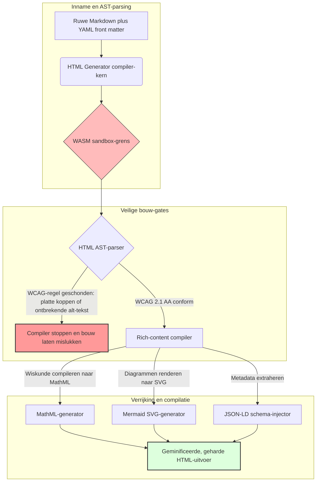

---

# Front Matter (YAML)

author: "contact@sebastienrousseau.com (Sebastien Rousseau)"
banner_alt: "Architecturale geometrie onder gestructureerd licht — symboliseert de rol van HTML Generator als een compile-gated Markdown-naar-HTML-pipeline voor toegankelijke, SEO-gereed en sandbox-beveiligde publicatie-infrastructuur"
banner_height: "1597"
banner_width: "2584"
banner: "https://cloudcdn.pro/stocks/images/markus-winkler-IrRbSND5EUc-unsplash-1200.webp"
cdn: "https://cloudcdn.pro"
charset: "UTF-8"
cname: "sebastienrousseau.com"
copyright: "© Copyright 2025 - 2026 - Sebastien Rousseau. All rights reserved."
date: "June 20, 2026"
description: "HTML Generator is een pure-Rust bibliotheek die Markdown omzet naar WCAG-conforme, SEO-gereed, JSON-LD-verrijkte HTML — toegankelijkheid als code, MathML- en Mermaid-ondersteuning, en WebAssembly-sandbox voor veilige enterprise-publicatie."
format-detection: "telephone=no"
hreflang: "nl"
icon: "https://cloudcdn.pro/clients/sebastienrousseau/v1/logos/sebastienrousseau.svg"
id: "https://sebastienrousseau.com/2026-06-20-html-generator-accessible-seo-structured-markdown-rust-2026"
image_alt: "Zwart-witportret van Sebastien Rousseau"
image_height: "162"
image_width: "162"
image: "https://cloudcdn.pro/stocks/images/sebastienrousseau.webp"
keywords: "html-generator, Rust Markdown naar HTML, toegankelijkheid als code, WCAG 2.1 AA, SEO-gereed HTML, JSON-LD, MathML, Mermaid, WebAssembly, EAA, DORA, ADA Title III, toegankelijke publicatie, sandbox-parsing, open source"
language: "nl-NL"
last_reviewed: "2026-06-20"
layout: "report"
locale: "nl_NL"
logo_alt: "Logo van Sebastien Rousseau"
logo_height: "44"
logo_width: "44"
logo: "https://cloudcdn.pro/clients/sebastienrousseau/v1/logos/sebastienrousseau.svg"
menu: ""
measurementID: "G-169G4ET5HQ"
name: "Sebastien Rousseau"
permalink: "https://sebastienrousseau.com/2026-06-20-html-generator-accessible-seo-structured-markdown-rust-2026"
rating: "general"
referrer: "no-referrer"
robots: "index, follow"
schema: "FAQPage, Article"
seo_title: "Toegankelijkheid als Code: Markdown naar AAA HTML met Rust in 2026"
short_name: "sebastienrousseau"
subtitle: "De transformatie van corporate webpublicatie, productdocumentatie en klantportalen van ontoegankelijke tekstbestanden naar sterk gestructureerde, conforme en sandbox-beveiligde digitale activa."
tags: "html-generator, Rust, Markdown, toegankelijkheid, WCAG, SEO, JSON-LD, MathML, Mermaid, WebAssembly, EAA, DORA, ADA, AI-ontdekking, RAG, open source, bankinfrastructuur"
theme-color: "0, 83, 191"
title: "Markdown omzetten naar toegankelijke, SEO-gereed, gestructureerde HTML met Rust in 2026"
url: "https://sebastienrousseau.com/2026-06-20-html-generator-accessible-seo-structured-markdown-rust-2026"
viewport: "width=device-width, initial-scale=1, shrink-to-fit=no"

# RSS - The RSS feed front matter (YAML).
atom_link: "https://sebastienrousseau.com/2026-06-20-html-generator-accessible-seo-structured-markdown-rust-2026/rss.xml"
category: "Technology"
docs: https://validator.w3.org/feed/docs/rss2.html
generator: "Static Site Generator (SSG) (version 0.0.40)"
item_description: "HTML Generator is een pure-Rust bibliotheek die Markdown omzet naar WCAG-conforme, SEO-gereed, JSON-LD-verrijkte HTML — toegankelijkheid als code, MathML- en Mermaid-ondersteuning, en WebAssembly-sandbox voor veilige enterprise-publicatie."
item_guid: "https://sebastienrousseau.com/2026-06-20-html-generator-accessible-seo-structured-markdown-rust-2026/rss.xml"
item_link: "https://sebastienrousseau.com/2026-06-20-html-generator-accessible-seo-structured-markdown-rust-2026/rss.xml"
item_pub_date: "Sat, 20 Jun 2026 06:06:06 +0000"
item_title: "Markdown omzetten naar toegankelijke, SEO-gereed, gestructureerde HTML met Rust in 2026"
last_build_date: "Sat, 20 Jun 2026 06:06:06 +0000"
managing_editor: "contact@sebastienrousseau.com (Sebastien Rousseau)"
pub_date: "Sat, 20 Jun 2026 06:06:06 +0000"
ttl: "60"
type: "article"
webmaster: "contact@sebastienrousseau.com"

# Apple - The Apple front matter (YAML).
apple_mobile_web_app_orientations: "portrait"
apple_touch_icon_sizes: "192x192"
apple-mobile-web-app-capable: "yes"
apple-mobile-web-app-status-bar-inset: "black"
apple-mobile-web-app-status-bar-style: "black-translucent"
apple-mobile-web-app-title: "Markdown naar AAA HTML met Rust"
apple-touch-fullscreen: "yes"

# MS Application - The MS Application front matter (YAML).

msapplication-navbutton-color: "0, 83, 191"

# Twitter Card - The Twitter Card front matter (YAML).

twitter_card: "summary_large_image"
twitter_creator: "@wwdseb"
twitter_description: "HTML Generator is een pure-Rust bibliotheek die Markdown omzet naar WCAG-conforme, SEO-gereed, JSON-LD-verrijkte HTML — toegankelijkheid als code, MathML- en Mermaid-ondersteuning, en WebAssembly-sandbox voor veilige enterprise-publicatie."
twitter_image: "https://cloudcdn.pro/clients/sebastienrousseau/v1/logos/sebastienrousseau.svg"
twitter_image_alt: "Logo van Sebastien Rousseau"
twitter_site: "@wwdseb"
twitter_title: "Toegankelijkheid als Code: Markdown naar AAA HTML met Rust"
twitter_url: "https://sebastienrousseau.com/2026-06-20-html-generator-accessible-seo-structured-markdown-rust-2026"

# Humans.txt - The Humans.txt front matter (YAML).
author_website: "https://sebastienrousseau.com"
author_twitter: "@wwdseb"
author_location: "London, UK"
thanks: "Bedankt voor het lezen!"
site_last_updated: "2026-06-20"
site_standards: "HTML5, CSS3, RSS, Atom, JSON, XML, YAML, Markdown, TOML"
site_components: "Kaishi, Kaishi Builder, Kaishi CLI, Kaishi Templates, Kaishi Themes"
site_software: "Static Site Generator, Rust"

---

# Markdown omzetten naar toegankelijke, SEO-gereed, gestructureerde HTML met Rust in 2026

<!-- lead-start -->
<aside class="post-lead" aria-label="Artikelsamenvatting">

<strong>TL;DR.</strong> HTML Generator is een pure-Rust Markdown-naar-HTML-compiler die WCAG 2.1 AA afdwingt tijdens het bouwen, schema-conforme JSON-LD injecteert, MathML en Mermaid SVG native rendert en het parseren isoleert binnen een WebAssembly-sandbox — waarmee publicatie een compile-gated controlevlak wordt voor toegankelijkheid, SEO en ICT-beveiliging.

<strong>Kernpunten</strong>

<ul class="post-lead-takeaways">
  <li><strong>Kort antwoord.</strong> Wat is HTML Generator in één zin?</li>
  <li><strong>Managementsamenvatting.</strong> Markdown-rendering lijkt triviaal; publicatiewaardige HTML is een complianceprobleem.</li>
  <li><strong>01. Waarom een toegankelijkheidsgerichte HTML-compiler er in 2026 toe doet.</strong> De EAA en ADA Title III hebben toegankelijkheid van technische hygiëne naar fiduciaire aansprakelijkheid verschoven.</li>
  <li><strong>02. De architectuurperspectief van HTML Generator 2026.</strong> Een meerfasige, compiler-gated pipeline van ruwe Markdown naar geharde HTML-uitvoer.</li>
</ul>

<strong>Gerelateerde lectuur:</strong> <a href="https://sebastienrousseau.com/2026-06-18-noyalib-safe-yaml-rust-ai-mcp-financial-infrastructure-2026">Waarom YAML in 2026 een veiligere Rust-stack nodig heeft voor AI, MCP en financiële infrastructuur</a>, <a href="https://sebastienrousseau.com/2026-06-17-static-site-generator-secure-default-ai-era-publishing-2026">Een secure-by-default Static Site Generator voor publicatie in het AI-tijdperk van 2026</a>, <a href="https://sebastienrousseau.com/2026-06-11-cloudcdn-open-source-blueprint-ai-native-edge-2026">CloudCDN: Een open-source blauwdruk voor de AI-native edge in 2026</a>.

</aside>
<!-- lead-end -->

In 2026 wordt webcontent in even grote mate verwerkt door AI-zoekcrawlers, LLM-aangedreven zoekmachines en Retrieval-Augmented Generation (RAG)-pipelines als door menselijke lezers. Platte of misvormde HTML verstoort machine-vindbaarheid, terwijl het niet naleven van strikte mondiale regelgeving zoals de [Europese Toegankelijkheidsrichtlijn (EAA)](https://www.accessibility-act.eu/) en [US ADA Title III](https://www.ada.gov/topics/title-iii/) inmiddels een ondubbelzinnige civielrechtelijke aansprakelijkheid vormt. [HTML Generator](https://github.com/sebastienrousseau/html-generator) is een hoogwaardige Rust-bibliotheek die is ontworpen om deze tekortkomingen te verhelpen — op compiler-niveau, niet via patches na implementatie.

## Kort antwoord

**Wat is HTML Generator in één zin?** HTML Generator is een open-source, pure-Rust Markdown-naar-HTML-compiler die [WCAG 2.1 AA](https://www.w3.org/TR/WCAG21/) afdwingt tijdens het bouwen, automatisch semantische oriëntatiepunten en ARIA-attributen genereert, schema-conforme [JSON-LD](https://json-ld.org/)-metadata injecteert vanuit YAML front matter, Mermaid-diagrammen en wiskunde rendert naar toegankelijke SVG en MathML, en binnen een [WebAssembly](https://webassembly.org/)-sandbox draait — waarmee corporate publicatie een compile-gated, fiduciair-kwaliteitvlak wordt.

## Managementsamenvatting

Markdown-rendering lijkt triviaal. Publicatiewaardige HTML is een complianceprobleem. In juni 2026 wordt elk zakelijk contactpunt — investor relations-portalen, regelgevende meldingen, klantdocumentatie, API-referenties, marketingeigendommen — zowel door mensen als machines verwerkt. Op elke pagina botsen twee drukfactoren: [EAA](https://www.accessibility-act.eu/) en [ADA Title III](https://www.ada.gov/topics/title-iii/) maken toegankelijkheid een juridische blootstelling op bestuursniveau, terwijl AI-verwerking en RAG-pipelines gestructureerde, machineleesbare uitvoer belonen. Standaard Markdown-bibliotheken produceren platte HTML die beide drempels niet haalt. HTML Generator behandelt documentgeneratie als een compile-gated pipeline: WCAG-validatie is een bouwfout, JSON-LD komt uit YAML front matter zonder handmatige aanmaak, MathML en Mermaid renderen toegankelijk, en de volledige engine wordt als WebAssembly-doel geleverd zodat het parseren van niet-vertrouwde documenten in een sandbox van de host wordt geïsoleerd.

## Kernpunten

- **Toegankelijkheid als code is de nieuwe baseline.** De EAA verplicht toegankelijkheid voor digitale consumentendiensten. HTML Generator evalueert de documentboom tijdens het compileren, en genereert automatisch semantische oriëntatiepunten en ARIA-attributen — minder herstelwerk na implementatie, minder remediatiebudget, geen ontbrekende alt-tekst in productie.
- **Gestructureerde data voor AI-vindbaarheid.** Moderne zoeksystemen en RAG zijn afhankelijk van machineleesbare metadata. De compiler parseert YAML front matter en injecteert [Schema.org-conforme JSON-LD](https://schema.org/) rechtstreeks in de documentkop, waardoor content volledig interpreteerbaar is voor [Google Rich Results](https://developers.google.com/search/docs/appearance/structured-data/intro-structured-data), [Bing Webmaster](https://www.bing.com/webmasters) en LLM-aangedreven crawlers.
- **Uitmuntendheid in technische content.** Technische publicaties zijn geen platte tekst. HTML Generator compileert ruwe Markdown-wiskundeuitbreidingen naar toegankelijke [MathML](https://www.w3.org/Math/), en rendert [Mermaid.js](https://mermaid.js.org/)-diagrammen naar responsieve SVG — beide met behoud van WCAG-conforme structuur in plaats van terug te vallen op ondoorzichtige afbeeldingen.
- **WebAssembly-sandbox.** Het parseren van niet-vertrouwde Markdown is een beveiligingsrisico. Door [WASM](https://webassembly.org/) als doel te gebruiken, voert HTML Generator uit binnen een geïsoleerde sandbox die willekeurige code-uitvoering voorkomt en het hostsysteem beschermt — waarmee direct wordt voldaan aan de ICT-beveiligingsverplichtingen van [DORA Article 6](https://eur-lex.europa.eu/legal-content/EN/TXT/?uri=CELEX%3A32022R2554).
- **Fiduciaire bescherming voor bestuurders.** Technische niet-naleving heeft zijn intrede gedaan in de bestuurskamer. Standaardiseren op een compiler-gated HTML-engine beschermt directeuren en senior management tegen persoonlijke civielrechtelijke en regelgevende blootstelling onder DORA, de EAA en ADA Title III.

**Gerelateerde lectuur:** [Waarom YAML in 2026 een veiligere Rust-stack nodig heeft voor AI, MCP en financiële infrastructuur](https://sebastienrousseau.com/2026-06-18-noyalib-safe-yaml-rust-ai-mcp-financial-infrastructure-2026/), [Een secure-by-default Static Site Generator voor publicatie in het AI-tijdperk van 2026](https://sebastienrousseau.com/2026-06-17-static-site-generator-secure-default-ai-era-publishing-2026/), [CloudCDN: Een open-source blauwdruk voor de AI-native edge in 2026](https://sebastienrousseau.com/2026-06-11-cloudcdn-open-source-blueprint-ai-native-edge-2026/).

## 01. Waarom een toegankelijkheidsgerichte HTML-compiler er in 2026 toe doet

Corporate webeigendommen, documentatiebibliotheken en producthelpsites zijn kritieke digitale contactpunten. Ze staan nu bloot aan twee intensieve, kruisende drukfactoren.

De eerste is **AI-verwerking en vindbaarheid**. Content wordt in toenemende mate verwerkt door grote taalmodellen en Retrieval-Augmented Generation-pipelines. Platte of misvormde HTML verstoort crawler-parsing en maakt corporate onderzoek en documentatie onzichtbaar voor moderne zoekparadigma's — inclusief [Google Search Generative Experience](https://blog.google/products/search/generative-ai-search/), [ChatGPT](https://chat.openai.com/)-browsing en enterprise RAG-agenten.

De tweede is **stringente mondiale toegankelijkheidswetgeving**. Onder de [Europese Toegankelijkheidsrichtlijn](https://www.accessibility-act.eu/) (volledig van toepassing vanaf juni 2025) en [US ADA Title III](https://www.ada.gov/topics/title-iii/) moeten corporate publicatieplatforms volledige digitale toegankelijkheid garanderen. Het niet naleven van [WCAG 2.1 AA](https://www.w3.org/TR/WCAG21/) is niet langer een technisch verzuim; het is een civielrechtelijke en regelgevende aansprakelijkheid die tot schikkingen van meerdere miljoenen dollars heeft geleid.

[HTML Generator](https://github.com/sebastienrousseau/html-generator) adresseert beide drukfactoren direct. Het is een thread-safe Rust-bibliotheek die is ontworpen om Markdown te transformeren naar toegankelijke, SEO-gereed, gestructureerde HTML. Door documentgeneratie als een compiler-gated pipeline te behandelen, levert de engine een hoog **Return on Resilience (RoR)** op — balansen worden beschermd tegen toegankelijkheidsgeschillen terwijl machineleesbaarhied voor AI-vindbaarheid wordt gemaximaliseerd.

## 02. De architectuurperspectief van HTML Generator 2026

Het framework is ontworpen als een veilige, meerfasige compilatiepipeline die ruwe Markdown-tekst omzet naar cryptografisch geverifieerde, sterk toegankelijke statische assets.

### Tabel 1: Architectuurlagen van HTML Generator en risicobeperking

| Laag | Ontwerpbeslissing | Waarom het van belang is | Risico bij onjuiste behandeling |
| ---- | ---- | ---- | ---- |
| **Invoerlaag** | Markdown plus YAML front matter-parser | Sluit aan bij schrijvers; scheidt proza van structurele metadata. | Inconsistente metadata, kapotte sitemaps, indexeringshiaten. |
| **Structuurlaag** | Automatische inhoudsopgave en semantische oriëntatiepunten met ARIA-tags | Produceert navigeerbare, toegankelijke documentbomen als constructie-eigenschap. | Platte HTML die schermlezers breekt en WCAG schendt. |
| **Rich-contentlaag** | Native MathML- en Mermaid.js SVG-rendering | Compileert formules en diagrammen naar toegankelijke SVG en MathML. | Client-side JS-rendervertraging en kapotte uitvoer voor ondersteunende technologie. |
| **SEO- en datalaag** | Geïntegreerde JSON-LD- en gestructureerde-metadatageneratie | Injecteert [Schema.org](https://schema.org/)-conforme JSON-LD rechtstreeks in de kop. | Zoekmachines en AI-crawlers lezen auteur, context en licentie verkeerd uit. |
| **Runtime-laag** | Native Rust-compiler met WebAssembly-doel | Maakt veilige, sandbox-beveiligde uitvoering op servers, edge-nodes en browsers mogelijk. | Willekeurige code-uitvoering bij het parseren van niet-vertrouwde Markdown. |

## 03. Belangrijkste webbeveiliging- en toegankelijkheidssignalen

Om te verifiëren dat publiekgerichte publicatie-assets voldoen aan moderne regelgevings- en beveiligingsaudits, moeten senior technologiefunctionarissen specifieke, kwantificeerbare meetwaarden bewaken.

### Tabel 2: Webbeveiliging- en toegankelijkheidssignalen

| Signaal | Meetwaarde / operationele benchmark | EAA / DORA / W3C-referentie | Technische implementatie |
| ---- | ---- | ---- | ---- |
| **Toegankelijkheidsconformiteit** | 100% van gecompileerde pagina's gevalideerd tegen WCAG 2.1 AA-regels. | [EAA](https://www.accessibility-act.eu/) en [ADA Title III](https://www.ada.gov/topics/title-iii/) | Bouw-tijd HTML-parser die alt-tags van afbeeldingen en semantische oriëntatiepunten evalueert. |
| **WASM-uitvoeringssandbox** | 100% van niet-vertrouwde Markdown-invoer gecompileerd in een geïsoleerde WebAssembly-runtime. | [DORA Article 6](https://eur-lex.europa.eu/legal-content/EN/TXT/?uri=CELEX%3A32022R2554) (ICT-beveiliging) | Isolatie van de parseromgeving van de hostserver. |
| **Dekking van gestructureerde metadata** | 100% van gepubliceerde artikelen voorzien van geldige, schema-conforme JSON-LD-headers. | [Schema.org](https://schema.org/)-specificaties | Automatische front matter-parsing en conversie naar JSON-LD-objecten. |
| **Compilatiedoorvoer** | Pagina's-per-seconde doel boven de 10.000 op standaardhardware. | Return on Resilience (RoR) | Sterk geparallelliseerde Rust AST-compiler. |
| **Rich snippet-verificatie** | Nul parseerfouten op [Google Rich Results](https://search.google.com/test/rich-results) en [Schema validator](https://validator.schema.org/) runs. | Google Search-richtlijnen | Structurele validatie van gegenereerde JSON-LD tijdens de bouw-pipeline. |

## 04. De mythe van eenvoudige Markdown-rendering

Een veelvoorkomend misverstand onder technologiemanagers is dat het omzetten van Markdown naar HTML een eenvoudige tekstvervangingsoefening is. Veel standaardbibliotheken vertalen Markdown-opmaak naar platte, ongestructureerde HTML. De uitvoer rendert voor een ziende lezer in een browser, maar vertegenwoordigt een compliance-valkuil.

Platte HTML mist doorgaans drie zaken.

1. **Correcte kophiërarchieën.** Standaard Markdown dwingt geen kopvolgorde af. Springen van een `<h1>` naar een `<h4>` schendt WCAG 2.1 AA en breekt documentnavigatie voor schermlezers.
2. **Expliciete tabelsemantiek.** Standaard Markdown-tabellen worden zelden gerenderd met de juiste `<th>`-scope en `<tbody>`-attributen die vereist zijn voor toegankelijke parsing.
3. **Machineleesbare metadata.** Standaard HTML mist de JSON-LD-hooks waarvan moderne AI-zoekplatforms en RAG-ingestsystemen afhankelijk zijn.

HTML Generator lost dit op door Markdown te parseren naar een **Abstract Syntax Tree (AST)**. De engine evalueert de documentstructuur voordat HTML wordt gegenereerd, valideert kopnesting, injecteert passende ARIA-attributen en bevestigt dat elk media-asset alternatieve tekst draagt — waarmee toegankelijkheid van een handmatige audit wordt omgezet in een gegarandeerde compilatie-tijdinvariante.

## 05. Het ontwerpen van een toegankelijkheid-als-code bouwpipeline

Om te voorkomen dat ontoegankelijke of niet-geïndexeerde assets ooit de publieke implementatie bereiken, moet toegankelijkheid een strikte compiler-gate zijn. De volgende pipeline toont hoe HTML Generator Markdown evalueert, WebAssembly-geïsoleerde validatie uitvoert en geharde, gestructureerde HTML genereert.

## 06. Het bestuurshandboek en fiduciaire aansprakelijkheid

Moderne toegankelijkheids- en webbeveiliging-compliance zijn ononderhandelbare bestuursonderwerpen. Senior management moet de publicatie-infrastructuur benaderen vanuit het perspectief van juridisch risico, financiële bescherming en regelgevende blootstelling.

- **De Europese Toegankelijkheidsrichtlijn (EAA).** Legt directe, wettelijk bindende nalevingsverplichtingen op aan publieke en private digitale portalen. Niet-naleving kan leiden tot zware financiële sancties, civiele procedures en onmiddellijke terugtrekking van het asset uit de EU-markt. Door toegankelijkheid als code te integreren, kunnen bestuurders certificeren dat niet-conforme code niet kan worden uitgeleverd — wat reactief herstel omzet in een structureel juridisch schild.
- **DORA Article 6 (Veilige ICT-omgevingen).** Stelt strikte regels voor ICT-omgevingsbeveiliging. Door Markdown-compilatie te isoleren binnen een WebAssembly-sandbox, zorgen organisaties ervoor dat het parseren van door klanten geüploade documentatie of partnerfeeds host-servers niet kan blootstellen aan willekeurige code-uitvoering, waarmee kritieke bankportalen worden beschermd.
- **Kostenreductie bij compliance-audits.** Traditionele toegankelijkheids-compliance berust op dure, retrospectieve post-implementatieaudits — tienduizenden dollars per jaar per site. Het implementeren van WCAG-validatie als compilatieblok elimineert deze retrospectieve kosten en verschuift het compliance-budget van verdediging naar innovatie.

## 07. Wat dit betekent per bank- / enterprise-type

### Mondiaal systeemrelevante banken (G-SIB's)

G-SIB's beheren enorme, meertalige publieke eigendommen die duizenden onderzoeksrapporten, regelgevende meldingen en investor relations-documenten publiceren in meerdere rechtsgebieden. Hun uitdaging is schaal en meertalige pariteit. Het WebAssembly-doel van HTML Generator en de hoge-doorvoer Rust-engine laten grootschalige, gelokaliseerde onderzoeksbibliotheken worden bijgewerkt, gecompileerd en wereldwijd geïmplementeerd binnen seconden — zonder rendervertraging of toegankelijkheidsregressie.

### Transactie- en corporate banken

Voor transactiebanken zijn klantportalen, documentatiehubs en ontwikkelaars-API-gidsen kritieke digitale contactpunten. Het compileren van deze assets via HTML Generator betekent dat klantgerichte kanalen geen XSS-blootstelling, geen dependency-hijack vectoren en geen toegankelijkheidstekorten dragen — waarmee institutioneel vertrouwen wordt behoud en het litigatieoppervlak wordt verminderd.

### Regionale banken en fintechs

Regionale banken en wendbare fintechs concurreren op digitale ervaring zonder G-SIB-engineeringbudgetten. HTML Generator geeft deze teams een enterprise-kwaliteit publicatiepipeline kant-en-klaar, waardoor kleinere eigendommen toegankelijke, SEO-gereed en sandbox-beveiligde assets kunnen uitleveren die bestand zijn tegen scrutinie van zowel toezichthouders als potentiële corporate cliënten.

## 08. De publicatie-infrastructuur-routekaart

Corporate publiekgerichte webeigendommen zijn een kerncomponent van operationele veerkracht. Vertrouwen op trage, dynamisch kwetsbare, database-gedreven webengines — of niet-ondertekende statische assets — is een onaanvaardbaar bedrijfsrisico.

Om publieke digitale contactpunten te beveiligen en balansen te beschermen tegen toegankelijkheidsgeschillen, moeten senior technologie- en beveiligingsmanagers een duidelijke routekaart uitvoeren.

1. **Overgang naar statische architecturen.** Verouderde dynamische CMS-platforms voor onderzoeks-, marketing- en documentatie-eigendommen gefaseerd afschaffen. Content verplaatsen naar compiler-gated pipelines zoals HTML Generator.
2. **Toegankelijkheid afdwingen tijdens het bouwen.** Toegankelijkheid als code implementeren. Compilatiepipelines automatisch laten mislukken bij elke WCAG 2.1 AA-schending.
3. **Parsing isoleren in WebAssembly.** Alle document- en contentparsing sandboxen binnen een WASM-runtime zodat niet-vertrouwde invoer nooit hostsystemen raakt.
4. **Rijke JSON-LD-metadata injecteren.** Ervoor zorgen dat elk gepubliceerd asset schema-conforme JSON-LD-headers draagt om AI-vindbaarheid te maximaliseren.

## 09. Veelgestelde vragen

**Hoe dwingt HTML Generator toegankelijkheid af?**

Het parseert de gegenereerde HTML Abstract Syntax Tree tijdens het bouwen en evalueert het document tegen [WCAG 2.1 AA](https://www.w3.org/TR/WCAG21/)-regels. Als een regel wordt geschonden — een ontbrekend alt-attribuut, een kopsprong, een ongelabeld formulierbesturingselement — stopt de compiler de bouw, waarbij toegankelijkheid als een compilatie-tijdinvariante wordt behandeld in plaats van een post-implementatie audittaak.

**Waarom is WebAssembly-isolatie belangrijk?**

[WebAssembly](https://webassembly.org/) laat de Markdown-parseengine uitvoeren binnen een geïsoleerde sandbox, afgescheiden van de hostserver. Zelfs wanneer een kwaadwillende actor een bewerkt Markdown-document uploadt dat is ontworpen om parserkwetsbaarheden te exploiteren, wordt de uitvoering gestopt — waarmee hostsystemen worden beschermd en wordt voldaan aan de DORA Article 6 ICT-beveiligingsverplichtingen.

**Hoe komt JSON-LD de zoekvindbaarheid ten goede in 2026?**

[JSON-LD](https://json-ld.org/) biedt gestructureerde, machineleesbare metadata in de documentkop. [Google Rich Results](https://developers.google.com/search/docs/appearance/structured-data/intro-structured-data), Bing-crawlers en LLM-aangedreven zoekagenten identificeren onmiddellijk auteur, licentie, publicatiedatum en semantische context — waarmee de ambiguïteit van standaard HTML wordt omzeild en het oppervlak in AI-aangedreven ontdekking wordt vergroot.

**Voor wie is HTML Generator bedoeld?**

Bouwers van statische sites, documentatieteams, technische schrijvers, Rust-ontwikkelaars en platform-engineers die toegankelijkheidskritieke of toezichthoudergerichte eigendommen uitleveren. Het is ook een levensvatbare content-verwerkingslaag binnen grotere veilige-publicatie-pipelines zoals [Static Site Generator (SSG)](https://github.com/sebastienrousseau/static-site-generator).

## 10. Referenties

- World Wide Web Consortium (W3C), 2024. [Richtlijnen voor webtoegankelíjkheid (WCAG) 2.1 ⧉](https://www.w3.org/TR/WCAG21/ "Web Content Accessibility Guidelines 2.1").
- Schema.org, 2026. [Schema.org gestructureerde-dataspecificaties ⧉](https://schema.org/ "Schema.org structured-data specifications").
- Europees Parlement en Raad van de Europese Unie, 2022. [Verordening (EU) 2022/2554 inzake digitale operationele veerkracht voor de financiële sector (DORA) ⧉](https://eur-lex.europa.eu/legal-content/EN/TXT/?uri=CELEX%3A32022R2554 "DORA Regulation").
- Europese Commissie, 2025. [Europese Toegankelijkheidsrichtlijn ⧉](https://www.accessibility-act.eu/ "European Accessibility Act").
- Amerikaans Ministerie van Justitie, 2024. [ADA Title III ⧉](https://www.ada.gov/topics/title-iii/ "ADA Title III").
- WebAssembly Community Group, 2026. [WebAssembly-specificatie ⧉](https://webassembly.org/ "WebAssembly").
- GitHub, 2026. [HTML Generator repository ⧉](https://github.com/sebastienrousseau/html-generator "HTML Generator open-source repository").

<!-- enrich-start -->
<aside class="author-card" aria-label="Over de auteur"><strong class="author-card-name"><a href="/about/index.html">Sebastien Rousseau</a></strong>Senior banktechnoloog die schrijft over toegepaste AI, betalingsinfrastructuur, getokeniseerd geld, ISO 20022, post-kwantumbeveiliging, cloud-native financiële diensten, open-source infrastructuur en gereguleerde digitale markten.20+ jaar ervaring bij HSBC Commercial &amp; Investment Bank, PayPal, Barclays, Shazam, AKQA, Virgin Group. <a href="/about/index.html">Volledig profiel</a> &middot; <a href="https://www.linkedin.com/in/sebastienrousseau/" rel="external noopener">LinkedIn</a> &middot; <a href="https://github.com/sebastienrousseau" rel="external noopener">GitHub</a></aside>

Laatste beoordeling <time datetime="2026-06-20">2026-06-20</time>.

<!-- enrich-end -->
