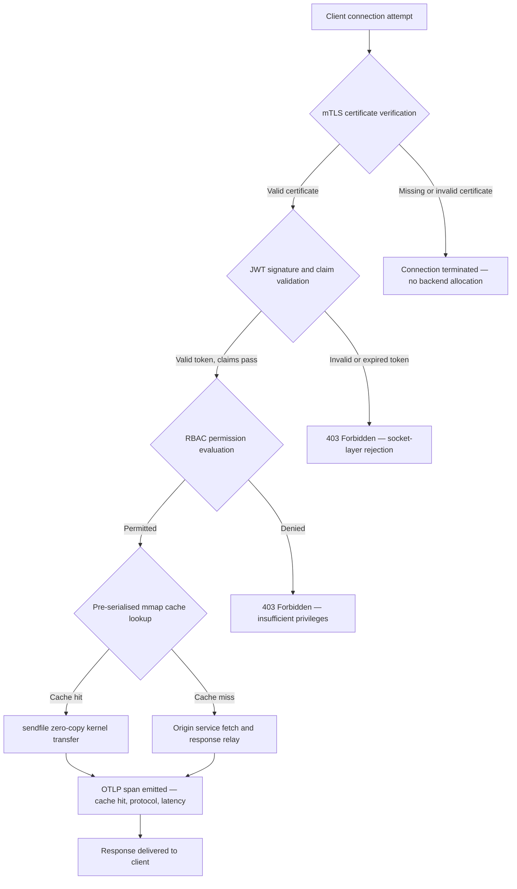

---

# Front Matter (YAML)

author: "contact@sebastienrousseau.com (Sebastien Rousseau)"
banner_alt: "Abstract circuit-board stadslandschap bij nacht — visualiseert de bancaire edge waar kernel-niveau zero-copy transfers, mTLS-handshakes en JWT-validatie samenkomen in één statisch gelinkt binair bestand"
banner_height: "1597"
banner_width: "2584"
banner: "https://cloudcdn.pro/stocks/images/bit-cloud-GlqbGLCPnQ4.webp"
cdn: "https://cloudcdn.pro"
charset: "UTF-8"
cname: "sebastienrousseau.com"
copyright: "© Copyright 2025 - 2026 - Sebastien Rousseau. All rights reserved."
date: "June 20, 2026"
description: "http-handle is een statisch gelinkt Rust-binair bestand dat 180.000 verzoeken per seconde levert aan de bancaire edge, met nul runtime-afhankelijkheden, geïntegreerde mTLS en JWT-validatie, ALPN-onderhandeld HTTP/2 en HTTP/3, en OTLP-observatie — waarmee het de beveiligings- en veerkrachtsleemten van Nginx en Envoy sluit."
format-detection: "telephone=no"
hreflang: "nl"
icon: "https://cloudcdn.pro/clients/sebastienrousseau/v1/logos/sebastienrousseau.svg"
id: "https://sebastienrousseau.com/2026-06-20-http-handle-zero-dependency-edge-ingress-banking-rust-2026"
image_alt: "Zwart-witportret van Sebastien Rousseau"
image_height: "162"
image_width: "162"
image: "https://cloudcdn.pro/stocks/images/sebastienrousseau.webp"
keywords: "http-handle, Rust edge-ingress, zero-dependency proxy, bancaire infrastructuur, mTLS JWT, sendfile zero-copy, ALPN HTTP3, DORA-compliance, Basel III, OTLP-observatie, statisch binair, ARM64 banking, zero trust banking, lichtgewicht ingress, Rust bancaire beveiliging"
language: "nl-NL"
last_reviewed: "2026-06-20"
layout: "report"
locale: "nl_NL"
logo_alt: "Logo van Sebastien Rousseau"
logo_height: "44"
logo_width: "44"
logo: "https://cloudcdn.pro/clients/sebastienrousseau/v1/logos/sebastienrousseau.svg"
menu: ""
measurementID: "G-169G4ET5HQ"
name: "Sebastien Rousseau"
permalink: "https://sebastienrousseau.com/2026-06-20-http-handle-zero-dependency-edge-ingress-banking-rust-2026"
rating: "general"
referrer: "no-referrer"
robots: "index, follow"
schema: "FAQPage, Article"
seo_title: "http-handle: Zero-Dependency Rust Ingress voor Bankieren op 180k req/s"
short_name: "sebastienrousseau"
subtitle: "Hoe één statisch gelinkt Rust-binair bestand 180.000 verzoeken per seconde levert met mTLS, JWT en ALPN aan de bancaire edge — en wat dit betekent voor DORA- en Basel III-compliance."
tags: "http-handle, Rust, banking, edge-ingress, mTLS, JWT, ALPN, HTTP3, DORA, Basel-III, zero-copy, sendfile, ARM64, zero-trust, OTLP, observability, open-source, infrastructure"
theme-color: "0, 83, 191"
title: "http-handle: Hoogpresterende, Zero-Dependency Edge Ingress voor Bankieren in 2026"
url: "https://sebastienrousseau.com/2026-06-20-http-handle-zero-dependency-edge-ingress-banking-rust-2026"
viewport: "width=device-width, initial-scale=1, shrink-to-fit=no"

# RSS - The RSS feed front matter (YAML).
atom_link: "https://sebastienrousseau.com/2026-06-20-http-handle-zero-dependency-edge-ingress-banking-rust-2026/rss.xml"
category: "Technology"
docs: https://validator.w3.org/feed/docs/rss2.html
generator: "Static Site Generator (SSG) (version 0.0.40)"
item_description: "http-handle is een statisch gelinkt Rust-binair bestand dat 180.000 verzoeken per seconde levert aan de bancaire edge met nul runtime-afhankelijkheden, geïntegreerde mTLS en JWT-validatie, ALPN-onderhandeld HTTP/2 en HTTP/3, en OTLP-observatie — waarmee het de beveiligings- en veerkrachtsleemten van Nginx en Envoy sluit."
item_guid: "https://sebastienrousseau.com/2026-06-20-http-handle-zero-dependency-edge-ingress-banking-rust-2026/rss.xml"
item_link: "https://sebastienrousseau.com/2026-06-20-http-handle-zero-dependency-edge-ingress-banking-rust-2026/rss.xml"
item_pub_date: "Sat, 20 Jun 2026 07:07:07 +0000"
item_title: "http-handle: Hoogpresterende, Zero-Dependency Edge Ingress voor Bankieren in 2026"
last_build_date: "Sat, 20 Jun 2026 07:07:07 +0000"
managing_editor: "contact@sebastienrousseau.com (Sebastien Rousseau)"
pub_date: "Sat, 20 Jun 2026 07:07:07 +0000"
ttl: "60"
type: "article"
webmaster: "contact@sebastienrousseau.com"

# Apple - The Apple front matter (YAML).
apple_mobile_web_app_orientations: "portrait"
apple_touch_icon_sizes: "192x192"
apple-mobile-web-app-capable: "yes"
apple-mobile-web-app-status-bar-inset: "black"
apple-mobile-web-app-status-bar-style: "black-translucent"
apple-mobile-web-app-title: "Zero-Dependency Bancaire Edge"
apple-touch-fullscreen: "yes"

# MS Application - The MS Application front matter (YAML).

msapplication-navbutton-color: "0, 83, 191"

# Twitter Card - The Twitter Card front matter (YAML).

twitter_card: "summary_large_image"
twitter_creator: "@wwdseb"
twitter_description: "http-handle is een statisch gelinkt Rust-binair bestand dat 180.000 verzoeken per seconde levert aan de bancaire edge met nul runtime-afhankelijkheden, mTLS, JWT en OTLP-observatie."
twitter_image: "https://cloudcdn.pro/clients/sebastienrousseau/v1/logos/sebastienrousseau.svg"
twitter_image_alt: "Logo of Sebastien Rousseau"
twitter_site: "@wwdseb"
twitter_title: "http-handle: Zero-Dependency Rust Ingress voor Bankieren op 180k req/s"
twitter_url: "https://sebastienrousseau.com/2026-06-20-http-handle-zero-dependency-edge-ingress-banking-rust-2026"

# Humans.txt - The Humans.txt front matter (YAML).
author_website: "https://sebastienrousseau.com"
author_twitter: "@wwdseb"
author_location: "London, UK"
thanks: "Thanks for reading!"
site_last_updated: "2026-06-20"
site_standards: "HTML5, CSS3, RSS, Atom, JSON, XML, YAML, Markdown, TOML"
site_components: "Kaishi, Kaishi Builder, Kaishi CLI, Kaishi Templates, Kaishi Themes"
site_software: "Static Site Generator, Rust"

---

# http-handle: Hoogpresterende, Zero-Dependency Edge Ingress voor Bankieren in 2026

<!-- lead-start -->
<aside class="post-lead" aria-label="Artikelsamenvatting">

<strong>TL;DR.</strong> http-handle is een open-source, statisch gelinkt Rust-binair bestand dat Nginx en Envoy vervangt aan de bancaire edge. Het levert 180.000 verzoeken per seconde op ARM64-knooppunten via Linux <code>sendfile(2)</code> zero-copy transfers, handhaaft mTLS en JWT-validatie op de netwerksocket voordat applicatiecode wordt uitgevoerd, onderhandelt automatisch HTTP/2 en HTTP/3 via ALPN, en verzendt native OpenTelemetry-metrics — alles met nul runtime-afhankelijkheden buiten <code>libc</code>.

<strong>Kernpunten</strong>

<ul class="post-lead-takeaways">
  <li><strong>Het zware proxy-probleem.</strong> Nginx en Envoy bevatten afhankelijkheidsbomen die het CVE-oppervlak vergroten en DORA ICT-risicoherstelcycli bemoeilijken.</li>
  <li><strong>Zero-copy prestaties op schaal.</strong> Vooraf geserialiseerde mmap-cacheblokken en <code>sendfile(2)</code> kernel-transfers onderhouden 180.000 req/s op ARM64 met sub-milliseconde proxy-overhead.</li>
  <li><strong>Beveiliging op de socket, niet op de applicatie.</strong> mTLS-clientverificatie, JWT-validatie en RBAC-evaluatie voltooien voordat een backend-resource aan het verzoek wordt toegewezen.</li>
  <li><strong>Regelgevende afstemming ingebouwd.</strong> Het verminderde aanvalsoppervlak en de auditeerbare single-binary implementatie adresseren direct DORA artikelen 5 en 6, Basel III operationeel risico en SM&CR-verantwoordingsketens.</li>
</ul>

<strong>Gerelateerde lectuur:</strong> <a href="https://sebastienrousseau.com/2026-06-18-noyalib-safe-yaml-rust-ai-mcp-financial-infrastructure-2026">Waarom YAML een veiligere Rust-stack nodig heeft voor AI, MCP en financiële infrastructuur in 2026</a>, <a href="https://sebastienrousseau.com/2026-06-11-cloudcdn-open-source-blueprint-ai-native-edge-2026">CloudCDN: Een Open-Source Blueprint voor de AI-Native Edge in 2026</a>, <a href="https://sebastienrousseau.com/2026-05-16-best-cloud-infrastructure-architecture-2026">Beste Cloud-infrastructuurarchitectuur voor Banken en Financiële Instellingen in 2026</a>.

</aside>
<!-- lead-end -->

De bancaire edge heeft een afhankelijkheidsprobleem. Elke Nginx- of Envoy-instantie die verkeer routeert tussen een client en een kernbankingservice draagt een afhankelijkheidsboom: OpenSSL-builds, Lua-modules, gRPC-bibliotheken en containerlagen — elk een potentieel CVE, elk een toegewijde patchcyclus vereisend, elk latentievariantie toevoegend die SLA-meting bemoeilijkt. Onder de [Digital Operational Resilience Act (DORA)](https://eur-lex.europa.eu/eli/reg/2022/2554/oj) is die complexiteit nu een regelgevend risico, net zo goed als een operationeel.

[http-handle](https://github.com/sebastienrousseau/http-handle) kiest een andere aanpak. Het is één enkel, statisch gelinkt Rust-binair bestand met nul runtime-afhankelijkheden buiten `libc`. Het levert 180.000 verzoeken per seconde op ARM64-knooppunten, handhaaft wederzijdse TLS en JWT-authenticatie op de netwerksocketlaag, en onderhandelt automatisch HTTP/2 en HTTP/3 — alles binnen een implementatievoetafdruk van minder dan 20 MB RAM.

## Kort antwoord

**Wat is http-handle in één zin?** http-handle is een open-source, statisch gelinkt Rust-binair bestand dat zware proxy-containers vervangt aan de bancaire edge, 180.000 req/s levert op ARM64 via Linux `sendfile(2)` zero-copy kernel-transfers, mTLS, JWT en RBAC handhaaft op de socketlaag voordat een backend-resource wordt aangeraakt, en native [OpenTelemetry](https://opentelemetry.io/)-metrics verzendt — met nul runtime-bibliotheekafhankelijkheden buiten `libc`.

## Samenvatting voor leidinggevenden

Banken hebben Nginx en Envoy een decennium lang aan hun edge gebruikt. Beide zijn capabel; geen van beiden was ontworpen voor de regelgevende omgeving van 2026. Afhankelijkheidsrijke containerimages genereren CVE-wachtrijen die complianceteams niet snel genoeg kunnen verwerken, en elke bibliotheekversie-upgrade brengt regressierisico met zich mee. DORA artikelen 5 en 6 eisen dat ICT-risico by design wordt beheerd, niet na ontdekking wordt gepatcht. Basel III operationele risicoframeworks bestraffen architecturen waarbij faalpunten vermenigvuldigen met systeemcomplexiteit.

http-handle elimineert het afhankelijkheidsprobleem aan de bron. Het binaire bestand wordt eenmalig statisch gecompileerd, zonder externe bibliotheekbehoeften tijdens runtime. Het aanvalsoppervlak krimpt tot de Rust-standaardbibliotheek plus `libc`. Beveiligingshandhaving — mTLS-certificaatverificatie, JWT-claimvalidatie en rolgebaseerde toegangscontrole — voert uit op de netwerksocket voordat enige backend-toewijzing plaatsvindt, waardoor de Zero Trust-perimeter naar zijn kleinst mogelijke expressie krimpt. Prestaties volgen uit architectuur: vooraf geserialiseerde geheugen-gemapte cacheblokken gecombineerd met `sendfile(2)` kernel-transfers verwijderen gegevens volledig van het CPU-naar-geheugen kopijpad, en onderhouden 180.000 req/s op ARM64-hardware. Het resultaat is een ingresslaag die voldoet aan DORA-veerkrachtvereisten, Basel III-argumenten voor operationele risicovermindering ondersteunt, en senior IT-leiders onder SM&CR een verifieerbare, single-component verantwoordingsketen geeft voor edge-infrastructuur.

## Kernpunten

- **Kleinere binaries, kleinere CVE-wachtrijen.** Een statisch gelinkt enkel binair bestand heeft één pakket om te patchen, één release om te valideren en één artefact om te auditen. Nginx met een standaard modulesets verzend meer dan 30 gedeelde bibliotheekafhankelijkheden; elke heeft zijn eigen kwetsbaarheidslevenscyclus.
- **Zero-copy is geen optimalisatie — het is een ontwerpbeperking.** Bij 180.000 req/s introduceert elke kopie van gebruikersruimtedata meetbare latentievariantie. `sendfile(2)` draagt de inhoud van bestandsbeschrijvers over naar de netwerksocket volledig in kernelruimte. Gecombineerd met mmap-verankerde responsecacheblokken raakt de CPU nooit het gegevenspad aan voor gecachte antwoorden.
- **De beveiligingsperimeter behoort tot de socket.** JWTs en mTLS-certificaten valideren in applicatiemiddleware betekent dat de backend al threads en geheugen heeft toegewezen voordat het verzoek wordt afgewezen. Socketlaagvalidatie zorgt ervoor dat niet-geauthenticeerde verzoeken helemaal geen backend-resources verbruiken.
- **OTLP sluit de observatiekloof.** Native OpenTelemetry-integratie betekent dat elk verzoek, elke authenticatiebeslissing en elke protocolonderhandeling gestructureerde telemetrie produceert zonder een sidecar-agent. Bestaande bankdashboards consumeren OTLP-traces direct.

**Gerelateerde lectuur:** [Waarom YAML een veiligere Rust-stack nodig heeft voor AI, MCP en financiële infrastructuur in 2026](https://sebastienrousseau.com/2026-06-18-noyalib-safe-yaml-rust-ai-mcp-financial-infrastructure-2026/), [CloudCDN: Een Open-Source Blueprint voor de AI-Native Edge in 2026](https://sebastienrousseau.com/2026-06-11-cloudcdn-open-source-blueprint-ai-native-edge-2026/), [Beste Cloud-infrastructuurarchitectuur voor Banken en Financiële Instellingen in 2026](https://sebastienrousseau.com/2026-05-16-best-cloud-infrastructure-architecture-2026/).

## 01. Het Zware Proxy-Probleem in Bankieren

Nginx en Envoy bouwden de edge van het moderne internet. Ze zijn configureerbaar, beproefd en ondersteund door grote gemeenschappen. Ze zijn ook architectonische keuzes gemaakt voordat DORA bestond, voordat Basel III operationele risicoframeworks kwantificeerbare complexiteitsvermindering eisten, en voordat ARM64-cloudknooppunten de economie van hoge-doorvoercompute veranderden.

Het praktische gevolg is een kloof tussen wat banken nodig hebben en wat zware proxy-containers leveren.

**Afhankelijkheidsoppervlak.** Een standaard Envoy-implementatie trekt OpenSSL, Abseil, Protobuf, gRPC, Lua en tientallen secundaire bibliotheken binnen. Elk heeft een onafhankelijke CVE-levenscyclus. Wanneer de National Vulnerability Database een kritische OpenSSL-advies publiceert, wordt elke Envoy-instantie in het estate een complianceklok: beoordelen, patchen, testen, herplaatsen en hercertificeren — over elke omgeving waar het binaire bestand draait. Onder DORA Artikel 6 moeten banken aantonen dat ICT-risicobeheerprocessen proportioneel, gedocumenteerd en verifieerbaar zijn. Een multi-bibliotheekafhankelijkheidsboom maakt die aantoning duur om te onderhouden.

**Geheugenoverhead.** Een minimaal geconfigureerd Nginx-werkproces verbruikt 40–80 MB residentieel geheugen bij matige belasting. Op schaal — honderden ingressknooppunten over handelssystemen, betalings-API's en klantgerichte portals — wordt die overhead een meetbare infrastructuurkost zonder overeenkomstig prestatievoordeel ten opzichte van een goed ontworpen single-binary alternatief.

**Patchsnelheid.** Container-image supply chains introduceren meerdaagse vertraging tussen een CVE-publicatie en een gevalideerde patch die productie bereikt. De basisimage moet worden herbouwd, de applicatielaag opnieuw gelaagd, de volledige testmatrix opnieuw uitgevoerd en de implementatiepijplijn opnieuw uitgevoerd. Voor kritieke banksystemen die werken onder DORA-incidentrapportagevensters is deze cyclus een structureel risico.

http-handle adresseert alle drie. Één binair bestand. Één CVE-oppervlak. Één artefact om te patchen. Minder dan 20 MB RAM voor een productie-ingressknooppunt.

## 02. De http-handle 2026 Architectuurlens

Het binaire bestand is gestructureerd als vijf onderling afhankelijke lagen, elk ontworpen om een specifieke risicocategorie te elimineren die traditionele proxy-architecturen accumuleren.

### Tabel 1: http-handle architectuurlagen en risicobeperking

| Laag | Ontwerpbeslissing | Waarom het belangrijk is | Risico bij verkeerd beheer |
| ---- | ---- | ---- | ---- |
| **Servercore** | Enkel Rust-binair, statisch gelinkt, nul afhankelijkheden buiten `libc` | Één artefact om te patchen; elimineert CVE-propagatie van bibliotheken over het estate | Dependency confusion-aanvallen; accumulatie van bibliotheekzwakheden |
| **Acceleratie-engine** | Vooraf geserialiseerde mmap-cacheblokken en `sendfile(2)` zero-copy kernel-transfers | 180.000 req/s op ARM64 met sub-milliseconde proxy-overhead; geen data betreedt gebruikersruimte voor gecachte antwoorden | Geheugenmap-lekken; kernelruimte-knelpunten bij cache-invalidatie |
| **Cryptografische beveiliging** | Native mTLS met hot-reload certificaatondersteuning en ALPN-onderhandeling | Garandeert gegevensintegriteit en protocolcompatibiliteit; certificaatrotatie zonder verbindingsverlies | Certificaatverval veroorzaakt service-uitval; zwakke cipher suite-standaarden |
| **Toegangsbeleidsvlak** | Socketlaag JWT-validatie en RBAC-claimevaluatie | Niet-geauthenticeerde verzoeken verbruiken geen backend-resources; Zero Trust gehandhaafd aan de kernelgrens | JWT-algoritme-verwarringsaanvallen; RBAC-misconfiguratie die te ruime toegang verleent |
| **Observatie** | Native [OpenTelemetry (OTLP)](https://opentelemetry.io/docs/specs/otlp/) integratie | Gestructureerde telemetrie zonder sidecar-agents; directe ingestie in bestaande bankbewakingsdomeinen | Blinde vlekken tijdens uitval; onvolledige audittrails voor DORA-incidentrapportage |

## 03. Belangrijke Prestatie- en Beveiligingssignalen

Banken die http-handle aan de edge gebruiken, moeten vijf kwantificeerbare signalen instrumenteren om te voldoen aan DORA-operationele rapportagevereisten en interne SLA-governance.

### Tabel 2: Operationele benchmarks en regelgevende verwijzingen

| Signaal | Benchmark | Regelgevende verwijzing | Technische implementatie |
| ---- | ---- | ---- | ---- |
| **Doorvoer** | ≥ 180.000 req/s op ARM64-knooppunten bij P99 ≤ 1 ms proxy-overhead | Basel III operationeel risico — systeemcomplexiteitsvermindering | `sendfile(2)` + mmap vooraf geserialiseerde cacheblokken; geen gebruikersruimte data-kopie voor cache-hits |
| **Aanvalsoppervlak** | Nul runtime bibliotheekafhankelijkheden; één binair artefact per release | [DORA Artikel 6](https://eur-lex.europa.eu/eli/reg/2022/2554/oj) — ICT-risicobeheer by design | Statische compilatie met `cargo build --release --target aarch64-unknown-linux-musl` |
| **Authenticatielatentie** | mTLS-handshake + JWT-validatie voltooid vóór eerste byte van backend-respons | [DORA Artikel 5](https://eur-lex.europa.eu/eli/reg/2022/2554/oj) — ICT-beveiligingsbescherming | Socketlaag-interceptie; JWT-claimevaluatie in kernel-adjacent Rust vóór backend-routing |
| **Certificaatbeschikbaarheid** | Hot-reload van mTLS-certificaten met nul verbroken verbindingen tijdens rotatie | SM&CR senior management-verantwoordelijkheid voor edge-beschikbaarheid | inotify-gestuurde certificaatwatcher; atomaire bestandsbeschrijver-swap tijdens reload |
| **Observatiedekking** | 100% van verzoeken die OTLP-spans produceren met authenticatieresultaat, protocolversie en cachestatus | DORA Artikel 17 — incidentdetectie en -rapportage | Native OTLP-exporteur; geen sidecar vereist; gRPC of HTTP/Protobuf transport configureerbaar |

## 04. De Zero-Copy Engine: mmap en sendfile(2)

Netwerkprestaties in hoogfrequent bankieren — realtime betalingen, marktdata-API's, authenticatietokendiensten — worden begrensd door één beperking meer dan enige andere: de kosten van het verplaatsen van bytes van opslag naar de netwerksocket.

Conventionele HTTP-servers lezen bestandsinhoud in een gebruikersruimtebuffer en schrijven die buffer vervolgens naar de socket. Die reeks vereist twee geheugen-kopieën en twee contextwisselingen tussen gebruikersruimte en kernelruimte voor elk antwoord. Bij 180.000 verzoeken per seconde is de gecumuleerde overhead aanzienlijk.

http-handle elimineert beide kopieën.

**Geheugen-gemapte cacheblokken.** Wanneer de service start, serialiseert het statische responsinhoud in geheugen-gemapte regio's met behulp van `mmap(2)`. Deze regio's zijn verankerd in de paginacache van de kernel. Wanneer een verzoek aankomt voor een gecached resource, is het antwoord al in kernelgeheugen gemapped — geen schijflezing, geen buffertoewijzing.

**`sendfile(2)` kernel-transfer.** De Linux `sendfile(2)` systeemoproep draagt gegevens direct over van een bestandsbeschrijver — of een geheugen-gemapte regio — naar een netwerksocket-bestandsbeschrijver, volledig binnen de kernel. Geen byte betreedt gebruikersruimte. De rol van de CPU reduceer tot het uitvoeren van de systeemoproep en het afhandelen van de voltooiingsgebeurtenis. Op ARM64-knooppunten met deze architectuur onderhoudt http-handle 180.000 req/s bij sub-milliseconde proxy-overhead onder aanhoudende belasting.

Voor banken die maandeind batch-reconciliatie, intradag liquiditeitsrapportage of realtime fraudescoring API-verkeer uitvoeren, is de technische consequentie direct: minder ARM64-knooppunten per verkeersniveau, lagere infrastructuurkosten en kleiner DORA-veerkrachtsrisico door capaciteitstekorten.

## 05. Het mTLS en JWT Toegangsbeleidsvlak

In bankieren is authenticatie aan de edge geen functie — het is een regelgevende vereiste. DORA eist dat ICT-beveiligingscontroles proportioneel, gedocumenteerd en verifieerbaar zijn. SM&CR plaatst persoonlijke verantwoordelijkheid voor infrastructuurbeveiliging bij benoemde senior managers. De vraag is niet of er aan de edge wordt geauthenticeerd, maar op welke laag.

http-handle handhaaft een drie-staps Zero Trust-beleid voordat een backend-resource wordt toegewezen.

**Fase 1: mTLS-clientcertificaatverificatie.** Tijdens de TLS-handshake vraagt en valideert http-handle het clientcertificaat tegen een configureerbaar vertrouwensarchief. Verbindingen zonder een geldig certificaat eindigen bij de handshake. Er wordt geen applicatiethread gespawnd, geen geheugenpool toegewezen. De backend ziet het verzoek nooit.

**Fase 2: JWT-claimvalidatie.** Voor verbindingen die mTLS passeren, extraheert en valideert http-handle het JSON Web Token uit de `Authorization`-header op de socketlaag. Handtekeningverificatie, vervaldatumcontroles en uitgevaardigde validatie vinden plaats voordat het verzoek de routinglaag bereikt. Algoritme-verwarringsaanvallen — waarbij een server een symmetrisch algoritme accepteert wanneer een asymmetrische sleutel wordt verwacht — worden geblokkeerd door expliciete algoritme-allow-listing in configuratie.

**Fase 3: RBAC-claimevaluatie.** Gevalideerde JWT-claims worden gekoppeld aan een in-memory roltabel. Verzoeken met onvoldoende rechten ontvangen een 403-respons op het toegangsbeleidsvlak. De backendservice wordt nooit aangeroepen voor ongeautoriseerd verkeer.

Deze sequentiering is operationeel van belang. Onder het traditionele model — waarbij authenticatie in applicatiemiddleware wordt uitgevoerd — kan een aanvaller backend-threadpools uitputten met niet-geauthenticeerde verzoeken voordat een enkele afwijzing wordt uitgegeven. Socketlaagauthenticatie vouwt die aanvalsvector volledig in.

## 06. ALPN-Routing en de HTTP/3 Fallback-Keten

Bankverkeer arriveert over diverse netwerkomstandigheden: bedrijfsvezel voor handelsbureaus, 5G voor mobiel-bankingclients, satellietconnectiviteit voor externe operaties en TLS-inspectievolmachten in gereguleerde omgevingen. Een single-protocol ingress creëert een laagste-gemene-deler beperking.

http-handle gebruikt [Application-Layer Protocol Negotiation (ALPN)](https://www.rfc-editor.org/rfc/rfc7301) om automatisch het optimale protocol voor elke verbinding te selecteren.

**HTTP/2** is de standaard voor browser- en API-verkeer over TCP. Gemultiplexte streams over één verbinding elimineren de head-of-line blocking die HTTP/1.1 introduceert onder gelijktijdige verzoekpatronen.

**HTTP/3 (QUIC)** activeert wanneer het netwerk UDP ondersteunt en de client `h3` adverteert in zijn ALPN-extensie. De onafhankelijke stream-multiplexing en verbindingsmigratie van QUIC maken het materieel beter voor mobiel-bankingclients op drukke mobiele netwerken waar TCP-verbindingen frequent vallen en opnieuw verbinding maken.

**Genade-fallback.** Als ALPN-onderhandeling mislukt — omdat een tussenliggende proxy de extensie verwijdert of een erfenisclient het weglaat — valt http-handle terug naar HTTP/1.1 terwijl alle beveiligingsheaders, mTLS-handhaving en JWT-validatie gehandhaafd blijven. Geen beveiligingseigenschap degradeert tijdens protocolfall-back.

## 07. De Zero-Copy Verzoeklevenscyclus

Het volgende diagram toont het volledige verzoekpad van clientverbinding naar responslevering, inclusief de authenticatiepoorten en observatieuitzendpunten.

Het kritieke pad voor cache-hit antwoorden doorloopt drie beveiligingspoorten en één systeemoproep. Er wordt geen gebruikersruimtebuffer toegewezen voor de responsebody. De OTLP-span legt het authenticatieresultaat, de ALPN-onderhandelde protocolversie, de cachestatus en de end-to-end latentie vast in één gestructureerde record.

## 08. Regelgevende Afstemming: DORA, Basel III en SM&CR

### DORA Artikelen 5 en 6 — ICT-risicobeheer en -bescherming

[DORA Artikel 5](https://eur-lex.europa.eu/eli/reg/2022/2554/oj) vereist dat financiële entiteiten ICT-risicobeheerkaders handhaven. Artikel 6 vereist dat ze beschermings- en preventiemaatregelen implementeren die proportioneel zijn aan het risicoprofiel van hun ICT-systemen.

Een statisch gelinkt enkel binair bestand voldoet aan beide vereisten efficiënter dan een multi-bibliotheek containerstack. Het aanvalsoppervlak is kwantificeerbaar — één artefact, één afhankelijkheid (`libc`), één CVE-oppervlak — en de beschermingsmaatregelen zijn structureel in plaats van procedureel: mTLS en JWT-handhaving kunnen niet worden omzeild door misconfiguratie omdat ze worden uitgevoerd op de socketlaag voordat enige configureerbare applicatielogica wordt uitgevoerd.

### Basel III — Operationele risicokapitaalvereisten

[Basel III's operationele risicoframework](https://www.bis.org/bcbs/basel3.htm) koppelt regelgevende kapitaalvereisten aan aantoonbare risicovermindering. Banken die een meetbare afname in systeemcomplexiteit en ICT-faalpuntenaantal kunnen documenteren, hebben een kwantificeerbaar argument voor verminderde operationele risicokapitaaltoewijzing. Het vervangen van een multi-container proxy-estate door single-binary ingressknooppunten is precies het soort complexiteitsvermindering dat dit argument ondersteunt — mits het engineeringteam de attestatiedocumentatie kan produceren.

De auditeerbare release-artefacten van http-handle — reproduceerbare builds, SBOM-compatibele afhankelijkheidsmanifesten en OTLP-gebaseerde operationele logs — ondersteunen de documentatieketen die Basel III-kapitaaldiscussies vereisen.

### SM&CR — Senior manager-verantwoordelijkheid

Het [Senior Managers and Certification Regime (SM&CR)](https://www.fca.org.uk/firms/senior-managers-certification-regime) plaatst persoonlijke aansprakelijkheid op benoemde senior managers voor de ICT-beveiligingshouding van systemen onder hun verantwoordelijkheid. Een single-binary ingress die hot-reload certificaten uitvoert zonder serviceonderbreking, gestructureerde auditlogs produceert via OTLP, en één versie-verankerd artefact heeft per implementatie, geeft de benoemde senior manager een verifieerbare, documenteerbare beveiligingsketen. Een multi-bibliotheek containerstack niet.

## 09. Wat Dit Betekent per Rol

### Raad van bestuur en hoofddirecteuren

Optimalisatie van regelgevend kapitaal onder Basel III operationele risicoframeworks hangt af van aantoonbare complexiteitsvermindering. Het vervangen van Nginx of Envoy door een enkelvoudig statisch gelinkt binair bestand vermindert het aantal ICT-faalpunten op een manier die auditeerbaar en presenteerbaar is aan prudentiële toezichthouders. Verminderd CVE-oppervlak ondersteunt ook heronderhandeling van cyberverzekeringspremies — verzekeraars prijzen op basis van aantoonbare aanvalsoppervlaktestatistieken, en een single-dependency ingress binair is een concreet datapunt.

### Chief Information Security Officers en Chief Risk Officers

DORA-compliance vereist dat ICT-beschermingsmaatregelen proportioneel en verifieerbaar zijn. Socketlaag mTLS en JWT-handhaving biedt een verifieerbare, niet-omzeilbare authenticatiepoort aan de edge. Hot-reload certificaatrotatie elimineert het servicevensterrisico dat traditionele certificaatupdates met zich meebrengen. Het zero-dependency compilatiemodel betekent dat wanneer een kritische `libc`-advies wordt gepubliceerd, het hele estate kan worden herbouwd, getest en herplaatst vanuit één enkel Rust-bronartefact in uren in plaats van dagen.

### Engineering en IT-management

180.000 req/s op een standaard ARM64-knooppunt verandert het gesprek over infrastructuurgrootte voor betalings-API's en authenticatiediensten. Native OTLP-integratie elimineert de behoefte aan Prometheus-exporteurs, sidecar-agents of aangepaste logverzenders. Het Kubernetes-implementatiemodel is een standaard pod — minder dan 20 MB RAM, geen geprivilegieerde container-rechten, geen host-netwerktoegang. Certificaat-hot-reload werkt zonder Kubernetes rolling-restart overhead.

## FAQ

**Hoe handelt http-handle certificaatrotatie af onder belasting?**
Het binaire bestand bewaakt certificaatbestandspaden met behulp van een inotify-watcher. Wanneer nieuwe certificaat- en sleutelbestanden worden gedetecteerd, voert het een atomaire swap uit van de actieve TLS-context — bestaande verbindingen voltooien met het vorige certificaat terwijl nieuwe verbindingen onmiddellijk het geroteerde certificaat gebruiken. Er wordt geen verbinding verbroken. Er is geen servicevenster vereist.

**Kan http-handle worden uitgevoerd binnen een Kubernetes-cluster als een ingress-controller?**
Ja. Het binaire bestand draait als een standalone pod met een standaard ingress service-annotatie. Resourcevereisten zijn minder dan 20 MB RAM bij volledige doorvoer, zonder geprivilegieerde container-rechten en zonder vereiste voor host-netwerktoegang. Het kan ook worden uitgevoerd als een sidecar in servicemeshes waar mTLS-handhaving op de sidecar-laag de voorkeur heeft boven gecentraliseerde gateway-authenticatie.

**Wat is de meetbare latentiebijdrage van de proxy zelf?**
Voor cache-hit antwoorden is de proxy-overhead — van socket-accept tot `sendfile(2)`-voltooiing — sub-milliseconde op ARM64-hardware. Voor cache-miss antwoorden die upstream ophalen vereisen, is de overhead hetzelfde sub-milliseconde cijfer plus de origin-responstijd. De proxy zelf voegt geen wachtrijlatentie toe omdat authenticatie synchroon plaatsvindt op de socketlaag zonder threadpool-toewijzing voordat credential-validatie voltooit.

**Hoe past http-handle in een Zero Trust-architectuur naast een bestaande API-gateway?**
http-handle werkt op de OSI Laag 4/7-grens: het handhaaft transport-laag mTLS en valideert applicatie-laag JWTs voordat het naar upstream services routeert. Het kan voor een volledige API-gateway zitten — niet-geauthenticeerd verkeer absorberend voordat het de duurdere verwerkingslaag van de gateway bereikt — of de gateway volledig vervangen voor services waarvan het toegangsbeleid volledig uitdrukbaar is in JWT-claims.

**Is de binaire uitvoer reproduceerbaar voor supply-chain auditdoeleinden?**
Ja. De build is reproduceerbaar met een verankerde Rust-toolchainversie en vergrendeld `Cargo.lock`. SBOM-generatie via `cargo cyclonedx` produceert een CycloneDX-compatibele materiaallijst voor elke release. Beide artefacten zijn publiceerbaar naar de interne software-compositieanalyse toolchain van de bank en voldoen aan DORA supply-chain risico documentatievereisten.

## Conclusie

De bancaire edge heeft niet meer functies nodig — het heeft minder componenten nodig, elk doet minder en doet het verifieerbaar. http-handle reduceert de ingresslaag tot zijn onherleidbare minimum: één enkel Rust-binair bestand dat authenticatie handhaaft op de socket, gegevens overdraagt zonder ze te kopiëren, en alles wat het doet rapporteert in gestructureerde telemetrie. Voor banken die DORA-compliance tijdlijnen, Basel III-kapitaaloptimalisatiebeoordelingen en SM&CR-verantwoordingsvereisten navigeren, is die eenvoud geen technische voorkeur — het is een regelgevend argument.

De [http-handle broncode](https://github.com/sebastienrousseau/http-handle) is beschikbaar onder de MIT en Apache 2.0 dubbele licentie.

---

*Referenties*

Basel Committee on Banking Supervision (2011). *Basel III: A global regulatory framework for more resilient banks and banking systems*. Bank for International Settlements. Available at: [https://www.bis.org/publ/bcbs189.pdf](https://www.bis.org/publ/bcbs189.pdf)

European Parliament and Council (2022). Regulation (EU) 2022/2554 on digital operational resilience for the financial sector (DORA). Available at: [https://eur-lex.europa.eu/legal-content/EN/TXT/?uri=CELEX:32022R2554](https://eur-lex.europa.eu/legal-content/EN/TXT/?uri=CELEX:32022R2554)

Financial Conduct Authority (2015). *Senior Managers and Certification Regime (SM&CR)*. Available at: [https://www.fca.org.uk/firms/senior-managers-certification-regime](https://www.fca.org.uk/firms/senior-managers-certification-regime)

Internet Engineering Task Force (2014). *RFC 7301: Transport Layer Security (TLS) Application-Layer Protocol Negotiation Extension*. Available at: [https://www.rfc-editor.org/rfc/rfc7301](https://www.rfc-editor.org/rfc/rfc7301)

OpenTelemetry Authors (2024). *OpenTelemetry Protocol Specification (OTLP)*. Available at: [https://opentelemetry.io/docs/specs/otlp/](https://opentelemetry.io/docs/specs/otlp/)
