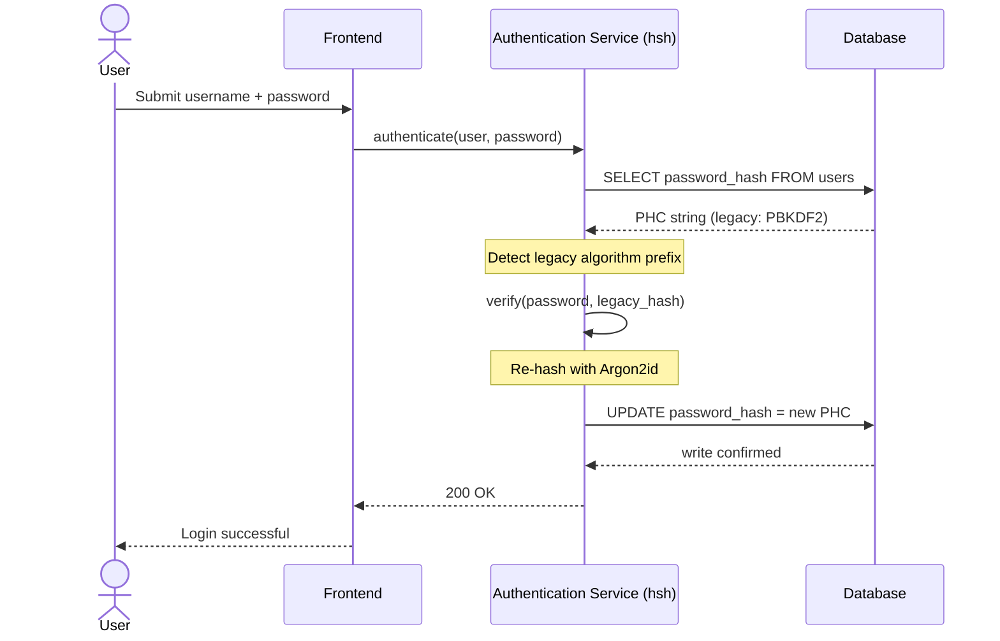
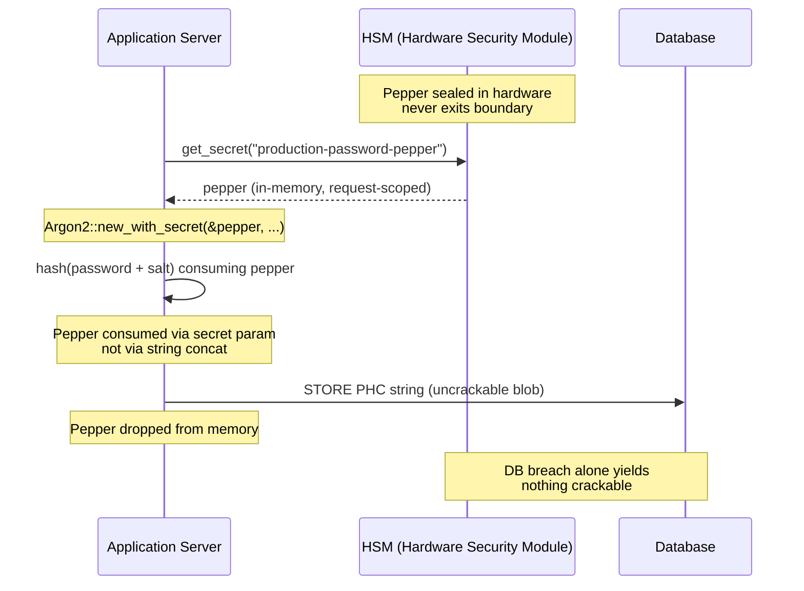

---
# Front Matter (YAML)
author: "contact@sebastienrousseau.com (Sebastien Rousseau)"
banner_alt: "Close-up van een ontwikkelaarsterminal die door Rust-compileroutput scrollt — de zichtbare discipline van een geheugenveilig, auditeerbaar cryptografisch fundament onder een enterprise banking-authenticatielandschap"
banner_height: "1597"
banner_width: "2584"
banner: "https://cloudcdn.pro/stocks/images/rustlogs.webp"
cdn: "https://cloudcdn.pro"
charset: "UTF-8"
cname: "sebastienrousseau.com"
copyright: "© Copyright 2025 - 2026 - Sebastien Rousseau. Alle rechten voorbehouden."
date: "June 22, 2026"
description: "hsh is een pure-Rust cryptografisch framework waarmee tier-1 banken legacy wachtwoordhashes zonder downtime kunnen migreren naar Argon2id, met HSM-peppering en zonder C-FFI-geheugenkwetsbaarheden — DORA-compliant."
format-detection: "telephone=no"
hreflang: "nl"
icon: "https://cloudcdn.pro/clients/sebastienrousseau/v1/logos/sebastienrousseau.svg"
id: "https://sebastienrousseau.com/2026-06-22-hsh-zero-downtime-cryptographic-stewardship-rust-banking-2026"
image_alt: "Zwart-witportret van Sebastien Rousseau"
image_height: "162"
image_width: "162"
image: "https://cloudcdn.pro/stocks/images/sebastienrousseau.webp"
keywords: "hsh, Rust-cryptografie, wachtwoordhashing, Argon2id, bankbeveiliging, HSM-interlock, DORA-compliance, Basel III, zero-downtime migratie, geheugenveiligheid, PBKDF2, scrypt, cyberherstel"
language: "nl-NL"
last_reviewed: "2026-06-22"
layout: "report"
locale: "nl_NL"
logo_alt: "Logo van Sebastien Rousseau"
logo_height: "44"
logo_width: "44"
logo: "https://cloudcdn.pro/clients/sebastienrousseau/v1/logos/sebastienrousseau.svg"
measurementID: "G-169G4ET5HQ"
name: "Sebastien Rousseau"
permalink: "https://sebastienrousseau.com/2026-06-22-hsh-zero-downtime-cryptographic-stewardship-rust-banking-2026"
rating: "general"
referrer: "no-referrer"
robots: "index, follow"
schema: "FAQPage, Article"
seo_title: "hsh: cryptografisch beheer zonder downtime in Rust voor banken"
short_name: "sebastienrousseau"
subtitle: "Hoe een pure-Rust cryptografisch framework banken in staat stelt legacy wachtwoorden naadloos te upgraden naar Argon2id met HSM-interlocks — en wat dit betekent voor DORA- en Basel III-compliance."
tags: "hsh, Rust, banken, cryptografie, Argon2id, HSM, DORA, Basel-III, beveiliging, open-source, operationele-veerkracht"
theme-color: "0, 83, 191"
title: "Wachtwoordbeheer beveiligen in enterprise banking: multi-algoritme hashing en upgrades met hsh"
url: "https://sebastienrousseau.com/2026-06-22-hsh-zero-downtime-cryptographic-stewardship-rust-banking-2026"
viewport: "width=device-width, initial-scale=1, shrink-to-fit=no"

# RSS
atom_link: "https://sebastienrousseau.com/2026-06-22-hsh-zero-downtime-cryptographic-stewardship-rust-banking-2026/rss.xml"
category: "Technology"
generator: "Static Site Generator (SSG) (version 0.0.40)"
item_description: "hsh is een pure-Rust cryptografisch framework waarmee tier-1 banken legacy wachtwoordhashes zonder downtime kunnen migreren naar Argon2id, met HSM-peppering en zonder C-FFI-geheugenkwetsbaarheden — DORA-compliant."
item_pub_date: "Mon, 22 Jun 2026 07:07:07 +0000"
item_title: "Wachtwoordbeheer beveiligen in enterprise banking: multi-algoritme hashing en upgrades met hsh"
pub_date: "Mon, 22 Jun 2026 07:07:07 +0000"
type: "article"

# Twitter Card
twitter_card: "summary_large_image"
twitter_creator: "@wwdseb"
twitter_description: "hsh stelt tier-1 banken in staat om legacy wachtwoordhashes te migreren naar Argon2id zonder downtime, met HSM-interlocks en geheugenveilig Rust."
twitter_image: "https://cloudcdn.pro/clients/sebastienrousseau/v1/logos/sebastienrousseau.svg"
twitter_title: "hsh: cryptografisch beheer zonder downtime in Rust"
twitter_url: "https://sebastienrousseau.com/2026-06-22-hsh-zero-downtime-cryptographic-stewardship-rust-banking-2026"

excerpt: "In het tijdperk van GPU-versnelde decryptie en DORA-mandaten is cryptografische rot een systeemrisico. Elke legacy PBKDF2- of scrypt-hash in een bankdatabase is een aftelklok tot compromittering. hsh verandert het model met zero-downtime, geheugenveilige upgrades..."

# Added by fix_hsh_frontmatter.py (template completeness)
apple_mobile_web_app_orientations: "portrait"
apple_touch_icon_sizes: "192x192"
apple-mobile-web-app-capable: "yes"
apple-mobile-web-app-status-bar-inset: "black"
apple-mobile-web-app-status-bar-style: "black-translucent"
apple-touch-fullscreen: "yes"
author_location: "London, United Kingdom"
author_twitter: "@wwdseb"
author_website: "https://sebastienrousseau.com"
docs: https://validator.w3.org/feed/docs/rss2.html
item_guid: "https://sebastienrousseau.com/2026-06-22-hsh-zero-downtime-cryptographic-stewardship-rust-banking-2026/rss.xml"
item_link: "https://sebastienrousseau.com/2026-06-22-hsh-zero-downtime-cryptographic-stewardship-rust-banking-2026/rss.xml"
last_build_date: "Mon, 22 Jun 2026 06:06:06 +0000"
managing_editor: "contact@sebastienrousseau.com (Sebastien Rousseau)"
menu: "active"
msapplication-navbutton-color: "0, 83, 191"
site_components: "Kaishi, Kaishi Builder, Kaishi CLI, Kaishi Templates, Kaishi Themes"
site_last_updated: "2023-07-05"
site_software: "Static Site Generator, Rust"
site_standards: "HTML5, CSS3, RSS, Atom, JSON, XML, YAML, Markdown, TOML"
ttl: "60"
twitter_site: "@wwdseb"
webmaster: "contact@sebastienrousseau.com"
apple-mobile-web-app-title: "hsh: Rust password hashing"
thanks: "Bedankt voor het lezen!"
twitter_image_alt: "Zwart-witportret van Sebastien Rousseau"
---

# Wachtwoordbeheer beveiligen in enterprise banking: multi-algoritme hashing en upgrades met hsh

<!-- lead-start: manual -->
<aside class="post-lead" aria-label="Samenvatting van het artikel">
<p class="post-lead-tldr"><strong>TL;DR.</strong> <a href="https://github.com/sebastienrousseau/hsh">hsh</a> is een open source, pure-Rust cryptografisch framework waarmee tier-1 banken legacy wachtwoordhashes kunnen migreren naar moderne standaarden zoals Argon2id zonder service-onderbreking. Door HSM-backed peppering te integreren en strikte geheugenveiligheid af te dwingen zonder C-gebaseerde FFI-wrappers, sluit het de cryptografische rot-kwetsbaarheden die DORA- en Basel III-compliance rechtstreeks bedreigen.</p>
<p class="post-lead-heading"><strong>Belangrijkste inzichten</strong></p>
<ul class="post-lead-takeaways">
  <li><strong>Het cryptografische rot-probleem.</strong> Legacy-algoritmen zoals PBKDF2 worden exponentieel zwakker naarmate hardware versnelt, waardoor het aanvalsoppervlak voor credential-stuffing en offline brute-force campagnes groeit.</li>
  <li><strong>Migratie zonder downtime.</strong> Het <code>verify_and_upgrade</code>-patroon hasht gebruikersgegevens transparant opnieuw tijdens reguliere login-events, waardoor het operationele risico van bulkdatabase-migraties verdwijnt.</li>
  <li><strong>Hardware-interlock en peppering.</strong> Hashes worden ingepakt met Hardware Security Modules (HSM's) of cloud-KMS-architecturen, zodat een database-inbraak op zichzelf geen kraakbare kandidaat-wachtwoorden oplevert.</li>
  <li><strong>Geheugenveiligheid als regulatoire basislijn.</strong> Volledig herschreven in safe Rust en afgedwongen via strikte dependency-hygiëne, elimineert hsh de buffer overflow- en supply chain-risico's die inherent zijn aan legacy C-gebaseerde cryptografische libraries.</li>
</ul>
<p class="post-lead-related"><strong>Verder lezen:</strong> <a href="https://sebastienrousseau.com/2026-06-20-http-handle-zero-dependency-edge-ingress-banking-rust-2026">http-handle: krachtige, zero-dependency edge-ingress voor banken in 2026</a>, <a href="https://sebastienrousseau.com/2026-06-07-autonomous-treasury-index-programmable-liquidity-tokenised-deposits-2026/index.html">The Autonomous Treasury Index in 2026</a>.</p>
</aside>
<!-- lead-end -->

> **Samenvatting.** Bankauthenticatie die is gebouwd tegen een dreigingsmodel uit 2018 voldoet niet langer onder het regulatoire regime van 2026. GPU-versnelde kraakcapaciteit, ASIC-dichtheid en de naderende post-kwantumhorizon hebben de veiligheidsmarge van PBKDF2 en scrypt met vroege parameters tenietgedaan; DORA Artikel 5 heeft dat verval omgezet in een door de raad verantwoorde aansprakelijkheid. hsh, een open-source pure-Rust framework, pakt het probleem op drie lagen tegelijk aan: een `verify_and_upgrade`-dispatcher die een opgeslagen credential bij elke geslaagde login opnieuw hasht naar de huidige Argon2id-parameters zonder onderhoudsvenster; een via HSM of KMS vergrendelde peppering-laag die ervoor zorgt dat een database-inbraak op zichzelf niets kraakbaars oplevert; en een geheugenveilige supply chain die het foreign-function-interface-aanvalsoppervlak elimineert dat inherent is aan C-onderbouwde cryptografische libraries. Het resultaat is een fundament dat voldoet aan DORA, de operationele-risicodiscipline van Basel III, de senior-manager-verantwoording onder SM&CR en de post-kwantummigratiehorizon van NIST IR 8547 — zonder het bulk-resetprogramma dat historisch nodig was om een authenticatielandschap te upgraden.

De meeste enterprise banking-authenticatie rust nog op een wachtwoordlaag die gehard is tegen een dreigingsmodel uit 2018. De hardware die deze laag breekt is verder geëvolueerd. Naarmate GPU-farms opschalen en cryptografisch relevante kwantumcomputers (CRQC's) dichterbij komen, vervalt legacy-hashing — PBKDF2, vroege scrypt — onder elk uur compute dat aanvallers besteden aan de offline kraakwachtrij. Het verval is stil: niets in de productiedatabase vertelt je dat de hash die gisteren sterk was, dat vandaag niet meer is.

Onder de [Digital Operational Resilience Act (DORA)](https://eur-lex.europa.eu/eli/reg/2022/2554/oj "Verordening (EU) 2022/2554 — Digital Operational Resilience Act") is het laten staan van niet-geroteerde, legacy cryptografische assets in productie geen technische schuld meer. Het is genoemde regulatoire aansprakelijkheid.

[hsh](https://github.com/sebastienrousseau/hsh "hsh — pure-Rust framework voor wachtwoordhashing") sluit het gat. Een pure-Rust framework dat meerdere hash-formaten naast elkaar beheert en zwakke credentials in-flight upgradet tijdens actieve loginsessies. De authenticatie-infrastructuur sluit aan op de veerkrachtmandaten van 2026 — zonder onderhoudsvenster, zonder geforceerde reset, zonder één seconde downtime.

## 01. Het cryptografische rot-probleem in banking

Om de noodzaak van een framework als hsh te begrijpen, moet je de levenscyclus van een wachtwoordhash kennen. Algoritmen verouderen niet sierlijk; ze vervallen ten opzichte van de hardware die ze kan kraken.

**De ASIC/GPU-versnellingskloof.** Algoritmen als PBKDF2 zijn ontworpen om computationeel duur te zijn voor CPU's. Vandaag gebruiken aanvallers sterk geparalleliseerde GPU's om offline dictionary-aanvallen uit te voeren. Een legacy-hash uit 2018 is enorm veel zwakker tegen een tegenstander uit 2026.

**Het big-bang migratierisico.** Wanneer een CISO besluit te upgraden van PBKDF2 naar een memory-hard algoritme als Argon2id, kunnen de hashes niet worden teruggedraaid om opnieuw versleuteld te worden. Traditionele oplossingen — een wachtwoordreset afdwingen bij miljoenen gebruikers — veroorzaken enorme klantfrictie en operationeel risico.

**De C-library supply chain.** Historisch leunt banking-middleware op libraries als `argonautica` of rauwe C-bindings voor hashing. Deze libraries dragen een verborgen supply chain-risico: één enkele memory-buffer overflow in de authenticatiemodule kan leiden tot remote code execution (RCE) op de meest geprivilegieerde laag van de bank-stack.

### Algoritme-vergelijking — hardwareweerstand en tuningoppervlak

De drie algoritmen die een bank realistisch tegenkomt in een migratiecorpus verschillen minder in de keuze van cryptografische primitieve en meer in hoe ze verouderen onder hardwaredruk. De tabel hieronder vat de praktische houding samen.

| Algorithm | Memory-hard | GPU / ASIC resistance | Tuning surface | 2026 status |
| ---- | ---- | ---- | ---- | ---- |
| **PBKDF2** | Nee | Laag — vectoriseert op GPU; sub-milliseconde per guess op commodity-hardware. | Alleen iteratieaantal. | Legacy. Alleen acceptabel als verify-side fallback tijdens migratie. |
| **scrypt** | Ja (bescheiden) | Gemiddeld — geheugenkosten verslaan eenvoudige GPU-farms; op schaal ASIC-amortiseerbaar. | `N` (CPU/geheugen), `r` (blokgrootte), `p` (parallelisme). | Afgeraden voor greenfield. Actief in migratiecorpora. |
| **Argon2id** | Ja (hoog) | Hoog — memory- en time-hard; bestand tegen side-channel- en TMTO-aanvallen. | Geheugenkosten (`m`), tijdkosten (`t`), parallelisme (`p`), secret (pepper). | Aanbevolen default. OWASP, NIST SP 800-63B-4 draft, FedRAMP. |

De boodschap voor het migratieplan is smal: PBKDF2 is een *verify-side* state, geen *write-side* bestemming. Elke geslaagde login op een PBKDF2-record moet onderweg naar buiten een Argon2id-record produceren.

## 02. De architecturale bril van hsh 2026

Het framework is opgebouwd uit vijf kernlagen, elk ontworpen om een specifieke categorie operationeel risico te mitigeren.

### Tabel 1: hsh-architectuurlagen en risicomitigatie

| Laag | Ontwerpbeslissing | Waarom het ertoe doet | Risico bij verkeerde aanpak |
| ---- | ---- | ---- | ---- |
| **Cryptografische primitieven** | Uniform PHC String-formaat met ondersteuning voor Argon2id, scrypt en PBKDF2 | Biedt best-in-class weerstand tegen GPU-aanvallen met behoud van achterwaartse compatibiliteit. | Datasilo's; zwakke algoritmen die 100B+ guesses/seconde offline toelaten. |
| **Policy-engine** | `verify_and_upgrade`-dispatch | Automatiseert de overgang van legacy naar moderne policies dynamisch bij login. | Beveiligingsrot; actieve gebruikers blijven hangen op gemakkelijk te kraken legacy hash-types. |
| **Hardware-interlock** | HSM- en Cloud KMS-"peppering"-capaciteiten | Zorgt dat een database-inbraak op zichzelf geen kandidaat-wachtwoorden blootlegt. | Offline brute-force-aanvallen die slagen na een SQL-injectie-inbraak. |
| **Beveiligingshygiëne** | `deny.toml`-handhaving en pure Rust | Blokkeert onveilige FFI en niet-vertrouwde externe C-dependencies volledig. | Catastrofale supply chain-aanvallen en memory-corruption-CVE's. |

## 03. Het zero-downtime rehash-pad

Het `verify_and_upgrade`-patroon lost datamigratie op via een intelligent, state-aware dispatchingsysteem dat geen database-downtime vereist.

Wanneer een gebruiker zijn credentials indient, leest hsh de opgeslagen Password Hashing Competition (PHC)-string. Bevat die een legacy-hash (bijvoorbeeld een verouderde PBKDF2-configuratie), dan voert het systeem de volgende flow uit:

1. **Identificatie:** parseert het legacy-algoritme en zijn specifieke parameters.
2. **Verificatie:** valideert het kandidaat-wachtwoord tegen de legacy-hash.
3. **Realtime upgrade:** bij een geslaagde match pakt het systeem het plaintext kandidaat-wachtwoord in het geheugen en berekent direct een nieuwe hash volgens de zeer veilige Argon2id-policy.
4. **Persistentie:** het levert de nieuwe PHC-string terug aan de banking-applicatie, die het legacy-record in de database overschrijft.

Dit proces is volledig transparant voor de eindgebruiker. Het migreert effectief de meest actieve accounts op dag één naar het hoogste beveiligingsniveau, waardoor het aanvalsoppervlak van de bank organisch en drastisch afneemt.

De onderstaande sequentie toont wat er gebeurt tijdens één login-event wanneer het opgeslagen record op een legacy-algoritme staat. De gebruiker ziet niets veranderen; het authenticatielandschap van de bank wordt met één record sterker.



### Implementatiepatroon — `verify_and_upgrade`-dispatch

Het integratieoppervlak binnen een authenticatieservice is klein. Het legacy-codepad blijft als fallback; het nieuwe codepad is de dispatcher.

```rust
use hsh::{Hasher, UpgradeResult};

struct UserRecord {
    username: String,
    password_hash: String, // PHC string
}

async fn authenticate(user: UserRecord, password_attempt: &str) -> Result<bool, AuthError> {
    let hasher = Hasher::new();
    match hasher.verify_and_upgrade(password_attempt, &user.password_hash) {
        Ok(UpgradeResult::Verified(is_valid)) => Ok(is_valid),
        Ok(UpgradeResult::Upgraded(new_hash)) => {
            db::update_user_hash(&user.username, new_hash).await?;
            Ok(true)
        }
        Err(_) => Err(AuthError::InvalidCredentials),
    }
}
```

Drie eigenschappen zijn van belang:

- **State-awareness.** `verify_and_upgrade` inspecteert de prefix van de PHC-string. Is de algoritmemarker legacy, dan triggert het framework automatisch de rehash tegen de geconfigureerde Argon2id-policy. Geen branching in de aanroepende code.
- **Atomiciteit.** Rehashing gebeurt alleen nadat de legacy-verificatie slaagt, binnen hetzelfde authenticatie-event. Geen aparte batch-job, geen ingeplande migratievenster en geen destructieve bulkmigratie om terug te draaien.
- **Persistentie.** De variant `UpgradeResult::Upgraded` draagt de nieuwe PHC-string. De applicatie persisteert die via hetzelfde datapad dat al bestaat voor het legacy-record — geen parallel schrijfoppervlak, geen tweefasen-schrijfprotocol.

**Foutmodi.** Mislukt de databaseschrijfactie of is de KMS kortstondig onbereikbaar tijdens de upgrade-schrijfactie, dan slaagt de sessie alsnog tegen de legacy-hash en blijft het record op het oude algoritme staan. De volgende geslaagde login probeert de upgrade opnieuw. Er is geen half-gemigreerde toestand en geen voor de gebruiker zichtbare fout — de migratie is monotoon over login-events heen, en de kost per record van een mislukte upgrade is precies één extra retry bij de volgende login.

## 04. Peppered hashes via HSM/KMS-interlock

Standaard wachtwoordhashing beschermt tegen directe databaselekken, maar als een aanvaller zowel de database (hashes en salts) bemachtigt, kan hij offline kraken uitvoeren.

hsh introduceert een robuuste "peppered" beveiligingslaag. Door integratie met Hardware Security Modules (HSM's) of cloud-native Key Management Services (KMS) wordt de uiteindelijke Argon2id-output cryptografisch ingepakt met een hoog-entropie sleutel die de veilige hardwaregrens nooit verlaat. Wordt de gebruikersdatabase geëxfiltreerd, dan bezit de aanvaller enkel versleutelde blobs. Hij kan geen wachtwoorden beginnen te kraken zonder ook de fysiek geïsoleerde HSM-infrastructuur van de bank te doorbreken.

Het onderstaande architectuurdiagram traceert het pad van het geheim. De pepper belandt nooit in de database; de database bevat zelf niets dat op zichzelf bruikbaar is. De twee opslaglagen kunnen onafhankelijk falen — het systeem verliest alleen vertrouwelijkheid als beide tegelijk falen.



### Implementatiepatroon — HSM-backed peppered Argon2id

De pepper wordt op aanroep tijd opgehaald uit de HSM, niet uit een configuratiebestand. `Argon2::new_with_secret` consumeert hem via de secret-parameter van het algoritme, niet via stringconcatenatie.

```rust
use argon2::{
    Argon2, Algorithm, Version, Params,
    PasswordHasher, PasswordVerifier,
    password_hash::{PasswordHash, SaltString, rand_core::OsRng},
};

async fn authenticate_with_hsm(
    user: UserRecord,
    password_attempt: &str,
) -> Result<bool, AuthError> {
    let pepper = hsm::client::get_secret("production-password-pepper").await?;
    let hasher = Argon2::new_with_secret(
        &pepper,
        Algorithm::Argon2id,
        Version::V0x13,
        Params::default(),
    )
    .map_err(|_| AuthError::Internal)?;

    let parsed = PasswordHash::new(&user.password_hash)
        .map_err(|_| AuthError::InvalidCredentials)?;
    if hasher.verify_password(password_attempt.as_bytes(), &parsed).is_ok() {
        if is_legacy_hash(&user.password_hash) {
            let new_hash = hasher
                .hash_password(
                    password_attempt.as_bytes(),
                    &SaltString::generate(&mut OsRng),
                )
                .map_err(|_| AuthError::Internal)?
                .to_string();
            db::update_user_hash(&user.username, new_hash).await?;
        }
        return Ok(true);
    }
    Err(AuthError::InvalidCredentials)
}
```

Uit deze vorm vloeien drie DORA-conforme consequenties voort:

- **Sleutelrotatie als key-managementprobleem.** De pepper leeft achter de HSM/KMS-grens, niet in de database. Rotatie wordt een key-managementwijziging, geen rehashing-campagne over het gehele gebruikersbestand. Nieuwe hashes binden aan de huidige pepperversie; oude hashes verifiëren onder hun gebonden versie totdat ze natuurlijk upgraden.
- **Functiescheiding.** De service-identiteit die de pepper leest moet auditeerbaar en least-privileged zijn. Een volledige database-exfiltratie zonder de bijbehorende HSM-grant levert niets kraakbaars op. Een gecompromitteerde HSM-grant zonder de database levert niets aanspreekbaars op. De blast radius van elk afzonderlijk falen is begrensd.
- **Vermijd length-extension en concat-bugs.** Door de secret-parameter van Argon2 te gebruiken in plaats van stringconcatenatie verdwijnt een hele klasse cryptografische valkuilen — length-extension, verkeerd getypeerde UTF-8-concatenatie, salt/pepper-volgordefouten — uit het implementatieoppervlak.

## 05. Regulatoire afstemming: DORA, Basel III en SM&CR

- **DORA Artikelen 5 en 6:** vereisen dat financiële entiteiten ICT-risicomanagementkaders onderhouden. Een strategie die leunt op niet-geroteerde, decennia-oude wachtwoordhashes schendt deze principes. hsh biedt een gedocumenteerd, geautomatiseerd mechanisme om cryptografische bescherming continu op te krikken.
- **Basel III:** koppelt regulatoir kapitaal aan de kans en ernst van verliesgebeurtenissen. Door Argon2id met HSM-interlock te implementeren wordt de ernst van een database-inbraak drastisch verlaagd, wat kwantificeerbare argumenten ondersteunt voor een lagere operationele-risicokapitaalallocatie.
- **SM&CR-aansprakelijkheid:** het goedkeuren van een architectuur die cryptografische rot actief verhelpt, geeft genoemde senior managers een verifieerbare, documenteerbare keten van risicoreductie.

## Veelgestelde vragen

**Is hsh productieklaar voor een authenticatiepad bij een tier-1 bank?**
De library is open source, gedocumenteerd en gebruikt Argon2id via dezelfde `argon2`-crate die de basis vormt van het RustCrypto-wachtwoordhashing-ecosysteem. Tier-1-adoptie volgt de eigen due diligence van de bank: onafhankelijke code review, reproducible-build-attestatie, vastgeprikte dependency-tree, integratietests met de HSM-leverancier en Operational Risk-goedkeuring. hsh levert het fundament; de bank certificeert de uitrol.

**Hoe vermijdt `verify_and_upgrade` het bulkmigratierisico?**
De verifier inspecteert de PHC-string bij parsing, draait het legacy-algoritme om het wachtwoord te valideren en — als het opgeslagen algoritme of parameterstel onder de huidige drempel ligt — rehasht de plaintext onder Argon2id met de gebonden HSM-pepper en schrijft de nieuwe PHC-string atomair terug. De gebruiker ervaart een normale login. Het landschap wordt sterker met één record per geslaagde authenticatie. Geen resetcampagne, geen onderhoudsvenster, geen operationeel risicovoorval.

**Wat gebeurt er met slapende accounts die nooit inloggen?**
Records die nooit authenticeren, worden nooit opnieuw gehasht. Banken pakken dit aan met twee complementaire policies: een gedocumenteerde dormancy-drempel (vaak 18–24 maanden) waarna het account administratief geroteerd wordt via een gecontroleerde resetcampagne, en een synthetische rehash-run tijdens gepland onderhoud voor accounts in gedefinieerde cohorten (hoge waarde, hoge privileges, gereguleerd). Beide zijn beleidskeuzes, geen library-gedrag; hsh registreert de dispatchbeslissing in audit-telemetrie zodat de operationele eigenaar dekking kan aantonen.

**Vormt de HSM-pepper een single point of failure op het authenticatiepad?**
Dezelfde HSM die betalingsberichten ondertekent en KMS-gebonden sleutels roteert, staat al in het pad. Het risico is identiek aan de bestaande houding van de bank; hsh erft het, het introduceert het niet. Mitigaties zijn standaard: HA HSM-paren, hot-spare KMS-regio's, request-scoped pepper-ophaal met circuit-breaker-fallback naar read-only-modus, en een expliciet operationeel runbook voor HSM-onbeschikbaarheid. De pepper is de secret-parameter van `argon2`, in-process geconsumeerd en na gebruik uit het geheugen verwijderd.

**Waar staat hsh ten opzichte van de post-kwantummigratie?**
hsh is een framework voor wachtwoord- en secret-hashing, geen key-encapsulation- of signature-primitief. De PQC-transitie die is gedocumenteerd in [NIST IR 8547](https://csrc.nist.gov/pubs/ir/8547/ipd "Transition to Post-Quantum Cryptography Standards") richt zich op key establishment (ML-KEM, FIPS 203) en handtekeningen (ML-DSA, FIPS 204; SLH-DSA, FIPS 205). De hashing-laag die hsh dekt staat grotendeels los van die migratie. De twee komen samen op het niveau van het fundament — beide willen een geheugenveilige, auditeerbare, reproduceerbaar opgebouwde cryptografische supply chain — wat precies de houding is die hsh vandaag mogelijk maakt.

## Conclusie

Deploy-and-forget wachtwoordhashing is voorbij. DORA heeft cryptografische passiviteit verschoven van technische schuld naar genoemde regulatoire aansprakelijkheid, en de hardwarecurve wordt elk jaar steiler. De bijdrage van hsh is geen sterker algoritme — Argon2id is al jaren beschikbaar. De bijdrage is de operationele machinerie om ernaar te migreren zonder downtime in te plannen, zonder gebruikersresets af te dwingen en zonder C-gebaseerde FFI-shims te vertrouwen met het authenticatiepad van de bank.

De [hsh-broncode](https://github.com/sebastienrousseau/hsh "hsh — pure-Rust framework voor wachtwoordhashing, duale MIT- en Apache 2.0-licentie") is beschikbaar onder de duale MIT- en Apache 2.0-licentie.

## Referenties

Basel Committee on Banking Supervision (2011). *Basel III: A global regulatory framework for more resilient banks and banking systems*. Bank for International Settlements. Beschikbaar op: [https://www.bis.org/publ/bcbs189.htm](https://www.bis.org/publ/bcbs189.htm "Basel III: A global regulatory framework for more resilient banks and banking systems")

Biryukov, A., Dinu, D., Khovratovich, D. en Josefsson, S. (2021). *RFC 9106: Argon2 Memory-Hard Function for Password Hashing and Proof-of-Work Applications*. Internet Engineering Task Force. Beschikbaar op: [https://datatracker.ietf.org/doc/html/rfc9106](https://datatracker.ietf.org/doc/html/rfc9106 "RFC 9106 — Argon2 Memory-Hard Function for Password Hashing")

Europees Parlement en Raad (2022). *Verordening (EU) 2022/2554 inzake digitale operationele veerkracht voor de financiële sector (DORA)*. Beschikbaar op: [https://eur-lex.europa.eu/eli/reg/2022/2554/oj](https://eur-lex.europa.eu/eli/reg/2022/2554/oj "Verordening (EU) 2022/2554 — DORA")

Financial Conduct Authority (2015). *Senior Managers and Certification Regime (SM&CR)*. Beschikbaar op: [https://www.fca.org.uk/firms/senior-managers-certification-regime](https://www.fca.org.uk/firms/senior-managers-certification-regime "Senior Managers and Certification Regime")

National Institute of Standards and Technology (2024). *Initial Public Draft — Transition to Post-Quantum Cryptography Standards (NIST IR 8547)*. Beschikbaar op: [https://csrc.nist.gov/pubs/ir/8547/ipd](https://csrc.nist.gov/pubs/ir/8547/ipd "NIST IR 8547 — Transition to Post-Quantum Cryptography Standards")

OWASP Foundation (2024). *Password Storage Cheat Sheet*. Beschikbaar op: [https://cheatsheetseries.owasp.org/cheatsheets/Password_Storage_Cheat_Sheet.html](https://cheatsheetseries.owasp.org/cheatsheets/Password_Storage_Cheat_Sheet.html "OWASP Password Storage Cheat Sheet")

<!-- enrich-start -->
<aside class="author-card" aria-label="Over de auteur"><span class="author-card-body"><strong class="author-card-name"><a href="/about/index.html">Sebastien Rousseau</a></strong><span class="author-card-bio">Senior banking-technoloog die schrijft over toegepaste AI, ISO 20022-migratie, post-kwantumcryptografie voor financiële dienstverlening en de structurele transformatie van wholesale payments.</span><span class="author-credentials">20+ jaar bij HSBC Commercial & Investment Bank, PayPal, Barclays, Shazam. <a href="https://www.linkedin.com/in/sebastienrousseau/" rel="external noopener">LinkedIn</a> &middot; <a href="https://github.com/sebastienrousseau" rel="external noopener">GitHub</a></span></span></aside>
<p class="post-reviewed">Laatst beoordeeld <time datetime="2026-06-22">2026-06-22</time>.</p>
<!-- enrich-end -->
