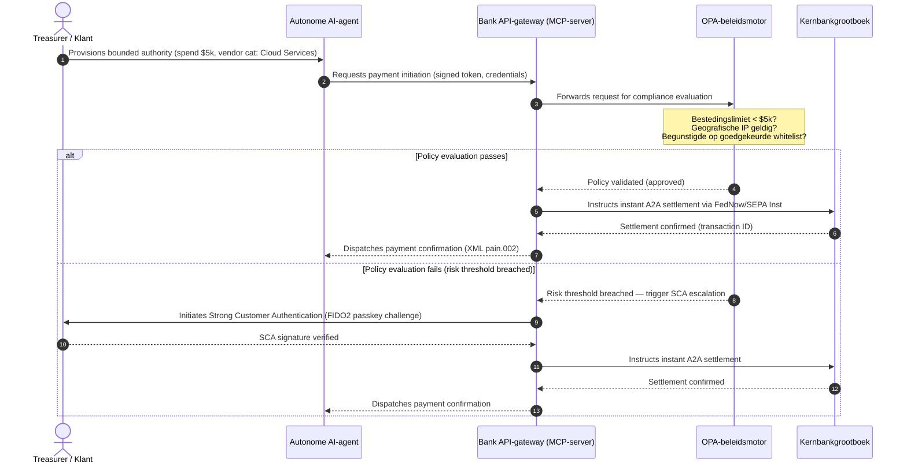

# Mondiale betalingsvooruitzichten 2026: operationeel model, risico en omzet in een agentische, onzichtbare, realtime wereld

De mondiale betalingscyclus van 2026 wordt bepaald door drie convergerende krachten — agentische handel, onzichtbare ingebedde betalingen en realtime uitvoering — bovenop een getokeniseerd uniform grootboek onder Project Agorá en een harde SWIFT-overgang naar gestructureerde adressen in november 2026.

<!-- lead-start -->
<aside class="post-lead" aria-label="Article summary">

<strong>TL;DR.</strong> Het betalingslandschap van 2026 is verschoven van een berichtenmigratie naar een meerdimensionaal operationeel model waarin risico en omzet worden bepaald door realtime uitvoering. Dit stuk bundelt de vooruitzichten 2026 van J.P. Morgan, Global Payments, HSBC en de Payments Association tot een G-SIB-operatieplan met vier pijlers: door modellen geïnitieerde agentische handel, altijd beschikbare treasury-API's, getokeniseerde uniforme grootboeken onder BIS Project Agorá en de SWIFT-deadline voor gestructureerde adressen op 14/15 november 2026. Swift CBPR+ verwijdert het ongestructureerde `<AdrLine>`-blok vanaf 14 november 2026; de EPC SEPA-rulebooks staan ongestructureerd adres alleen toe tot 15 november 2026.

<strong>Belangrijkste conclusies</strong>

<ul class="post-lead-takeaways">
  <li><strong>Agentische handel opent een grenslijn van gedelegeerde aansprakelijkheid.</strong> Autonome AI-agenten zullen naar verwachting tegen 2030 voor $3-$5 biljoen aan jaarlijkse handel bemiddelen. Banken moeten MCP-poortwachterschap, SCA-delegatie onder PSD3/PSR en het eigenaarschap van KYC/AML binnen multi-agent betaalketens vastleggen.</li>
  <li><strong>Altijd beschikbare liquiditeit is nu een operationele en regelgevende basislijn.</strong> 24/7 treasury-API's en virtuele rekeningen minimaliseren vastzittend kasgeld en verhogen de weerbaarheidsdrempel. Voor systeemkritische realtime-treasury-API's wordt vijf-negen beschikbaarheid (99,999 %) steeds vaker het interne engineeringdoel dat banken stellen om DORA-waardige veerkracht aan toezichthouders aan te tonen. DORA zelf schrijft geen universele vijf-negen norm voor; ze dekt ICT-risicobeheer, incidentrapportage, veerkrachttests, derdenrisico en toezicht op kritische ICT-aanbieders.</li>
  <li><strong>Tokenisatie is opgeschoven naar gereguleerde uniforme grootboeken.</strong> Project Agorá is het grootste publiek-private raamwerk voor getokeniseerde commerciële bankdeposito's en centralebankreserves. Banken hebben een tokenisatietraject in vijf stappen nodig, met expliciete prudentiële behandeling.</li>
  <li><strong>De overgang naar gestructureerde adressen op 14/15 november 2026 ligt vast.</strong> Swift CBPR+ verwijdert het ongestructureerde `<AdrLine>`-blok vanaf 14 november 2026; de EPC SEPA-rulebooks staan ongestructureerd adres alleen toe tot 15 november 2026. Beide leiden na de overgang tot afwijzingen. Schone datagovernance over product-, technologie- en compliance-teams heen is vereist.</li>
</ul>

<strong>Verder lezen:</strong> <a href="https://sebastienrousseau.com/2026-06-23-iso-20022-pain001-programmable-liquidity-autonomic-treasury-2026">Van Pain.001 naar programmeerbare liquiditeit: ISO 20022 als het autonome zenuwstelsel van treasury in 2026</a>, <a href="https://sebastienrousseau.com/2026-06-24-cross-border-iso-20022-open-finance-tokenised-deposits-treasury-2026">Grensoverschrijdend 2026: ISO 20022, open finance en getokeniseerde deposito's in corporate treasury</a>, <a href="https://sebastienrousseau.com/2026-06-25-quantum-dawn-cib-kyberlib-quantum-resilient-payments-stack-2026">Kwantumdageraad voor CIB: van KyberLib naar een kwantumweerbare betaalstack</a>.

</aside>
<!-- lead-end -->

Voor mondiale transactiebanken is de cyclus 2026-2028 een structureel venster. Moderne betalingsinfrastructuur is niet langer een administratieve utility — zij vormt de kern van een technologische strategie van bankniveau. Binnen G-SIB's en grote regionale instellingen zijn technologie, regelgeving en klantverwachting samengekomen in één operationeel vlak.

Drie krachten bepalen deze cyclus, en elk sluit direct aan op een zorg op directieniveau.

- **Agentische handel** — kanaaldistributie, productontwerp, toewijzing van aansprakelijkheid en Model Risk Management onder toezichthoudend toezicht.
- **Onzichtbare betalingen** — klantervaring, met risico op disintermediatie wanneer banken hun grootboek niet weten in te bedden in front-ends van bedrijven en handelaren.
- **Realtime uitvoering** — kapitaalsnelheid, met de daaruit volgende verschuivingen in liquiditeitsbeheer, kredietrisico, operationele weerbaarheid en fraudeverdediging.

De financiële inzet is materieel. Fraude schaalt op in snelheid en verfijning; regelgevende deadlines zijn hard; en de banken die proactief hun kernsystemen moderniseren ontsluiten substantiële kansen voor vergoedingsinkomsten. De kosten van niets doen zijn het omgekeerde: onmiddellijke afwijzing van transacties, operationele knelpunten, regelgevende boetes en snelle marktaandeelerosie.

## Zekerheidsladder — wat is gedateerd, gereguleerd, of voorspelling

Niet elk item in dit rapport draagt dezelfde zekerheid. De boardvraag is welke delta's deadlines zijn, welke toezichtverwachtingen, en welke nog marktprojecties — want het antwoord verandert het budgetgesprek.

| Categorie | Voorbeelden |
| --- | --- |
| **Harde deadlines** | Swift CBPR+ overgang naar gestructureerde adressen (14 november 2026); EPC SEPA-rulebooks (15 november 2026) |
| **Regelgevende verplichtingen** | DORA ICT-risico + veerkrachttests + derdentoezicht (EU); SCA-delegatie onder PSD3/PSR; MRM onder SR 11-7 + PRA SS1/23 |
| **Marktverschuivingen met hoge waarschijnlijkheid** | Realtime treasury-API's, AI-gestuurde fraudeverdediging, API-gebaseerde liquiditeit, deepfake-gedreven biometrische fraude |
| **Strategische opties** | Getokeniseerde deposito's, uniforme grootboeken onder Project Agorá, agentische-handelscorridors, continue FX (Wire 365) |
| **Voorspellingen** | `$3-$5 trillion` aan jaarlijkse agentische-handelsstromen tegen 2030 (McKinsey-basislijn) |

Behandel de bovenste twee rijen als compliancefeiten die een budgetlijn aansturen, ongeacht of de bank een deel van de opwaartse kant pakt. Behandel de onderste twee rijen als strategische opties — hoge overtuiging in richting, maar waar uitvoeringstiming een boardkeuze is in plaats van een agenda-item van de toezichthouder.

## De convergentie van mondiale betalingsautoriteiten

Dit rapport bundelt de betalings- en handelsvooruitzichten 2026 van vier gezaghebbende sectorstemmen — [J.P. Morgan Payments](https://www.jpmorgan.com/payments/newsroom/payments-outlook-2026-trends-report-released "J.P. Morgan Payments — Outlook 2026"), [Global Payments](https://investors.globalpayments.com/news-events/press-releases/detail/497/global-payments-releases-its-2026-commerce-and-payment "Global Payments — 2026 Commerce and Payment Trends Report"), HSBC en The Payments Association — en triangleert ze tegen de [G20-routekaart voor verbetering van grensoverschrijdende betalingen](https://www.fsb.org/2026/03/fsb-kicks-off-new-implementation-phase-to-enhance-cross-border-payments-through-public-private-partnership/ "FSB — cross-border payments implementation phase, March 2026").

Elke organisatie benadert het ecosysteem vanuit een andere markthoek, maar hun bevindingen convergeren op drie invarianten.

1. **Direct beschikbare, API-gestuurde rails zijn de basislijn.** Verouderde batchverwerkingsmodellen worden gemarginaliseerd voor grensoverschrijdende en grootschalige stromen; de transactiesnelheid in die segmenten wordt bepaald door altijd beschikbare, realtime berichten.
2. **AI is zowel bedreiging als verdediging.** Generatieve tools en deepfakes schalen transactiefraude op, wat realtime, gelaagde tegenverdediging met machinelearning vereist.
3. **Tokenisatie is productieklare infrastructuur.** Grootboeken worden samengevoegd om getokeniseerde commerciële verplichtingen en wholesale digitale centralebankvaluta's te huisvesten.

| Rapport | Primaire doelgroep | Focus | Kernpijler | Implicatie voor banken |
| --- | --- | --- | --- | --- |
| **J.P. Morgan Payments** | Corporate treasurers, G-SIBs | Real-time liquidity, fraud | APIs, AI biometrics | Rebuild liquidity, FX, and risk systems for continuous 365-day settlement. |
| **Global Payments** | Merchants, e-commerce | POS evolution, omnichannel | Agentic commerce, frictionless checkout | Build secure, API-gated merchant payment corridors for autonomous AI agents. |
| **HSBC Insights** | Multinational corporates | ERP integrations (SAP/Oracle), real-time cash | Treasury-as-a-Service, cash visibility | Monetise transactional API suites and embed real-time cash ledger reporting at source. |
| **The Payments Association** | Fintechs, payment institutions | Stablecoins, tokenisation, global regulation | Regulated digital assets, policy compliance | Prepare balance sheets for tokenised deposits and navigate PSD3/PSR liability structures. |

De vier vooruitzichten definiëren in feite de operationele stack van de private sector die bovenop de G20-beleidsinfrastructuur van de publieke sector draait, en vertalen beleidsintentie naar concrete beslissingen over liquiditeit, tokenisatie, data en fraudebeheersing binnen banken.

## Pijler 1 — Agentische handel en onzichtbare betalingen

Agentische handel is de overgang van door mensen aangestuurde, klik-om-te-kopen-afrekening naar autonome, door modellen gestuurde transactie-initiatie. Sectorprognoses convergeren op $3-$5 biljoen aan jaarlijkse handel die tegen 2030 door autonome agenten wordt bemiddeld — een aandeel in de lage enkele cijfers van het wereldwijde betalingsvolume dat wordt uitgevoerd zonder dat een mens op 'kopen' klikt.

Het retail- en commerciële ecosysteem kent een corresponderende kloof. Een duidelijke meerderheid van consumenten verwacht inmiddels betalingen met nagenoeg geen wrijving, maar minder dan de helft van de handelaren heeft prioriteit gegeven aan één-klik-afrekening of API-toegankelijke productcatalogi. AI-agenten kunnen niet door verouderde afrekenschermen met meerdere pagina's navigeren die voor menselijke ogen zijn ontworpen; ze hebben gestructureerde, machine-tot-machine API-handshakes nodig.

### Bankprioriteiten en operationele impact

- **Eigenaarschap van KYC en AML.** Banken moeten vastleggen wie de complianceverplichting draagt binnen een agentische transactieketen. Wanneer de persoonlijke AI-agent van een consument een transactie initieert via de agentische afrekening van een handelaar, moet de bank verifiëren dat de oorspronkelijke gedelegeerde bevoegdheid cryptografisch is gekoppeld aan de primaire rekeninghouder.
- **Herontwerp van aansprakelijkheid en terugboeking.** Kaartschema's en A2A-rails zijn ontworpen rond menselijke autorisatie. Wanneer een AI-agent een foutieve aankoop doet — bijvoorbeeld het inkopen van verkeerde industriële voorraad door een datafout — moeten banken de aansprakelijkheid duidelijk verdelen tussen consument, agentleverancier en handelaar.
- **Risicobeoordeling van agentische stromen.** Routeringsmotoren voor betalingen moeten agentische betalingen dynamisch beoordelen en hogere reservevereisten of interchange-tarieven toepassen op niet-menselijk geïnitieerde transacties totdat een stabiele afwikkelingsgeschiedenis bestaat.

### Begrensde actie en begrensde bevoegdheid

Om "ongebonden actie" te beperken — een inkoopagent in een onderneming die door een softwarefout in een oneindige recursieve aankooplus terechtkomt — moeten banken **API-poorten met begrensde bevoegdheid** uitrollen. Die poorten dwingen beleidslimieten af over drie dimensies.

1. **Gelaagde financiële limieten** — uitgaven van de agent beperkt op transactiegrootte, dagelijkse cumulatieve waarde en handelaarscategorie.
2. **Contextbewuste waarborgen** — secundaire signalen (tijdstip van de dag, IP-geolocatie, transactiefrequentie) beoordeeld voordat het grootboek middelen vrijgeeft.
3. **Mens-in-de-lus-escalatie** — verplichte menselijke autorisatie geactiveerd via Strong Customer Authentication (SCA) onder PSD3 / PSR zodra een transactie risicodrempels overschrijdt.

De Mermaid-sequentie hieronder toont de doelarchitectuur die veel banken zullen herkennen als de agentische betaalstroom met begrensde bevoegdheid.

### Het Model Context Protocol (MCP)

Om lokaal werkende AI-modellen te verbinden met door banken bestuurde uitvoeringslagen, standaardiseert de sector rond het [Model Context Protocol (MCP)](https://modelcontextprotocol.io "Model Context Protocol — open standard for LLM tool integration") — een open protocol waarmee LLM's duidelijk afgebakende, controleerbare tools en API's kunnen aanroepen zonder ruwe toegang tot kernsystemen.

Door bank-API's (betaalinitiatie, saldovraag, partijverificatie) in een MCP-server te verpakken, blijven LLM's weg van databasetabellen en system-root-controles. Het model interacteert met het grootboek uitsluitend via gestructureerde, geauditeerde, snelheidsbeperkte endpoints — de beveiliging wordt afgedwongen aan de grens van de agentische tooluitvoering en niet diep in het model verstopt.

## Pijler 2 — Treasury-transformatie en herziene liquiditeit

De snelheid van transaction banking in 2026 wordt bepaald door de verschuiving van end-of-day batchverwerking naar altijd beschikbare, realtime treasuryoperaties. Multinationale ondernemingen accepteren geen vastzittend kasgeld meer — liquiditeit die werkeloos op lokale rekeningen staat in weekends of vakantieperiodes omdat settlementsystemen gesloten zijn.

### De economische case voor realtime liquiditeit

J.P. Morgan en HSBC rapporteren beide dat ondernemingen met geavanceerde realtime kas- en datamogelijkheden materieel meer kans maken om peers te overtreffen op omzetgroei en kapitaalefficiëntie, vooral door vastzittende liquiditeit terug te dringen en werkkapitaalcycli te optimaliseren.

Om die waarde te oogsten, leveren banken **Treasury-as-a-Service (TaaS) API-producten** waarmee corporate ERP-systemen (SAP, Oracle) rechtstreeks aan het grootboek van de bank kunnen koppelen.

- **Realtime saldo-API's** met het `camt.052`-schema — vervangen filetransferprotocollen door directe, event-gestuurde rapportage van de kaspositie.
- **API's voor bulkbetaalinitiatie** met `pain.001` — directe, straight-through uitvoering van leveranciersbetalingsbatches vanuit het ERP-grootboek.
- **Continue FX-API's** — treasury-engines vergrendelen realtime, algoritmische valutakoersen voor grensoverschrijdende settlement en elimineren overnight marktrisico.
- **Virtuele rekening-API's** — ondernemingen activeren en sluiten dynamisch duizenden subrekeningen voor geautomatiseerde debiteurenmatching en grootboekscheiding.

### Operationele weerbaarheid en DORA

Het aanbieden van altijd beschikbare liquiditeit verandert het risicoprofiel van de bank. Voor systeemkritische realtime-treasury-API's wordt vijf-negen beschikbaarheid (99,999 %) steeds vaker het interne engineeringdoel dat banken stellen om DORA-waardige veerkracht aan toezichthouders aan te tonen. DORA zelf schrijft geen universele vijf-negen norm voor; ze dekt ICT-risicobeheer, incidentrapportage, veerkrachttests, derdenrisico en toezicht op kritische ICT-aanbieders.

Onder de [Digital Operational Resilience Act (DORA)](https://eur-lex.europa.eu/legal-content/EN/TXT/?uri=CELEX%3A32022R2554 "Regulation (EU) 2022/2554 — Digital Operational Resilience Act") is dat geen IT-KPI — het is een strikte regelgevende eis. Toezichthouders verwachten dat banken aantonen dat het oppervlak van de realtime treasury-API's en de grootboekdatabase ernstige-maar-aannemelijke cyberaanvallen, netwerkstoringen en hyperscaler-verstoringen kan absorberen zonder kritische betalingen te onderbreken of systemische liquiditeit in gevaar te brengen. Dat vereist geo-redundante, actief-actieve multi-cloud database-architecturen, realtime detectielagen voor bedreigingen en geautomatiseerde failover — zichtbaar in de changekostenregel, niet alleen in het auditdossier.

### Continue FX en grensoverschrijdende innovatie

De realtime treasury kan niet binnen één valutagrens leven. G-SIB's rollen continue FX-infrastructuur uit — het [Wire 365](https://www.jpmorgan.com/insights/payments/fx-cross-border/wire-365-global-clearing "J.P. Morgan — Wire 365 global clearing reinvented")-platform van J.P. Morgan verwerkt grensoverschrijdende betalingen en FX-conversies op elke dag van het jaar, buiten de traditionele RTGS-uren van centrale banken. Die laag haakt direct in op de getokeniseerde-deposito- en uniforme-grootboeksystemen die in Pijler 3 worden besproken.

## Pijler 3 — Getokeniseerde deposito's en het uniforme grootboek

Tokenisatie is opgeschoven van geïsoleerde proof-of-concept-pilots naar geschaalde monetaire infrastructuur van bankniveau. De aandacht is verschoven van private stablecoins en speculatieve cryptoassets naar **getokeniseerde commerciële bankdeposito's** en **wholesale digitale centralebankvaluta's (wCBDC)** die draaien op programmeerbare uniforme grootboeken.

Het referentieraamwerk is [Project Agorá](https://www.bis.org/about/bisih/topics/fmis/agora.htm "BIS Project Agorá — tokenisation of wholesale cross-border payments") — een grote publiek-private samenwerking belegd door de BIS en het IIF, met acht centrale banken en meer dan 40 private financiële instellingen (volgens de BIS Agorá-pagina, bijgewerkt op 27 mei 2026). Het project onderzoekt hoe getokeniseerde commerciële bankdeposito's integreren met getokeniseerde wholesale CBDC's op een gedeeld programmeerbaar grootboek om grensoverschrijdende settlementwrijving te elimineren, compliancecontroles te coördineren en 24/7 atomaire finaliteit te bereiken.

### Het tokenisatietraject in vijf stappen

Voor G-SIB's en grote regionale banken is tokenisatie een stapsgewijs traject van interne optimalisatie naar interoperabiliteit op de open markt.

1. **Interne treasuryliquiditeit** — tokeniseren van interne corporate kassaldi (bijv. JPM Coin of equivalente private bankgrootboeken) om directe, 24/7 grensoverschrijdende overdracht en netting tussen de eigen vestigingen van de bank mogelijk te maken.
2. **Begrensde multibank-corridors** — gesloten, gereguleerde consortia (de Project Agorá-sandbox) om interbancaire settlement en gedeelde grootboekstaten over verschillende instellingen heen te testen.
3. **Continue programmeerbare FX** — slimme contracten op het uniforme grootboek voeren directe Payment-versus-Payment (PvP) FX uit en elimineren settlementrisico over tijdzones heen.
4. **Getokeniseerde reële activa (RWA's)** — de getokeniseerde kasleg integreert met getokeniseerde effecten-, schuld- of handelsgrootboeken voor directe Delivery-versus-Payment (DvP)-finaliteit, waardoor kapitaalvergrendeling van dagen naar milliseconden gaat.
5. **Gereguleerde publieke/hybride interoperabiliteit** — beveiligde gateway-wrappers laten institutionele liquiditeit veilig interacteren met open publieke netwerken.

### Prudentiële en balansimplicaties

Getokeniseerd kasgeld moet zorgvuldig door prudentiële raamwerken worden geleid. Toezichthouders benadrukken dat een getokeniseerde deposito economisch gelijkwaardig moet zijn aan een traditionele commerciële bankdeposito — dat wil zeggen een ongedekte verplichting op de balans van de bank met dezelfde dekking door depositogarantie.

Operationeel introduceren getokeniseerde deposito's risico's die klassieke liquiditeitsstressmodellen niet zijn gebouwd om te simuleren. Slimme contracten voeren programmeerbare opnames uit op snelheden en in volumes die verouderde aannames niet vatten. Onder Basel III moeten banken garanderen dat de risicomotor programmeerbare kasafvloei kan modelleren en dat het getokeniseerde grootboek schoon interopereert met legacy RTGS-systemen gedurende de dagelijkse liquiditeitscyclus.

### Stablecoins versus getokeniseerde deposito's — een genuanceerde positie

Private volledig gedekte stablecoins (USDC, etc.) blijven marktaandeel veroveren in grensoverschrijdende retailremittances en gedecentraliseerde handel, maar missen de kredietcreatiecapaciteit en settlementfinaliteit van het commerciële banksysteem.

In plaats van te concurreren op retailrails bouwen transactiebanken bewaarneming op, geven ze hun eigen gereguleerde getokeniseerde verplichtingsinstrumenten uit en zetten ze beveiligde on-/off-ramp-gateways op. Corporate klanten krijgen programmeerflexibiliteit terwijl het kapitaal binnen de gereguleerde perimeter blijft.

### Vragen die een board zou moeten stellen over getokeniseerd geld

- **Deelname aan uniforme grootboeken.** Wat is onze actieve strategische routekaart voor deelname aan wholesale publiek-private uniforme-grootboekinitiatieven zoals Project Agorá?
- **Balans en risicomodellering.** Hebben onze risicomotoren en kapitaalvereistenraamwerken hun stresstesten bijgewerkt om de snelheid van door slimme contracten geactiveerde tokenafvloei te modelleren?
- **First-mover-klantsegmenten.** Welke segmenten in onze corporate-treasury- en commercial-banking-klanten zouden direct baat hebben bij programmeerbare, getokeniseerde DvP/PvP-settlement?

## Pijler 4 — Gestructureerde data en fraudeverdediging

Infrastructuurcompliance in 2026 wordt gedomineerd door de **overgang naar gestructureerde adressen op 14/15 november 2026** — twee aangrenzende deadlines die samen het ongestructureerde-adrespad sluiten over grensoverschrijdende en intra-EU rails. Onder [SWIFT Standards Release (SR) 2026](https://www.swift.com/standards/iso-20022/removal-unstructured-address "SWIFT — Removal of unstructured address, November 2026") stopt Swift CBPR+ vanaf **14 november 2026** met het accepteren van volledig ongestructureerde `<AdrLine>`-blokken. Onder de EPC SEPA-rulebooks staat ongestructureerd adres alleen toe tot **15 november 2026**. Na de overgangen wordt elk grensoverschrijdend of binnenlands bericht met een ongestructureerd adres waar gestructureerde elementen worden verwacht, door het netwerk vertraagd of afgewezen.

De meeste instellingen kennen de datum. Velen behandelen het als een oppervlakkige mappingoefening op de interfacelaag. De werkelijkheid is een diepere uitdaging rond datakwaliteit en datagovernance. Om catastrofale afwijzingspercentages te voorkomen, hebben betaaloperaties een helder cross-functioneel governanceraamwerk nodig.

- **Product en operaties.** Data-opname aan de bron. Klantgerichte digitale portalen, onboardinginterfaces en invoervelden van corporate ERP-systemen moeten gestructureerde adresvelden (`<StrtNm>`, `<PstCd>`, `<TwnNm>`, `<Ctry>`) afdwingen op het moment van betaalinitiatie.
- **Technologie.** Parsen, mapping, schemavalidatie. Validatiemotoren blokkeren legacybestanden voordat ze de SWIFT-interface bereiken. Lokaal uitgerolde machinelearningmodellen parsen legacy ongestructureerde adresblokken naar XML-conforme tags onder `<PstlAdr>`.
- **Compliance en risico.** Sanctiescreening, transactiemonitoring en AML-logica geüpdatet om de gestructureerde XML-velden te ingesten — wat de fout-positiefpercentages en handmatige onderzoeken terugdringt.

### De businesscase voor gestructureerde data

Behandeld als compliancekost is het programma voor gestructureerde data duur. Behandeld als omzetenabler verdient het zichzelf terug.

1. **Geavanceerde kredietbeoordeling.** Gestructureerde factuur-, remittance- en uiteindelijke-debiteurdata stellen banken in staat geautomatiseerde, precieze werkkapitaalfinanciering en supply-chain-factoringprogramma's voor corporate klanten te bouwen.
2. **Geautomatiseerde debiteurenmatching.** Het blootleggen van gestructureerde partij- en factuuridentifiers ondersteunt premium kassoftwareproducten voor reconciliatie en virtuele-rekeningenpooling, wat nieuwe transactievergoedingsinkomsten genereert.
3. **Te monetiseren transactieanalyses.** Banken bundelen en verkopen granulaire realtime liquiditeits- en koopgedragsdashboards aan corporate CFO's en treasurers.

### Een gelaagde AI-fraudeverdediging

Naarmate transactiesnelheden naar realtime versnellen, schalen ook fraudetechnieken op. Het [Identity Fraud Report 2026 van Entrust](https://www.entrust.com/resources/reports/identity-fraud-report "Entrust 2026 Identity Fraud Report") plaatst deepfakes op **één op vijf biometrische fraudepogingen**; eerdere Entrust-analyse plaatste deepfakes specifiek op **40 % van de biometrische videopogingen**.

De verdediging is een **drielaags AI-fraudemodel**.

1. **Identiteitslaag.** Biometrisch geverifieerde [FIDO2](https://fidoalliance.org/fido2/ "FIDO Alliance — FIDO2 specification")-passkeys, cryptografisch ondertekende hardware-apparaatbinding en gedecentraliseerde digitale ID-wallets om betaaltoegang te beveiligen.
2. **Gedragslaag.** Continue gedragsbiometrie — pacing van sessienavigatie, typecadans, apparaatoriëntatie — om geautomatiseerde botuitvoering of sessiekapingspogingen te detecteren.
3. **Transactielaag.** De gestructureerde velden van ISO 20022 voeden realtime machinelearning-risicomotoren die transactiemetadata kruisreferentieren met gedeelde consortium-intelligentie op netwerkniveau om verdachte transacties binnen milliseconden na initiatie te identificeren.

Om toezichthouders tevreden te stellen, nemen de AI-modellen op de transactielaag strikte **verklaarbaarheidsparameters** op en opereren ze onder een toegewijd Model Risk Management (MRM)-programma. Toezichthouders verwachten dat banken de specifieke datapunten en algoritmische logica kunnen uitleggen die een geautomatiseerde blokkade of fraudemelding hebben getriggerd, in lijn met [US Federal Reserve SR 11-7](https://www.federalreserve.gov/frrs/guidance/supervisory-guidance-on-model-risk-management.htm "US Federal Reserve — Supervisory Guidance on Model Risk Management, SR 11-7") en de [PRA SS1/23](https://www.bankofengland.co.uk/prudential-regulation/publication/2023/may/model-risk-management-principles-for-banks-ss "Bank of England PRA SS1/23 — Model Risk Management principles for banks") van de Bank of England.

## Boardroom-agenda 2026-2028

Om over de vier pijlers heen uit te voeren, moeten managementorganen van G-SIB's en regionale banken operationele en technologie-investeringen organiseren langs een heldere driehorizon-routekaart.

### Horizon 1 — Directe compliance en kernverharding (0-12 maanden)

- **Focus.** Standaardiseer de datakwaliteit van ISO 20022 en zeker basale realtime transactiepaden.
- **Succesindicator (KPI).** Nul afwijzingen op ongestructureerde adressen in SWIFT en SEPA na de overgangen van 14/15 november 2026.
- **Bestuurlijke eigenaar.** Chief Operating Officer / Head of Payment Operations.
- **Type oplevering.** No-regrets-zet. Updates van het kerndatabaseschema en de validatiemotor voor SWIFT SR 2026.

### Horizon 2 — Automatisering en agentische waarborgen (12-24 maanden)

- **Focus.** API-poorten met begrensde agentische bevoegdheid en architectuur voor continue fraudeverdediging.
- **Succesindicator (KPI).** 100 % van de machine-tot-machine- en door AI geïnitieerde API-transacties gevalideerd via FIDO2-hardwarebinding en beleidsmotoren met begrensde bevoegdheid.
- **Bestuurlijke eigenaar.** Chief Information Officer / Chief Risk Officer.
- **Type oplevering.** No-regrets-zet (fraudeverdediging) plus strategische optie (agentische handel). MCP-uitrol en de drielaagse fraude-AI.

### Horizon 3 — Platformtokenisatie en uniforme grootboeken (24-36 maanden)

- **Focus.** Verschuif treasury-activa naar getokeniseerde deposito's en neem deel aan gedeelde grensoverschrijdende grootboeken.
- **Succesindicator (KPI).** Ten minste 15 % van het settlementvolume in hoogwaardige corporate treasury verwerkt via getokeniseerde depositoinstrumenten of arrangementen rond uniforme grootboeken (bijv. Project Agorá-corridors).
- **Bestuurlijke eigenaar.** Group Treasurer / Head of Transaction Banking.
- **Type oplevering.** Strategische optie. Programmeerbare grootboekinfrastructuur, slimme-contractregels voor liquiditeit, DvP/PvP-settlementadapters.

## Wat te doen op maandagochtend — een zespunts-checklist voor banken

De driehorizon-routekaart is het cyclusplan. De checklist hieronder is wat een CIO, COO of Head of Transaction Banking aan het einde van de volgende werkweek op tafel kan hebben, ongeacht hoe volwassen de rest van het programma is.

1. **Inventariseer blootstelling aan ongestructureerde adressen** per kanaal en berichttype. Elke legacy bestandsroute, elk legacy API-endpoint, elk corporate ERP dat nog vrije-tekst `<AdrLine>` uitstuurt. Output: een telling, een eigenaar en een remediatiedatum per bron.
2. **Stel een risicotaxonomie voor agentische betalingen op.** Categoriseer niet-menselijk geïnitieerde stromen op initiatiemethode (consumentagent, handelaarsagent, corporate inkoopagent), tegenpartijtype en rail. Output: een eenpagina-taxonomie en een ticket voor de routeringsmotor.
3. **Definieer beleidslimieten voor gedelegeerde bevoegdheid voor door AI geïnitieerde betalingen.** Gelaagde limieten op transactieomvang, handelaarscategorie, geografie. Output: een conceptspecificatie als policy-as-code die de OPA-motor kan afdwingen.
4. **Breng DORA-kritische treasury-API's en derdenafhankelijkheden in kaart.** Welke API's vallen onder het ernstige-maar-aannemelijke scenario-inventaris; van welke derden ze afhankelijk zijn; welke contracten al voldoen aan DORA Article 28. Output: een rij in het register kritische ICT-derden per API.
5. **Identificeer twee gebruikssituaties voor getokeniseerde deposito's met meetbare treasurywaarde.** Intern netting tussen vestigingen en één corridor in de buurt van Project Agorá zijn de realistische eerste twee. Output: een uitgewerkte businesscase per geval, met eigenaar en 90-dagen-beslissingsdatum.
6. **Bouw een modelrisicocontrolekader voor fraude en agentische besluitvorming.** Koppel elk ML-model in de fraude- en agentische-betaalpaden aan de verwachtingen van SR 11-7 / PRA SS1/23: gedocumenteerd doel, datalineage, verklaarbaarheid, monitoring, overrulepad. Output: een eenpagina-MRM-controlematrix per model.

Het punt van de lijst is niet dat iets ervan nieuw is. Het punt is dat hij klein genoeg is om deze week te beginnen, observeerbaar genoeg om in het volgende uitvoerende comité te volgen, en structureel aligned met de vier pijlers zodat het vroege werk het programma voedt in plaats van ermee concurreert.

## FAQ

**Bereikt agentische handel echt $3-$5 biljoen tegen 2030?**
De basislijn van McKinsey wijst op $5 biljoen aan agentische-handelsverkopen tegen 2030, met een reeks onafhankelijke prognoses die clusteren tussen $3 biljoen en $5 biljoen. De variatie weerspiegelt hoe agressief handelaren machine-leesbare afreken-API's uitrollen en hoe snel banken agenten laten transacteren onder SCA-delegatie — het knelpunt zit aan de bank- en handelaarkant, niet aan de capaciteitskant van de agent.

**Gelden de overgangen van 14/15 november 2026 ook voor binnenlandse SEPA-stromen?**
Ja. De eis voor gestructureerde adressen geldt voor CBPR+ grensoverschrijdend en voor SEPA-betaalberichten. Banken die beide rails draaien hebben één canoniek adresschema upstream van de SWIFT-interface nodig, geen twee parallelle mappings.

**Is een getokeniseerde deposito hetzelfde als een stablecoin?**
Nee. Een getokeniseerde deposito is een ongedekte verplichting op de balans van een gereguleerde bank, met dezelfde dekking door depositogarantie als een traditionele deposito. Een stablecoin is doorgaans een volledig gedekt instrument uitgegeven door een niet-bank, zonder kredietcreatiecapaciteit. Het ontwerp van Project Agorá gaat ervan uit dat getokeniseerde deposito's naast wholesale CBDC's staan op een gedeeld programmeerbaar grootboek; stablecoins spelen geen rol in de wholesale settlementleg.

**Hoe verhoudt Project Agorá zich tot bestaande wCBDC-pilots?**
Agorá is het integrerende raamwerk. Nationale wCBDC-experimenten dekken het centralebankgeldleg af; Agorá brengt getokeniseerde commerciële deposito's op hetzelfde programmeerbare grootboek zodat grensoverschrijdende settlement atomair is over beide geldtypen heen. De zeven deelnemende centrale banken en 40+ private instellingen maken het de grootste publiek-private ontwerpgrond voor de wholesale getokeniseerde geldarchitectuur.

**Wat is de minimale DORA-compliancehouding voor een TaaS-API?**
Geo-redundante actief-actieve uitrol, gedocumenteerde ernstige-maar-aannemelijke cyberscenario's met benoemde eigenaren onder SM&CR (UK), en een geteste failover die kritische betalingen niet onderbreekt. Zonder dat is het TaaS-product een regelgevende verplichting voordat het een omzetlijn is.

## Referenties

- Bank for International Settlements (BIS) Innovation Hub. (2026). *Project Agorá: exploring tokenisation of wholesale cross-border payments*. [BIS Project Agorá](https://www.bis.org/about/bisih/topics/fmis/agora.htm).
- Deutsche Bank. (2026). *Digital Money: a perspective on stablecoins, tokenised deposits and CBDCs*. [Deutsche Bank Flow](https://flow.db.com/publications/flow-white-papers-and-guides/digital-money-a-perspective-on-stablecoins-tokenised-deposits-and-cbdcs).
- European Parliament and Council. (2022). *Regulation (EU) 2022/2554 on Digital Operational Resilience (DORA)*. [DORA Regulation](https://eur-lex.europa.eu/legal-content/EN/TXT/?uri=CELEX%3A32022R2554).
- Financial Stability Board. (2026). *FSB kicks off new implementation phase to enhance cross-border payments*. [FSB statement](https://www.fsb.org/2026/03/fsb-kicks-off-new-implementation-phase-to-enhance-cross-border-payments-through-public-private-partnership/).
- Global Payments. (2025). *2026 Commerce and Payment Trends Report — press release*. [Global Payments press release](https://investors.globalpayments.com/news-events/press-releases/detail/497/global-payments-releases-its-2026-commerce-and-payment).
- J.P. Morgan Payments. (2026). *Payments Outlook 2026 Trends Report Released*. [J.P. Morgan Newsroom](https://www.jpmorgan.com/payments/newsroom/payments-outlook-2026-trends-report-released).
- J.P. Morgan Insights. (2026). *5 Payment Trends to Watch for in 2026*. [J.P. Morgan Trends](https://www.jpmorgan.com/insights/payments/trends-innovation/five-payment-trends-in-2026).
- J.P. Morgan FX & Cross-Border. (2026). *Wire 365: Global Clearing Reinvented*. [J.P. Morgan FX Wire 365](https://www.jpmorgan.com/insights/payments/fx-cross-border/wire-365-global-clearing).
- SWIFT. (2026). *ISO 20022 milestone for November 2026: unstructured addresses to be removed*. [SWIFT ISO 20022 Milestone](https://www.swift.com/news-events/news/iso-20022-milestone-november-2026-unstructured-addresses-be-removed).
- SWIFT Standards. (2026). *Removal of unstructured address*. [SWIFT Standards](https://www.swift.com/standards/iso-20022/removal-unstructured-address).
- Bank of England. (2023). *Supervisory Statement (SS1/23) — Model Risk Management principles for banks*. [Bank of England PRA SS1/23](https://www.bankofengland.co.uk/prudential-regulation/publication/2023/may/model-risk-management-principles-for-banks-ss).
- US Federal Reserve. (2011). *Supervisory Guidance on Model Risk Management (SR 11-7)*. [SR 11-7](https://www.federalreserve.gov/frrs/guidance/supervisory-guidance-on-model-risk-management.htm).
- McKinsey & Company. (2025). *McKinsey forecast: $5 trillion in agentic commerce sales by 2030* (via Digital Commerce 360). [McKinsey agentic forecast](https://www.digitalcommerce360.com/2025/10/20/mckinsey-forecast-5-trillion-agentic-commerce-sales-2030/).
- HSBC Business. (2026). *HSBC Business Insights*. [HSBC Insights](https://www.business.hsbc.com/en-gb/insights).
- Bright Defense. (2026). *Deepfake Statistics: A Growing Security Concern*. [Deepfake fraud statistics](https://www.brightdefense.com/resources/deepfake-statistics/).
- European Banking Authority. (2019). *Guidelines on outsourcing arrangements (EBA/GL/2019/02)*. [EBA Outsourcing Guidelines](https://www.eba.europa.eu/regulation-and-policy/internal-governance/guidelines-on-outsourcing-arrangements).

<!-- enrich-start -->
<aside class="author-card" aria-label="About the author"><strong class="author-card-name"><a href="/about/index.html">Sebastien Rousseau</a></strong>Senior banking technologist writing on applied AI, ISO 20022 migration, post-quantum cryptography for financial services, and the structural transformation of wholesale payments.20+ years across HSBC Commercial &amp; Investment Bank, PayPal, Barclays, Shazam, AKQA, Virgin Group. <a href="/about/index.html">Full profile</a> &middot; <a href="https://www.linkedin.com/in/sebastienrousseau/" rel="external noopener">LinkedIn</a> &middot; <a href="https://github.com/sebastienrousseau" rel="external noopener">GitHub</a></aside>

Last reviewed <time datetime="2026-06-25">2026-06-25</time>.

<!-- enrich-end -->
