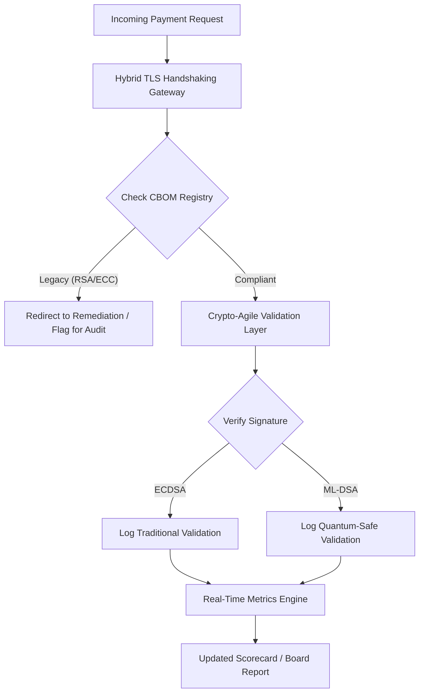

# Post-Quantum Security Scorecard 2026: een metriekkader op bestuursniveau voor fiduciaire cryptografische wendbaarheid

<aside class="post-lead" aria-label="Artikelsamenvatting">

<strong>TL;DR.</strong> Per juni 2026 is post-kwantum cryptografie (PQC) overgegaan van een experimentele technische kwestie naar een primaire fiduciaire verplichting. Besturen moeten nu de systematische migratie van verouderde versleuteling naar de standaarden NIST FIPS 203 en 204 overzien om systemische financiële en operationele risico's onder DORA te beperken.

<strong>Belangrijkste conclusies</strong>

<ul class="post-lead-takeaways">
  <li><strong>G20-afstemming en harde deadlines.</strong> Internationale toezichthouders hebben het einde van de jaren 2020 als harde deadline gesteld voor kwantumveilige overgangen en verlangen van instellingen dat zij meetbare migratievoortgang aantonen.</li>
  <li><strong>De Cryptographic Bill of Materials (CBOM).</strong> Analoog aan een software-BOM is een CBOM een actuele, geautomatiseerde inventaris van alle cryptografische middelen, noodzakelijk om zicht te houden op de toeleveringsketen.</li>
  <li><strong>Harvest-Now-Decrypt-Later (HNDL)-blootstelling.</strong> Tegenstanders onderscheppen en bewaren nu reeds versleuteld wholesale-betalingsverkeer met hoge waarde; beperking vereist onmiddellijke uitrol van hybride PQC-architecturen.</li>
  <li><strong>Fiduciaire governance via crypto-agility.</strong> Crypto-agility is een meetbare governance-metriek. Het vermogen om cryptografische primitieven uit te wisselen zonder herontwerp van het kernsysteem (met bibliotheken als KyberLib) is nu een bestuursverantwoordelijkheid onder SM&CR.</li>
</ul>

<strong>Gerelateerde lectuur:</strong> <a href="https://sebastienrousseau.com/2026-06-12-kyberlib-post-quantum-banking-migration-standards-code-2026">KyberLib en de post-kwantum migratie in banken in 2026</a>, <a href="https://sebastienrousseau.com/2023-11-19-crystals-kyber-the-safeguarding-algorithm-in-a-quantum-age/index.html">CRYSTALS-Kyber: het beschermingsalgoritme in een kwantumtijdperk</a>.

</aside>
Post-kwantum beveiliging is geen onderzoeksproject meer. De "toezichtsklok" tikt richting handhavingsdeadlines aan het einde van de jaren 2020. De afronding van [NIST FIPS 203 (ML-KEM)](https://csrc.nist.gov/pubs/fips/203/final) en [NIST FIPS 204 (ML-DSA)](https://csrc.nist.gov/pubs/fips/204/final) heeft de standaarden voor sleutelinkapseling en digitale handtekeningen gecodificeerd.

Toezichthouders verwachten nu van Tier-1 banken dat zij verder gaan dan pilotprogramma's. In 2026 ligt de focus op de industrialisatie van deze standaarden. Het niet kunnen aantonen van een helder migratiepad brengt aanzienlijke toezichtssancties met zich mee onder de [Digital Operational Resilience Act (DORA)](https://eur-lex.europa.eu/eli/reg/2022/2554/oj) en potentiële persoonlijke aansprakelijkheid voor bestuurders die de voorzienbare dreiging van kwantum-gestuurde ontsleuteling negeren.

## 01. De kwantumscorecard op bestuursniveau

De volgende metrieken bieden een gestandaardiseerd kader voor besturen om de kwantumgereedheid en cryptografische gezondheid van Commercial & Investment Banking (CIB)-domeinen te beoordelen.

### Tabel 1: PQC-scorecardmetrieken en toleranties

| Metriek | Wiskundige formule | Door bestuur goedgekeurde toleranties | Risico bij overschrijding |
| ---- | ---- | ---- | ---- |
| **Inventarisvolledigheidspercentage (ICP)** | (Geïdentificeerde cryptografische activa / Totaal geschatte activa) × 100 | > 98% | Schaduwversleuteling en blinde vlekken in datastromen van waardevolle clearing. |
| **HNDL-blootstellingspercentage (HER)** | (Langlevende data op verouderde crypto / Totaal langlevende data) × 100 | < 5% | Permanente compromittering van bedrijfsgeheimen, staatsschuldgrootboeken en wholesale-betalingsrecords. |
| **NIST-migratievoortgangspercentage (MPR)** | (Systemen op FIPS 203/204 / Totaal kritieke systemen) × 100 | > 60% (per ultimo 2026) | Niet-naleving van toezichtsregels en uitsluiting van G20-conforme tegenpartijen. |
| **Crypto-Agility Readiness Index (CARI)** | (Apps met geabstraheerde cryptografielagen / Totaal kerntoepassingen) × 100 | > 85% | Ernstige technische schuld en onvermogen om te reageren op toekomstige algoritme-uitfaseringen. |

## 02. De Cryptographic Bill of Materials (CBOM)

De ICP-metriek wordt vastgesteld via een uitgebreide **CBOM-ontdekkingsfase**. Dit is een geautomatiseerd proces dat elk cryptografisch eindpunt binnen de onderneming identificeert.

- **Eindpuntontdekking:** scannen van interne en cloud-netwerken op actieve TLS-sessies om verouderd RSA- of ECC-gebruik te identificeren.
- **Sleutelinventaris:** publieke/private sleutelparen koppelen aan hun respectieve eigenaren en exacte vervaldata in kaart brengen.
- **Afhankelijkheidsanalyse:** identificeren van bibliotheken en API's van derden die op uitgefaseerde algoritmen vertrouwen.

Deze ontdekkingsfase creëert één enkele bron van waarheid, waarmee de CISO over cryptografische gezondheid kan rapporteren met dezelfde granulariteit als financiële prestaties.

## 03. HNDL-blootstelling in wholesale-betalingen elimineren

Tegenstanders richten zich actief op wholesale-betalingen en langlevende bedrijfsdatabases. Deze "Harvest-Now-Decrypt-Later" (HNDL)-aanvallen behelzen het onderscheppen en archiveren van het versleutelde verkeer van vandaag.

Zelfs als er vandaag geen cryptografisch relevante kwantumcomputer (CRQC) bestaat, zal de nu onderschepte data in de toekomst kwetsbaar zijn. Beperking hiervan vergt migratie met hoge prioriteit van langlevende data (zoals identiteitsgegevens, 30-jarige obligatiecontracten en juridische archieven), wat de HER-metriek direct verlaagt. Opwaardering van betaalkanalen naar hybride PQC-traditionele versleuteling (ML-KEM naast X25519) biedt onmiddellijke verdediging tegen archiveringsdreigingen.

## 04. Crypto-agility operationaliseren via goed ontworpen interfaces

Crypto-agility wordt gerealiseerd via engineering-abstracties. Moderne bibliotheken zoals [KyberLib](https://sebastienrousseau.com/2026-06-12-kyberlib-post-quantum-banking-migration-standards-code-2026) tonen aan hoe ontwikkelaars kwantumveilige modules kunnen implementeren zonder de volledige applicatiestack te herschrijven.

- **Geabstraheerde wrappers:** applicaties roepen een generieke `encrypt()`- of `sign()`-functie aan in plaats van algoritme-specifieke routines.
- **Runtime-omschakeling:** de onderliggende module kan via configuratiewijzigingen worden gewisseld van ECDSA naar ML-DSA, in plaats van via complexe code-deploys.

Deze architectuur zorgt ervoor dat als een specifiek PQC-algoritme in de toekomst wordt gecompromitteerd, de organisatie binnen uren in plaats van jaren kan bijsturen.

## 05. De kwantumveilige ingress-validatieworkflow

Het volgende diagram illustreert de levenscyclus van data die de beveiligde perimeter binnenkomt in een kwantum-agile bankomgeving.

## Conclusie

Het cryptografische domein van een Tier-1 bank is niet langer een CISO-zorg. Het is fiduciaire infrastructuur. NIST FIPS 203 en 204 leggen de algoritmen vast; DORA Artikel 5 legt het verantwoordingsoppervlak vast; SM&CR koppelt het aan een met naam genoemde senior manager. De bovenstaande scorecard — Inventarisvolledigheid, HNDL-blootstelling, Migratievoortgang, Crypto-Agility — geeft het bestuur de vier cijfers die het nodig heeft om dit domein te besturen zonder de cryptografische code te hoeven lezen.

Het belangrijkste cijfer is HNDL-blootstelling. Elk verouderd versleuteld record dat vandaag in een wholesale-betalingsarchief staat, zal leesbaar zijn op de dag dat de eerste cryptografisch relevante kwantumcomputer wordt geleverd. Het aftellen verloopt stil en asymmetrisch: verdedigers kunnen alleen handelen op de data die zij in handen hebben, tegenstanders kunnen handelen op data die zij jaren geleden al hebben geëxfiltreerd. Een 30-jarig bedrijfsobligatiecontract dat in 2024 met RSA-2048 is versleuteld, is een contract dat zijn vertrouwelijkheidsgarantie verliest op de dag dat een CRQC operationeel wordt.

[KyberLib](https://sebastienrousseau.com/2026-06-12-kyberlib-post-quantum-banking-migration-standards-code-2026) en zijn tegenhangers veranderen dit van een meerjarige platformherschrijving in een configuratiewijziging. De taak van het bestuur is niet om de code te schrijven. De taak van het bestuur is te eisen dat de Crypto-Agility Readiness Index — het aandeel kerntoepassingen achter een geabstraheerde cryptografische interface — binnen twaalf maanden door de 85% gaat, en de kwartaalscorecard te lezen.

<aside class="author-card" aria-label="Over de auteur"><strong class="author-card-name"><a href="/about/index.html">Sebastien Rousseau</a></strong>Senior banktechnoloog die schrijft over toegepaste AI, ISO 20022-migratie, post-kwantum cryptografie voor financiële dienstverlening en de structurele transformatie van wholesale-betalingen.Meer dan 20 jaar bij HSBC Commercial & Investment Bank, PayPal, Barclays, Shazam. <a href="https://www.linkedin.com/in/sebastienrousseau/" rel="external noopener">LinkedIn</a> &middot; <a href="https://github.com/sebastienrousseau" rel="external noopener">GitHub</a></aside>

Laatst beoordeeld op <time datetime="2026-06-29">2026-06-29</time>.

