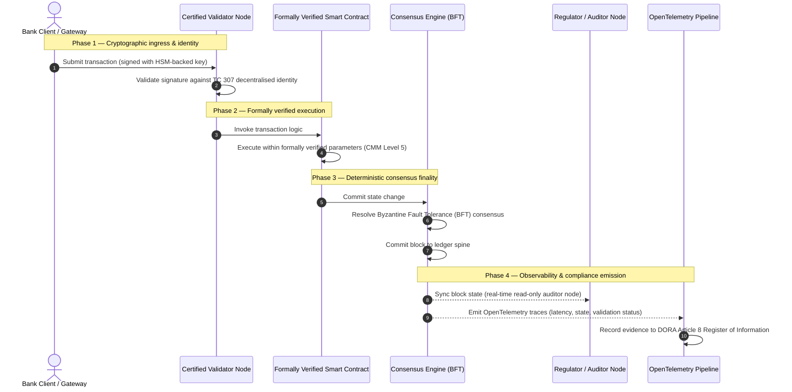

# Van bewijs naar waarheid: waarom gecertificeerde blockchains het volgende tijdperk van bancair vertrouwen zullen bepalen

## Strategische samenvatting (in het kort)

Het wholesalebankieren en het mondiale betalingsverkeer bevinden zich in 2026 op een historisch keerpunt. Nu financiële diensten overstappen op nativ digitale, realtime clearingnetwerken en kunstmatige intelligentie een probabilistisch niet-determinisme introduceert, voldoen de traditionele analoge, retrospectieve assurancemodellen (zoals statische, op entiteiten gebaseerde audits) niet langer aan de moderne eisen van risicobeheer en fiduciaire zorgplicht.

Het technische comité ISO/IEC TC 307 heeft een gestandaardiseerde basis voor distributed-ledgertechnologieën vastgelegd. Echte institutionele adoptie vereist echter de overgang van beschrijvende richtsnoeren naar voorschrijvende, onafhankelijk certificeerbare blockchainassurance. Door ledgergovernance, consensusintegriteit, veiligheid van smart contracts en cryptografische wendbaarheid te scoren aan de hand van een streng vijfniveaus tellend capability-maturitymodel (CMM), kunnen banken van versnipperde, leverancierspecifieke aannames overstappen naar een certificeerbare, door de raad controleerbare financiële waarheid.

## Kernpunten

* **De fiduciaire frictiekloof**: we kunnen vandaag de bank (Basel III), de cloud (ISO 27001) en de AI-governancesystemen (ISO 42001) certificeren, maar we kunnen nog niet de distributed ledger certificeren die steeds vaker bepaalt wat waar is. Deze asymmetrie is een grote operationele kwetsbaarheid.  
* **DORA legt directe fiduciaire verantwoordelijkheid op**: op grond van artikel 5 DORA dragen de raden van bestuur van banken directe, niet-delegeerbare persoonlijke aansprakelijkheid voor de operationele veerkracht van alle inzet van derden en ledgers, met zware persoonlijke sancties onder het SM&CR-regime bij tekortkomingen.  
* **De AI-auditruggengraat**: waar machine learning niet-reproduceerbare, probabilistische uitkomsten oplevert, biedt een gecertificeerde blockchain een deterministische toestandsvastlegging. Het on-chain vastleggen van modelversies, invoer en validatiebeslissingen voldoet aan ISO 42001 en de normen voor modelrisicobeheer.  
* **De Index van Gecertificeerde Blockchains**: deze index formaliseert governance, consensus, smart contracts en observeerbaarheid tot een verifieerbare, auditklare scorecard op een CMM-schaal van 0 tot 5, en vertaalt technische maatstaven naar door de raad goedgekeurde risicobereidheidsverklaringen.

## 01. De fiduciaire frictiekloof in het digitale bankieren

In het klassieke bankieren is vertrouwen relationeel, institutioneel en retrospectief. Het steunt op onafhankelijke externe auditors die de financiële toestand op vaste momenten toetsen en verschillen tussen bilaterale ledgersilo's afstemmen. In de realtime, API-gestuurde markten van 2026 introduceert dit model prohibitieve latenties en structurele risico's.

Wanneer transacties onmiddellijk worden afgewikkeld, intraday-liquiditeitspools dynamisch door API-gateways worden beheerd en het eigendom van activa over gedeelde ledgers wordt getokeniseerd, worden retrospectieve audits forensische oefeningen in plaats van preventieve controles. Fiduciairs kunnen niet langer volstaan met het certificeren van de juridische entiteit. Zij moeten het digitale substraat zelf certificeren.

Momenteel opereren banken onder een flagrante architecturale asymmetrie:

1. **Gecertificeerde cloudinfrastructuur**: hardwareknooppunten, gevirtualiseerde containers en fysieke datacenters worden gevalideerd tegen ISO/IEC 27001 en SOC 2 Type II.  
2. **Gecertificeerde beheerprocessen**: operationeelrisicobeleid, bedrijfscontinuïteitsplannen en algoritmische implementaties worden beheerst onder strenge risicokaders.  
3. **Niet-gecertificeerde ledgermotoren**: de gedistribueerde consensusmechanismen, de toeleveringsketens van validatorknooppunten, de grenzen van smart contracts en de netwerkgovernancemodellen worden overgelaten aan niet-gecertificeerde, op maat gemaakte of consortiumspecifieke aannames.

Deze asymmetrie is een cruciaal faalpunt. Een bank kan een gevalideerde applicatie draaien in een veilige, ISO 27001-gecertificeerde cloudcontainer, maar als die container schrijft naar een distributed ledger met gecentraliseerde validatorcontrole, kwetsbare consensusparameters of niet-geauditeerde smart contracts, is de transactie-integriteit gecompromitteerd. Om deze kloof te overbruggen, moet de ledgermotor zelf een certificeerbaar assuranceobject worden.

## 02. De standaardisatiebasis ISO/IEC TC 307

Het fundamentele werk voor de standaardisatie van distributed ledgers wordt verricht door het technische comité ISO/IEC TC 307 (Blockchain en distributed-ledgertechnologieën). In plaats van blockchain als een geïsoleerd technisch protocol te behandelen, benadert TC 307 het als een institutionele vertrouwensinfrastructuur en organiseert het zijn werk rond vijf kernpijlers:

1. **Taxonomie en terminologie (ISO 22739)**: legt een gemeenschappelijke nomenclatuur vast en waarborgt consistente juridische en operationele definities over jurisdicties, financiële regelingen en instellingen heen.  
2. **Referentiearchitectuur (ISO/TR 23245)**: definieert de grenzen, lagen, gegevensstromen en functionele componenten van een conform distributed-ledgersysteem.  
3. **Beveiliging, privacy en smart contracts (ISO/TR 23244 / ISO 23613)**: legt basisrichtsnoeren voor de beveiliging van digitale-activasystemen vast en beschrijft best practices voor het mitigeren van kwetsbaarheden in smart contracts en de governance van hun levenscyclus.  
4. **Interoperabiliteitskaders**: behandelt de mechanismen voor gegevens- en activaverkeer tussen heterogene ledgernetwerken en voorkomt de vorming van geïsoleerde getokeniseerde silo's.  
5. **Gedecentraliseerde identiteit en vertrouwensankers**: integreert op ledgers gebaseerde cryptografische identificatoren met formele publiekesleutelinfrastructuren (PKI) en door de staat geautoriseerde registers.

Gezamenlijk markeert TC 307 de overgang van DLT van een op maat gemaakte engineeringkeuze naar een gestandaardiseerde architecturale discipline. Toch blijft TC 307 overwegend beschrijvend. Het definieert hoe uitmuntendheid eruitziet (richtsnoer), maar levert niet het voorschrijvende verificatieprotocol (assurance) dat risicofunctionarissen en toezichthouders nodig hebben om productie-inzet van kritieke of belangrijke functies (CIF's) te autoriseren.

## 03. Richtsnoer versus assurance: het fiduciaire onderscheid

Deelnemers aan de financiële markten zetten technologie niet in omdat die innovatief of elegant is; zij zetten die in wanneer die kan worden bestuurd, geauditeerd, verdedigd en afgestemd op de kapitaalvereisten. Daarom valt standaardisatie in het bankwezen van nature uiteen in twee lagen:

* **Richtsnoer (het kader)**: schetst best practices, referentiedoelen en architecturale richtlijnen (bv. ISO/IEC TC 307, NIST-kaders).  
* **Assurance (het bewijs)**: levert onafhankelijk, continu en door derden verifieerbaar bewijs dat het kader is geïmplementeerd en werkt zoals bedoeld (bv. ISO 27001-certificering, SOC 2-audits, toezichtsonderzoeken).

Vertrouwen op niet-gecertificeerde ledgerconsensus terwijl de cloudinfrastructuur wordt gecertificeerd, is een cruciale regulatoire leemte. Een "onveranderlijke" blockchain is niet noodzakelijk "institutioneel vertrouwd". Onveranderlijkheid garandeert alleen dat de ingevoerde gegevens ongewijzigd blijven; het verifieert niet of de validatorknooppunten veilig zijn, of het consensusprotocol bestand is tegen collusie, of de logica van de smart contracts wiskundig deugdelijk is, of het cryptografische sleutelbeheer voldoet aan de postkwantummandaten.

Om deze kloof te dichten, formaliseert de Index van Gecertificeerde Blockchains 2026 deze vereisten in een kwantificeerbaar capability-maturitymodel (CMM), afgestemd op de mondiale bankregelgeving.

## 04. De Index van Gecertificeerde Blockchains 2026

Om het senior management in staat te stellen zijn ledgerplatforms te beoordelen en te certificeren, structureert deze index de distributed-ledgerinfrastructuur in vijf auditbare operationele lagen, gescoord op een CMM-schaal van 0 tot 5.

## Tabel 1: de architectuur van de Index van Gecertificeerde Blockchains

| Indexlaag | Maturiteitsniveau (CMM) | Technische en operationele maatstaf | Regulatoire / fiduciaire controlereferentie |
| ---- | ---- | ---- | ---- |
| **Ledgergovernance** | **Niveau 0**: ad-hocconsortium**Niveau 3**: geautomatiseerde validatorscreening & -rotatie**Niveau 5**: gedecentraliseerde, meerpartijen cryptografische identiteitsverankering | % validatorknooppunten beheerd door gescreende financiële entiteiten; gemiddelde oplostijd van validatorgeschillen; geografische spreiding van knooppunten | **DORA artikel 5** (Governance en organisatie); **CPMI-IOSCO PFMI Beginsel 2** (Governance) & **Beginsel 3** (Kader voor het integrale beheer van risico's) |
| **Consensusintegriteit** | **Niveau 0**: enkel knooppunt of ondoorzichtige PoW**Niveau 3**: geauditeerde BFT met deterministische finaliteit**Niveau 5**: multijurisdictionele, formeel geverifieerde consensus met continue latentiebewaking | maximaal toelaatbare consensuslatentie; drempel voor collusiebestendigheid; beschikbaarheids-SLA bij gesimuleerde knooppuntpartitie | **DORA artikel 6** (Kader voor ICT-risicobeheer); **CPMI-IOSCO PFMI Beginsel 8** (Afwikkelingsfinaliteit) |
| **Identiteit & cryptografie** | **Niveau 0**: zwakke RSA-/ECDSA-sleutels**Niveau 3**: multi-sig met HSM-ondersteund sleutelbeheer**Niveau 5**: kwantumveilige hybride sleutels (FIPS 203 ML-KEM) en zero-knowledge privacypoorten | % ledgertransacties ondertekend met HSM-ondersteunde sleutels; gereedheidsscore voor PQC-migratie; latentie van ZK-bewijzen | **NIST FIPS 203 / 204**; **ISO/IEC 27001** (Informatiebeveiligingsbeheer) |
| **Smart-contractassurance** | **Niveau 0**: niet-geauditeerde Solidity-scripts**Niveau 3**: geautomatiseerde compilervalidatie & externe audit**Niveau 5**: formeel geverifieerde, onveranderlijke smart contracts met circuit-breaker-upgrades | % smart contracts met wiskundige formele verificatie; aantal compilerwaarschuwingen; dekking van kwetsbaarheidsscans | **EBA-richtsnoeren voor uitbesteding** (paragrafen 81, 113-117); **DORA artikel 30** (Minimale contractuele bepalingen) |
| **Audit & observeerbaarheid** | **Niveau 0**: handmatig log-scrapen**Niveau 3**: gestructureerde OTel-traces & alleen-lezen auditorknooppunten**Niveau 5**: geautomatiseerde, continue afstemming met het register van artikel 8 | % transacties gedekt door OpenTelemetry-traces; latentie van blok-commit tot auditorknooppuntsynchronisatie | **BCBS 239** (Risicogegevensaggregatie); **DORA artikel 8** (Informatieregister / ITS-schema's) |

## Tabel 2: belangrijke vertrouwenssignalen afgestemd op mondiale bankstandaarden

| Signaal / benchmark | Maatstaf | Impact op bankplatforms | Regulatoire bron |
| ---- | ---- | ---- | ---- |
| **Voortgang ISO/IEC TC 307** | Overgang van ISO/TR technische rapporten naar formele certificeringsschema's | Vestigt het eerste gestandaardiseerde kader voor het certificeren van distributed-ledgermotoren | **ISO/IEC JTC 1 / SC 44** (Distributed-ledgertechnologieën) |
| **Prototypefase van Project Agorá** | Meer dan 40 deelnemende commerciële banken; test van een geïntegreerde ledger voor getokeniseerde deposito's | Verschuift grensoverschrijdende clearing van messaging (SWIFT) naar atomaire getokeniseerde afwikkeling | **Innovation Hub van de Bank voor Internationale Betalingen (BIB)** |
| **DORA artikel 30 externe audit** | 100 % van de knooppuntaanbieders en infrastructuurhosts geauditeerd aan de hand van beveiligingscriteria | Elimineert "schaduw-validatorknooppunten"; verplicht volledige transparantie van de toeleveringsketen | **Europese toezichthoudende autoriteiten (ETA's)** |
| **ISO/IEC 42001 (AI-governance)** | AI-model- en trainingslogs cryptografisch onveranderlijk gemaakt on-chain | Zet blockchain in als het onveranderlijke bewijsregister ("auditruggengraat") voor machine learning | **ISO/IEC 42001:2023** (Informatietechnologie — Kunstmatige intelligentie) |
| **Basel III kapitaaltoereikendheid** | Vermindering van operationeelrisicokapitaalbuffers op basis van gedocumenteerde complexiteitsreductie | Gestandaardiseerde operationeelrisicokaders crediteren de geverifieerde ledgerveerkracht rechtstreeks | **Bazels Comité voor Bankentoezicht (BCBS)** |

## 05. De "auditruggengraat" van AI: probabilistische intelligentie op deterministische infrastructuur

Een van de krachtigste strategische rollen van een gecertificeerde blockchain in 2026 is die van **"auditruggengraat"** voor implementaties van kunstmatige intelligentie. Moderne financiële systemen worden steeds probabilistischer. Kredietscoring, realtime fraudedetectie, algoritmische handel en autonome klantinteracties worden aangedreven door machine-learningmodellen die in de loop van de tijd evolueren, driften en zich aanpassen. Deze modellen zijn niet-deterministisch: bij dezelfde invoer op twee verschillende momenten kunnen ze door dynamische gewichten en continue training verschillende uitkomsten opleveren.

Dit niet-determinisme brengt onder **ISO/IEC 42001 (AI-governance)** en de normen voor modelrisicobeheer (MRM) (zoals **SR 11-7 van de Amerikaanse Federal Reserve** en **SS1/23 van de Britse PRA**) een diepgaande governance-uitdaging met zich mee: *hoe audit, verklaar en verdedig je beslissingen die niet strikt reproduceerbaar zijn?*

Een gecertificeerde distributed ledger biedt het deterministische tegenwicht. Waar AI-modellen probabilistisch werken, legt de gecertificeerde blockchain hun parameters deterministisch vast en vestigt zo een onveranderlijke bewijsruggengraat:

* **Modelversiebeheer en gewichtsverankering**: elke ingezette modelversie, de bijbehorende gewichten en de checksums van de trainingsgegevens worden bij de build gehasht en naar de ledger geschreven, waarmee wordt voldaan aan de toeleveringsketenvereisten **SLSA Level 3**.  
* **Contextuele invoerregistratie**: wanneer een AI-model een kritieke beslissing uitvoert (bv. een lening goedkeuren of een transactie markeren), worden de exacte contextuele invoer en de modelhashes naar de ledger geschreven, waardoor een manipulatiebestendige geschiedenis ontstaat.  
* **Auditbaarheid zonder codetoegang**: als een toezichthouder vraagt "waarom heeft uw model deze kredietaanvraag op 3 juni afgewezen?", hoeft de bank haar propriëtaire code niet vrij te geven of de exacte modeltoestand te reconstrueren. Ze legt het cryptografisch ondertekende on-chain-record van de invoer, de gewichten en de validatietoestand over.

Door de probabilistische beslissingen van machine-learningmodellen te verankeren aan de deterministische consensus van een gecertificeerde blockchain, creëert de instelling een verdedigbare, reconstrueerbare en onafhankelijk verifieerbare tijdlijn van geautomatiseerde handelingen.

## 06. De gecertificeerde consensus-naar-auditpijplijn visualiseren

Het onderstaande sequentiediagram illustreert de levenscyclus van een transactie die een gecertificeerd blockchainplatform doorloopt, en toont hoe validatiepoorten, consensusintegriteit, smart-contractuitvoering en telemetrie-emissie in elkaar grijpen om bestuursklaar regulatoir bewijs te produceren:

Het kritieke pad van deze transactiesequentie vereist dat elke validatie-, uitvoerings- en consensusstap cryptografisch is ondertekend, wat een end-to-end herkomst waarborgt. Het auditorknooppunt van de toezichthouder synchroniseert de bloktoestand in realtime, waardoor retrospectieve, handmatige financiële afstemming overbodig wordt.

## 07. Het bestuurshandboek voor senior managers

Om de overgang van organisatorisch naar infrastructureel vertrouwen succesvol te maken, zouden bankbestuurders en senior managers onmiddellijk vier kerndirectieven moeten uitvoeren:

1. **Verplicht ledgeraudits in enterprise risk management (ERM)**: handhaaf een beleid dat geen enkel distributed-ledgerplatform — privaat, publiek of consortium — mag worden ingezet voor kritieke of belangrijke functies (CIF's) zonder te zijn geauditeerd tegen de vijflagige **architectuur van de Index van Gecertificeerde Blockchains** (minimaal CMM-niveau 3).  
2. **Integreer blockchains als de ISO 42001 AI-bewijsruggengraat**: geef de Chief Risk Officer en de leidende AI-architect opdracht alle hoog-impactmachine-learningmodellen te integreren met een gecertificeerde blockchain, waarmee een manipulatiebestendig auditregister van modelversies, gewichten, invoer en beslissingen ontstaat.  
3. **Audit de toeleveringsketen van validatorknooppunten (DORA artikel 30)**: verplicht de inkoopafdeling alle externe entiteiten te auditeren die validatorknooppunten hosten of de cloudhosting voor DLT-netwerken beheren, met dezelfde cyberbeveiligings- en operationeleveerkrachtnormen als voor de interne cloudknooppunten van de bank.  
4. **Stem ledgerarchitecturen af op CPMI-IOSCO en BCBS 239**: geef het platform-engineeringteam opdracht de ledger-uitvoertelemetrie rechtstreeks af te stemmen op de gegevensrapportagevereisten van **BCBS 239** en te waarborgen dat de consensus- en afwikkelingsfinaliteitsparameters strikt voldoen aan de **CPMI-IOSCO-beginselen 8 en 9**.

## 08. Veelgestelde vragen

**Is ISO/IEC TC 307 een certificeringsnorm?**  
Nee. ISO/IEC TC 307 is een technisch comité dat terminologie, referentiearchitecturen en beveiligingsrichtsnoeren vaststelt. Hoewel het definieert "hoe uitmuntendheid eruitziet" (richtsnoer), moet de sector deze documenten operationaliseren tot formele, auditbare certificeringsschema's (assurance) om de bancaire toezichthouders tevreden te stellen.

**Hoe ondersteunt een gecertificeerde blockchain de naleving van DORA?**  
Op grond van artikel 5 DORA dragen bankbesturen directe persoonlijke aansprakelijkheid voor technologische veerkracht. Een gecertificeerde blockchain levert verifieerbaar cryptografisch bewijs van consensusintegriteit, controle over de validatortoeleveringsketen en veiligheid van smart contracts, en geeft bestuursleden de documenteerbare "redelijke stappen" die nodig zijn om zich te verdedigen tegen persoonlijke aansprakelijkheidsclaims onder het SM&CR.

Wat is het verschil tussen een traditionele ledgeraudit en een gecertificeerde blockchainaudit?  
Een traditionele audit is retrospectief: hij verifieert handmatige boekingen en statische bestanden nadat transacties zijn afgewikkeld. Een gecertificeerde blockchainaudit is continu en realtime; de validatorknooppunten, de BFT-consensusmotor en de formeel geverifieerde smart contracts zijn gecertificeerd om transacties deterministisch uit te voeren en gestructureerde telemetrie (OpenTelemetry) uit te zenden die de gezondheid van het systeem voortdurend valideert.

Kunnen publieke blockchains worden gecertificeerd voor bancair gebruik?  
In de meeste jurisdicties voldoen zuiver permissionless publieke blockchains niet aan de bankregelgeving door het ontbreken van validatoridentiteitsverificatie, onvoorspelbare transactiekosten en niet-deterministische finaliteit (bv. probabilistische proof-of-work-/stakeforks). Gecertificeerde blockchains in het bankwezen gebruiken doorgaans permissioned enterprise-architecturen of sterk gereguleerde publiek-hybride architecturen, waarin de exploitanten van validatorknooppunten geïdentificeerde en geauditeerde financiële entiteiten zijn.

## 09. Referenties

* Bazels Comité voor Bankentoezicht (BCBS), 2013. *Principles for effective risk data aggregation and reporting (BCBS 239)*. Bazel: Bank voor Internationale Betalingen. Beschikbaar op: [https://www.bis.org/publ/bcbs239.pdf](https://www.bis.org/publ/bcbs239.pdf).  
* Committee on Payments and Market Infrastructures en Technical Committee of the International Organization of Securities Commissions (CPMI-IOSCO), 2012. *Principles for financial market infrastructures*. Bazel: Bank voor Internationale Betalingen. Beschikbaar op: [https://www.bis.org/cpmi/publ/d101a.pdf](https://www.bis.org/cpmi/publ/d101a.pdf).  
* Europese Bankautoriteit (EBA), 2019. *EBA/GL/2019/02 — Guidelines on outsourcing arrangements*. Parijs: EBA. Beschikbaar op: [https://www.eba.europa.eu/regulation-and-policy/internal-governance/guidelines-on-outsourcing-arrangements](https://www.eba.europa.eu/regulation-and-policy/internal-governance/guidelines-on-outsourcing-arrangements).  
* Europees Parlement en Raad van de Europese Unie, 2022. *Verordening (EU) 2022/2554 betreffende digitale operationele weerbaarheid voor de financiële sector (DORA)*. Brussel: Publicatieblad van de Europese Unie. Beschikbaar op: [https://eur-lex.europa.eu/legal-content/NL/TXT/?uri=CELEX%3A32022R2554](https://eur-lex.europa.eu/legal-content/NL/TXT/?uri=CELEX%3A32022R2554).  
* ISO/IEC JTC 1/SC 42, 2023. *ISO/IEC 42001:2023 — Information technology — Artificial intelligence — Management system*. Genève: Internationale Organisatie voor Standaardisatie. Beschikbaar op: [https://www.iso.org/standard/81230.html](https://www.iso.org/standard/81230.html).  
* Technisch comité ISO/IEC 307, 2020. *ISO/IEC 22739:2020 — Blockchain and distributed ledger technologies — Vocabulary*. Genève: Internationale Organisatie voor Standaardisatie. Beschikbaar op: [https://www.iso.org/standard/73771.html](https://www.iso.org/standard/73771.html).  
* National Institute of Standards and Technology (NIST), 2026. *First Three Finalized Post-Quantum Encryption Standards (FIPS 203, 204, and 205)*. Gaithersburg: U.S. Department of Commerce. Beschikbaar op: [https://www.nist.gov/news-events/news/2024/08/nist-releases-first-3-finalized-post-quantum-encryption-standards](https://www.nist.gov/news-events/news/2024/08/nist-releases-first-3-finalized-post-quantum-encryption-standards).
