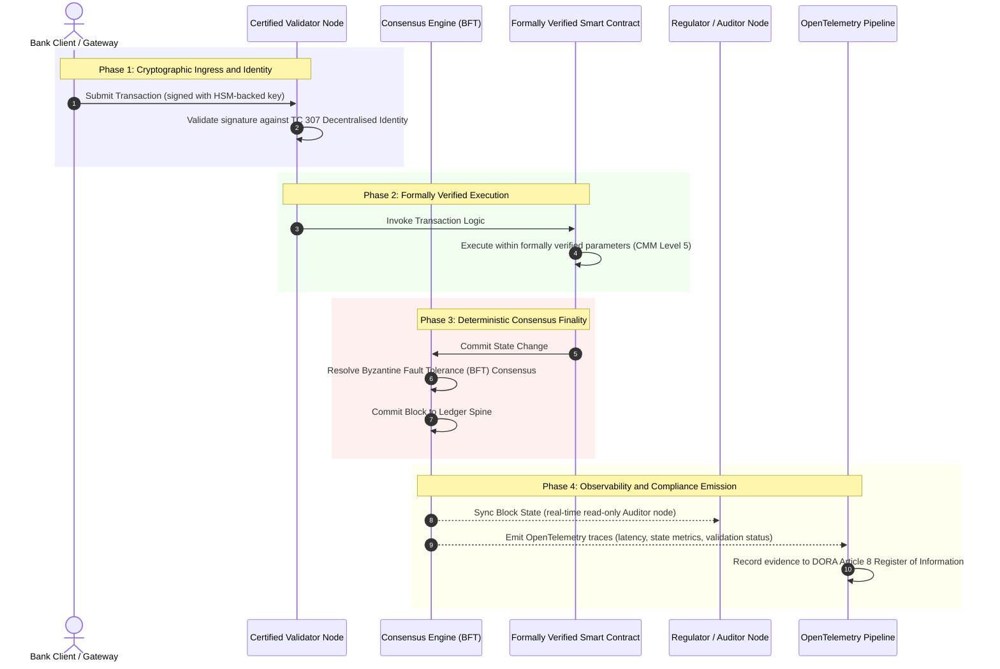

# Van bewijs naar waarheid: waarom gecertificeerde blockchains het volgende tijdperk van bankvertrouwen bepalen

**Onveranderlijk is niet hetzelfde als vertrouwd.** Nu het wholesale bankwezen overgaat op realtime afwikkeling en probabilistische AI, is het grootboek dat bepaalt wat waar is de enige laag die banken nog steeds niet kunnen certificeren. Zij certificeren de entiteit onder Basel III, de cloud onder ISO 27001 en hun AI onder ISO 42001, maar het gedistribueerde grootboek, met zijn governance, consensus, cryptografie en smart contracts, blijft overgeleverd aan leverancierspecifieke aannames. Dit rapport betoogt dat het dichten van die fiduciaire kloof vereist dat we van de richtlijnen van ISO/IEC TC 307 overstappen naar voorschrijvende assurance: het grootboek scoren tegen een Certified Blockchain Index met 5 niveaus, die engineeringmetrics omzet in waarheid die door het bestuur te auditeren en DORA-verdedigbaar is.

<!-- lead-start -->
<aside class="post-lead" aria-label="Samenvatting van het artikel">

<strong>Samengevat.</strong> Banken certificeren de entiteit, de cloud en hun AI, maar niet het grootboek dat in toenemende mate bepaalt wat waar is. ISO/IEC TC 307 biedt richtlijnen, geen assurance. Een Certified Blockchain Index met 5 niveaus scoort grootboekgovernance, consensusintegriteit, identiteit en cryptografie, smart contract-assurance en observability tegen een Capability Maturity Model, waarmee de fiduciaire kloof wordt gedicht en probabilistische AI een deterministische auditruggengraat krijgt.

<strong>Belangrijkste conclusies</strong>

<ul class="post-lead-takeaways">
  <li><strong>De fiduciaire frictiekloof.</strong> De bank (Basel III), de cloud (ISO 27001) en het AI-governancesysteem (ISO 42001) kunnen worden gecertificeerd; het gedistribueerde grootboek dat bepaalt wat waar is, nog niet. Die asymmetrie is een actuele operationele kwetsbaarheid.</li>
  <li><strong>DORA maakt het persoonlijk.</strong> Onder DORA Article 5 dragen bankbesturen directe, niet-delegeerbare aansprakelijkheid voor de weerbaarheid van uitrol bij derden en op grootboeken, met persoonlijke sancties onder SM&amp;CR bij falen.</li>
  <li><strong>De AI-auditruggengraat.</strong> Machinaal leren is niet-reproduceerbaar; een gecertificeerde blockchain legt modelversies, invoer en validatiebeslissingen deterministisch on-chain vast, wat voldoet aan ISO 42001 en standaarden voor modelrisicomanagement.</li>
  <li><strong>De Certified Blockchain Index.</strong> Governance, consensus, cryptografie, smart contracts en observability worden een 0-tot-5 CMM-scorekaart die engineeringmetrics vertaalt naar door het bestuur goedgekeurde Risk Appetite Statements.</li>
</ul>

<strong>Verwante literatuur:</strong> <a href="https://sebastienrousseau.com/2026-07-02-certified-blockchains-banking-trust-tc307-assurance-2026">Gecertificeerde blockchains en bankvertrouwen: TC 307-assurance</a>, <a href="https://sebastienrousseau.com/2026-07-24-global-payments-outlook-operating-model-risk-revenue">De Global Payments Outlook 2026</a>.

</aside>
<!-- lead-end -->

> **Managementsamenvatting**
>
> - **Het wholesale bankwezen staat op een kantelpunt.** Realtime clearing en probabilistische AI breken het analoge, retrospectieve assurancemodel: statische, entiteitsgebaseerde audits voldoen niet langer aan moderne risicomanagement- of fiduciaire eisen.
> - **TC 307 is een basislijn, geen certificaat.** ISO/IEC TC 307 heeft het vocabulaire, de referentiearchitectuur en de beveiligingsrichtlijnen voor gedistribueerde grootboeken gestandaardiseerd, maar het is beschrijvend. Het definieert hoe goed eruitziet; het levert niet de voorschrijvende verificatie die risk officers en toezichthouders nodig hebben om uitrol in productie te autoriseren.
> - **Assurance betekent het grootboek scoren.** Governance, consensusintegriteit, veiligheid van smart contracts en cryptografische wendbaarheid, gescoord tegen een strikt Capability Maturity Model met 5 niveaus, brengen banken van lappendeken en leverancierspecifieke aannames naar certificeerbare, door het bestuur te auditeren financiële waarheid.
> - **Het grootboek is de auditruggengraat voor AI.** Het verankeren van modelversies, invoer en validatiebeslissingen aan deterministische consensus geeft niet-reproduceerbaar machinaal leren een verdedigbaar, reconstrueerbaar bewijsverslag onder ISO 42001, SR 11-7 en PRA SS1/23.

## De fiduciaire frictiekloof in het digitale bankwezen

In het klassieke bankwezen is vertrouwen relationeel, institutioneel en retrospectief. Het steunt op onafhankelijke externe auditors die de financiële toestand op statische momenten beoordelen en discrepanties tussen bilaterale grootboeksilo's afstemmen. In de realtime, API-gestuurde markten van 2026 introduceert dit model prohibitieve vertragingen en structurele risico's.

Wanneer transacties direct worden afgewikkeld, intraday-liquiditeitspools dynamisch worden beheerd door API-gateways en eigendom van activa wordt getokeniseerd over gedeelde grootboeken, worden retrospectieve audits forensische oefeningen in plaats van preventieve beheersmaatregelen. Fiduciairen kunnen niet langer uitsluitend vertrouwen op het certificeren van de rechtspersoon. Zij moeten het digitale substraat zelf certificeren.

Momenteel opereren banken onder een flagrante architecturale asymmetrie:

1. **Gecertificeerde cloudinfrastructuur**: Hardwareknooppunten, gevirtualiseerde containers en fysieke datacenters worden gevalideerd tegen ISO/IEC 27001- en SOC 2 Type II-controls.  
2. **Gecertificeerde beheerprocessen**: Beleid voor operationeel risico, bedrijfscontinuïteitsplannen en uitrol van algoritmen worden bestuurd onder strikte risicokaders.  
3. **Ongecertificeerde grootboekengines**: De kernmechanismen voor gedistribueerde consensus, de toeleveringsketens van validatorknooppunten, de grenzen van smart contracts en de governancemodellen van het netwerk blijven overgeleverd aan ongecertificeerde, op maat gemaakte of consortiumspecifieke aannames.

Deze asymmetrie is een groot faalpunt. Een bank kan een gevalideerde applicatie draaien binnen een beveiligde, ISO 27001-gecertificeerde cloudcontainer, maar als die container schrijft naar een gedistribueerd grootboek met gecentraliseerde validatorcontrole, kwetsbare consensusparameters of niet-geauditeerde smart contracts, dan is de integriteit van de transactie gecompromitteerd. Om deze kloof te overbruggen moet de grootboekengine zelf een certificeerbaar assuranceobject worden.

## De ISO/IEC TC 307-standaardisatiebasislijn

Het fundamentele werk dat nodig is om gedistribueerde grootboeken te standaardiseren wordt vastgelegd door ISO/IEC Technical Committee 307 (TC 307\) (Blockchain and distributed ledger technologies). In plaats van blockchain te behandelen als een geïsoleerd technisch protocol, benadert TC 307 het als een institutionele vertrouwensinfrastructuur en organiseert het zijn werk rond vijf kernpijlers:

1. **Taxonomie en vocabulaire (ISO 22739\)**: Legt een gemeenschappelijke nomenclatuur vast, waarmee consistente juridische en operationele definities worden gewaarborgd over verschillende jurisdicties, financiële regelingen en instellingen heen.  
2. **Referentiearchitectuur (ISO/TR 23245\)**: Definieert de grenzen, lagen, gegevensstromen en functionele componenten van een conform gedistribueerd grootboeksysteem.  
3. **Beveiliging, privacy en smart contracts (ISO/TR 23244 / ISO 23613\)**: Stelt basisrichtlijnen voor beveiliging van systemen voor digitale activa vast en beschrijft best practices voor het beperken van kwetsbaarheden in smart contracts en levenscyclusgovernance.  
4. **Interoperabiliteitskaders**: Behandelt de mechanismen voor gegevens- en activa-uitwisseling tussen heterogene grootboeknetwerken en voorkomt de vorming van geïsoleerde getokeniseerde silo's.  
5. **Gedecentraliseerde identiteit en trust anchors**: Integreert grootboekgebaseerde cryptografische identifiers met formele public-key-infrastructuren (PKI) en door de staat geautoriseerde registers.

Samen markeert TC 307 de overgang van DLT van een op maat gemaakte engineeringkeuze naar een gestandaardiseerde architecturale discipline. TC 307 blijft echter primair beschrijvend. Het definieert hoe goed eruitziet (richtlijnen), maar levert niet het voorschrijvende verificatieprotocol (assurance) dat risk officers en toezichthouders nodig hebben om uitrol in productie van kritieke of belangrijke functies (CIFs) te autoriseren.

## Richtlijnen versus assurance: het fiduciaire onderscheid

Deelnemers aan de financiële markt zetten technologie niet in omdat die innovatief of elegant is; zij zetten die in wanneer die bestuurd, geauditeerd, verdedigd en verzoend kan worden met kapitaalreservevereisten. Daarom valt standaardisatie in het bankwezen van nature uiteen in twee lagen:

* **Richtlijnen (het kader)**: Schetsen best practices, referentiedoelen en architecturale richtlijnen (bijv. ISO/IEC TC 307, NIST-kaders).  
* **Assurance (het bewijs)**: Levert onafhankelijk, continu en door derden verifieerbaar bewijs dat het kader is geïmplementeerd en werkt zoals ontworpen (bijv. ISO 27001-certificering, SOC 2-audits, toezichtsonderzoeken).

Vertrouwen op ongecertificeerde grootboekconsensus terwijl cloudinfrastructuur wordt gecertificeerd, is een kritieke lacune in de regelgeving. Een blockchain die "onveranderlijk" is, is niet noodzakelijk "institutioneel vertrouwd." Onveranderlijkheid garandeert alleen dat de ingevoerde gegevens ongewijzigd blijven; het verifieert niet dat de validatorknooppunten beveiligd zijn, dat het consensusprotocol bestand is tegen collusie, dat de logica van het smart contract wiskundig correct is, of dat het cryptografische sleutelbeheer voldoet aan post-quantummandaten.

Om deze kloof te dichten formaliseert de Certified Blockchain Index van 2026 deze vereisten in een kwantificeerbaar Capability Maturity Model (CMM) dat is gekoppeld aan mondiale bankregelgeving.

## De Certified Blockchain Index van 2026

Om het senior management in staat te stellen hun grootboekplatforms te evalueren en te certificeren, structureert deze index de gedistribueerde grootboekinfrastructuur in vijf auditeerbare operationele lagen, gescoord op een 0-tot-5 CMM-schaal.

### Tabel 1: De architectuur van de Certified Blockchain Index

| Indexlaag | Capability Maturity Level (CMM) | Technische en operationele metric | Referentie regelgevings-/fiduciaire beheersmaatregel |
| ---- | ---- | ---- | ---- |
| **Grootboekgovernance** | **Level 0**: Ad-hocconsortium**Level 3**: Geautomatiseerde vetting & rotatie van validators**Level 5**: Gedecentraliseerde, cryptografische identiteitsverankering met meerdere partijen | % validatorknooppunten beheerd door gescreende financiële entiteiten; gemiddelde tijd om validatorgeschillen op te lossen; geografische spreiding van knooppunten | **DORA Article 5** (Governance en organisatie); **CPMI-IOSCO PFMI Principle 2** (Governance) & **Principle 3** (Kader voor het integrale beheer van risico's) |
| **Consensusintegriteit** | **Level 0**: Enkel knooppunt of ondoorzichtig POW**Level 3**: Geauditeerde BFT met deterministische definitiviteit**Level 5**: Multi-jurisdictionele, formeel geverifieerde consensus met continue latentiemonitoring | Maximaal toelaatbare consensuslatentie; drempel voor collusiebestendigheid; uptime-SLA bij gesimuleerde knooppuntpartitie | **DORA Article 6** (Kader voor ICT-risicobeheer); **CPMI-IOSCO PFMI Principle 8** (Afwikkelingsdefinitiviteit) |
| **Identiteit & cryptografie** | **Level 0**: Zwakke RSA-/ECDSA-sleutels**Level 3**: Multi-sig met HSM-ondersteund sleutelbeheer**Level 5**: Quantumveilige hybride sleutels (FIPS 203 ML-KEM) en zero-knowledge-privacypoorten | % grootboektransacties ondertekend met HSM-ondersteunde sleutels; gereedheidsscore voor PQC-migratie; latentie van ZK-proofs | **NIST FIPS 203 / 204**; **ISO/IEC 27001** (Informatiebeveiligingsbeheer) |
| **Smart contract-assurance** | **Level 0**: Niet-geauditeerde solidity-scripts**Level 3**: Geautomatiseerde compilervalidatie & externe audit**Level 5**: Formeel geverifieerde, onveranderlijke smart contracts met circuit-breaker-upgrades | % smart contracts met wiskundige formele verificatie; aantal compilerwaarschuwingen; dekking van kwetsbaarheidsscans | **EBA Guidelines on Outsourcing Arrangements** (Paragrafen 81, 113-117); **DORA Article 30** (Minimale contractuele clausules) |
| **Audit & observability** | **Level 0**: Handmatig logs uitlezen**Level 3**: Gestructureerde OTel-traces & alleen-lezen auditorknooppunten**Level 5**: Geautomatiseerde, continue afstemming met het Article 8-register | % transacties gedekt door OpenTelemetry-traces; latentie van grootboekblok-commit tot synchronisatie van auditorknooppunt | **BCBS 239** (Risicogegevensaggregatie); **DORA Article 8** (Informatieregister / ITS-schema's) |

### Tabel 2: Belangrijke vertrouwenssignalen gekoppeld aan mondiale bankstandaarden

| Signaal / benchmark | Metric | Impact op bankplatforms | Regelgevingsbron |
| ---- | ---- | ---- | ---- |
| **Voortgang ISO/IEC TC 307** | Overgang van technische ISO/TR-rapporten naar formele certificeringsschema's | Legt het eerste gestandaardiseerde kader vast voor het certificeren van gedistribueerde grootboekengines | **ISO/IEC JTC 1 / SC 44** (Distributed Ledger Technologies) |
| **Prototypefase Project Agorá** | 40+ deelnemende commerciële banken; getest op een verenigd grootboek voor getokeniseerde deposito's | Verschuift grensoverschrijdende clearing van berichtenverkeer (SWIFT) naar atomaire getokeniseerde afwikkeling | **Bank for International Settlements (BIS) Innovation Hub** |
| **DORA Article 30-audit van derden** | 100% van de knooppuntaanbieders en infrastructuurhosts geauditeerd tegen beveiligingscriteria | Elimineert "schaduwvalidatorknooppunten"; verplicht volledige transparantie van de toeleveringsketen | **European Supervisory Authorities (ESA)** |
| **ISO/IEC 42001 (AI-governance)** | Cryptografisch onveranderlijk gemaakte AI-model- en trainingslogs on-chain | Zet blockchain in als het onveranderlijke bewijsgrootboek ("auditruggengraat") voor machinaal leren | **ISO/IEC 42001:2023** (Informatietechnologie, kunstmatige intelligentie) |
| **Kapitaaltoereikendheid Basel III** | Vermindering van kapitaalbuffers voor operationeel risico op basis van gedocumenteerde complexiteitsreductie | Gestandaardiseerde kaders voor operationeel risico crediteren geverifieerde grootboekweerbaarheid rechtstreeks | **Basel Committee on Banking Supervision (BCBS)** |

## De AI-"auditruggengraat": probabilistische intelligentie op deterministische infrastructuur

Een van de krachtigste strategische rollen voor een gecertificeerde blockchain in 2026 is die van **"auditruggengraat"** voor de inzet van kunstmatige intelligentie. Moderne financiële systemen worden steeds probabilistischer. Kredietscoring, realtime fraudedetectie, algoritmische handel en autonome klantinteracties worden aangedreven door modellen voor machinaal leren die in de loop van de tijd evolueren, driften en zich aanpassen. Deze modellen zijn niet-deterministisch: bij dezelfde invoer op twee verschillende momenten kunnen zij verschillende uitkomsten opleveren door dynamische gewichten en continue training.

Deze niet-determinisme introduceert een diepgaande governanceuitdaging onder **ISO/IEC 42001 (AI-governance)** en standaarden voor **modelrisicomanagement (MRM)** (zoals **US Federal Reserve SR 11-7** en **UK PRA SS1/23**): *Hoe audit, verklaar en verdedig je beslissingen die niet strikt reproduceerbaar zijn?*

Een gecertificeerd gedistribueerd grootboek levert het deterministische tegenwicht. Terwijl AI-modellen probabilistisch opereren, legt de gecertificeerde blockchain hun parameters deterministisch vast en vestigt zij een onveranderlijke bewijsruggengraat:

* **Modelversiebeheer en gewichtsverankering**: Elke uitgerolde modelversie, de bijbehorende gewichten en de checksums van de trainingsgegevens worden gehasht en bij build-time naar het grootboek geschreven, wat voldoet aan de toeleveringsketenvereisten van **SLSA Level 3**.  
* **Contextuele invoerlogging**: Wanneer een AI-model een kritieke beslissing uitvoert (bijv. het goedkeuren van een lening of het markeren van een transactie), worden de exacte contextuele invoer en modelhashes naar het grootboek geschreven, waardoor een manipulatiebestendige geschiedenis ontstaat.  
* **Auditeerbaarheid zonder codetoegang**: Als een toezichthouder vraagt: "Waarom heeft uw model deze kredietaanvraag op 3 juni afgewezen?" hoeft de bank geen bedrijfseigen code prijs te geven of de exacte modelstaat te proberen te reconstrueren. Zij overlegt het cryptografisch ondertekende, on-chain grootboekverslag van de invoer, gewichten en validatiestaat.

Door de probabilistische beslissingen van modellen voor machinaal leren te verankeren aan de deterministische consensus van een gecertificeerde blockchain, creëert de instelling een verdedigbare, reconstrueerbare en onafhankelijk verifieerbare tijdlijn van geautomatiseerde acties.

## De gecertificeerde consensus-tot-audit-pijplijn in beeld

Het volgende sequentiediagram illustreert de levenscyclus van een transactie die door een gecertificeerd blockchainplatform gaat en toont hoe validatiepoorten, consensusintegriteit, uitvoering van smart contracts en emissie van telemetrie in elkaar grijpen om bestuursklaar regelgevingsbewijs te produceren:

Het kritieke pad voor deze transactiesequentie vereist dat elke validatie-, uitvoerings- en consensusstap cryptografisch is ondertekend, waarmee end-to-end-herkomst wordt gewaarborgd. Het auditorknooppunt van de toezichthouder synchroniseert de blokstaat in realtime, waardoor retrospectieve, handmatige financiële afstemming overbodig wordt.

## Het bestuurskamerdraaiboek voor senior managers

Om de verschuiving van organisatorisch vertrouwen naar infrastructureel vertrouwen succesvol te sturen, moeten bankbestuurders en senior managers onmiddellijk vier belangrijke richtlijnen uitvoeren:

1. **Verplicht grootboekaudits in Enterprise Risk Management (ERM)**: Handhaaf een beleid dat geen enkel gedistribueerd grootboekplatform, of het nu privaat, publiek of consortiumgebaseerd is, mag worden ingezet voor kritieke of belangrijke functies (CIFs) tenzij het is geauditeerd tegen de **architectuur van de Certified Blockchain Index** met 5 lagen (minimaal CMM Level 3).  
2. **Integreer blockchains als de ISO 42001-bewijsruggengraat voor AI**: Draag de Chief Risk Officer en de Lead AI Architect op om alle modellen voor machinaal leren met grote impact te integreren met een gecertificeerde blockchain, waarmee een manipulatiebestendig auditgrootboek van modelversies, gewichten, invoer en beslissingen ontstaat.  
3. **Audit de toeleveringsketen van validatorknooppunten (DORA Article 30\)**: Verplicht de inkoopafdeling om alle externe entiteiten te auditeren die validatorknooppunten hosten of cloudhosting voor DLT-netwerken beheren, en eis naleving van dezelfde standaarden voor cyberbeveiliging en operationele weerbaarheid die op de interne cloudknooppunten van de bank van toepassing zijn.  
4. **Stem grootboekarchitecturen af op CPMI-IOSCO en BCBS 239**: Instrueer het platform-engineeringteam om de outputtelemetrie van het grootboek rechtstreeks af te stemmen op de rapportagevereisten van **BCBS 239**, en zorg ervoor dat de parameters voor consensus en afwikkelingsdefinitiviteit strikt voldoen aan **CPMI-IOSCO Principles 8 en 9**.

## Veelgestelde vragen

**Is ISO/IEC TC 307 een certificeringsstandaard?**  
Nee. ISO/IEC TC 307 is een technisch comité dat vocabulaire, referentiearchitecturen en beveiligingsrichtlijnen vaststelt. Hoewel het definieert "hoe goed eruitziet" (richtlijnen), moet de sector deze documenten operationaliseren tot formele, auditeerbare certificeringsschema's (assurance) om banktoezichthouders tevreden te stellen.

**Hoe ondersteunt een gecertificeerde blockchain naleving van DORA?**  
Onder DORA Article 5 dragen bankbesturen directe, persoonlijke aansprakelijkheid voor technologische weerbaarheid. Een gecertificeerde blockchain levert verifieerbaar, cryptografisch bewijs van consensusintegriteit, controle over de toeleveringsketen van validators en veiligheid van smart contracts, waarmee bestuursleden de documenteerbare "redelijke stappen" krijgen die nodig zijn om zich te verweren tegen persoonlijke aansprakelijkheidsclaims onder SM\&CR.

**Wat is het verschil tussen een traditionele grootboekaudit en een gecertificeerde blockchainaudit?**  
Een traditionele audit is retrospectief en verifieert handmatige boekingen en statische bestanden nadat transacties zijn afgewikkeld. Een gecertificeerde blockchainaudit is continu en realtime; de validatorknooppunten, de BFT-consensusengine en de formeel geverifieerde smart contracts zijn gecertificeerd om transacties deterministisch uit te voeren, waarbij gestructureerde telemetrie (OpenTelemetry) wordt uitgezonden die de gezondheid van het systeem continu valideert.

**Kunnen publieke blockchains worden gecertificeerd voor bankgebruik?**  
In de meeste jurisdicties voldoen zuiver toestemmingsvrije publieke blockchains niet aan de bankregelgeving door het ontbreken van identiteitsverificatie van validators, onvoorspelbare gas-/transactiekosten en niet-deterministische definitiviteit (bijv. probabilistische proof-of-work-/stake-forks). Gecertificeerde blockchains in het bankwezen gebruiken doorgaans permissioned enterprise-architecturen of sterk gereguleerde publiek-hybride architecturen waarin de beheerders van validatorknooppunten geïdentificeerde en geauditeerde financiële entiteiten zijn.

## Referenties

* Basel Committee on Banking Supervision (BCBS), 2013\. *Principles for effective risk data aggregation and reporting (BCBS 239\)*. Basel: Bank for International Settlements. Beschikbaar op: [Basel Committee on Banking Supervision (BCBS), 2013\.](https://www.bis.org/publ/bcbs239.pdf "Basel Committee on Banking Supervision (BCBS), 2013\.").  
* Committee on Payments and Market Infrastructures and Technical Committee of the International Organisation of Securities Commissions (CPMI-IOSCO), 2012\. *Principles for financial market infrastructures*. Basel: Bank for International Settlements. Beschikbaar op: [Committee on Payments and Market Infrastructures and Technical Committee of the International Organisation of Securities Commissions (CPMI-IOSCO), 2012\.](https://www.bis.org/cpmi/publ/d101.htm "Committee on Payments and Market Infrastructures and Technical Committee of the International Organisation of Securities Commissions (CPMI-IOSCO), 2012\.").  
* European Banking Authority (EBA), 2019\. *EBA/GL/2019/02, Guidelines on outsourcing arrangements*. Paris: EBA. Beschikbaar op: [European Banking Authority (EBA), 2019\.](https://www.eba.europa.eu/regulation-and-policy/internal-governance/guidelines-on-outsourcing-arrangements "European Banking Authority (EBA), 2019\.").  
* European Parliament and Council of the European Union, 2022\. *Regulation (EU) 2022/2554 on digital operational resilience for the financial sector (DORA)*. Brussels: Official Journal of the European Union. Beschikbaar op: [European Parliament and Council of the European Union, 2022\.](https://eur-lex.europa.eu/legal-content/EN/TXT/?uri=CELEX%3A32022R2554 "European Parliament and Council of the European Union, 2022\.").  
* ISO/IEC JTC 1/SC 42, 2023\. *ISO/IEC 42001:2023, Information technology, Artificial intelligence, Management system*. Geneva: International Organisation for Standardisation. Beschikbaar op: [ISO/IEC JTC 1/SC 42, 2023\.](https://www.iso.org/standard/81230.html "ISO/IEC JTC 1/SC 42, 2023\.").  
* ISO/IEC Technical Committee 307, 2020\. *ISO/IEC 22739:2020, Blockchain and distributed ledger technologies, Vocabulary*. Geneva: International Organisation for Standardisation. Beschikbaar op: [ISO/IEC Technical Committee 307, 2020\.](https://www.iso.org/standard/73771.html "ISO/IEC Technical Committee 307, 2020\.").  
* National Institute of Standards and Technology (NIST), 2026\. *First Three Finalised Post-Quantum Encryption Standards (FIPS 203, 204, and 205\)*. Gaithersburg: U.S. Department of Commerce. Beschikbaar op: [National Institute of Standards and Technology (NIST), 2026\.](https://www.nist.gov/news-events/news/2024/08/nist-releases-first-3-finalized-post-quantum-encryption-standards "National Institute of Standards and Technology (NIST), 2026\.").
