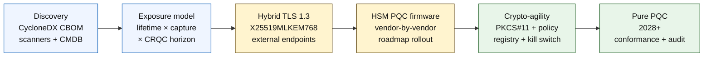

# Quantum-Safe Banking Index w 2026 r.: kryptografia postkwantowa, QKD, krypto-zwinność i ryzyko harvest-now-decrypt-later

<!-- lead-start: manual -->
<aside class="post-lead" aria-label="Podsumowanie artykułu">

<strong>TL;DR.</strong> Bankowość kwantowo-bezpieczna w 2026 r. to program dostawczy, którego termin wyznacza przecięcie dwóch krzywych — długości życia poufnych danych, którymi instytucja dysponuje dziś, oraz horyzontu pojawienia się komputera kwantowego istotnego kryptograficznie (CRQC). Standardy NIST FIPS 203 / 204 / 205 są finalne od sierpnia 2024 r.; CNSA 2.0 wyznacza stan docelowy dla administracji federalnej USA na 2033 r.; harvest-now-decrypt-later dzieje się już dziś na długoterminowych danych. Karta wyników kwantowych dla zarządu śledzi cztery dokładne wskaźniki procentowe: kompletność inwentaryzacji, ekspozycję HNDL, postęp migracji NIST i gotowość krypto-zwinności.

<strong>Kluczowe wnioski</strong>

<ul class="post-lead-takeaways">
  <li><strong>Debata o algorytmach zamknęła się 13 sierpnia 2024 r.</strong> Odpowiedzią są ML-KEM (FIPS 203), ML-DSA (FIPS 204) i SLH-DSA (FIPS 205). Banki, które w 2026 r. nadal prowadzą wewnętrzne ewaluacje, by „wybrać zwycięzcę", są spóźnione o 18 miesięcy.</li>
  <li><strong>Harvest-now-decrypt-later obowiązuje już dziś.</strong> Wszystko, czego długość życia poufności sięga poza wiarygodny moment pojawienia się CRQC — kredyty hipoteczne na 30 lat, underwriting ubezpieczeń na życie, nagrania transakcji w ramach MiFID II / RODO, archiwa retencyjne M&amp;A — musi przejść na hybrydową, kwantowo-bezpieczną enkapsulację kluczy teraz, a nie w dniu ogłoszenia CRQC.</li>
  <li><strong>Inwentaryzacja jest progiem warunkującym dojrzałość.</strong> Kryptograficzny Bill of Materials (CBOM) — protokół, biblioteka, certyfikat, partycja HSM, zależność dostawcy, właściciel aplikacji, długość życia klasyfikacji danych — to warunek wstępny wszystkiego pozostałego. Mierz aktualność, nie pokrycie.</li>
  <li><strong>Hybrydowy TLS 1.3 to wdrożenie 2026 r.</strong> Hybrydowy key share X25519MLKEM768 to to, co Chrome / Firefox / Cloudflare / Akamai faktycznie dziś negocjują. Czysty TLS na ML-KEM czeka na firmware HSM i gotowość CA.</li>
  <li><strong>Krypto-zwinność to trwały produkt.</strong> Abstrakcja PKCS#11, etykietowane klucze, rejestr polityk mapujący usługę biznesową na dopuszczony zestaw algorytmów. Bez tego kolejne przejście algorytmiczne to znów wieloletni program.</li>
</ul>
</aside>
<!-- lead-end -->

Bankowość kwantowo-bezpieczna w 2026 r. to migracja operacyjna, nie spekulacja. NIST sfinalizował pierwsze trzy standardy kryptografii postkwantowej, a banki muszą teraz zrozumieć, które systemy zależą od RSA, ECC, TLS, podpisów, HSM-ów, certyfikatów, kanałów płatniczych, archiwów i długoterminowych danych poufnych. Pytanie indeksowe jest proste: czy instytucja zdąży wymienić kryptografię, zanim zagrożenie stanie się operacyjne?

---

> **Streszczenie zarządcze / kluczowe wnioski**
>
> - **Standardy NIST są dziś konkretne.** FIPS 203 definiuje ML-KEM dla enkapsulacji kluczy, FIPS 204 definiuje ML-DSA dla podpisów, a FIPS 205 definiuje SLH-DSA jako bezstanowy standard podpisu opartego na funkcji skrótu.
> - **Inwentaryzacja to pierwszy próg dojrzałości.** Bank nie zmigruje tego, czego nie znajdzie: certyfikaty, klucze, protokoły, aplikacje, dostawcy, HSM-y, API, archiwa i systemy wbudowane muszą zostać zmapowane.
> - **Krypto-zwinność to trwały cel.** Nie chodzi o jednorazową podmianę algorytmu, lecz o zdolność zmiany prymitywów kryptograficznych bez przeprojektowania całych aplikacji.
> - **Długoterminowe dane zmieniają priorytet czasowy.** Ryzyko harvest-now-decrypt-later oznacza, że dane przechwycone dziś mogą zostać odszyfrowane później, jeśli pozostaną wartościowe wystarczająco długo.
> - **QKD to wyspecjalizowane uzupełnienie.** Kwantowa dystrybucja kluczy może być istotna dla kanałów o najwyższej wartości, ale nie zastępuje migracji PQC w skali całej instytucji.
>
---

## Dlaczego 2026 to rok, w którym ten indeks ma znaczenie

Trzy zmiany z lat 2024-2025 sprawiły, że bezpieczeństwo kwantowe stało się mierzalnym programem bankowym, a nie tematem badawczym do obserwacji. Po pierwsze, NIST sfinalizował główne standardy postkwantowe 13 sierpnia 2024 r.: [FIPS 203 (ML-KEM) ⧉](https://nvlpubs.nist.gov/nistpubs/FIPS/NIST.FIPS.203.pdf "FIPS 203 — Module-Lattice-Based Key-Encapsulation Mechanism"), [FIPS 204 (ML-DSA) ⧉](https://nvlpubs.nist.gov/nistpubs/FIPS/NIST.FIPS.204.pdf "FIPS 204 — Module-Lattice-Based Digital Signature Standard"), [FIPS 205 (SLH-DSA) ⧉](https://nvlpubs.nist.gov/nistpubs/FIPS/NIST.FIPS.205.pdf "FIPS 205 — Stateless Hash-Based Digital Signature Standard"). Tego dnia zamknięto debatę o wyborze algorytmów; banki, które w 2026 r. nadal prowadzą wewnętrzne strumienie prac „który schemat wygra", są spóźnione o 18 miesięcy.

Po drugie, [CNSA 2.0 NSA ⧉](https://media.defense.gov/2022/Sep/07/2003071834/-1/-1/0/CSA_CNSA_2.0_ALGORITHMS_.PDF "Commercial National Security Algorithm Suite 2.0") wyznacza stan docelowy administracji federalnej USA na 2033 r., z pośrednimi terminami od 2027 r. dla podpisywania oprogramowania i firmware, a od 2030 r. dla przeglądarek i systemów operacyjnych. Każdy bank z ekspozycją na kontrahentów federalnych USA — FedNow, operacje Treasury, rachunki klientów federalnych — znajduje się wewnątrz tego perymetru w systemach dotykających danych federalnych. Zegar przestał być abstrakcyjny.

Po trzecie, [Harvest-Now-Decrypt-Later (HNDL) ⧉](https://csrc.nist.gov/Projects/post-quantum-cryptography "Program kryptografii postkwantowej NIST") to nośny argument ryzyka uzasadniający pilność. Wyrafinowani przeciwnicy przechwytują już dziś chronione przez TLS komunikaty płatnicze, koperty SWIFT, dokumentację KYC i długoterminowy szyfrogram archiwalny w głównych centrach finansowych. Dane przechwycone w 2026 r. muszą pozostać poufne tylko w momencie ich odszyfrowania — w przypadku kredytów hipotecznych na 30 lat, underwritingu ubezpieczeń na życie, nagrań transakcji w ramach MiFID II / RODO oraz archiwów retencyjnych M&A okno to wykracza daleko poza wszystkie wiarygodne szacunki pojawienia się komputera kwantowego istotnego kryptograficznie (CRQC). Przeciwnik nie potrzebuje komputera kwantowego dziś. Potrzebuje go, zanim dane stracą znaczenie.

Quantum-Safe Banking Index mierzy, czy instytucja jest w stanie dostarczyć migrację przed tym przecięciem. Nie chodzi już o to, czy migrować, lecz o to, czy migracja zakończy się w terminie możliwym do obrony.

## Architektura indeksu na 2026 r.

| Warstwa indeksu | Kierunek na 2026 r. | Metryka gotowości | Ryzyko przy złym podejściu |
|---|---|---|---|
| **Inwentaryzacja** | Mapowanie aktywów kryptograficznych, protokołów, certyfikatów, dostawców i klas danych | Procent zinwentaryzowanego stanu | Nieznane zależności podatne na atak kwantowy |
| **Ekspozycja** | Klasyfikacja systemów wg długości życia poufności i krytyczności transakcyjnej | Aktywa wysokiego ryzyka wg wartości i długości życia | Błędnie spriorytetyzowana migracja |
| **Migracja** | Wdrożenie wzorców hybrydowych i PQC-ready zgodnych ze standardami NIST | Gotowość ML-KEM i ML-DSA | Awaryjna przebudowa platformy pod presją terminu |
| **Krypto-zwinność** | Oddzielenie logiki aplikacyjnej od prymitywów kryptograficznych | Pokrycie kryptografią sterowaną polityką | Algorytmy zakodowane na stałe w całym majątku IT |
| **Zapewnienie jakości** | Testy interoperacyjności, wydajności, wsparcia HSM, certyfikatów i gotowości dostawców | Wskaźnik zdawalności testów i zaległości wyjątków | Zerwane kanały lub słabe mechanizmy zabezpieczające awaryjne |

### Karta wyników kwantowych dla zarządu

Wiarygodna karta wyników gotowości kwantowej wymaga śledzenia dokładnych wskaźników procentowych, nie tylko statusów projektów:

1. **Kompletność inwentaryzacji:** procent aplikacji tier-1 z w pełni zmapowanym kryptograficznym Bill of Materials (CBOM).
2. **Ekspozycja HNDL:** wolumen długoterminowych danych poufnych (np. PII, tajemnic handlowych) przesyłanych przez sieć bez hybrydowej kwantowo-bezpiecznej enkapsulacji kluczy.
3. **Postęp migracji NIST:** procent kluczy asymetrycznych i podpisów cyfrowych zmigrowanych do standardów FIPS 203 (ML-KEM) i FIPS 204 (ML-DSA).
4. **Gotowość krypto-zwinności:** procent systemów krytycznych, w których algorytmy kryptograficzne można rotować za pomocą scentralizowanej polityki bez konieczności rekompilacji kodu.

## Sygnały do śledzenia w 2026 r.

| Sygnał | Co to znaczy dla banków | Źródło |
|---|---|---|
| **FIPS 203 ML-KEM** | Główny standard NIST dla ustanawiania kluczy szyfrowania ogólnego przeznaczenia | [NIST ⧉](https://www.nist.gov/news-events/news/2024/08/nist-releases-first-3-finalized-post-quantum-encryption-standards "First three finalized post-quantum encryption standards") |
| **FIPS 204 ML-DSA** | Główny standard NIST dla podpisów cyfrowych | [NIST ⧉](https://www.nist.gov/news-events/news/2024/08/nist-releases-first-3-finalized-post-quantum-encryption-standards "First three finalized post-quantum encryption standards") |
| **FIPS 205 SLH-DSA** | Alternatywa oparta na funkcji skrótu i konstrukcja zapasowa | [NIST ⧉](https://www.nist.gov/news-events/news/2024/08/nist-releases-first-3-finalized-post-quantum-encryption-standards "First three finalized post-quantum encryption standards") |
| **Zalecana natychmiastowa integracja** | NIST wprost mówi administratorom, by rozpocząć integrację standardów, bo pełna integracja zajmuje czas | [NIST ⧉](https://www.nist.gov/news-events/news/2024/08/nist-releases-first-3-finalized-post-quantum-encryption-standards "First three finalized post-quantum encryption standards") |
| **Programy kwantowe banków rosną** | Główne banki badają technologie kwantowe, jednocześnie przygotowując transformacje PQC | [Quantum Insider ⧉](https://thequantuminsider.com/2026/03/27/15-plus-global-banks-probing-the-wonderful-world-of-quantum-technologies/ "Przegląd globalnych banków eksplorujących technologie kwantowe") |

## Migracja zaczyna się od księgi kryptografii

Sekwencja migracji jest na tym etapie dobrze rozpoznana. Każda bramka produkuje dowody napędzające kolejną; pominięcie lub skompresowanie bramki generuje to ryzyko awaryjnej przebudowy platformy, które pojawia się w kolumnie porażek architektury indeksu.

Pierwszym produktem nie jest nowy algorytm; jest nim kryptograficzny bill of materials (CBOM). Banki potrzebują żywej inwentaryzacji łączącej usługi biznesowe z algorytmami, bibliotekami, certyfikatami, długościami kluczy, HSM-ami, długościami życia danych, dostawcami i właścicielami operacyjnymi. Bez tej księgi migracja kwantowo-bezpieczna staje się zgadywanką.

Zestaw rekordów CBOM powinien rejestrować, dla każdego prymitywu kryptograficznego: protokół lub interfejs (TLS 1.3, IPsec, SSH, własny format komunikatu płatniczego), algorytm i zestaw parametrów (RSA-2048, ECDH P-256, ML-KEM-768, ML-DSA-65), bibliotekę i wersję (OpenSSL 3.4, hash commita BoringSSL, build SDK dostawcy), granicę sprzętową (partycja HSM, TPM, secure enclave lub żadna), tożsamość certyfikatu jeśli dotyczy, właściciela aplikacji i długość życia klasyfikacji danych. Narzędzia trafiające na produkcję w latach 2025-2026 — IBM Quantum Safe Inventory, otwarta [specyfikacja CycloneDX CBOM ⧉](https://cyclonedx.org/capabilities/cbom/ "CycloneDX Cryptography Bill of Materials"), skanery klasy enterprise od CryptoNext / Sandbox / PQShield — integrują się z istniejącymi potokami CMDB. Żadne z nich nie jest samodzielnie kompletne; zakładaj cykl budowy CBOM trwający 12-18 miesięcy nawet przy wsparciu narzędzi dostawcy i dedykowanych ludziach.

Metryką, którą trzeba śledzić, jest aktualność, nie pokrycie. CBOM nieaktualny od dwóch miesięcy jest gorszy od braku CBOM, bo daje zespołowi bezpieczeństwa fałszywe poczucie pewności co do tego, co zostało zmigrowane.

## Najpierw hybryda, zawsze zwinność

Większość banków nie przełączy wszystkiego jednocześnie. Realistycznym wzorcem jest wdrożenie hybrydowe, w którym mechanizmy klasyczne i postkwantowe działają równolegle, podczas gdy dostawcy, protokoły, certyfikaty i narzędzia operacyjne dojrzewają. Celem długoterminowym jest krypto-zwinność: wybory kryptograficzne sterowane polityką, które można zmieniać bez przebudowy aplikacji biznesowej.

[Insert Interactive Component: Harvest-Now-Decrypt-Later (HNDL) Risk Calculator — narzędzie suwakowe, w którym kadra zarządcza wprowadza długość życia danych i szacowany horyzont kwantowy, by zobaczyć swoje okno ekspozycji.]

> **Kluczowy wniosek:** Jeśli twoje dane muszą pozostać poufne przez 10 lat, a komputer kwantowy istotny kryptograficznie (CRQC) dzieli od nas 7 lat, termin twojej migracji nie wypada za 7 lat — wypadł 3 lata temu.

W praktyce oznacza to TLS 1.3 z hybrydowym key share `X25519MLKEM768` dla endpointów zewnętrznych (Chrome / Firefox / Cloudflare / Akamai obsługują to dziś), klasyczne łańcuchy podpisów do czasu, gdy nadrobią to infrastruktura HSM i CA, oraz warstwę abstrakcji PKCS#11 pozwalającą rejestrowi polityk rotować algorytmy bez rekompilowania aplikacji biznesowych. Krypto-zwinność decyduje o tym, czy następne przejście algorytmiczne (kiedy, nie czy) będzie rotacją trwającą sześć tygodni, czy kolejnym siedmioletnim programem.

## Gdzie pasuje QKD

Kwantowa dystrybucja kluczy znajduje miejsce w indeksie jako opcja kanału o wysokiej wrażliwości, zwłaszcza dla infrastruktury rynków finansowych, łączności z bankami centralnymi i wyjątkowo wrażliwych przepływów instytucjonalnych. Należy ją traktować jako uzupełnienie PQC, a nie pretekst do opóźnienia migracji w skali przedsiębiorstwa.

## Co to oznacza w podziale na typ banku

### Globalne banki o znaczeniu systemowym

Trudnym problemem jest skala: dziesiątki tysięcy endpointów TLS, setki partycji HSM, dziesiątki wewnętrznych urzędów certyfikacji, setki aplikacji biznesowych z osadzonymi prymitywami kryptograficznymi oraz SDK dostawców, których bank nie może modyfikować. Inwestycja to nie kolejny pilotaż; to narzędzia CBOM, warstwa abstrakcji PKCS#11 wpięta w każdy nowy build, plan konsolidacji HSM wybierający jednego dostawcę jako wiodącego dla firmware PQC i akceptujący wieloletni ogon dla pozostałych, oraz rejestr polityk, który staje się trwałą powierzchnią krypto-zwinności długo po zakończeniu migracji FIPS 203 / 204 / 205.

### Banki transakcyjne i korporacyjne

Zakres migracji jest węższy niż w warstwie G-SIB, ale ekspozycja HNDL jest dotkliwa: komunikacja transgraniczna SWIFT, ustrukturyzowane dane płatnicze niosące PII kontrahentów korporacyjnych, platformy wymiany dokumentów przechowujące dokumentację finansowania handlu oraz archiwa raportowe o długiej retencji. Stawiaj priorytet na hybrydowy TLS na każdym endpoincie obsługującym klienta i PQC w spoczynku dla archiwów retencyjnych. Dociskaj odpowiedzialność dostawców HSM — zespół platformy bankowości korporacyjnej ma bezpośrednią dźwignię zakupową, której zespół technologii hurtowej często nie ma.

### Banki regionalne

Kupuj stos dostawcy, który już ma prymitywy krypto-zwinności. Wybierz platformę core banking, której dostawca publikuje CBOM i deklaruje harmonogramy wsparcia dla ML-KEM / ML-DSA. Sprawdź, czy mapa drogowa HSM dostawcy jest spójna z terminem migracji banku. Pojemność inżynierska potrzebna do zbudowania krypto-zwinności od zera to wieloletni nakład; dostawca rozkłada ten koszt na wielu klientów, a bank dziedziczy korzyść. Praca walidacyjna — sprawdzenie, czy deklaracje dostawcy wytrzymują proces MRM instytucji — to legitymowany zakres wewnętrzny.

### Fintechy, PSP i dostawcy infrastruktury

Konkurencyjnym pytaniem dla dostawców sprzedających bankom w 2026 r. nie jest „czy wspieracie PQC". Brzmi ono „czy potraficie wyprodukować CycloneDX CBOM dla swojej platformy, macierz wsparcia dostawców HSM oraz pisemne SLA na rotację algorytmu". Dostawcy, którzy odpowiedzą twierdząco, przejdą bramki zakupowe tier-1 w latach 2026-2027. Ci, którzy nie potrafią, stracą cykl odnowienia na rzecz konkurenta, który potrafi.

## Wnioski

Bankowość kwantowo-bezpieczna w 2026 r. to nie temat badawczy do obserwacji; to program dostawczy, którego termin wyznacza przecięcie dwóch krzywych — długości życia poufności danych instytucji oraz horyzontu pojawienia się komputera kwantowego istotnego kryptograficznie. Instytucje, które w 2030 r. będą wyglądały wiarygodnie w oczach regulatorów i kontrahentów, to te, które rozpoczęły budowę CBOM w 2024 r., wdrożyły hybrydowy TLS na każdym zewnętrznym endpoincie do końca 2026 r. i zaprojektowały krypto-zwinność w każdym nowym buildzie od pierwszego dnia. Te, które tego nie zrobiły, dowiedzą się, czy ich okno migracyjne już się zamknęło dla danych, które ich przeciwnik zbiera dziś.

Mierz migrację tak, jak mierzysz każdy program operacyjny: znany zakres, ustalona kolejność, zaplanowane terminy, uczciwe rejestry wyjątków. Im uczciwiej patrzysz na własny majątek IT, tym węższe wydaje się okno migracyjne.

## Najczęściej zadawane pytania

**Co bank powinien zinwentaryzować jako pierwsze?**

Zacznij od TLS wystawionego na zewnątrz, kanałów płatniczych, uwierzytelniania klienta, łączności międzybankowej, usług opartych o HSM, archiwów długoterminowych i systemów obsługujących dane poufne o długim okresie użyteczności.

**Czy PQC to wyłącznie zagadnienie cyberbezpieczeństwa?**

Nie. Dotyczy płatności, tożsamości, dowodu prawnego, podpisywania transakcji, zaufania klienta, retencji danych, zarządzania dostawcami i odporności operacyjnej.

**Co oznacza krypto-zwinność?**

Krypto-zwinność to zdolność zmiany prymitywów kryptograficznych za pomocą polityk i kontrolek platformowych, a nie zmian zakodowanych na stałe w aplikacji.

**Czy banki powinny czekać na kolejne standardy?**

Nie. NIST zachęca administratorów, by rozpocząć integrację pierwszych finalnych standardów, bo pełna integracja zajmuje czas.

## Odwołania

- NIST, (2026). [Pierwsze trzy sfinalizowane standardy szyfrowania postkwantowego ⧉](https://www.nist.gov/news-events/news/2024/08/nist-releases-first-3-finalized-post-quantum-encryption-standards "First three finalized post-quantum encryption standards").

<!-- enrich-start -->
<aside class="author-card" aria-label="O autorze"><strong class="author-card-name"><a href="/about/index.html">Sebastien Rousseau</a></strong>Senior banking technologist piszący o stosowanej AI, infrastrukturze płatności, tokenizowanym pieniądzu, ISO 20022, bezpieczeństwie postkwantowym, cloud-native usługach finansowych i regulowanych rynkach cyfrowych.Ponad 20 lat doświadczenia w HSBC Commercial &amp; Investment Bank, PayPal, Barclays, Shazam, AKQA, Virgin Group. <a href="/about/index.html">Pełny profil</a> &middot; <a href="https://www.linkedin.com/in/sebastienrousseau/" rel="external noopener">LinkedIn</a> &middot; <a href="https://github.com/sebastienrousseau" rel="external noopener">GitHub</a></aside>

Ostatnia weryfikacja <time datetime="2026-06-04">2026-06-04</time>.

<!-- enrich-end -->
