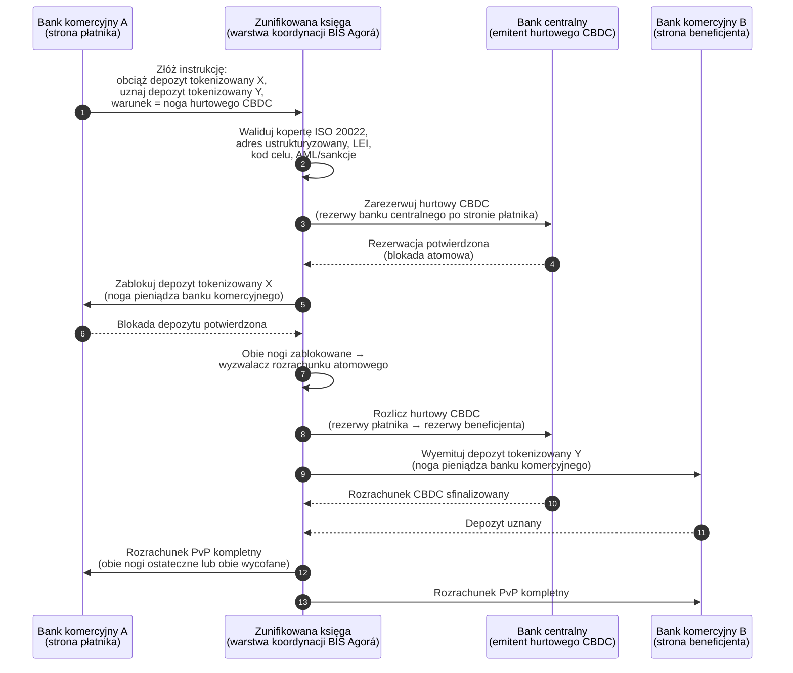

<!-- lead-start: manual -->
<aside class="post-lead" aria-label="Streszczenie artykułu">

<strong>TL;DR.</strong> Płatności hurtowe w 2026 znajdują się na przecięciu dwóch strukturalnych przesunięć: ISO 20022 wprowadza strukturyzowane dane płatnicze do modelu operacyjnego, a depozyty tokenizowane wraz z BIS Project Agorá przesuwają rozrachunek transgraniczny w stronę atomowych, programowalnych szyn dostępnych przez całą dobę. Pytaniem 2026 dla banku nie jest już „czy zmigrowaliśmy komunikaty”, lecz „czy nasze operacje płatnicze są mierzalne, routowane i nadzorowalne” — a indeks rozkłada je na cztery konkretne procenty: kompletność danych strukturyzowanych, optymalność routingu szyn, opóźnienie ostateczności rozrachunku i pokrycie korytarzy Agorá.

<strong>Najważniejsze wnioski</strong>

<ul class="post-lead-takeaways">
  <li><strong>Listopad 2026 to twardy termin, a nie wskazówka.</strong> SWIFT wycofuje wsparcie dla niestrukturyzowanych adresów w SR 2026; płatności bez miasta i kraju w wyznaczonych polach przestają być rozliczane. Koszt naprawy, wskaźnik odrzuceń i zdolność operacyjna przechodzą z „metryki” do „postawy widocznej dla nadzorcy”.</li>
  <li><strong>Depozyty tokenizowane biją stablecoiny w regulowanym hurcie.</strong> Zachowują relację bank-deponent oraz aktywo rozrachunkowe banku centralnego, jednocześnie udostępniając programowalność. Stablecoiny utrzymują rolę na obrzeżach; depozyty tokenizowane kotwiczą rdzeń.</li>
  <li><strong>BIS Project Agorá to referencyjny korytarz.</strong> Jeśli transgraniczny produkt banku nie zadziała w korytarzu Agorá do 2027, konkuruje na szynie, którą reszta rynku już opuszcza.</li>
  <li><strong>Orkiestracja szyn czasu rzeczywistego jest modelem operacyjnym.</strong> Decyzja multi-rail w 2026 (FedNow / RTP / TIPS / SEPA Inst / on-chain) to nie pytanie „która szyna” — to rejestr polityk, profil płynności i silnik routingu, który wybiera szynę dla danej płatności.</li>
  <li><strong>Mierz albo daj się zmierzyć.</strong> Cztery procenty — kompletność danych strukturyzowanych, optymalność routingu szyn, opóźnienie ostateczności rozrachunku, pokrycie korytarzy Agorá — przekładają postawę płatniczą na dowód gotowy dla nadzorcy przed oknem audytowym 2026/27.</li>
</ul>
</aside>
<!-- lead-end -->

# Indeks płatności hurtowych w 2026: ISO 20022, depozyty tokenizowane, szyny czasu rzeczywistego i rozrachunek transgraniczny

Płatności hurtowe w 2026 są przekształcane przez dwa równoczesne przesunięcia: strukturyzowane dane płatnicze oraz programowalny rozrachunek. Listopadowy kamień milowy SWIFT dotyczący strukturyzowanego adresu w 2026 wymusza wprowadzenie jakości danych do modelu operacyjnego, a BIS Project Agorá oraz depozyty tokenizowane testują, czy rozrachunek transgraniczny może stać się bardziej atomowy, transparentny i działający w trybie ciągłym.

---

> **Streszczenie wykonawcze / Najważniejsze wnioski**
>
> - **Listopad 2026 to twardy kamień milowy danych.** SWIFT zapowiada, że płatności zawierające niestrukturyzowane adresy nie będą wspierane po zmianie SR 2026.
> - **Dane strukturyzowane stają się infrastrukturą produktową.** Miasto i kraj muszą minimum znaleźć się w wyznaczonych polach, co zamienia jakość danych płatniczych w sprawę klienta, operacji i compliance.
> - **Depozyty tokenizowane są opcją projektową w hurcie.** Project Agorá bada tokenizowane depozyty banków komercyjnych i tokenizowane rezerwy banku centralnego w modelu zunifikowanej księgi.
> - **Indeks powinien mierzyć jakość rozrachunku, nie tylko prędkość.** Ostateczność, transparentność, wskaźniki naprawy, wykorzystanie płynności, dane compliance oraz widoczność po stronie klienta mają znaczenie równie duże jak natychmiastowe wykonanie.
> - **Płatności transgraniczne pozostają agendą publiczno-prywatną.** FSB nadal prowadzi roadmapę G20 przez fazę wdrażania, w koordynacji sektora publicznego i prywatnego.
>
---

## Dlaczego 2026 jest rokiem, w którym ten indeks ma znaczenie

Stanford AI Index jest użyteczny, ponieważ traktuje szybko zmieniającą się dziedzinę technologii jako coś, co można zmierzyć: wynik badań, wydajność techniczna, odpowiedzialne wdrożenie, ekonomia, adopcja sektorowa, polityka i nastroje publiczne zostały sprowadzone do jednych ram ([Stanford HAI ⧉](https://hai.stanford.edu/ai-index/2026-ai-index-report "The 2026 AI Index Report")). Banki i instytucje finansowe potrzebują teraz tej samej dyscypliny dla infrastruktury. Agentic AI, bezpieczeństwo quantum-safe, odporność cloud-native i płatności hurtowe nie są już oddzielnymi torami innowacji; zbiegają się w jeden model operacyjny.

Praktyczne pytanie dla banku nie brzmi, czy każda z tych dziedzin jest ważna. Brzmi ono: czy instytucja potrafi mierzyć gotowość we wszystkich naraz. Bank może wdrożyć agentic AI i nadal być kruchy, jeśli jego kryptografia nie jest gotowa do migracji. Może zmodernizować platformy chmurowe i nadal upaść, jeśli dane płatnicze pozostają niestrukturyzowane. Może prowadzić piloty tokenizacji i nadal tworzyć ryzyko systemowe, jeśli warstwy rozrachunku, płynności, tożsamości i dziennika audytu nie są projektowane razem.

## Architektura indeksu 2026

| Warstwa indeksu | Kierunek 2026 | Metryka gotowości | Ryzyko przy złym wykonaniu |
|---|---|---|---|
| **Dane ISO 20022** | Przejście od tekstu niestrukturyzowanego do zarządzanych pól strukturyzowanych | Gotowość strukturyzowanego adresu i wskaźnik odrzuceń | Odrzucenia płatności i ręczna naprawa |
| **Orkiestracja szyn** | Routing pomiędzy RTGS, instant, korespondencyjnymi, stablecoinami i szynami tokenizowanymi | Koszt, prędkość, ostateczność i routing świadomy jurysdykcji | Pofragmentowane szyny z duplikowanymi kontrolami |
| **Rozrachunek tokenizowany** | Wykorzystanie depozytów tokenizowanych i pieniądza banku centralnego tam, gdzie redukują tarcia | Pokrycie DvP, PvP, rozrachunku atomowego | Aktywa pilotażowe bez wartości w przepływie biznesowym |
| **Płynność** | Optymalizacja płynności śróddziennej, uwięzionej gotówki i okien rozrachunku | Zaoszczędzona płynność i redukcja niepowodzeń rozrachunku | Szybsze drenowanie płynności |
| **Compliance** | Wbudowanie wymogów AML, sankcji, FATF i audytu w dane płatnicze | Compliance straight-through i wyjaśnialność | Bogatsze dane bez silniejszych kontroli |

## Kluczowe sygnały płatności hurtowych zmapowane na priorytety globalne

Zestaw sygnałów 2026 nie jest agendą badawczą. Jest listą kontrolną dostarczenia, z której Chief Payments Officer banku jest już rozliczany. Praca remediacyjna pojawia się w trzech miejscach: w kopercie komunikatu, w warstwie orkiestracji szyn i w księdze rozrachunkowej.

| Sygnał | Odniesienie G20 / SWIFT / BIS | Wdrożenie na platformie technicznej |
|---|---|---|
| **65 % komunikatów płatniczych nadal zawiera adresy niestrukturyzowane** | [SWIFT SR 2026 — kamień milowy adresu ustrukturyzowanego, listopad 2026 ⧉](https://www.swift.com/news-events/news/iso-20022-milestone-november-2026-unstructured-addresses-be-removed "ISO 20022 November 2026 structured address milestone") | Walidacja schematu w middleware płatności przed dotarciem komunikatu do adaptera SWIFTNet; zautomatyzowane parsowanie adresów na styku kanału korporacyjnego i banku korespondenta. |
| **Cel G20 FSB: 75 % płatności transgranicznych zrealizowanych w ciągu 1 godziny do 2027** | [Roadmapa FSB płatności transgranicznych, faza wdrażania 2026 ⧉](https://www.fsb.org/2026/03/fsb-kicks-off-new-implementation-phase-to-enhance-cross-border-payments-through-public-private-partnership/ "FSB cross-border payments implementation phase") | Bramki konwersji FX czasu rzeczywistego z uzgodnionymi oknami płynności; haki potwierdzeń T+0 wpięte w portal klienta; silnik routingu szyn wykluczający każdy korytarz, który nie zmieści się w kopercie 1 h. |
| **Cel G20 FSB: średni koszt transakcji transgranicznej poniżej 1 %, detaliczna poniżej 3 %** | [Cele ilościowe G20 FSB ⧉](https://www.fsb.org/2026/03/fsb-kicks-off-new-implementation-phase-to-enhance-cross-border-payments-through-public-private-partnership/ "FSB cross-border payments implementation phase") | Telemetria atrybucji kosztu na każdym korytarzu (spread FX, opłata korespondenta, koszt lifting); rejestr polityk marży ujawniający niezgodną wycenę przed kwotowaniem. |
| **BIS Project Agorá wchodzi w fazę prototypu w siedmiu bankach centralnych i 41 bankach komercyjnych** | [BIS Project Agorá ⧉](https://www.bis.org/about/bisih/topics/fmis/agora.htm "Project Agorá") | Specyfikacja integracji zunifikowanej księgi: węzeł księgi depozytów tokenizowanych + warstwa rozrachunku hurtowego CBDC + haki KYC/AML; pule płynności on-chain wymiarowane do udziału banku w korytarzu. |
| **Ramy „digital money” Deutsche Bank krystalizują się w architekturze klienta** | [Deutsche Bank — Digital Money: stablecoiny, depozyty tokenizowane i CBDC ⧉](https://flow.db.com/publications/flow-white-papers-and-guides/digital-money-a-perspective-on-stablecoins-tokenised-deposits-and-cbdcs "Digital Money: stablecoins, tokenised deposits and CBDCs") | Niezależne od portfela API rozrachunku abstrahujące wybór stablecoina / depozytu tokenizowanego / CBDC dla każdej płatności; warunki programowalne ewaluowane wobec rejestru polityk banku, nie klienta. |

## Punkt zwrotny w danych płatniczych

ISO 20022 przeszło z projektu formatu komunikatów do modelu operacyjnego jakości danych. Jeśli dane beneficjenta, dłużnika, wierzyciela, agenta, miasta, kraju, celu i strony są słabe, bank doświadczy odrzuceń, napraw, tarcia sankcyjnego, frustracji klienta i słabej analityki.

**SR 2026 czyni z tego twardy kontrakt, a nie zalecenie.** SWIFT Standards Release 2026 (listopad 2026) egzekwuje regułę adresu ustrukturyzowanego na warstwie sieci — komunikaty, których element `<PstlAdr>` nie zawiera `<TwnNm>` oraz `<Ctry>`, zostaną odrzucone w momencie odbioru przez stos walidacyjny SWIFTNet, a nie oznaczone do naprawy. Kolejka napraw przestaje być linią kosztu back-office i staje się zdarzeniem niepowodzenia rozrachunku z widocznym dla klienta opóźnieniem. Zespoły operacyjne traktujące SR 2026 jako „zaostrzone wytyczne” pracują z błędnego runbooka.

### Zgodność strukturyzowanych danych płatniczych w ramach ISO 20022

Powierzchnia remediacji jest wąska i dobrze zdefiniowana. Poniższe elementy XML to miejsca, w których listopadowy stos walidacyjny SWIFTNet 2026 faktycznie odrzuca komunikaty; reszta to konsekwencja po stronie downstream.

| Element danych | Tag XML ISO 20022 | Wymóg SWIFT na listopad 2026 | Strategia remediacji technicznej |
|---|---|---|---|
| **Adres ustrukturyzowany** | `<PstlAdr>` zawierający `<TwnNm>` + `<Ctry>` | Obowiązkowy. Niestrukturyzowany tekst `<AdrLine>` wyzwala odrzucenie sieciowe na odbierającym adapterze SWIFTNet. | Zautomatyzowane parsowanie adresów na etapie inicjacji płatności; przeprojektowanie formularzy w kanałach korporacyjnych; oczyszczanie back-booka każdego kontrahenta przed kolejnym obciążeniem. |
| **Identyfikator podmiotu prawnego (LEI)** | `<Id>` pod `<OrgId>` | Zdecydowanie zalecany do weryfikacji niefizycznych kontrahentów finansowych; obowiązkowy w kilku korytarzach CBPR+. | Wyszukiwanie LEI + weryfikacja krzyżowa GLEIF na etapie onboardingu korporacyjnego; automatyczne wzbogacanie kontrahentów back-booka przez usługi danych referencyjnych. |
| **Kody celu płatności** | `<Purp>` zawierający `<Cd>` | Obowiązkowy w wielu regionalnych korytarzach czasu rzeczywistego (CBPR+, SEPA Inst, TIPS) dla zautomatyzowanego screeningu AML / sankcji. | Mapowanie wewnętrznych kodów transakcji banku na standardową listę ISO 20022 ExternalPurposeCode; wystawienie wyboru celu w UI kanału korporacyjnego; domyślna odmowa dla nieznanych kodów. |
| **Strony ostateczne** | `<UltmtDbtr>` / `<UltmtCdtr>` | Ujawnić kontekst beneficjenta ostatecznego, aby spełnić parametry G20 FATF travel-rule + sankcji; obowiązkowe dla kilku kodów typu płatności. | Wyciąganie nazw stron end-to-end z subkont księgi; uzgodnienie z grafem KYC; ujawnianie strony ostatecznej na każdym potwierdzeniu. |
| **Informacja remitencyjna (strukturyzowana)** | `<RmtInf><Strd>` z `<RfrdDocInf>` | Wymagana dla uzgadnialnych korporacyjnych płatności powiązanych z fakturą w CBPR+ Faza 2. | Przechwytywanie strukturyzowanej remitencji w portalu korporacyjnym na etapie kwotowania; odrzucanie fallbacku w wolnym tekście dla przepływów wysokokwotowych. |

## Depozyty tokenizowane i hurtowe CBDC

Depozyty tokenizowane zachowują model pieniądza banku komercyjnego, dodając programowalność. Hurtowy pieniądz banku centralnego zachowuje ostateczność rozrachunku. Interesujący wzorzec projektowy to ich kombinacja: pieniądz banku komercyjnego dla relacji z klientami i pośrednictwa kredytowego, pieniądz banku centralnego dla ostatecznego rozrachunku i zaufania systemowego.

Project Agorá nadaje tej kombinacji konkretny kształt. Poniższa architektura to referencyjny wzorzec BIS dla atomowego, transgranicznego rozrachunku payment-versus-payment (PvP) z wykorzystaniem zarówno księgi depozytów banku komercyjnego, jak i warstwy rozrachunku hurtowego CBDC, koordynowanych przez zunifikowaną księgę.

Rozrachunek jest atomowy z definicji konstrukcyjnej: obie nogi commitują się lub obie się wycofują. Ostateczność rozrachunku na nodze hurtowego CBDC sprawia, że transfer depozytu tokenizowanego banku komercyjnego staje się skuteczny bez ryzyka korespondenta. Zunifikowana księga jest warstwą koordynacji, a nie systemem płatności samym w sobie — bank centralny nadal emituje aktywo rozrachunkowe, a bank komercyjny nadal księguje zobowiązanie depozytowe.

## Nowy produkt płatności hurtowych

Produkt nie jest już zwykłą płatnością. To pakiet wykonania, danych, płynności, compliance, śledzenia i zarządzania wyjątkami. Banki, które potrafią udostępnić te funkcjonalności przez API i dashboardy klienckie, zamienią compliance infrastrukturalny w wartość dla klienta.

## Co to oznacza dla różnych typów banków

### Globalne banki o znaczeniu systemowym

Banki globalne powinny traktować ten indeks jako kartę wyników architektury korporacyjnej. Priorytetem nie jest kolejny proof of concept; to dowód, że przepływy autonomiczne, migracja kryptograficzna, zależność od chmury i modernizacja płatności są zarządzane jako jeden system ryzyka i wartości.

### Banki transakcyjne i korporacyjne

Banki transakcyjne powinny skupić się na płatnościach hurtowych, danych strukturyzowanych, płynności, depozytach tokenizowanych i agentic usługach treasury. Najcenniejsza propozycja dla klienta to nie sam szybszy przepływ pieniędzy; to przepływ wyjaśnialny, audytowalny i programowalny, z mniejszą liczbą dochodzeń i lepszą widocznością kapitału obrotowego.

### Banki regionalne

Banki regionalne powinny używać indeksu, by uniknąć rozrostu programów. Nie muszą prowadzić każdej granicy, ale potrzebują wiarygodnych pozycji w obszarze nadzoru nad AI, inwentaryzacji post-quantum, dowodów wyjścia z chmury i gotowości danych płatniczych.

### Fintechy, PSP i dostawcy infrastruktury

Fintechy i dostawcy infrastruktury powinni dopasować swoje roadmapy produktowe do mierzalnej gotowości banków. Najlepsze propozycje zredukują ryzyko integracji, wzmocnią dowody i ułatwią bankom zarządzanie złożoną infrastrukturą.

## Wnioski

Wartość raportu w formacie indeksu polega na tym, że przekuwa pofragmentowaną agendę technologiczną w mierzalny model operacyjny. W 2026 zwycięzcami infrastruktury finansowej nie będą instytucje z największą liczbą pilotów. Będą nimi instytucje, które potrafią udowodnić gotowość naraz w autonomii, bezpieczeństwie, odporności, rozrachunku, ekonomii i nadzorze.

## Najczęściej zadawane pytania

**Dlaczego ISO 20022 nadal jest sprawą 2026?**

Ponieważ migracja nie jest kompletna, dopóki dane płatnicze nie są strukturyzowane, zarządzane, przechwytywane u źródła i użyteczne w kanałach, dla klientów oraz infrastruktur rynku.

**Czym jest depozyt tokenizowany?**

Depozyt tokenizowany to cyfrowa reprezentacja pieniądza banku komercyjnego, zaprojektowana tak, by zachować relację bank-deponent, jednocześnie umożliwiając programowalny rozrachunek.

**Czy depozyty tokenizowane zastępują stablecoiny?**

Nie wszędzie. Stablecoiny mogą pozostać użyteczne w niektórych kontekstach digital-asset i transgranicznych, podczas gdy depozyty tokenizowane są strukturalnie atrakcyjne dla regulowanej bankowości hurtowej.

**Co banki powinny mierzyć?**

Mierz gotowość danych strukturyzowanych, odrzucenia płatności, koszt naprawy, czas rozrachunku, wykorzystanie płynności, wyniki routingu szyn i widoczność po stronie klienta.

## Bibliografia

- SWIFT, (2026). [ISO 20022 November 2026 structured address milestone ⧉](https://www.swift.com/news-events/news/iso-20022-milestone-november-2026-unstructured-addresses-be-removed "ISO 20022 November 2026 structured address milestone").
- BIS Innovation Hub, (2026). [Project Agorá ⧉](https://www.bis.org/about/bisih/topics/fmis/agora.htm "Project Agorá").
- FSB, (2026). [Cross-border payments implementation phase ⧉](https://www.fsb.org/2026/03/fsb-kicks-off-new-implementation-phase-to-enhance-cross-border-payments-through-public-private-partnership/ "Cross-border payments implementation phase").
- Deutsche Bank, (2026). [Digital Money: stablecoins, tokenised deposits and CBDCs ⧉](https://flow.db.com/publications/flow-white-papers-and-guides/digital-money-a-perspective-on-stablecoins-tokenised-deposits-and-cbdcs "Digital Money: stablecoins, tokenised deposits and CBDCs").

<!-- enrich-start -->
<aside class="author-card" aria-label="O autorze"><strong class="author-card-name"><a href="/about/index.html">Sebastien Rousseau</a></strong>Senior banking technologist piszący o stosowanej AI, infrastrukturze płatniczej, tokenizowanym pieniądzu, ISO 20022, bezpieczeństwie post-quantum, cloud-native financial services oraz regulowanych rynkach cyfrowych.Ponad 20 lat doświadczenia w HSBC Commercial &amp; Investment Bank, PayPal, Barclays, Shazam, AKQA, Virgin Group. <a href="/about/index.html">Pełny profil</a> &middot; <a href="https://www.linkedin.com/in/sebastienrousseau/" rel="external noopener">LinkedIn</a> &middot; <a href="https://github.com/sebastienrousseau" rel="external noopener">GitHub</a></aside>

Ostatnia weryfikacja <time datetime="2026-06-06">2026-06-06</time>.

<!-- enrich-end -->
</content>
</invoke>
